# 2024网络安全系统教程！清华大佬花159小时讲完的网络安全系统课！别再盲目自学了，学完即可就业！零基础入门网络安全！（渗透测试／漏洞挖掘／CTF／黑客技术） - P72：59.配置socks连接内网shell.mp4 - 教网络安全的红客 - BV1ft421A7Nj

然后同样的这边的话，同样的是使用的这1个80端口作为一个突破口。就是他这边有一个这样的1个CMS，就在内网这1个2这个主机上面的话，有这样子1个CMS是吧？

然后这1个CMS的话就通过呃找历史漏洞啊以及分析啊，对吧？啊，它是存在这样子的一个收口注入漏洞。然后通过它的这个cirl输入漏洞的话，我们可以通过circle map直接跑出他的一个账号密码。

关于怎么去跑se map的话，呃，大家能。就关于社 map的一个使用呃，前面有讲嘛，前面应该有讲吧，对吧？应该不用我多说吧，就我们通过srcle map直接去进行一个呃跑出它一个账号密码。

然后在这边要去注意的话，就是说因为我们的这样子的一个呃我们要去跑的这个IP它是一个内网的IP。所以的话我们这种scle map这种工具，我们同样的需要通过这个pro做一个代理。其实就是说他那一个原理就。

就包括前面map以及这边的一个scle map对吧？它的这种扫描的话，它的一个原理其实就是我这边通过scle map去请求这边的这一个去发送这样子的相应的一个请求包，对吧？像这个IP发送请求包。

然后这个呃像这个IP指定的这个页面发送这一个请求包的话，它会把我们的这样子的一个请求的一个流量，通过这个说词的代理通道，对吧？然后的话转到我们这边内网的这个IP的一个页面上面去。其实就是呃就加这个Q券。

然后的话把我们的这个流量代移到我们那个收索通道，然后的话去才能够去访问到嘛。然后跑出来的话，得到他的一个账号密码。然后这边的这1个CM20的话。

我们其实可以通过就是呃直接去谷歌呃百度去找他的一个管理后台嘛，对吧？就默认的这种管理后台。然后我们通过他的这一个后台的一个地址。其是我们在这边的话就已经能够去访问到。比如说我在这边对吧？

我这边的话就已经访问到了，我这边的话访问他的一个后台地址。然后呃账号密码的话。我们通过前面的一个。烧烤半虎。就是通过三个支路。进行一个。就是把它跑出来，跑出来之后的话进行一个登录。什么？Yeah。

唔志威。其实。然后这句的话我们就已经登录到了他的一个就是后台，对吧？然后这边的话它有这样子的一个漏洞，就是就是有挺多的这种COS，它都有这样子的一个就是模板啊。

就是可以去我们可以在后台后台去编辑它的一个模板，也就是能够去编辑它的这样子的一些呃页面啊。像比如说在这边的话，我们可以通过去编辑它的一个首页。也就是这一个。然后并击他的一个首页的话。

因为这边的话它是1个PHP的这样子的一个代码，对吧？我们可以在这它的这样子的一个首页当中去添加我们的一个一句话，对吧？我这边话是添加这样子的一个一句话。呃，就是app test。

然后ever这样子的一个。呃，一句话嘛是吧呃，我这边的话加了这样子的一个X test，其实就是为了判断，就是为了判断我这边是否已经就是是否写成功了嘛。以及他的这样子的1个PP代码，它是否解析了。

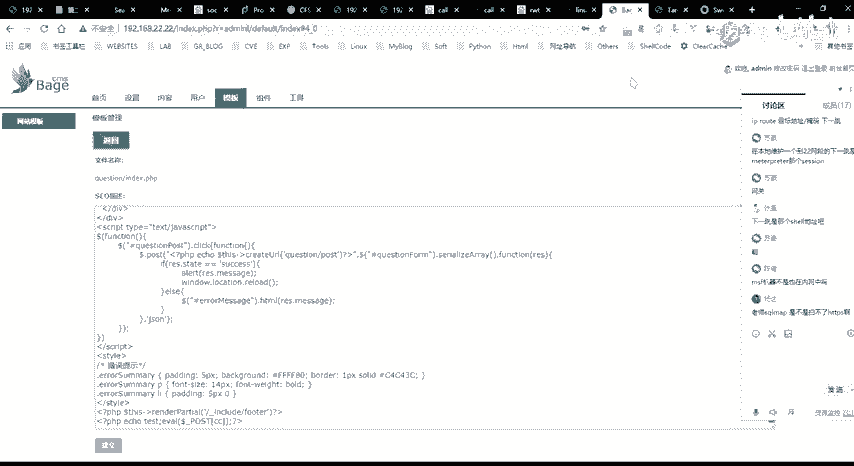

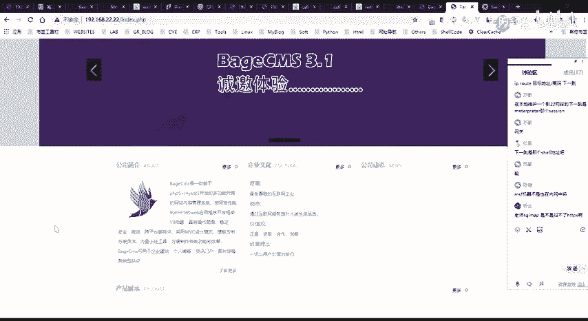

因为我们这边话是添加在了这样子的一个首页，对吧？就我们在首页这边的话，你可能看不到，因为我们可以通过右键查看网页云代码，然后去找到这个t，是吧？

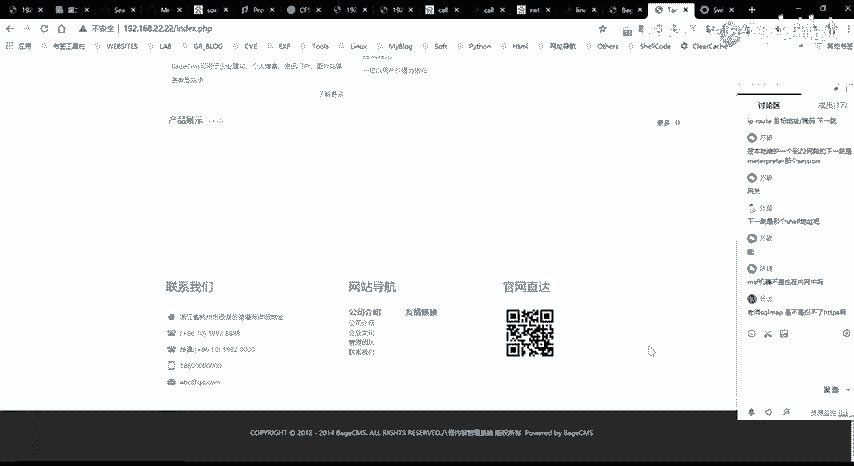

直接去检索嘛，然后大家可以其实可以在这边能够看到这边的话有这样的一个test，对吧？就是说明他输出了这样子的一个t，也就是我们的那个PHP脚本的话被正确的解析了。

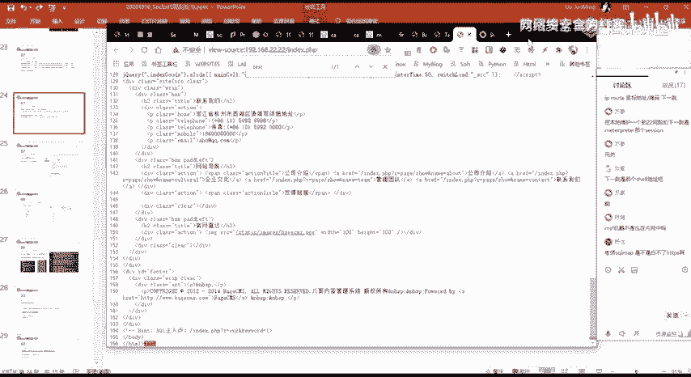

那么我们这个这里的话就能够呃去通过我们这边写入的一个一句话去得到他的一个小。

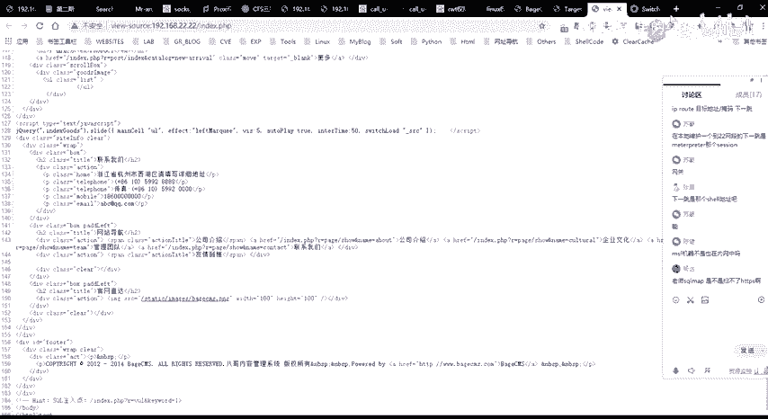

然后呃得到需要的话。我们在这边的话，我们就可以通过我们的这样子的一个管理工具，就需要管理工具去进一个连接，对吧？

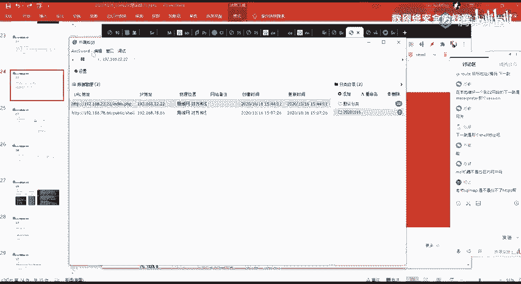

啊，我们在这边要去迎接的话。

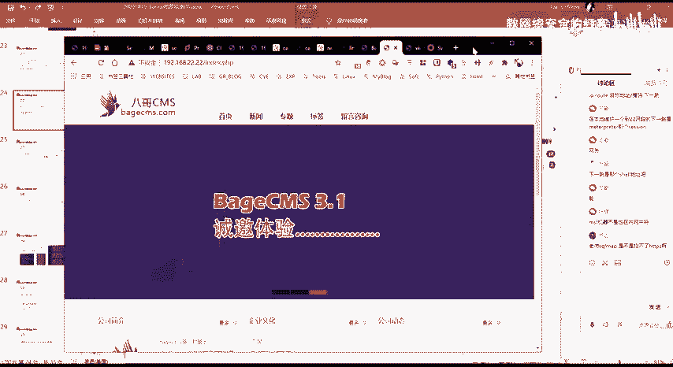

呃，大家觉得就能不能直接直接的连接上去呢？就我这边的话呃，已经添加进去了是吧，嗯。哪年呢。呃，我这边的话添加了这样子的一个就是。

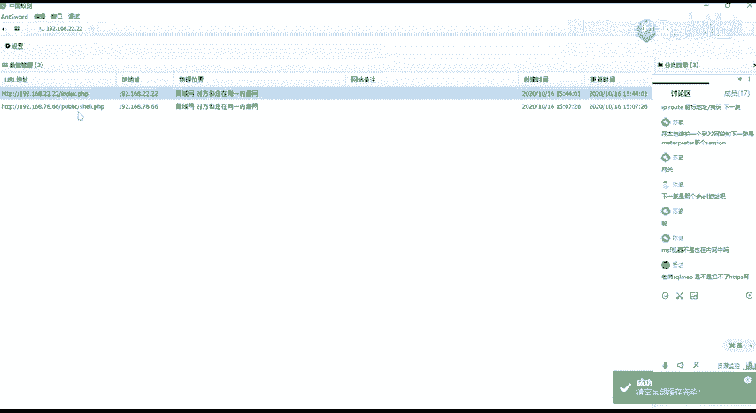

我们刚刚所得了这样子的一个呃，需要的一个地址，对吧？

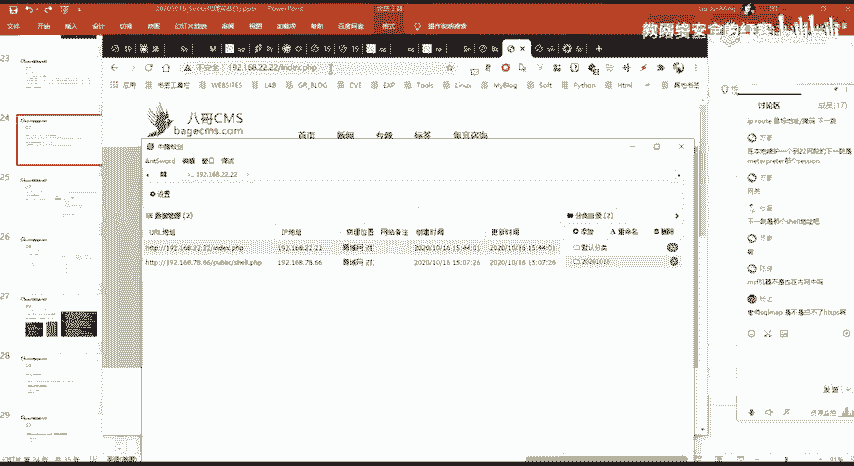

然后呃大家觉得就是能不能直接的通过就我在我本地去直接去进行一个呃登录呢？

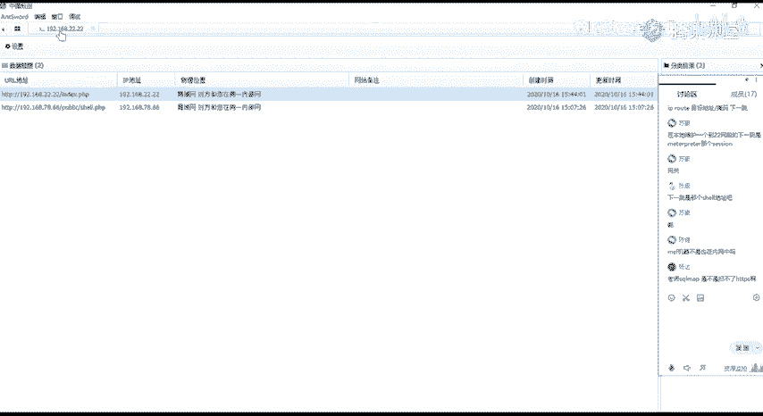

去得到一个选的呃这的话，它是可以可以扫HPS的，是要加一个参数，就是你要强制你要强制他的。因为你去扫HPP呃而的话。他会就有一个这样子的一个重新下，你要强制他。呃，是杠杠SSL干什么来着？就是。

你要呃强制让他去请求这样子的1个HTPS。你这个的话你可以去呃。百度一下，你百度一下有。那个选项我也忘了，刚刚SS什么什么来着。

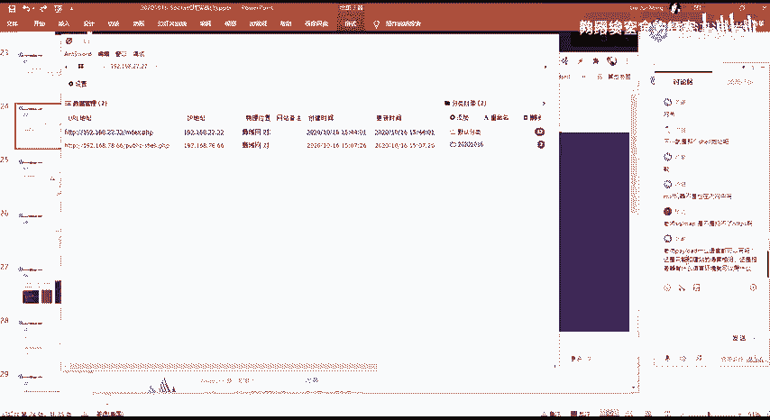

呃，你这肯定就是说你是说我这边写的这个对吧？我这边写的话是1个PHP的对吧？因为为什么我要写PHP呢？因为他的这个呃他的这一个。他的这个网站，他是用PHP的一个脚本语言写的嘛。

对吧那为什么就是说他这边呃，就我们从哪里知道呢？对吧？我们可以通过这边PHP知道，以及通过他的后缀嘛，能够知道对吧？那么他这他是用这种PHP在脚本里面写的。

那么我们为什么要去写这样子的1个PP的一个脚本呢，对吧？因为他能够去解析执行呢？我这样说应该能理解吧，对吧？因为我们以及同样的其他的也是一样的嘛，对吧？

就如果说你这边是1个GSP的这样子的一个GSP的这样子的一个呃脚本写的对吧？那么你要写的这样子的一个码的话，那么你肯定是要写一个GSP的码嘛，对吧？因为你只有因为在这个JSP的这样子的一个脚本的话。

你需要写1个GSP的脚本，你才能够去进行一个解析。因为你只有解析了你这你的这样子的一个一句话嘛，你才能够去得到需要嘛。我这样说应该能理解啊。就是你服务器它是什么样子的一个语音环境。

或者说它是能够去解析什么样子的一个脚本，你就用什么样子的一个那个呃码。那我们归根到底，最后的一个目的就是要让他能够去解析我们的那个码，对吧？我们才能够去通过那个码来得到需要嘛。呃。

我们这边的话在这边的话。

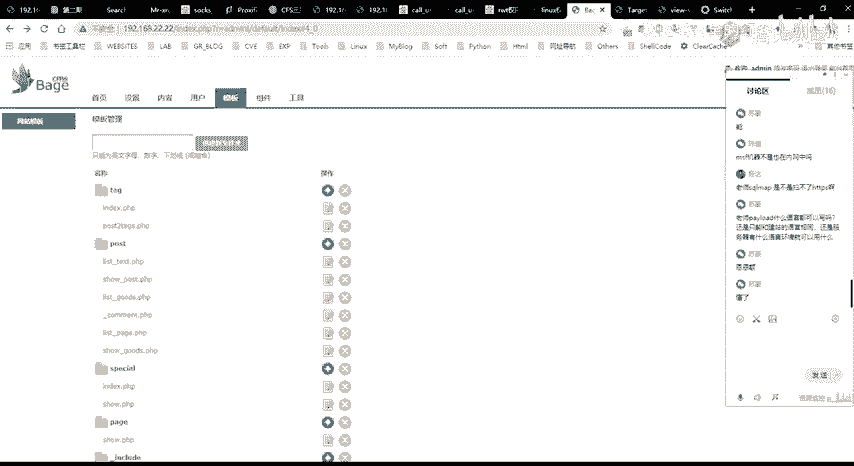

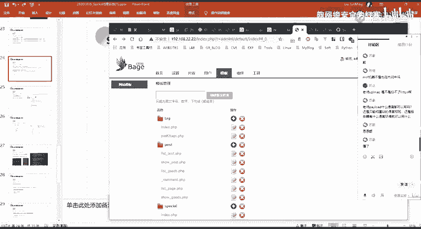

我们得到了他的一个web share，对吧？我们其实可以测试一下。

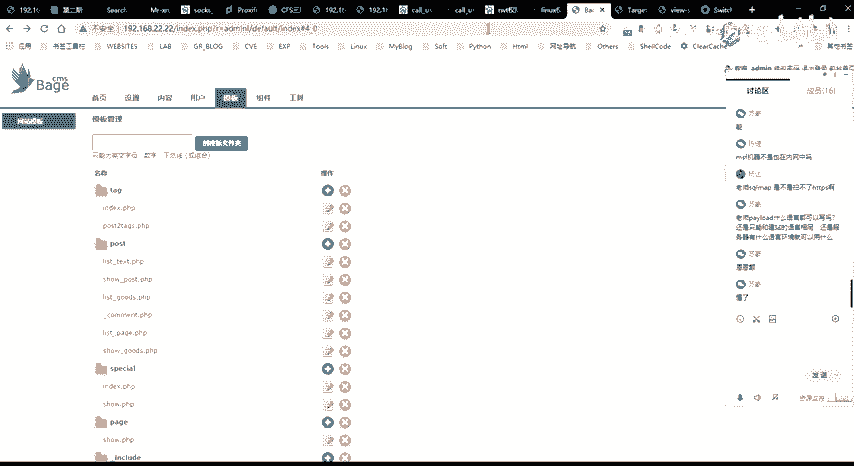

嗯。啊，这这边不好测试。我们在这边就通过这样的一个需要管理工具去建一个连接。然后在这边的话要注意的一点，就是我们在当前的这个机器上面，对吧？我们是无法去直接的去访问到这1个2。2这个网这个IP的对吧？

因为我们在这边能够去访问到这个IP的话，是因为我这边走的我的这个流量，它是走的这个收索的一个通道，对吧？它才能够去访问到。然后我们在这边的话，同理我们在这边要去访问这1个2。2这个IP的话，我们需要去。

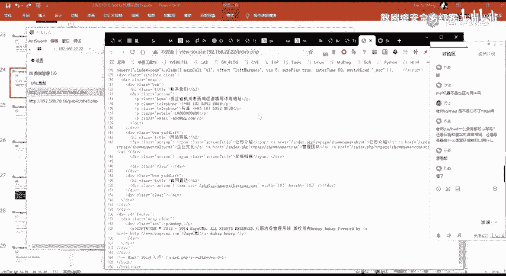

请你去设置这样的一个代理。也就是呃像已经这边的话有这样的一个代理设置嘛，在这边手动设置一个代理，指定你的一个代理服务器IP以及端口。这边的话代理服务器IP的IP的话就是呃。就是。好的。

就是我这边MSF这边的1个IP嗯。这里的这个IP对吧？因为我的一个s的我的这边的一个MSF的一个呃s的一个代理的话，它是今天在我这边的这个呃机器上面的一个1080的一个端口。

所以的话你需要去指定这边的一个代理服务器IP及端口。注意代理的一个协议，选择s5。如果说你是s4的话，你就选s4。然后我这边配置好这样子的一个代理之后的话，就我就能够去进行一个。声音有点问题。呃。

这边访问的话。789167。

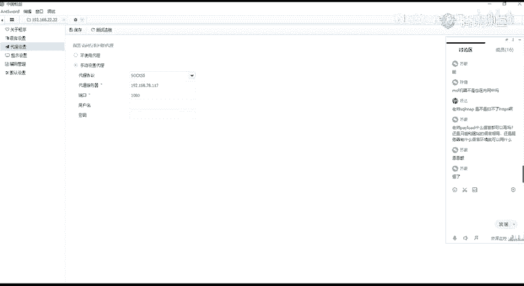

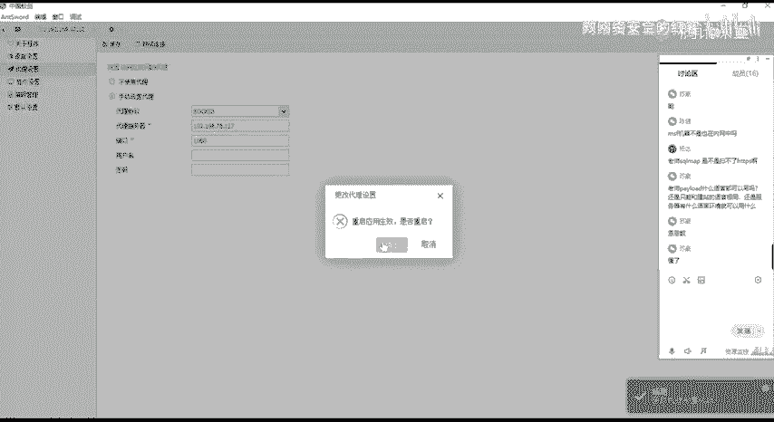

呃，这边法官院的话出错了，出错了的话，碰到这种情况。不要慌，碰到这种情况的话，就果断换把刀吧。这边的话呃，我通常的话是用。就费用。像呃已进啊、冰烯啊这种都是可以的。然后这边的话因为简单的话。

我就用这个C刀吧。

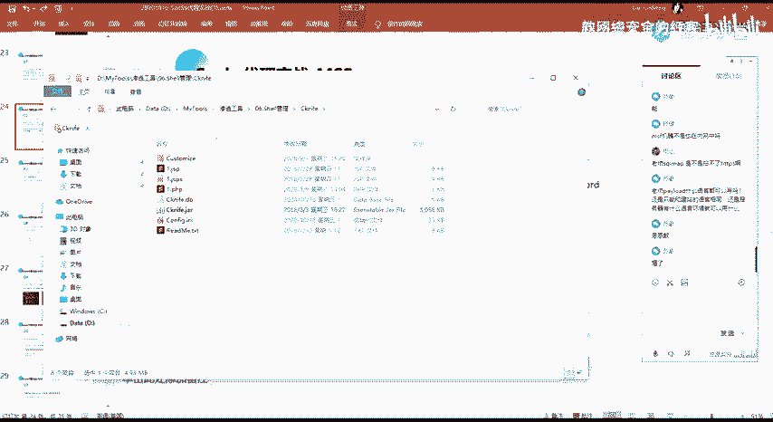

就是这一个。用这样子的一个事啦。然后这边用这一个C的话，同样的我们需要去我这边的话已经添加了，我同样的需要去做一个设置。这边设置的话就是你需要去设置你的一个代理的一个服务器以及IP啊。

代理服务器的IP以及端口对吧。

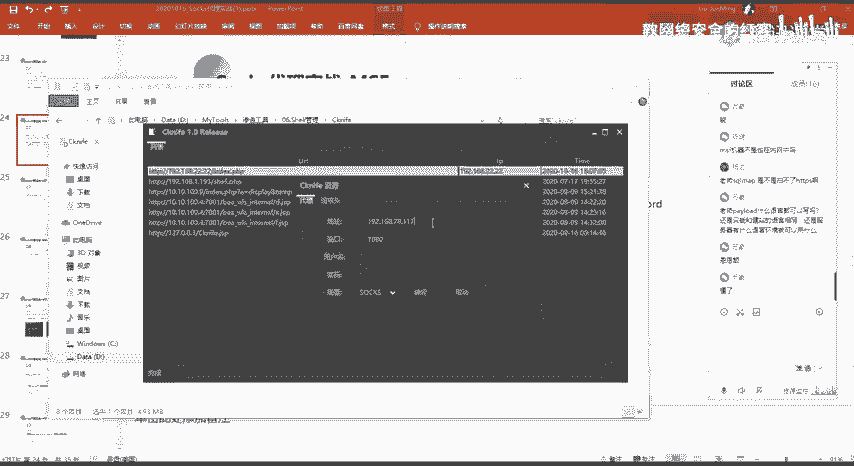

然后设置之后的话，我们再去进行一个访问，对吧？是没有问题的。就如果说你要问我这个工具为什么连不上，我也不知道，就反正。

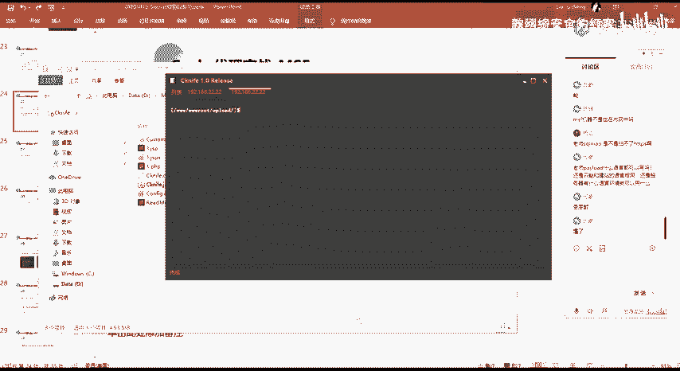

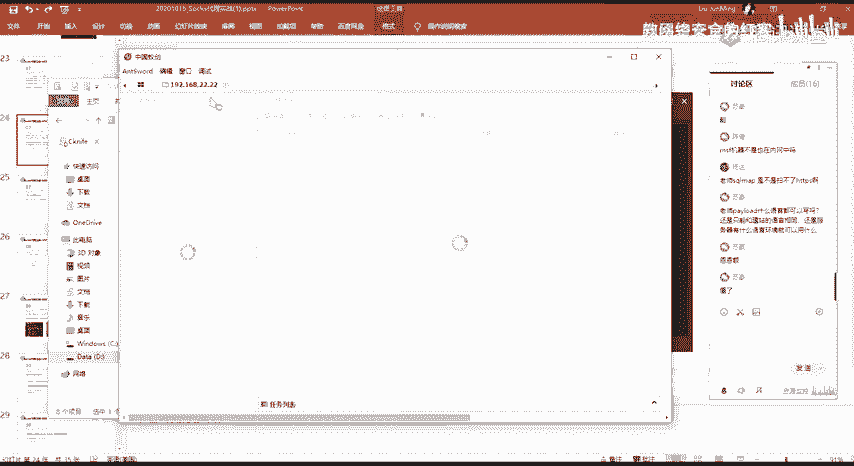

很多时候都会碰到这种循写问题，所以我一般都是就是不会说只是只用一个，我会结合着其他的这种工具去这个使用。那这种工具的工具的问题。

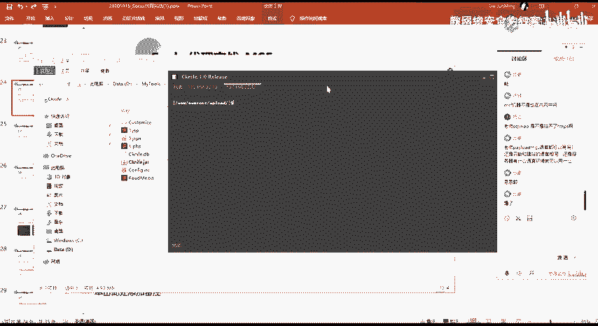

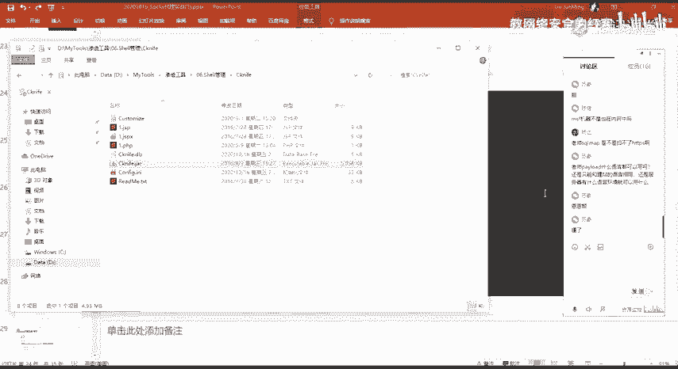

反正我是搞不懂了。

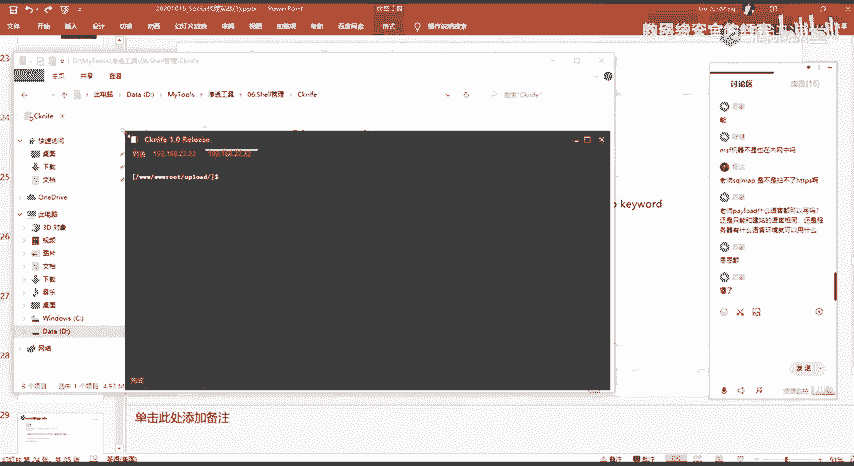

也就没必要去搞懂他为什么出这种问题，反正能用就可以了。然后这边的话我们就连接到了这边的这个机器上面，对吧？连接到了这边内网的这个2。2这个IP的这个呃。

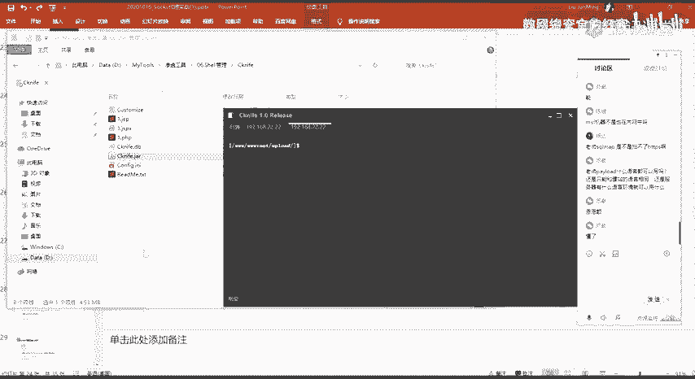

对我们可以通过配置这样子的一个说索代来去连接我们的就是在内网当中的这样子的一个选，对吧？

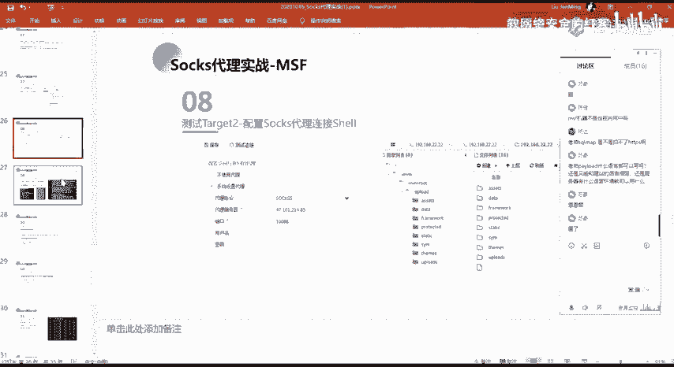