# 2024网络安全系统教程！清华大佬花159小时讲完的网络安全系统课！别再盲目自学了，学完即可就业！零基础入门网络安全！（渗透测试／漏洞挖掘／CTF／黑客技术） - P73：60.收集内网主机信息，反弹shell.mp4 - 教网络安全的红客 - BV1ft421A7Nj

然呃在这边得到了这一个内网的这个。2。2这个机器的一个sh尔之后的话，我们就还是又回到了我们前面的啊，我们得到它一个sh尔，我们就需要就可以去对它做一个主机的一个信息收集，去收集在当前这个主机。

它我们所需要的这样子的一些信息，对吧？然后在这边的话，我们同样的通过前面这样的一个方法，对吧？对这一个33呃，对这一个网段。呃，不是对这一个商场是我们比如说我们。

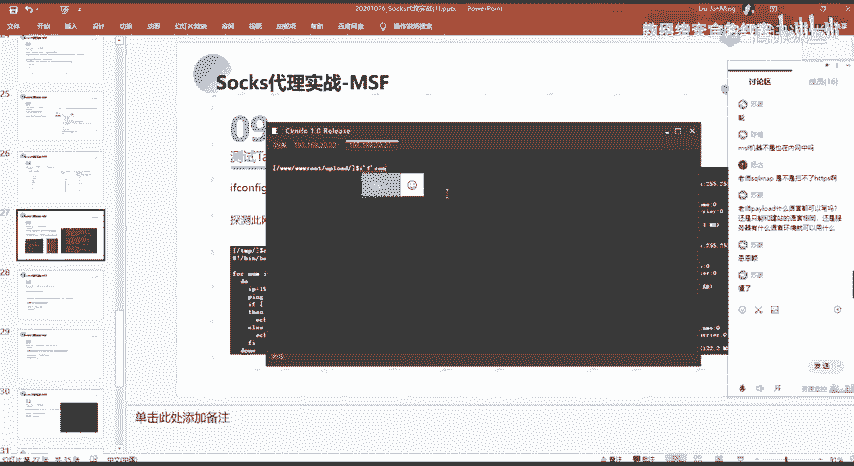

同样的去查看它有哪一些网卡，对吧？我们通过ifon big。查看到它同样的有两个网卡是吧？1个22的1个网络，一个网卡，以及1个33网络的一个网卡。那么在这边的话。

我们就知道我们这一个机器它是能够去访问33网络的一个机器的对吧？然后我们同样的可以就是通过前面的那个脚本来去对这1个三3网络的1个IP的一个存活做一个探测，来去找到这一个网段下面有哪一些主机存活，对吧？

然后的话找到这些存活的一个主机。那么就分别的去对这一些主机去做一个呃端口的一个探测，对吧？就其实步骤的话都是这样子的呀，对吧？就如果说你因为我这边把句话是只有一个主机，对吧？就每一个网的话。

只有一个主机。如果你多个网段呃，每个网站下面都有多个主机的话，那么其实都是重复这样的一个操作，对吧？就你对对这个IP探测它是否重活，存活的话，那么你要对这个IP做一个测试的话。

你就需要从它对应的开放的端口所对应的一个服务去做一个去寻找它的一个突破口，对吧？来去寻找能够去被我们去进行一个漏洞利用的一些点。然，呃在这边找到了这一个。33。33的这个IP它是存活的。

就发现了这一个存活的一个主机啊。那么我们。呃。发现了这个主机的一个存活，我们想要去对这一个主机错去做相应的一个呃。端口的一个探测，对吧？那么。我们如何去进行一个操作？

因为我们在这边当前的这1个MSF对吧？我们想要去做一个端口探测的话，我们。就通常会去通快map，对吧？去少。去扫描那个端口。那么我们当前的这个MSF，我们是无法直接的去访问到33这个网站的，是吧？啊。

不是MS，是当前的那个看你机器的吧？然后我们当我们之前的话是要去访问那一个二这个网站是通过我们的一个代理，对吧？就是通过pro change。通过p case所设置的这一个代理。

以及在这边所启用的这样子的一个代理服务器，对吧？然后的话。以及在这边通过筛选5000加这个路由才能够去访问到这个网段，对吧？然后我们现在的话是33网段，然后33这个网段它我们是如何去访问到的呢？对吧？

我们是通过这边，我们得到这个2。2这个机器才能够去访问到的，对吧？比如说我这边我在这边我通过CR。呃，这边的话应该访问不到啊。因为他是。好，可以访问的。他这边的话呃，因为这边的话它是1个ISIS啊。

不是它是一个那个。那个windows的一个机器啊。嗯。啊，不算啊。不是2呀。哦，因为这边搞错了呀。因为我当前的这个呃IP对吧？是3302。其实我在我访问这个3302的话。

其实就是访问的当前的这1个IP了。我要反正他是这个。33这个机器，当然的话这边的话是访问不到的，因为他没有外国说，它是一个呃那个。那个windows的一个机器啊。啊，我在这边的话。

我是无法去直接访问到的。但是我比如说啊我是可以直接访问到的。33。33对吧？我通过P的话是能够拼通的。因为我们前面的话是就通过P的方式发现它的一个存活嘛，对吧？也就是说我要去访问到这1个33。

33这一个网段的话，我需要通过这1个2。2这个机器，对吧？然后当前的话，我已经拿下了这个2。2的机器的一个share，吧？那么我们需要通过什，我们怎么去啊。

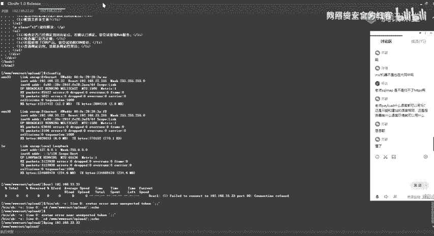

嗯。呃，怎么说呢？我们怎么去把这样子的一个机器，把它给啊反弹到我们的1个MSF上面去呢，对吧？因为我们同样的，我们也想要去。通过这个2这个2。2这个机器去访问这个32点网站的话，对吧？

我们想要去做更多的操作的话，我们最好的一个办法的话就是。或者说最理想的一个办法的话，就是呃把我们那个需要把它给弹到我们那个MSF上面去，对吧？因为我们在这的话已经通过MSF得到了这个2。2这个机器啊。

不是这个呃。那个外网的那个跳板机的那个机器的一个需对吧？因为我们这边话是通过那这一个筛选。通过我们得到这个需要才能够去访问到22的这个IP的对吧？然后在这边的话，我们可以通过这样子的一个方法。就是我们。

呃，在我说之前的话，先问提问一下大家，就是大家觉得我要怎么去。才能够去得到这样子的一个这边的2。2这个机器的一个MSF的一个响呢。呃，有谁有谁知道吗？有谁能回答一下，或者是说思路。嗯。

在神选5上将啊带理回来。呃。用什么样子的一个方式呢？Yeah。啊，其实大家应该看了我的PPT了，应该应该能能知道吧。嗯。好呃，那么我直接说吧，就是说嗯。我们先来捋一下，对吧？

就我当前的话已经得到了这个呃。通过这边的这个C2选5对吧？也就是通过这边筛选5今年的这个样子的一个收拾的一个通道。然后的话得到了这边内网的这个2。2这个机器的一个需，是吧？那么我们得到这个需要之后。呃。

我们如何去把这边的这个需把它给就是。把它给反弹到我们这边的1个MSF上面去是吧？我们当前的话是能够去访问到，就是说能够去通过这边的一个筛ession5去访问这个2。2这个机器的，对吧？

那么我们在这边反他的这个需的话，这个这个筛五是怎么反弹过来的呢？我们的这边的1个筛选5的话是通过这边。对吧通过我们在这边生成的这样子的一个访谈的。反谈希尔的这样子的一个暂定上面的一个可执行程序，对吧？

我们通过我们前面得到这个谢尔来去执行这边访谈的一个呃谢尔。然后执行之后的话，就把它反他到了我们的1个MSS上面去，对吧？然后注意的话这边是反弹线，就我这边为什么要去使用反弹线呢？以及呃。啊。啊。

没有说呃，其实在这边的话。用不用反纳需尔都可以啊，就是我用反纳西尔以及正向需尔都是可以的是吧？因为我这边的这一个机器的话是。呃。可。呃，我这边的这一个机器的话，因该是。呃。

能够跟我这边的这个MSF都是能够互相互相访问的对吧？所以的话我通过正向协以反向修都是可以的对吧？然后在这边的话，就是说我在这边通过前面的这个今面的一个绘画，得到了这边的这一个内网的这个2。

2这个机器的一个需，得到它的一个需。我在这边是就是说我在这一个内网的这个网道，它是无法去直接访问到我们的一个外网的。就是呃他在这边他的一个内网的话，他是无法去呃他是呃无法出网的。啊，其实前面已经有讲。

就是我们在去呃内网信息收集的时候，对吧？就是你要去判断你的这一个机器，它所处的一个位置，对吧？就是它的一个网络环境，以及去呃判断它是否能够去出网，对吧？然后在这边当前的这个机器的话是呃出不了网的。

就是它只是在内网的一个机器。然后我这边他不能够去出网。那么我们就无法去使用反航线，对吧？因为在这边的这个内网的这个机器，它无法去访问到我们在外网的这样子的1个MSF的这一个呃IP对吧？

所以的话我们就无法去反弹选。所以的话我们尝试。去使用这样子的一个正向角。这其实在内网的这样子的一个用MS5去这样子的一个得到希尔的话，你呃通常的话都是就是说你要去有多个这样子的一个网段的话，对吧？

多层网络的话，我们通常的话会去。通常的话都是使用的一个正向吸耳。因为你要去反向吸的话，你的一个你的腰你就要。就是要要求你的这个内网的一个机器能够去访问外网，对吧？但一般的情况下面的话。

它可能是呃无法出网。所以的话我们就通过我们这边建立的这样子的一个通过这个跳板机所得到的这样子的一个啊筛选绘画。来去访问来去访问这个内网的这个二点网吧，对吧？

所以的话我们的一个操作的话就是呃首先通过MSF来去生成这样子的一个呃正向的一个项。就这边的生成的一个正向的一个这一个码的话，就是说他在这边执行之后的话，它会在本地去今天这样子的1个6668的一个端口。

然后的话来等待我们这边的一个连接，对吧？因为我们在这边的话，它是我们是可以通过这边的一个筛选去访问这个机器的对吧？去访问这个机器的这边今天的一个端口的。那么我们能够去访问到的话。

它只需要在这边今天这一个端口，然后等待我们的一个请求的一个连接，来去建立来去进行连接。

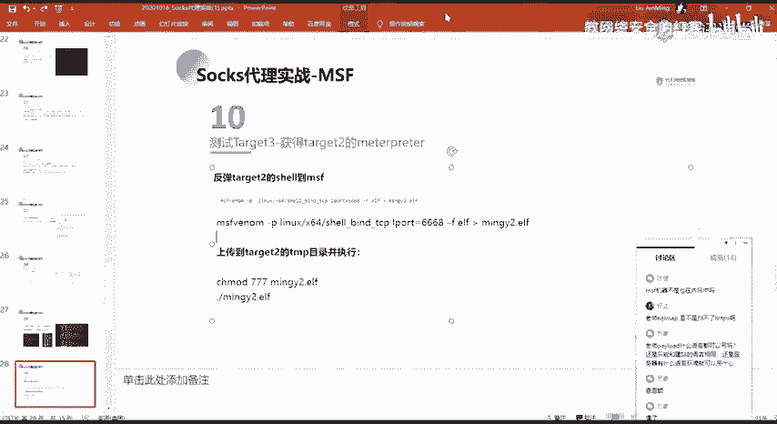

那么我们在这边的话就能够去得到这边机器的一个呃筛选规划。然后具体步骤的话就是这边。呃。我这边的话就不一一操作了，我已经在这边的话，已经就是。呃，已经上传上去了。就是这边的这个M3MNG2。1F。嗯。

当前的话应该是。嗯。呃，这边的话没有。呃，这边的话因为我前面的话已经执行过了，所以的话这边他端口的话是处于一个今天状态。我这边的话把这个停掉。是么。好，当前的话没有了是吧？

然后我这边的话又再通过这边德乐西尔，对吧？就是把它上传到我们的一个探谱目下面，然后给他执行权限。然后我这边的话就直接执行了。因为我前面的一个操作我已经操作了。我就不再一一的操作了。

然我在这边去执行这一个。第二幅文件。执行之后的话。在这边其实我们可以看看到。

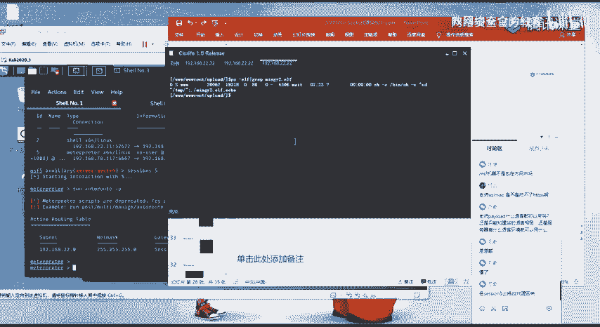

然后这边的话可以看到，虽然它这这边显示执行失败啊，但是没有就不影响他这边这边的这个呃可执行程序已经执行了。就我这边执行之后的话，它的一个效果的话，就是它会在本地进行1个6668的一个端口。

然后的话它今听了这个端口之后的话，我们怎么去进行一个连接呢？对吧。我们去进行一个连接的话。我们只需要去使用这样子的一个。使用我们的一个今听器的一个模块，设置我们的一个Kload为呃。嗯。好。

设置为一个半的TCP的一个连件，也就是半的的话就是呃正向的一个连件。然后我们设置这边的一个upport。那我们。在这边他在这边去今天的一个端口的话，是这样子的1个6668的一个端口，对吧？

也就是我们这边当前的这个呃MSF的一个流量的话，是要发送，就是我们的一个请求的话，是要发送到这边的1个6668的一个端口。对，然后啊按后的话就是我们要去发送请求的一个呃IP，也就是我们这边的1个2。

2的这个呃机器，对吧？然后我们在这边的话，我们exportit。按接执行执行之后的话，在这边的话可以看到就立马的得到了这样子的一个筛选6是吧？我们可以看一下筛选筛选16。然后筛选六的话。

在这边的话就进入到了它的一个筛选。在这边进入到进入到他的一个色选的话呃。就你会发现有这样子的一个情况。这个情况的话其实就是我们前面我前面其实也要给大家提，对吧？就是我在这边。

就是你在这边你去使用的这样子一个配漏的。比如说你使用的是这样子的一个hell的这种配的话，你最后得到这样子的一个筛选的话，它其实是像这样子的一个就其实它会卡在这边对吧？你跳回车它也没反应啊。

但是的话其实你当前的话已经进入到了它的一个呃hell了，你可以执行另令，比如说IOS对吧？当前的一个路话是在那个time录。说外慢啊，能够去执行这样子的一个命令。然后在这边的话，我们要去退出来的话。

你可能会直接ctl C，对吧？你ctl C的话，你退的话，你就会把这样子的一个筛选给终止掉。所以的话呃我们其实可以在这边去执行background。就在这边输入一个background。这注意的话。

在这边是不能够去tableable补权的，也需要手打。然后的话在这边他会说background search6，对吧？你敲 yes。然后在在这边的话，绘画的话就呃在这边对吧？在我们那个后台。

然后其实在这边你可能会就是。呃，像这样子的一个需要，你用不习惯，对吧？你想要你想要去使用这样子的一个max plus的一个需要。那么我们可以通过这样子的一个方法，就通过筛选1杠U。

然后指定这样子的一个筛选来把这样子的一个就是通过这样这边的这个模块啊，就通过这个hell to的这一个模块，把我们当前的这样子的一个就是hell的这样子的一个hell，把它给就是进行一个升级。

升级成我们这边的一个mat的一个呃筛。啊我可以。可以看到在这边执行之后的话，他反回来一个筛选7，对吧？是一个max pass的一个筛选。然后我们筛选是查看，在这边有一个筛选期。我们可以。进入这个筛选区。

然后的话。对吧。就得到这样的一个m的那个需。然后现在的话我们就呃已经得到了这边的这个。202这个机器的一个需对吧？把它反弹到了我们的1个MSF上面，对吧？

我们为什么要去反弹到就是把它给呃反把它给就是转到我们的1个MSF呢？因为我们想要去做下一步的一个操作，就是去。对这边的1个33。33的这个机器去做一个操作的话，我们就需要这边的这一个。3点。

需要这边的一个筛选7，对吧？因为我们在这边要去访问到这个33这个网站的号，我们只能通过这边的这个筛选7，也就是这边的这个呃这边的这个2。2这个机器，对吧？所以的话我们在这边同我们在这边。

要想让我这边MSF。呃，去访问到这边的一个33这个网站的话，我们同。我们需要去。添加一个路由。这边路由的话指定指定是添加到我们的1个33033的这一个网段。然后大家要注意啊，就是你添加路由的话。

就是说你要你想要说你想要让哪一个筛选，就是你要。呃。大家脑子里面一定要这样子的一个就是呃。一个概念或者说有这样子一个思路，就是说我要通过哪一个。我要通过哪一个需。

通过哪一个筛选才来去访问这边的啊这个IP对吧？然后我这边的话是要通过这个筛选区，所以的话我需要在这个筛选区下面去添加一个路由。然后这边的话。这边添加了一个路由的话，我们可以看到就是通过这一个筛选7。

添加到了这样呃，添加了一个就。到这个呃。不好意思，喉咙有点卡。哎，讲的有点累了。就通过这边的这一个筛选7对吧？这一个网关来去访问这边33的这个网络啊。然后呃。我们在这边的话。

我们在这边的话添加了这样子的一个路由之后，对吧？我们就可以去尝试。看是否能够通过这边的这边，我们前面已经建立的这样子一个缩死的一个代理通道是吧？就其实这边建立的这样子的一个缩死代理通道的话。

就我们呃只要把我们的一个就是把我们的一个代理设置成我们这边的一个呃IP以及这边代理的1个1080的一个端口的话，那么它的这种流量它都会转到我们这边的1个MSF去，对吧？然后它转到这边MSF的话。

它会自动的去查找。比如说我这边要去访问这边33的。就是比如说我发起这样的1个ITP的一个请求。是访问这边的一个。192。168。33。点33的这一个机器，对吧？那么我发起这个请求。

我通过这边的一个收持代理通道之后的话，他会在这边去找到。找到哪找到哪里呢，对吧？找到哪一个，他能够去访问到这1个33033的这一个网段。那么他自然的话就就会找到这边嘛，对吧？

就通过这边的这个筛选7就能够去访问到这边的1个33的网段嘛。所以的话它的流量它会通过这个筛选7。然后的话呃把它给。传到或者说转到这边的1个33。33的这1个80的一个端口上面去。

然后我们在这边的话可以去可以来测试一下。呃，当然的话在这边的话。这边的话因为它是一个windows的一个机器啊，就我们当前我们现在能够去访问到这一个，对吧？

我们同样的第一步的话就是需要去做一个信息收集嘛，对吧，所以我们可以通过这边的。Extra。第首。以下这边的1个33这个网站，我这边号我不少玩了，直接断掉。对吧然后当你发现在这边有这种O的话。

那说明我们这边的一个代理通道的话是没有问题的，对吧？我们可以通过我们这边的这里的一个s的一个代理来去访问到原本无法访问到的这样子的1个33。33这个IP对吧？以及能够去探测到它存活的这样子的一些端口。

3389139，就我们通过这些存活的一个端口，也能够去判断它就是说它的一个呃主机，它是一个windows的一个系统，对吧？像这种3389，就是我们的1个IDP嘛，对吧？

然后我们这边探测到它的这样子一些存活端口的话，就又回到了前面的一个思路，对吧？去对它对应的一个端口做一个漏洞的一个分析利用嘛，对吧？然后在这边的话，我们发现它有这样子1个45的一个端口存活。

想到45的话，我们就不得不试一下我们的一个就是永恒自然嘛。M17-020的这一个漏洞。然后的话正好这边的话正好这边的话能够通过这个漏洞去得到呃去反他一个希尔。然后在这边的话。呃，我们可以看一下这边。

我们通过这边的1个MSFMS17020的这个PSEXE的这个模块。然后执行之后的话，直接得到了这边的一个需ll。直因为我们知道直接通过MS173020的话，它得到了一个需尔的话，它是一个呃。呃。

这样子的一个sstem的一个权限，也就是它的一个最高的一个权限。然呃。这边的话。这边跟这边是一样的。然后呃我。我们来操作一下，看一下，看是否能通过这样子一个方法来应用成功。这个话只使用这一个模块。

然后设置偏漏。我这边我就不敲了。喂。啥玩意。不怎么确。啊，这边他是已经设成功的。这是我们的一个。IP对吧，我这边的话已经设好了，然后端口的话就默认了，默认是44对吧？然后我expoit。根去去执行。

执行之后的话，他在这边的话，他就会去呃去发送这边呃，去向我们这边的这1个33。33的这个IP去发送呃，这边的一个请求，对吧？发送的这一个请求的话，他要传递这样子的一个一个数据，就是利用。

去利用这边MSF17020的这样子的一些配漏的是吧？传过去传过去之后的话，在这边可以看到已经返他们了一个筛选吧。然后我们可以切换到这个视频吗？看一下他那一个权限对吧？指的是一个C什么一个权限。我不知道。

及很需要对吧？能够去。直接能够去。经入到它的一个主机的一个呃CM机的一个渲啊。然和像这种乱码的话，我们可以通过CHCP业5001，就是更改我们的一个代码页。其实在这边的话。

其实就是它的一个编码的一个问题啊。然后我们再通过那去执行的话就没有问题了，对吧？C9CP65001。然后呃在这边的话就是。我们通过我们前面得到了这样子的一个呃需，对吧？然后的话把它的一个需。

反他到我们那个MSF，然后的话再利用呃我们的一个代理通道。来去探测这边的1个33。33网络的一个存活的一个端口，对吧？然后的话再对它的一个端口做了一个利用。这的话利用的是M17。010的一个漏洞。

利用完成之后的话。就是得到了他的一个s的一个权限，对吧？然后以及还有其他的一些端口。像比如说在这边3389的一个端口。就是我们。呃，因为我们前面这边的话已经得到了他一个需要嘛，对吧？

我们其实可以再进入我们可以通过这边得到这个需ll。来去添加一个管理员的一个用户，对吧？然后的话我们就可以通过他这边开放的1个3389的一个端口去进行一个远程桌面的一个连接。

然后添加的一个呃添加管理用户的一个命令的话，就是这样子。我这边的话我就不多说了。然后我这边已经添加成功了。然后添加成功之后的话，我要去进行一个远程桌面的一个连接，对吧？那么远程桌面连接的话呃。

我们怎么去进行一个连接呢？

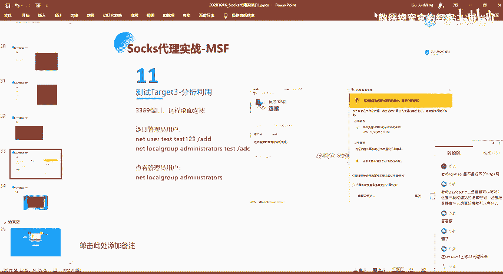

首先第一种的话，其实呃我们的1个MSF当中，其实已经有这样子的一个。啊，主要是。有这样子的一个。1年。第一。是。怎么用来着？没有。😔，放题还有。

然后其实在这边呃linux里面的话有啊不看里看里机器里面的话有这样子的一个自带的一个RDP啊destop这样子的一个命令。然后在这个 desktoptop命令的话。

我们可以通过这样子的一个方法来去进行一个连接。然后同样的要注意就是我们要。

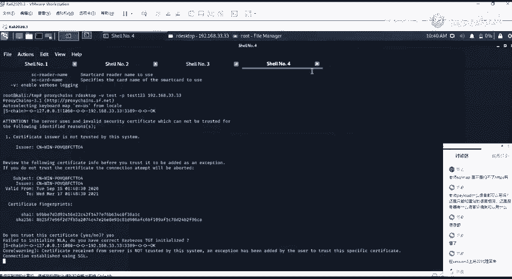

我们的一个连接的话要走这样子一个缩死的一个通道，所以要加这个prose chance。

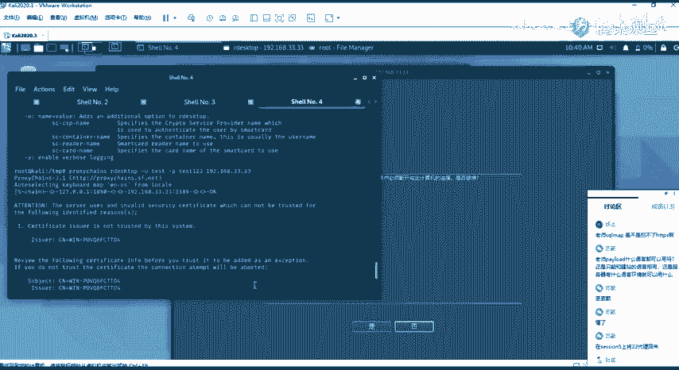

然后连接之后的话，在这边，因为我这边的话是已经连接了。所以的话呃我这边再去连接，就是连接的话，他这边需要去进行一个就是呃断开啊，就是要断开其他用户的一个连接，会把它挤下来嘛，是吧？

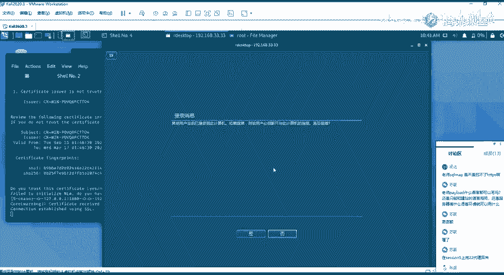

因为我这边。这边这边的话是已经。

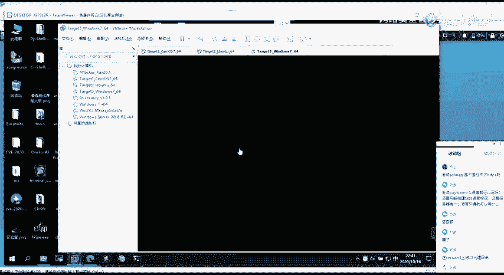

你接了嘛，对吧？我这边就否了。然后还有一种的话就是就大家可能就是在windows上面用的熟练一些，对吧？那么在这里的话，我们可以通过。我们可以通过这样子的一个全局代理的一个工具啊。

就我们知道在我们的一个windows机器上面，对吧？有这样子的一个。没。哎，远程桌面的那个是什么？明年说啥来着？突然忘了是呃，谁记的吗？是那个什么MET。突然脑袋就卡壳了。放ETST。哦。

M哦MMSTSC啊，我这突然脑袋就卡壳了。MSTF。就是这一个。然后的话呃我们在这边的话，我们可以通过这样子的一个呃在windows上面的话，我们通常会通过这样子的一个远程桌面的一个工具去进行一个连接。

对吧？啊，对，就是就这个我这。突然脑袋就卡了一下。然后的话呃在这边的话，我们可以通过这样子的一个全局代理工具啊。我们在这边可以去设置我们的一个代理服务器。我在这边的话就使用的是这个是吧？

就这一个代理服务器设置好之后的话，在这边我们需要就是设置代理服务器是这一个pros service。然后去自己去做一个编辑，对吧？选择就是你的服务器端口以及你的一个搜索的一个版本。还有的话。

如果你有做这样子一个身份验证的话，在这边就是启用它，然后挺简单的一个账号密码，对吧？啊，OK。OK然后选择这个。这里这里的有个ros落实上就是规则。在这边规则的话。

其实就是设置我们走这一个代理的这样子的一个呃程序。像比如说在这边的话，我设置的话就是这一个。MTSC这个对吧？就是选择这个程序，选择这个程序的话，你可以通过这这边去寻找嘛。

像这种win系统淘宝windows系统下面的这种呃自带程序的话，在这一个C统3M下面你可以去直接去。对吧，直接去找到他，然后的话把它添加进去。添加进去之后的话，在这边我们主要的话就是要设置这个。

action action的话就是我们的一个动作，也就是我们呃在这边的话可以选三个，对吧？de就是直连，也就是他不走代理，对吧？然后bl的话就是锁住嘛，就是禁止，就是不让这一个程序去呃访问。

然后在这边proox so5的话，就是呃让这边的这个程序，它的一个流量走我们这边的一个收的一个代理，对吧？其实这边的话就是我们想要的，然后我们把它添加进去。添加进去之后的话，我们在这边。

就去呃连接我们的那一个用户对吧？然后可以看到在这边。你连接之后的话，他在这边就有这样子的一个呃，它会显示在这里，以及在这边有这样子的一个呃。呃，流量的一个请求，对吧？就是这一个程序。

他去请求了这边的一个这边IP的1个3389，他是通过我这边的一个代理。对吧，然后我这边。进行一个登录。

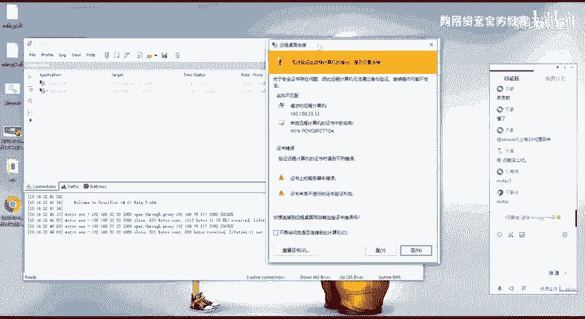

对吧。然后就能够去正正常的去登录到这边的1个33。33的这个IP和这边。

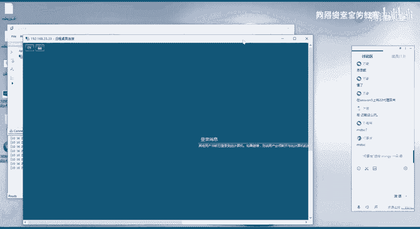

看一下。

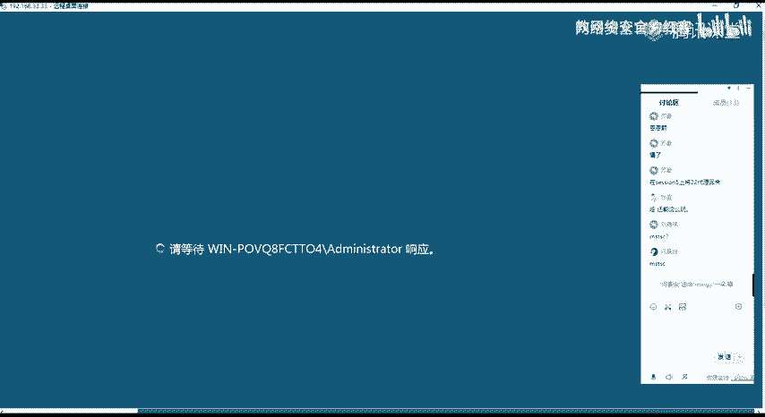

这边的话呃，因为他是一个新用户啊，就是他是一个我添加了一个新用户。所以他这边加载的话，因为他需要去加载系统的一个配置，所以的话比较慢。啊，这个的话。

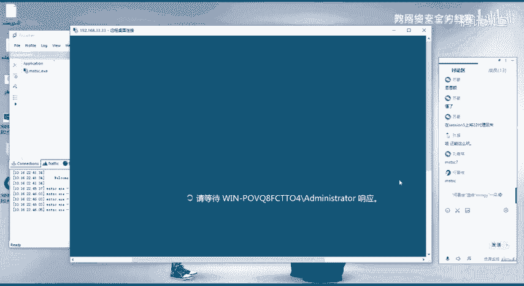

不等了吧，这边的话就不等了。就是说我们可以通过这样的一个方法，能够去正正常的去连接到我们这边内网的这一个呃windows机器的一个远程桌面是吧？也，就是呃最后的一个效果的话就是像这样子，其实就是。好呃。

以上的话就是我们本节课的一个内容。然后大家有没有什么疑问？

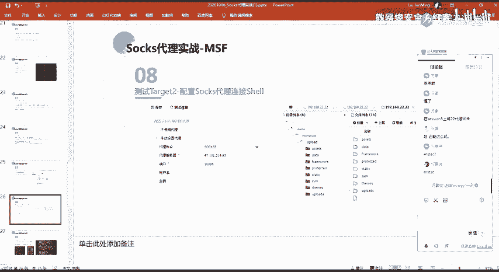