# 2024网络安全系统教程！清华大佬花159小时讲完的网络安全系统课！别再盲目自学了，学完即可就业！零基础入门网络安全！（渗透测试／漏洞挖掘／CTF／黑客技术） - P75：62.FRP通过Socks渗透内网.mp4 - 教网络安全的红客 - BV1ft421A7Nj

然后呃比如说我在这边。

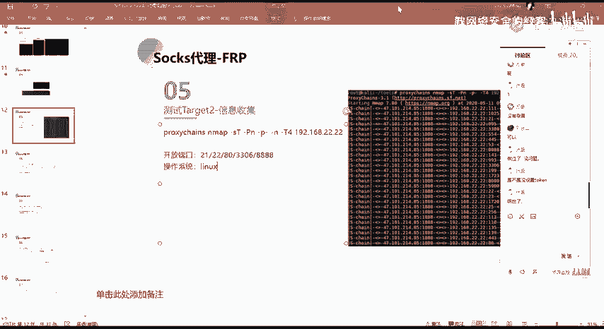

可以。这一个一个机器。我通过。通过 those change。我通过clo change，然后的话用MM去做一个基本的一个扫描。

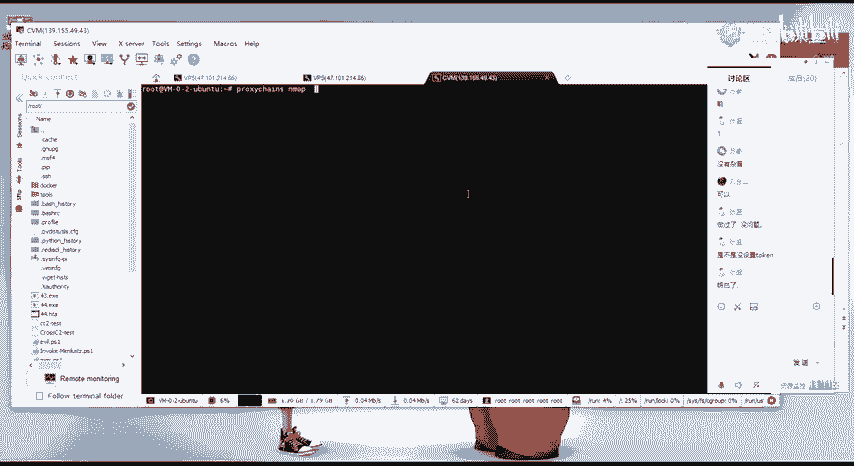

啊，去就是验证一下这边。

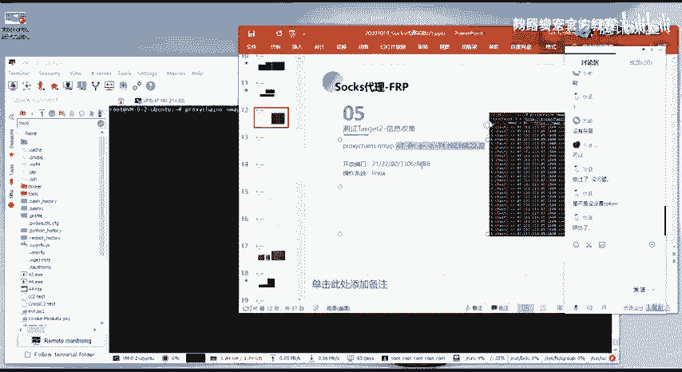

我的一个代理通道的话是。没有问题的对吧？可以看到有这种OK就不是说全都是time out。就说如果说你全都是time out的话，那么你可能就是说你的这个主机它没有开，然后的话呃。

你的这一个代理通道它没有进立成功，对吧？就你总总会有几个端口，它是属于一个开放的一个状态，是吧？现在这边的话也看得出这一些端口。

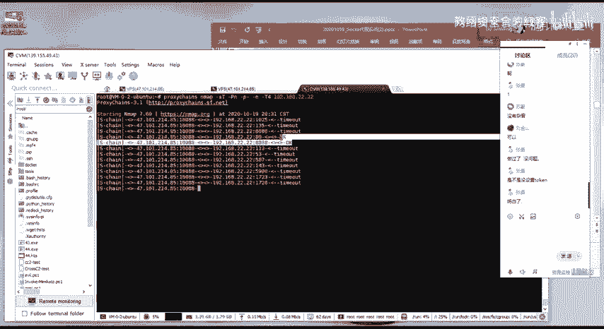

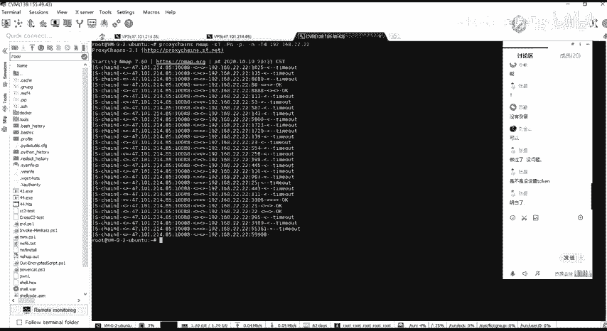

就说明我们这边的一个通道号是没有问题。然后的话呃下面的话就是上节课已经讲过了，就是这样子的一个思路，对吧？我们去进行一个信息收集。

通过这一个代理通道来去对我们这个二这个网端下面的一个存活主机进行一个信息收集。然后的话再去通过这一个存活的一个主机来去进行一个呃渗透。然后在这边的话就是通过这边这个2这个机器，对吧？2。

2这1个机器的1个80端口的1个CMS的1个漏洞，对吧？然后的话得到了这个机器的一个W需要。得到这一个机器的web share之后的话，我们想要去进行一个呃web share的一个连接，对吧？

因为我们当前的这一个呃我们。当前得到的这一个需要的话，它是处于一个内网的对吧？然后的话它是在内网的话，我们在外网是无法直接访问的。但是我们前面已经建立了这样子的一个s的一个代理通道。

我们可以通过这个代理通道来去访问到2这个网端的一个机器。那么同样的，我们就能够去通过这个代理。通过这个代理通道来去访问到，或者说来去与内网的这个呃web share去进行一个数据的一个交互，对吧？

然后的话来去进行一个连接。就呃这边的话就是通过已静。

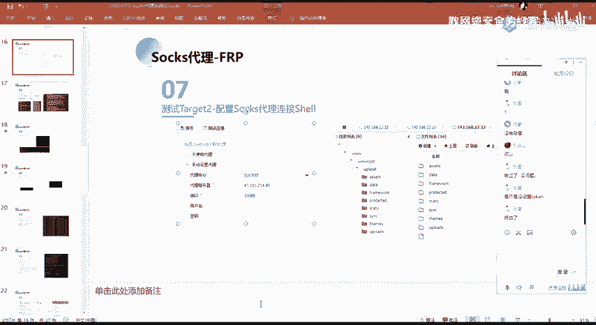

啊，就是啊不仅仅是以经，还有其他的这样子的一些啊不需要的这种连接工具，都有这样子的一个代理的一个设置啊，对吧？然后我们我们只需要去做这样子的一个。

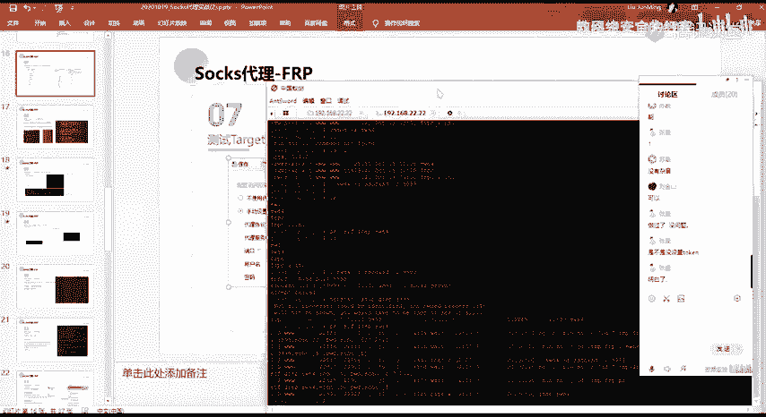

呃，设置我们的一个代理服务器。然后在这边的话，我们就可以去进行一个连接。连接在内网的这样子的一个2这一个机器的一个work选，对吧？好，我们就啊顺利的得到了这样子的一个在内网的这一个机器的一个需是吧？

然后我们得到这个需要之后的话，我们就可以去对它做相应的一个信息收集是吧？然后的话再以这一个机器再去做进一步的一个呃利用，对吧？然后我们通过我们得了这个2。2这个机器的话。

又发现了有这样子的一个存活的一个啊有发又发现了有一个这样子的1个33的网段，对吧？然后这个33网段下面的话又有这样子的一个。主机当然话其实实际情况可能不仅仅就只有一个主件啊，而这个靶场的话。

你不可能搞很多主机嘛。就每个网站就一台对吧？然后其实实际情况的话就会有很多这种主机嘛，对吧？那么你的一个就是你的一个测试的一个目标的话，就会并多，是吧？然后你的一个就是你的一个成果的话也会更多嘛。好。

我们这边发现了这1个33这个网段的一个机器，是吧？它是一个纯活的一个主机。那么我们下一步的话就需要去就需要去对它做一个测试，对吧？就测试它是否呃能够被我们去进行一个利用。那么我们现在的话。

我们是通过这样子的一个呃得到了这个2。2这个机器的一个we share，对吧？也就是在这边，我们在这边的话是能够去访问到这个。

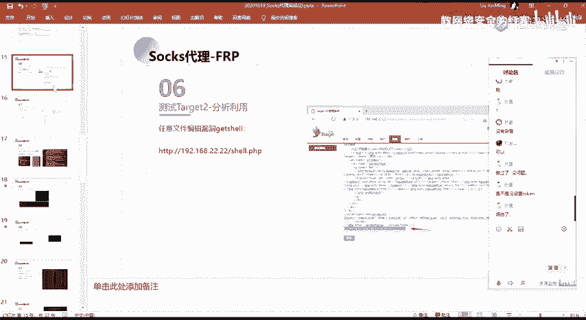

呃，33这一个网状的一个主机的对吧？因为我们有这样子的一个网卡，就我们访问33这一个网状的一个请求的话，我们可以通过这一个网卡来去进一个访问嘛，对吧？

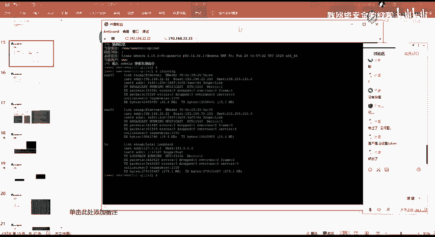

然后我们下一步就其实还是又到了之前的对吧？我们只能通过这一个web渲来去访问商3这一个网段。那么我们想要去做更多的一个操作的话，我们呃就需要去把这边的这个网站做一个代理。

就是把这边的这个内网把它代理代理出去。

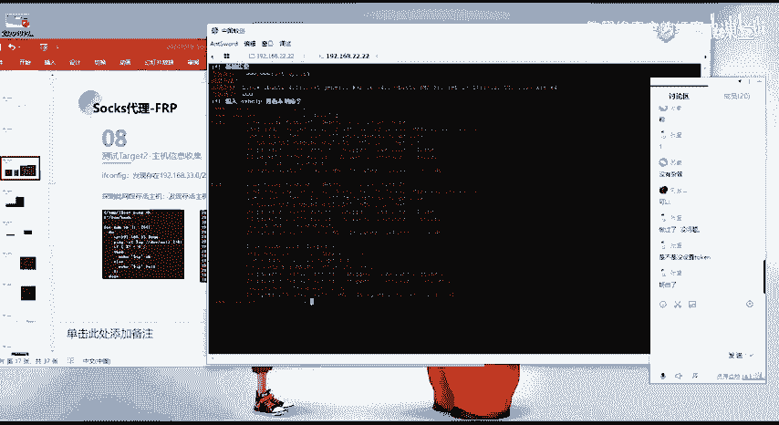

就同样的，我们可以通过我们的一个收索的一个代理。然后呃在这边的话，我们通过这个FRP来去创建这样子的一个二层的一个说袋。啊呃具体的一个具体的一个呃操作步骤的话，就是像这样子。呃，大家看这边的话。

因为我这边的话就是为了显得工整一点，所以的话。

就是这边跟这边是一个，这边跟这边是一个，就是这这边是第一步，这边是第二个。

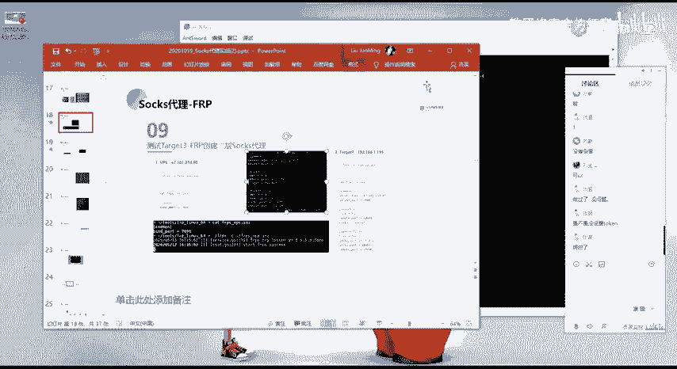

然后第一步的话就是你在VPS上面去做一个这样子的一个配置嘛。去起1个FRP的一个服案。就一般的话就VPS上面，你的1个FRP server的话，呃，就只需要去今天一个端口就可以了。

然后的话等待我们的一个客户端来去连接这个端口经行的一个连接即可。然后其实我们更多的其他的一些配置都是在这样子的一个FRPC这一个这一个配置里面。因为我们需要呃在客户端与我们的一个服务端经理连接之后的话。

有去进呃，就是像我们前面这边对吧？要去做这样子的一个今天这样子的一个端口，对吧？然后的话我们通过这个端口来去进入这一个说的一个代理通道对吧？然后下面的话。第一步的话都是一样的。

第二步的话就是我们在他的一上面，我们要去做更多的一个配置就是。

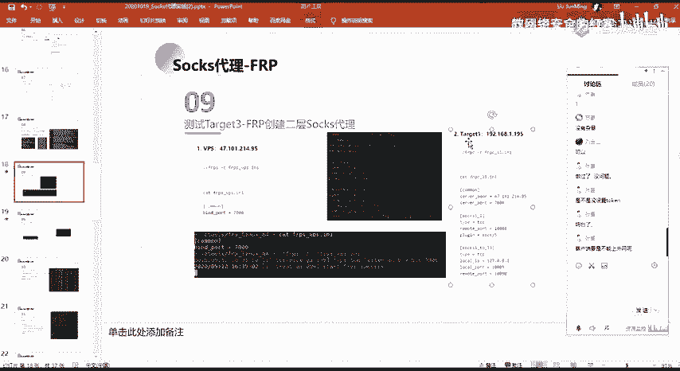