# 2024网络安全系统教程！清华大佬花159小时讲完的网络安全系统课！别再盲目自学了，学完即可就业！零基础入门网络安全！（渗透测试／漏洞挖掘／CTF／黑客技术） - P76：63.FRP创建二层Socks代理.mp4 - 教网络安全的红客 - BV1ft421A7Nj

呃，在这边的话，我们先看一下大概的一个配置吧。然后的话我再给大家具体的讲一下，就说我为什么就为什么要去做这样的一个配置。以及呃他的一个流量转发，或者说他的一个流量代理，它的一个流程。

它是以及失误它是怎样的？呃，这边的话我们主要看一下这边第二步就是这个tt一。这个tt一的话，我这边就是就举呃。

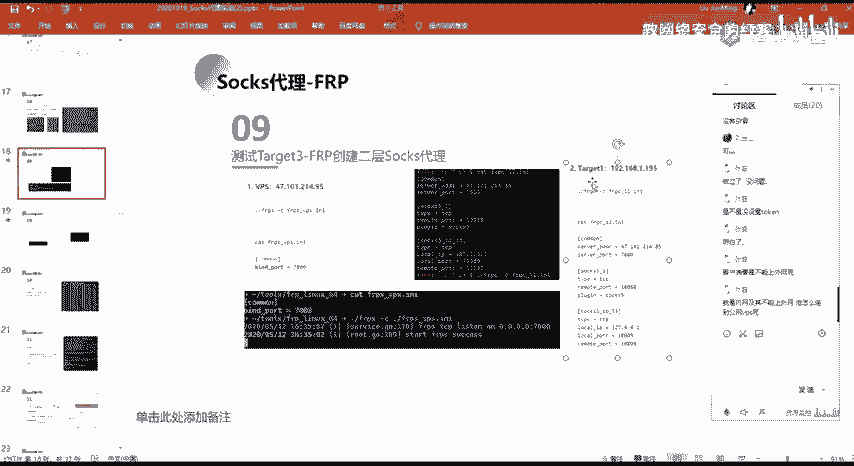

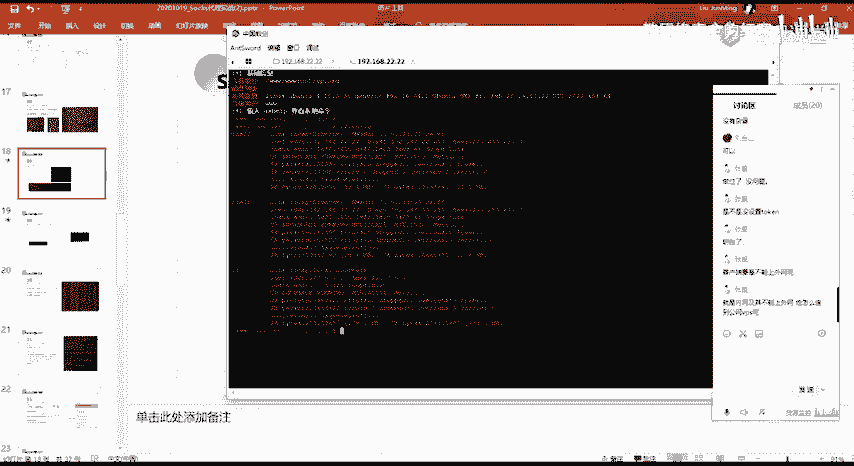

就是说的就是这个。就是这两。呃。就是这边对吧，就他给一他给他他给他上，我特意这样子标了，就是呃能够让大家知道我说的是哪一个机器，就是在哪个机，在哪一个机器上面去进行的这样子一个操作。

然后这边的话是在这个他里，也就是我们得到这个外网的这个work服。的一个外外b服务器对吧？然后的话。

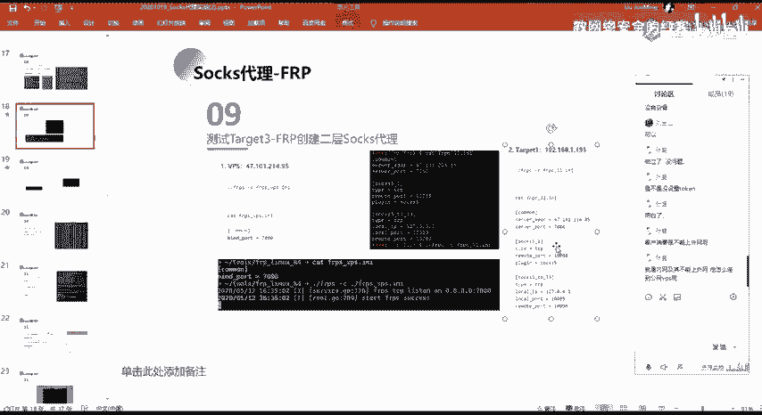

呃，这边的话同样的。

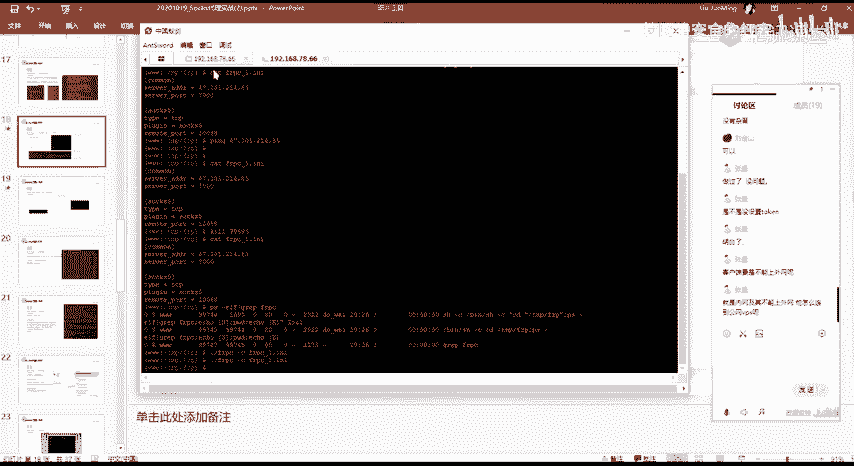

我们在这个文件当中去查看吧。这边这一个文件的话，就相比前面对吧？相比前面这边的。下面呃。相比前面我们第一步去建立了这样子的一个呃代理通道的话，就多了多了。一部分的一个配置对吧？然后呃在这边的话。

其实主要的他就是多了这里的这一部分。我这边的话就是把它呃命名的话，命名为了s5 to33，就是表示我这边的这个ss代理通道的一个配置的话，它是去33这个网段的。就是我配置了这一个代理通的话。

我就能够去访问33这个网段。就呃其实这样子去呃标识这个的话，能够让自己。更好的有你清这一个思路嘛，对吧？就是你这种配置文件。啊，呃前面这一部分你会发现都是一样的是吧？当然的话我这边的话呃就是加了一个一。

就表示我当前的话是在这一个t的E机器上面去呃做的这样子一个配置嘛，是吧？然呃主要的话就是这里的这一部分。这里的这一部分的话。

type C的话就是我们这边同样的是TCP的一个方式去进行一个数据的一个呃传输，对吧？然后这边locgoIP以及loc port的话，从字面意思我们知道就是本地的1个IP以及本地的一个端口，对吧？

这边的话本地IP是就是我们的一个回访地址对吧？然后这边的一个端口10089。好，remoteport我们看到这个remote port的话。

我们就知道就是说我这边呃客户端与我的1个FIPS建立连接之后的话，它会在我的1个VPS上面去增添1个10090的一个端口，对吧？

然后的话我就能够通过这个10090这个端口来去建力啊来去进入这样子的一个代理通道，然呃有疑问的一个地方啊，就是这边的一个loport对吧？我这边的一个loport，为什么要停这一个啊？嗯。

那么在这边的话，我们还还需要去结合我们后面的这样子的一个步骤。呃，下面的话下面这一个步骤的话就是呃在这个t的二上面的一个操作。呃，当然话这里的话还是在他一上面，就在这边ta一上面。

我们呃需要去首先的话需要去上传一个FIPS就是去建立一个FIPFIP的这样子的一个松的一个服务端。然后呃他的一个配置文件的话也是这样子，就其实就跟我们VPS上面是一样的对吧？

然后的话去建立这样子的一个收死的一个呃办理服务器。然后呃建立好之后。建立好之后的话，我们在tag2上面，也就是呃我们这边。

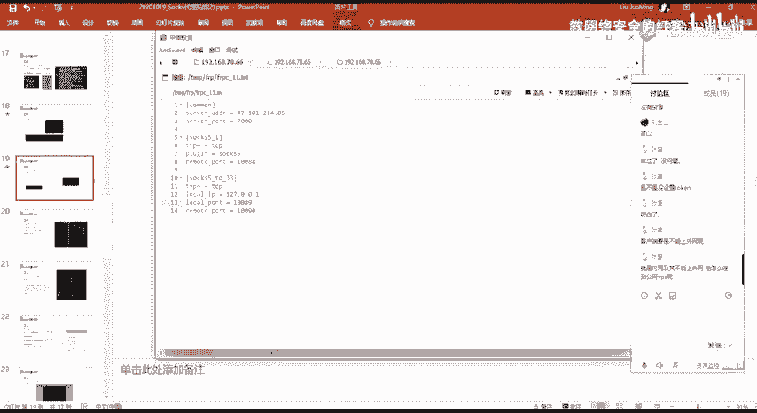

也就是我们这边对吧拿下的这样子的呃，2。2这个机器的这个线，就是我们在这边的这个机器上面的话，我们还需要去做这样子的一个操作。

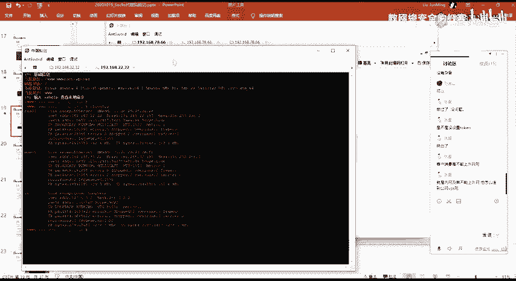

就是啊去上传1个FRPC的一个客户端栏，然后的话去啊做这样的一个配置。这边的这个配置的话，我们呃同样的在这边文件当中去看吧。就是呃这边这个FIRP-2。

然后这边的这个配置文件的话跟前面的话就有了不同不同的一个地方的话，我们可以看到就这个s address对吧？s address这边的话，我们指的是指定的是这个2。

1的这个IP以及这边的一个端口是7000对吧？然呃这边的这个s dress，为什么是指定的是这个呢？我们再来看一下这边。就是。

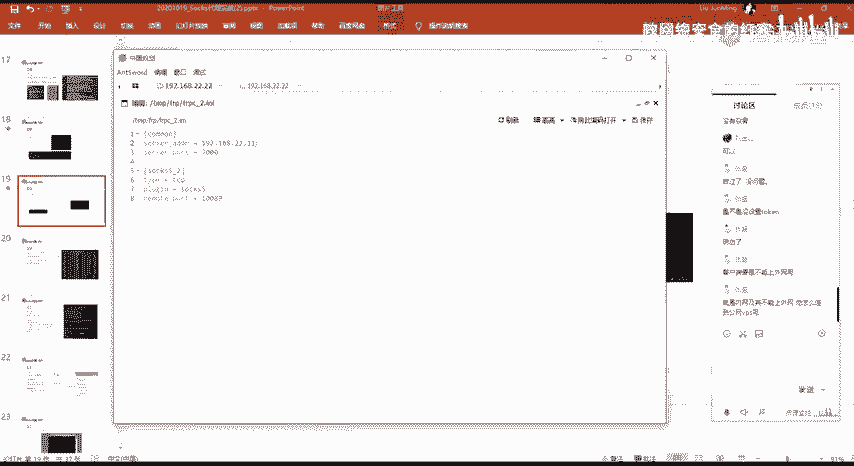

这边。

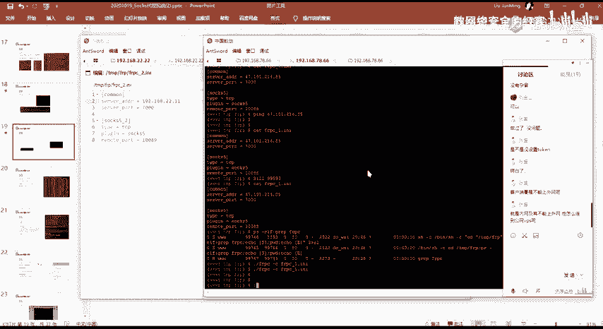

就是我当前的这个就是这个机器，对吧？七8。66，或者说这个内网IP是192。668。2。1的这个机器对吧？这个机的话是我们拿下的那个外网的一个work服务器，对吧？

然后在这一个机器它的一个它所分配的一个内网IP它就是2。1对吧？然后我们这边所指定的一个FIP server的一个IP的话，就是这一个IP就这一个机器的一个IP为什么指定的是这个呢？

因为我们在这边有建立这样子的一个P server对吧？就其实就是说让t2这边是作为一个FIP的一个客户端，然后的话来去连接在这边我们呃这个机器上面的所建立的这样子的一个P server的一个服务端。

对吧？然后的话他这个t2与这边的一个t一之间去建立这样子的一个的一个代理通道。然后下面的一个配置的话，就是我们的一个ss代理通道的一个配置，对吧？我这的话就是s5，刚刚就表示的话。

我这边是在tag2上面。然后呃同样的就是指定呃我们的一个插件shops5，然后的话指定我们这边remote port。为10089。大家看到这个10089就应该能够去知道，对吧？

我们前面这边在这里为什么要去配置？这边是10089。因为我们在这边ta2与这边的一个呃这边与这边的tact一的1个FRP的一个服务端去建立连接之后的话，对吧？它会在呃这边的这个tact一上面。

也就是在这边呃在这个内部的这个FIRP的一个serverer上面，它会去今天1个10089的一个端口。

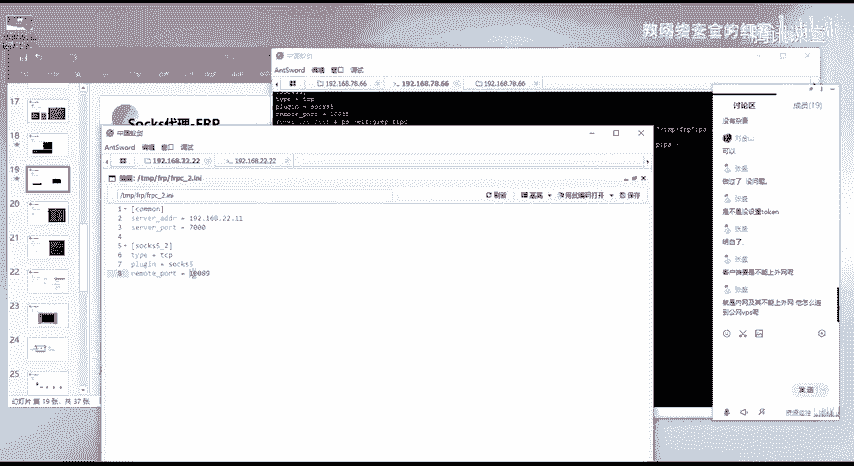

然后的话在这边呃在这边他可能一上面的话，我这边他又做了这样子的一个操作。这边的这个操作他是什么意思呢？他其实是做了这样子的一个流量的一个转发，就是他把我。

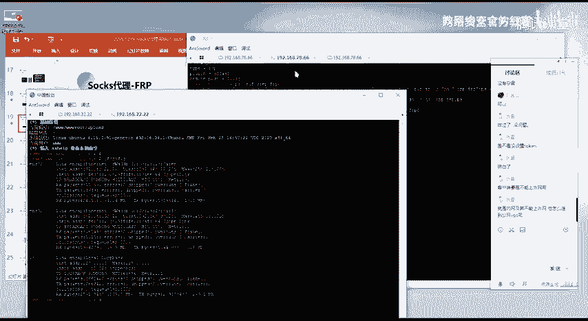

他把我这边本地的对吧？因为我当前这边的话是在他给的一上面，对吧？我这边这我这边FRPC执行执行这个配置文件之后的话，他就会呃把我这边本地的这一个10089的一个端口，他的一个流量。

把它给转到我这边的一个10090。呃呃，不对，说说说反了说反了就呃说反了，是是从就是从我们远程的就从我们就是呃在公网EPS上面所今天的这个端口的一个流量，会把它转发到我们这边的1个10089。

然后这边的一个10089的这个端口的话，就是我们这边一与2之间的一个说代理通道的这样子的一个代理端口，对吧？其实就是其实最后的话他的一个流量的话。

它就会通过这边的这个10089的一个端口进入到这边的一个t2与t一之间的一个代理通道，对吧？然后的话把它给转到我们这边的这个呃2。2这个机器上面，对吧？那么我们这个时候的话，我们这边建立通道之后的话。

对吧？这个时候我们。

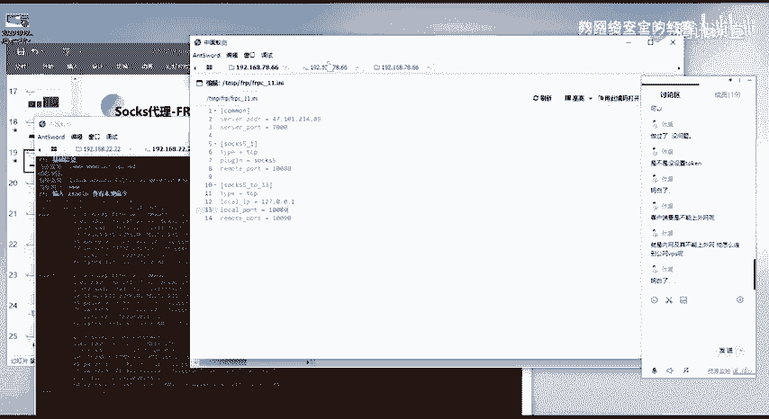

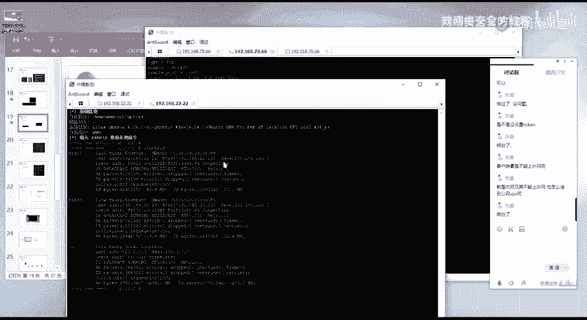

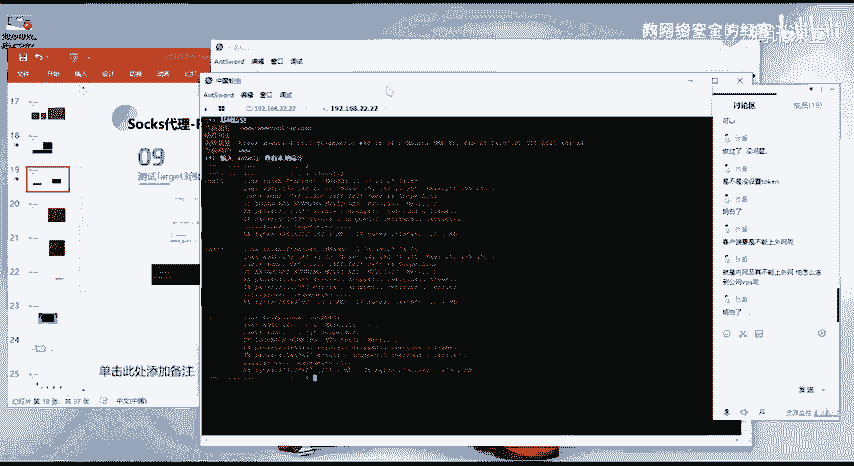

只需要在。

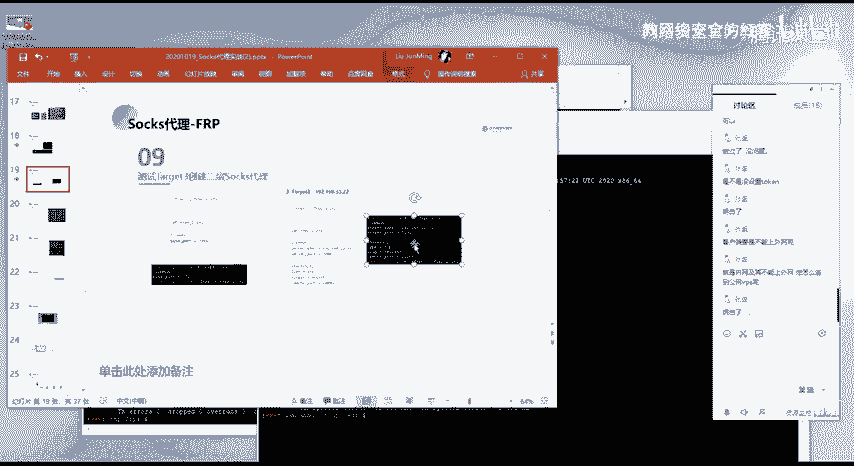

呃，只需要就是。比如说我这边我要去访问33这个网站的某一个word服务，对吧？某一个主机的这样子的一个就是这边商3你33的这个机器是吧？然我要去访问的话。

我就需要去通过我们刚刚所建立的这样子的一个代理的一个通道，是吧？

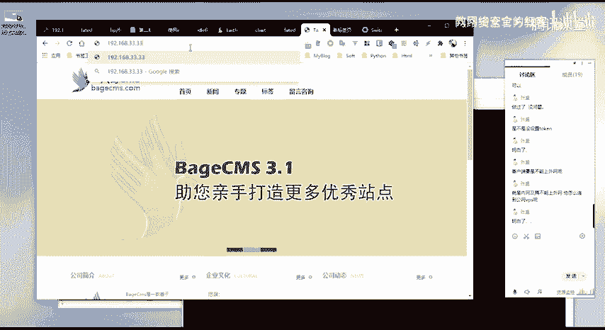

然后刚刚所建立的这样子的一个代理通道的话，其实它的一个。

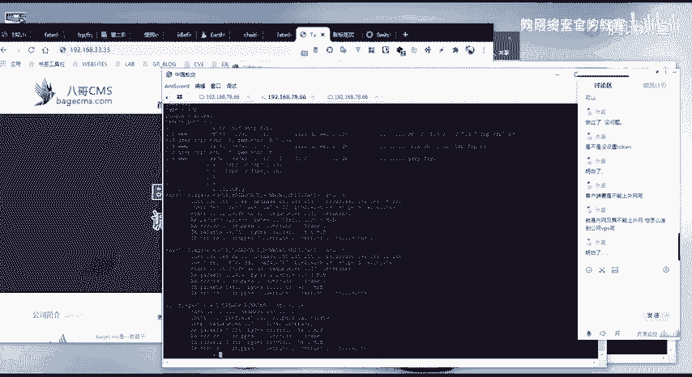

呃，这边的一个代理端口的话就是这一个对吧？就是10090。所以的话我们如果说我这边经理成功了，对吧？我这边去配置这样子一个代理的话，我这边要他的一个代理端口是10。

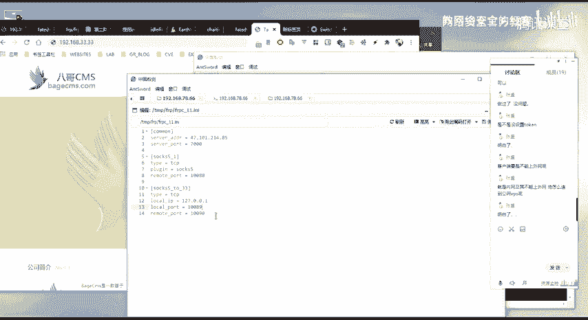

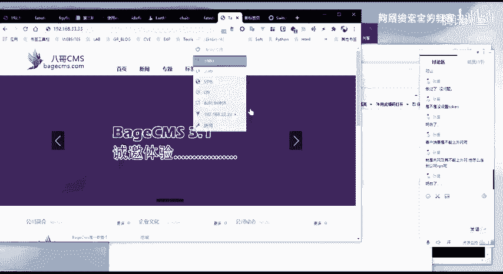

90断了。而不是之前的那个之前那个的话，只是就是一层的这样子的一个收索代理啊。然后这边我这边配置好之后的话，我就可以通过这边的一个代理通道来去访问这个呃33。33的这个wordb服务，对吧？

但然的话因为这个主机的话，它没有这样的wordb服啊，所以的话。

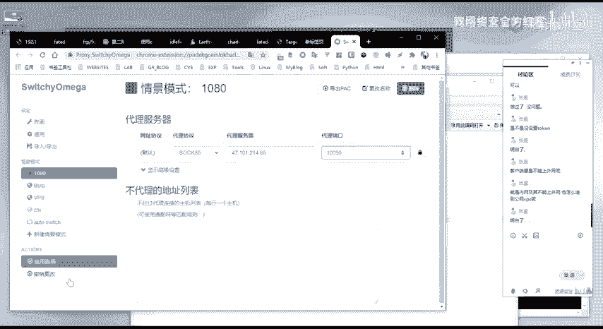

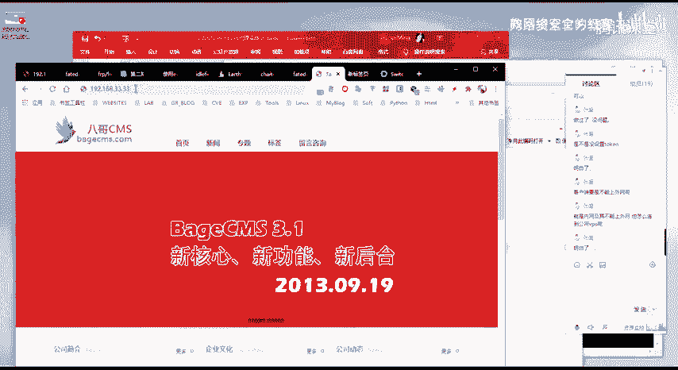

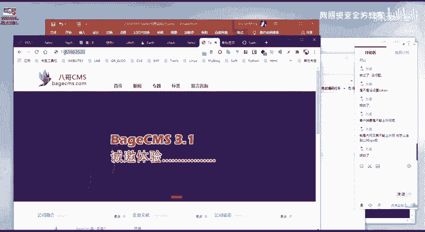

这边防不到对吧，以及我这边的话还没有去实际的去操作。来去建立这样子一个通道。然后呃。

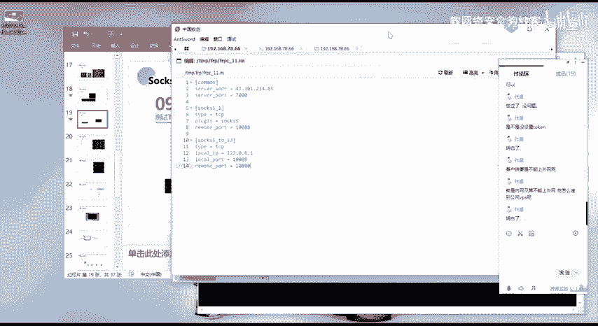

我们在这边就是说我们在这边去做一个这样子一个请求之后的话，我们的一个流量它是怎么去走的？在这边有必要给大家去捋一下，就捋清一下思路。就是说就是你去理解这样子的一个代理通道的话，你。

主要的话你就理解我们这边的一个流量，它的一个请求它是怎么去走的，对吧？比如说我这边我去。访问这1个2。2这个机器，对吧？通过之前的这样子一个代理通道。呃，黄掉了。好，这边改一掉。108。

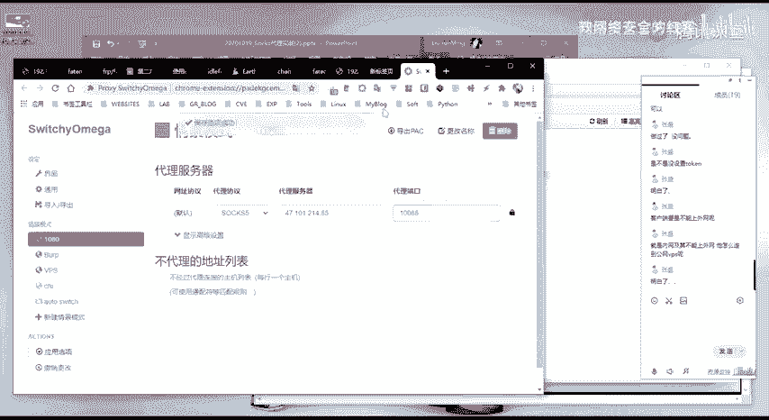

比如说我这边对吧，我这边通过我这边的这个10088的这个代理通道，对吧？代理。然后的话我去访问这个二这个机器对吧？那么我在这边的话，其实在我的1个VPS上面，其实我在我的1个VPS上面的话。

它有去监听这样子的1个10088的一个端口，对吧？然后这边的1个10088端口的话，就是我们进入这一个代理通道的一个端口，然后我比我要去代理我这边的一个HTP的一个请求，对吧？

去访问2这个网站的一个呃外服务。那么它的这个请求的话，它会通过这个端口，进入到这里的一个代理通道，对吧？然后的话会去呃因为我们这边代理通道的话，它会把它代理到带入到我这边的这个网段，对吧？

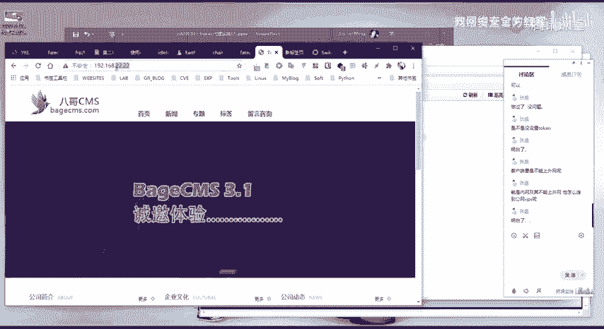

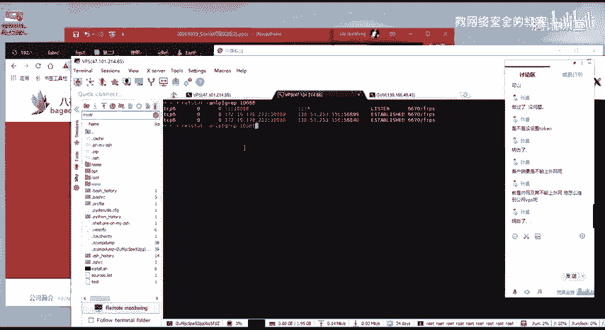

其实就是相当于就是带理到了这里这边的这个机器，对吧？然后这边的这个机器的话，它是能够去。访问到这一个2这个网络的对吧？所以的话我这边的一个请求的话是访问的是2。2这个机器。那么我通过这个单理通道的话。

它会把我的一个请求。就是通过这边的这个网卡，把它给发送到这个2。2这个机器的那个呃80端口，对吧？因为是外网服务嘛。

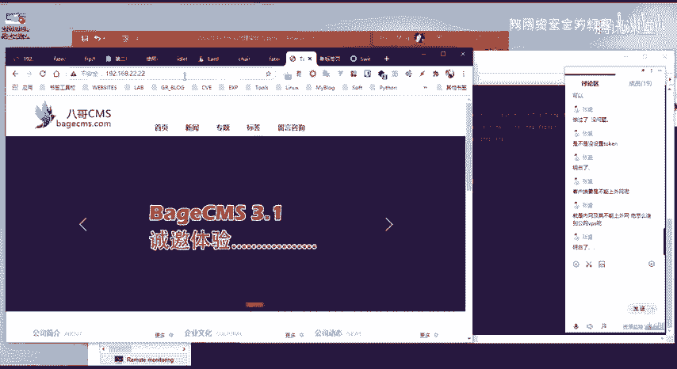

它会发送过去发生过去之后的话，它就会呃就是进行相应的一个请求嘛，对吧？然后的话就能够去得到我们这边的这样子的一个呃内容，对吧？然后的话同理其实呃二层的一个代理通的话。

它就中间只是多了这样子一个流量的一个转化。

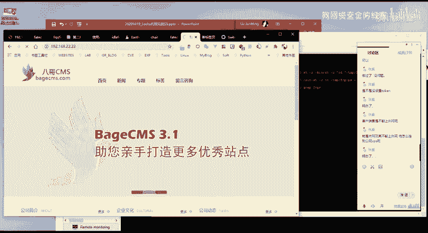

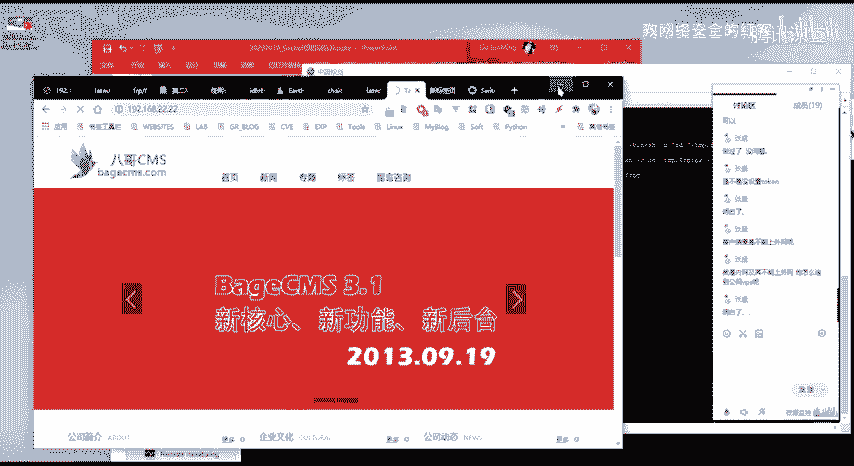

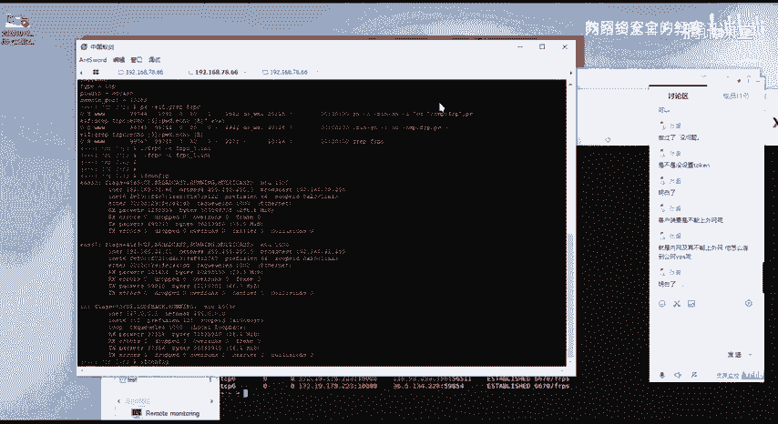

因为我们。嗯。呃。8点50，我这边切一下，因为这边第第一节课的话已经到时间了，我这边下一下课，然后的话等会那继续啊。刚的话讲到了就是一层单元的时候，它的一个流量的一个走向，对吧？

其实二层的一个单元的话也是一样的一个道理。就只是在这边的话，它中间多了有这样子的一个流量的一个转发。我们可以结合一下这边的它的一个配置文件来去理解是吧？首先的话在这边是我的一个外网的一个word服务。

对吧？它会这边的一个客户端的话，它会去连接我们呃这个VPS上面的这一个70的一个端口，对吧？然后的话建立一个代理通道，然后建立代理通道之后的话，我这边的话，我就能够去访问到这边的呃这这边的这个机器。

对吧？

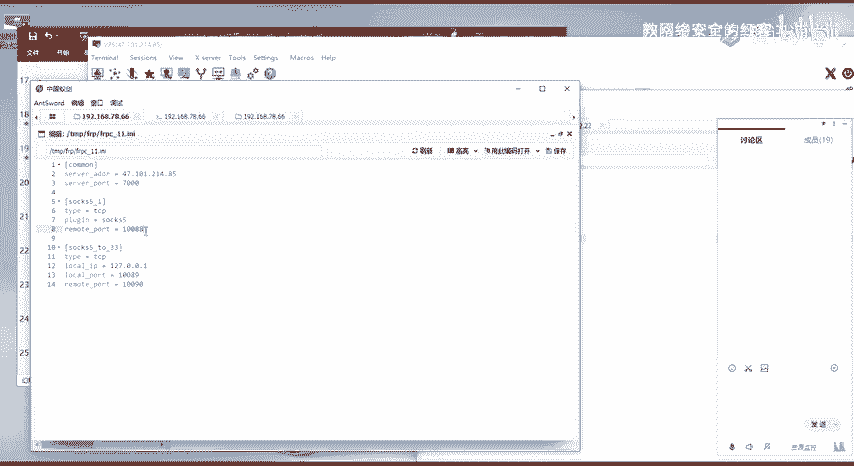

这边的这个机器就能够去访问到了。然后的话。

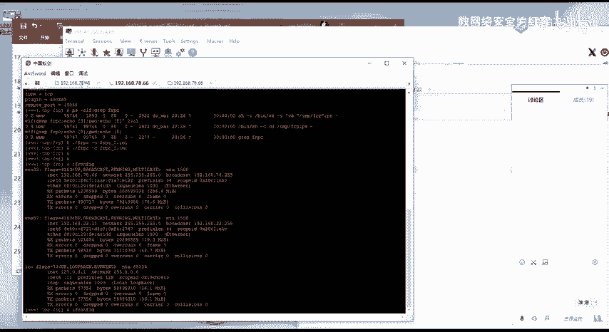

我们还要去访问，就是说33哦，就是说去访问2。2哦，不是访问33这个机器的话，对吧？我们是要通过这个2这个机器才能够去访问到的对吧？然后这个2这个机器跟这边的这个机器它是能够互相访问的对吧？

那么在这个时候的话，我们就需要有这样子的一个通道，就是静力就是静力这边的1个2。2呃，我我以这边这个IP啊，就是。这边它同一个网段嘛，因为2。2这个机器对吧？与这边的2。1的这个机器。

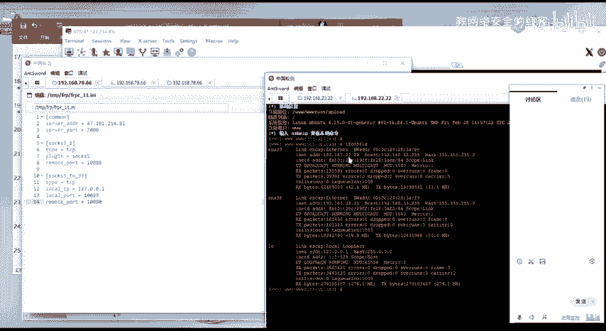

要有这样子的一个通道，对吧？因为我们的一个请求的话，我们要能够去发送到这边的这一个。

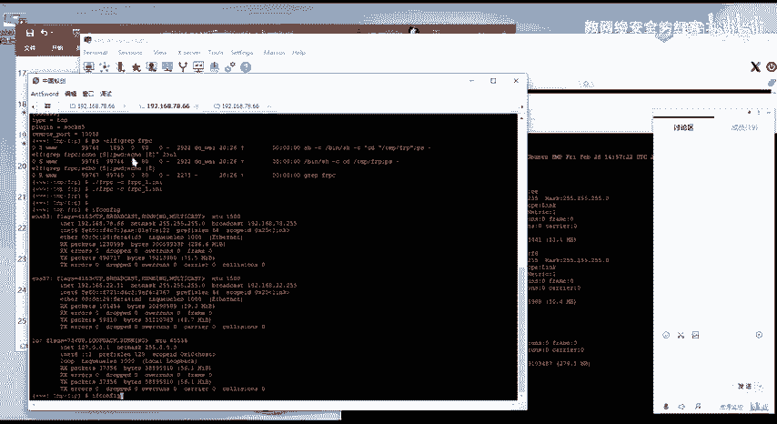

呃，33这一个网站。那么我在这边。其实就是相当于就是说在这边。呃，2。1跟2。2之间，我们还需要有一个这样子的一个代理通道。因为我只有把这边把我的一个请求。

或者说把我这边的一个内网的这个网段把它代理出去。我才能够说能够去访问到，或者说以流量的一个形式的话，就是我这边的这里我的一个请求发送到了这边的这个机器，对吧？

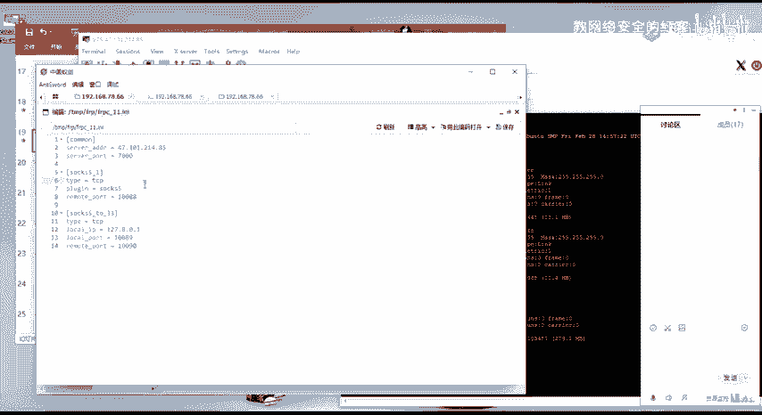

然后的话我想要呃把它发送到我这边商3这个网站的话，我中间需要有这样子一个代理通道，把我的一个流量把它给代理到这边来，对吧？

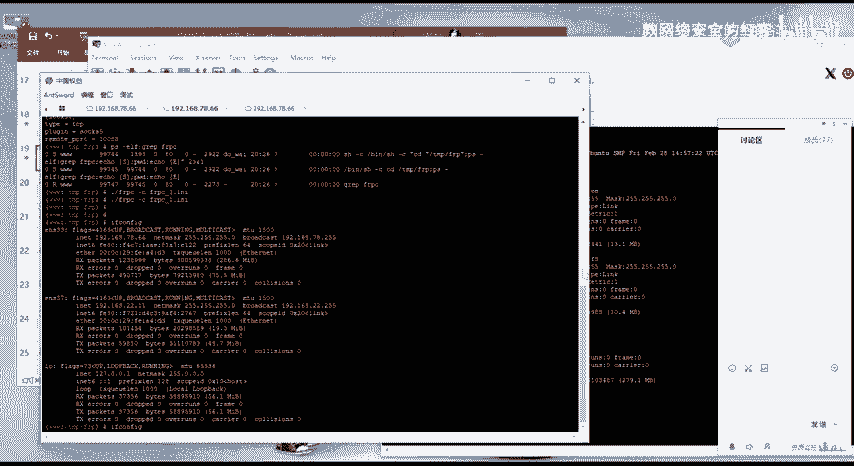

所以的话我们在这边的话就需要有这样子的一个操作。就是我通过这边的这一个呃。哎。不是是。我通过这边呃，就是这边的这个2。1的这个机器，对吧？

我再去建立这样子的1个FRP通过FRP来去建立这样子的一个去精聘一个端口，对吧？作为一个FRP的一个s的一个服务端。然后在这边2。2这个机器的话，我在运行我这边的1个FRPC对吧？

运行我这边的一个FRPC客户端，然后的话与我这边的这个2。1的这个机器建建立一个连接，来去建立一个收持的一个通道，对？那么建立这一个说字通道的话，我们要去要把我们那个请求，要能够去带领到这个通道的话。

在这边的话，我们就需要有一个端口，对吧？其实呃就是这1个10089的一个端口。然后这个10089端头的话，它就会在这边经经历今天嘛，对吧？在这边的这个2。1的这个机器。

今今天这样子1个1089的一个端口。

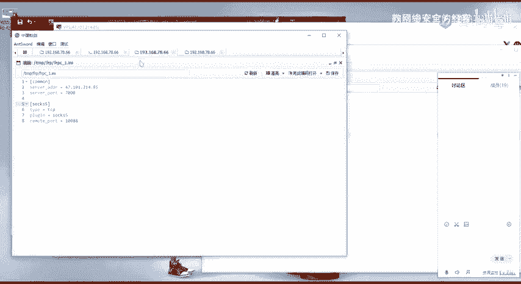

然后我们。最后的话还有这边就是说我通过这边进行的一个连接，我的一个请求到了这边，对吧？那么我要去把我的一个请求再把它转发到我这边的这个10089的一个端口。所以的话我需要有这样子的一个配置。

然后呃在这边的话就是说我要去建立这我要去进入这边呃，201的这个机器跟我UPS进行的一个代理通的话，我需要通过这个109年的一个端口，对吧？那么我的一个实际的一个流流量请求。

比如说我这边的一个wordb服务，对吧？33033去访问这个33033，就假如。

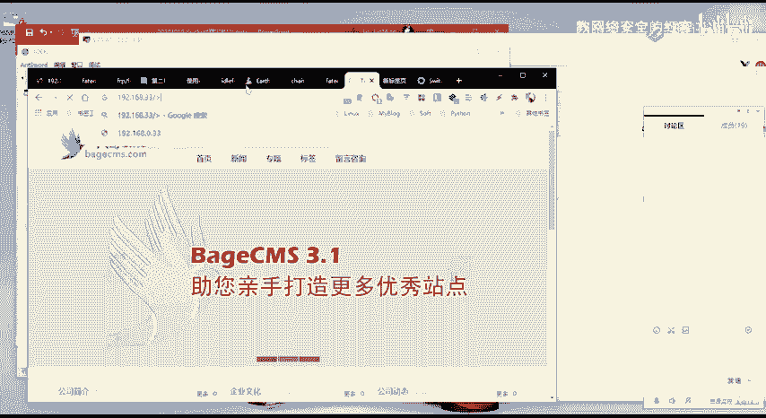

那么我的这一个rob请求，我请求之后的话，我这边的一个代理代理通道的话，我是要去就是通过我这边的1个90这个对吧？然后的话来去进入这边的一个代理通道，把我的个请求代理代理代理进去，代理到这边的这个机器。

对吧？然后的话代理到这个机器是上面的话，我这边是访问的是33，对吧？那么我33的话是在这边。所以的话我需要把我这边的一个请求，再把它转发到这边的一个呃这边的2。1与这边2。

2这个机器之间建立的一个代理通道，也就是通过这边的这个10089的一个端口。

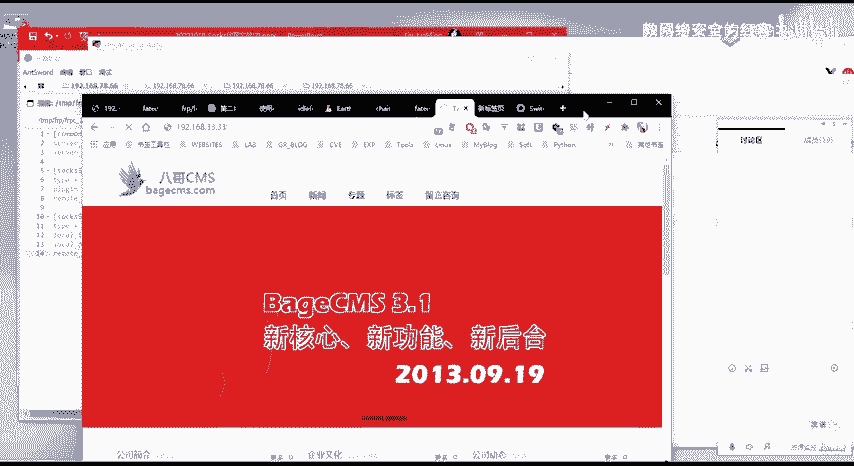

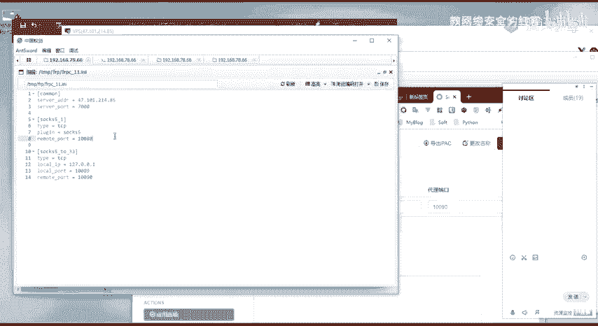

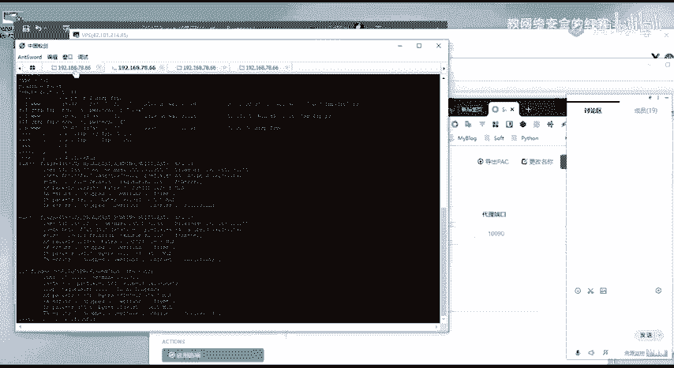

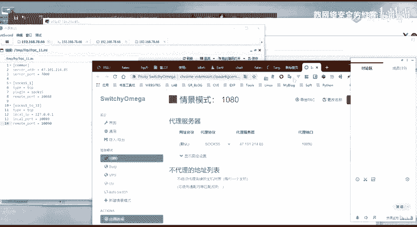

其实就是把这边从10090端口过来的，请求，把它给转到这边的一个端口，也就进入到了这边的呃，这边这两个机器之间建立的一个代理通道，对吧？然后的话这边的一个请求的话就代理到了这边。

那么它就能够通过这边的一个网卡来去访问到33。33的1个80端口，对吧？

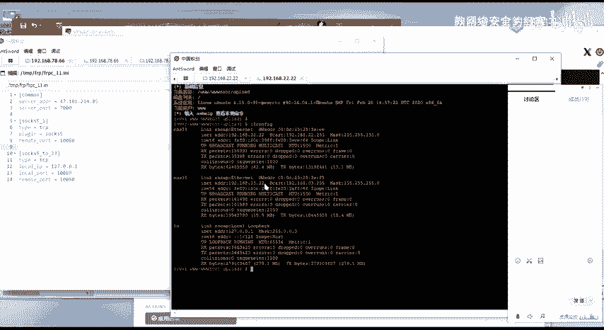

呃，这里能大家能理解吗？大家呃能跟得上我的思路吗？应该可以吧。就呃，就张生没问题吧，其他同学呢？就大家呃觉得我就是呃可能讲的快了，或者说还你没讲没讲明白什么的。都可以提出来，可以是吧？

OK那那么我们具体的来操作一下嗯。

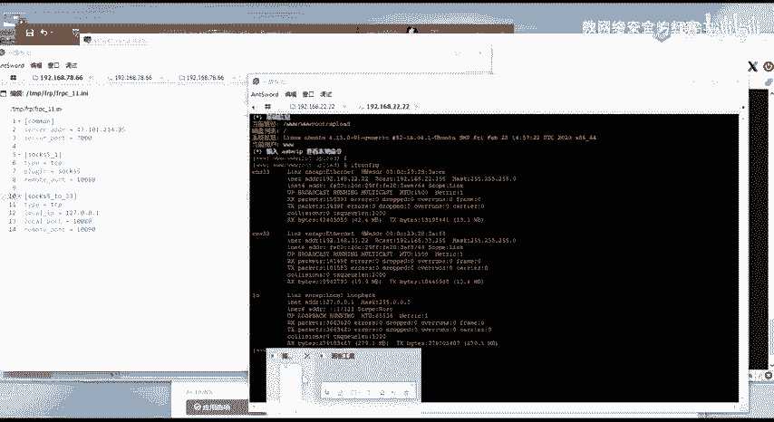

我们。具体的来实现一下。

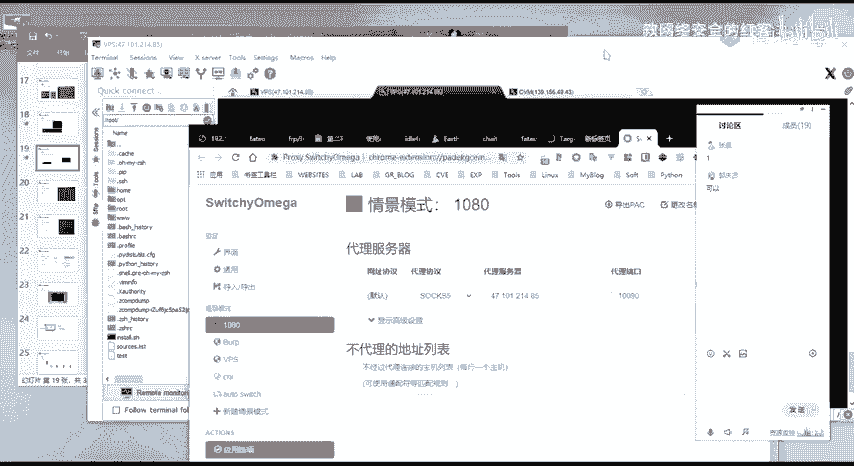

就其实呃他的一个原他的一个具体的一个操作。我刚刚其实已经也讲了，对吧？以及为什么要去这样子的一个操作。呃，在这边的话，首先的话我们需要在FI呃我们的1个UPS上面，对吧？

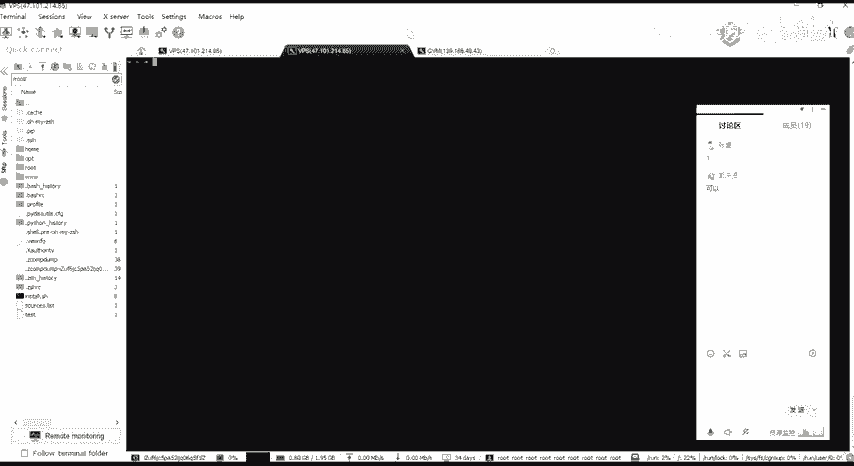

嗯。这边是。是的。我这边关了吧，我直接关了，我重新来了。要怕大家可能。不是很理解是吧？首先的话呃，我在我的1个UPS上面，对吧？我要去进行一个端口来等待我们的一个客户端的一个连接。

我这边的话就是IRPC。对吧然后我这边的话就进行了一个70的一个端口。今天这一个端口之后的话，我再通过。

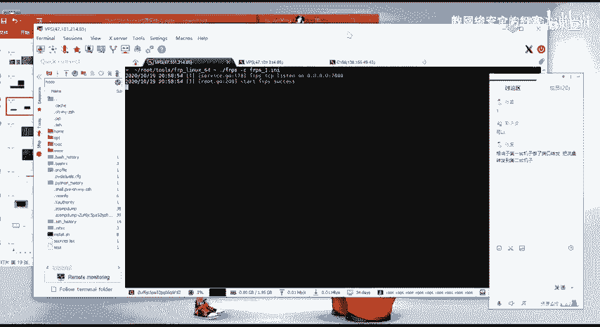

我这边。得到的通过这边得到的这个外网的这个外服务的一个需，对吧？上传我这边的1个FR片。

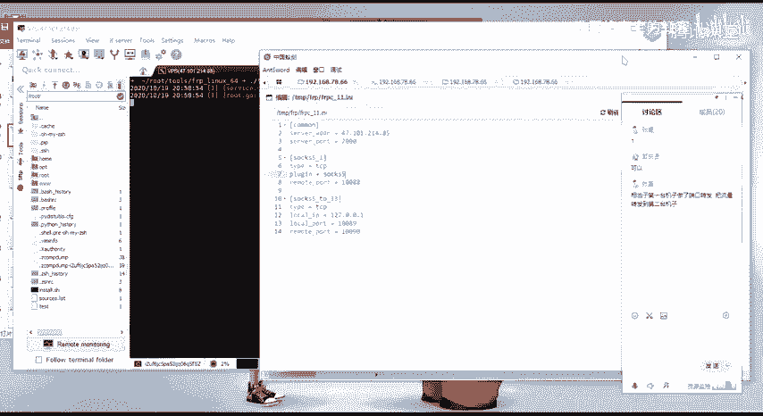

阿把PC的一个客户端。对吧我这边的话上传在这边，然后的话给他一个执行权限。啊，我呃我先看一下。还有没有？我这边的话把这些都发了。你看到我这边有执行1个FPS，这是我之前呃测试的。我这边把它给削掉。星期。

嗯。啊，现在的话已经没有了，对吧？然后的话我在这边我要去与我这边的这里的一个通道去进行一个连接。

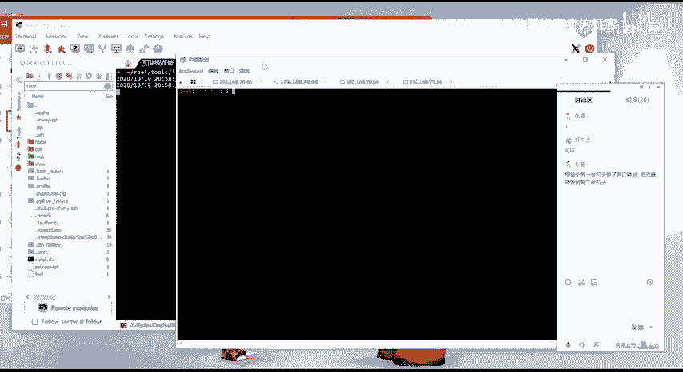

呃，刚开始的第一种的话就是通过通过这样子的呃，通过这边，通过这里对吧？我通过FRRPC去指定这边的一个通道去进的一个连件，对吧？那么下面的话我想要去把我的一个流量。

就是我这边话直接就用这边的一个配置文件对吧？那其实在这里的话，其实同样的也能够去做一个与他那个去进行一个代理，对吧？然后的话通过10088的一个端口。然后我这边的话。

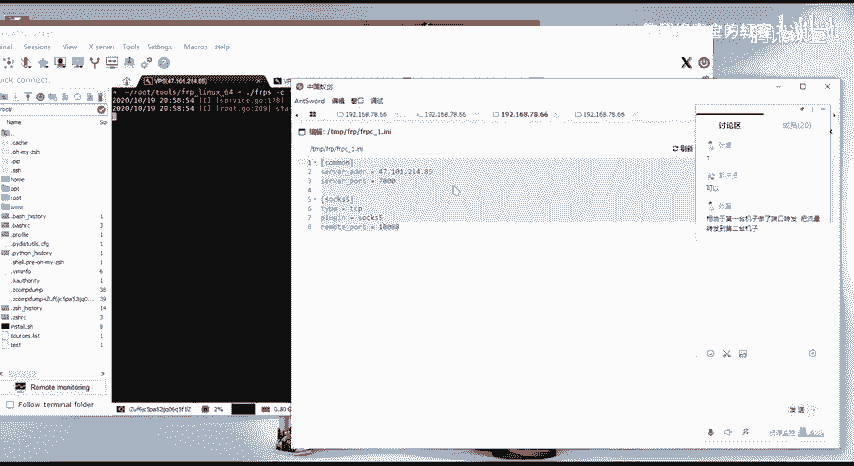

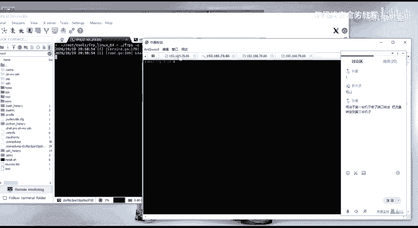

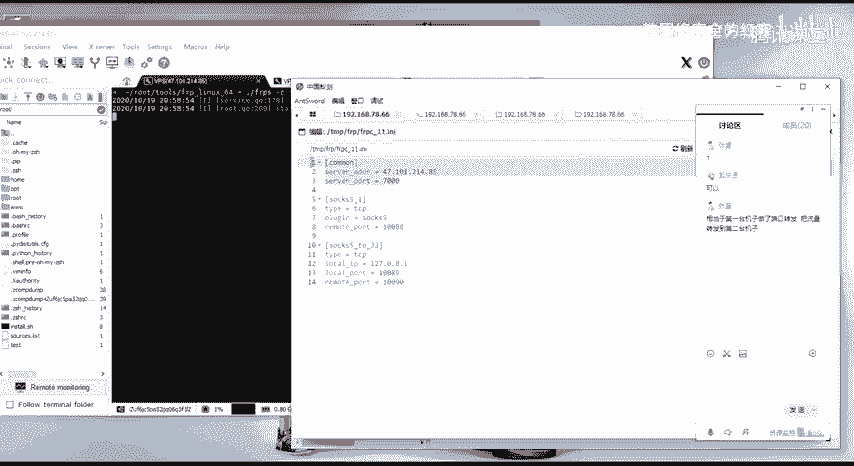

要去建立一个二层那的话，我只定这边的这一个。是一吧。一点A啊。来去这边去进行一个连接，对吧？然后可以看到在这边呃，有两个pros已经就是进行成功了，对吧？然后鉴立鉴立成功之后的话。我在这边的话对吧？

我在这边的话就有了。我们可以看一下。嗯。我在这边的话就与这边去进行了一个连接，对吧？然后的话我在这边的话就有他会去进建这个端口，对吧？

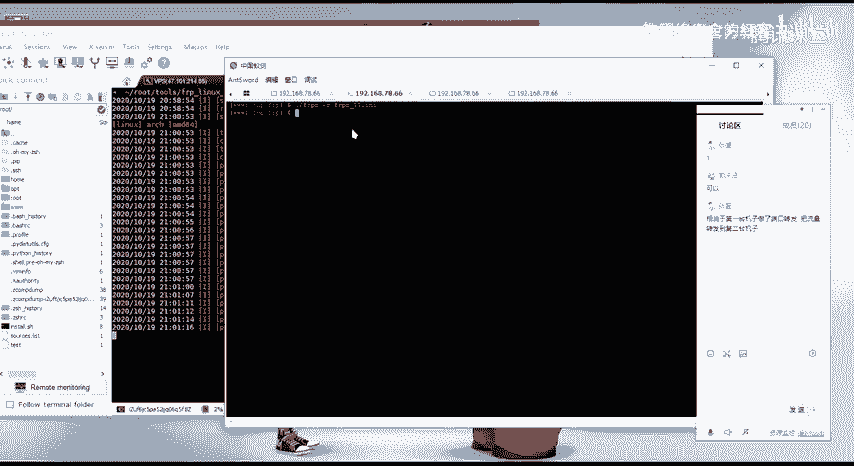

这里的这一个代理端口。那么我现在的话就能够去通过这个代理端口来去访问2。2那个网段。对？然后因为前面的话我们已经得到了这个前通过前面的那个对吧？已经得到了它的一个需。

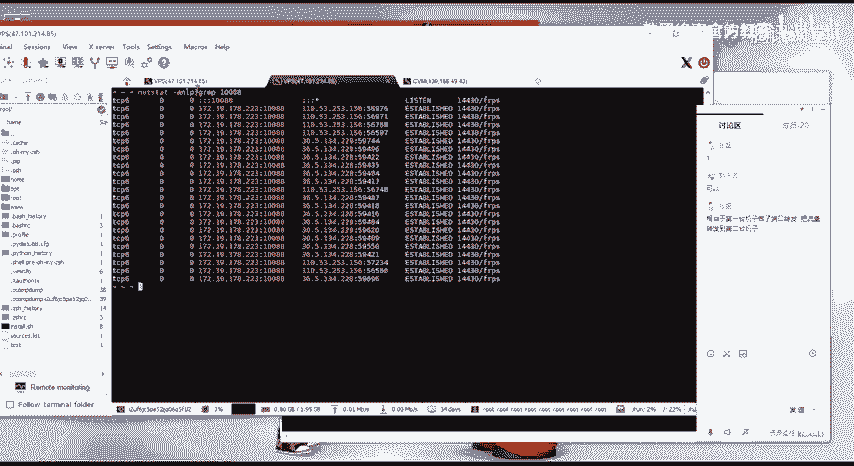

对吧那么我现在的话只需要再通过这边的一个代理，通过原来的一个代理，对吧？然后的话得到这边的一个选。

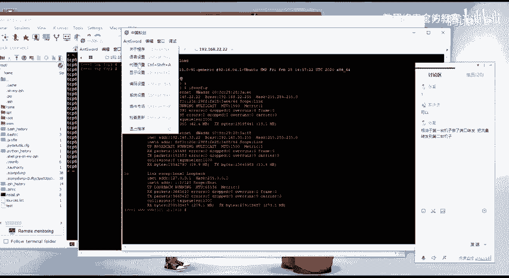

嗯。继续可以。😔，啊，是没有问题的。因为我们在这块其实同样都静静的这样子一个代理嘛。然后我通过这边的1个11188，我同样的能够去访问这个这个网段，对吧？然后下下面的话，我要把我的一个流量把它给转到。

就是说把它给转到这个33这个网段。

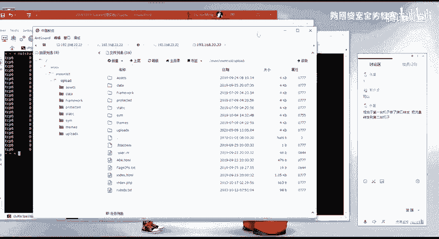

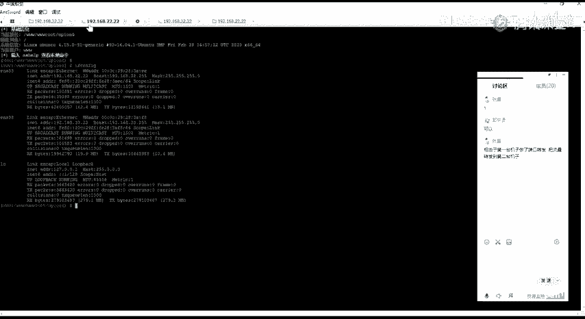

我们就需要去做这样子的一个。操作。

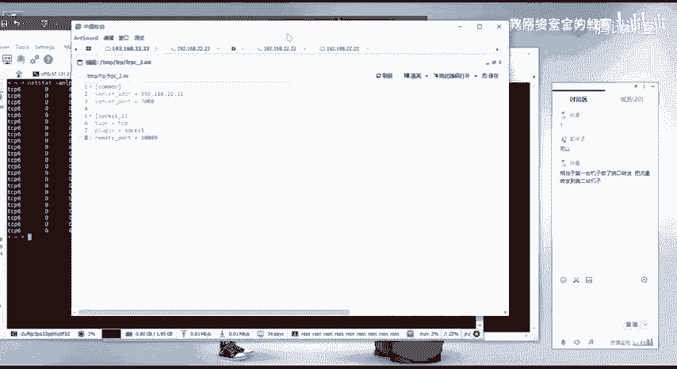

首先的话第一个就是在我这边的。嗯。这边。这边的这个ta给的一上面，我需要通过。FRRP。来去今天一个端口，来去等待这边的我这边2的这个呃FIP的客户端来去建行一个连接，对吧？呃，这边的话是IRPC。

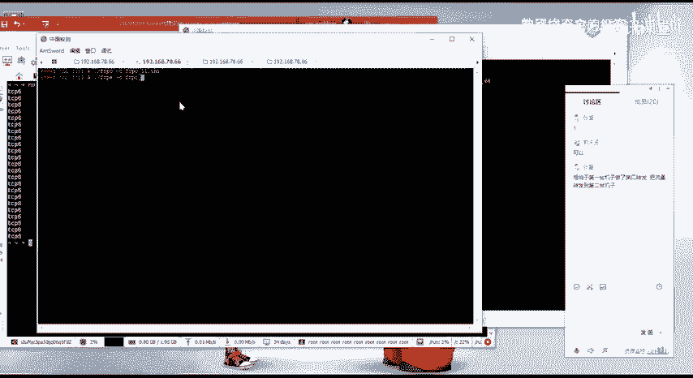

应该是吧。嗯。就这个FRP对吧？

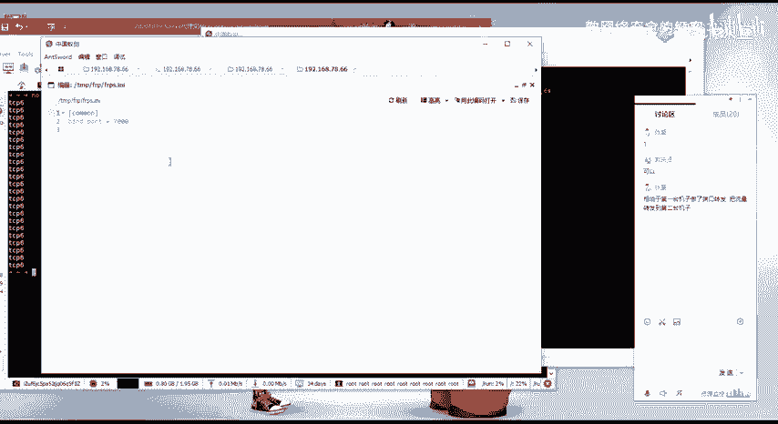

啊。然后在这边的话，我们可以来看一下是否就是执行成了。已经成功了。不。I批。对吧。可以看到这的话已经执行成功了，然后他在这边本地的话就经听了这样子的一个端口吧？这个端口的话就是。70好吧70。

70的一个端口对吧？已经处于一个进行状态。好，我们在这边的话，再通过这边来去建立一个。Okay。你建立一个说词的一个连接呃。执行这边的1个FRP。啊阿把。执行之后的话，我们的一个配置文件，对吧？

我们可以看一下我们的一个配置文件的话，它会是在呃我们那个RP上面，它会去精天一个这样子1个10089的一个端口。那么我们去判断它是否经力连接的话，我们就可以去查看。

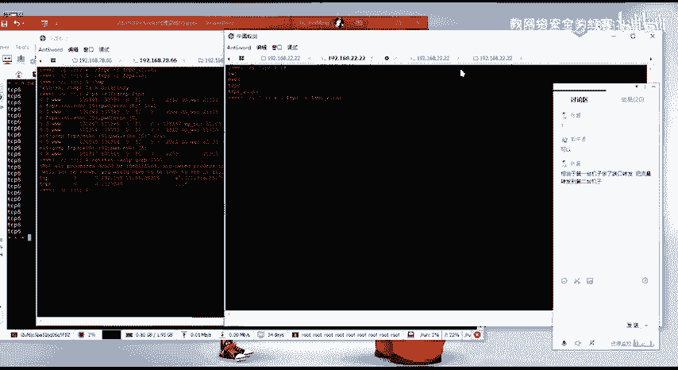

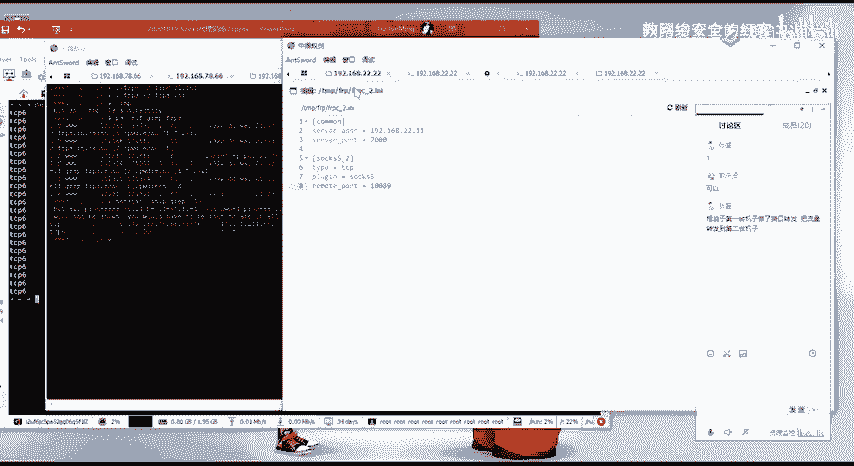

他的这个端口它是否有一个今天的一个状态？1八点。对吧可以看到已经处于一个惊天状态。那么现在我们经历了这样子一个连接之后，对吧？经历了这样子一个连接之后的话，我们再通过。

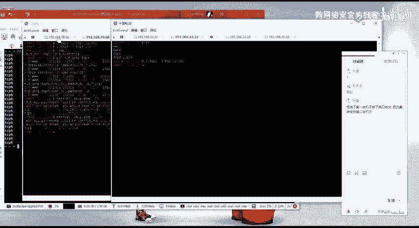

嗯。

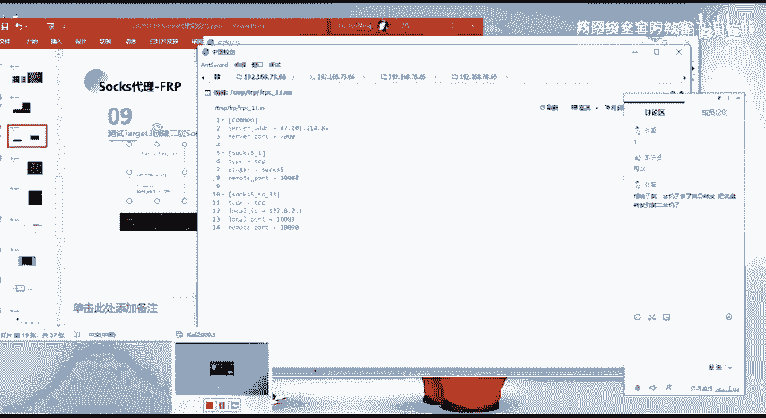

比如说。呃，这里还是以这个机器为例。

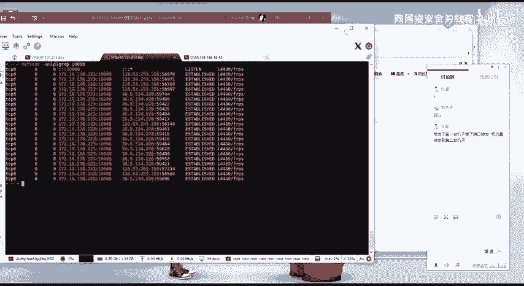

我们需要去更改一下我们的一个配置。因为我们这边的一个代理端口的话已经定了，是吧？现在的话是1009。啊，我们通过b change同样的来去扫描下。诶。这个192。168。33。33这个主机对吧？嗯。嗯。

没经历什么。等一下啊，看一下。

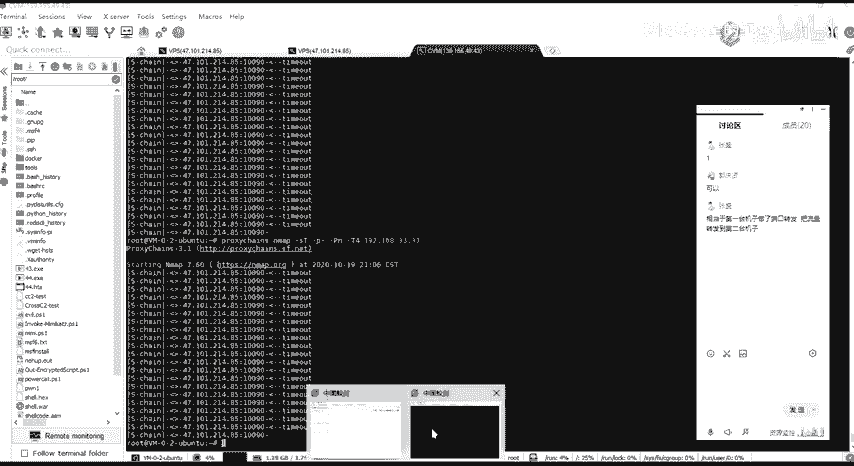

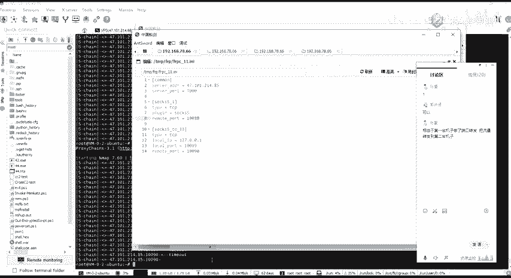

啊，我这边FRPC断掉了。这个用通过这样子这个方法，它有缺点就是。比较容易断。我这边的话。

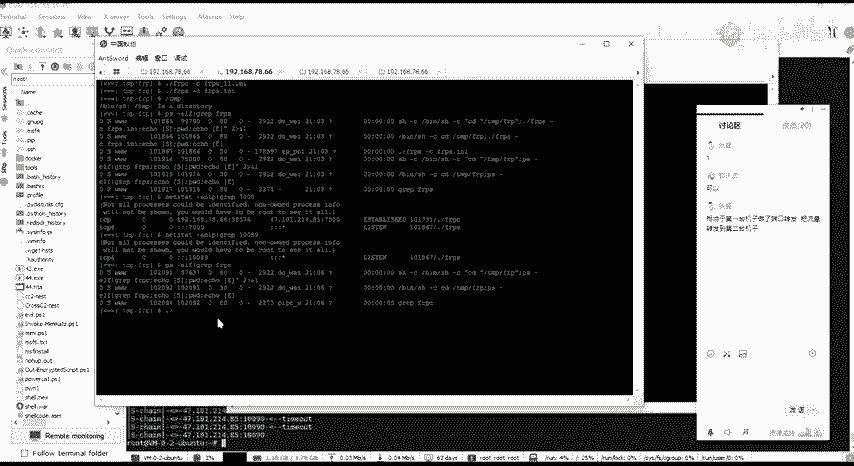

呃，其实。从这边应该也能看到，对吧？就就是我这边的一个呃说的一个代元的话，已经就是。被关闭了。所以说话我这边。就是找这找找这一个问题的话，就是我这边的1个FRPC对吧？

没有跟我VPS上面的1个FRP去建行了一个连接。是一点。那要从头来。现号应该是没问题了。

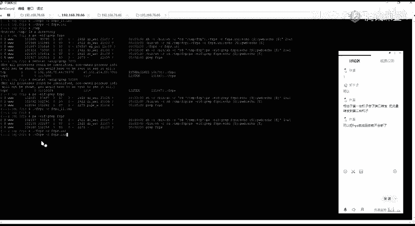

这里的话也已经进行了连接，对吧？然后的话我们在。我另外的一个服务器上面还去进行一个，对吧？

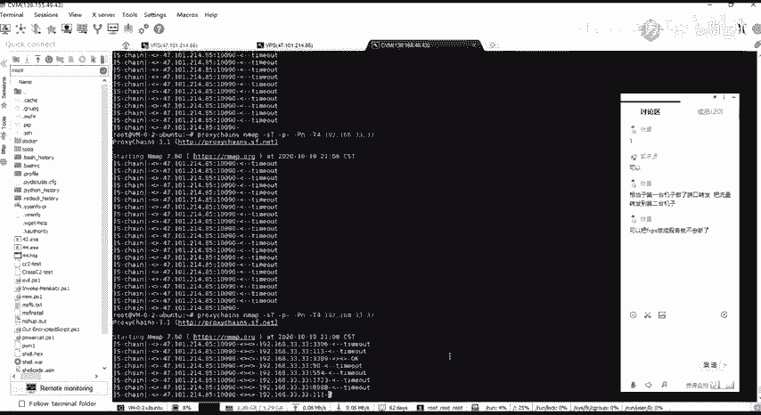

通外m来去对他去做一个扫描，可以看到这的话，OK他OK就3389端口开放了，对吧？还有445135等等这一些端口139，它是一个开放的一个状态。那么说明的话，我这边的一个通告的话，就是已经尽入尽立呃。

建力成功了，对吧？是没有问题的。然后以及对吧我这边可以通过。可以通过全局代理对吧？因为我前面的话已经就是我后面后后续的一个操作，就对windows那一个机器嘛，对吧？对windows那个机器的话，呃。

我们可以就在MSF当中去设置那样子的一个代理，就是设置全局代理。让我们MSF的一个流量走我这边的这样子的一个代理通道，就是呃这个47。1010214。85，然后这个10090这个IP这个端口对吧？

前面在讲MSF的啊，不在讲MSF跟CS呃，灵动的时候，不是呃CS上面的话，它会有这样子的一个。啊，就是生成一个这样的一个命令嘛，就是s。呃，摄像机。prokey吧。收。对，然后的话接我们的1个IP。

以及端口是吧？然后其实在MSF当在MSF当中的话，我们同样的可以就是通过这样子一个方法。这个方这里的话就是设置计划就是设置一个全局嘛，就设置一个全局。但理就是在MSF当中所有的这样子的一个流量就是呃。

比如说我MSFMSF去打MS17杠010对吧？它有相应的一个请求，以及发送相应的一个配O的那我这边设置这个单理之后的话，我要去打这个192。168。点三三。33那个机器对吧？那么我再去设置那个配的时候。

我可以去设置这样子一个代码。然后的话设置这1个IP，然后直直接错。就可以了。然后他都这样子的，他打在打这1个IP的这个流量的话，他会通过这边的一个代理通道，他会把它发送到这边的。

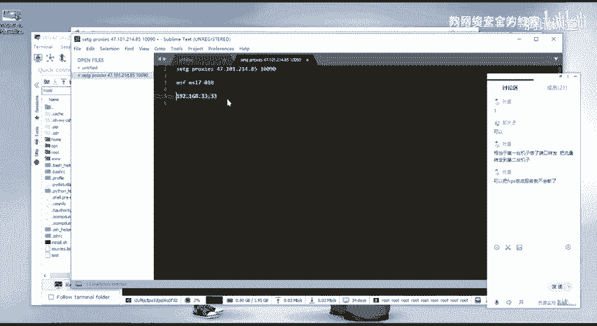

我这边的一个把机的这个对吧？这一个把机的45的1个端口，对吧？

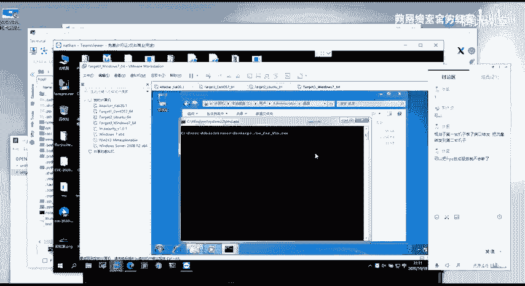

然后的话呢去进行一个漏洞的一个利用。

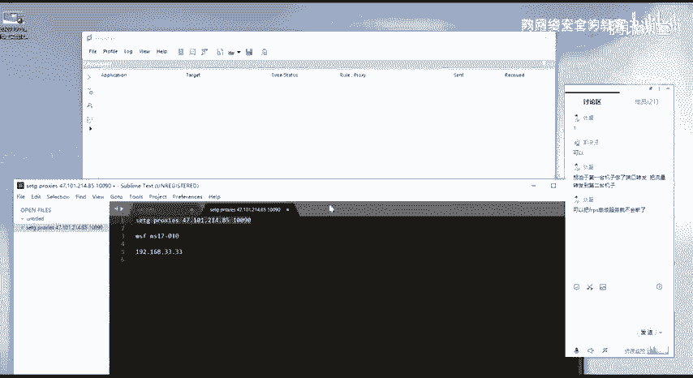

然后这个话我就。大家自己做一个课后作业，大家自己去尝试好吧。然后呃其实大家现在可以就通过我这边的这个代理。就是这我这边的这一个。Yeah。10090对吧，以及还有呃10088嘛。通过这样子一个代理。

你可以去访尝试访问，这还有1个10088，对吧？10088的话，你可以去访问那个1920168。2。2这个IP嘛，对吧？你你在你自己本机上面连浏览器里面。你设置这样子的一个代理话。

你也同样的能够去访问到我这边的这个。

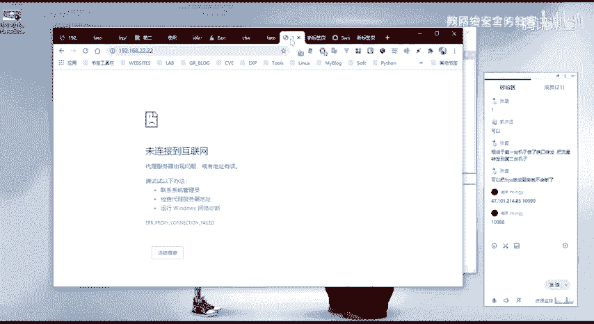

嗯。

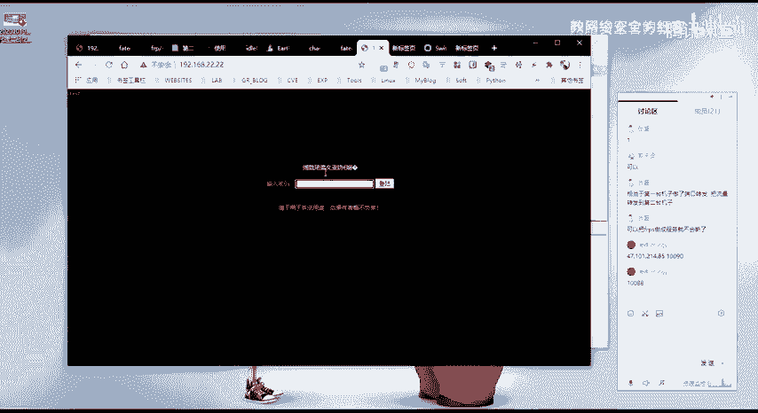

这是。

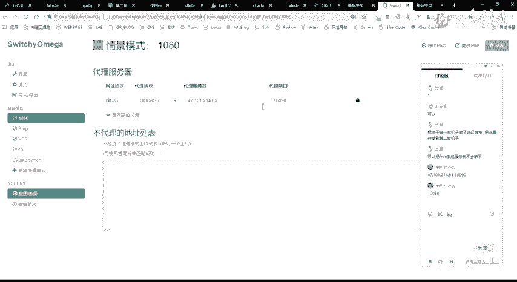

这是谁给我改了，这么快吗？是不是谁谁把我给改了，把我的。

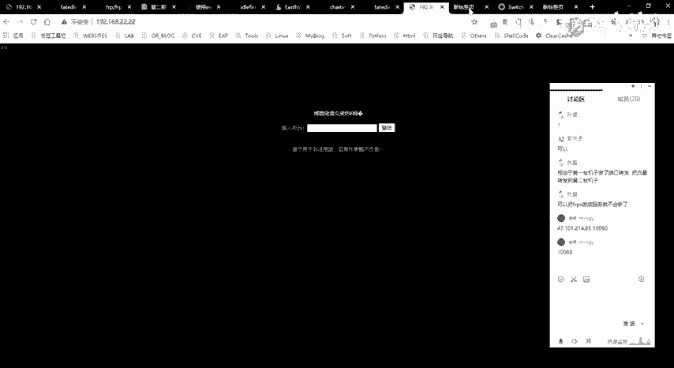

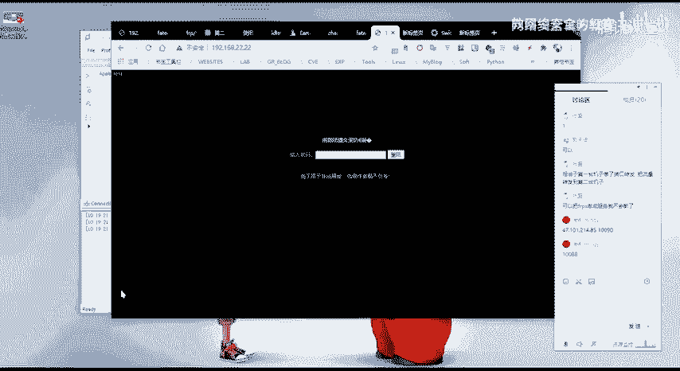

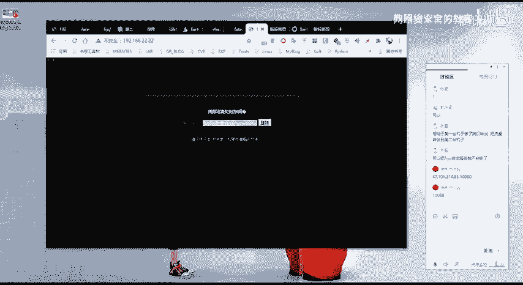

是你们你们有谁改了吗？看一下。你放个放个档案吧。啊，不是这个机器这二个。哎，没有啊。

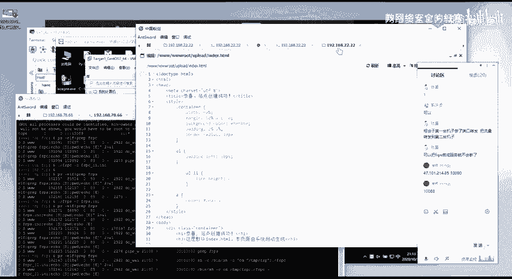

嗯。

那我怎么，你们你们是不是你们谁改的呀？是吧是你们谁改了，改了那个intex的那个页面吧，把它首页给改了。

。嗯。你们现在也可以通过这样子的一个方法去访问到。就通过我这边的一个代理。啊呃，然后的话我们继续看PPT的一个内容。就是呃后面的一个操作的话，就是也是一样的嘛，对吧？同样的就是信息收集嘛。

对这1个IPIP然后的话呃以及这边的1个45端口的1个利用，对吧？就通过啊我们的1个MMS17-010是吧？然后这边的一个它的一个利用的话，就是通过这样子，就我们就是这边s pros pros。

当然的话，你就是说这边呃。我这边的话是指在这一个模块下面啊，就是说我这边设成这个代言的话，是只只针对这个模块，它的一个请求流的话，它会走我这边的一个收索的一个通道。然后的话如果说你设的是你设的是三角机。

你设的是设腿机的话，那么就是说MSF下面所有的这种呃模块，或者说你的这样子的你的这样子的一个请求，它都会通过这边的一个说辞的一个拉理通道。就是这边的话是一个全局。

这边的话就是一个针对这一个当前的一个模块，对吧？然后设置代理的话是这样子，说出加下我们的1个IP以及端口啊。然后呃我们可以看一下这边。我这边的一个截图，我这边就不操作了。嗯。就最后的话呃。

他的一个效果的话就像这样子。然后得到他的一个血。以及呃3389连接的话，我这边好像也不连接了，跟上节课的话一样的对吧？我只要代你通道，我尽力尽力正确的话，那么其这一些操作它都是会没有问题的。好。

以上的话就是FRP的这样子的一个代理工具的一个使用，大家能理解吗？啊，对，刚刚的话是10090。Yeah。呃，还还有呃对，这边我还是要说明一下，就是我PPT里面的话，因为我PPT有些是用的上一期的对吧？

所以的话呃这样子的像这种IP以及它的一个配置，然后我有我这里我这边的话也有就是有改，对吧？就是可能没有是，可能没有统一，对吧？他没有去统一这样子的一个IP以及这种端口，所以大家再去看我PPT的时候。

你不要去照着那个照着我这边去写的对吧？你看你看着上上面跟下面不一样对吧，你就哎你就你就不知道他是什么了，对吧？你不要被我这边的1个IP以及端口给误导了。好吧。

因为呃有同学就是有同学就因为这一个那个当然他那个是确实是我就是改了上面那一部分，我下面那一部分忘记改。这个呃我的问题吧，就是这边也提一下，就是大家不要被这边IP这端口误导。就你这边实际的1个IP端口。

跟按你实际的一个情况来定嘛。做成服务呃。你可以这样的。但是就没没太大必要吧，是吧，反正你就就用一会用一会就关了。

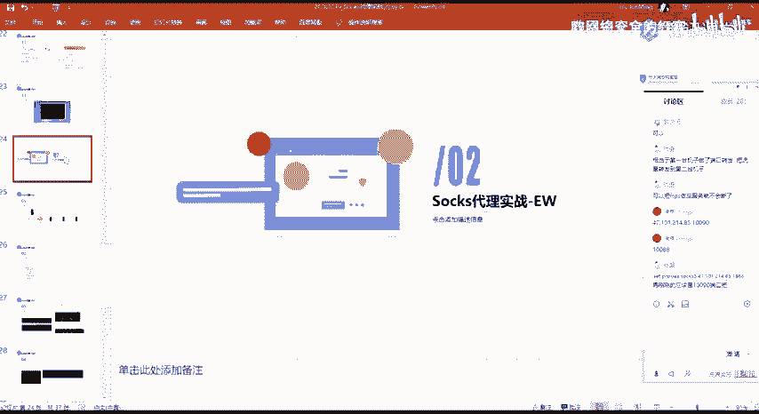