# 2024网络安全系统教程！清华大佬花159小时讲完的网络安全系统课！别再盲目自学了，学完即可就业！零基础入门网络安全！（渗透测试／漏洞挖掘／CTF／黑客技术） - P77：64.EW创建二三层Socks代理.mp4 - 教网络安全的红客 - BV1ft421A7Nj

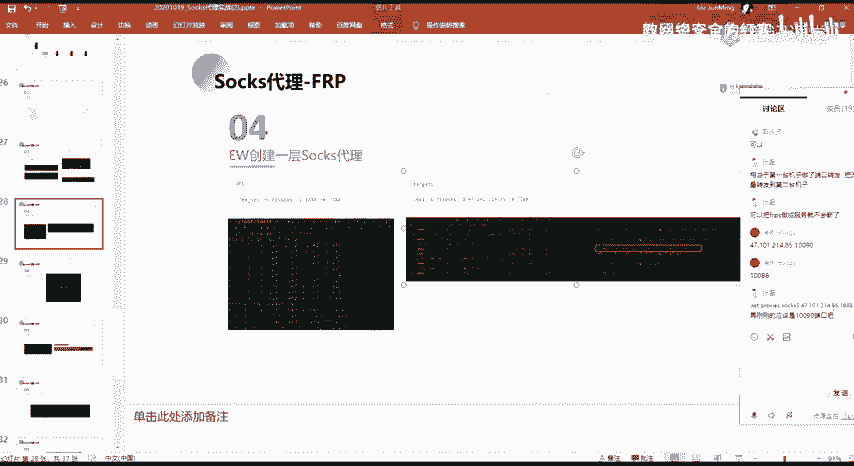

嗯。好呃，首先的话在这边。诶。

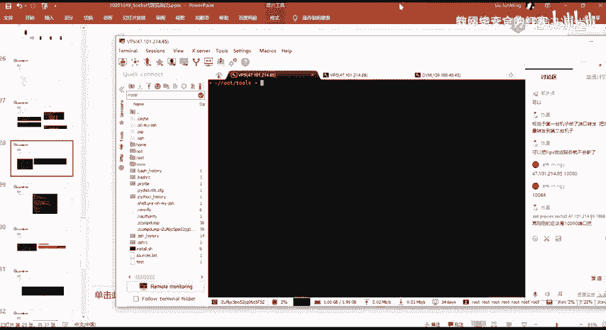

我们的这样子的一个步骤是这样子。呃，其实在这里的话，其实就是同样的就是用的这边的一个访弹说辞代理。的一个方法对吧？可以看到，其实命令都是一样的是吧？然后呃同理的话。

因为我们前面的话就是通过这样一个方法建立了这样子的一个代理。把我这边的一个卡里机器这边的一个。

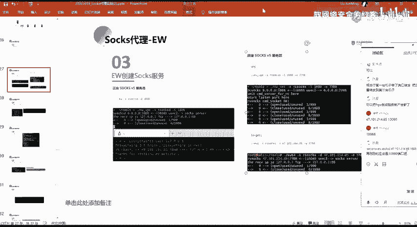

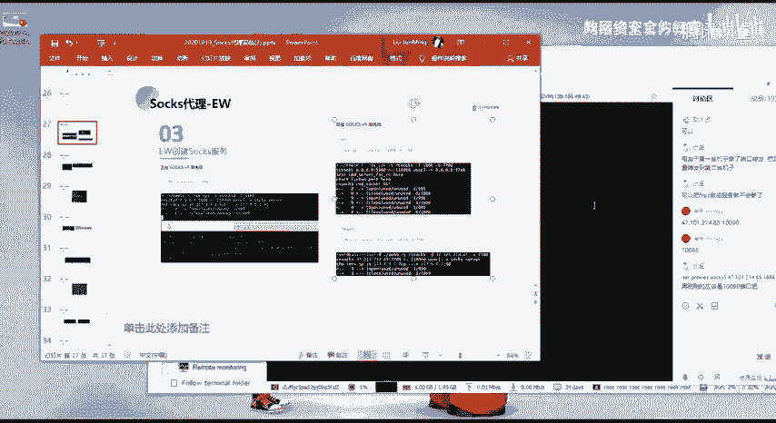

和，网段网络把它给代理出去了，或者说把我的一个流量带代理到了这边的一个内网的这一个网段，是吧？那么我想要去访问到内网的这边，我这边把机的这一个。

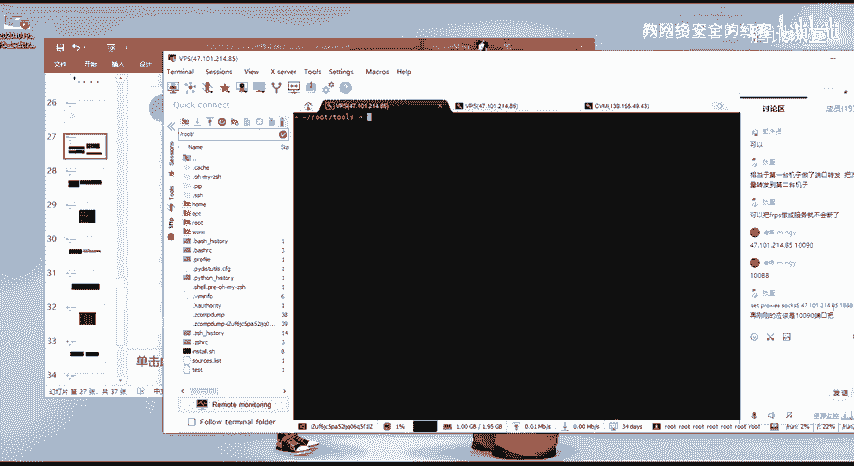

。这这1个2。2的这个网段，对吧？那么。首先我在BPS上面，我需要去呃起一个这样子的一个流量转发。

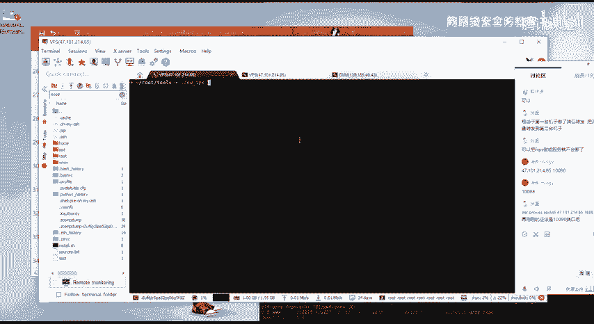

呃，其实呃，对，刚刚没有说没有提到这边这边的话。

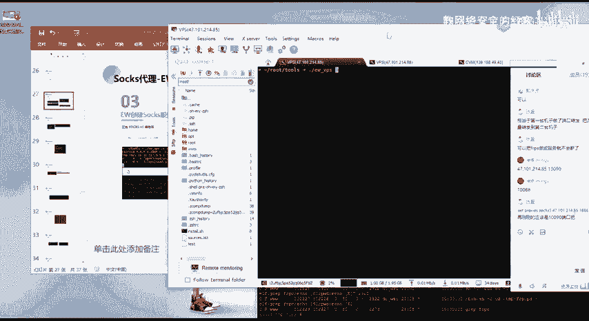

はい。说了那个是年龄转发吧。卡了，就是这一个就是RC寿对吧？这个其实它的一个作用就是流量转发，对吧？然后把我就是来这一个端口的一个请求的一个流量转到这边静业的一个连接。好，我在这边的话。

我们同样的通过这样子的一个方法。

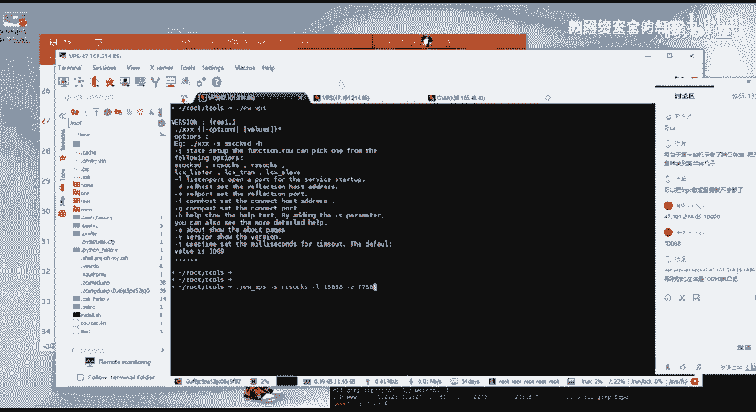

呃。看一下端口。

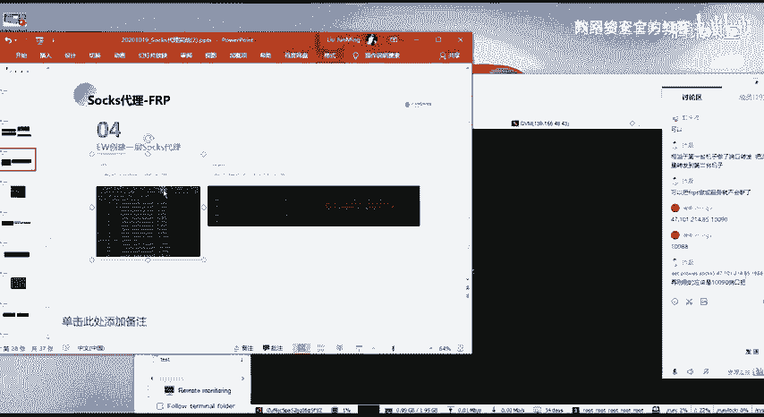

嗯，还是这一个吧，就。6188的这个端口。然后我这边的一个目标机器上面的话，我就需要去来主动的去连接我这边的一个。呃。然后呃我需要在我的这边的ta的EG上面去执行这样子的一个连接。

这边的这一个命令的话就是反弹这边的一个收持，反弹到了这边对吧？可以看到它已经OK了。那说明的话，这边已经进入了这样的一个代理通道。那么我们现在的话我们就可以尝试去。

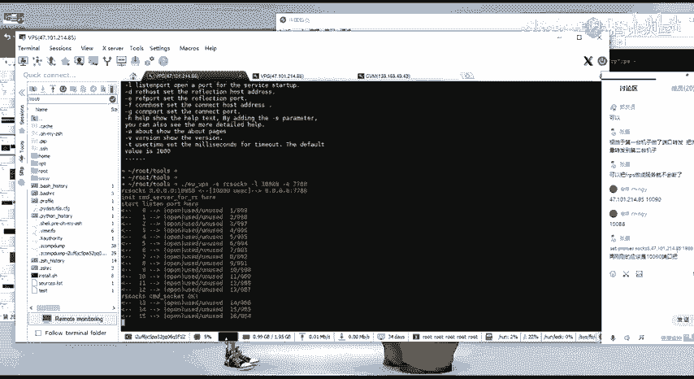

这个呃，就是这一个没问题。然，我这边。

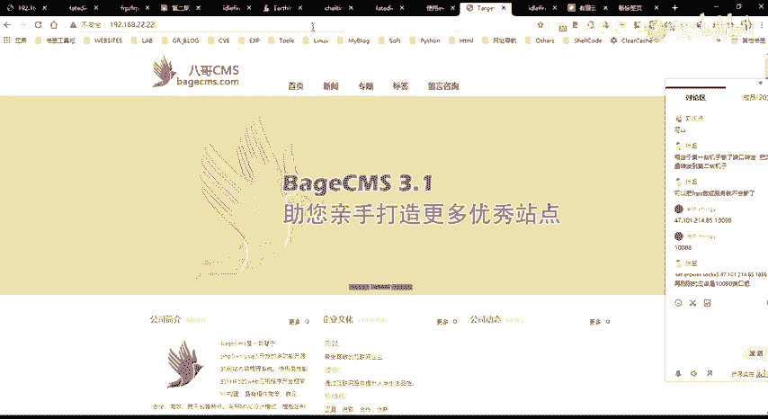

先不走这个对我直接去你这话还问不到的。然后我这边的话切切这个的话，可以看到是没有没有任何问题啊，对吧。

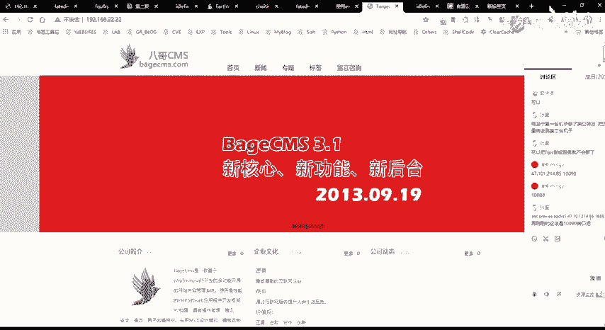

对吧是能够直接去访问到这个网站的。那么他其实就是把我这边的一个访问到这个网段的一个流量的话，通过这边的一个流量转发转到了我这边。

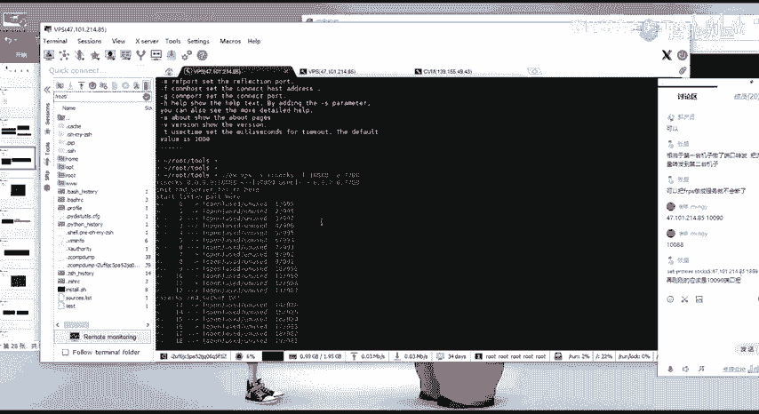

这边的这一个机器。然后的话他会通过我这边的一个网卡嘛，找到那个2。2这个主机的1个80的一个端口嘛，对吧？这边的话就是呃建面了一个一层的一个收支代理，就是跟前面的话呃。

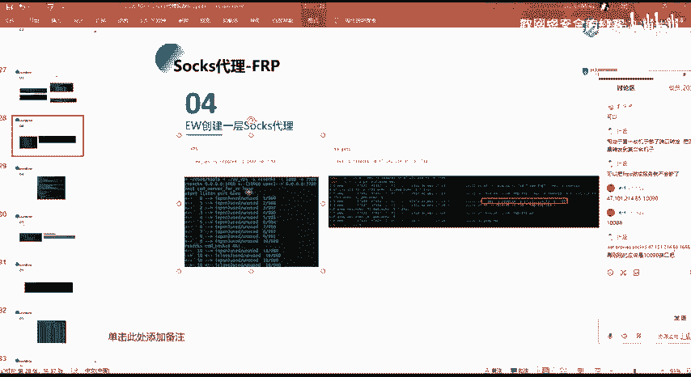

呃，应该也是类似的是吧？

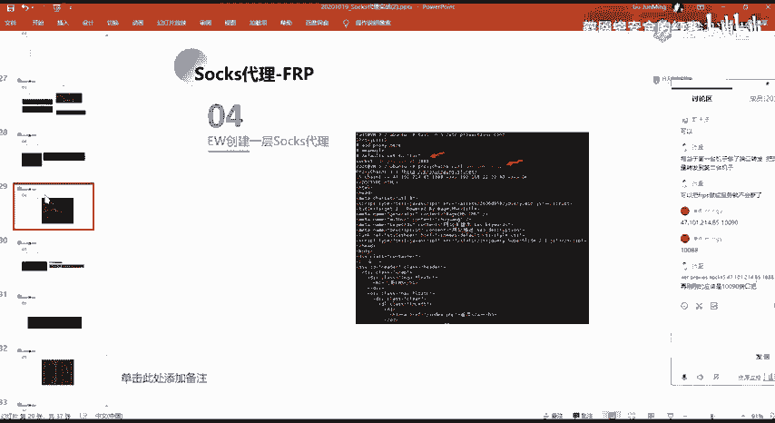

就是这种流量的一个走向，对吧？都是通过呃有一个这样子的一个代理端口，然后的话把我们那个流量就是通过一个啊索通道对吧？然后的话把它给转到我们的一个呃shops的一个，就是转到我们的一个内网。

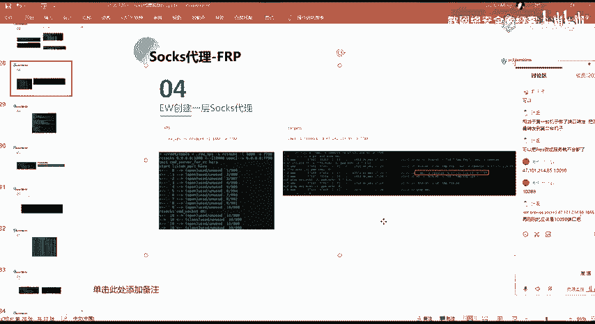

然呃。这边的话就是我通过这样子的一个方法去进行一个验证了啊。

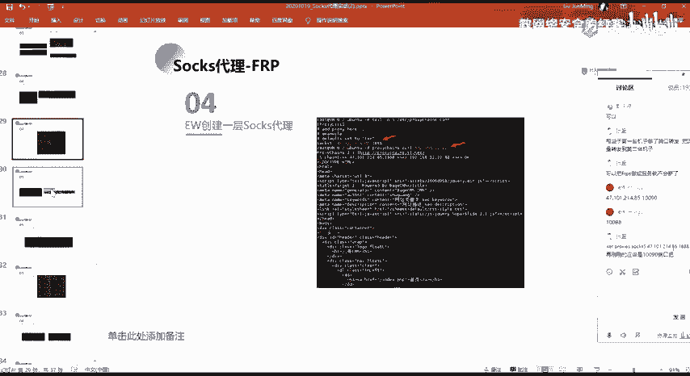

🤧然后呃创建二层的一个收辞代理的话。Yeah。对。啊不。嗰一时喉咙有点堵住了。🤧嗯。呃，8月1号了。堵住了。嗯，然后我们继续啊。啊，喝了喝了水。

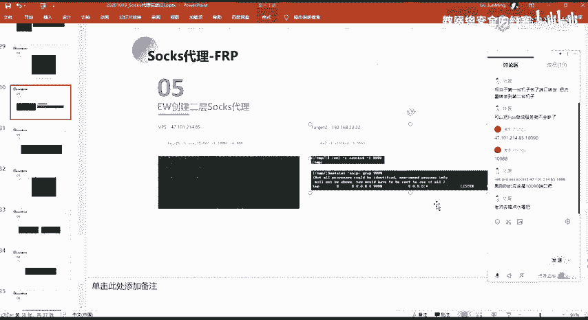

就有有一有一点点小谈，就是。

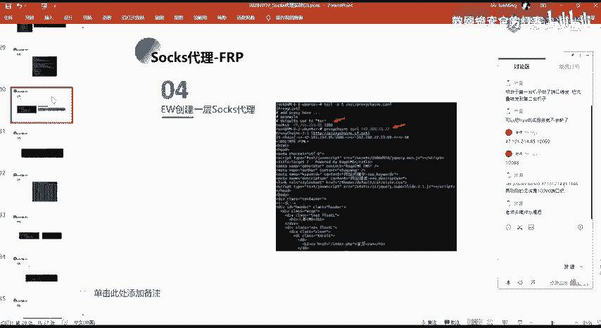

呃，然后的话。二层的一个双词代理的话，其实也是类似的。然后主要的话就是它的这个工具，它去进行一个这样子的一个流量的一个呃转发的时候，就是它的一个命令使用的话，它是不一样的。然，其实在这边的话。

重点的话就是这边在他的一上面是吧？其实我们前面用FFRP对吧？那FRP我们的这样子的一个配置，其实最多的其实就是这个呃外网的这个外表机器。对啊，就是这边。

因为我们需要在这一个机器上面做这样子的一个流量的一个转发，对吧？因为呃。因为这一个机器的话是我们就其实就是我们从外网访问到通向内网的这样子的一个机器，也就是一个跳板机，对吧？

然后的话我们需要把啊我们从外网来的流量，通过这一个通道来代理到它的一个内容当中。所以的话我们需要做一个流量转发。在EW这边的话，它使用的一个方法的话，就是用的这一个。呃，LCX liveve。

我们可以看一下前面这边就这这个模式，对s莱的话就是一个端口绑定。其实它的一个这边的一个作用的话，就是把这边两个端口的一个流量做了一个转发，就是在这边。他会把呃就是把我们这边2。2这一个机器。

这个的话是我们内网的这个机器嘛，对吧？2。2这个网站的这边的1个999端口的一个流量，把它给。啊呃，不对，是呃，说反了，是从这边。就是从这边干低赣低去连接我们这边的。经立的这边的这一个端口对吧？

888呃，没没错，对上。就是他在这边他会去建立这样的一个通道，对吧？然后的话我们的一个流量通过10088这个端口进入到这个通道。然后他在这边的话，他会把这边的一个流量转发到我这边的1个2。

2的这1个9999的这个机器。然后的话这1个999啊，不是999，这个机器啊，是呃这个端口说错了，不好意思，就呃转发到这个2。2这个啊机器的9999的这个端口，对吧？然后这边的这个端口的话。

其实就是在这边它有这样子的一个啊s。这边的这个说死的话，其实就是呃。建立了一个正向的一个那个代理嘛，对吧？说死的，然后他在本地他会去呃今天1个999的一个端口。然后的话我这边的这一个流量，对吧？

我从10088的一个流量，通过这边建立的一个呃通过888这个端口所建立的一个通道，建立的一个代理通道。然后的话把它转到了这边的1个999，对吧？其实就相当于就是我们前面的这边的一个正向代理嘛，对吧？

就他同样的是把我们的一个流量就呃通过这边转到了他的一个呃那一个网网段嘛，对吧？然后最后的话最后的话就是等于就是我们要去访问，就是比如说我们因为我们这边是二层的一个代理，对吧？

我们前面这边一层的代理的话就已经实现了能够去访问2。2这个网段。我们这边二层代理话，实现的是要去访问33。33的这一个网段对？那么我们这边的一个流量转发到了这边的一个呃2。

2这个机器的1个999的一个端口，对吧？那么其实就是相当于我的一个请求的话，我同样的能够在这边呃，在这边的这个2。2这个机器上面，把它通过那个呃网卡给转到呃，我这边的1个33的那一个网段去，对吧？

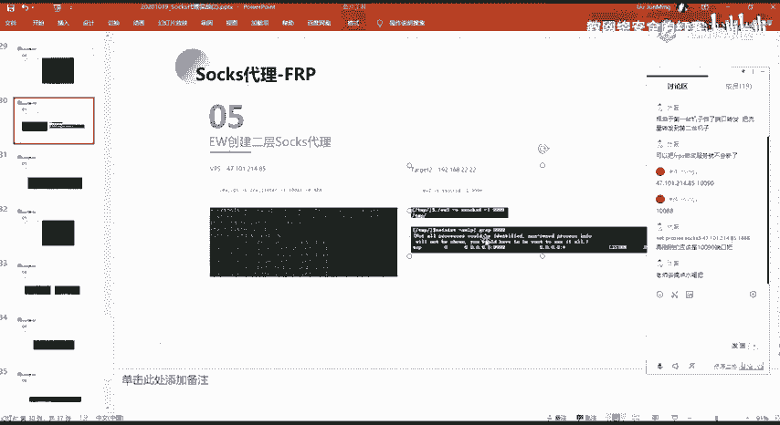

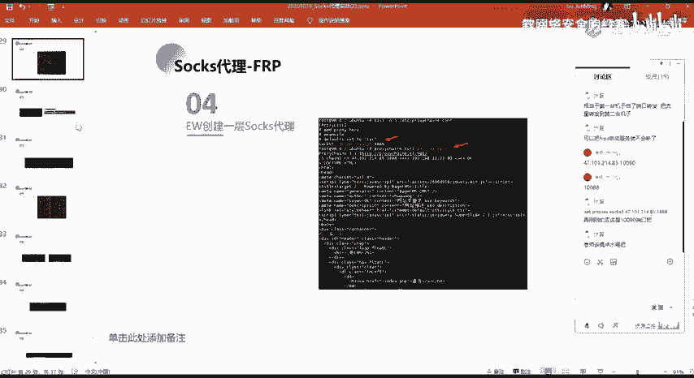

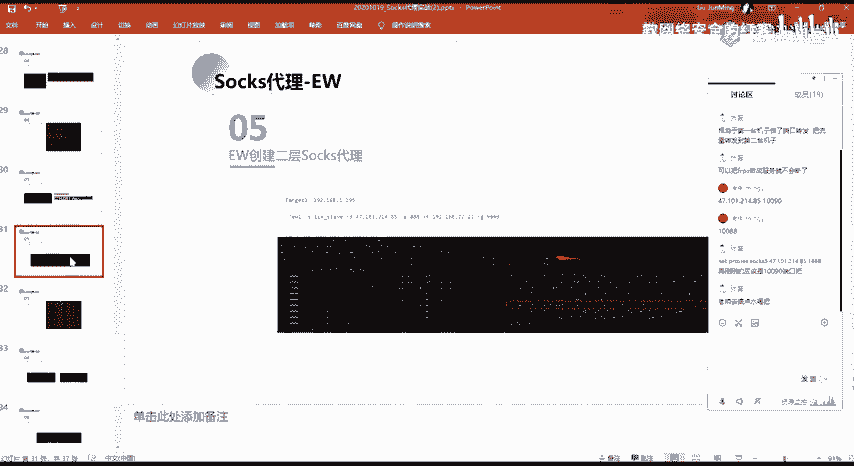

然后最后的话我们他会去建立这样子的一个连接。啊，不是就是建立这样子一个通道，这样子的一个流量的一个走向。然后呃在这边的话就是我们就可以通过这样子的一个通道来去呃探测这边的一个33的网站，是吧？

也就是我们的一个流量就能够去访问到。去啊能够去把我们的一个流量就是传到这边的1个33。33的这个网段，33。33这个机器上面。

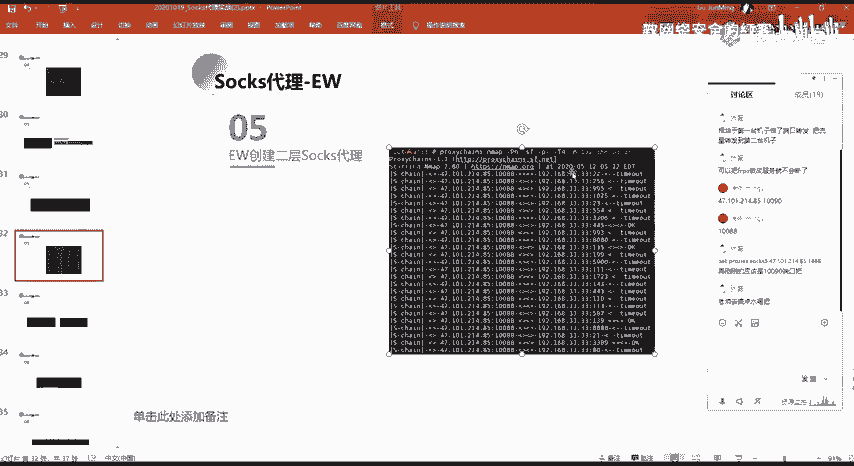

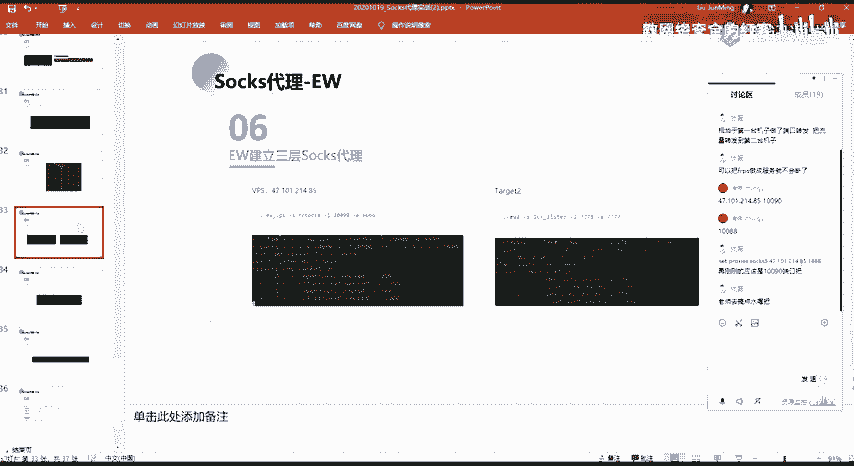

好呃，我们来具体的来操作一下吧。

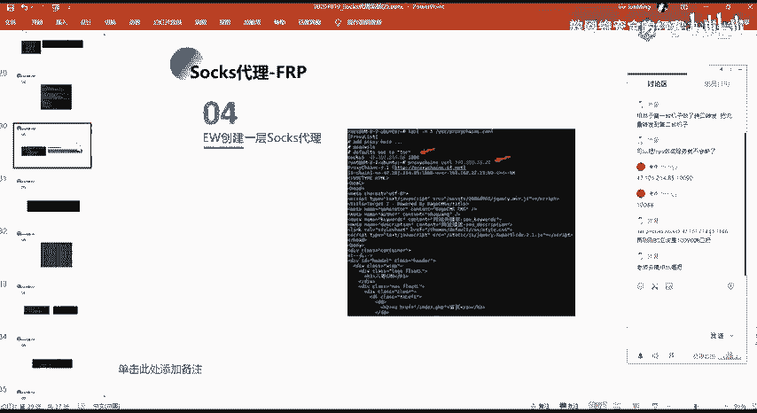

同样的拿我们这边的这一个机器啊。帮了，要重新要从头来吧，好吧，要从头来。

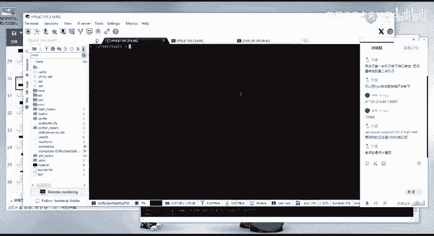

首先的话在我们的1个VPS上面，对吧？我需要今天这样的一个端口，代理端口，以及等待啊我们的一个。呃，就是我们的一个目标机器来主动的来去迎接我们这边的1个778的一个动作。因为我们是反向嘛，对吧？

大家就是其实这边的一个反弹以及反向的这种ss跟我们前面就是正向反向的一个需要。其实它的一个原理。呃，不是说原点，就是他的这样子的一个。是类似的对吧？

就正向的话就是我们主动的去请求去请求啊这边的一个s的一个服务，对吧？然后反向的话就是说因为我们无法直接去访问到，那么我们就只能够通过反向，对吧？就只能够通过他这边能够来访问到我们。

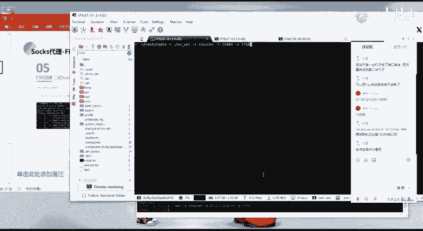

然后的话来去经历一个连接，所以的话这就叫反向了。然后同样的，我这边。

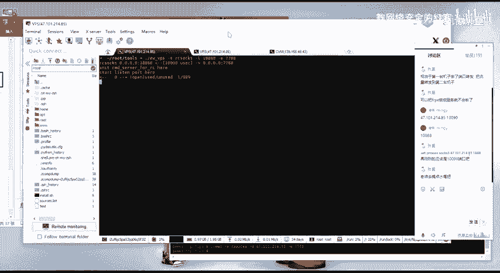

嗯。执行这样子的一个命令对吧？然后的话在t2上面，因为我们其实在这边建议这一个的话，我们就已经能够去访能够去设置代理，对吧？来去访问这边我拿到的22。2这个机器的一个小呃。

也就是这边当然的话呃这边的话代理要改一下是188。

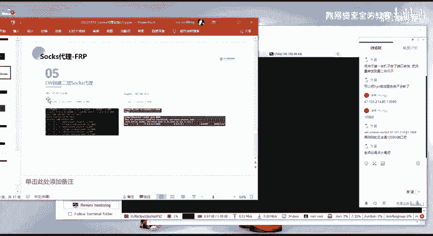

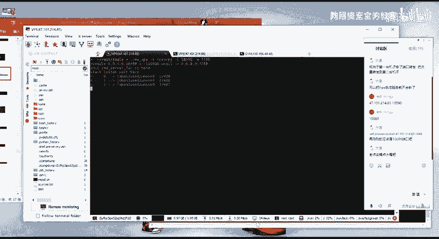

应该也是。呃。我这边断掉。

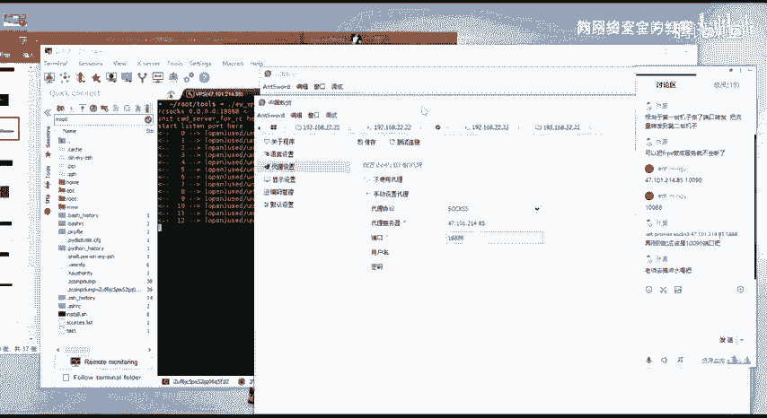

不确。嗯。

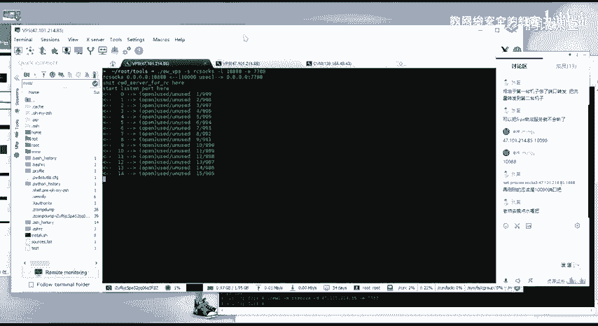

嗯。

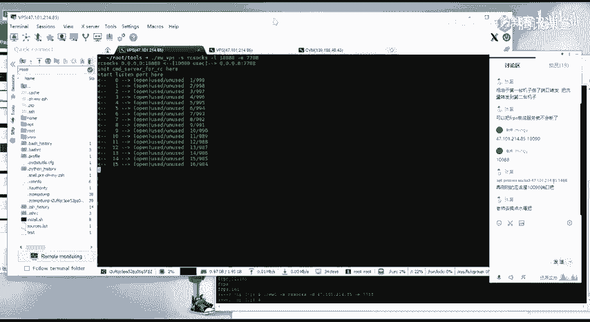

啊，我先执行这边吧。

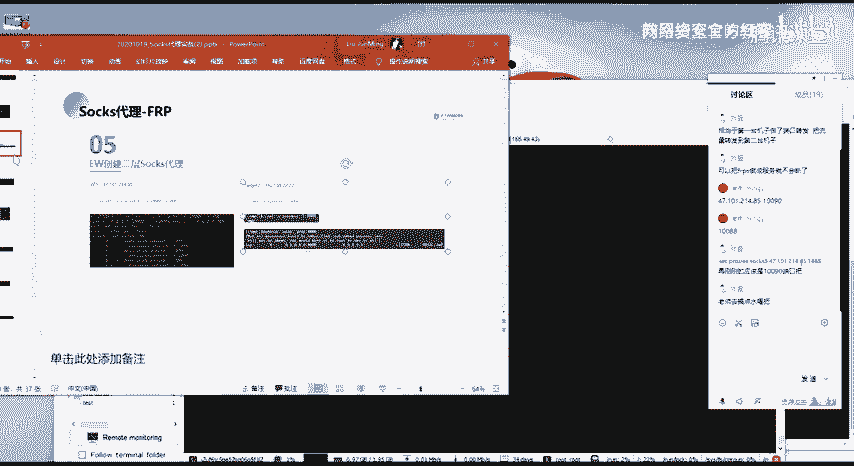

我现在这一个t一上面。来去与我这边的一个。嗯。哦。然后在这里的话可以看到呃建立了这样子一个连接，对吧？已经建立了建立连接了。然后我这边的话就能够去。

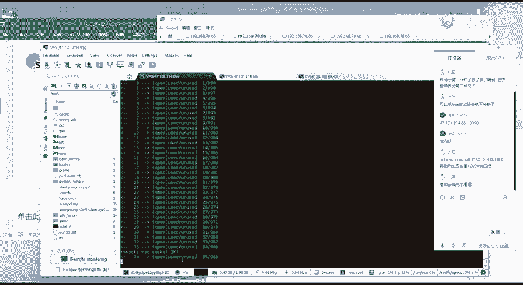

通过这边的一个代理，对吧？

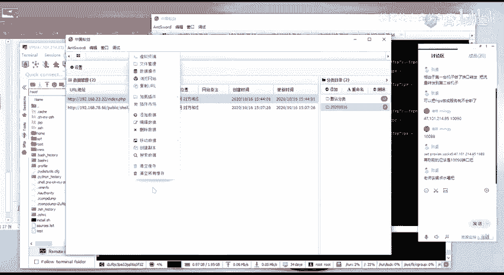

建立的一个代理的去访问这边的二这一个网段啊，也就能够得到这边的机器的一个选。然后在这边的话，我们下面要去访问的话是。

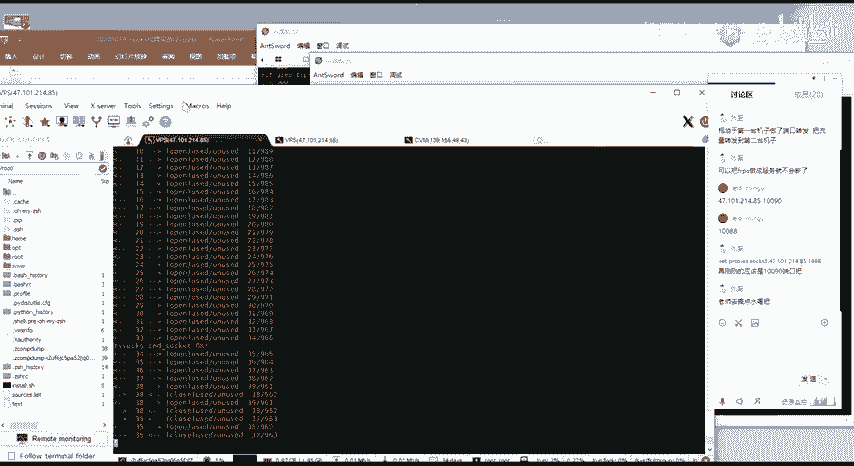

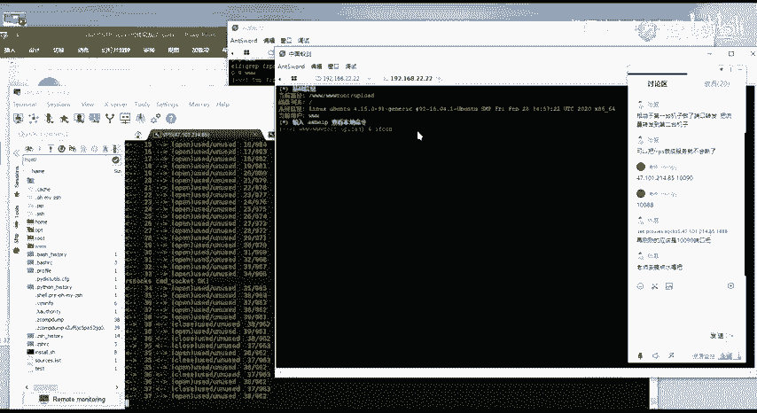

要去把我们的一个流量，把它代理到这边，去访问这个33的这个网段。所以的话我们在这边需要去做一个流量的一个转发。

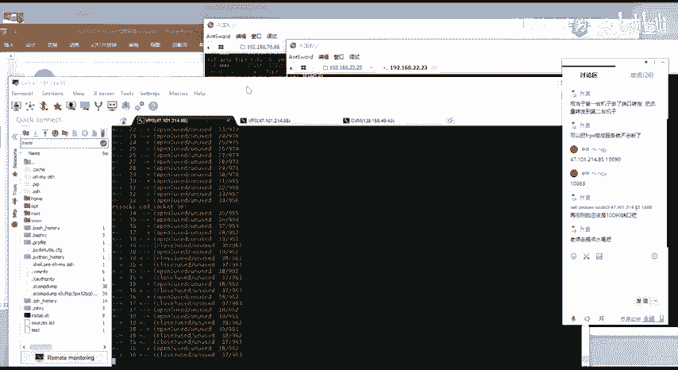

然后在这边的话，其实我这边这一个面的话，就已经做了这样子一个流量转发，就是把这边的一个流量转到我这边的这个呃2。2这个机器的999的1个端口，对吧？那么我在这边的话，我就只需要去。

就是他这边我这边流量通过这个连接发送到这边，它就会主动的来就是发送到这边来，对吧？那么我这边的话，我只需要。通过。嗯。没有吗？没写错吧。

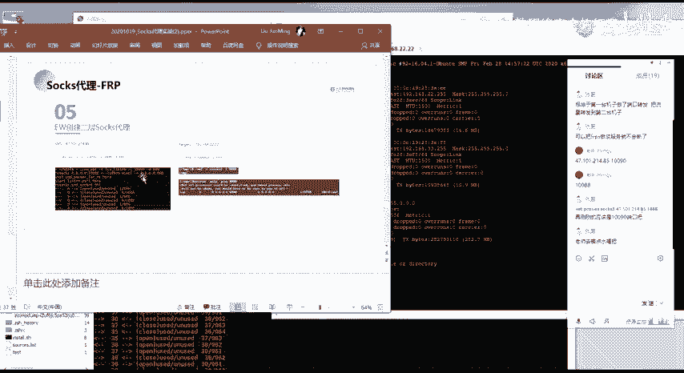

哦，SS。SOCKSB。笑死的。啊，然后的话只需要去在我这边去监听这样子的1个99的1个端口。可有。嗯，这边我之前已经有执行了呀，你看他是EW64啊，我这边的话是用EW1的，我这边把这个卸掉。うん。😊。

乐887。嗯。这个拼怎么还在拼啊？嗯。啊嗯。其实在这边呃，正好看到了这个就说一下。就是你你你会发现我这边有这样子的一个命令对吧？拼这一个，因为在lininux里面的话，你的一个拼的话，如果你不用那个。

P杠C一去指令，你去聘多少次的话呃，一般的话一次两次三次就就可以了嘛。是吧？像window省面的话，默认的话，它是4次，4次之后的话，它就会停止掉。如果你不这样的话，如果你直接拼拼的话。

它就会它会一直拼了，就是它不会停的，你除非你按拼出 C或者把它的一个进程给去掉。然后在这边你进你进里面的话，你去执行的这种命令，它会自动的去把它给放到后台去，就是它会把它放到后台作为一个进程这样子的啊？

然后你会发现我前面拼了的话，它其实一直有在拼了，只是在前端它没有显示出来。所以的话呃在这边因为 C C停止不了嘛，对吧？你就可以通过Q把这个进程给呃掉就可以了。这边的话呃，正好碰到了就说一下啊。

好了好好好了。等。好听楚。

嗯。

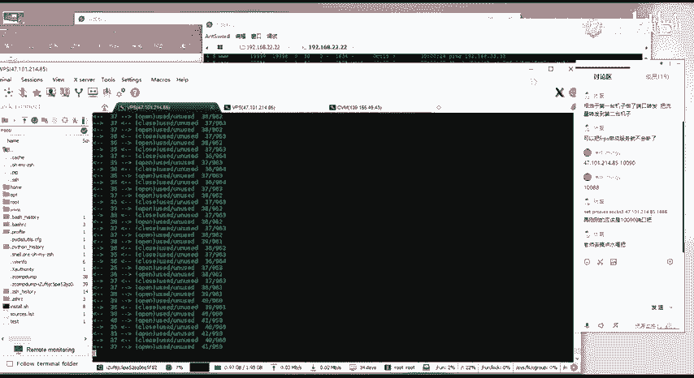

然后执行之后的话，呃，我们的一个连接的话，应该就是已经建立成功了。

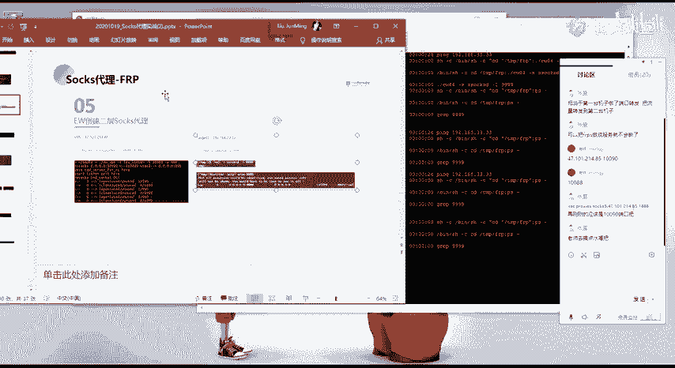

然后在这边的话，我就呃以这个。你这一个吧，就是做1个IDP的一个远程连接，对吧？然后在这边的话，我的一个service是这个呃我的一个端口的话是。

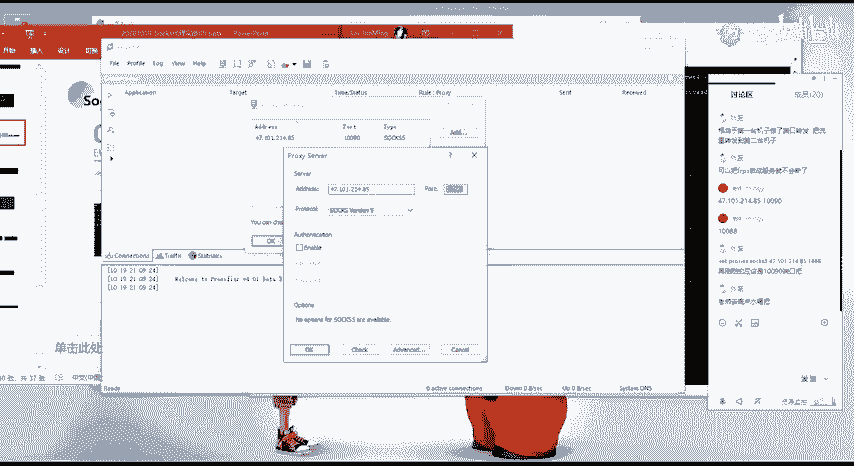

1888吧。

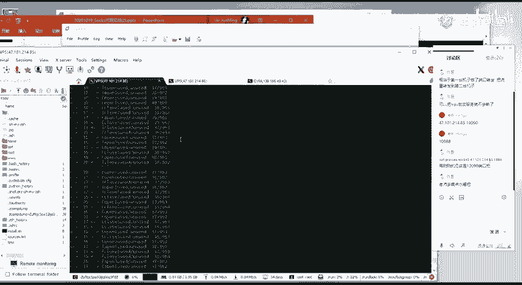

呃，1888。OK。是保成州的话。我在用远程桌面。来去做一个连接。嗯。连接触错了。

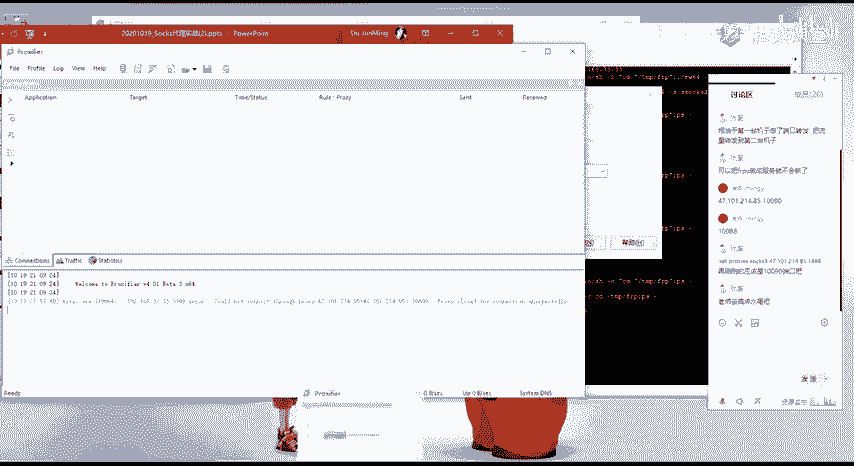

连接出错的话呢，检查就是检查你的这边的。是否更强调就是。

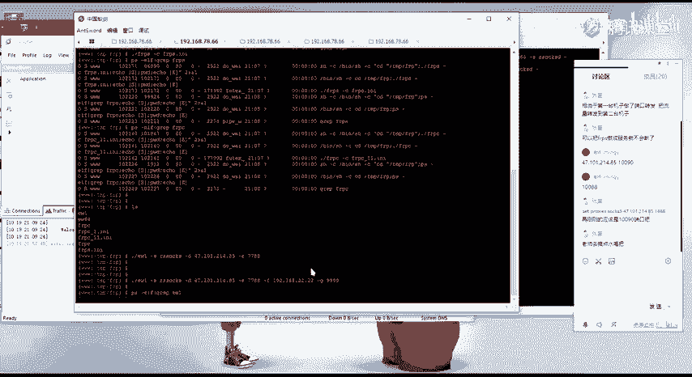

他是否还在好。嗯。关系。没写错啊。哦，我这边搞错了。在这边的话呃是用的LCX的lea的。嗯。嗯。就是这个就是反向那里流量转发。呃，按理说这个二次受损应该可以啊。

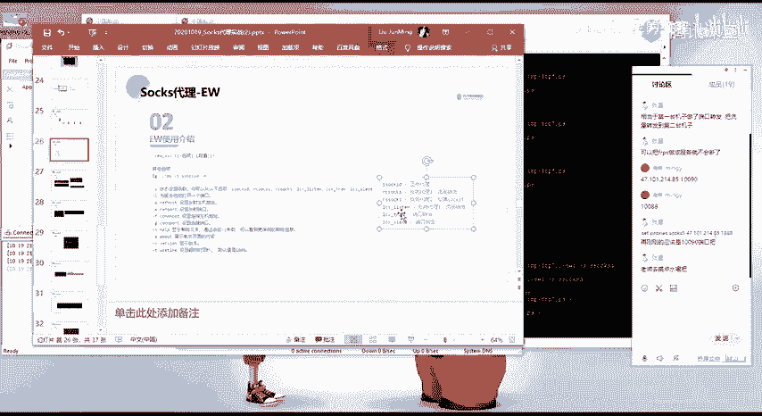

不行啊。我这边也是。Okay。

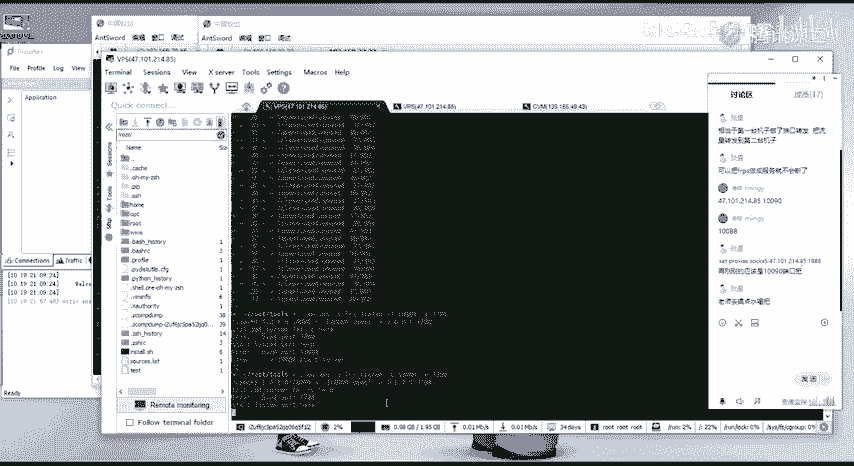

我这边重新来呃。あ我俾做。

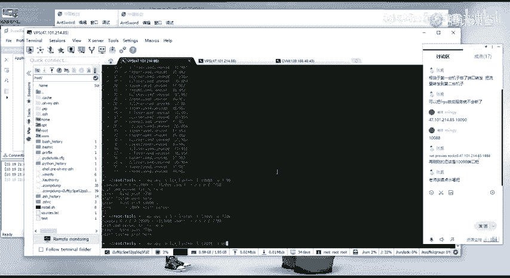

嗯ふん。

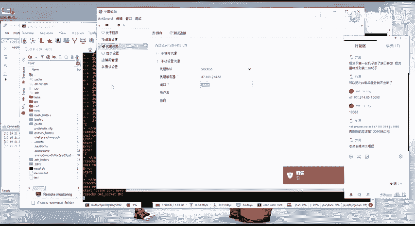

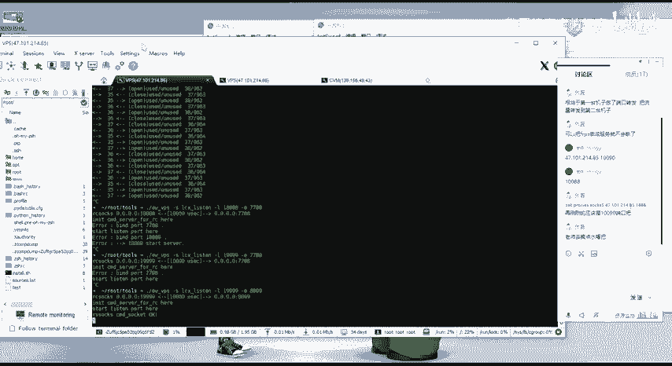

给你单元端口的话是改了。99。

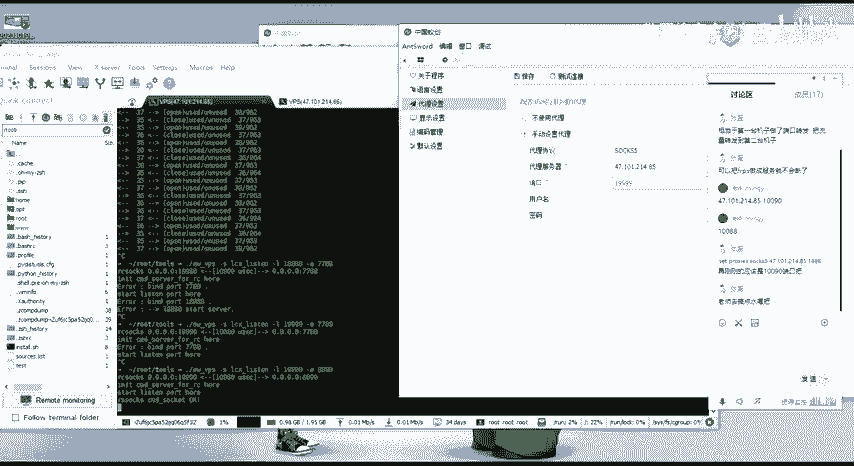

呃，就是大家在碰到这种问题的时候，就是其实你细心一下，你细心。虚闲一点检查一下这种。那我我平常。我平常有时候也是就是你这边改了之后，然后你这边下一步又又忘了。

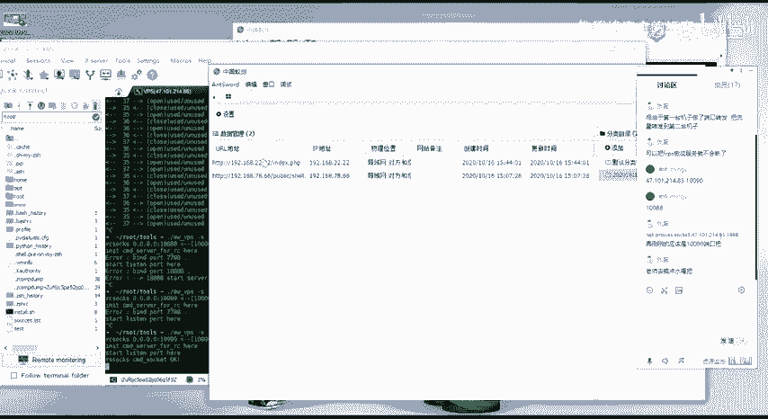

啊，现这种问题的话，一般的话你细心去检查一下，你从头。从头就是找一下这种。哪里就是改了是吧，或者哪里配置，你哪里单词写错了，对吧？这些方都是很好解。一般的话思录对了的话是。其他这种操作是都是。

这你没有什么问题了。这边的话前面那个没Q掉，就是。所以的话呃他会有这样子的一个报错，就是冲突嘛。因为你那个端口被占用。你需要先把前面的这个给P掉。

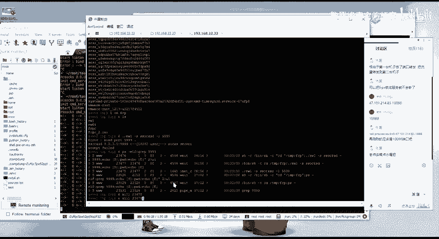

然的话再去。再去执行。啊，现在执行完之后的话，我们再来连接。好。哦，这边代理服务器又没改啊。嗯。就呃碰到这种问题，其实你就是学会看报错，是真的。就是你你就其实我看大家就是问的那种问题啊。

就是你截图的时候截的那种问题，其实那个你解决的那种办法都已经写在报错里面了。对吧其实你很快就能够去找到原因。因为你像这种东西，你来问我的话，因为我不知道你整体的这个配置，对吧？

我不知道你整体你是怎么去配置的。所以其实。很多时候。我也可能会说不上来。嗯。嗯怎么这么慢呢？

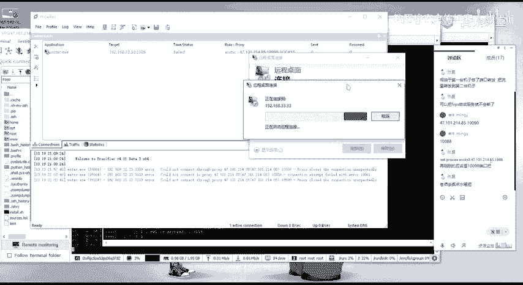

그。

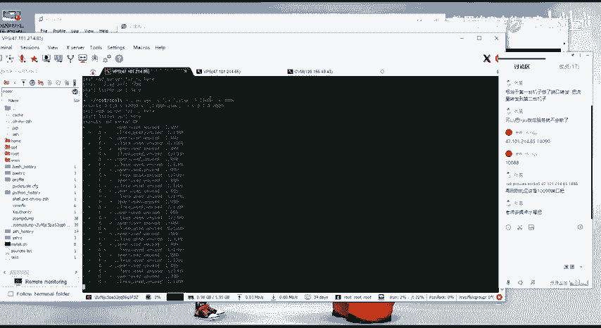

嗯。看一下。没错呀。

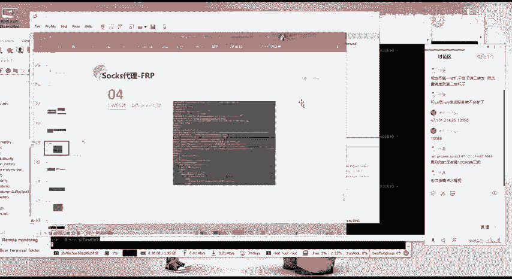

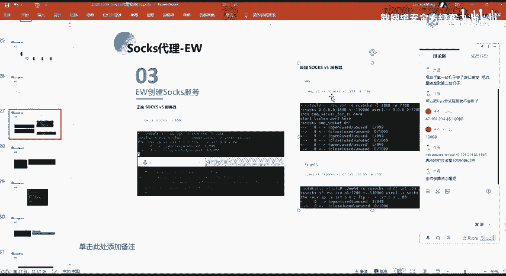

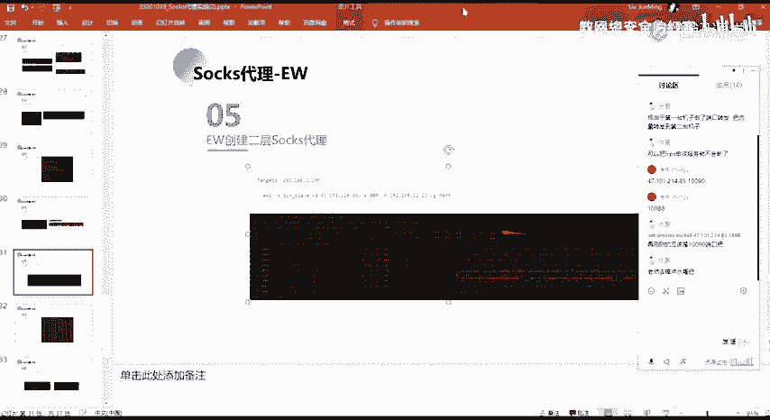

啊。也错了。好的我的。不行。我，在在在在。快啲嘛。这边的话因为我这边断掉了，所以他那边卡应不大的。就正常的。我这边写错了。照着我P大家照着我PPT上个来吧。我这边写错了。

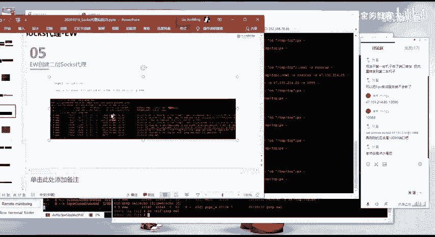

🤧可以看到。

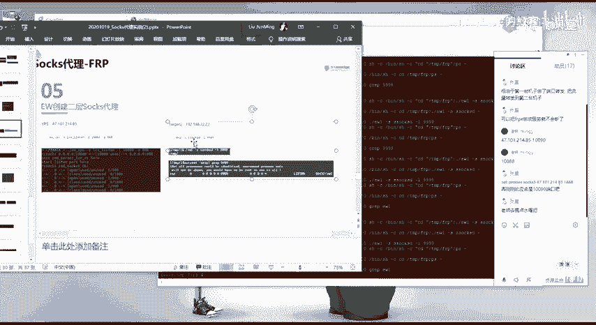

现怎么唱了呀？可以了。好。呃，大家大家弄的时候也细心一点，我这边话粗现了，就是写错了。大家大家照着我的PPT来吧，好吧。

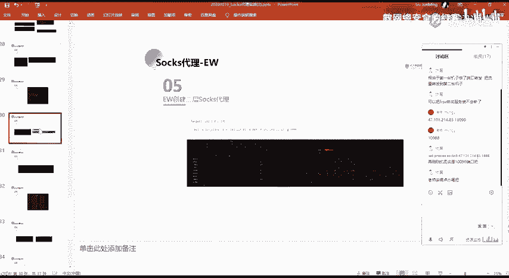

啊，耽误了大家一点时间。然呃在这边的话，我们建立成功之的话，实际的效果就像这样子啊，对吧？我，这边的话我就可以呃可以呃。

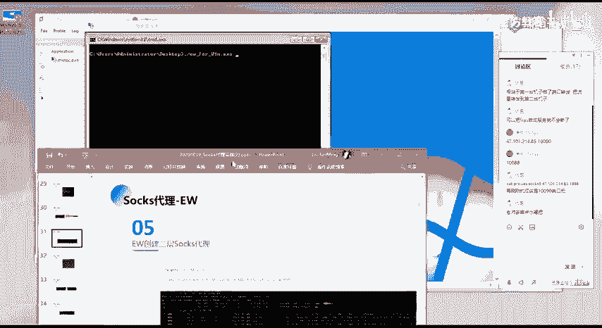

直接远程的登录这边的呃，这个33。33的这个机器，对吧？

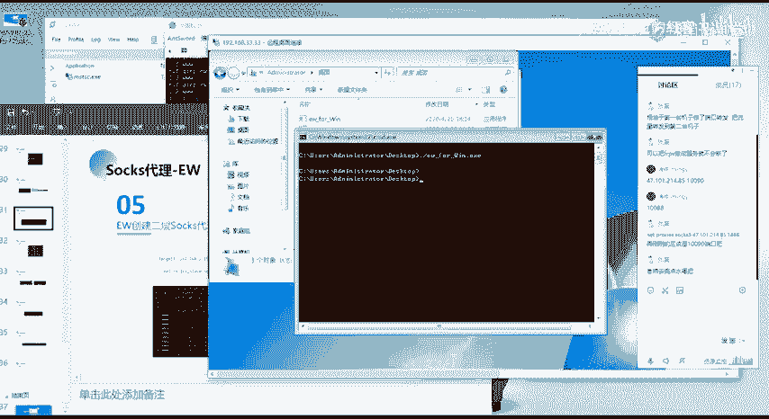

然后这边还就是二层的一个松词代点。然后呃还有的话其实也可以去做这样子的一个商层的一个锁代表。这边的话呃这边的话大家自己。课后去尝试吧，我这边的话就不说了。然后因为他的一个操作以及原理的话都是一样的。

我这边的话已经也写的很详细了啊。然后这边的话主要的话就是介绍一下他的一个就是这边这边它的一个流量。就是你知道了它的一个流量走线的话，然后你知道大概他的这一些选项怎么去用的话。

你就呃能够理解这样子的一个命令。我这里的话，商层的一个硕词单点的话，因为我们其实前面对吧？我们通过MSF。对吧呃，通过17010能够去拿到这边t3的一个需。我们拿到他这个需要之后的话。

如果他还有还有还有另外的一层之网的，对吧？就是有三层是吧？他是呃，应该是四层了是吧，就是。233对吧呃，三层吧，三层直网嘛。那么我们这边拿下拿下这一个windows这个机器的一个选之后，对吧？

如果它还有一个内网的。内内网的一个网段的对吧？那我们同样的还是去做这样子的一个代理嘛，对吧？只是的话它中间的话就是要去多做这样子的一个流量的一个转发。其实说到理，归根结底的话就是流量的一个转化。

你只要能够去把流量通过中间，我们这边通过能够去建立这样子的一个连接，然后的话做这样子的一个流量转化，就能够去实现这样子的一个内网的就多层网络的这样子的一个窗口。

但的话你前提是你要能够去一个一个的去能够去得到这样子的一个谢。然后命令这边的话，我们看最后这一张PPT啊。就是呃这边的话就是它的一个流量的一个走向的话。

其实就是从我这边s5V5就是我的这边的一个s的一个代理嘛，对吧？然后我把我的一个请求，就是通过这边的一个端口，然后的话传到了这边的这一个呃通道对吧？与这边VPS经立的一个通道，传到这边之后的话。

它会通过这边的一个s内做一个端口的一个。呃，转发。端口流量的一个转发，把它给转到这边的2。2的这个7778的这个端口，对吧？然后在这边7778这一个端口的话，他还要做这样子的一个转发。嗯。

因为我们最后要去就是我们前面的其实他给的一个他给他，我们都已经得到了，对吧？我们最后他给的商也能也得到他的一个小。但是如果他还有一层，比如说44。44的这样子的一个主机，对吧？

那么我们最后其实就是要去探测这1个44。44的这个主机，那么我们这一个流量，我们就需要在他给2上面，同样的还要做一个转发，转到他给的3上面，对吧？然后在这边的话，他给三的话，呃。

我们就使用这个windows的上面的1个EX，因为它是windows的主机嘛，是吧？然后然后的话在通在这边去建行一个连接，连接这边连接这边的一个那个其实这边的话跟我们FRP也是类似的嘛，对吧？

我们中间两个主机之间要去进行这样子的一个呃流量的一个转发的话，你需要有这样子的一个通道啊，就其实就是这边所建立的一个连接的一个通道，因为你只有进行连接之后，你才能去有这样子的一个数据的一个传递嘛，对吧？

然后在这边的话，我们就带你到了这边33这一个主题上面了。呃，这边tt3的话就是33。33。如果他还有这一个44的话，那么我们在这边的话，我们就通过这边的这里的一个代理通道。

我们就能够去探测这边44的这一个主机。因为我们现在的话已经探测到呃，已经把我们的一个说是代理通道已经呃代理到了这边tact3，对吧？那么这边他的3的话，他是能够去访问这边44的这个网段的。

所以的话我们通过这边的一个代理通道，我们就能够去向这1个44。44这个主机发送我们的一个请求。以及最后的一个数据的一个流向的话，就是像这样子。呃，这个的话应该很好理解吧，是吧？

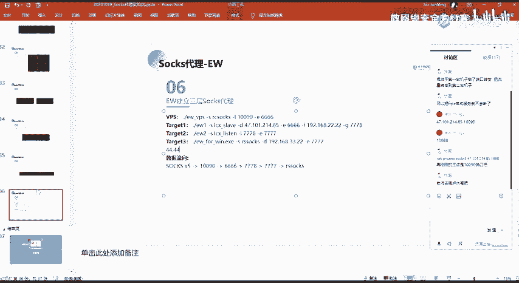

呃，以上的话就是我们本节课的所有内容，大家应该呃大家有有没有什么问题？

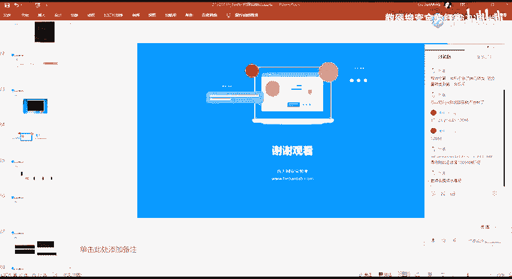

有疑问吗？以及能理解吗？没有是没有疑问对吧？呃，没有疑问的给我呃，送朵花吧，好吧。然后的话就我们本期课键的话就到这边了。对。如果呃其他同学还有疑问的话。

大家呃自己就是在课后认真的去看一下我这边的一个录播。好吧，我在录播上面的话应该是讲的很详细了，对吧？就包括命令，以及呃，你的这样子的一个数据的一个请求流量的一个走向，对吧？

以及我为什么要通过这样子去经历这样子的一个连接，对吧？去做这样子的一个流量转发啊吧？呃，只有这份其他同学呢？就这就这另位5位同学吗？Yeah。呃，其他同学如果还有疑问的话，呃，在群里问或者是私下问吧。

好吧。就其实其实呃你可以去多多去问一下，就是这些他们没有问题的这些同学嘛，就是大家其实互相交流就可以，就就挺好的，就特意把大家就是放到一个群里的话，其实就是让大家能够去多交流嘛，对吧？

因为其实你要是就是毕竟我只有一个人嘛，是吧？我不可能就是所有的问题都能够照顾到，或者是说照顾到所有人。就其实大家互相交流的话，你可能。呃，感觉还会更好一些。好吧，没有其他问题，那么呃也不多说了。好吧。

我们下课，大家早点休息。