# 2024网络安全系统教程！清华大佬花159小时讲完的网络安全系统课！别再盲目自学了，学完即可就业！零基础入门网络安全！（渗透测试／漏洞挖掘／CTF／黑客技术） - P78：65.Neo-reGeorg.mp4 - 教网络安全的红客 - BV1ft421A7Nj

然后呃第二个的话就是这个NEOIEGO这个的话这个的话比前面那个的话要就是呃因为它是对前面的一个重构增强了，对吧？它的一个功能以及它的一个呃安全性。

还有它的一个这种数据传输的一个保密性的话要比比这一个的话要高很多。所以的话这一个的话就相比前面那个话会好用一些呃。然后这一个工具它的一个呃一些参数的一个使用的话，我这边也不。不会多说了。

然后大家PPT话已经也给大家了，是吧？大家自己去查看，我这边的话都已经给出来了，是吧？啊，呃这个的一个使用的话，其实跟前面的这个IGO它的一个使用其实是呃类似的，是吧？

因为它本来就是基于前面的这1个IGORG的一个重购嘛的，就它根本上面一个东西的话是没没没变的。但是的话他对前面的这一个呃前面的这一个脚本的话，它有增强对吧。好，下面的话我们来看一下，我们在这边的话。

同样的以这一个机器啊。同样呢以这一个机器作为一个呃事例。也就是呃我前面的话通过这作为blog的一个漏洞，对吧？拿到了它的一个需要。然后的话我想要做一个代理。

就把我的一个流量代理到这样子的代理到它的内网去。那么我们在这边的话，在用这个工具的时候的话，首先第一步我们需要呃。先来看一下。这一个呃这个工具它的一个样子吧，这边的话就是它的一个脚本。

我们首先的话需要去把这个脚本下载下来嘛，对吧？然后同样的它有这样子的一个python的一个脚本。

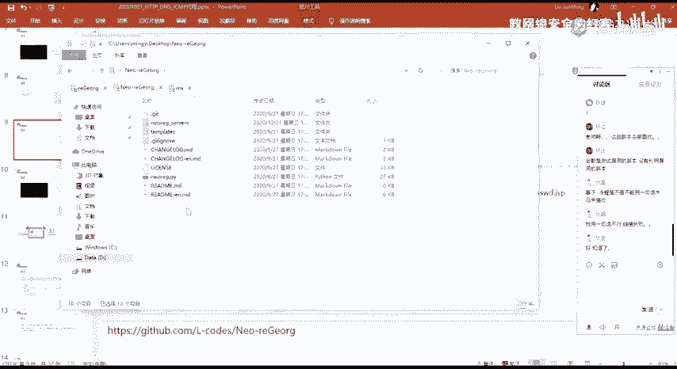

就这一个就NERNUREG的这个脚本。

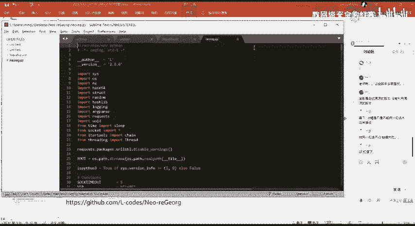

然后这个脚本的话就是我们用来去起服务的，去进行进行一个s代理的一个呃脚本。然后在这边的话有这样子的一个目录，就是这个tempase这一个目录。这个目录的话它存放的是。

有他支持的这五种脚本的这样子的一个模板。

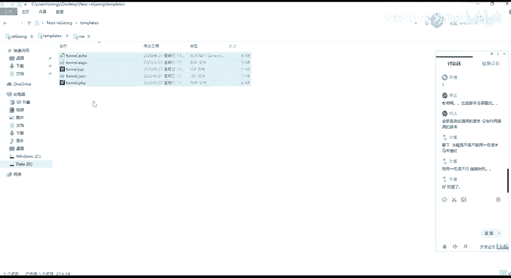

就是这边的话它是注意的话是模板，也就是他在这边的一个模板的话，我们在这里首先第一步需要通过这一个脚本，然后的话基于这边的一个模板来去生成对应的这样子的一个文件。

这边的文件的话可以看到NEOIGserv对吧？就这边的话就是我们的一个啊服务端。

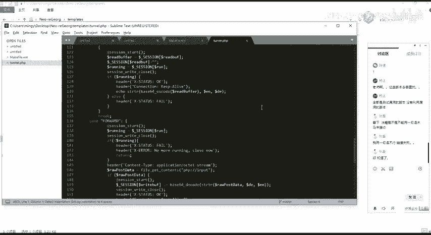

因为我们需要把我们这边的这个脚本文件，对吧？去上传到目标的那个word服务上面去。然后的话上传上去的话，我们通过这样子的1个HP的一个连接，对吧？来建立一个隧道。然后这这的话，首先我们要去使用的话。

第一步的话就是设置密码来去生成对应的这样子的一个这5种脚本。然后的话上传到目目标的一个wordb服务器上面去。然后生成脚本的一个命令的话，就是这样子就有它有这样子的1个GNERA的这样子的一个参数。

然后的话在后面接一个杠K这一个选项，我们在后面接我们的一个密码。这边的这一个密码的话就是呃我们的这样的一个客户端去连接这个服务端的时候，他会呃需要这样子的一个密码来去进行一个验证，对吧？

就是不是呃不是像之前这边前面这边的话我们呃。前面这边的话，我们只要知道它这一个脚本，对吧？然后的话我通过这样子的一个通过这个脚本就能够去进行一个代理的一个代理这样子的一个通道，对吧？然后在这边的话。

它就对它做了一个这样子的一个增强嘛。就他有他需要去验证这样子的一个密码。啊，就不是说你得到了这样子的一个路径的话，你就能够去进行这样子一个通道。你需你还要需要知道这个密码。

就是呃在安全性上面的话就更更好了，对吧？然后这里的话，它执行之后的话，它就会在当前目录下面，在这边它会去生成这样子的一个文件夹。然后在这个文件夹面，文件夹下面去写入这样子的一些脚本。

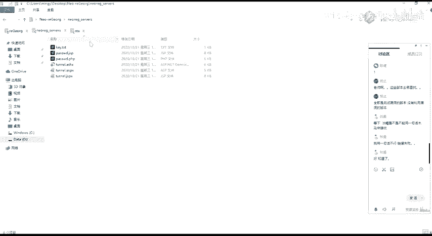

然后这边的话有1个T点开始的话，就是这边的一个呃就这边生成的我所使用的这样子的一个密码。

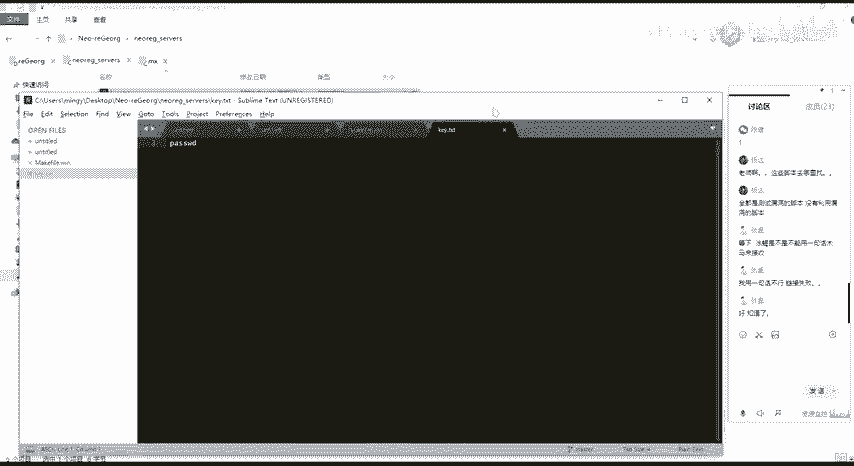

然后还有对应的这样子的一个文件，我这边的话是把它改成了这样子一个password点接SP的这样子的一个格式。然后我这边的话同样的把它就是上传上传上去，对吧？要上去的话就在这边。好。

这个sword点接SP的这一个文件然，我们可以来访问看一下。然后可以看到这边的话没有其他的任何多余的这样子的一些东西啊，对吧？就是没有说访问不到，或者说没有报错的话。

那么就表明我这边的这个JSP的一个脚本的话已经被正常的解析了。然后正常解析的话呃。我们也可以在这边去查看它的一个源代码，有这样子的一个一行的。然后这边的这一行的话，其实就是我们在这边。

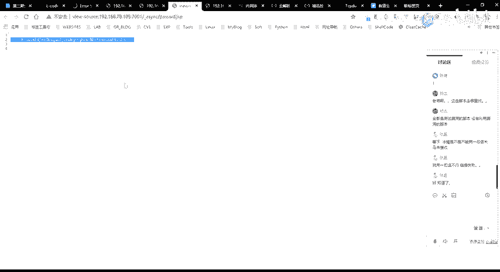

这个脚本的最后的这一行。就是。诶。啊，不是，就是。这一个。

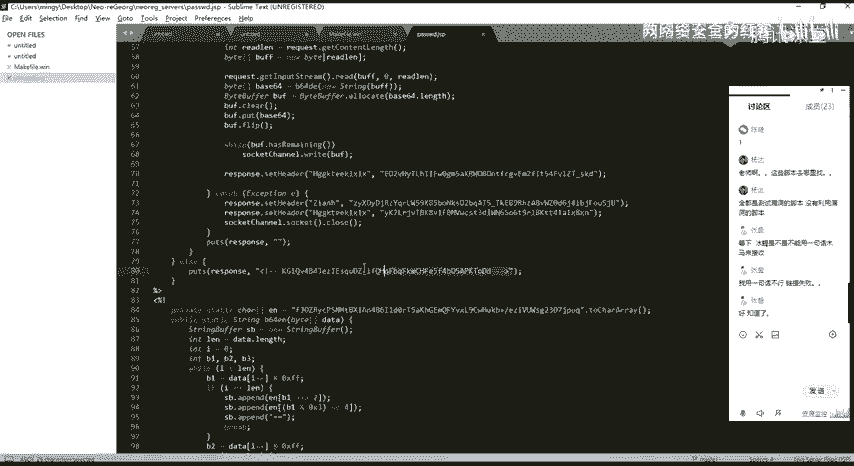

照片的这一个内容。对吧他是跟这边对应的。然后我们这边呃上传上去之后的话，我们同样的通过这个工具。通过这一个脚本。

来去建立这样的一个通代理通道。呃，在那个之前的话，我先把这边断掉。然后在这边我同样的使用1081080的一个光口。然后他的这样子的一个经经济通道的话，呃。

注意的话就是说他这边的话是呃使用的是pyon三嘛呃，pyon2应该。也可以吧。Okay。呃，派成二也是可以的，就是他这个的话，它支持派神2以及派成3，我这边的话就用派成三了。啊。

呃我们可以杠H同样的杠H来查看这一个脚本它的一个具体的一个使用的一个帮助信息，对吧？

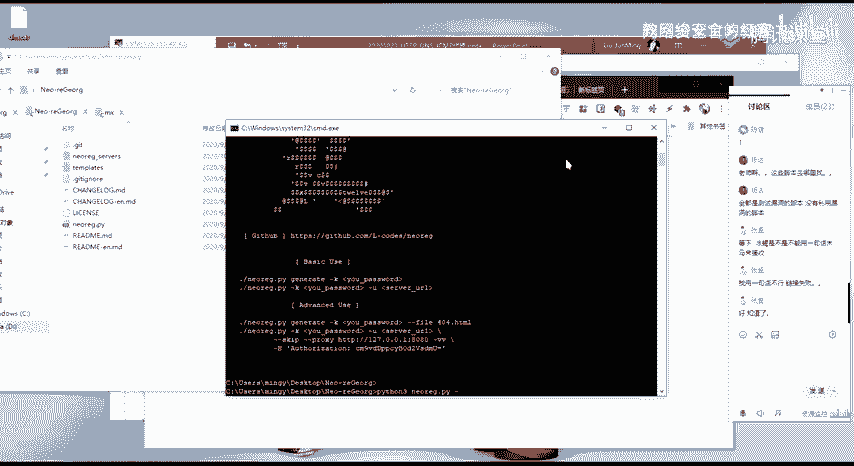

然后这的话我们。所需要的主要它就是这几个场所。首先的话就是干优。赣U的话就是指定我们这边的这一个URL，也就是我们的这一个上传的这个。

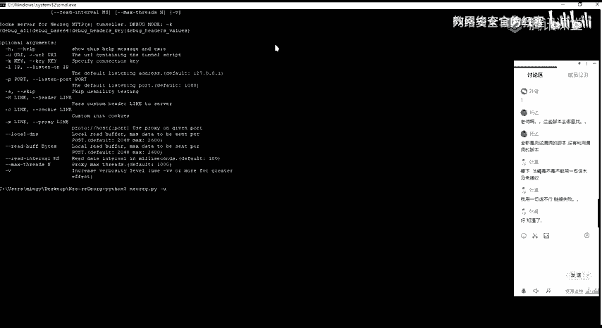

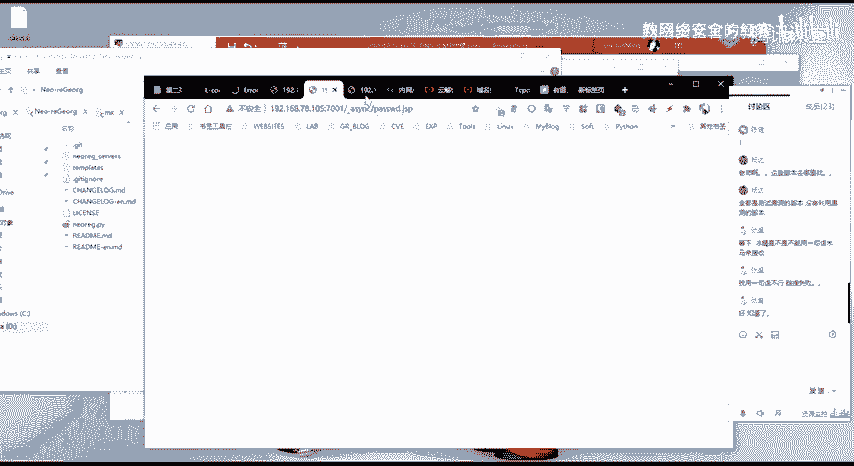

啊，脚本。就摔倒脚本。啊，第二个的话就是这一个杠开。干开的话，我们需要去指定我们的一个T，也就是我们前面再去生成对应的这样子的一些脚本的时候，我们所指定的这个password的密密钥。好。

这边的话就是我这边话是生成了一个pass word。是吧，然后的话还有就是杠P就杠P的话，就是呃今天端口嘛，对吧？就跟前面的那个IG它是一样的，就是在本地去今天一个代理的一个端口。我这的话就1080。

然后执行之后的话。🤧嗯。昨天这的话就是这样子的一个结果。然后可以看到他这边的话呃，就是他启动了这样子的一个收时的一个服务啊，就是在本地的1个108年的一个端口。然后呃。

这边的一个通呃隧道的一个HV的一个隧道的一个地址的话，就是这一个是吧，其实就是我这边的这一个嘛。

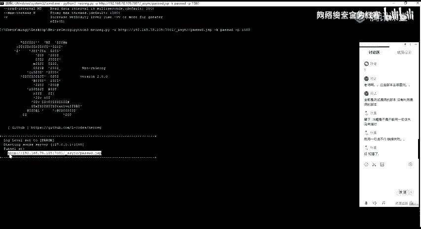

然后在这边的话，我们经历成功之后的话，我们同样的来去验证一下，对吧？

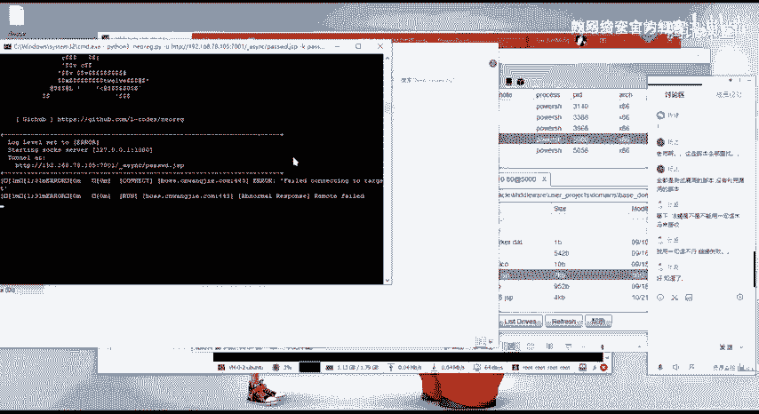

验证的话，我同样的通过前面的这一个这个啊。呃，我这边的一个代理话还是跟前面是一样的对吧？因为我同样的是代理在本地的1个1080的一个端口上面。那么我在这边其也是能够同样的没有问题的去访问，对吧？

对吧哦哦，不是不是这个是。他的一个内网IP对吧？

对吧是能够呃正常的访问，也就是说明我们这边的建业的这个代理通道的话是没有问题的。

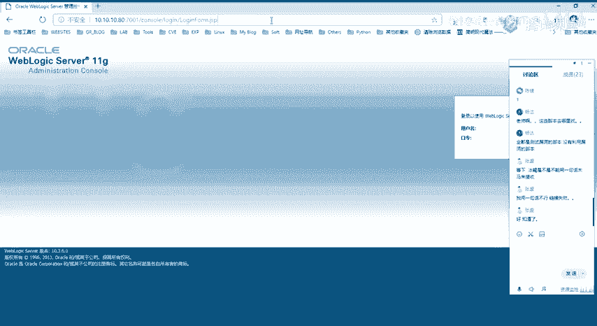

好呃，然后的话我们就通过这样子的一个方法呃，又成功的建立了这样子的一个代理通道啊。然后其实这边的话，它它的一个园林的话都是使用的这样子的1个HPP的一个隧道来去做这样子的一个流量的一个转化。

这两个工具的话呃，就是他的一个用法都是一样的。呃没没有太大的一个差别啊。

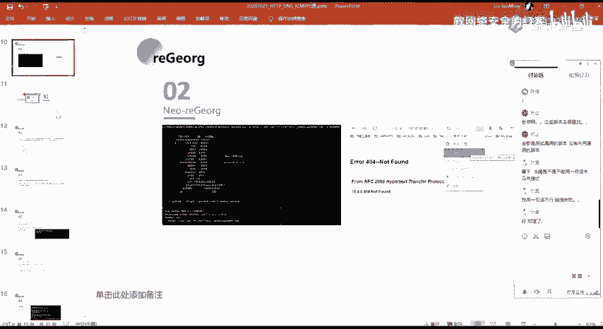