# 2024网络安全系统教程！清华大佬花159小时讲完的网络安全系统课！别再盲目自学了，学完即可就业！零基础入门网络安全！（渗透测试／漏洞挖掘／CTF／黑客技术） - P79：66.Dnscat2的使用和直连模式.mp4 - 教网络安全的红客 - BV1ft421A7Nj

啊呃第二个的话就是。第二部分呢就是一个DSca。点电ca2呃，这个的话是就是。呃，我记得在第一期的时候，就是在开第一期课的时候呃，没有讲这个没有讲就是HTP的呃隧道以及DS有这边的就本节课内容的话。

第一期的时候的话是没有给大家介绍。然呃那会是有有人问我这个，然后的话。呃。我这边话是给了给了这边我写的这一个比较呃，这个是我老走之前的一个比较，挺久的了。然后呃这个比较的话，大家可以去看一下吧。呃。

当然的话因为当时写的话。当时写的话没有。有。呃，怎么说呢？就是不是很认真吧，就是写的比较随便，然后的话比较可能稍微稍微有点杂乱。然后呃当然的话就是具体的一个内容的话，我在今天会给大家去讲。

然后详细的细致的这样子的一些点的话，在这边的话呃，都都有都有写。然后的话。然后还有就是我这边有参考的这样子的一些文章，其实呃就是参考的别人的。啊，就基于别人的这样子的一些已经做了一个总结。

我这边的话就是把它给记下来，然后作为我自己的一个东西嘛，啊，然后我下次我再去用的时候，对吧？就比如说我要是之前我不做这个的话，对吧？我不做这个笔记的话，就是可能你们再你们再来去问我这个东西的时候对吧。

我可能就是会拿一个别人的一个东西给你是吧？但是如果我这边我自己做了，我自己做了有相应的一个东西，我自己有尝试对吧？那么我可以把我自己的这样子的一个总结给你是吧？这样子的话就呃。可能会好一些吧呢。呃。

那他这边的话就是。呃，说了一点闲话。好，我们正式我们正式开始这一部分内容的一个介绍。然后首先的话就是对这个工具的一个简戒。这1个DSca2的话，它是1个DS的一个隧道工具。

它的一个主要作用的话就是我们可以通过DS的一个协议来去创建这样子的一个加密的一个命令，还有控制的一个通道。然后的话。就是说呃就是说它的一个特色的话，就是我们可以在服务端场可以去进行一个命令的一个控制。

也就是CNC嘛，对吧？就是。common的空嘛。然后的话我们在服务端的话就能够呃得到这样子的一个面令控制台，能够去呃执行相应的一个命令，也就是得到目标机器的一个需要。那嗯。再讲这个DS。呃。

在讲后面的一个内容的时候的话，在这边大概的就是提一下。就DS的一个解析的类型，就常见的有这样子的一些。然后我这边的话呃有总结了总结了这样子的一个它的一个类型啊，对吧？

然后在这边的话主要的话就是给大家介绍呃A大写的这1个A就是表示的话，我们域名的1个IP地址，就我们再去配置我们的1个解析的时候，对吧？我们想我我这边的话有一个呃公网的1个IP地址，对吧？比如说我这个。

跟我的这些IP地址对吧？然后的话我这边买了一个玉米，是吧呃。然后你看我的一个域名，我想要把我这边的一个呃机器，就是呃把它给绑到这个域名，就是把这个域。把这一个。域名的一个解析的1个IP地址。

把它给绑定成我这边的这一个对吧？然后我这我再去做一个呃配置的时候就。选择我们的1个DS的一个解释类型的话，就是为A就是一个A记录。这个A记录的话，它对应的是我们的1个域名的1个IP地址。

然后呃还有的话就是这里的NS。AS的话就是我们的1个DS的一个。解析啊就是我们呃可以通过这个NS的一个记录来去指定我们的一个域名服务器。也就是我们因为我们知道我们要去解析这样这个域名。

比如说M点com这一个域名，对吧？然后这个运营的话，我们首先去解析的话，首先就是从我们本地的一个local啊那一个ho文件当中去找到，对吧？如果没有的话。

他就会去找最近的我们呃运营商的这样子的1个DNS的一个公共的这个这一个服务器。然后如果还没有找到的话，他就会去我们的1个DS域名的这个跟服器上面去找。然后的话他会有这样子的一个迭代的查询。

就一层一层的去找，对吧？然后直到找到我们这边的一个呃域名。然后我们在这边的话可以去指定，就是说我们再去解析这个域名的时候，去指定我们是呃。指定呃有哪一个域名服务器来去进行一个解析。

就通过这个N的一个记录。呃，其他的话在这块我就呃我不多说了，呃，大家自己去进行一个呃了解，好吧，因主要的内容不是这一块。然后呃，下面的话就是。呃，对这个DSca这个工具啊，它的两种模式的一个介绍就一个。

呃，首先第一个话就是一个直能模式。直能模式的话就是我们的一个客户端直接向指定那个指定IK的1个EDS服务器发起我们的1个DS解析请求。然后第二个的话就是这个中继模式。中继模式的话就像我们就平常去上网。

对吧？去做一个去访问一个域名的时候，它的一个域名，他去进行一个解析的时候，他会去呃通过我刚刚所讲的那样子的一个呃域名解析的一个步骤，他会去进行一个迭代的一个查询。

然后直到找到我们的这样子的一个I例的1个DNS服务器。然后相比前面的话，就是因为它直接是通过IP嘛，对吧？就直接通过IP它没有DNS解析的这样子的一个。呃。

就是DNS这一个域名解析去查找这样子的一个域名服务器的这样子的一个过程。所以的话它会比较呃慢一点，对吧？它会比前面这个要慢一点，但是的话它是更安全。因为他他有这样子的一个解析的一个过程，以及我们在。

他会他会去看那个就是说呃在呃用这样子1个DSca，他做这样子的一个呃做这样子的一个访弹线的时候，他的他的一个DS的一个请求的话，他是会呃就是。不是默认的一个，就是他的一个默认的一个请求的话。

他会有这样的一。开的一个后缀。因为他是写在他的一个呃工具当中的。当然的话如果你懂代码的话，你可以自己去改掉掉。然后我们如果说通过这样子的一个中继的一个模式。

也就是通过我们自己的这样子1个DS的一个域名的一个解析的话，那么它里面记录的是我们的一个域名。然哦。然后的话呃，我们一起来看一下，就是它的一个安装。这个DSca的一个安装的话呃。挺容易出错的，应该呃。

我今天的话在装的时候，因为我这边他是又重新的又弄了一遍。虽呃虽然我笔记上面有，但是那个话是老早之前的那个服务器啊，而且还是用的那个s OS的一个机器。我这边的话是用的那个无关图的。

的话我又重新又搭了一遍。

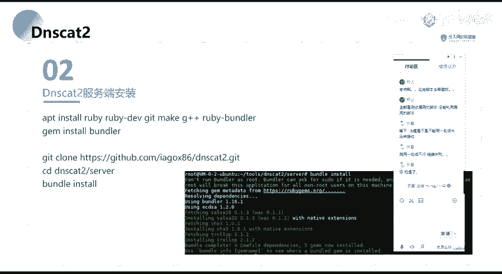

呃，在这边的话嗯。

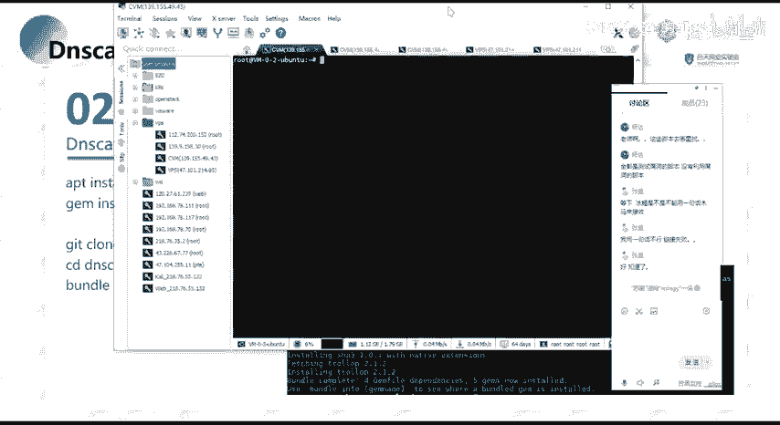

这句话我是装在了安装在了这一个机上面。找到这个工具。在这边。

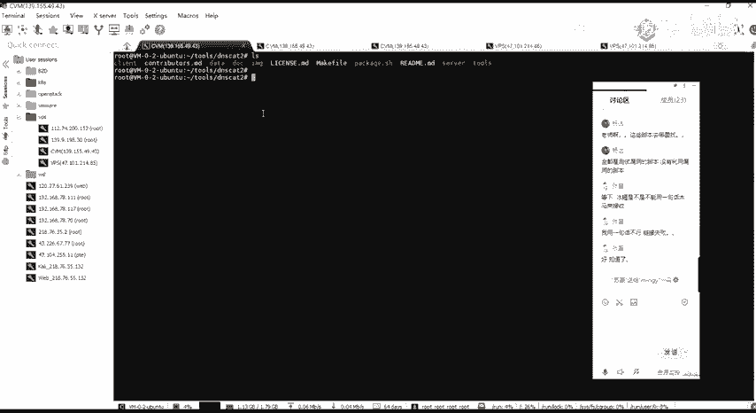

呃，这里的这个工具的话呃，就首先你通过这样子的一个方法嘛，对吧？对。再去通过这样子的一个地毯方式。把它的一个代码克隆下来，克隆下来之后的话，它的一个代码还就是像这样子。像这样子的一个东西。

然后我们主要的话就是这两个目录，就是client以及serv这两个目录。那个s文路的话就是我们的1个DSpa的一个服务。呃，启动这个DSca服务的一个脚本的话，就在这个目录下面。

也就是这个DSca点入refin。然后要注意的话，它的这个工具的话，它是用通用refin这样子的一个脚本语编写的。然后还有的话就是一个f，f的话就是。我那个客户端嘛，对。然后这边的一个客户端的话。

我们需要通过make去进行一个病历来去生成这样子的一个呃生成一个这样子的一个可执行的一个二进制文件。然后再去进行一个呃安装的时候的话，我们需要去安装它的一个服务。在安装之前的话。

我们需要去呃安装相应的这样子的一些呃依赖以及组件以及一些应用程序啊，我这块都已经写了。像呃你需要有reb预bu的一个环境。因为它是用rebu的一个脚本写的嘛，是吧？你需要去用rebu的一个环境去解析。

还有它就是这个reb点DV的话，是它的一些那个呃依赖扩展。然后还有get，就是我们在这边要去用这个get的话，我们也要去安装嘛。还有的话就是makem的话是linkux上面的一个编译器啊。

就我们去编译呃编译我们的一个C代码的时候，我们通过这样子的一个m编译器。去编译成我们的一个可执性文件。你前有G加加，也就是我们。需要的这样子这个环境。嗯。呃。

以及这一个banderband的的话就是我们在这边去安装这个呃服务的时候会需用到这个band做。嗯。然后呃。安装的一个过程的话，就是我这边的一个截图啊，我这边我就不多说了。

就是你这边的这些组件你安装完成之后，你把呃你进入到这样子的一个s目录，然后的话执行这个班instore，他就会去安装对应的这样子的一些组件。安装完成之后的话呃，我们就能够去进行一个启动服务。然。

启动服务的话。

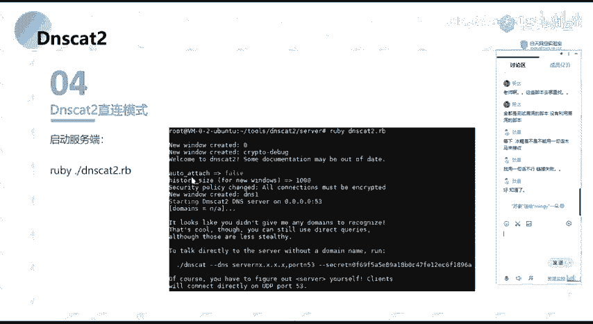

呃，在启动服务之前的话，我们还需要去编译我们的一个客户端嘛。因为我们服务端有了，我们客户端我们也也需要，对吧？还有编译客户端的话就是进入到这个client。

我们直接执行这个make来去编译一个可DSK的一个可执行二二进制文件。

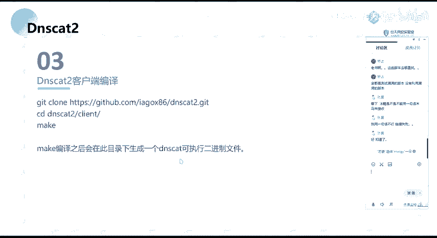

啊，我们呃服务端客户端都有了是吧？那么我们需要去进行一个启动我们的服务端。呃，启动服务端的一个命令话就是这样子，通过reby来去直接去执行我们这边的1个DSca2点RB的这样子一个脚本。执行之后的话。

它就会有这样子的一个。呃，这样子的一个信息返回。呃，先休息5分钟吧。啊，50的时候的话，再我们再继续，好吧。呃，大家呃，我们继续啊。嗯。然，前面的话给大家介绍就是它的一个安装。

以及它的一个就是它的一个安装步骤。然后下面的话我们分别来介绍一下，就是它的一个使用。也就是呃在它的两种模式下面，我们如何去进行一个使用，就我们如何去呃进行1个DNSca的一个直连模式。

以及后面的这样的一个中继模式。

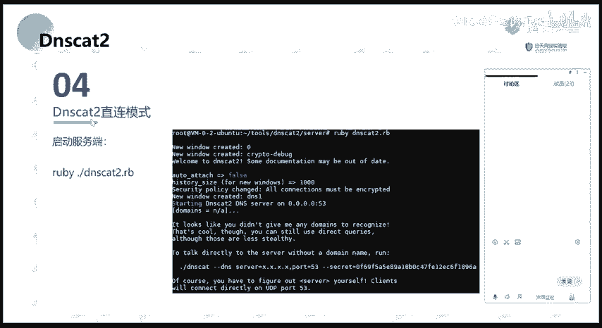

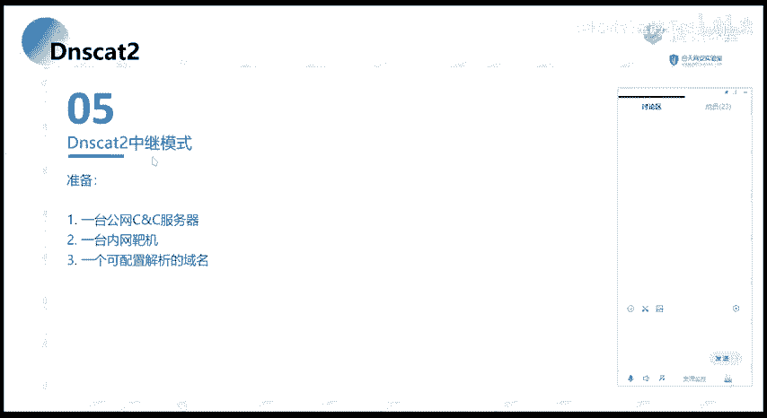

呃，直连模式的话，我们直接执行这样子的一个脚本，就是rebu点DSt啊，执行之后的话呃，返回这样子的一个信息给我们。主要的一个信息的话就是在这边它有这样子的一个。啊，这边有一个杠杠secret。

这边的一个secret的后面的话有这样子的一串字符。这这里的话是一串随机字符。这边的一个字符的话，也就是我们客户端要去连接我们这边的一个服务端的时候所需要的这样子的一个呃一个密钥。

然后的话这边执行之后的话，他会在本地啊，他会在呃我们的一个服务端，他会去精贴1个53的一个端口。因为我们的1个DS的一个呃我们的1个DS的一个协议的话，它默认的话，它是一个呃53的一个端口。

而且是啊要注意是UDP的53方法。

嗯。

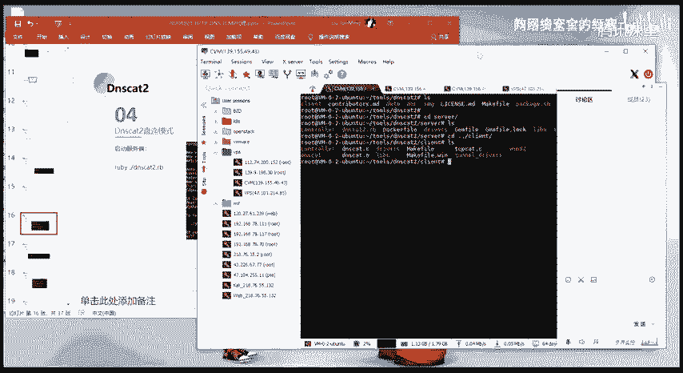

。这个的话呃我们来看一下。实际看一下。首先的话我们进入到这个se的目录，对吧？然后我们执行rebu，然后执行这个脚本执行之后的话，它会在生成返回这样子的一个信息，对吧？给我们。

然后的话它会在当前的一个服务端，它会精天1个53的一个端。

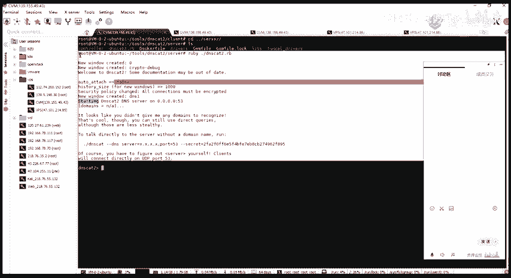

对吧呃，也就是这个可以看到它是一个reby去经听的。然后在这边你去执行的话，可能会碰到这样子的一个问题啊，也就是。

我这边预习内容的话有给了这个链接。

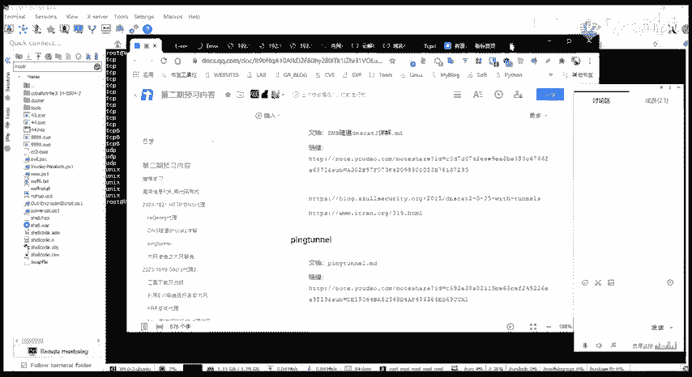

就我今天再去弄的时候的话，是碰到这个问题啊。

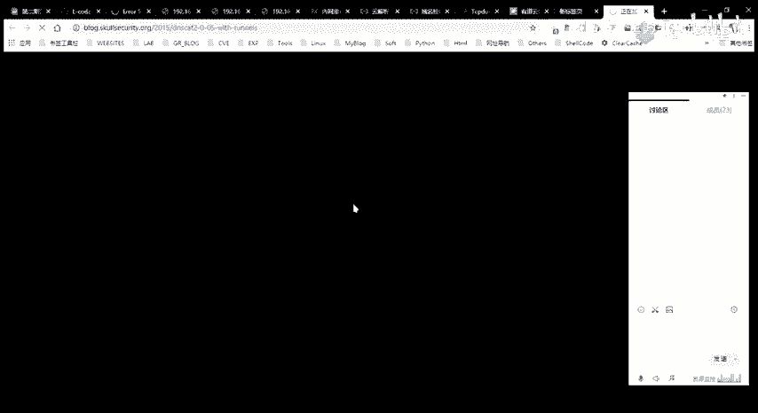

然呢通过他的这边的一个方法，大概不是这个。通过他的这个方法做进行了解决。就是你执行的时候，他会报错报错这个53端口的话，它会占用的。然后你通过去查看它的一个端口占用的个服务的话是这个sstem地点。

被告服。Yeah。啊，不好意思。不好意思，刚刚呃有个电话打进来了。然呃在这的话，我们就是可以通过他的这边的一个方法做一个解决啊，就是更改它的一个配置文件。然后就能够去解决它的一个这个服务的话。

它占用53端口的一个方法。因为我们在这边的话，因我们在这边的话要去使用到这个UDP的53的1个端口嘛，是吧？如果它处于一个占用的一个端口的话，那么我们执行的话就是呃起不来的。

我这边的话啊这在这边执行之后的话，它就有这样子的一个内容给我们，对吧？

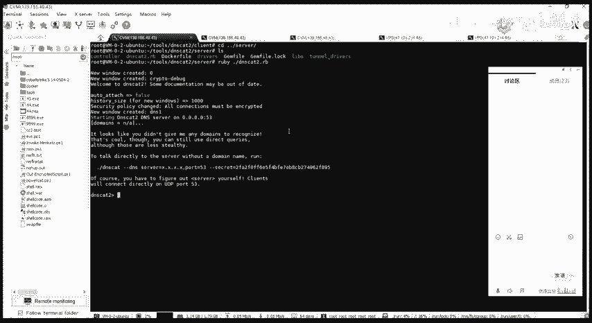

然后这边他给到给到我们的一个信息化，就是这个secret。然后我们把它抠下来，把它。把它放到这边了。

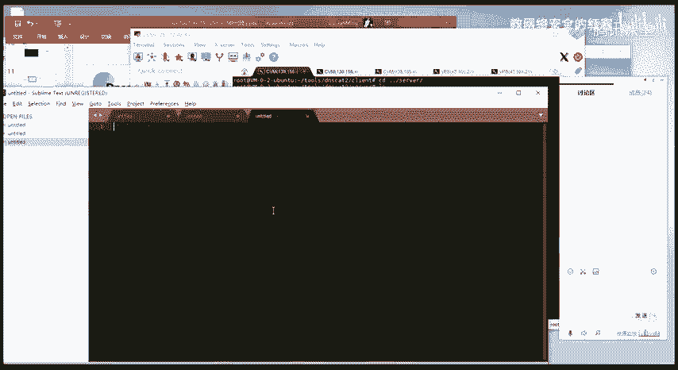

啊，我们这边服务端启动了，我们需要去启动我们的一个客户端。

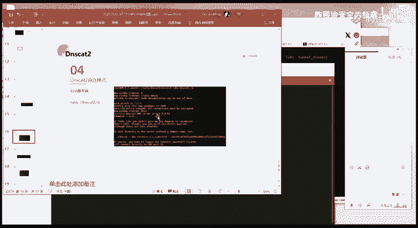

其中客户端的话就是。

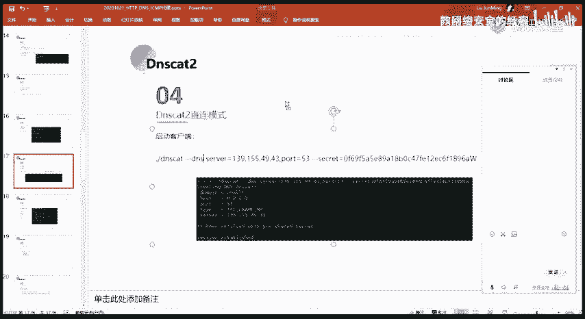

这样子。因为我们前面的话已经编译对吧？通过编译的话，已经生成了这样子的一个我边忘了。

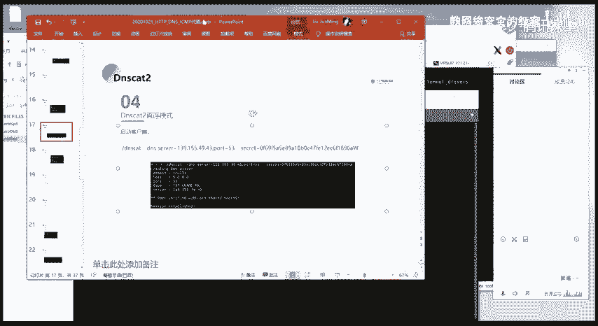

已经有生成了这样子的一个二键子的一个可执行文件。这可执行文件的话。

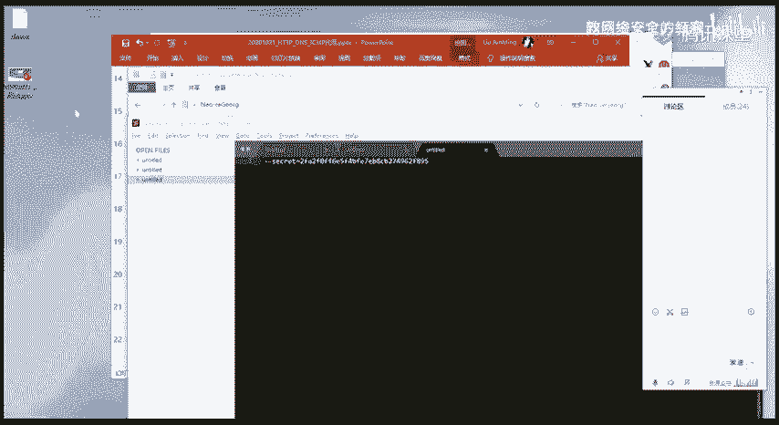

我们把它给算传到我们的一个目标机器上面去，对吧？我这边的话是在我在我自己的一个windows的一个linux系统下面。来去进行的一个执行。然后呃执行的一个方法的话就是。第二视开始。然的话。

接我们的一个杠杠DS的一个选项。然后关于它的一个选项的话，我这边。呃，不不多说啊，我不会就是做太多的一个介绍。

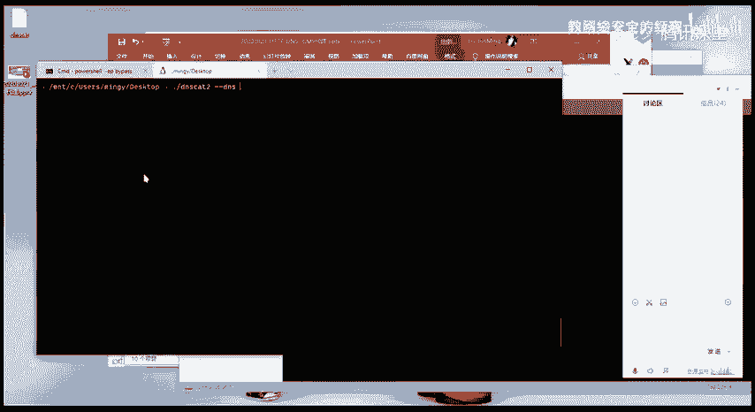

好吧。然呃在这边的话，我们需要去指定我们那个servver，也就是我们的1个DS的一个呃DSca这个服务所所在的一个服务端。就servver的话呃，喂，就是我刚刚的那个。

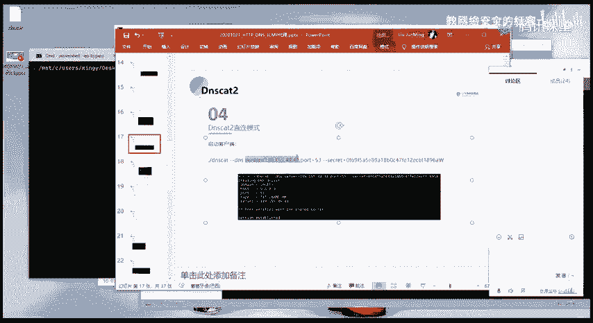

EPS的1个IP。然后还有的话或者端口端口的话就是我们的1个53的一个端口。

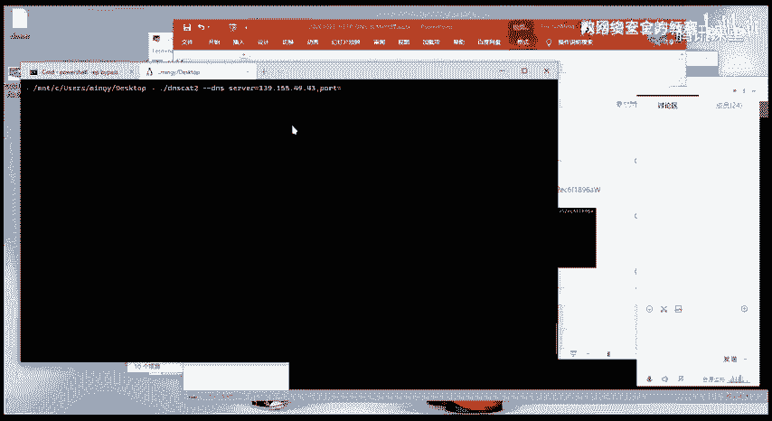

是吧。然，加我们的一个secret。

这边的一个C口话就是。服务端。湖南滩。诶。

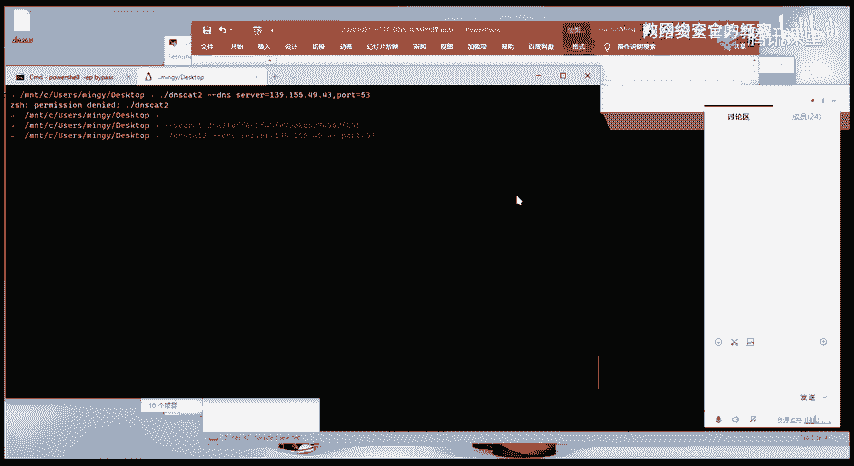

这边服务端执行之后的话，所生成的这一个secret的一个啊字符框是吧？然后我们在这边的话。8月。就是这样。

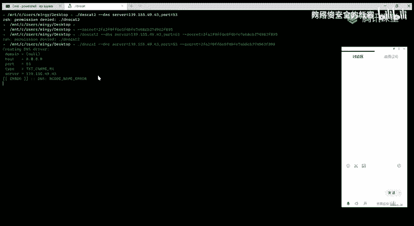

Okay。哦。

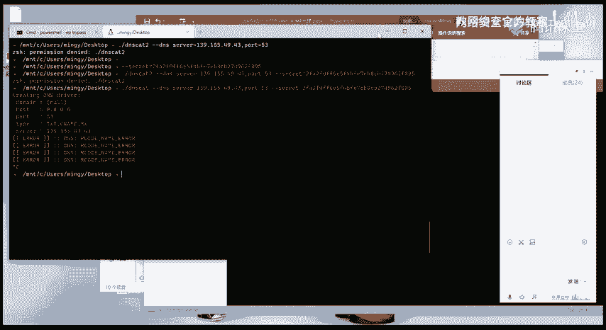

。我通过我要另一个服务器啊。Okay。

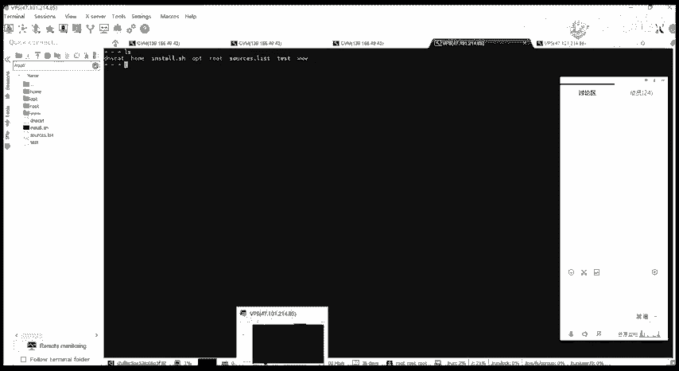

这道了。

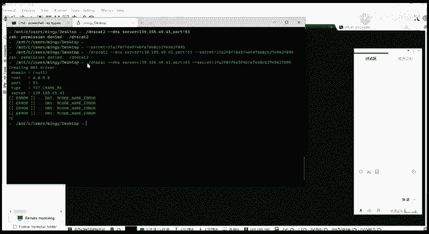

哦呃，执行之后的话，它会有这样子的一个结果，就是显示这一个session istable利息的。这个的话就表示我们的这样子的一个绘画的话已经建议了。

也就是我这边的话呃已经这边的一个客户端已经连接上了我们这边的一个服务端。然后连接上之后的话，他在这边有这样子的一个new windows一。这边是什么意思呢？就是他这边的话。

他就是创建了这样子的一个window，也就是一个呃。呃，绘画。好，我们可以通过输入这个window windows。或者是window来去查看啊。然后这边的话可以看到有这样子的一个一。

这个一的话就是我们的一个命令控制通道，就是这个主机的。然后这一个主机的话，其实就是我这边的这个主机啊。也就是我这边的这个主件啊。然后这边他得到了他的这样子的一个呃绘画。

我们可以通过这样子一个方法来去进入这边的一个呃命令控制。而去呃。来去操作我们这边的这个。呃，客户端。呃，具体的一个步骤的话就是筛选筛选杠I接我们这边的这个ID就这个值为一。然后执行执行之后的话。

就会进入到这样子的一个comode的一个控制台。这个控制台的话它呃是在这个一啊这个一的这个windows这个窗口下面的是吧？然后我们可以通过hel来去查看有这样子的一些命令。

像比如说upload就是上传文件嘛，对吧？还有呃下断关机，需re的话就是进入我们的这样子的一个se。然后还有其他的一些面向EXEC的话，就是执行目标机上面的一个程序。呃，关于这一些东西的话。

在我这边的这一个。

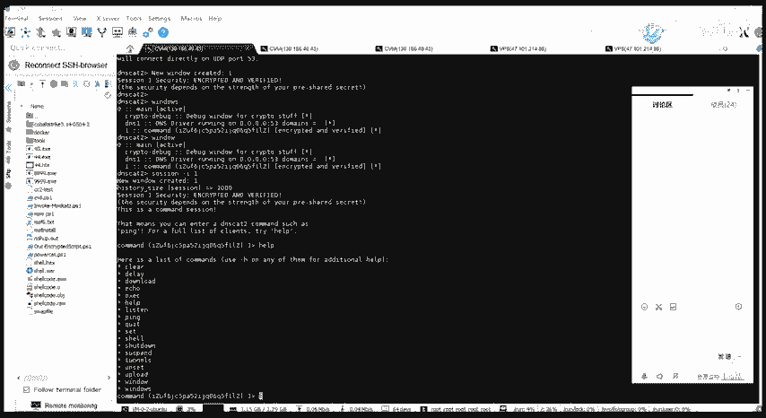

没有。

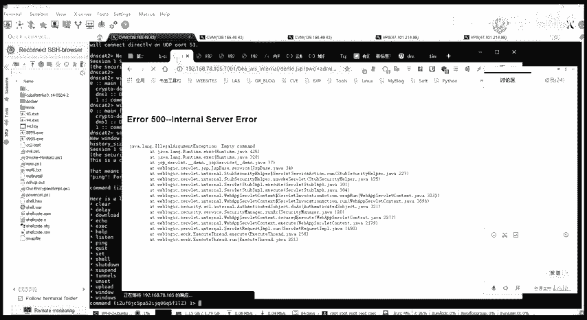

就是那个笔记上面的话有啊。然后呃我这边的话主要就是让大家看一下效果，我直接执行需要，也就是得到一个这样子的一个需要绘话。我们能够去执行命令。然后在这里的话它会又创建一个window windows啊。

就是一个2。然后我们可以通过筛选。刚来来进入到这个进入到二之的话，就得到了这样子的一个SH的一个需。然后我们在这块就可以去执行命令。比如说L对，也就是我当前。呃，当前的话是在。

当前的话是在root目录下面，我root目录下面的话就是这一些东西嘛，我可以看一下。对吧就这些东西。啊，关麦，我当前的话是一个root的一个用户。

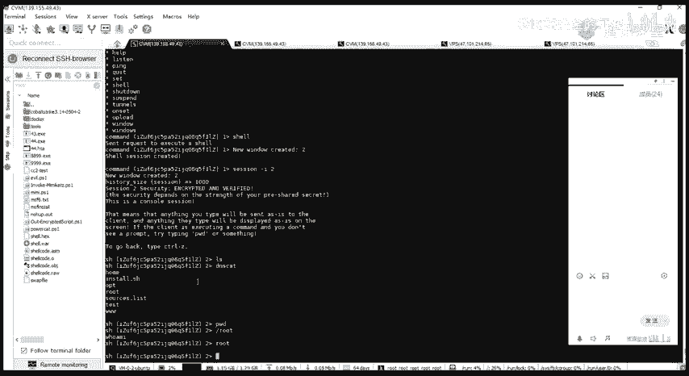

然后的话我们就能够去进行一个命令的一个控制。

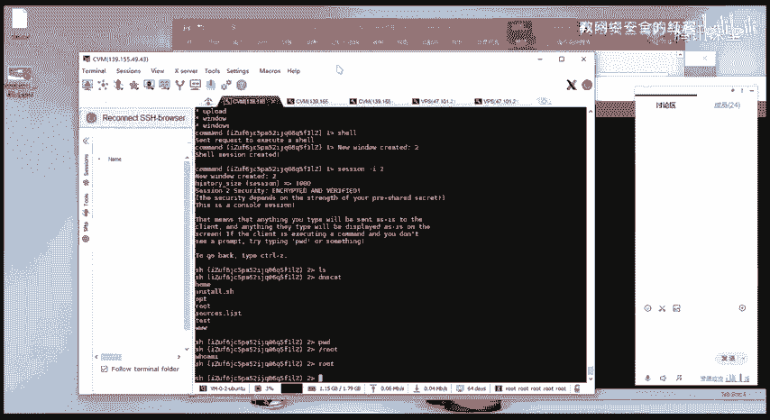

这边它是1个DSPS的一个指令模式啊。然后指民模式的话，它的一个就是它是直接通过这边的1个IP对吧？也就是我们在呃这边我们通过这个DSca所呃创建的一个。呃，DS的这一个呃服务是吧？其实呃一个服务端。

然后的话客户端的话，他来去连接我这边IP的这1个53的1个端口，就能够去建立一个连接。进连接之后的话，我们就能够去得到它的一个绘话来去进行一个命令控制。啊呃具体的一个效果的话就是像这样子啊。

我们可以通过这样的一个方法来去得到它的一个效。

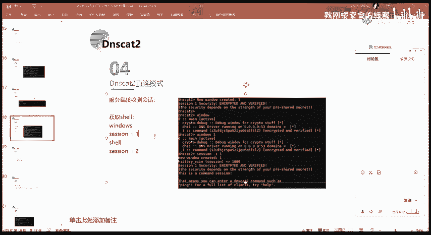

