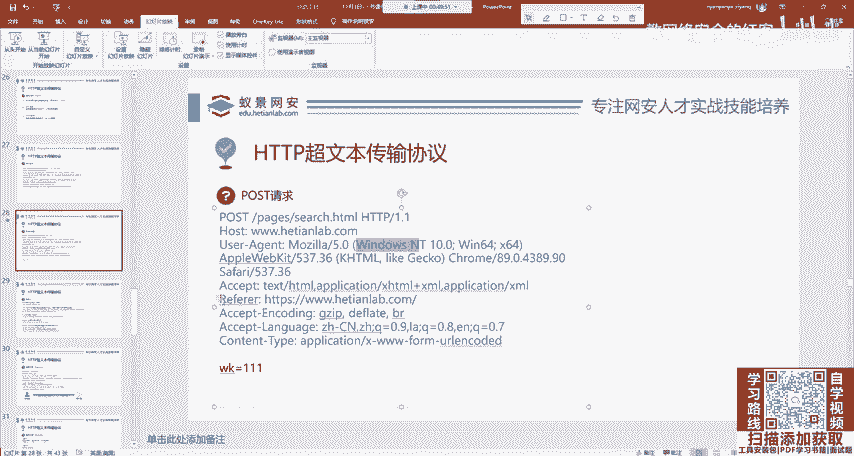
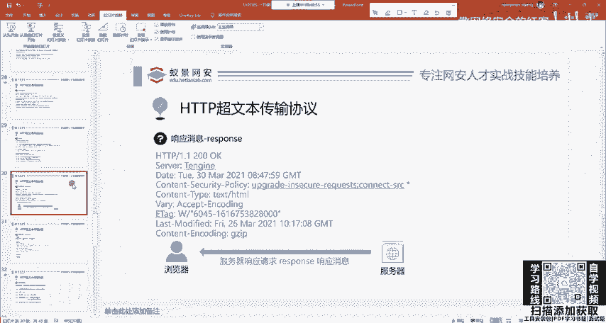
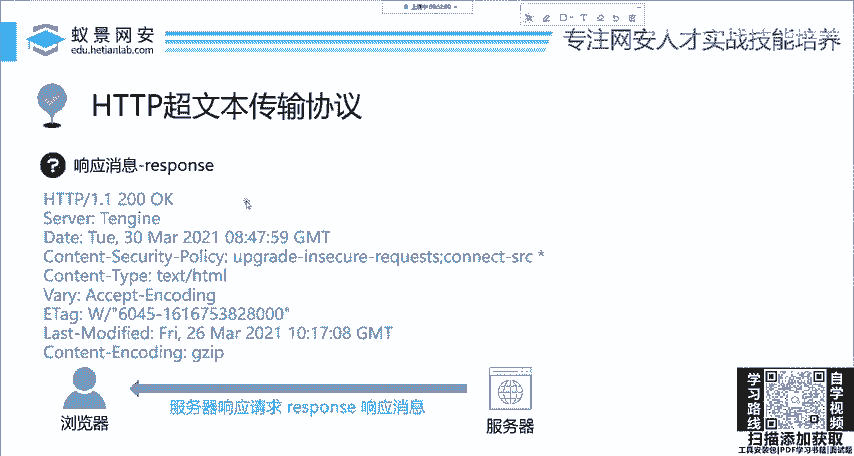
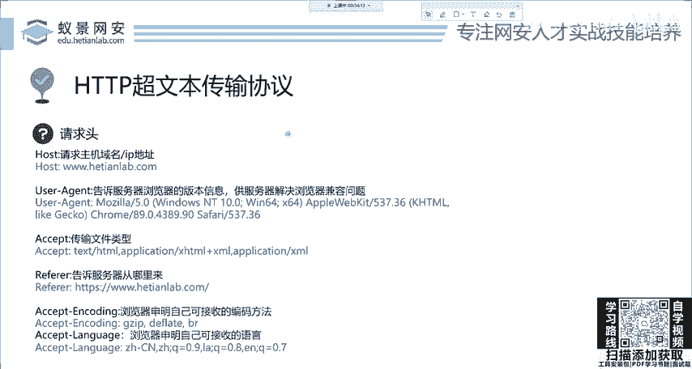

# 2024网络安全系统教程！清华大佬花159小时讲完的网络安全系统课！别再盲目自学了，学完即可就业！零基础入门网络安全！（渗透测试／漏洞挖掘／CTF／黑客技术） - P7：7.HTTP基础-请求头.mp4 - 教网络安全的红客 - BV1ft421A7Nj

哎，电脑版的就不再用这个Iipad，不再用这个安卓去发送这个请求了，就改了这个地方。那下面呢叫做rifer啊RE。

这个这个东西啊这个东西我口头给大家讲吧，这个东西也挺重要啊，这东西就是告诉服务器从哪里来，这地方是有几种方法，就是实际也很重要啊。其中一个重要就是统计。比如说我们现在网安实验室。

打广告找谁打广告呢？找谁打广告呢？我们找百度就百度说你现在在百度啊一搜网络安全。第一个你就要显示我们网安实验室。比如说我们给百度50万块钱让他做这个事情。他做了之后。

那我们怎么去统计哪些用户是通过百度搜索而点击的和田网安实验室呢？就是通过这样一个REF1R1哈，通过这个东西去判断如果这个REF1R12，它是百度的话，就代表你现在打开广安实验室。

是通过百度点过来的那我们后端的这个程序员做一下代码的统计就能得到啊，我找你百度打广告有没有用，你到底有没有给我收益。如果没有现在你打个广告都没人点，那么后面就不找你了。就是这个意思啊。

这个叫做啊统计服务器是从哪里来的。那下面呢叫accept accept呢是传输文件的类型。那，通常通常呢就是HTML啊，就HTMO。然后后面几个叫做encoding，还有language。

就是你接收的编码方法和接收的语言，这里也是为了和服务器去统一规范。比如说服务器现在只能回填日语，但是你的电脑上面没有日语语言包。那我回钱给你不就是乱了吗？是吗？所以说呢他一看你支持这个像ZH杠CN。

这就是中文。他一看你支持简中，那他就把这个网页呢，你回选一个简体中文的支持的语言编码啊，就能够正常的显示了。就是这样一个问题。那其他的请求头呢还有很多还有很多。

啊，再讲一个，我这个PPT上没写啊，叫做cie。这个co呢叫做曲奇饼，就是COKRE曲奇饼的这样一个能看到你说话呀，能看到你说话。这曲奇饼呢就是这个英语的翻译。首先给大家讲为什么会引入这样一个头。

我们在之前讲过，HDTP它是一个无状态的协议，就一次请求和响应跟下一次的请求和响应没有任何的关系，这会导致一个缺陷。比如说你登录一个网站，就登录百度啊，百度贴吧，好吧，百度贴吧，你现在登录百度贴吧。

然后你进入这样一个贴吧的时候，你。发现你已经登录了，但你重新打开进入另外一个贴吧，你会发现。我还得再登录，就我每打开一次百度的网站，我都要登录一次，为什么呢？因为无状态啊，他不知道你上一步做了啥。

他无状态的。那这个时候为了规避这个问题，就引入了这个cookiecookie叫什么意思？叫做令牌。是啥意思啊？就是比如说你现在登录，比如你登录百度之后，就百度的服务器，他给你发一张令牌。

这个令牌叫做coie。发给你，就是你。发给谁啊，发给客户端啊，发给你的浏览器，这浏览器拿着个令牌，让他再去访问百度的这个页面。是不是都不要登录了？为什么？大家都知道古代的时候，像那些丞相。

像那些各地方的那个军这些节度使要想行使皇帝的权利，是不是都要有令牌？就这个一个意思啊，我有令牌，我就是老大，我就是已经登录的用户，我访问哪个页面，我都是已登录的状态。那所以说在攻击中就有很多的攻击方法。

是以窃取cie为目的的那你cie，你令牌都被人拿走了，别人还要你的账号和密码吗？根本不要是吧？我直接拿你令牌，别人认令牌不认人，懂吗？O就是这个cie，大家来了解一下。那像。

