# 2024网络安全系统教程！清华大佬花159小时讲完的网络安全系统课！别再盲目自学了，学完即可就业！零基础入门网络安全！（渗透测试／漏洞挖掘／CTF／黑客技术） - P80：67.Dnscat2中继模式.mp4 - 教网络安全的红客 - BV1ft421A7Nj

呃，上面话就是这个指连模式。下面的话就是DSki的一个中继模式。中继模式的话我们需要去啊。做一些准备。首先第一个的话就是我们需要有一台公网的一个服务器。这台服务器的话是作为一个我们的1个CNC。

也就是我们的一个命令控制的一个服务器。其实就是呃像我就是我这一台嘛，对吧？我就话先。

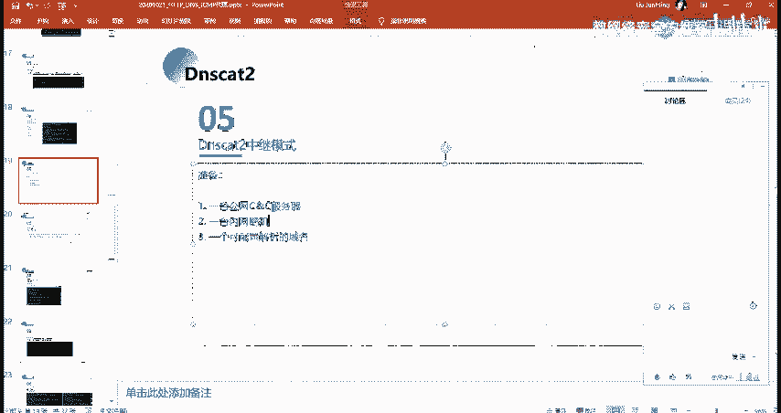

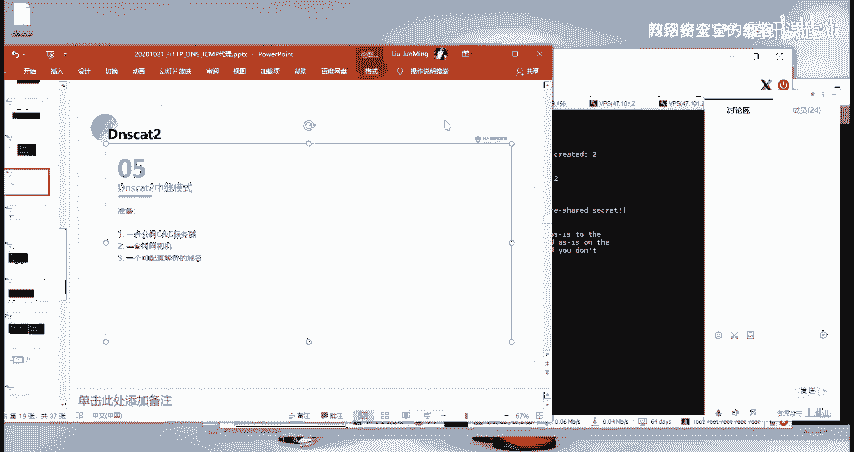

没有了。就是呃我这的话就以这一台为念。

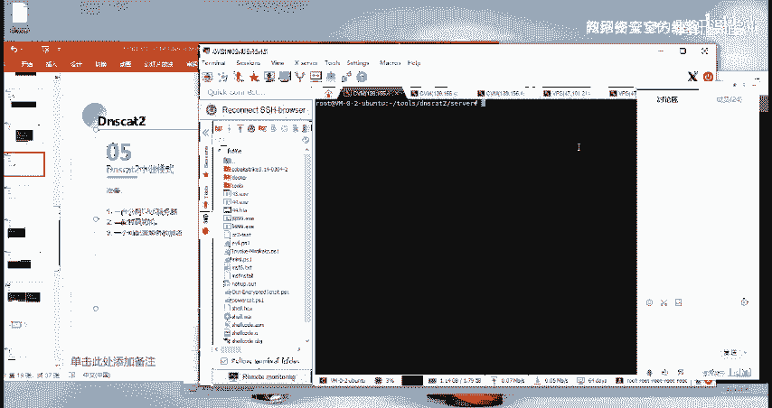

作为我的一个。呃，面令控制的一个服务器。然后第二个话就是一台靶机，就靶机的话。挂机的话呃，内网公网的都可以嘛。然后第三个的话就是一个可配置解析的一个域名。

其实主要的话就是这个就我们需要有一个可以自己去进行一个解析的一个域名。就是你要去做做这个DSca这一个中继模式的话，你需要有一个域名，你要去做一个配置。然后我们怎么去进行一个配置呢？

我这边呃下面的话我们来一起来看一下。就配置DS域名的一个解析。呃，我这边的话是呃，我用的公司的一个域名。

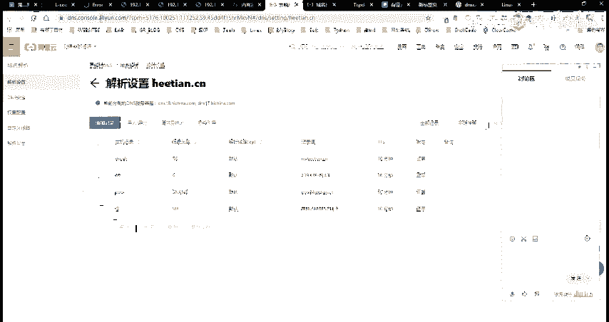

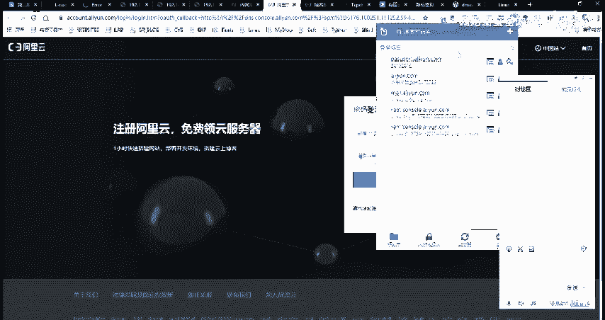

。好。我这边话是用的公司的这一个育苗。呃，然后的话我在这边拍了做了这样子的。那个。呃，解析的配置啊。然和具体的一个配置的话，首先第一步的话就是我们需要去创建1个AG5。

IG的话就是将我们自己的一个域名的一个。解析服务器指向我们的。我们的这一个就是云服务器的1个IP。我们这边的一个云服务器的话，就是我们自己的这一个要去做一个命令控制的一个服务器。

也是我们的1个DSca服务所在的这样子的一个服务器。然后在这边的话，我们将自己的这个就是域名解析服务器。这个NS点S点核心点CN的这个呃域名，把它给指向了我这边的这一个IP也就是我这边的这个机器。

然后的话呃第二个的话就是创建1个NNS记录。NS记录的话就是将我们的一个子域名，就是指定我们这边要去解析这一个子域子域名的时候。

它的1个DNS的一个服务器的话是为这一个就是将我们的一个解析这一个域名的呃。解析这一个域名的时候。就是再去进行1个DNS解析的时候，他会呃给就是告诉他是呃我们的一个呃DS的一个服务器的话。

是这个NS点和天点CN。然后我们这边NNS点和天点C这个运名解析服务器的话，又指向了我这边的这个呃云服务器的1个IP对吧？然后我这边配置好之后的话，配置好之后的话，我们如何去做一个这样子的一个启动呢？

首先的话我们需要去启动我们的一个服务端。启动服务的话跟前面不一样的话，就是我们在这边要指定我们的一个DS的一个就是域名服务。就这个。啊，其实在后面我们去呃进行就他的一个域名解析。去经历绘画之后的话。

他的一个呃解析的一个域名的一个请求。DNS请求的话，它都会是记录的是这边我这边的这个DNS的一个呃。这一个玉米。然后的话呃，杠干s的话就是指定我们要去做的，要去用的这样子的一个密钥嘛。

我这边的话就随便呃用了一个。然后执行之后的话就是呃返回这样子的一些信息。它同样的是在本地去经行了1个53的一个端口。然后我们的一个客户端是怎么启动的？客户端的话就是呃。指定我们这边的1个DS的一个呃。

这一个域名。然后的话启动。启动之后的话，就能够去得到这样子的一个绘画。然，其实在这边它它的一个过程的话，就是像这样子。就是他我们那一个客户端，他会去解析这一个域名，对吧？他会去找这个域名。

他是怎么去解析。那么因为我们在配置这一个域名的时候，在这边做一个域名解析的时候，配置了它的一个呃它的1个DNS解析服务器的话为这一个，也就是他再去做一个域名解析的时候，他会去找到这一个服务器。

然后在这边的话，它的一个这个服务器，它所指向的1个呃IP就是它有这样子的1个A记录，对吧？也就是我们再去找这个服务器的时候，它会找到这个IP。然后找到这个ID之后的话。

这个IP又是我们的这一个呃VPS或者说是我们的1个CC服务器的这样子的1个IP。

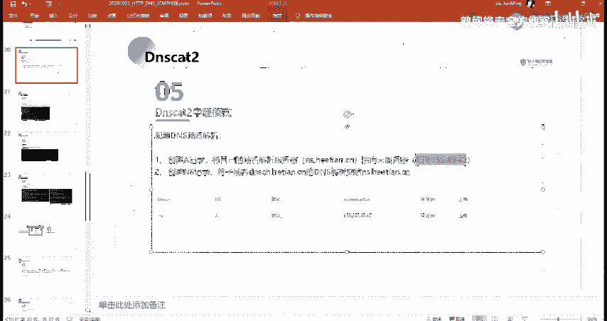

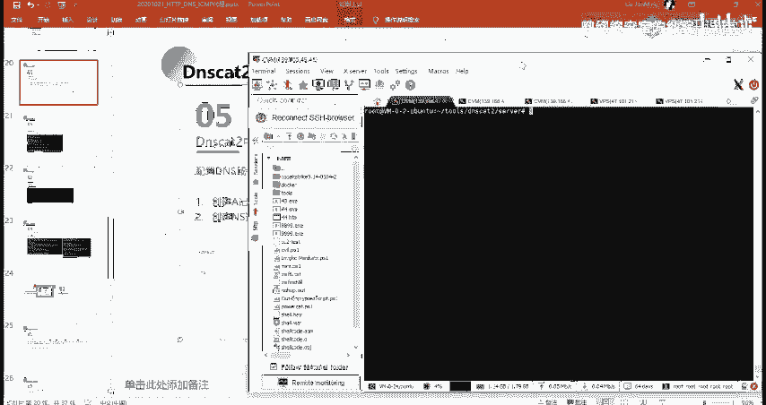

然后他再去把我们的1个DS请求，他会发到我们这边的这个IP的1个53的1个端口。然后其实就是。呃，通过这样子的一个解析的一个方式，把我们的这样子的一个数据。再去解析这一个域呃，解析这个域名的时候。

把它给发送到了我们服务器的53的一个端口。

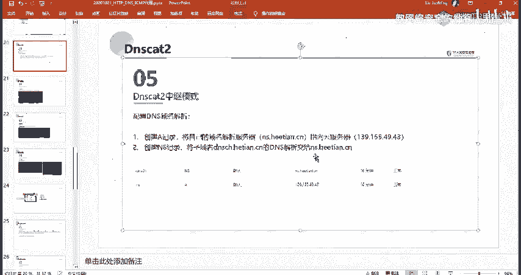

然后的话来去建力的这样子的一个连接。然后具体的一个效果的话就是这样子呃，我们实际来看一下吧。

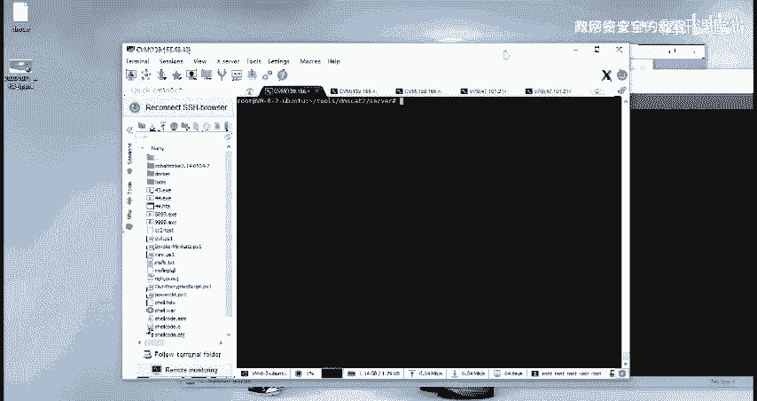

首先的话呃。

啊，这边直接复制了。前面呢。😔，打掉了，然后我这边执行之后的话，就是这样子是吧？

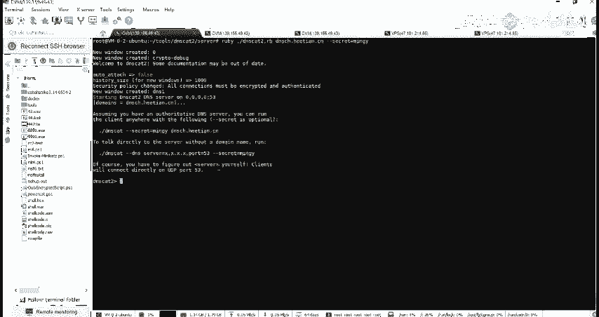

就服务端的话已经启动了。然后我们下面的话启动我们的一个客户端。

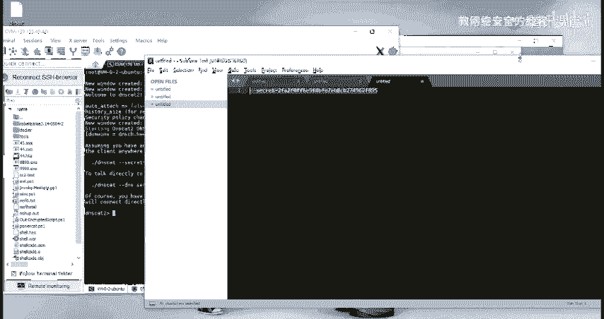

客户端的话，我就在我本地的这个。Okay。就这样子，然后可以看到在这边执行之后的话，他就呃。他就呃已经鉴立成功了，对吧？我们的一个筛选的话已经呃。已经启动了。

然后我们在这边服务端的话可以看到在这边的话就得到了这样子的一个啊window windows这样子的一个控制台窗口，对吧？然后就是同样的一个操作。我们可以进覆到这样子的一个控制台，对吧？

然后这行需要那需要之后的话，它就会得到一个呃命令控制。对，然后其实在这边他有这样子的一个。他有这样子的一个信息啊，就是我们这边的一个服务端发就是执行这个需要之后的话，他会在这些客户端。

他会呃有一个这样子的一个就是得到这样子的一个命令控制的这个需要嘛，是吧？有这样子一个请求发送到了客户端，然后的话它就会启动一个这样子一个BSH的一个线。是吧以及他的一个需要的1个ID是这个610。

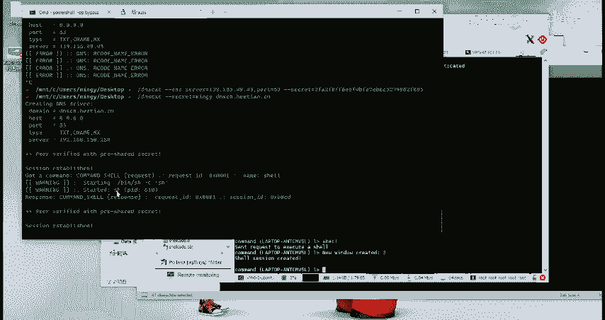

也就是到我们的一个服务端态，就是这个2对，然后我们可以通过这个选刚刚。指定这一个来去进入到他的一个。啊，SH的一个线。我当前的目录话是这个是吧，嗯。这边的话那东西有点多。

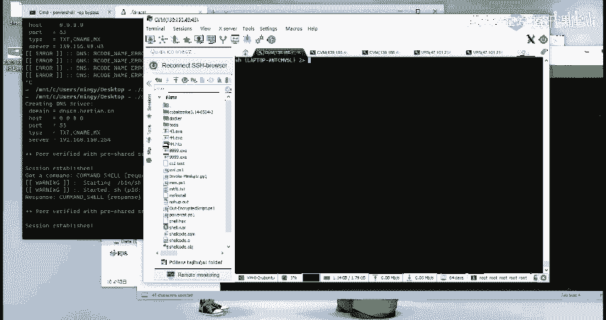

🤧。去。也就是我们通过这样子一个方法的话，已经呃成功的建立了这样子的一个呃。命令控制的一个通道。然后所采用的一个方式的话，就是这个DSK2的一个中继模式。然呃其实大家再去做这个的话。

其实主要的一个地方它就这边的一个域名解析。你首先你要有一个自己的一个域名，就你需要自己去买一个域米。然后呃其实我自己有域名，但是要备案了，然后我一直没备案，所以我这边的话是呃直接用的公式的。

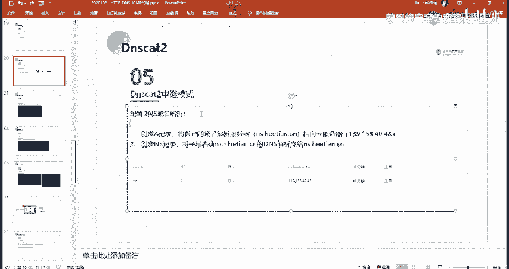

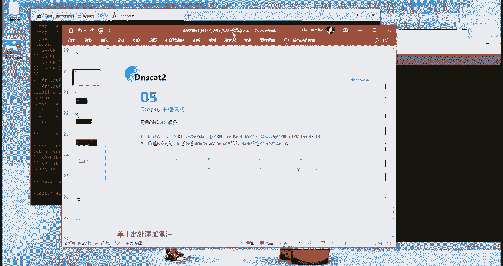

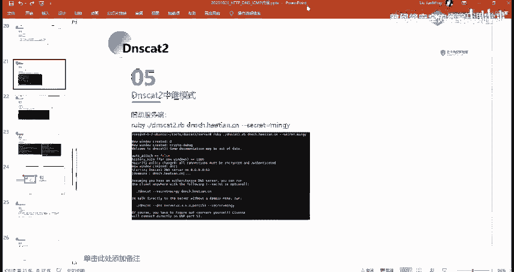

啊，呃，其实大家可以就是如果大家自己在本地有的话，在本地有下有自己编译的这样子那个DSca的话，呃，你可以就是执行这边的这个命令。我这边的话就能够去得到你的一个需，就有谁想试一下嘛。

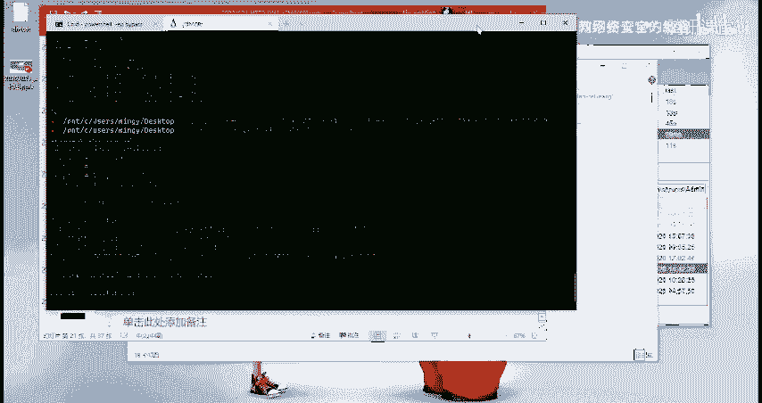

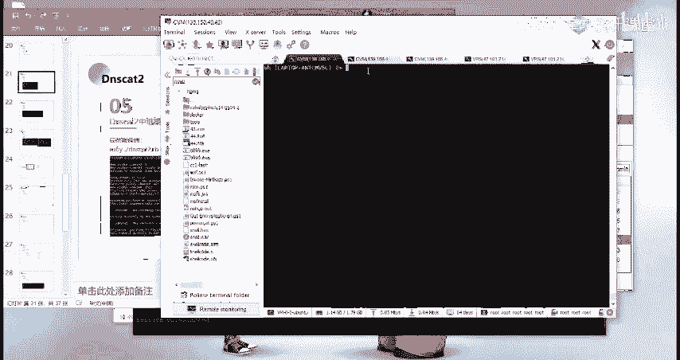

有谁想试一下吗？

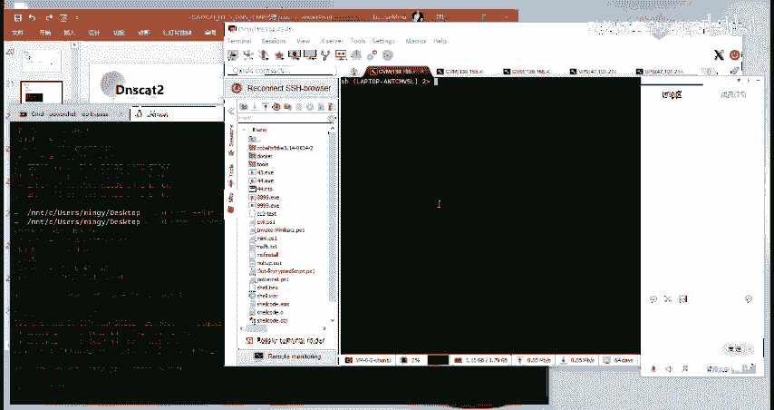

就执行执行这一个就可以了。

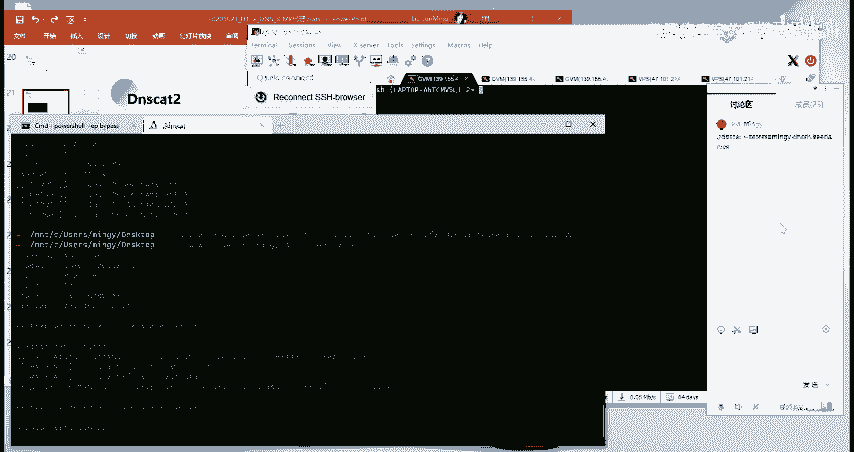

呃，以上的内容的话，大家能能听懂吗？有没有什么疑问？就关于这个DSt呃，就是通过这个DS的一个呃方式啊。

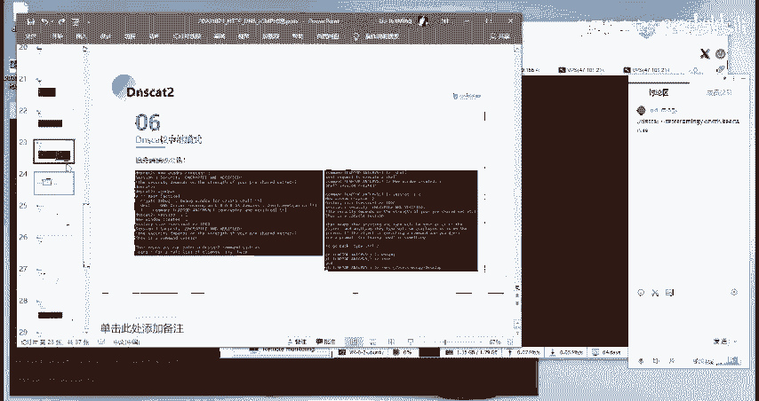

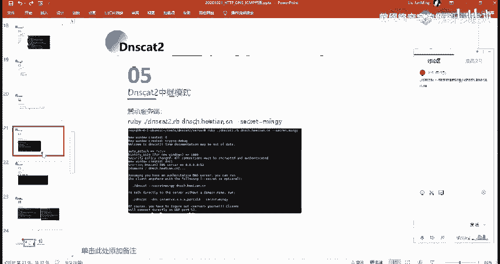

啊，其实在这边我们有进行连接，对吧？我们可以来查看一下它的一个流量。就是查看它的1个DNS请求的一个流量。我们这边的话可以通过TCPTCP调在linux下面的话呃就是。呃。嗯，min令是什么来着？嗯。

然后其实可以看到对吧？就我们在这边呃，我这边的话就是通过TTCB调来抓取，就是呃访问端口，就是访问目标端口是我这边53个，就是我本地53端口的这样子的一个请求啊。

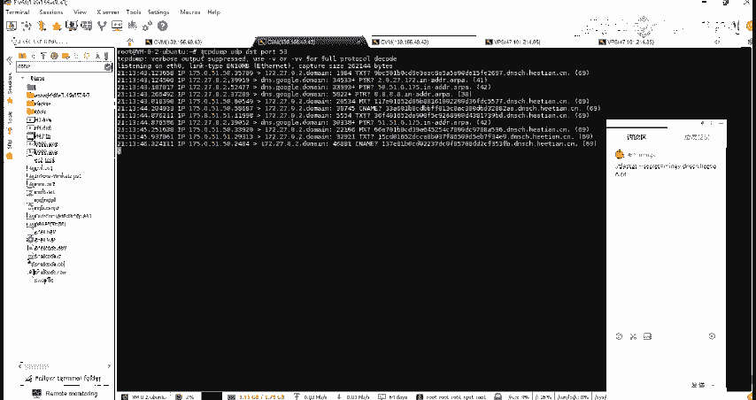

然后在这的话就能够去看到对吧？我这边先停掉，然后在这边可以看到有这样子的一些请求，啊吧，有像T text新 name，还有MX对吧？这样子的一个请求。然后呃其实DSca的话，它的这样子的一个。

他再去选择这样子的1个DS解析的一个类型的时候。

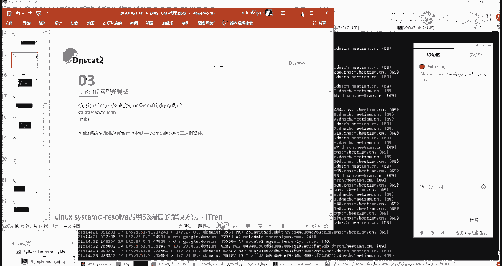

他是会像这样子，就是呃通过在这边他是这一些模式，他都会啊不这些类型他都会去就是随机的去那个像新内容啊tMX等等这一些类型，它会去交叉的去去进行一个使用。然后在这边他去请求的一个数据啊。

我们可以看到就是这边嘛，这边的话就是其实就是我们。所传递的这样子的一个数据，它在这边。然后他传递给的一个域名的话，就是我们所设置的这样子的1个DS的一个域名，我们自己的一个域名，对吧？

然呃其实大家也可以去试一下，就是。那个直连模式直连模式的话就是呃DSca，它是会有这样子的一个关键的一个字。我这个话我就不尝试了，大家可以自己通过这样子的方法来去呃查看它的一个流量。呃，大家有疑问吗？

应该没有疑问吧。啊，有没疑问的，扣个扣个一，有疑问的扣2。Oh。嗯。就两位同学吗？其他同学呢能能理解吗？历是不是从哪问题？呃，那那那你是。没理解吧。还是说又是呃要等自己操作。就是没理解。呃。

哪里没理解呢，我可以再给你呃，大概的说一下。嗯。嗯。好呃，你看录播也行吧，那那你看录播吧，然后有问题再问嘛。

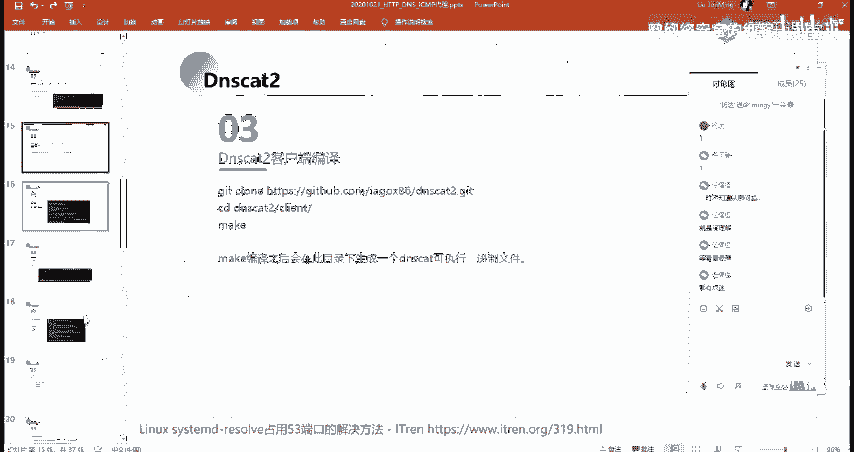

好，那么我们继续啊我们继续后面的一个内容，第三部分的一按钮。

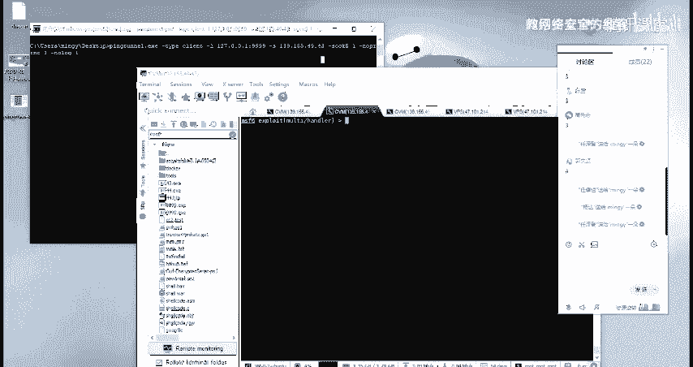