# 2024网络安全系统教程！清华大佬花159小时讲完的网络安全系统课！别再盲目自学了，学完即可就业！零基础入门网络安全！（渗透测试／漏洞挖掘／CTF／黑客技术） - P81：68.pingtunnel使用和ICMP隧道转发TCP上线MSF.mp4 - 教网络安全的红客 - BV1ft421A7Nj

第三部分的话就是这个呃pin，也就是通过SMP隧道来做。来去呃反弹线来去建立我们的一个线。呃，在这边的话呃。先大概的了解一下，就是SMP隧大的它的一个作用。就其实呃前面我们介绍的这一些。

其实它都是有它相应的一个作用的对吧？首先第一个像我们的这个HTP的一个隧道。HTP隧道的话就是我们得到的它的一个服务，对吧？它是像这种web服务，以及它的得到的这个机器的一个需有。

它是只有像这种HTP的一个流量，或者说它只能从80端口来去呃访问外网，对吧？也就是只允许HTP这种流量的话，那么我们要去呃，比如说我们生成一个码，我们传上去，然后我们执行的话是像这种TCP的这种流量。

对吧？那么它是无法去呃连接到我们的一个呃服务端的。那么在这这在这边的话，我们就选择通过这样子的一个HTP的这样子的一个隧道，因为我们通过的是它我们。使用的话是这样子的一个脚本。这个脚本的话。

在它的一个服务端上面执行，对吧？然后他解释之前的话，他就能够呃跟我们这边的一个呃脚本的这一个客户端建立一个连接啊，建立连接之后的话，来得到这样子的一个收持的一个代理通道。然后其实这边的一个代理通的话。

其实是通过这边这边的1个HTP的一个协议啊来去进行的一个通信啊。这个的话就是这个HP带理隧道的一个作用。然后呃DSK2的话就是。呃，因为我们通过前面的一些操作，对吧？

能够去知道它其实是通过我们的1个DS的一个呃解析来去进行的一个数据的一个传递，对吧？那么在我们的一个实际的这种环境当中，对吧？它可能就是。他可能就是他不允许像这种我们的一个呃。TCP对吧？

TCPUDP的这种呃协议的这样子的一个请求数据的一个传递啊，那么我们。想要去得到它的这样子的一个需，对吧？得到这个机器的一个需，以及把我能够去建立这样子的一个呃命令控制的话。

那么我们可以通过这样子的1个DNS的一个它的一个解析协议。因为在呃在防火墙或者是说在内网当中的话，你要去进行一个域名的一个解析的话，那么DNS的一个协议的话，它肯定是能够去被允许去呃进出的对吧？

因为你要去你要你要去访问域名，那么你就需要域名解析。那么你要域名解析的话，那么你就需要有53端口。到。然后我们在这在这边的话，我们就可以通过它的1个DS的一个域名体系来去建立这样子的一个隧道。

来进行一个命令控制。然后的话到这边第三个的话就是呃我们通过某种方法，对吧？得到了一个机械的一个吸尔。但是这个吸尔的话，我们就不适合去进行一个命令的一个控制对。然后的话它的这个环境的话。

又它不允许像TCPUDP还有像DSHDP等等这种协议，它不能够出网。那么它只有就是只有只能够通过SMP协议去进行一个出网的话，那么我们可以通过这样子的一个呃方法，就是来去建立一个SMP的一个隧道。

然后呃这的话主要就是通过介绍这一个工具啊，这个拼的一个工具来给大家介绍。然后这个工具它的个一些参数的一个使用的话，我这边也不多说，大家自己呃自己去了解，好吧，我这边的话其实。呃，都是中英文对照，对吧？

啊，不是啊，就是都是中文的对吧？中文大家都能看得懂嘛，就是以及参数它对应的一个意思。哦呃，首先第一个的话，我这边的话就是有列举了这样子的三个例子呃。航。呃，下面的话我会以这样子的三个例子啊。

就是给大家呃说明讲解这样子的一个呃IPSMP隧道的一个利用。首先第一个话就是这个SMP隧道去转发TCP来上线，就是把我们的1个TCP的一个流量通过这边的1个ICP的隧道。

然后的话做一个转发来去得到它的一个呃线来去进行一个命令控制。然后具体的一个使用的方法的话，就是首先第一步我们的1个VPS需要去启动1个SMP隧道的一个服务端，也就是用到我们这边的这个拼的一个工具。

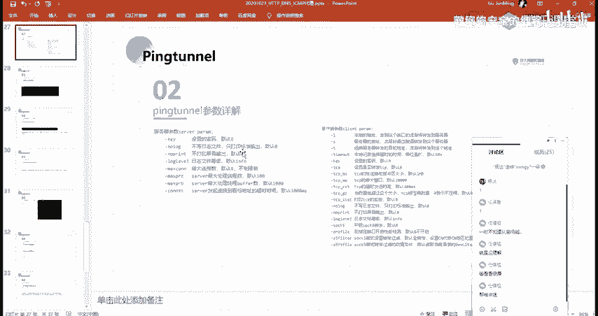

我这边的话。

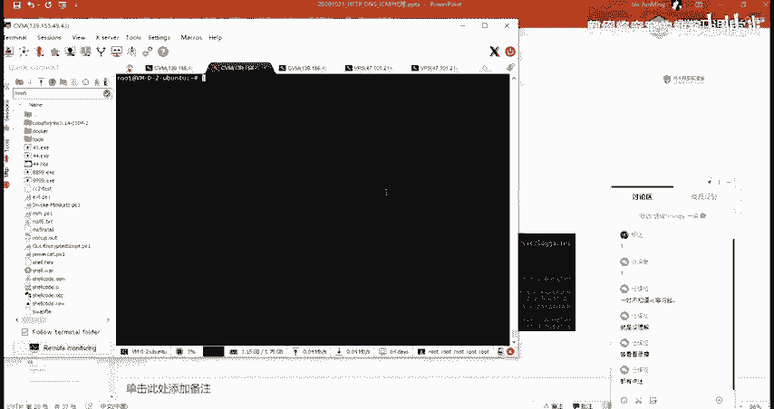

呃，太太忙了。就是这个。就是这个片区呢是这个。然后我们首先的话需要去通过那个评训老师。

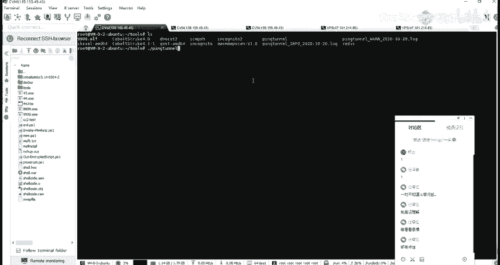

还去启动1个SMP隧道的一个服务端。然后启动的一个方法就是像这样子干片去了呃，其实他的你直接之前干片去了时候，他在这边他有中文英文的一个对照，就是选项的一个意思啊。

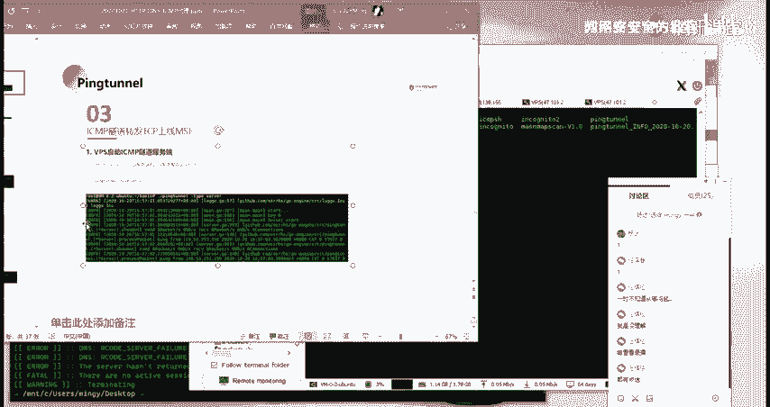

然后我们这边的话使用的一个方法就是g type。

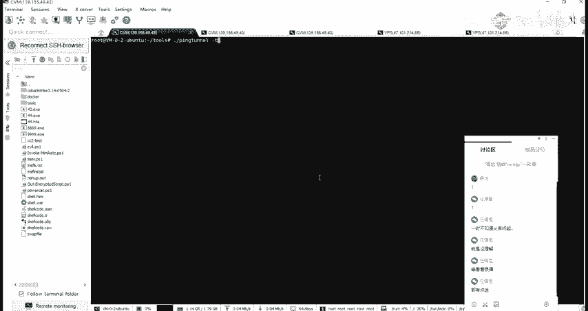

还去指定我们这边的一个。

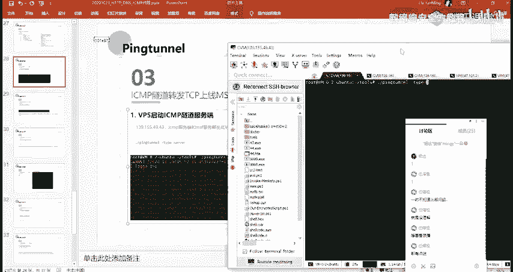

类型。类型的话，我这边的话就是12我，因为我是启动一个服务端嘛，对吧？然后如果说你是客户端的话，那么你干t指定的一个类型的话，就是服务端好吧，就是客户端。所以的话在这边其实看参数的话。

你会发现就是有服务服务参服务器的一个参数，对吧？还有客户端的一个参数。

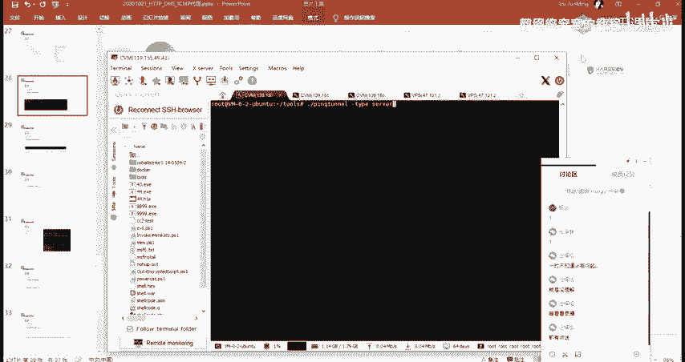

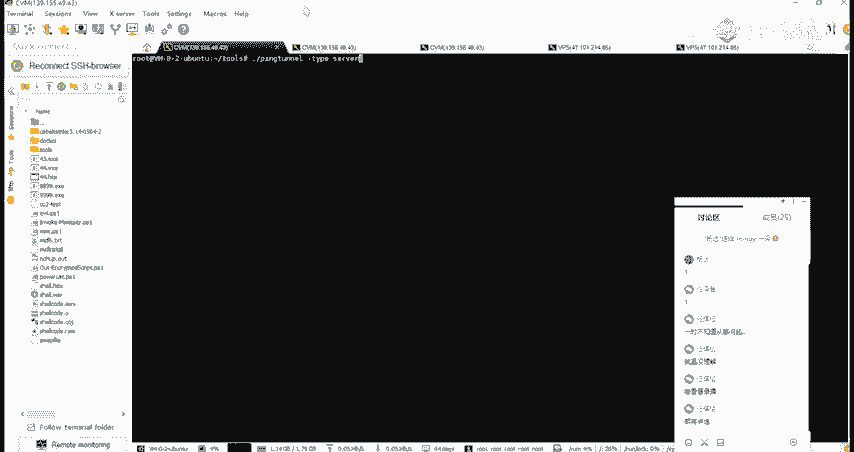

就是你呃如果你指定的一个类型，就干t，你指定是服务端，那么你可以使用这样子的一些参数，能够去有这样子的一些功能，对吧？那么如果是你是在客户端，你要去连接服务端，那么你可以使用这样子的一些参数。好，呃。

在这边启动之后的话，就是这样子的一个效果。

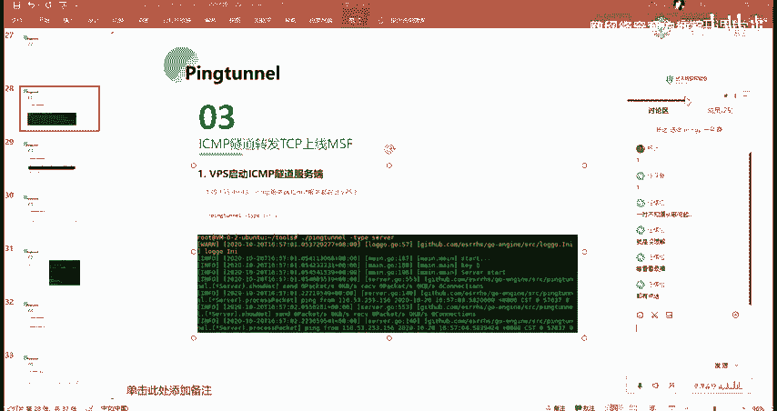

嗯。看。

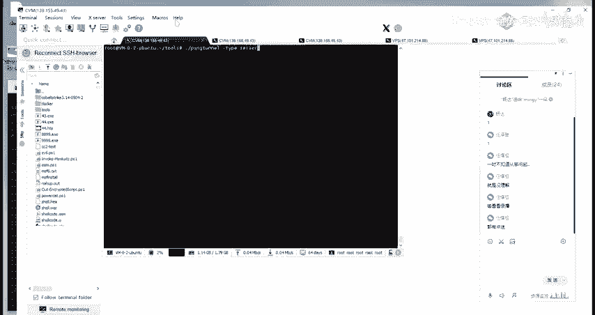

这边执行啊执行之后的话就是像这样子。当然的话在这边的话，因为呃我们可以看到就是他这边有这样子的。

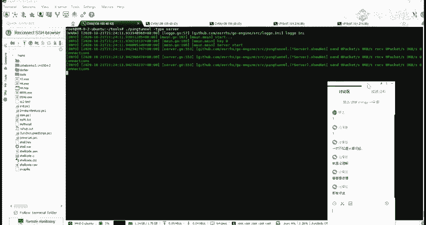

一些日志对吧？他在这边可以呃看到他是没有数据的一个传过来的对吧？就是您。然后呃这个时候我们来骗一下吧。我这边来骗一下这个IP。去。我这边平凉。听不通，我是禁掉了。好。先看后面的吧。

就是等会的话会有数据啊。这边的话暂时没有。然后这边服务端启动了对吧？然后我们再把这上面启动我们的一个客户端。启动客户端的话就是呃我这边的话是。那个机器是内。呃，这边我把它。

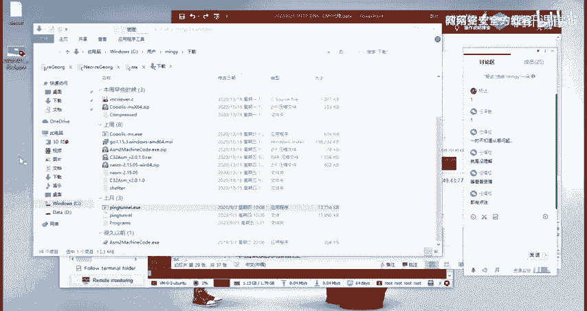

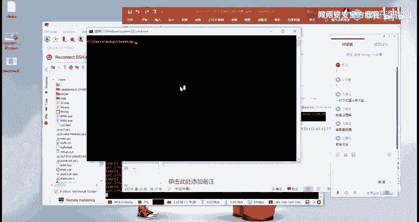

呃，客户端的一个启动面的话就像这样的，我这边我就不呃。不敲了，我直接复制粘贴。

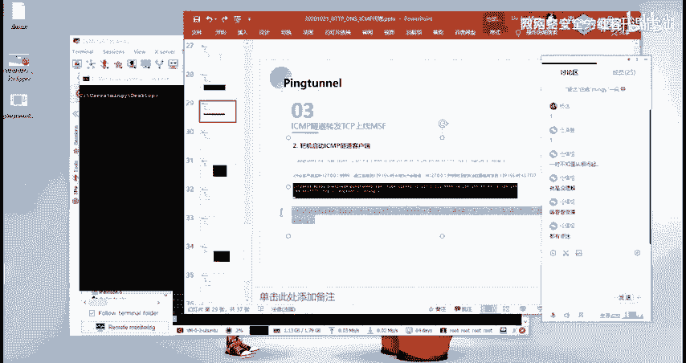

就，像这样子。这边执行之后的话呃执行之后的话，他会来去连接。我们这边的一个服务端，我们可以在服务端这边来看一下。然后你现在看的话，你就会发现它会一直有这样子的一个数据啊。

就是拼 from从我这边的这个IP这个的话就是我当前的一个公网的1个IP嘛。然后他来就是来骗了我这边，对吧？其实就是连接到我这边的一个服务端啊，服务端嘛，对吧？然后其实前面的话。

他是没有这样子的一些数据的对吧？因为没有没有经力连接。然后现在经理您接绍的话可以看到他就是隔一个的话，他就会有这样子的一个就是聘啊，有这样子的一个聘的一个请求啊。然后呃其实在这边的话。

就是大家如果不想看到这样子的这些日志的话，就我们可以通过这样子的一个方法，就是像在这边啊客户端对吧？我们可以通过加这样子的两个参数，就ganno print及gan log。

然后我们在这个话就看不到它的相关的这种就是连接的请求的一个日志啊。

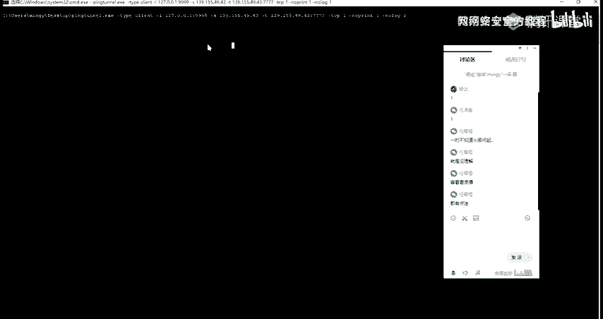

啊，呃，我们具体的来看一下这条命令上的一个意思啊。其实我这边PT话已经有详细的写了。

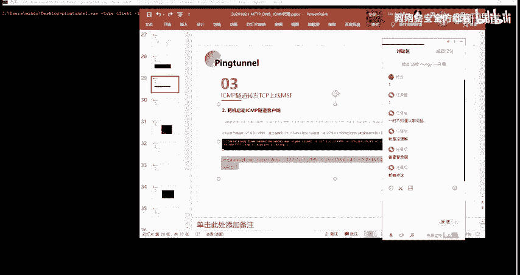

就是我们这边的一个客户端，他会去监听我们这边的一个呃这边的客户端，他会去监听本地的这样子的1个99999的一个端口，对吧？

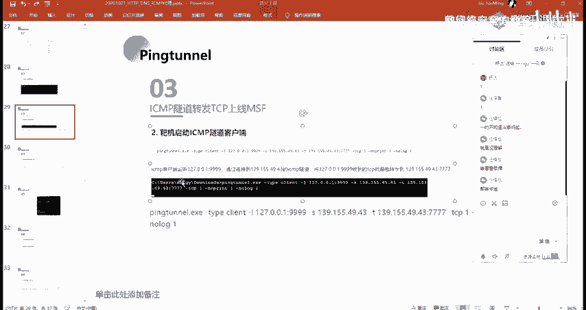

然后他今天这个端口之后的话，他会我们这边干S的话，就指定我们的一个pin server，也就是啊这个啊拼仓的隧道的这个服务端的IP。也就是呃我这边的这个IP。对吧就这边我服务到那个IP。

然后他会去进行一个连接，然后它连接之后，连接之后的话，杠7的话就是他会将我们这边所收到的这样子的一个呃从这个99999这个端口，说接收到了这样子的一个TCP的一个数据包，这边杠TCP的一个数据包。

把它给转到了我这边的这一个呃服务端的一个777的一个端口。然后呃这边杠TCP的这个选项的话，看PPT吧，这边有有说对吧？就杠TCP就是设置是否转化TCP就默认为零的话，就是它是关闭的。

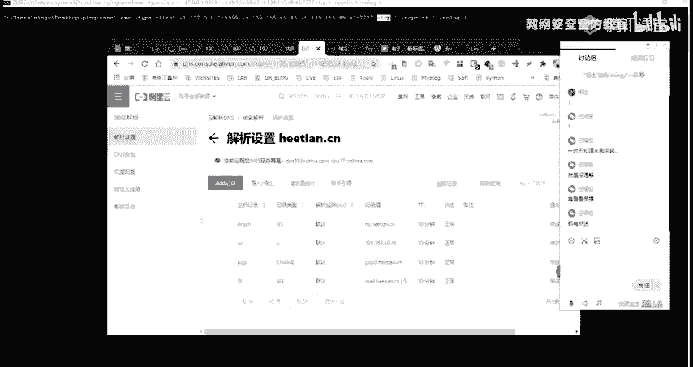

然后的话你要去启用它转换TCP的话，那么你要干TCP指定为一。

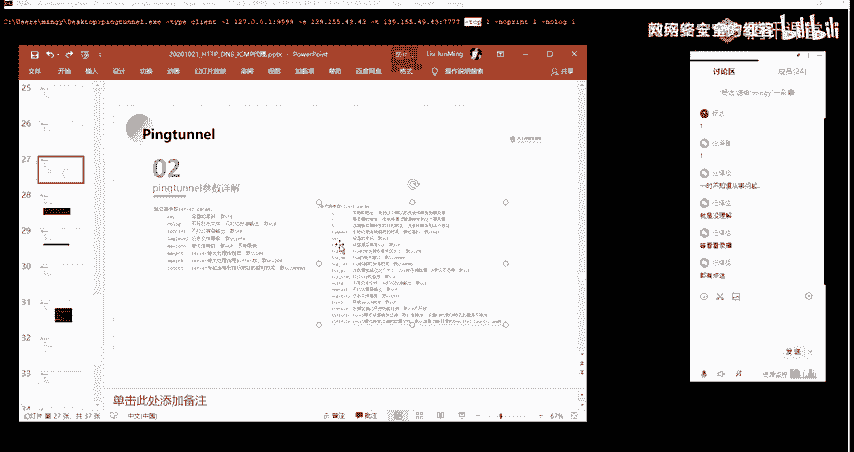

同理还有其他的这些参数都是这样子的。就默认的话，它是都是关闭的。然后你要启用的话，就是这一个选项后面接一个一，就是启用。嗯。那么在这边我们建行连接之后，对吧？我们要如何去得到需要？

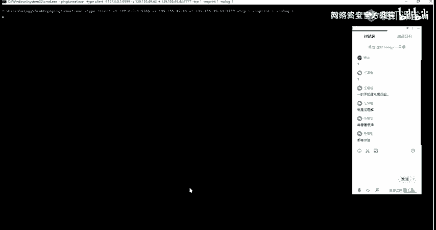

得到需要的话呃，在这的话，我们通过MSF的一个方法。就首先的话，我们MSF新式生成一个法他需要的一个配load的。

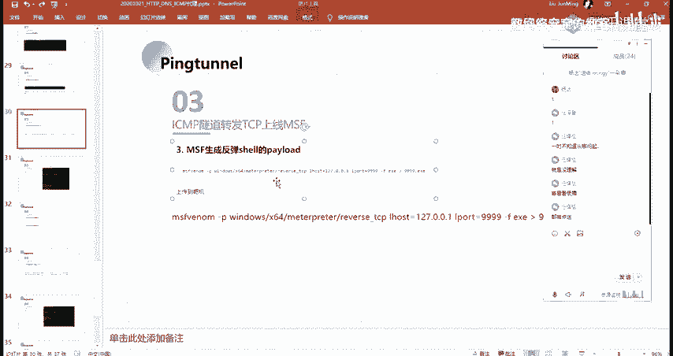

然后这个payload的话，它生成的话跟我们前面生成它是有区别的，要注意啊。

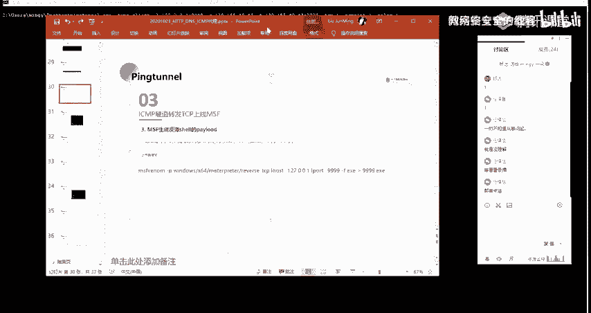

可以看到它的一个不同的一个地方的话，就是我们这边指定的一个oppost，也就是我们这边生成的这个payload这个ES的一个程序，对吧？它去连接的1个IP及端口。

它是我本地的这样子的一个IP以及这边的1个99999的一个端口。那么这边它生成的这1个EXE程序对吧？它有什么用呢？也就是因为在这边的话，它是去反弹一个线，对吧？而我们这边生成了一个配漏的。

就是指接那个配漏的是1个TCP的。

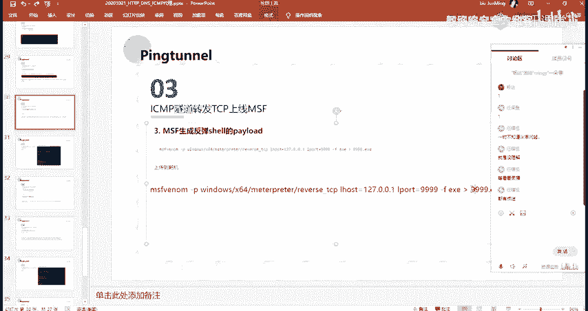

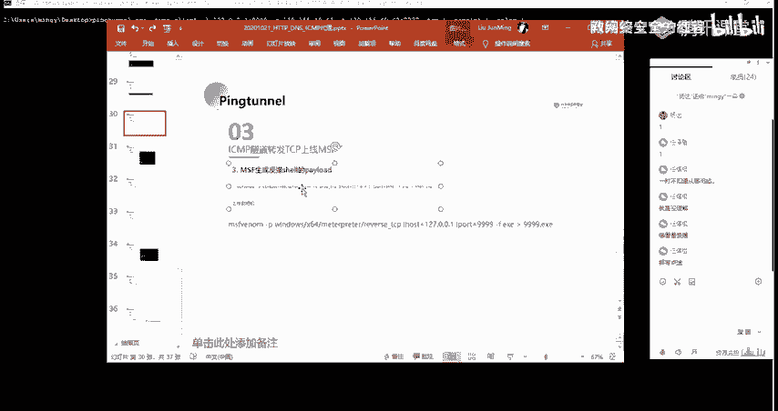

然后我们在这边生成的这样子的一个paload，它执行它在这边。

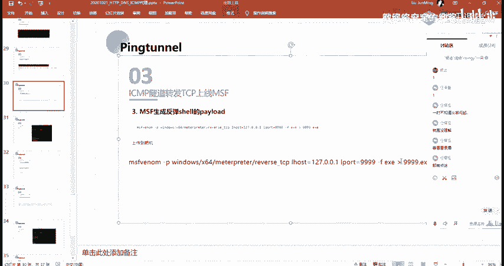

目标机器上面它执行之后对吧？执行之后的话，它其实是1个TCP的一个前奏。然后我们这边的这个环境的话，如果说你要去。

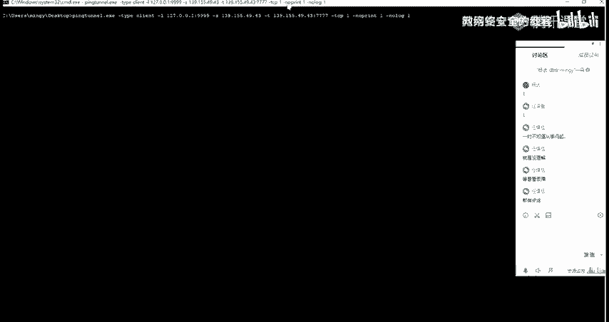

如果说你这边你要去连接的1个IP的话，是我外网的1个MSF服务器的一个IP以及端口的话，那么它是1个TCP的一个请求连接。而后我当前的这个环境的话，它是不允许TCPUDP的这种协议的一个传输的。

那么所以的话我这边执行就就是在目标机上面执行之后，也不会有也不会跟我们的一个服务端去建立连接。因为它的一个请求，它根本就是发送不出去。所以在这边的话，我们生成这一个的话。

它其实是像就我们的一个TCP的一个请求，它是其实是发送到了我们这边的一个99999的一个端口。那么这边这1个9999端口的话，就其实就是我们这边的1个ICMP隧道的这个所今天的这一个端口。

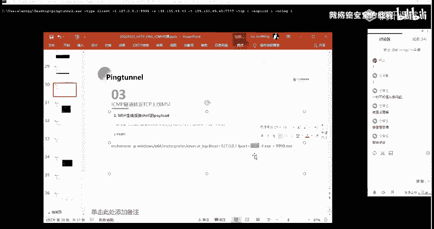

那么最后的一个结果的话，就是我这边执行。

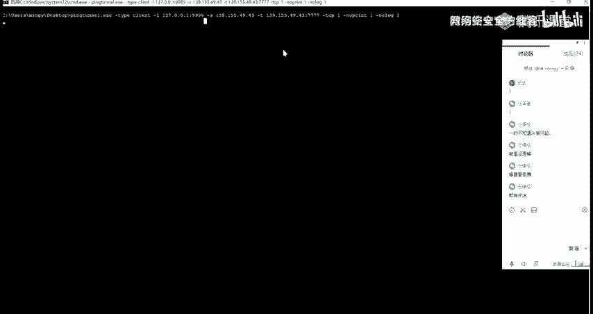

执行的一个程序执行之后的话，他的1个TCP的一个请求对吧，他会去连接这边的1个9999的一个端口。

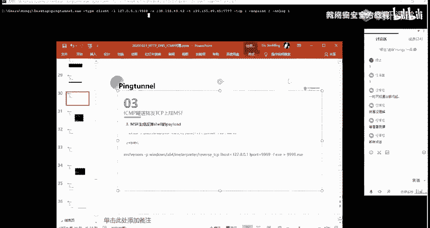

然后这边的一个呃，因为我们在这边它通过这个平仓的建业了这样子这个SMP的一个隧倒。然后他会把这边来自9999这个端口的1个TCP的一个连接请求，它会转到这边的。对你的这1个IP以及它的一个端口。

然后这边的1个IP一些端口的话，其实就是我们要去呃就是我们的1个MSF服务端所在的一个端口。也就是等待客户端来去连接的这样子的1个IP以及端口。那么我们呃具体的来看一下直接的一个操作。我这边的话。

我这边重新来一下，就是。不要这些日子了。他一直在刷有点多了。

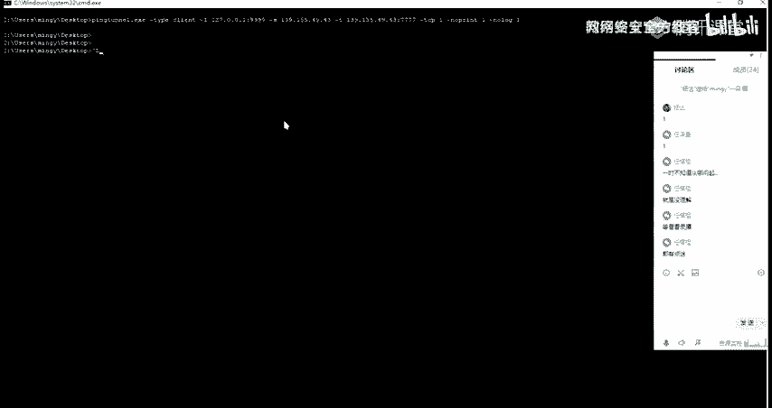

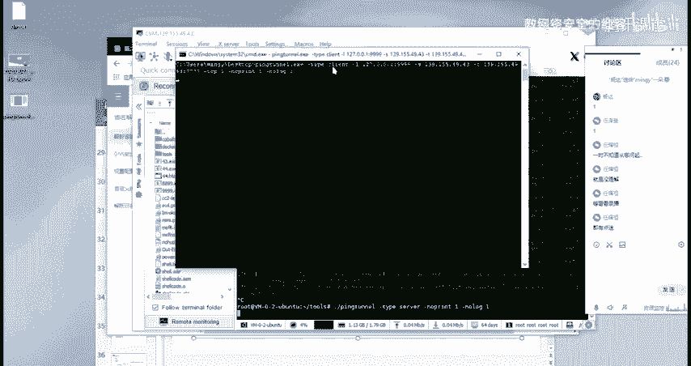

然呃现在的话就没有这一些这一些日志了，对吧？没有这些日志以及信相关的一个信息了。然后我在这边的话呃。

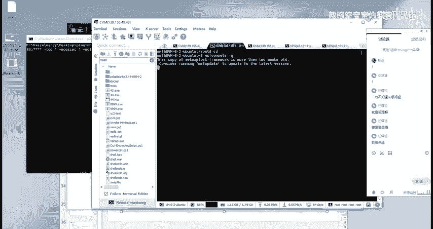

在这边的话呃，我这边的这一个服务器的话，有1个MSF的一个呃框架。嗯。啊呃，我们要去。首先的话第一步的话，我们需要去生成这样子的一个payload。

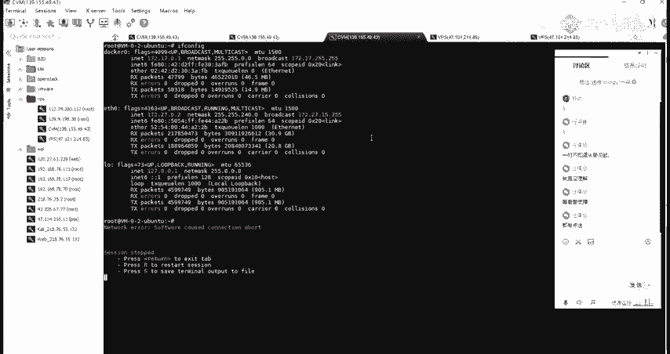

这边我直接复制啊，强。嗯。Yeah。Okay的。嗯。

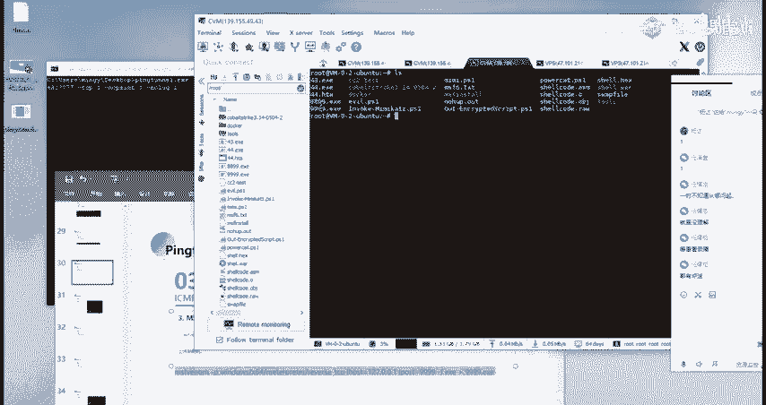

我这边已经有了，我看一下，我这不生成了吧。哦，本地应该是有的。所。啊这里就这1个9999。Yeah。没有。

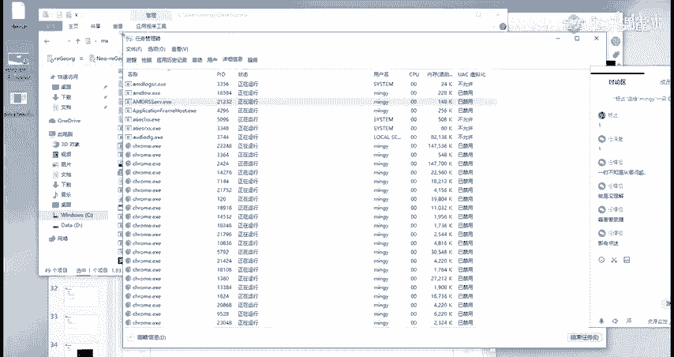

然后呃我们生成了这一个生成了这样子的一个配load的，对吧？我们上传到我们的一个目标机器上面去，然后的话执行。执行的话，我们这边。执行之后对吧？执行之后的话。嗯，好，我这边MSF你看没今天了。

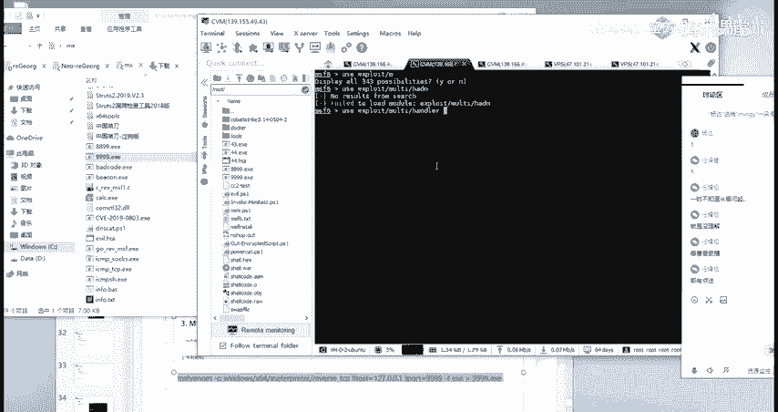

嗯，我这边是开放的是情。这是我们的一个配照的。然后的话这是我们的一个。A host。以及端口是我们的这样的outport，我们这边的一个端口的话，其实是呃这边。

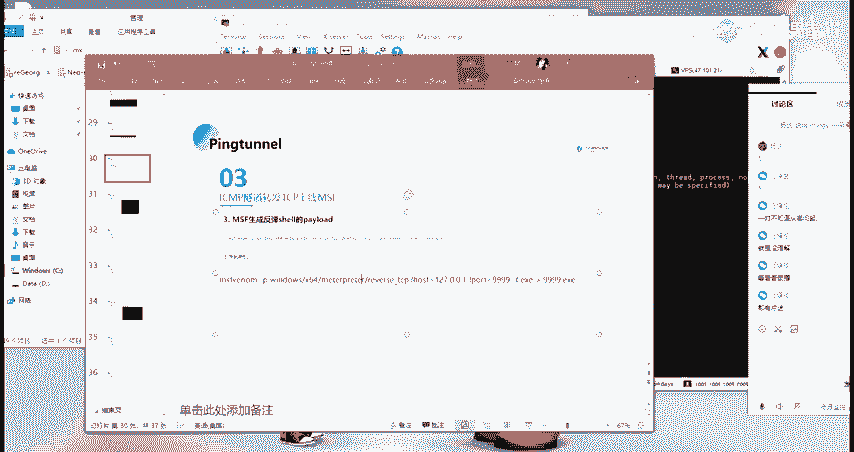

啊，就是我们这边客户端。这边客户端对吧？他会把我们的个PCP的那个请求它的。

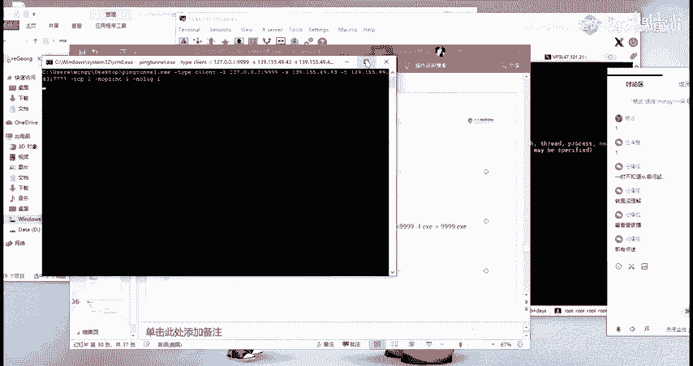

转到我们这边的1个VPS的这个IP的这个端口。所以的话我们只需要去监听这1个777的一个端口，那么我们就能够去。

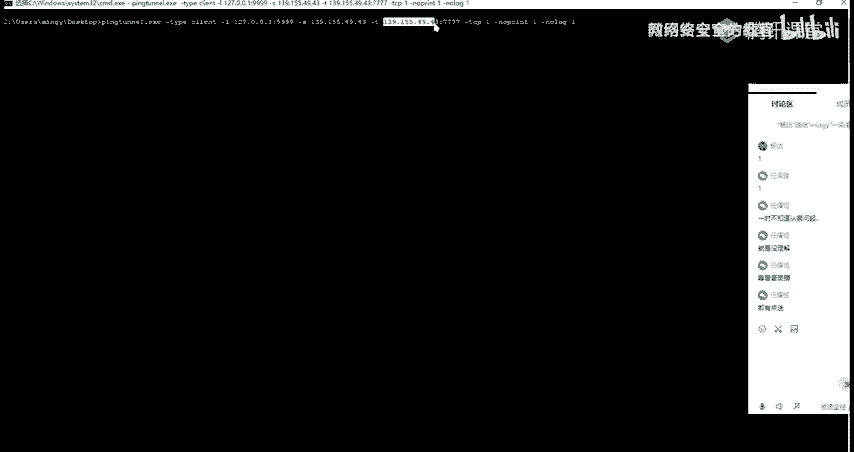

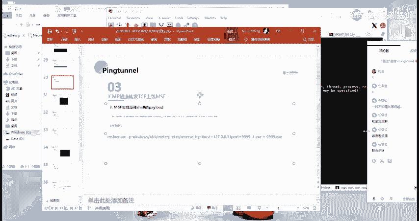

接接收到来自呃客户端的这样子1个TCP的一个连接请求。

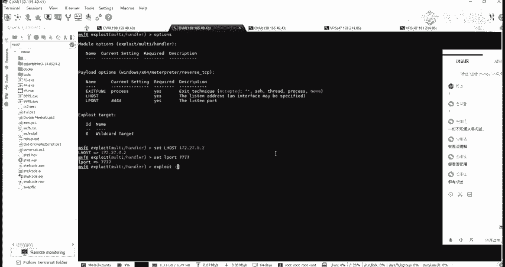

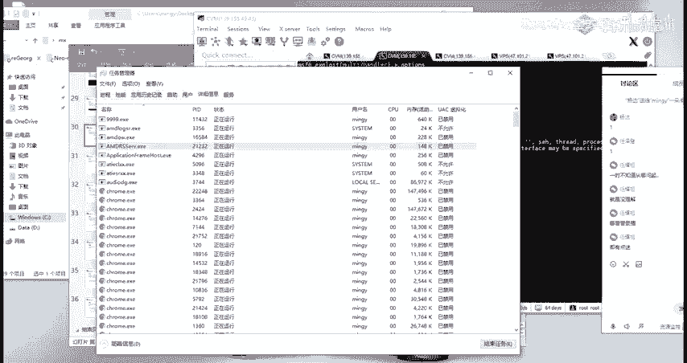

然后可以看到对吧？在这个的话就直接的建立了这样子的一个筛选一啊。对吧。我们可以看到呃，因为我当前同是已经呃执行了，执行了之后的话，它的一个临件的一个请求，它会发到这一个端口。

发到这边的1个999的一个端口，然后的话通过这边的一个pin，通过我这边的一个拼 server。

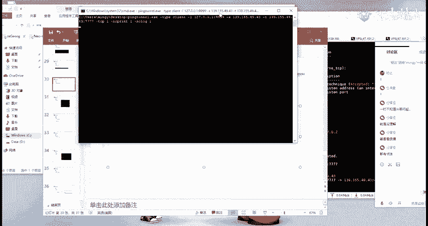

然后他会把这样子的一个临件的一个请求，他会发到这边来。发到这边来的话，他会做一个转发，然后的话转发到这边的。这个IP这这1个IP的话。

其实你可以就是因为我当前的话是这个拼 server跟我这个MSS的一个服务器都在同一个。都都是同一个服务器嘛，所以的话都是同样的对。然后这句话就是。

转到了这个端口，然后的话这个端口的话就是我们MSF所机天的一个端口。对吧然后的话就得到了他的一个。来看一下对吧，是我当前的一个主机。听年话。

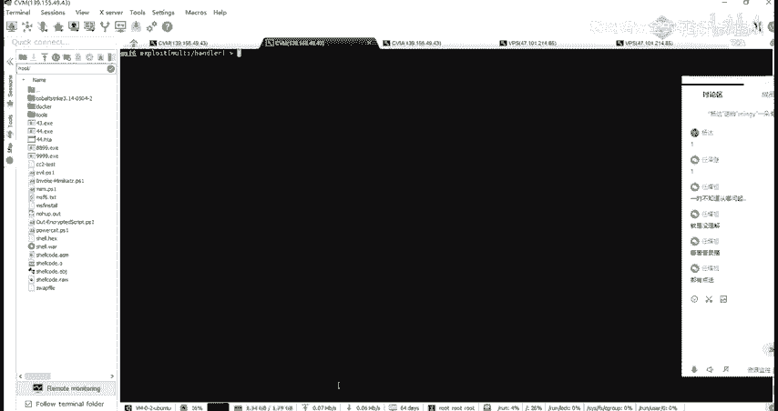

停亮了。Okay。这个的话就是呃第一个就是通过SNP隧道来去转发我们的1个TSP的一个这种请求的一个连接。然后的话上线到我MSSF。然，结果的话最要的结果的话就是像这样子。

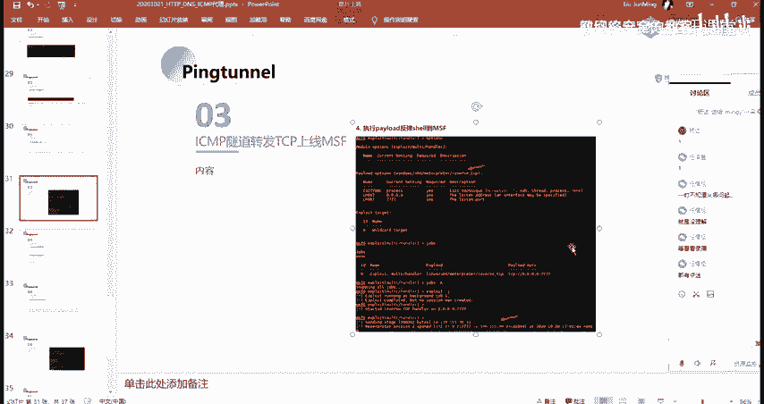