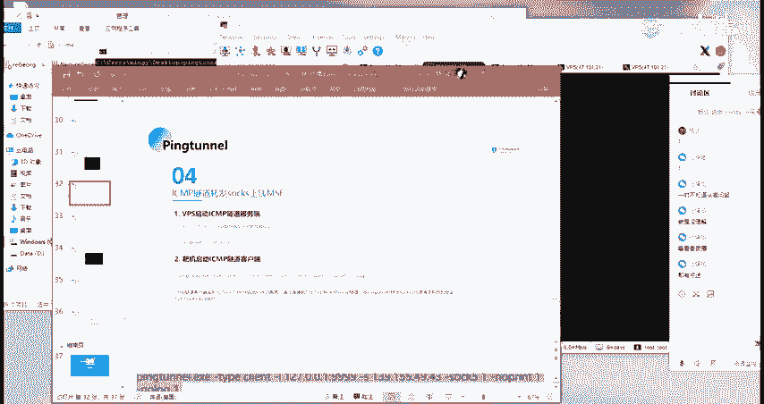
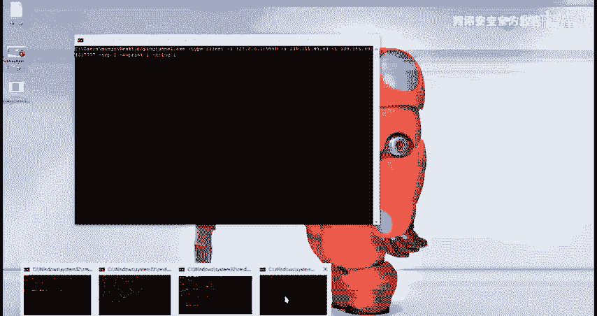
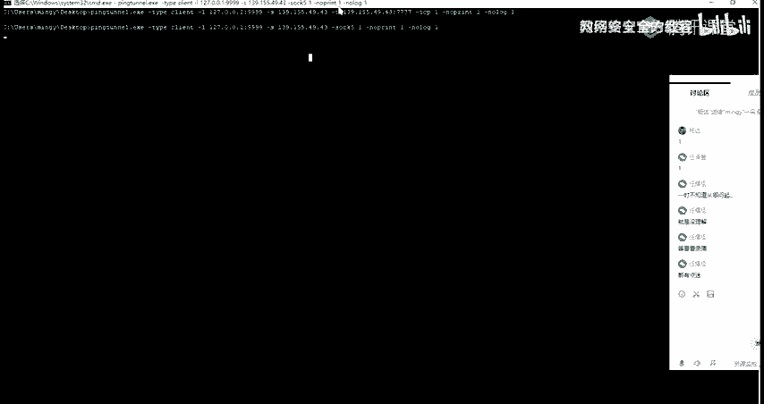
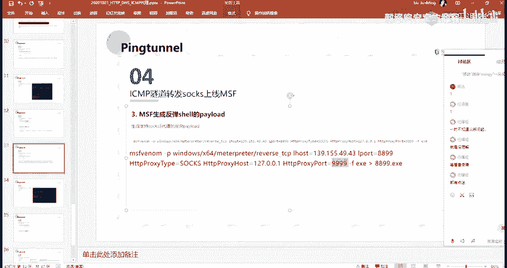
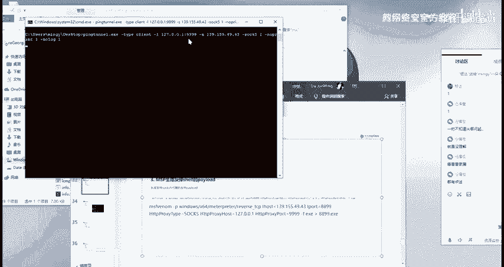
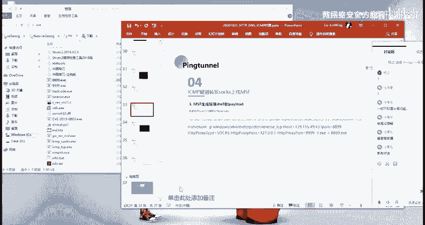
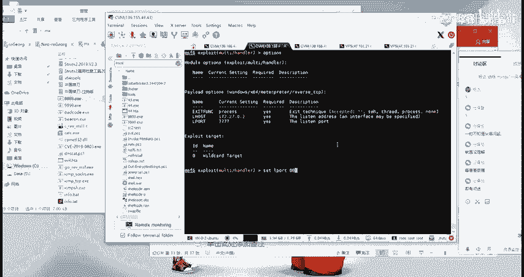
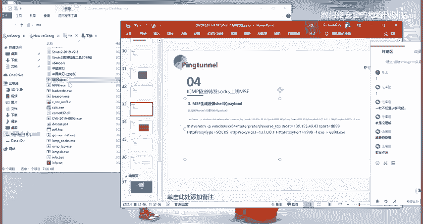
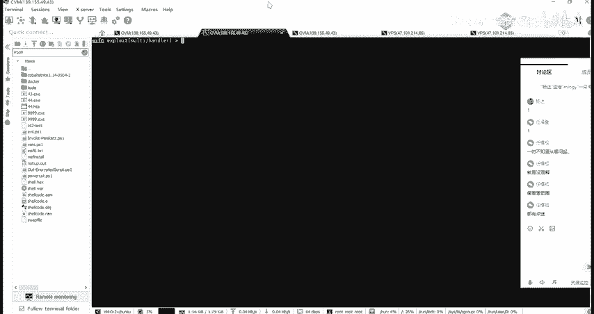
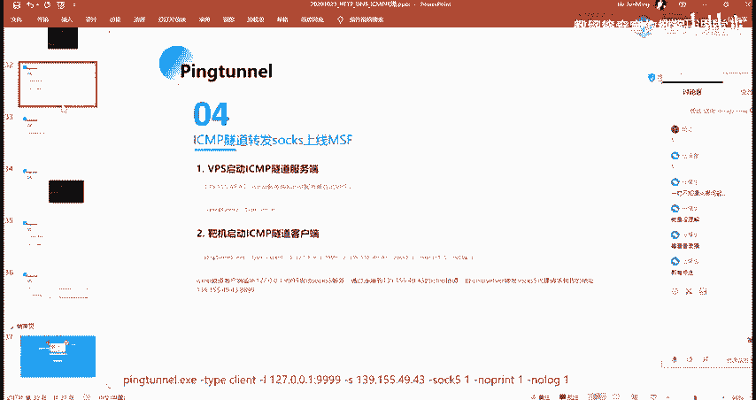

# 2024网络安全系统教程！清华大佬花159小时讲完的网络安全系统课！别再盲目自学了，学完即可就业！零基础入门网络安全！（渗透测试／漏洞挖掘／CTF／黑客技术） - P82：69.ICMP隧道转发socks上线MSF.mp4 - 教网络安全的红客 - BV1ft421A7Nj

然后第二个的话就是SMP的一个隧道来去转发我们的一个stocks。还去上线。然后呃我们知道说是他其实呃。也是通过TCP的个那个。请求的一个协议对吧？然后的话在这边的话呃，他的这一个利用的一个方法的话。

就是主要的话就是在这边的话，它会有一个不同的一个地方。就是我们在这边去生成这个payload的时候，跟我们前面去生成配load的话呃，有很大的不一样。

因为我们这边要去实现的一个目的是呃通过ss的一个方式来去转发我们的一个socks的一个这样子的一个呃，就是通过ss代理的一个方式来去转发我们这边的一个请求。呃，然后首先第一步的话都是一样的。

就是启动我们的一个服务端。然后启动之后的话，我们的一个把机要启动我们的一个客户端。这边的启动客户端的话呃，跟前面的话，它的一个不同的一个地方啊，就是这边多了这个干ss的一个参数。

这边的这个干索齿的一个参数啊，就是启用我们的一个说s的这样子的一个呃，看一下。开启我们的一个双五的一个转化。啊，我们在这边嗯。我们在这边执行之后对吧？执行之后的话，他做了什么呢？

就是我们这边的一个客户端，他会今听我们本地的1个99999的一个端口。然后这个端口的话，它其实就是启动了一个ss5的一个服务。然后这个ss5的一个服务的话，它会等待就是我们的一个呃我们的一个配load。

也就是我们在这边所生成的这个配load的一个连接。然后在这边的话就是呃。如果这边这边的一个payload，他连接到了我们这边的一个客户s的一个服务端之后，对吧？连接之后的话，他会把他的这样子的一个请求。

他会通过这边的1个SMP的一个隧道来转发到就是转发我们这边的一个s的一个代理的一个请求到目的地址。这边目的地址的话就是这个我这边的一个呃MSFMSF服务端的呃8899的1个端口。

然后这边的1个8899端口的话，其实就是我这边。我这边MSF所生成的这个配漏的话。他去进行的一个连接的话，他的一个呃IP以及端口就是我们这边所设设置的。然后呃我们来具体的来看一下。

首先的话我们把机启动我们那一个客户端啊，我这边。这边复制一下。嗯。把机执行的一个命令的话，就是这里。这一个。啊，不是。嗯。这一个。嗯。77882。899啊。岗位。😔，啊呃。

因为我这边的话，这边的一个服务端的话已经起来了，对吧？然后我这边的一个客户端的话是在。

真里。啊，我执行。启动我的一个客户端。启动之后的话，它会在本地去今听这一个端口对吧？然后它不仅今天了一个端口，而且它开启了一个说持的一个服务端，就是它是在这一个端口。然后这边开启之后的话。

我这边通过MSF生成了这样子的一个payload。

呃，在这边的话，我们来看一下这边的一个生成的一个密量。就是首先的话就是指定这个payload的嘛，就是跟前面是一样的对吧？好，我们那个 host要注意的话是指定不是像我们前面指定本地。

而是指定我们这边的这一个呃这边的这一个MSF服务端，就是这边MSF服务所今天的这所今天的这样子的一个端口，啊这样子的一个IP以及它对应的一个端口。然后的话在这边的话有多了这样子的三个参数。

就这个HVpro type以及还有host，还有port。其实从字面意思的话，我们也能够知道就是在生成这个payload的时候，它指定了这样子的一个呃s的一个代理类型，然后它的一个连接的1个IP。

就是他生成的这一个pa，它会去连通过ss的一个通道去连接这边的1个IP及端口。

然后这边的1个IP端口的话，其实就是我们这边通过这个拼仓的说今天的这个ss服务端所在所在的一个端口，对吧？然后在这边客户端它执行之后的话，它就会与我这边的一个索s的一个服务端进行连接。

然后的话我的一个请求的话，他就会去呃通过这边的一个连接。它会通过我们这边的1个SNP的一个隧道，把它给转到我们这边的一个IP以及对应的一个端口上面去。

我这个的话我就不重新那个了，我这边已经呃也生成了这样子的一个。我就不再重新去生成了。然后我这边只在他们S府上面做一个监听。

就是设置我们的一个upport的话是。8899。

行，今天这1个899的1个端口。然后今天之后的话，我再进行执行，执行这1个8899。

然后我们看这边。你看到我这边执行之后的话，他立马的话就得到了这样子一个序。对吧。就是一个筛选啊。这是第二个。

就其实他的一个呃他的一个使用的这样子的一个方法，跟前面的第一个其实是类似的对吧？你会发现。然后只是的话，他的一个在这边的话跟前面的不同的地方的话就是呃他转发的是我们的一个s的一个这样子的一个请求啊。

不s的这样子的一个代念。

