# 2024网络安全系统教程！清华大佬花159小时讲完的网络安全系统课！别再盲目自学了，学完即可就业！零基础入门网络安全！（渗透测试／漏洞挖掘／CTF／黑客技术） - P83：70.ICMP隧道转发TCP上线CS.mp4 - 教网络安全的红客 - BV1ft421A7Nj

然后呃第三个的话就是这个SMP隧道转发。

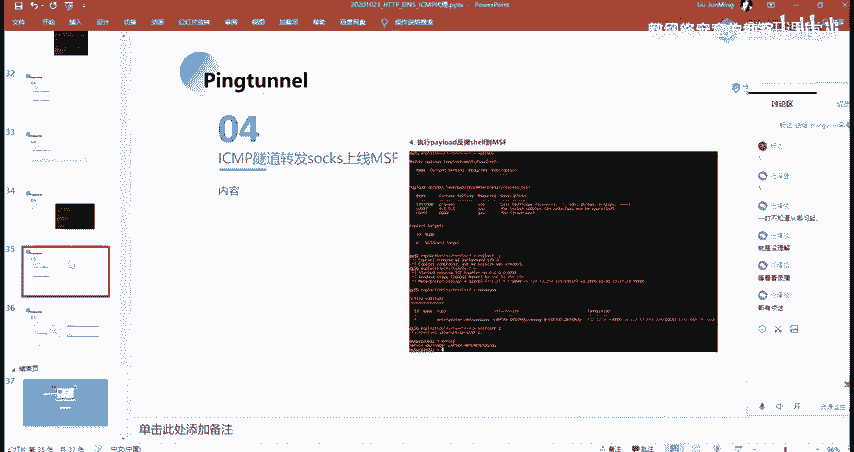

呃。转发GCP上线CS就其实CS跟MSF的话都是类似的吧，对吧？然后呃具体的一个的话，我这边就是列出来，他就是给大家作为一个例子嘛，就是大家再去碰到这个，对吧？你想要转到CS就转CS嘛。

你想就你哪个用的顺手的话，你就呃转哪个嘛。然后呃在这边的话，它的一个步骤的话跟前面其实类似啊，就是启动服务端。然后的话把机启动客户端。启动客户端的话在这边的话呃，它的一个配置的话也是类似的。

那命令的话是一样的。同样的开启TCHTCP的一个转发。然后。不同的话就是在CS客户端上面的一个配置啊，服务端的一个配置。我们首先需要去创建这样子一个lister，就是一个今听器。

创建的这个今听器的话就是呃。

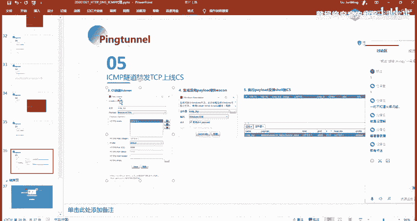

它的一个配置的话就是像这样子，就是我们的1个HPPS的一个house。注意的话是选择我们的一个本地以及这边的一个。都是我们的1个127。0。0。1啊。然后还有的话就是这边的呃HP的一个port。

以及我们的就是CI的一个port，以及班德的一个port。呃，关于这两个的话，在这边有解释。就是host还有port的话，就CI的一个port的话，就是我们SMP隧道这个客户端所今天的1个IP及端口。

也就是我们的1个CI的一个连接的话，它会呃。他会就是连接到我们这边的1个8899的一个端口，对吧？然后的话呃这个port这个办的话就是为转发的一个目的地址的一个端口。

然后在这边他建议了他与我们这边他连接到了我这边的1个8899的一个端口之后的话，我们做一个转发，把它转发到我的1个777的一个端口。然后这边的1个77的一个端口的话，其实就是我这边的一个呃。

今天器的一个那个。就是接受希尔的这样子的一个端口。因为我们在这边呃。没问题啊。然后的话我们需要去生成这样的一个反向配漏的。

然后这边拍load的话就是呃minux啊不window上面的话就生成这样子1个EXE嘛，对吧？然后我这边64的话就是勾选这个64的1个Pod。然后生成之后的话，我们执行执行之后的话就能够去得到这一个选。

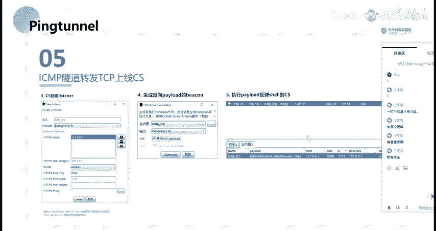

呃，这边的话。

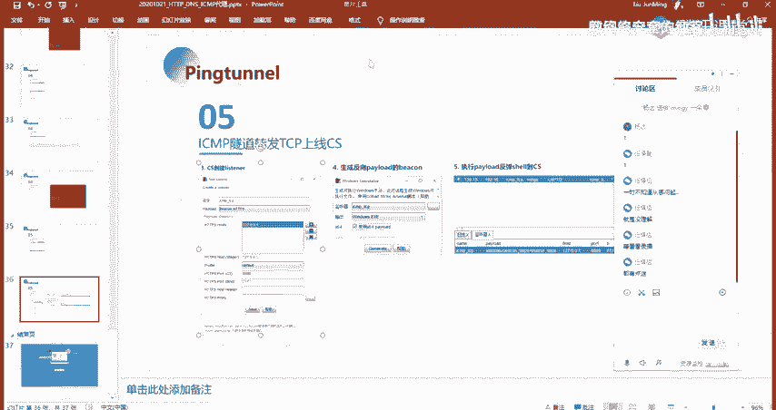

看一下我这边生成的是在哪。嗯。拿出来。不行苦。

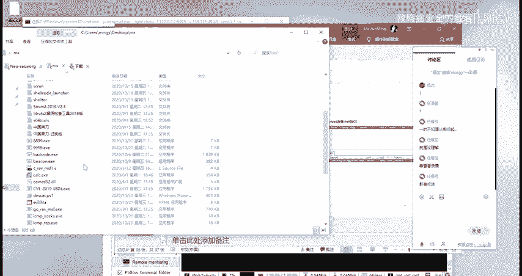

搞忘了，是成呃，这边。这边还需要我去操作吗？那呃，要不大家自己客户去操作吧，好吧。就作为一个课后作业。

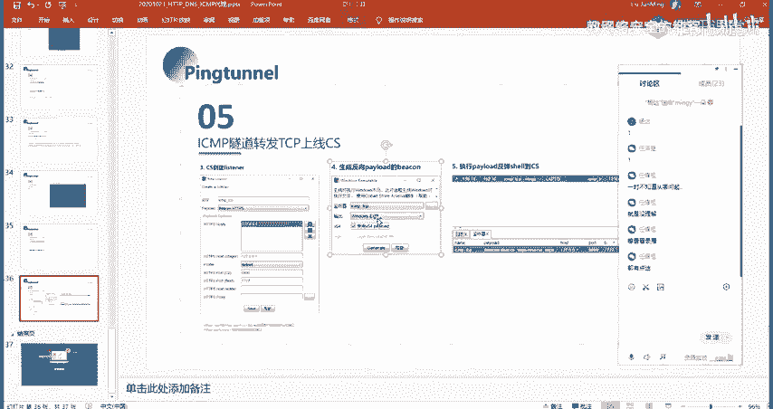

因为我这边的话呃，包括截图啊，以及命令的话都已经给给出来了。对，都已经都已经详细的给出来了，对吧？

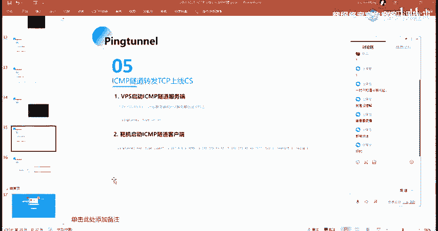

应该没有什么问题啊。

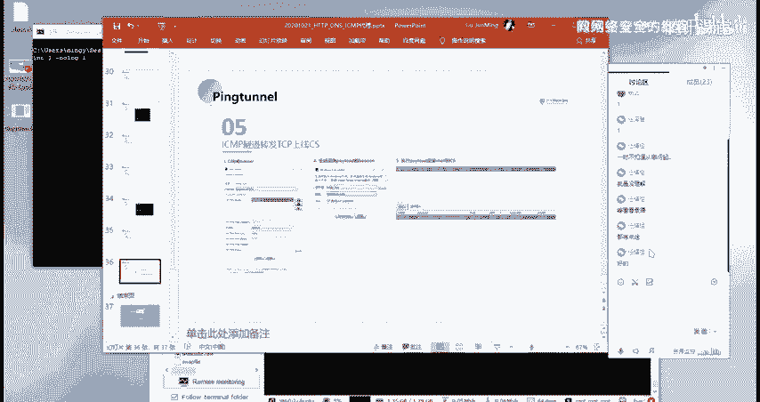

大家呃以上的话就是我们本节课的所有内容啊，大家有没有什么问题啊？没有问题的话，那么我们本节课的话就到这边就结束了。

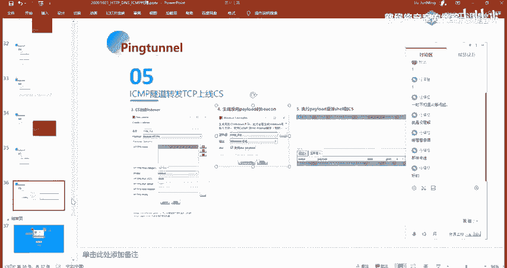

呃，有问题的呃，没问题的扣1，有问题的扣2，然后呃自己扣后去做的扣3。🤧OK呃，那应该都是就暂时先没没有什么问题了啊。然后的话大家自己课后去尝试吧。然后课后作业的话就是把我PPT上面的这一些内容的话。

都呃自己动手去操作一下，好吧。因为这些东西的话都是需要你自己去操作的。然后还有就是关于这个DDNSca的这个，如果你没有域名的话，你可能你做不了，对吧？

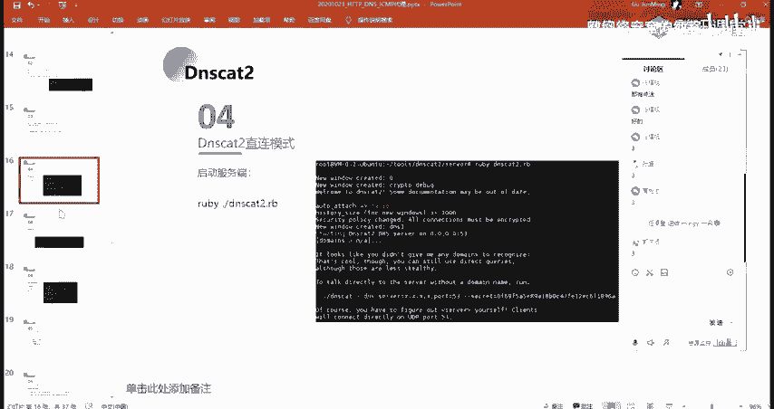

就这一个的话就呃这一个的话，如果你没有运营的话，你可能做不了的话，就呃。

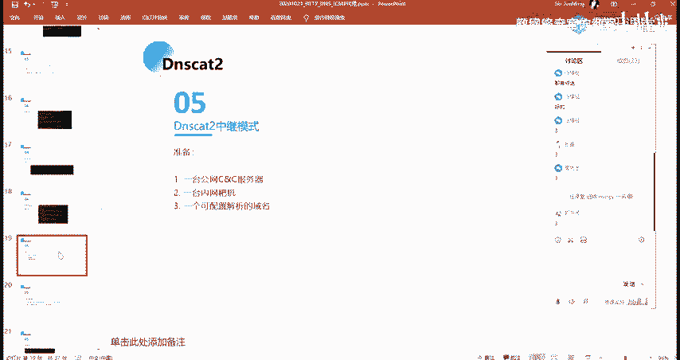

就不硬性要求你们那个吧。当然的话如果你想做的话，那么你可以自己去买一个域名。当然的话你呃就是你在国内域名的话都要备案的。

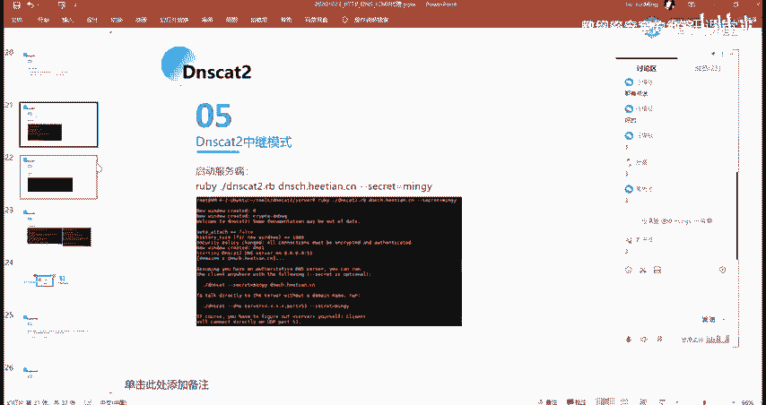

就比较麻烦吧，就。

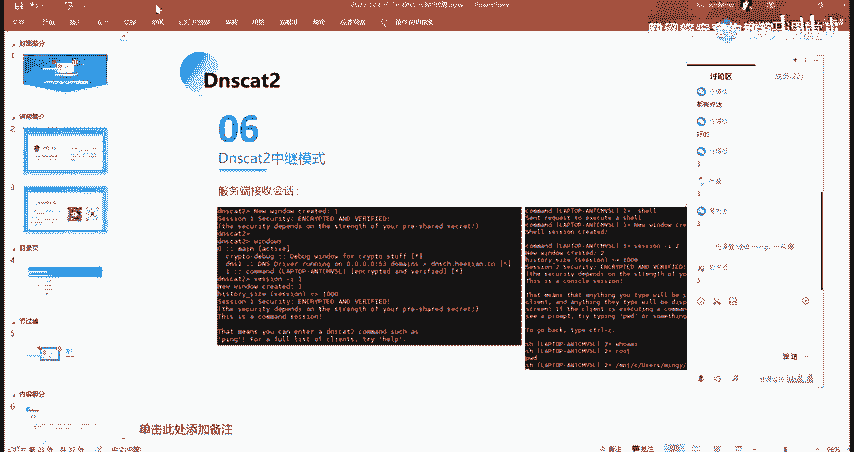

好吧。好呃，那么本期课的内容话就到这边就结束了，大家早点休息。好吧，有问题的话，呃，明天问我吧。

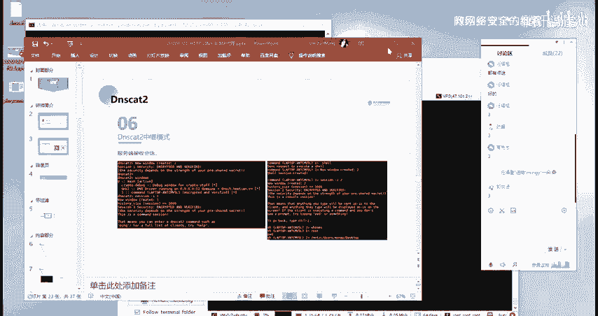

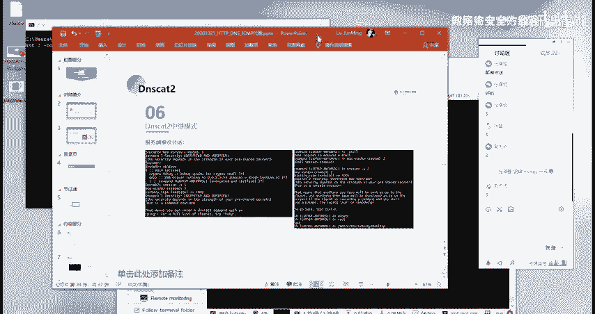

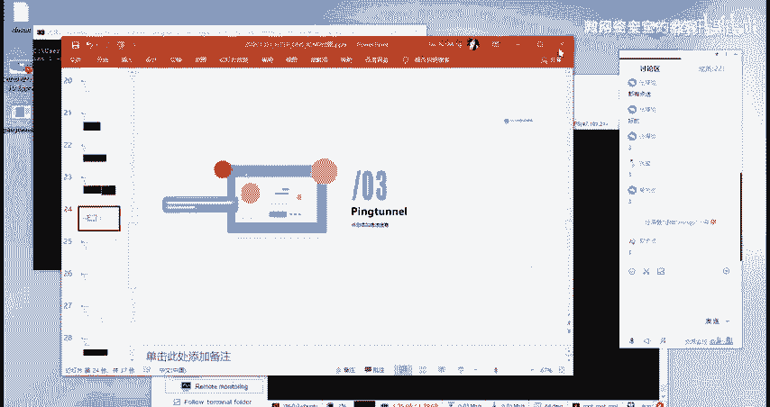

好，大家呃下课。