# 2024网络安全系统教程！清华大佬花159小时讲完的网络安全系统课！别再盲目自学了，学完即可就业！零基础入门网络安全！（渗透测试／漏洞挖掘／CTF／黑客技术） - P84：71.常见提权工具.mp4 - 教网络安全的红客 - BV1ft421A7Nj

呃呃，下面第五个的话就是提全工具脚本。在这的话其实就是给大家介绍一下，就是常用一些常用的一些提全的一些工具以及脚本。首先呃在这边的话就是给大家介绍了介绍这一个呃roten potato，这个就烂土豆。

就是它的一个呃别名的话就是烂土豆。然后呃这一个工具的话用于提全的话是用的比较多的一个提全的一个工具啊。然后他的他的一个作用的话，他可以将我们的一个服务账号。去做一个本地提群。

然后提全到我们的一个sem的一个账号。然后通常我们的一个用法的话，就是我们通过这边得到得到这个信，对吧？我们通过前面像比如说MSMSF所得到一个谢，我们得到这个谢之后的话。

我们可以通过上传这样子的一个工具上传到目标机上面去，然后的话去执行，对吧？然后执行的话，我们执行之后的话，我们可以尝试。就如果说它存在相对应的这样子的一些提权漏洞，是吧？

那么我们就有可能把它提全到一个stem的一个用户。然后在这边的话，就是你提全之后的话，他其实会有这样子的一个啊。东西啊就是有这样子的一个ta。就我们在去咨询之后的话。

他其实会就是说在当前的这一个系统下面，它会有生成这样子的一个token。这个token的话就是我们的一个s systemem呃权限的这样子的一个token。

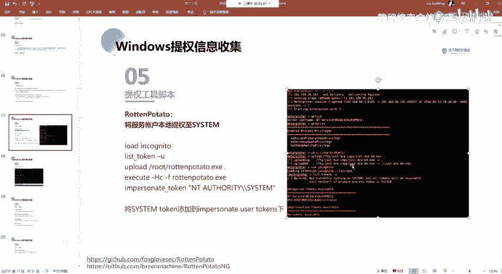

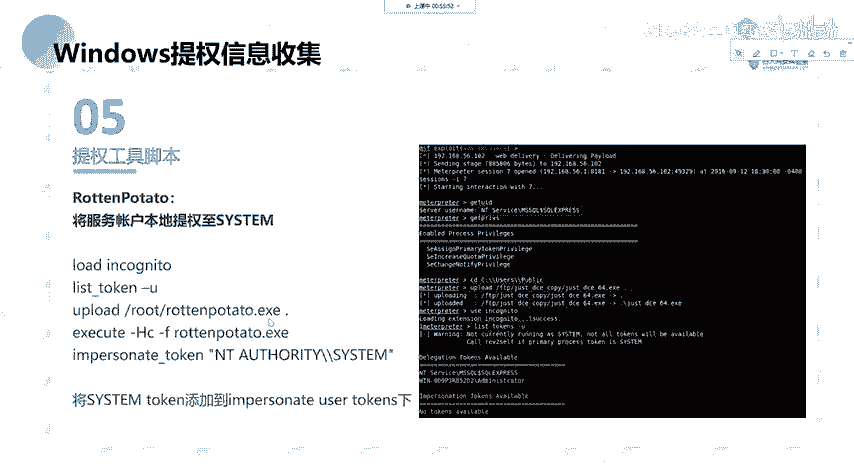

关于这一个拖肯的话呃。

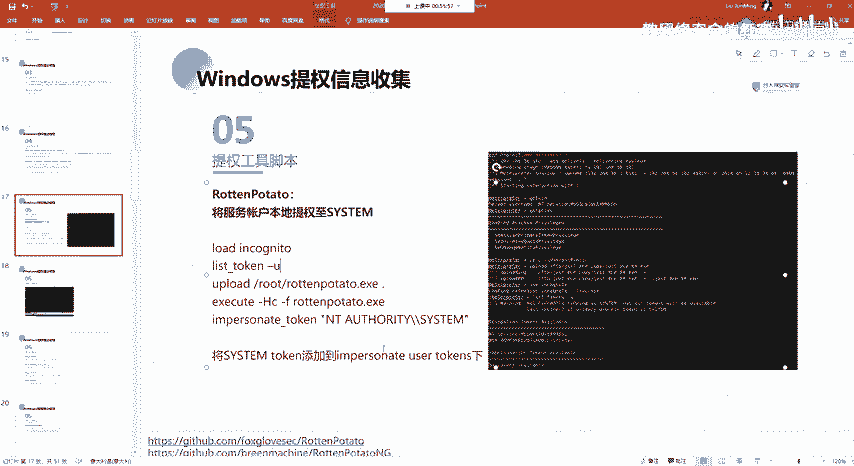

大家看预习内容吧。

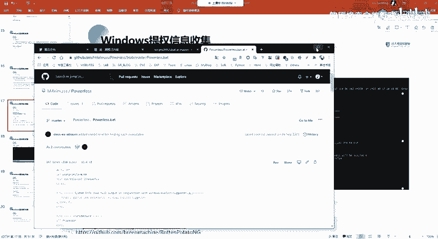

前呃后面应该会讲。然后这边的话我也放到这边了，就是这个token的一个窃取利用。

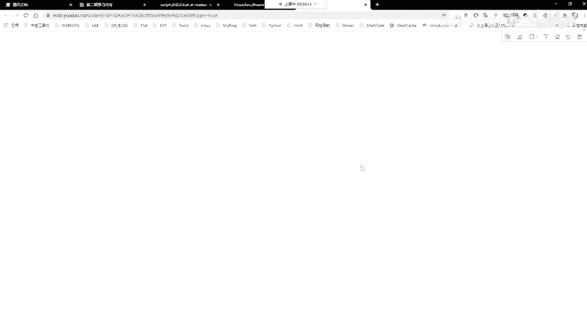

大家呃可以自己去尝试。Yeah。呃，在这话，我是看的这个就是。

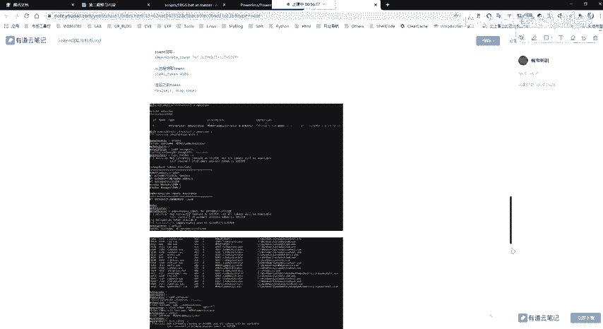

上级student这位大佬的这个文章，然后的话我自己尝试，然后写了笔记。就关于这个 talkingken切取你容。然后在这边的话有就是列出了就是windows平台啊，MSF啊下面的它也有这样子一个工具。

以及通过抛脚本的一个方式来去进行相应的一个操作。

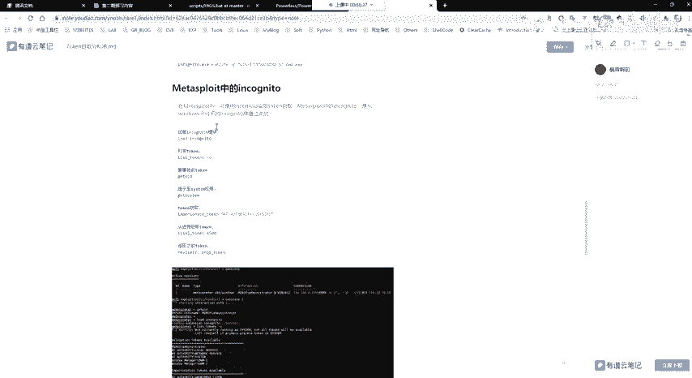

好呃，在这边的话呃，大概介绍一下吧，后面。后面。嗯，后面可能。啊，其实这一个token窃取利用的话，其实大家看这篇文章，然后自己去操作一下，应该就理解了。然，大概的介绍一下。

就是windows下面的话有两种类型的一个token，就是我刚刚所说的这样子的一个token。就token的话，它有这样的两种授权令牌，有模拟令牌。他的一个区别的话就是呃。这一个授权令牌的话。

就是用于交互的一个绘画登录。像比如说我们本地，我们对吧？我这边直接远程登录到这这样子的一个机器上面。那么你当你用你所使用的这样子的一个用户，你通过像桌面，你去登录之后的话，你登录的话。

使用的一个用户的呃，就是账号密码，你登录目标系统之后的话，它会去生成这样子的一个token。然后他是有这样子的一个授权令牌。来去标识你的这样子的一个就是身份嘛，对吧？然后的话呃还有的话就这一个模拟令牌。

impressation这个话就是运于非交互式的一个登录。像比如说我们通过net yield是吧，通过net去啊映射远程的一个就目标机器上面的共享文件夹，对吧？这个样子的一个操作的话，我们就。

可以使用这样子的一个模拟的一个to。啊呃。嗯。然后还有的话就是嗯。这两种拖肯的话，它会在系只有在系就重启系统之后会清除。也就是说如果你的你的这个目标机器上面，你有登录某一个系统，好吧，你用某一个用用户。

像比如说你用的命这样子一个用户，你登录之后，对吧？或者说你通过那柚子去登录之后的话，他会有这样子的一个托ken，这样子一个令牌。然后的话我们可以去通过，就如果说我们拿下来这个机器，对吧？

拿下来这一个机器的一个需要，那么我们可以通过这样子的一个工具，就这一个。这个工具来去窃取它的这样子的一个token。然后的话我们窃取到他的这个token之后的话，我们就能够去以他的一个身份。

也就是能够去得到他的这样子的。这一个token所对应的一个用户的一个权限来去进行相应的一个操作。嗯。呃，更多的话，大家看我这边的笔记吧，然后看我PPT这边。

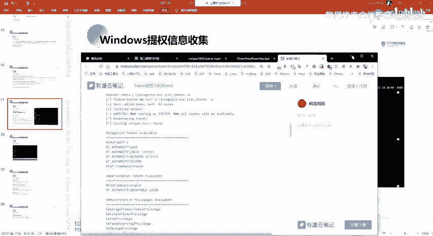

呃，这边的话就是呃以MSF下面的这样子的一个操作为例。就MSF下面的话，它有集成这样子的一个模块，就是这个in你从这样子的一个模块。好，我们可以通过就是load这一个去加载它。

然后呃它的一个使用的话就是呃list token杠U的话，它就是可以列出当前的这样子的一个token，就是列出当前可以去使用的这样呃这一个授权令牌以及模拟令牌的这样子一个token，对吧？然后的话呃。

我们在这边用这一个。让土豆去提权的话，就是说他可以去利用他可以就是说他去利用成功之后，对吧？我们把这个工具上传到我们的这个机器上面去执行。执行之后的话，它会它就会去生成对应的这样子的一个token。

就是你得到了它的一个你通过这一个呃提全的一个工具，对吧？你把它得到了一个stem的一个权限。那么它会生成这样子的一个token，我们就可以通过这一个呃这个模块下面的这一个。

这个命令来去窃取他的一个forken。而后窃取到他的这个托ken之后的话，我们就能够去得到他的这样子的一个权限。然呃这个面的一个意思的话，就是把这一个把这边的这个拖开。

这样子的一个就是这一个货肯把它给添加到嗯我们的一个模拟链款下面去。

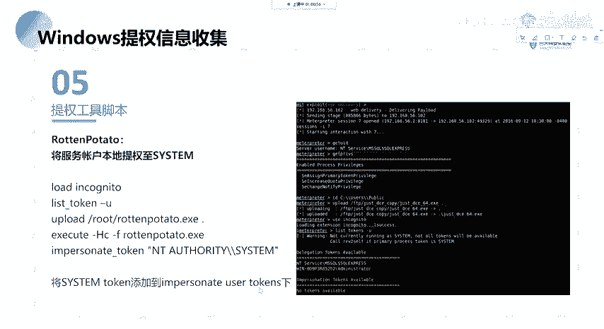

对。然后呃就是像这样子啊我们执行之后执行之后的话，它会创建这样子一个进程。然后我们list token之后的话，我们就能够在这一个模拟那块下面去找到对应的这样子的一个啊s的一个token。

然后的话我们就可以去进行一个模拟令牌，然后的话窃取它的一个token来去得到他的一个s的一个权限。

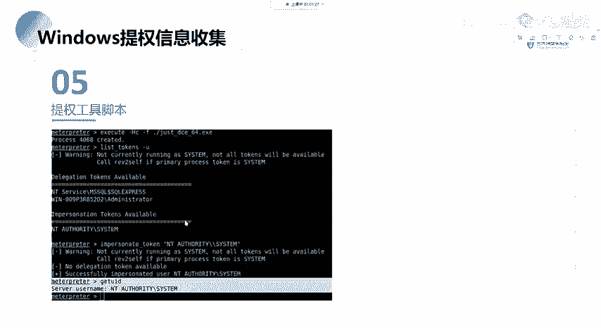

这个话就是token的一个窃取呃，以及利用。然后这边他就是其实也是这一个工具，它的一个就是这一个提全工具的一个用法。

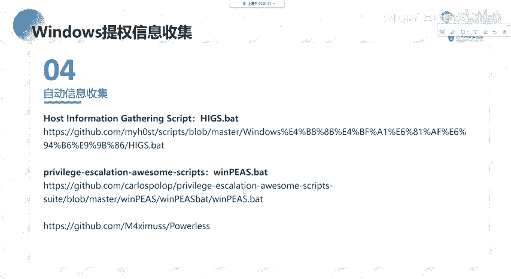

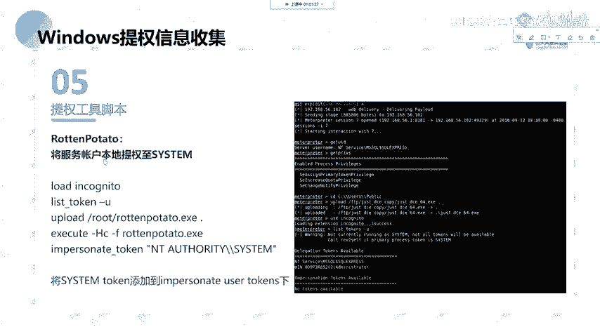

然后呃在这边的话就是说这个就是potato，就是他是有一个家族的，就是土豆家族，然后他有。

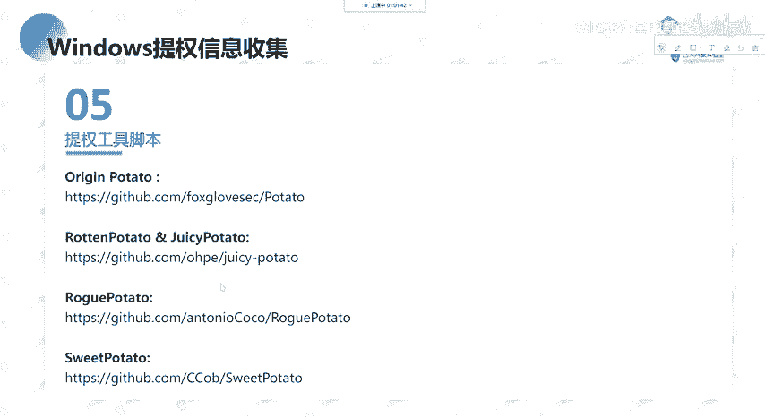

其他的这样子的一些呃工具啊，就一些齐全的一个脚本。然，这边的话大家自己一页的去看吧，然后的话可以就是就是这些脚本的话，您可以就是做成自己的一个。就大家其实在去提全的时候，就是一般的话。嗯。

你收集到对应的一个信息，对吧？然后的话你找到对应的能够去进行利用的一个工具，然后的话去尝试提全是吧。就基本的一个思路就这样。啊，有就是在web渲染下面执行命令的这样子的一个呃工具。

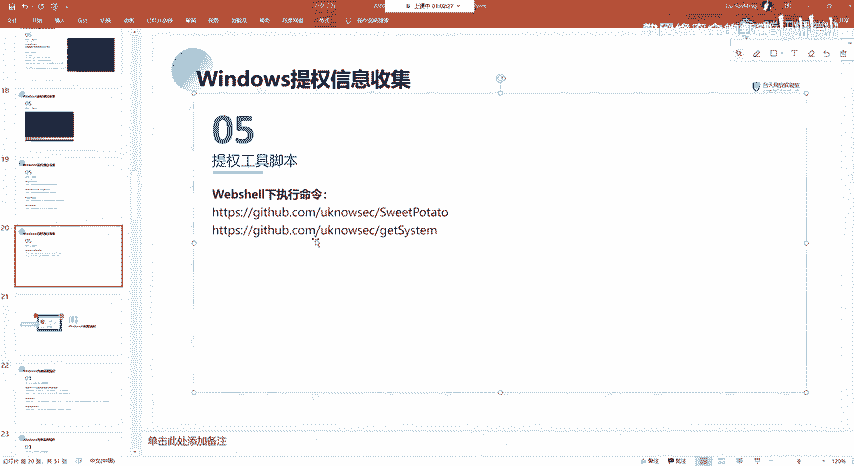

这边的话就是介绍这两个就是。

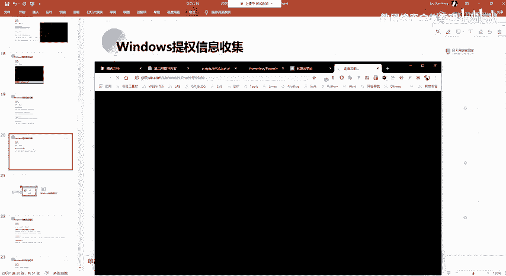

这个an six他们的这样子的一个就是基于这个的一个修改吧，就用于在we share下面去执行命令。就是说我们可以就说如果我们得到了we share，我们可以通过这样子的一个工具。

我们直接在web share下面去执行之后的话，能够去得到它的一个呃sem的一个权限。

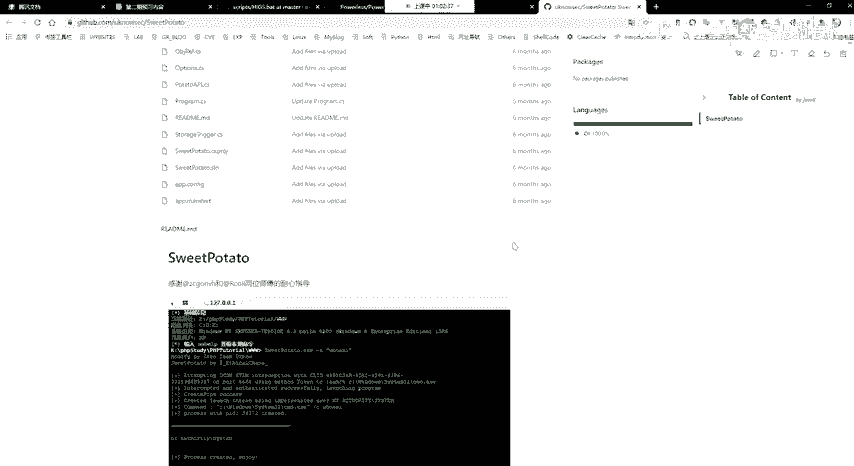

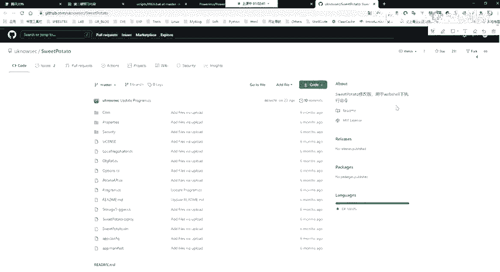

但比如说呃这边的话是他的一个用法嘛，就是直接执行对吧？我们可以直接去以stem的一个权限去执行，对吧？那么我们能够就是说能够通过这样子一个工具去去提全的话，那么他能够去执行命令。

然后的话我们就可以去反弹一个这样子的一个C的一个权限的一个渲嘛，对吧？比如说我们上传一个，比如说MSF生成的一个可执行程序，对吧？然后的话通过他的这一个提全工具去执行。然后执行之后的话。

它是以一个st统的一个权限执行的嘛。然后的话我们就能够去得到一个呃stem的一个需要嘛，对吧？

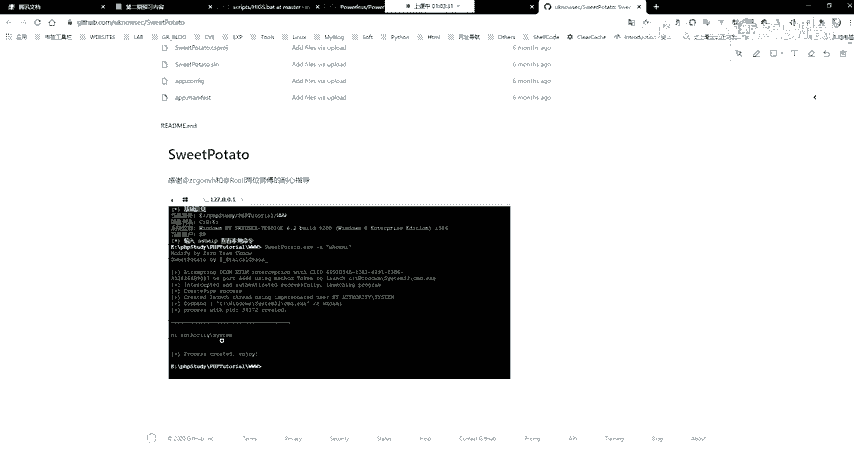

还有呃其他的话我就啊。我介绍了。这个的话大家自己就是其实就是一些工具嗯。就收集的一些工具嘛，就是以备不时之需嘛。然了他就是介绍介绍这些工具，我们在什么样子的一个情况下面可以去使用。

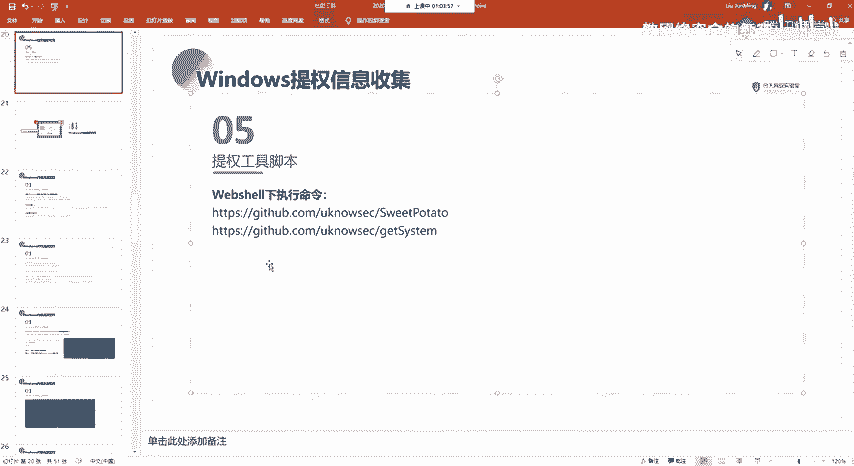

没有。