# 2024网络安全系统教程！清华大佬花159小时讲完的网络安全系统课！别再盲目自学了，学完即可就业！零基础入门网络安全！（渗透测试／漏洞挖掘／CTF／黑客技术） - P85：72.windows系统内核漏洞提权.mp4 - 教网络安全的红客 - BV1ft421A7Nj

呃。现在50了呀。我这边的话呃，大家应该没有什么问题啊，有。我这边话呃断一下。呃，咱们就不休息了吧，好吧，呃，因为后面的内容的话还是有挺多的呀。啊。呃，可能的话就是因为时间关系的话，可能。

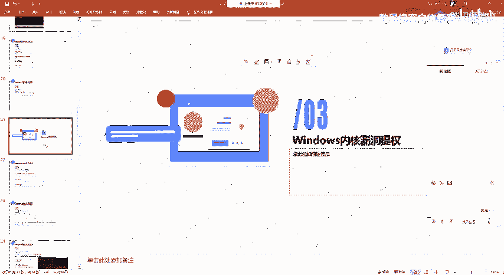

呃，其实我PPT的话已经写的很详细了呀，好吧。

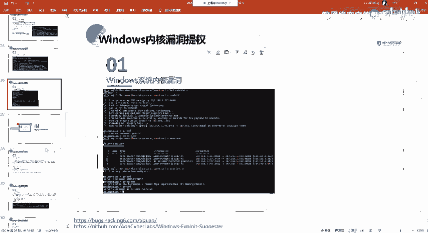

然后具体的一个操作的话，可能我在这节课的话就不会详细的一个去操作了。嗯。好的。啊呃，第三个话就是windows的一个内核漏洞的一个提全。问的是内核漏洞齐全的话，我们通常的话就是啊。首先。

这案子的这些命令的话，其实呃前面也介绍了，对吧？就首先的话我们会去检查windows的一个版本，它是否有。任何已知的这样子一个漏洞。那么我们如何去找，就是他是否有了。

首先第一个我们通常的话去找他的一个就是他的一个系统，对吧？他的一个系统的一个版本。然后的话这一些系统的一个版本，它对应的是否呃就是有现成的，或者说有报出过对应的这样子的一个能够去提全的一个漏洞，对吧？

然后的话就是通过去查找对应的一个补丁号，就是确定这样子的一个系统版本下面它呃是否有打对应的这样子的一些补丁，对吧？如果他没有打某一个提群漏洞的一个补丁，那么我们正好可以去利用它去进行一个提群，对吧？

然后的话还有就是通过抛 share的一个方式来去列出所有的一个补丁啊。呃，这边的话。这边的话就是通过这样子的一个方法，就是通过这个get WMI objectject。这一个的话其呃前面应该也有介绍吧。

就是这个get BMI object的话，类似于就是这个WMIC啊。那它同样的能够去啊对我们的这样子的一些去进行一个这样子的一个操作。就是跟这1个WIMIC的功能是一样的。然后这边的话，他是通过就是说。

呃，他同样的是去查找这样的一个ho fire host fix fix ID，就查找我们的一个补定号码。然后他这边的话是查找的一个方法啊，它是从呃window下面的这一个就是这一个API当中。

就其实他在这边的话有像我们的一个 circle啊，不 circle语句一样，对吧？对吧？就slect的一个方式，从这样子的一个呃从这边去进行的一个查找。嗯，好。然后这边的一个查找的话。

他其实就是查找对应的呃。从这1个API当中去查找对应的一个信息，然后的话来去找到我们这边的一个补定号啊。好，执行一下吧。

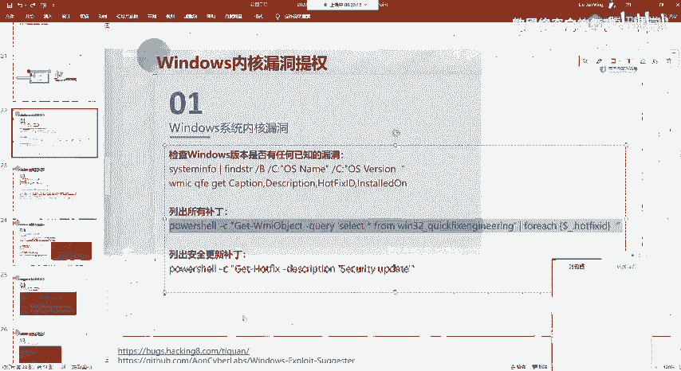

对。你看到呃，结果的话就效果的话就像这样子。

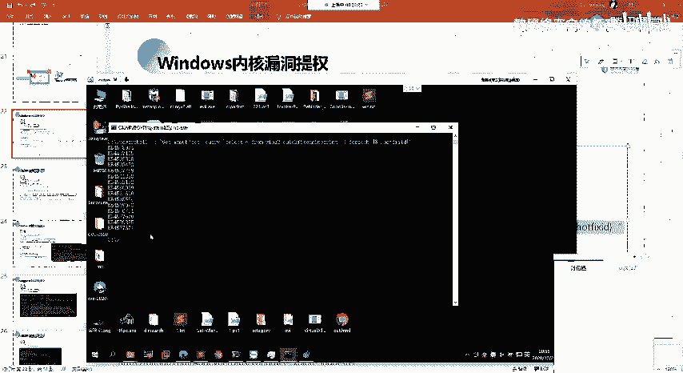

呃，然他列出安安全的一个更新补丁。这边的话跟前上面是一样的。啊呃，下第二个的话就是。介绍两个这样子的一个模块，这两个模块话就是在MSF下面的两个模块。

有呃第一个话就是in当时其实就是列出当前就是列出window系统下面的这样子的一些补丁，就说他有打了一些补丁。我们可以通过这样子的一个模块来去进行一个枚举。

然后呃第二个的话就是一个啊windows系windows系统下面的一个就是本地提全的这样子的一个模块。这个模块的话，它会去探测。

他会去检测你的一个目标系统下面它是否有存在就是说呃已知的这样子的一些提全的一个漏洞。然后的话它会呃给出建议，就是给出对应的一个建议。它的一个建议的话呃。就就是这个。Okay。就是这边的这个模块。

就我们在这边执行之后。是吧执行之后的话，他会去呃以当前我们已经得到这样子的1个MSF的一个需要，对吧？然后的话去探测，然后他探测到如果说存在有对应的一个提悬，就可以去利用的一个漏洞的话。

它会有给出对应的一个模块。就我们可以直接用MSF里面它给出了这样子的一些模块来去进行尝试去进行一个提悬。嗯。呃，还有的话就是这个。W们连AT送son这个的话也是就是一个比较。比较好用的一个。

就提前信息收集的一个工具啊，就是。

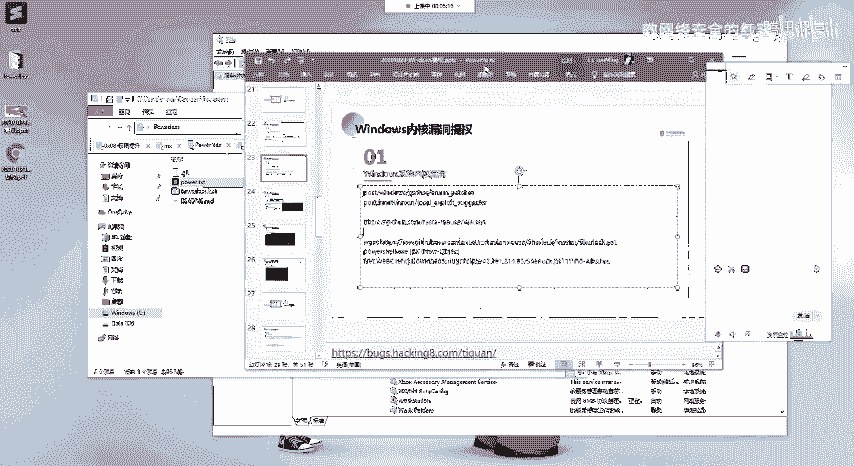

我们直接看效果吧。这一个。不。不是。

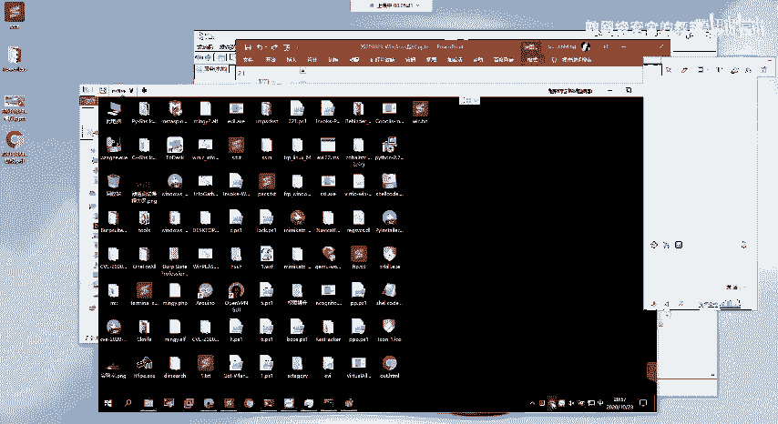

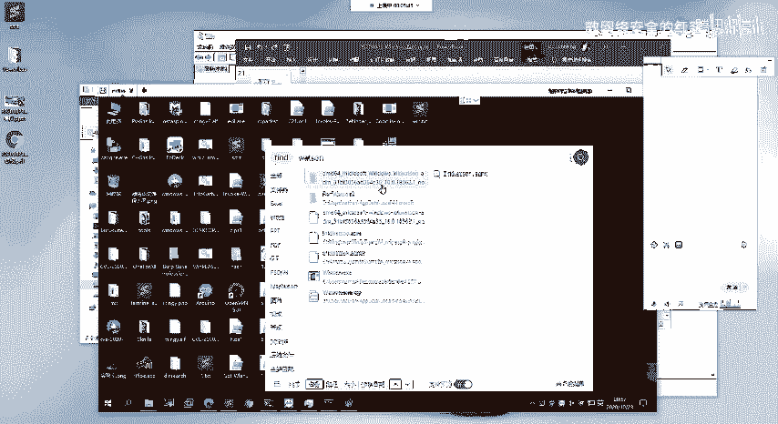

这个话就是呃执行之后对吧？执行之后的话，他也会去探测，就是给出这样子的一个建议。也就就是建议。就是说他可能觉得就是他会去。因为他这个脚本工具里面的话。

他已经有集成了对应的就是呃探测对应漏洞的这样子的一个呃一些。脚本啊，然后的话他会去探测你当前系统，他会通过他收集的一些信息，对吧？然后的话去进行一个判断。

其实就是一个供你参考的这样子的一个呃一些可可能存在的这样子的一些漏洞。像比如说这边CV20191064，对吧？他判断是可能存在的。当然的话这边呃这边他给出了这样子的一些东西的话，就是作为一个参考啊。

就是你可以去尝试。当然的话你尝试之后的话，就是不一定能成。也就是说他这边的话就是仅供参考吧，然后还有对应的话就是有对应的呃相对应的漏洞的一些脚本的一个信息，以及他利用的一个呃。

就关于这个漏洞的在油管上面的一个视频啊，对吧？以及还有对应的一个脚本。然后呃他这边的话，他就是列出来的这样子一些CV的一个漏洞啊，都是比较新的。我这边的话这一个工具没有更新啊，应该就是。

这个工具的话应该是一直在更新的。这个的话是呃就是上一期讲课的时候那个的。

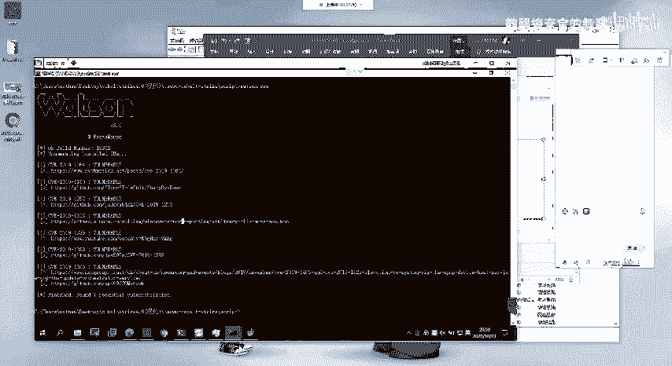

然后大家可以去那个gih上面自己去。找找到最新版本的，然后的话去进行一个尝试。然后呃第二下面这个的话就是通抛弃脚本的一个方法方式啊，就是这个。啊，slock这样子的一个抛削的一个脚本。它同样的就是。呃。

已经他会去探测已经就是已经写好的这样子的一些。

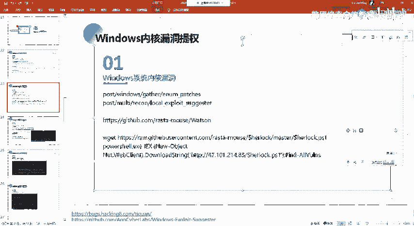

可能存在的。这样子的一些提全的一个漏洞。

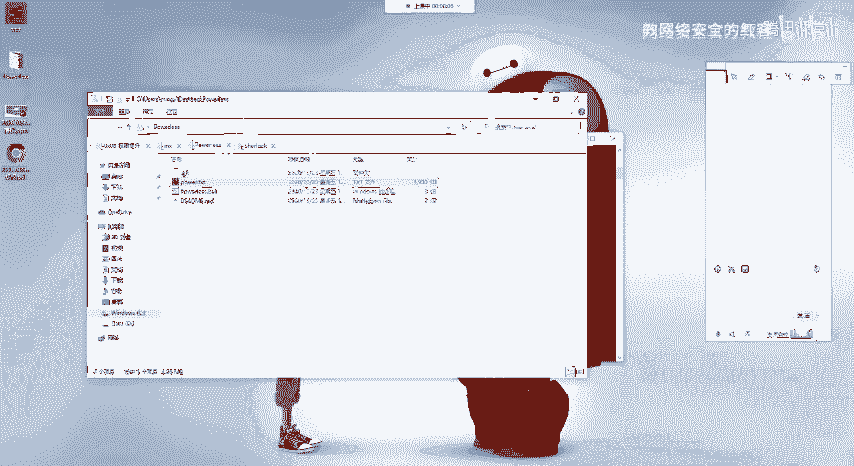

我这边的话。

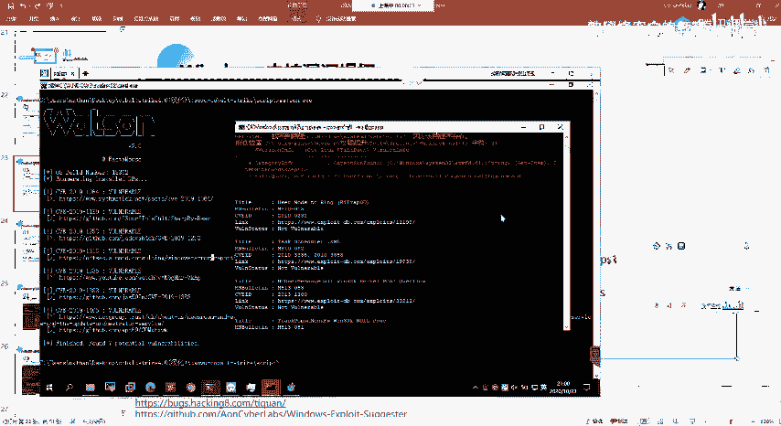

这边啊我在这边执行了，就执行执行了。呃，当然我这个号我我是直接在本地加载的，然后同样的我们可以去远程加载嘛，是吧？然后在这边的话。呃，我们导入这一个模块，然后的话用这个方的O。

然后的话他就会去枚举去枚举这一个系统当中，它可能存在的这样子的一些漏洞。不然的话，他在这边的话像。no怪也就说他没有发现这样子的一个。然后其实在这边的话，因为我这个它是win10的一个系统嘛。

然后他这边给的这样子的一些呃提全的一个漏洞win10的一个提全漏的话都是比较老的。所以的话都没有发现是吧？啊后其实这样子的一些。

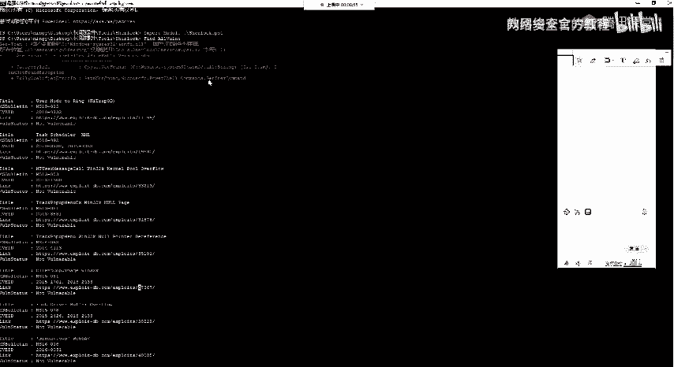

这些工具啊其实都是仅供大家参考，就是呃让大家就是说通过他的这些脚本，他通过对应的一些信息的，就他已经整合了一些信息，对吧？

然后他通过他整合的这些信息来去判断你的一个系统当中是否可能会存在这样子的一些提群的漏洞。那么我们就可以去尝试去进行一个利用了，对吧？

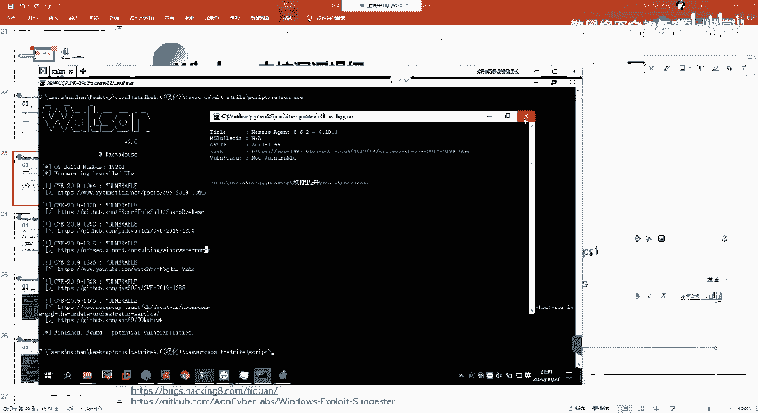

。嗯。然后的话就是这一个windows下面的一个平台的一个提群漏洞的一个集合。

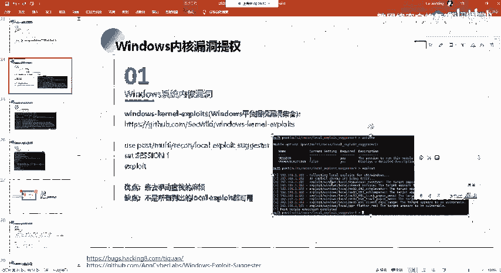

关于这个的话，大家可以看一下这个链接。就ghaub上面的这个链接这个网址。然后他这边的话就是收集了就是window系统下面的啊所有的这样子的一些就是内核的一个提全的一个脚本。这一叉P。

那比如说我们以这个MS16034为例，对吧？然后他在这边的话就给出了这样子的一个脚本。Oh。它是1个CC加加的一个脚本嘛，对吧？然后我们可以去编译它，编译的话可以去编译成一个呃可视性文件嘛。

然后的话执行。呃。还有的话就是有已经编译好的这样子的对应的呃。

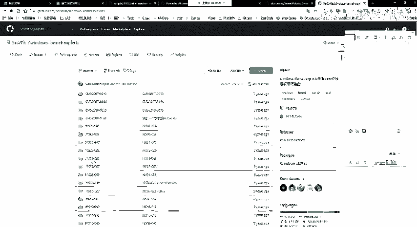

windows下面的一些内核的一个提全漏洞的一个利用脚本。

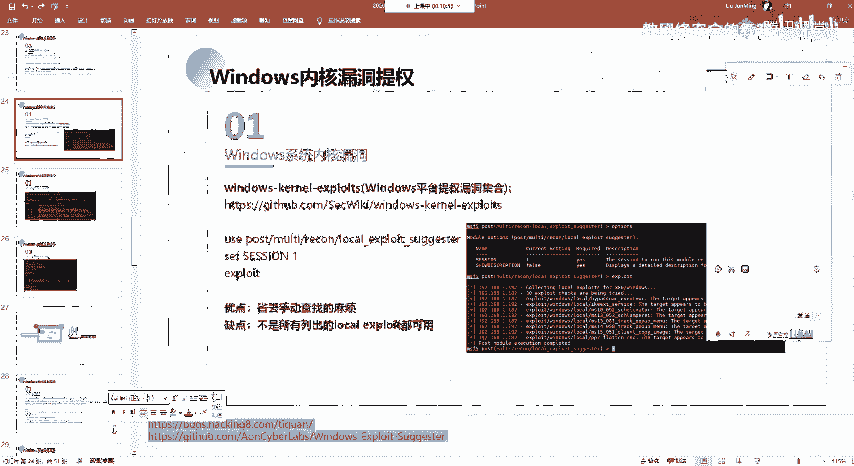

以及在这边的话就是。

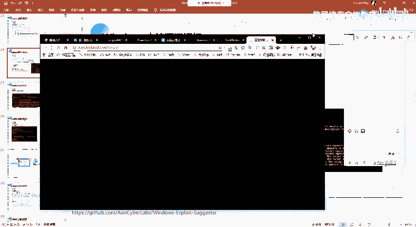

一三都还山嘛。就是这一个。就这一个。就一个windows提取的一个辅助工具。就是我们在这边的话。它的这个辅助工具的一个原理的话，其实就是它呃我们把我们的一个stem in的一个信息。

因为我们的一个sem systemem in的一个信息里面的话，就包含它的一个补定号码，对吧？然的话我们粘贴进来，粘贴进来之后的话，我们就可以去查询。像比如说呃未修补的一个漏洞，已修补的一个漏洞对吧？

然后我们查询查询之后的话。像比如说我在这边。

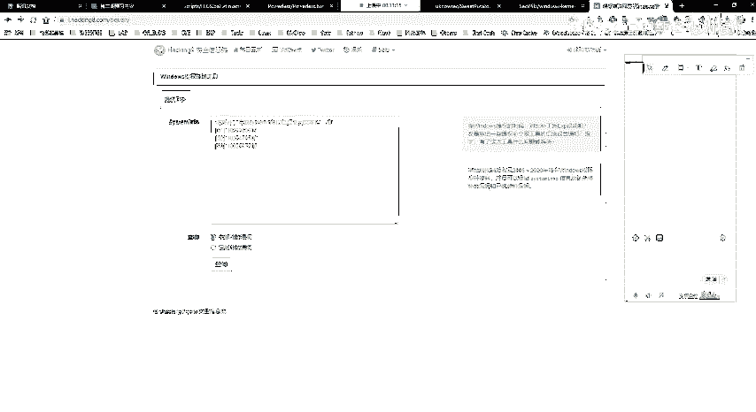

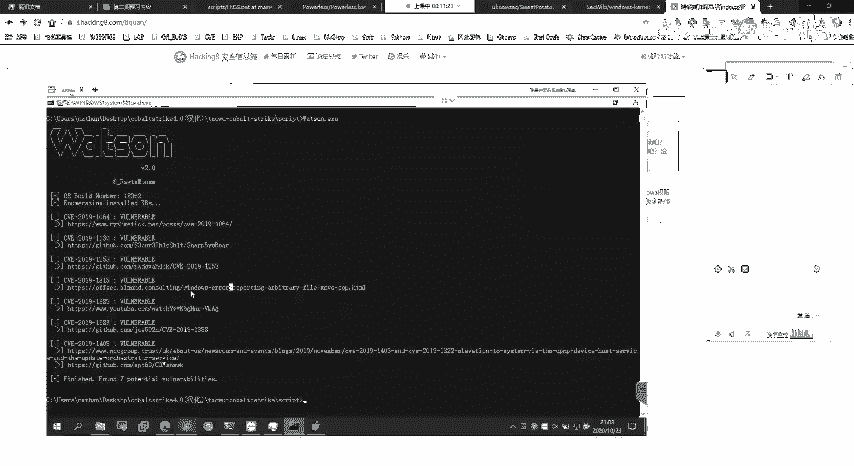

。Yeah。

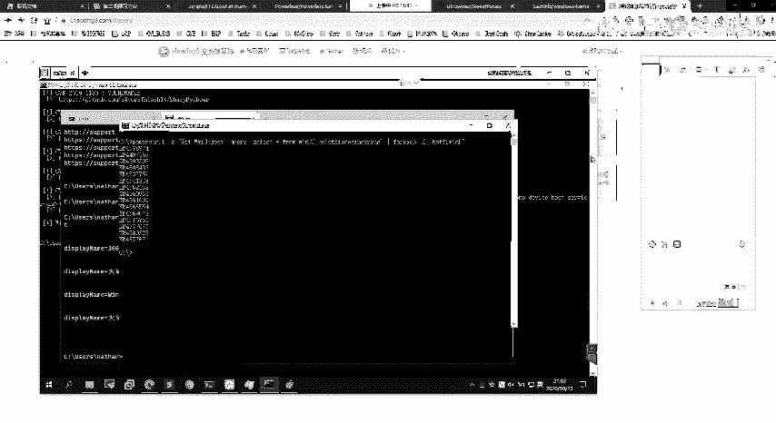

嗯。Yeah。要这。啊，这边的话我就不尝试了。

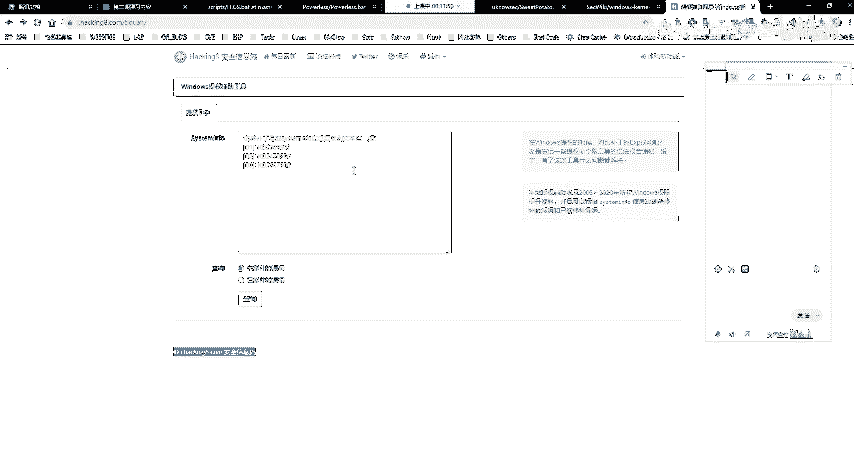

就是他这边的话，你把这统in的一个那个补定号啊，把它给扩ll到这边来。呃，他要他要是这样子的一个格式啊。

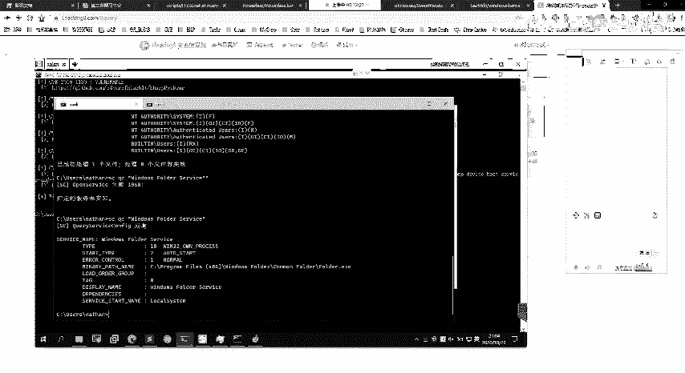

就是要是这样子的一个格式，第一个第二个第三个对吧？他是这样子的一个格式，然后的话查询查询之后的话，他会有返回一个结果。

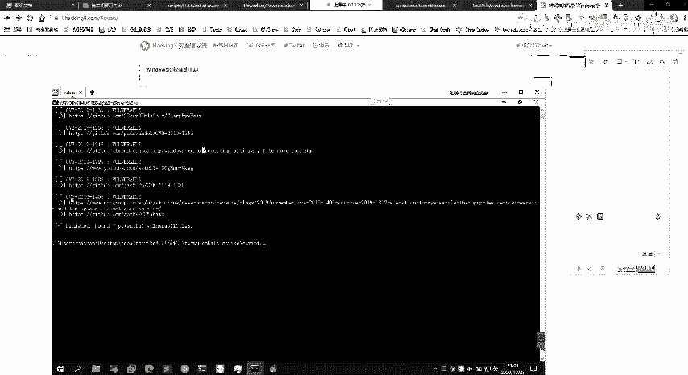

等一下还用他的这个。反开的一个结果的话就是像这样子，然后他就是他为你找到这样子的一些E叉P嘛，这些E叉P他就是就是你的提供的这样子的一些呃。

补定号当中的话就是没有包括的这样子的一些可以去利用的这样子的一些E叉P的一个漏洞，是吧？然后像比如说我们以这一个为例是吧？然后这边的话有一个补丁编号，我们右键就是啊我们跳转到这一个链接之后的话。

它其实就是到了我们这边刚刚的这个windows的一个呃内核漏洞的这样子的一个ge up的一个页面。然后在这边的话就有对应的，就是说对应的这一个呃提权漏洞的这样子的一个利用的一个脚本，对吧？

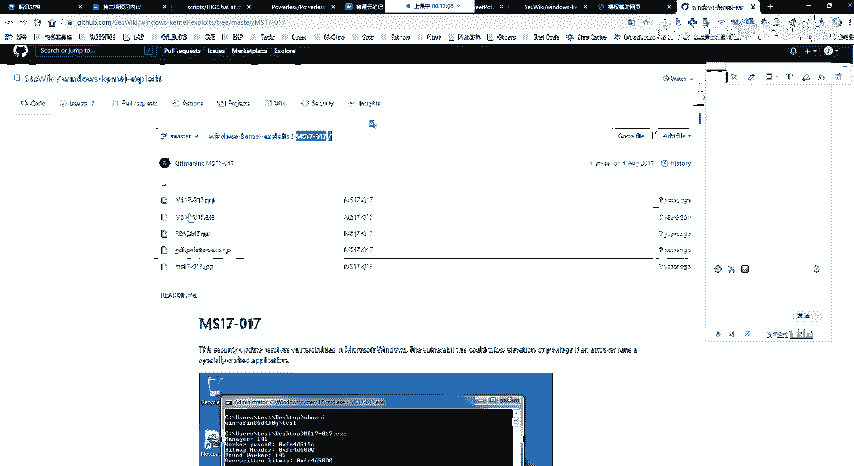

然后以及他的一个用法。就这边的话，像在这边就他的这个提评动的话，我们执行执行他的一个脚本之后的话，直接得到了一个系统的一个权限，对吧？

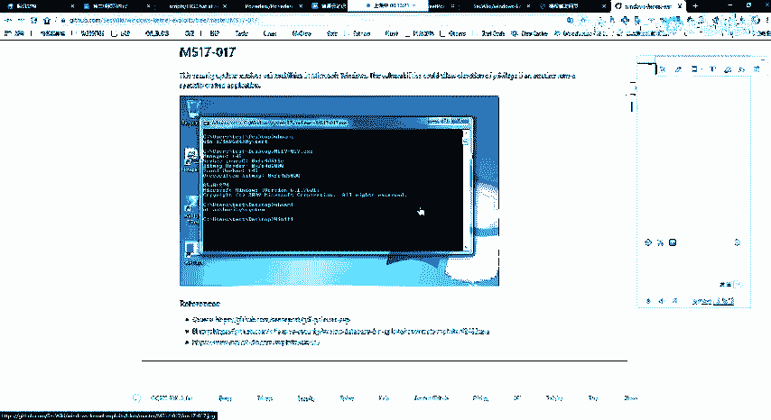

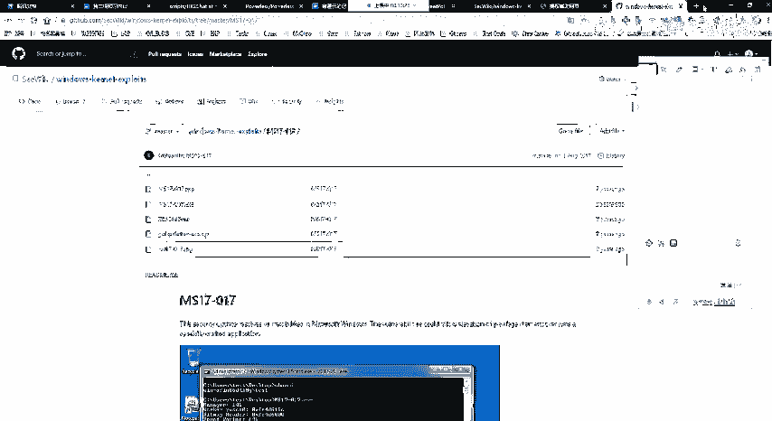

呃，还有其他的话，这边的话我都放到预习内容当中，我就不一得带大家看了，好吧。哦，呃，在这边的话就是这个MF5的这个localex suggest的这个模块，它的一个效果的话就是像这样子。啊。

然后呃我们执行之后的话，他会有给出这样子一个建议，就是我们可以尝试用这样子的一些模块去进行一个提全。

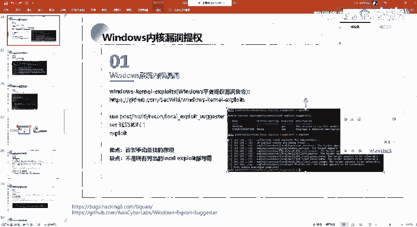

然的话以及我们使用其中的一个提全模块，对吧？能够呃成功的去得到一个sem的一个权限。

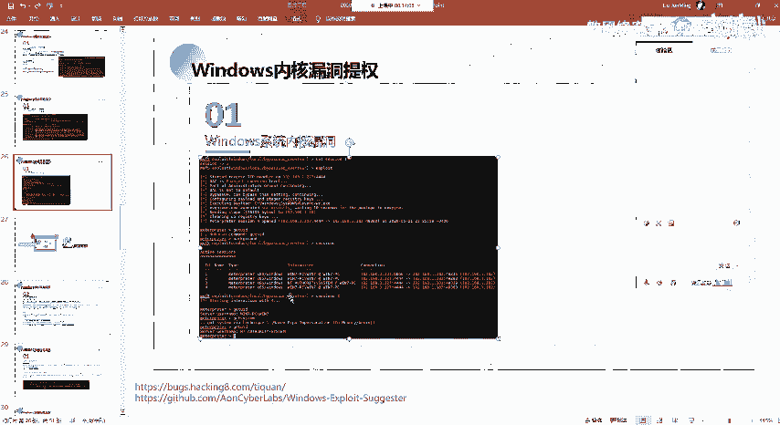

这边呃，丹琴这边的话是一个呃普通用户，对吧？我们得到一个需的话是一个普通用户。然后的话我们通过这一个脚本，它执行执行之后的话，它得到了它会重新得到这样的一个筛选，对吧？

能够呃成功的去得到一个seatem的一个权限。

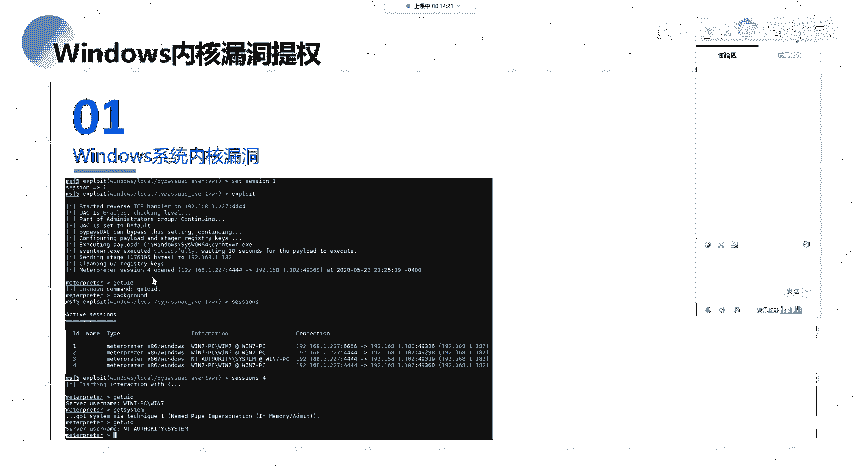

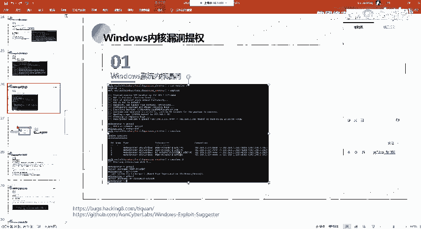

这边呃，当前这边的话是一个呃普通用户，对吧？我们得到一个需的话是一个普通用户。然后的话我们通过这一个脚本，它执行执行之后的话，它得到了它会重新得到这样的一个筛选。这边呢有一个筛选四生成了，对吧？

然后我们进入这一个筛选四之后的话，我们可以直接通过get system来去得到它的一个系统的一个权限。就其实我们当前这边的话，其实是一个普通用户的一个权限，它不是一个addmin的一个权限。

然后我们通过这样子个gaaly的话，如果说你是一个普通用户权限的话去。执行这个galaxy什么的话，你会报错。就是你要去得到它的一个系统的权限的话，你需要呃有一个addmin的一个权限。

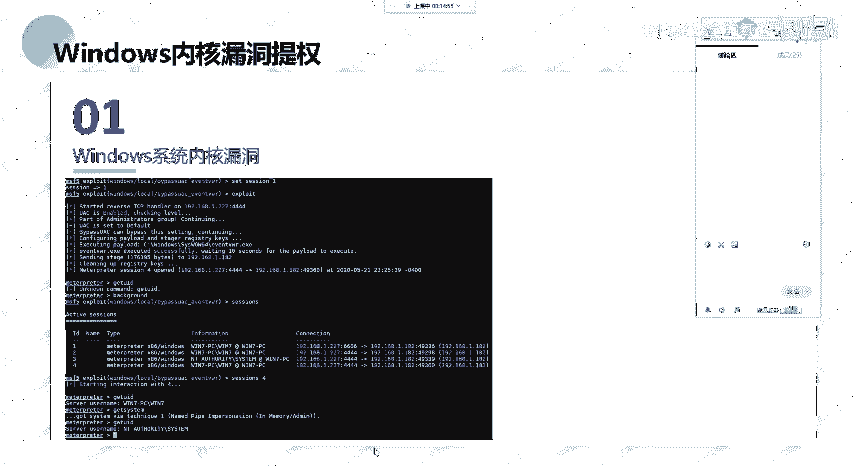

当然的话就是呃也有可能就是存在存在这样子一个情况。就是你直接执行的话，你普通用户也能得到些什么的一个权限。就是上一期的话有。呃，有同学是这样子的一个情况。当然的话如果你能够直接的去得到的话，呃。

那更好吧。

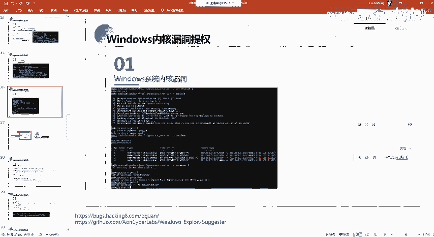

然后其实实际的话，实际的一个情况的话，可能会是像这样子。就是像这样子是吧，我当前的话是一个这样子一个普通用户，然后我g galaxyaxy的话，他会去尝试用这样子的一些方法来去进行一个提全。然后的话他。

你翻噶。Okay。然后我们是普通用户的话，我们无法直接的去get system去得到他一个s的一个权限。

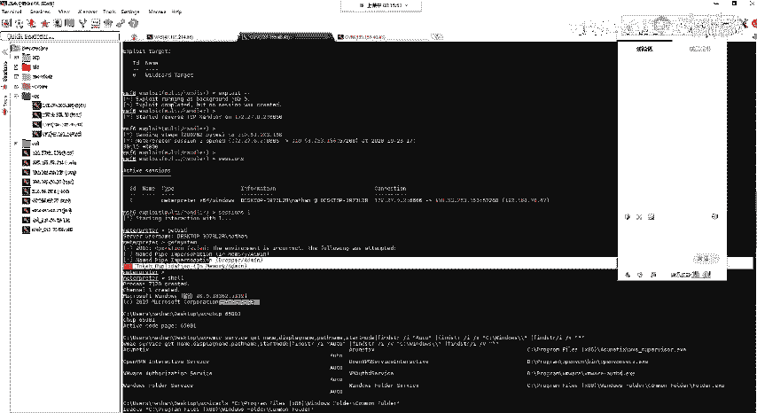

然后在这边可以的话，是因为我们执行这个脚本之的话，它其实有他其实已经做了相应的一个权限的一个提升。然后的话我们直接通过这个该该 system就能够去得到它的一个C system的一个权限。

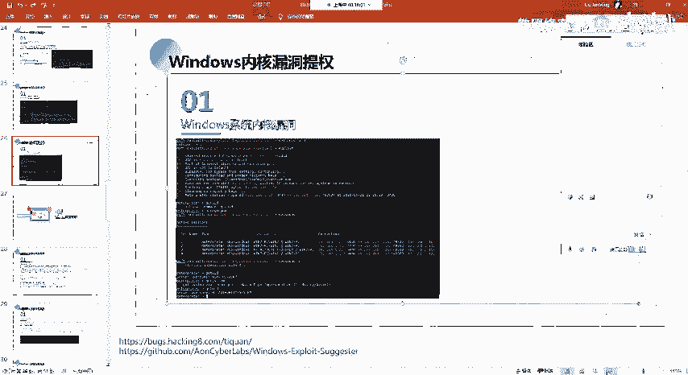

呃。前面的一个内容的话，大家应该没有什么疑问吧。大家有没有什么问题呢？

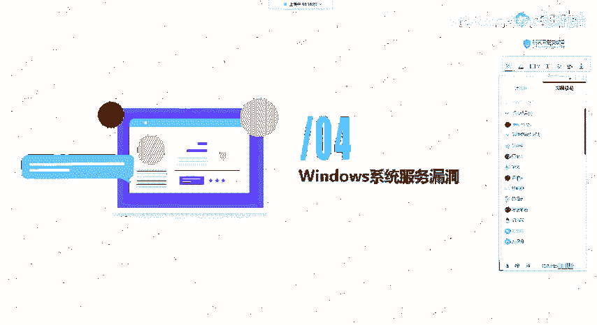

应该都能听得懂吧。呃，其前面的话，这些内容的话。

好。就是呃。介绍了一些工具，对吧？介绍了一些工具，以及我们常用的一些信息收集的一个命令，以及就是结合这一些信息我们。

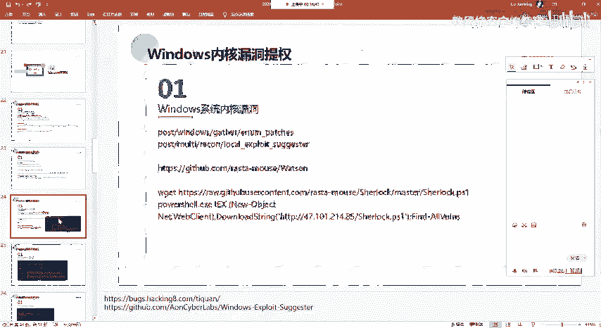

呃，可以去使使用对应的这样子的一些工具来进行一个提全。

