# 2024网络安全系统教程！清华大佬花159小时讲完的网络安全系统课！别再盲目自学了，学完即可就业！零基础入门网络安全！（渗透测试／漏洞挖掘／CTF／黑客技术） - P86：73.可信用服务路径提权.mp4 - 教网络安全的红客 - BV1ft421A7Nj

哦哦，下面的话下面的话就是。呃，我们的最后一部分内容就是windows系统的一个服务漏洞的一个提全。首先第一个他就是这个可信任的一个服务路径。这个可信任服务路径的话，它的。他的一个呃。特点。

或说我们能够去进行一个利用的一个点的话，就在于呃它是有这样子的一个特性。就它存在缺陷的这种服务程序，就利用属于可执行文件的一个文件文件夹权限。

然后的话windows服务通常它会以一个sem的一个权限去运行。所以的话在系统他在他再去解析这样子的一个服务的一个二进制文件。它对应的一个文件路径空格的时候，它也会以系统的一个权限去进行一个解析。

然后的话他的这个漏洞话就是利用的这个特性来去进行进行的一个权限提升。呃，大家可能看这一段文字的话，可能不是很很很好理解。我这边的话以这样子一个例子给大家做一个解释。就是呃在这边的话。在这里的话就是呃。

他是这样子的一个服务，对吧？然后这边呢这一个嗯。这边这个服务是他所去执行的一个程序的话，就是这一个这一个程序。然后这一个程序它的对应的一个路径的话，就是这样子的一个路径，是吧？然后他起这个服务的话。

它是就一般的我们的一个系统的一个服务。它所之前执行的一个权限的话，它都是一个系统的一个权限去进行呃，以一个Cem的一个权限去进行一个运行的。然后在这边的话，他再去启动这个服务的时候。

他同样的也是一个系统的一个权限去运行，对吧？然后在这边他有一个问题的话，就是他再去解析。他再去找到找到这样子的一个服务。他所对应的一个可执行文件的时候，他会经历这样子的一个过程。

就是他的这一个可执行程序文件的一个呃所在的一个路径，是这样子的一个路径，是吧？然后他会对这边的这个路径的每一个空格，他会去尝试去寻找。呃，其其实其实就在这边我这边的这一句话，就是他会去尝试寻找。

然后的话执行名字与空格前的一个名字相匹配的一个程序。也就是说他再去查找这一个服务他对应的一个可执行程序的这一个路径的时候，对吧？他首先会找这一个就是找到C盘下面的这一个program。

因为这边的一个program file的话，它中间是有空格的对吧？然后他去查找的时候，他会找到这一个C program这一个程序。呃，找到这个路径下面。

看他是否有这样子的一个program点EX一的这样子的一个可执行程序，对吧？如果说有的话，那么他就会以一个stem的一个权限去执行它。然后如果没有的话，那么他就会继续往下找。

然后找到像比如说在这边windows project对吧？这边同样有空格，它会在这一个目录下面，他要找是否有这样子的一个windows0X的一个可执性程序。如果有，他也会以C的一个权限执行。没有的话。

他继续找对吧，直到找到最最终的这样子一个呃程序。然后呃在这边的话，那么我们针对他的这样子的一个就是这一个缺陷，我们如何去进行一个利用呢？其实我在这边的话，其实呃。我们来一起看一下。

就是通过前面的一个讲解，我们能够大概的理解，对吧？就是他的这样子的一个就他的一个解析的一个机制。然后那么我们去进行一个利用的话。因为他会去一就一个一个目录的去查找。

就是说他空格前面它是否有对应的这样子的一个可执行程序对吧，然后的话去以是什么的一个权限去进行一个执行。那么我们就是说首先的话我们去请去检查我们的一个呃。不是就是说我们首先的话就要想对吧？

我们如何去进一个利用。那么就比如说我想要去得到就是说我想要去得到它的一个st的一个权限，是吧？我们要去去利用这样子的一个权限去得到它的话，那么我们。呃，他会去进行这样子一个检锁，对吧？

他会去有这样子的一个步骤去执行解析这样子的1个EX1的一个程序，对吧？那么我们是否可以去尝试去生成这样子的一个。像比如说在他的一个路径是这一个，对吧？我们知道他的一个路径是这样子。

那么我们是是不是可以去生成一个，像比如说program dX一把它放到我们的一个C盘的一个根目下面，对吧？然后的话在这个服务他去。他去呃加载的时候对吧？他去启动启动的时候，他就会去找。

然后的话他找到这边的话，他就会去找到我们这边所生成的这样子的一个呃可执行程序。然后这个可执行程序的话，又就是我们的一个反弹需尔的一个码，对吧？那么他去执行它解释执行，解释执行的话。

它是一个sem的一个权限去执行的。那么我们他执行这边的一个我们的一个码的话，我们就能够去得到它的一个s的一个权限，对吧？然后同年的话就是呃。其他的一个目录，我们同样的也要去，我们也可以去尝试，对吧？

然后我们要去呃达到这样子一个目的的话，就有这样子的一个条件，对吧？首先第一个的话就是我们要去向这一个目录去上传这样子的一个我们生成的一个码，对吧？那么这一个目录像C盘的这种目录下面的话。

我们如果说是一个普通用户话，我们无法去向这个目录去写去写这样子的一个文件的对吧？以及呃C盘的这种其他的这样子的文件夹下面的话，我们也有可我们也可能就是无法去写去上传我们这样子的一个文件。

因为我们没有权限嘛，是吧？那么在这边的话就是有一个问题，就是我们需要去找到一个这样子的，就是就是以这样子的一个形式，它中间是有这种空格的这种服务，对吧？

以及他的这样子的一个他的这一个去紧锁的这样子的一个路径。这一个目录下面的话是有一个我们能够去写文件的这样子的一个目录。就是说我们有权限去向这一个目录去写一个这样子的一个BX的一个可执行程序文件，对吧？

所以的话在这边的话，第一步我们需要去做的话，就是检查目标主机它是否可能存在漏洞。Yeah。呃，在这边的话就是去通过这样子的一个呃脚本，就WYC来呃去。啊，s的话就是去查找呃与服务相关的这样子一些信息嘛。

然后他的名字啊，他展示的名字对吧？呃，路径对吧？等等的这样子的一些信息。然后我们对他做一个输出。然后其实在这边的话，他查找的一个方法啊，就是呃他查找这种服务它的一个路径当中，它是否有这种空格，对吧？

因为我们前面它的一个特性的话，它就是去他会去解析空格前面的这样子的一个呃文件嘛，对吧？然后第二个的话就是如果说我们找到了，像比如说在这边我找到了这样子的一个服务，对吧？它是符合我们这边。第一个要求。

然后下面的话我们还需要去去找到，就是说它的这个服务路径，它是否有一个我们是否有一个协助的一个权限。就通过这个ICACL这一个命令来去进行一个解锁。好。结果的话就是像这样子。我们紧锁到紧锁这个目录呃。

当然这个目录的话是呃。就是其实不是一个真实存在系统上面的一个目录。我这边的话是为了就是做这样子的一个，就是给大家讲课嘛，对吧？就是呃做了这样子的一个目录，以及做了这样子的一个服务。然后我们在这边的话。

我们去检索这一个目录，检索到他的一个权，他的这样子的一个权限。关于这边的话，我们主要的话就是看这边F的话就是表示完全控制。以及呃在这边前面的话，首先的话就是你的一个用户。

然后后面的话冒号后面的话接的就是权限各各类的一个权限，对吧？我们主要关注的话就是这个F的话，就是完全控制。也就是说这边的这一个前面的这个用户，他对这个目录是有一个完全控制的一个权限。

也就是他能有对这个目录下面去进行一个写读等等的这样子的一些呃操作，对吧？然后在这边的话就是有一个特殊的一个权限，就是这个everyone。然后我们可以看到这边everyever的话。

它同样的有这样子的一个完全控制的一个权限，也就是什么意思呢？也就是呃任何用户他都有对这一个目录有这样子的一个呃可以去写文件，可以去读取，可以去进行呃这样子的一些操作的一个权限。那么我们确定了这样子的。

我们通过这样子的方法确定了这样子的呃。一个服务以及它存在这样子的一个可以去写的这样子的一个文件。那我们下面的话就可以去尝试去生成这样子的一个配漏的。

对吧然后我们在这边的话是找到的是这一个windows这个目录，对吧？那么我们要去生成的这样子的一个可执行程序的一个文件名的话，就是我们可以看一下这边是吧，是这个目录可以写。那么我们要去生成的一个文件。

这可执行程序文件的话，就是这个commentX1。因为他在去解析到这个目录的时候，他会去解析这边空格前面的这一个common这一个可执行程序，对吧？如果他有解锁的话，他就会去以一个st的一个权限执行嘛。

对吧？那我们像这个可选目录下面去上传一个生成的这这个呃访系尔的一个码，我们上传上去。然后这个服务它重启的时候，它就会去加载它。这边话就是呃生成的一个步骤，这部分的话呃，应该大家都很熟悉了。

我就我就不多说了。然后的话上传到我们的一个目标的一个啊目录下面，对吧？上传上去。

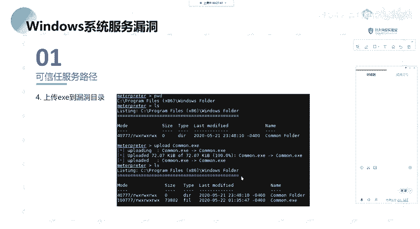

上传上去之后的话，我们需要去重启服务。

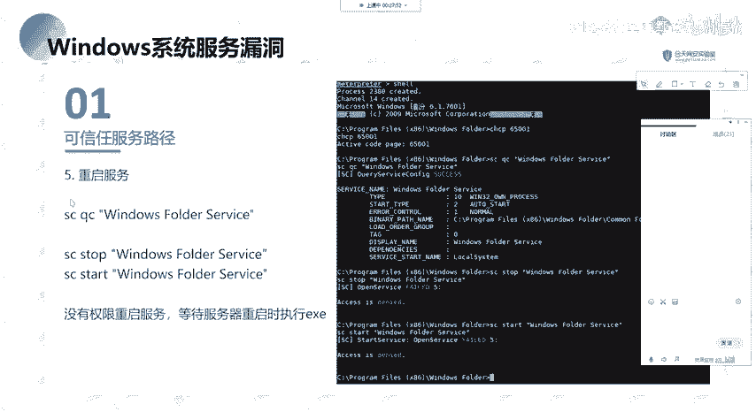

嗯。因为呃我们在这边我们把我们的呃这种这个可执行程序我们上传到目录下面去了，对吧？但是它上传上去的话，他不会去自己主动的去执行，对吧？他是需要去等这一个服务，它再重启，也就是说它是会。

他是在这个服务它重新启动的时候呃，系统他才会去啊以我们前面这边的一个方法来去进行一个仔细执行。来去进行这样子的一个方法呃，这样子的一个步骤去进行一个呃紧锁，对吧？

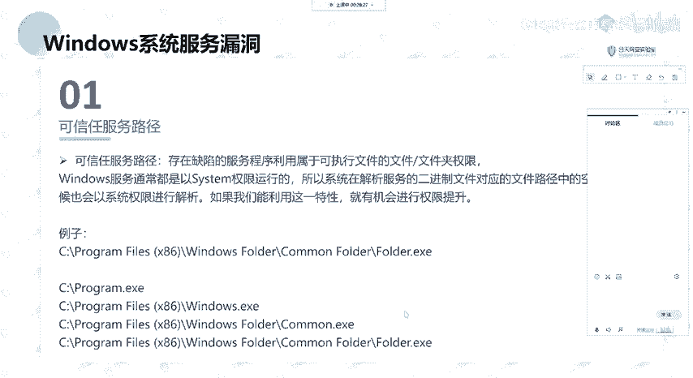

所以的话在这边我们还需要就是说他的这个服务的话，我们需要去对他做一个重启。对。首先的话就是呃我们可以通过SC的这个呃命令函程序，对吧？因为我们知道这个程序的话，我们可以去进行一个呃服务的一个控制紧锁。

对吧？然后QC的话就是去进行一个查找，去查找我们这边指定的这个服务，它的一个相关的一个信息。就是像在这边像比如呃它的一个启动的一个状态，启动的一个类型。就是达 type就我们那一个服务启动类型的话。

就是有启动禁子啊，不是有那个就是。呃，王是么个。

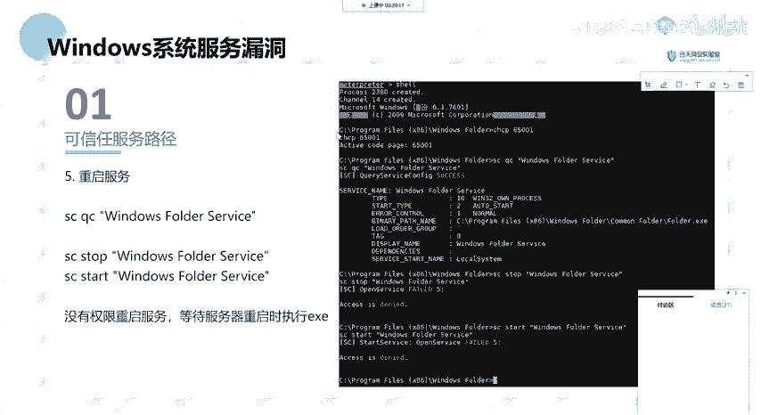

嗯。嗯。嗯有。Okay。对，就是启动类型的话有手动自动嘛，然后禁用对吧？然后呃在这边的话就是al start的话，就是表示它是一个自启动的。也就是说它会随着系统启动而启动这样子的一个服务。然呃。

在这边的话就是我们。呃，会有这样子的一个问题啊，就是我们因为我们当前得到这个权限的话，是一个普通用户的一个权限，对吧？我们没有权限去去启动这样子的一个服务。因为它的一个服务的话。

它其实是一个s的一个权限去执行去呃去启动的。所以的话我们普通用户是没有权限的。也就是我们无法去对这样子的一个服务器进行一个停止以及启动在这样的一个操作。就是像这边呃我这边截图所示对吧？就acces一的。

也就是它是不允许你去进行这样子的一个操作的。所以的话呃我们可能就需要去等待这样等待它一个服务器去重启，然后他去执行这一个可执行程序。当然的话简单粗暴一点的话，就是我们直接下动。

就把它的一个主机进续去进行一个关机。当然的话这个的话不是呃比较敬意啊。呃。就是说everyone的话，他就是表示所有的一个用户嘛，就是说你是一个普通用户，也也也有权限去对这一个呃文件去做一个呃写入。

去上传我们的这样子的一个程序嘛。O。不是说呃，你是要有everyone，然后的话你还需要有对这一个目录有一个呃完全控制的一个权限。嗯。当然的话，如果说你是一个就是。你是一个at命的话。

那么你你就有权限去对他做这样子的一个操作嘛。所以这边的话他是有有条件的呀，所以的话是有条件的。就是我前面这边讲的啊，我我首先的话需要有。这样子的一个目录来看一下吧。

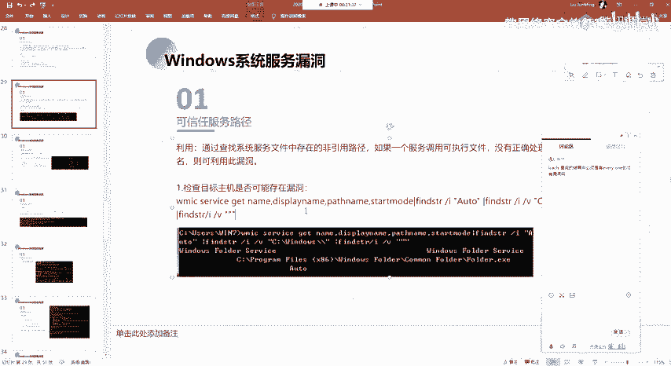

就呃其实我这边已经有执行。呃，就看我这边的话，我这边已经有啊重新。搞月嘛。

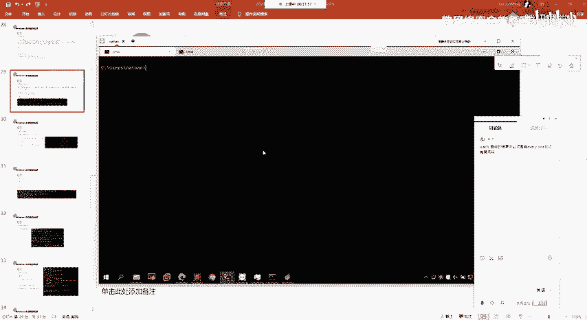

执行之后的话，在这边他有找到这样子的呃，1234个符，对吧？这四个符的话是满足我们的地一点要求，就是他的这样子的一个路径当中，对吧？它是有这样子的一个空格，对吧？像比如说这边的一个这一个。

然后的话还有就这一个。服务个。这是第一个。然后第二个的话，我们还需要去一的去通过这一个命令啊去检索它的一个目录。它就是说我们是否是能够去进行一个上传文件，或者就是有写入文件的这样子一个权限。

就是通过这个。

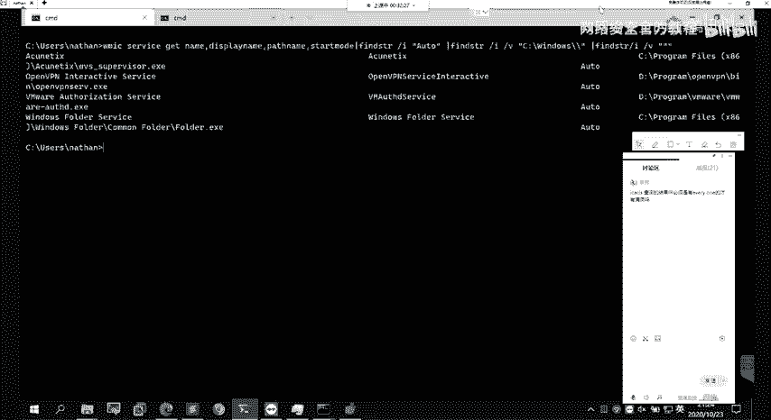

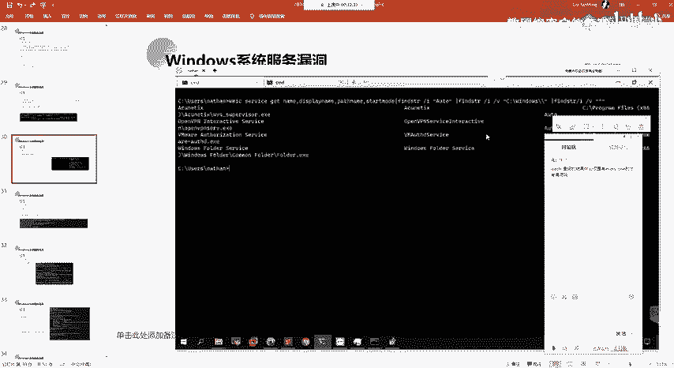

哦。比如说。这一个。这个不行，这个。就这一个目录的话，就是说它的一个空格的话就是在这边，对吧？所以的话你是要去CC盘的一个目录。那么C盘目录的话，我们普通用户的话肯定是没有权限的。

我这边的话就以这一个为例啊。然，呃这一个的话其实就是我们要去找到的这一个目录。就是它是有它是everyone，他每个就是任何用户他都有一个F的一个权限，是吧？

然后还有对应的就是说有权限去对这一个目录有F控制权限的话，就是像这个tty的instore。这个的话，它是就是系统内置的这样子的一个呃比较高的一个权限。呃，这个。

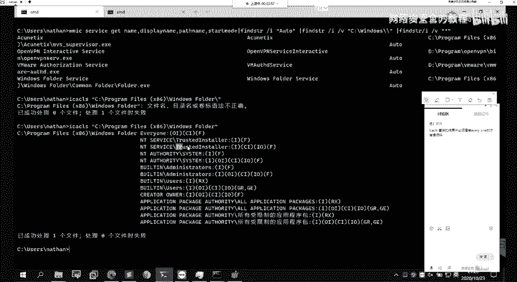

一个是。我们等会有的这个。

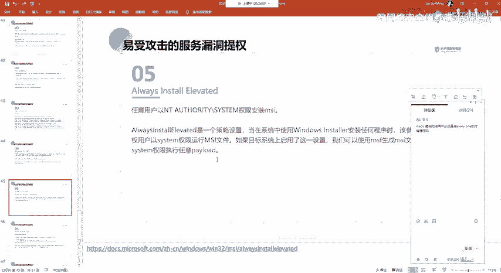

啊，不是。就是还有像这种标T印，就是内置的这样子一个管理员用户，对吧？还有其他的这样内置的。嗯。这样子的一些用户。他是有权限的对吧？然后在这边的话，因为我们没有这样子的一些权限嘛，对吧？

所以的话我们一个普通户的话，我们只能是就是说这个目录，它是一个everyone都有一个控制权限的。那么这一个目录话只好符合符合我们的一个要求。所以的话我们可以去查。

可以就是呃像这一个目录去呃上传我们的生成的一个码。

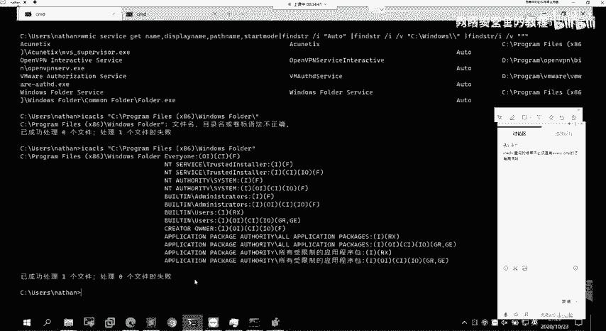

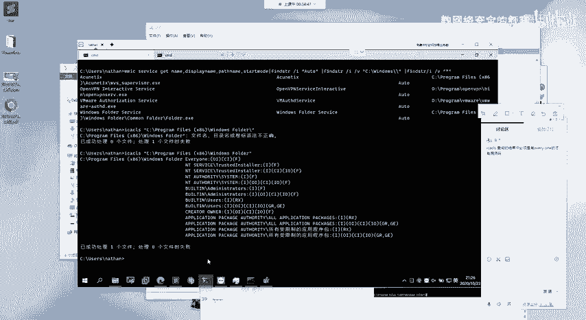

然，呃在这边的话还有一个要注意的一个点，就是这一个。就我们在这边我们把我们重启它的一个机器，对吧？就假设我们把它一个机器重启了。重启之后的话，它会去加载我们这边的一个码，然后的话以系列统的一个权限执行。

然后执行之后的话，我们在这边的话就能够去得到这一个需嘛，对吧？

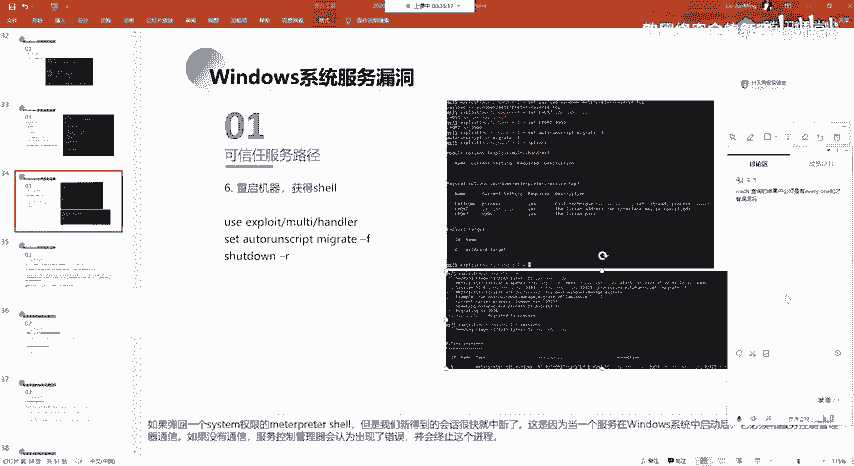

得到这样子的一个需。对吧但是的话呃你会你自己去尝试之后的话，有会发现它有一个问题啊，就是你得到这一个码的话呃，就是它弹回了这样子的一个连接之后的话，它立马会断掉。就是这边的话，你断掉之后的，断掉的话。

它是因为就说他这边有这样子的一个机子。

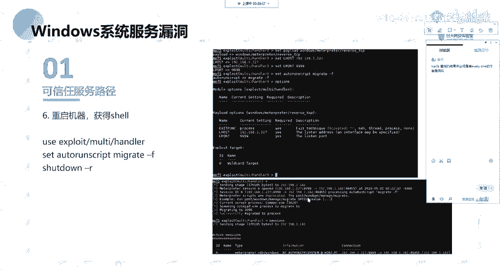

就是。当服务它在windows系统中启动后，他必须要去调核windows系统下面有一个服务控制管理器。他需要与它去做一个通信。但是我们生成的一个码的话。

只是一个就是法兰西尔嘛来与我们MSF的这边的一个服务器做一个连接，是吧？所以的话它无法去与它去进一个通信，因为它不是一个服。所以的话他会去，就是说他这个还期，他会认为是出现了错误。

然后把这个进程他给终止掉。所以在这边的话，我们需要做这样子的一个操作，就是在他得到需要之后，对吧？他执行之后，我们这边接收到了他的一个绘话，接收到了他一个连接。连接建立之后的话。

我们立马去做这样子的一个。

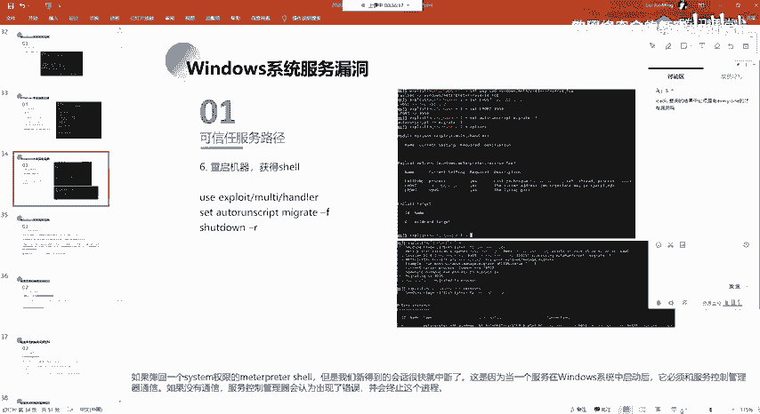

进程迁移。然后把我们当前所得的这一个权限的话，把它迁移到另一个进程当中。然后迁移到进程当中之后的话，我们就能够去得到一个稳定的一个绘画，得到一个稳定的一个筛选。然后在这边的话。

我们可以看到我们得到一个筛选的话是一个sst的一个权限。

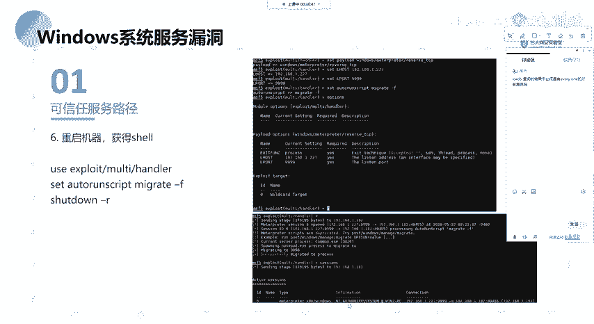

呃，这边的话我们可以来尝试一下，好吧。

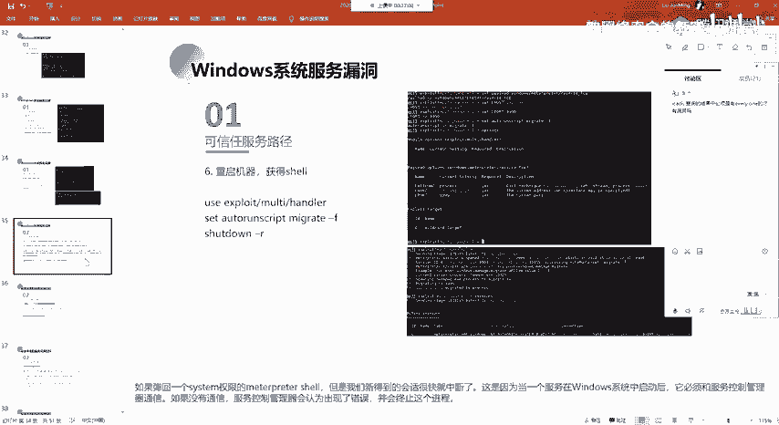

我这边的话以。我这边MS关掉了。重新。先慢一下。嗯。嗯。

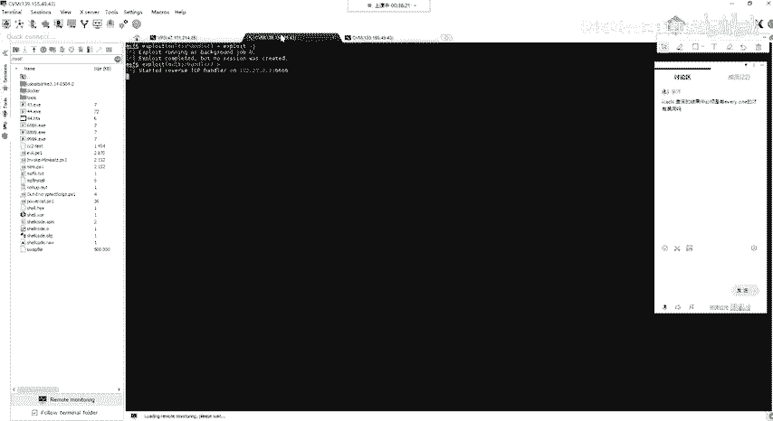

I。

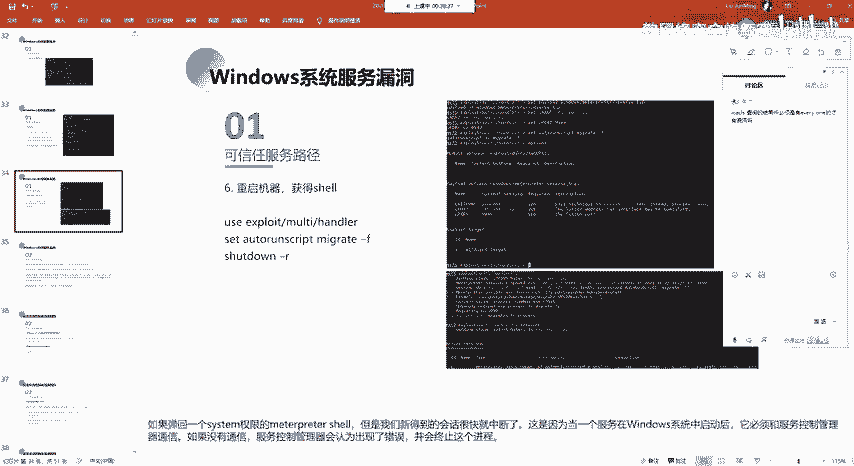

Okay。

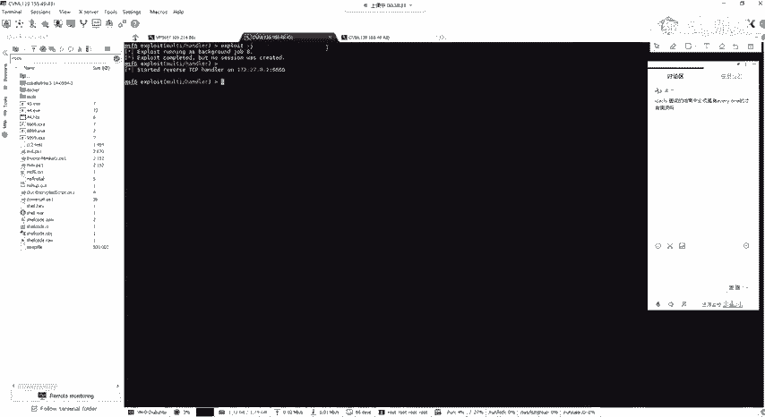

嗯。对话我起了1个MSF的一个服务，对吧。

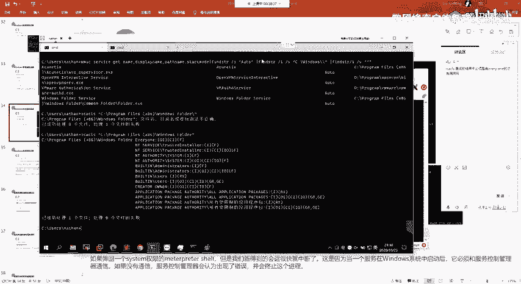

调个剪天。好呃。那这边的话我模拟一下，得到一个C啊。

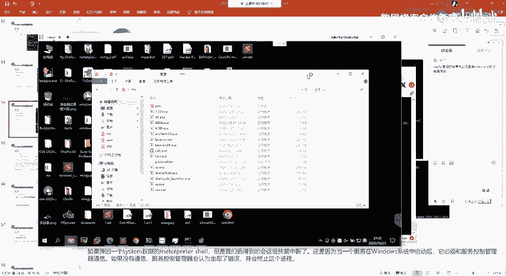

是。是呃得到了这样子的一个普通的一个需要。对。Okay。嗯。有点卡。

Okay。

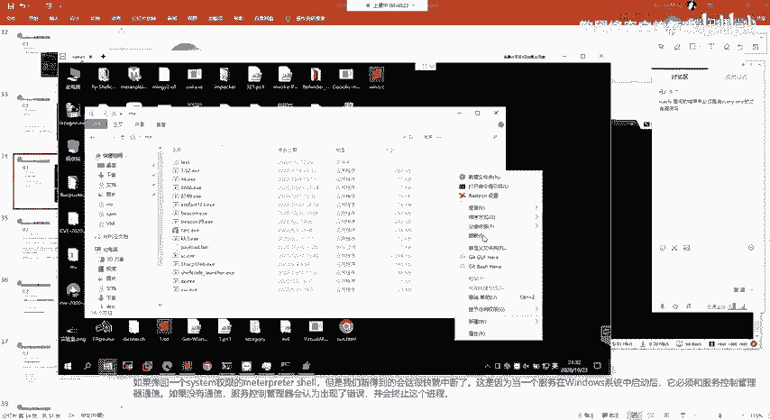

Yeah。Yeah。Okay。哎，我都疲的。Okay。我们当前的当前的话得到了这样子的一个普通用户的一个渲。就是我这边的话就是模拟已经得到了一个渲嘛，对吧？我反弹了一个渲，反弹到我们MSF上面去了。

对吧？

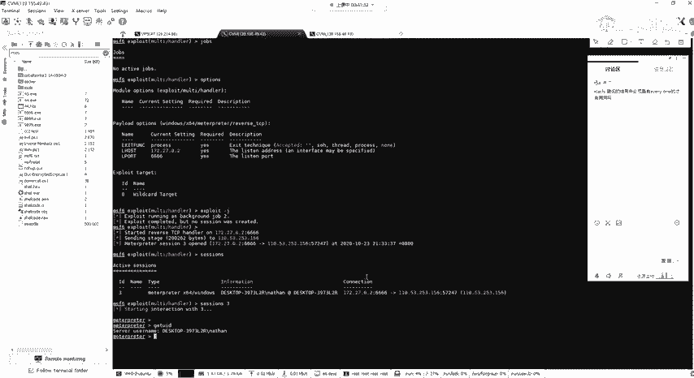

访谈上去之后的话，我想要去进行这样子的一个就是去查找我这边得到一个机器，它的它是否存在这样子一个漏洞，对吧？那么首先我第一步的话就是。

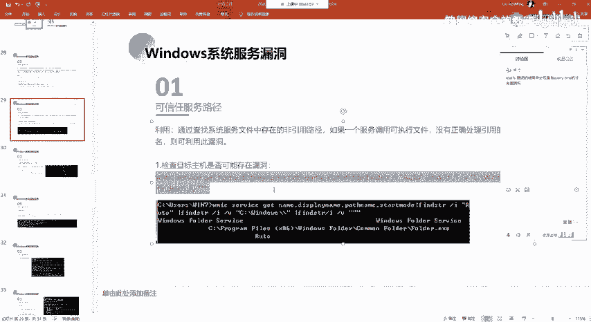

检查他。通过通过这样子的个面料。Okay。Okay。对吧我去执行执行之后的话，找找到这样子一个。找到这样子的一个服务路径。Okay。录径的话就是被一个对。は。然后的话判断他的一个权限，对吧？

发现他是符合我们的要求的。然后这个时候的话我们就可以去尝试去呃上传我们的一个码。呃，我这边的话。

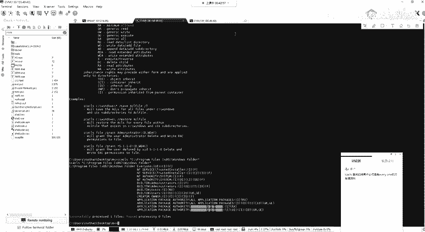

我这边的话。こ。

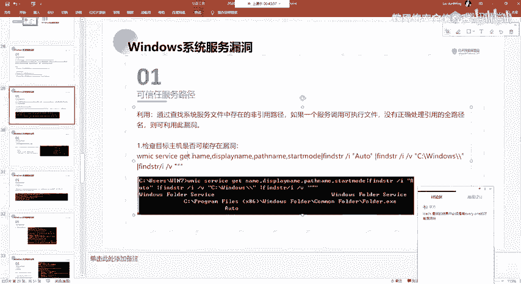

我这边的话还是以这边的这一个吧，就是我就不我就不重新生成了，我就以这一个。我这边之前已经生成了这一个。

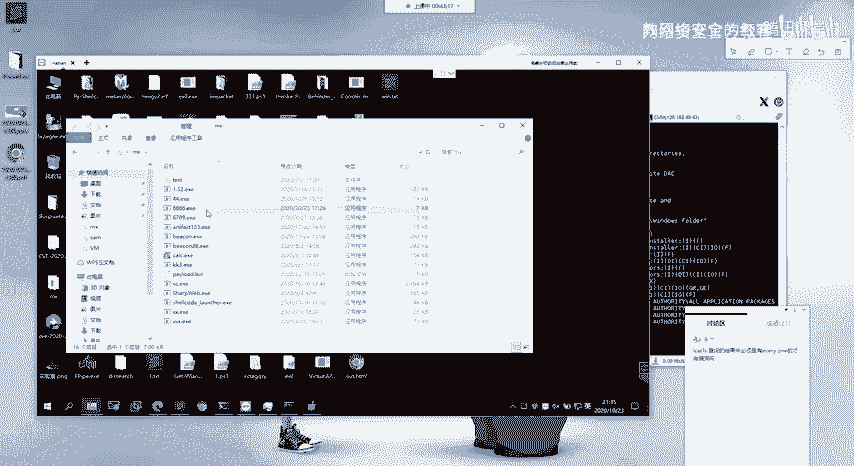

不。就是这样子的一个路径，对吧？呃，我把他。OK。把它copy到这一个目录下面去。就是呃那一个。嗯。对。嗯。好。Yeah。Yeah。好好。这样的话现在的话已经copycopy copypy过去了，对吧？

啊，我们可以。查看一下这个目。Yeah。What。大家要注意的话，就是呃就是这种中间有空格的。这种中间有空格的话，你需要用引号去做一个包裹。就这边的话是他出错的一个原因啊。

然后可以看到我这边的话已经扣过去了，对吧？然，扣过去之后的话呃，哦，我这边其实还要改一下名字。就是我们要改成这个comment点X1，对吧？嗯。Yeah。嗯。

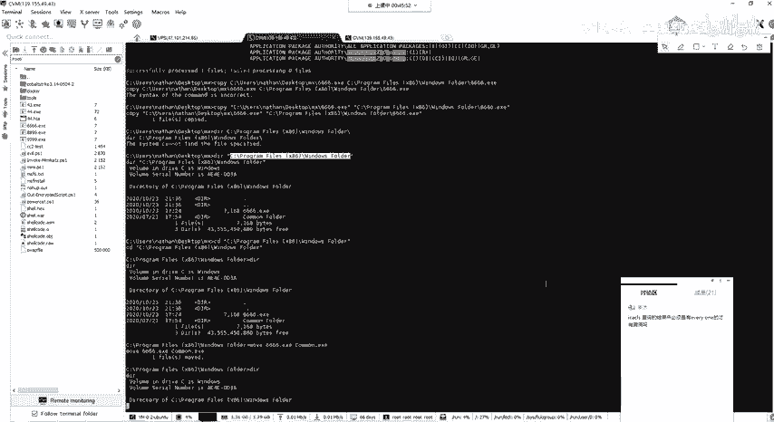

好，现在他已经改改改改成了，对吧？改成了之后的话，我们下一步的话。

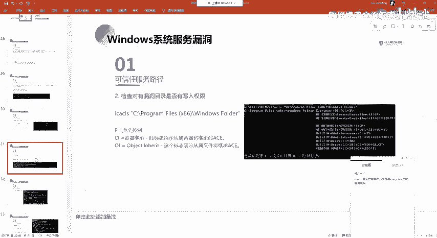

我们下有下一步动。就是需要去重启服务的。但是重启服务的话，我们可以来看一下这个服务。本佢通过这个命令出。查看对吧？查看的话，他的这个服务的一个路径对吧？然后的话我们在这边的话，我们想要去通过SC去呃。

比如说我要stop掉。我要去亭止这一个。5。🤧那，你你要发现的话。他这边是没有权限去那个的。呃，其实。

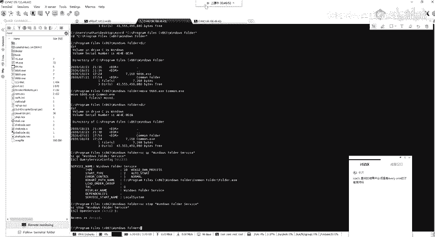

然呃下面的话我为了演示，就是我我我就不重启我这边的这个机器了啊吧，然后我这边的话我就通过这样子的一个方法，我去用一个管理员的一个账号去模拟，就是重启这一个服。因呃，就是你需要去等这个服务，你要以那个。

你要去等他去进行一个重启，你重启服，你只有他他的一个服务重启之后，你才他才会按照我们前面的那个特性去行一个加载，对吧？当然的话你也可以说就是你让他系统，因为我们前面看的话，它是一个自启动的对吧？

那么你可以重启它的一个系统，让他的一个系统去进行一个自启。然后的话它系统自体的话，那么我们他的一个服务他也会去进一个自体，对吧？好，这边的话我们。Okay。

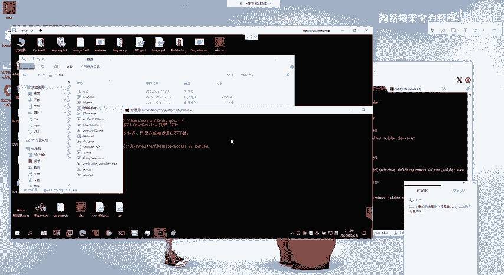

Okay。呃，我这边的话要。我先退一下。因为我这边的话没有建立的那一个jobs。我这边还需要拆再去。再去增请一个jobs。因为呃这边的话，因为我刚刚就是我没有去设置那个选项，在这边呃也说一下。

就是呃你这边的话，前面我们这边对吧？我们建立了这样子一个监听，用这一个hand模块建行监听。建理今天之后的话。建力今听之后的话，他等待我们的一个配load的连接，对吧？我们的一个网连接连接之后的话。

他这个座板它就会断掉。也就是他经理临接的后之后的话，这一个任务的话就已经完成了，对吧？然后其实我们可以在这一个。

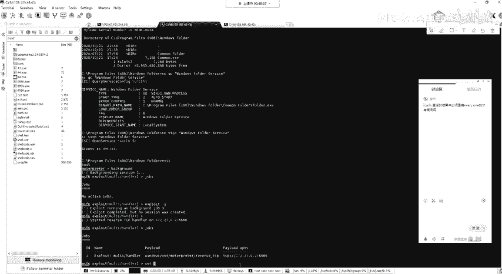

Okay。在这边有一个高级选项，就是这一个。被一个。把它改为改为forse，也就是他这边他尽力筛选之后的话，他不会退掉。就这边的一个jobs。我这边他没有那个没有去设置这一个选项。

所以的话呃建力筛选之后的话，他这边就会断掉。我不是他会那个jobs时就没有，然的话我这边还需要去呃监天一个。然后的话我这边的话就模拟我这边的一个服务去进行一个重启。嗯。Okay好。嗯。Yeah。O。

就这一个符对吧，然后我当前的话，我去做一个。

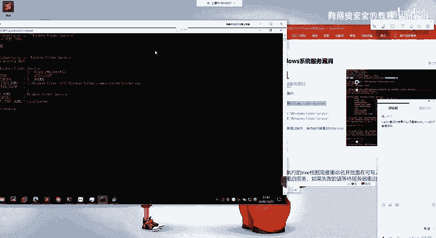

到莆田子料哈。我去停止这个服务。啊。然后停止之后的话，我再去。启动他。So start。

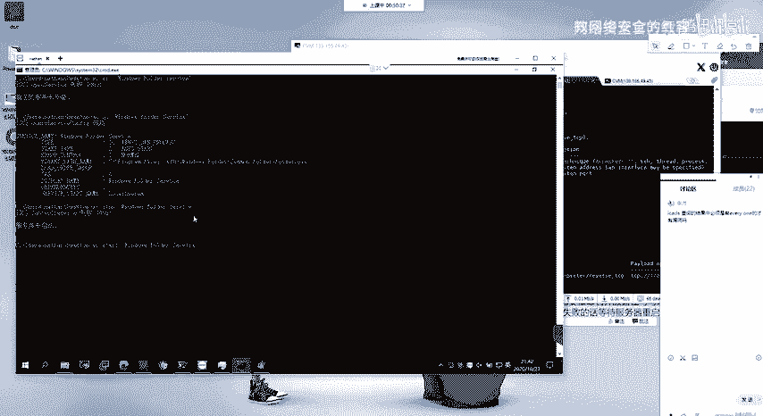

然后我这边启动之后的话，你会发现啊对吧？我这边的话立马就得到了这样子的一个筛选筛选是。然后我这边切到这个是选四，你会发现的话，他这边得到一个权限是一个s统的一个权限，对吧？嗯。就是一个现层的一个权限。

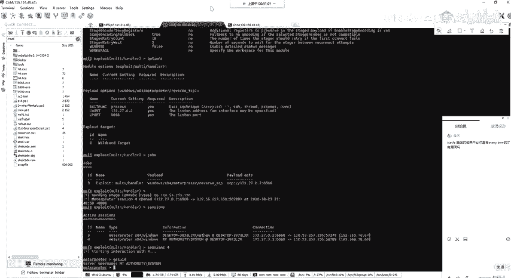

然后我这边的话。

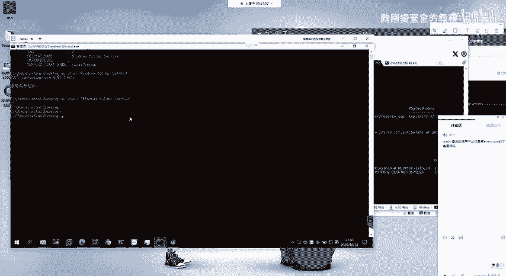

一般的关系啊。Okay。

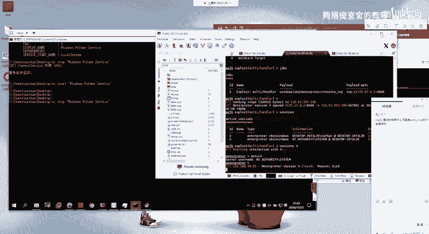

Not。没有发现。就是这边的话，他呃，我这边执行之后的话，对吧？他我这边的一个绘画的话，立马就断掉。断掉的话，他的一个原因的话就是我们这边的这一个机子。

就这边前面所讲的那一个。嗯。被告机子。呃这边它会断掉，就是因为我们这边的执行的这个X的话，它其实不是一个服务。然后的话它会就这个服务控制管理器的话，它会终止掉这个进程。

所以的话我们需要再去监听的时候去做一个这样子一个设置，就是呃在得到这个绘话的话，它会立它会自动的立马的去执行这样子一个呃迁移进程，就把我们当前的一个绘话迁移到它的一个系统上面的一个呃。其他的一个进程。

然后的话我们就算我们这边的这一个呃筛选断掉了，那么我们迁移到那个进程的那个绘画还是会一直存在的对吧？只要那个进程它不断掉。然后我这边的话我就不设置了呀，我就不重新那个了啊。

然后在这的话嗯看我这边的一个截图就是。

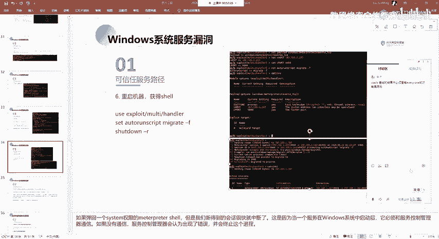

他会在这边对吧？他得到这个绘画之后，筛选ID6，然后他会自动的去做这样子的一个mig杠F，也就是它会自动的去迁移到一个进程当中。然后的话他会得到这样子的一个呃绘画。

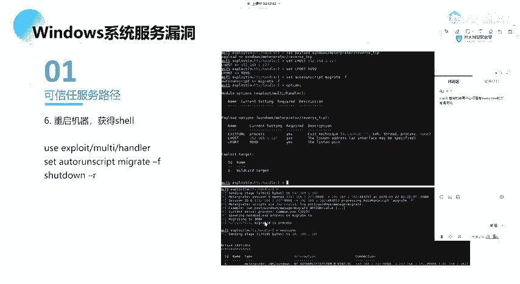

Okay。

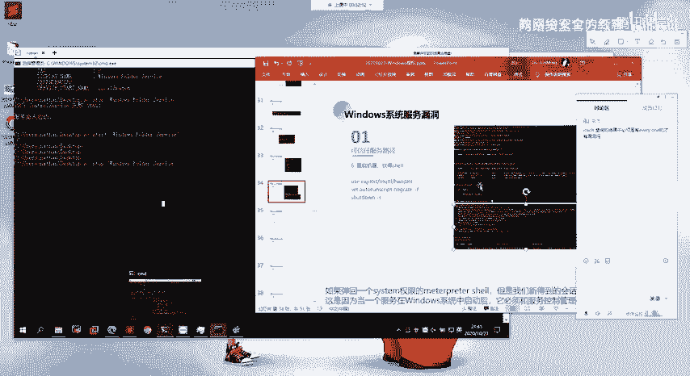

这是一个就是呃去利用这样子的一个可信任服务路径的这样子的一个漏洞来去进行一个提全。