# 2024网络安全系统教程！清华大佬花159小时讲完的网络安全系统课！别再盲目自学了，学完即可就业！零基础入门网络安全！（渗透测试／漏洞挖掘／CTF／黑客技术） - P87：74.不安全服务提权.mp4 - 教网络安全的红客 - BV1ft421A7Nj

好呃，第二个的话就是这个不安全的服务权限。呃，关于这个不安全的服务权限的话嗯。这个的话呃我这边用文字做了一个解释，我们主要的话就是看这边，就看这里。就说我们的这样子的一些呃。

像比如说我的一个java的一个升级程序。像这种程序的话，它的它是它的一个系统服务程序，它在加载的时候都是运行在我们的一个系统权限上面的。然后呃像这一类的这一些程序的话。

它以一个系统的一个权限去进行一个运行，对吧？那么呃。

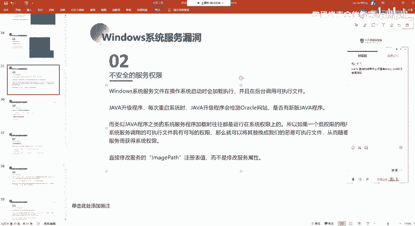

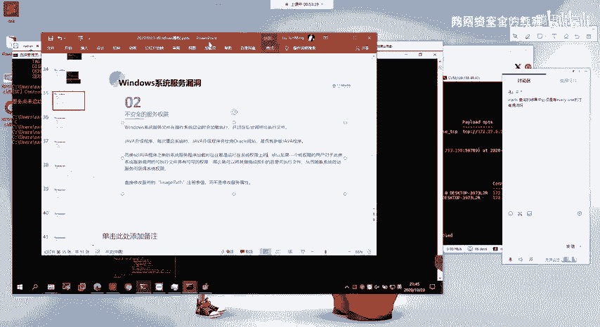

如果我们一个第一权限的一个用户，然后对于这类的这种系统服务调用的这种可执行文件，具有一个可写的一个权限。那么我们可以将其替换成我们自己的一个恶意的可执行文件。然后的话他就能够去随着系统的启动。

然后的话来得到他的一个系统的一个权限。嗯。然后在这边的话，我们是通过直接去修改服务的这样子的一个。呃，imag pass的一个注册表值，而不是去修改它的一个服务属性。就其实呃。我们。

具体来看一下这样子的一个步骤吧。首先的话第一个就是第一步的话，我们利用这样子的一个工具来去检查易收到工击的这样子的一些服务。呃。

这一个工具的话就是它的一个呃它是那个windows系统的一个呃工具套件里面的。然后这这一些工具的话，它都是windows系统啊，不都是温微软微软的这种官方的这样子的一些工具啊。

它是对呃一些就是对我们windows系统下面的一个。就是作为一个工具箱吧。做一个工具箱，它提供了就是一些啊其他的一些啊。呃，就是。怎么说呢？看。嗯。嗯。喺预前内容里面有。这个一个工具套件。我是瞎的。

Okay。对。Yeah。嗯。就是这一个。这个的话他是嗯。就是一些应用程序啊，它的一个应用程序的话，它是就是呃用于它每一个工具的话，它有对应的这样子的一个功能。然后它的这一个功能的话。

它是用于就是呃解决呃windows系统上面的一些问题的这样子的一些工具啊，就是这种故障排除工具。然后的话它汇总到了这个套件当中。这个套件当中的话，它有。存在有很多的这种可执性的一个。呃，应用程序。

Yeah。就是像这样子，这这边的话就是它的一个可行程序的一个套件。然后它每一个程序的话，它都有对应的一个功能。然后在这边的话就是我们用到的话，就是他的这一个我们用它的这一个工具来去检查呃。

就是容易受到我们这边的这一个呃攻击的这样子一个服务。然后这边的话。我看一下。

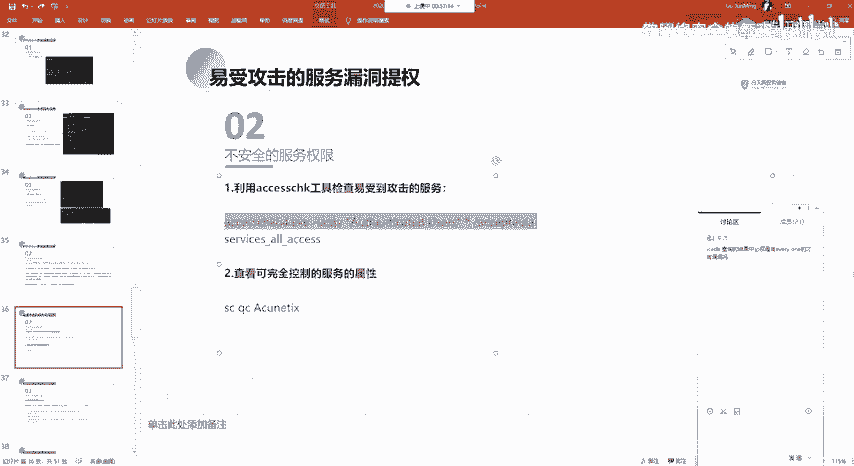

我这个的话我就不去，我直接在这个系统上面去做这样子一个操作。

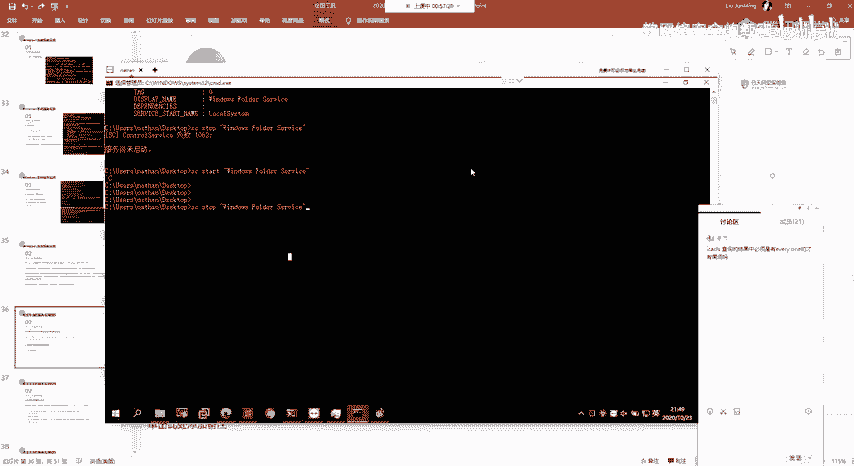

就其实际的话，我们首先第一步的话需要把这个工具对吧？通过我们这边得到这一个绘画。

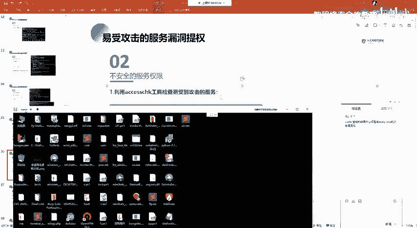

我们这边得到规话，把它上传到他的一个呃上传到这边的一个系统当中，对吧？然后的话我们再去进行一个执行。

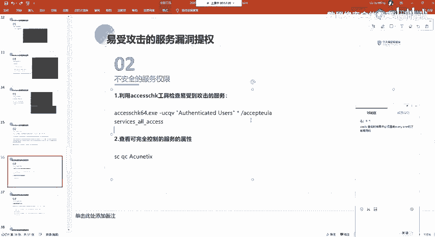

我这边的话那个就是。搞快点啊。

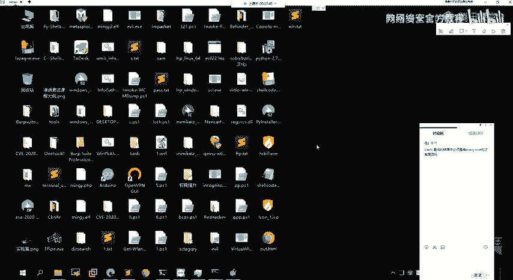

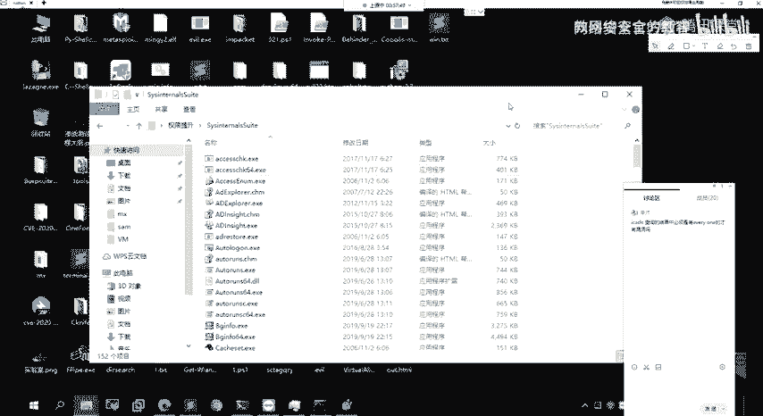

我直接在这边执行对吧？然后执行之后的话，他会有这样子的一个信息。这些信息的话其我们主要找的话，就是这一个就这一个service or access。

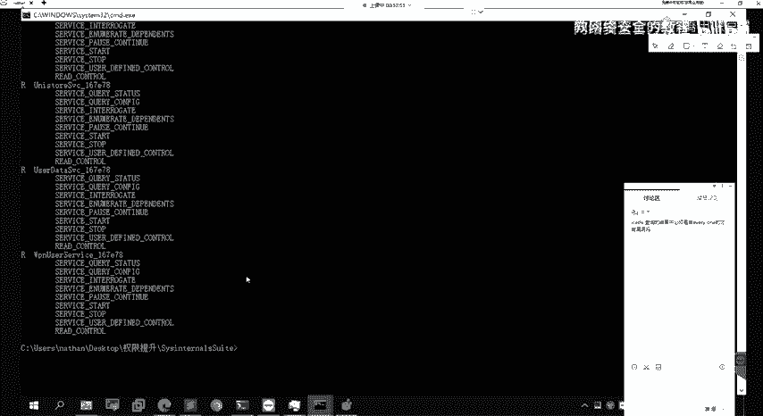

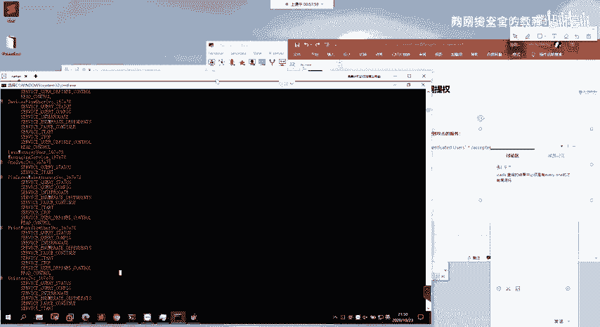

就是这样子的一个属性。

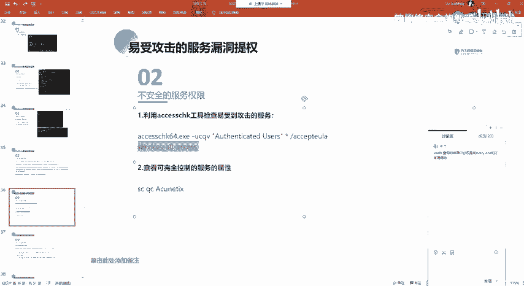

然后其实在这边的话，他有列出了这样子的这么多的这一些啊。这些服务对吧？它对应的这样子的一些啊权限。像比如说s query state等等的这样子的一些呃stop start。

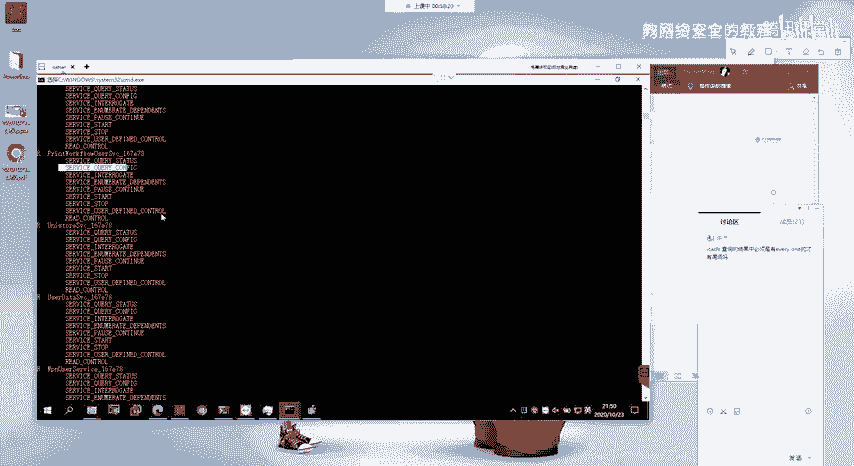

然后在这一话我们主要要找的就是这个service or access。关于这个的话，就是。嗯。Yeah。这边的这一个。可以。这里这里这边的这个service O X的话。

它意思就是我们对啊我们的这一个服务，它的一个属性，它拥有一个完全的一个控制权。然后还有就是呃。嗯。还有就是这个呃这个al的U，它是指window系统当中所有的一个用户名密码。

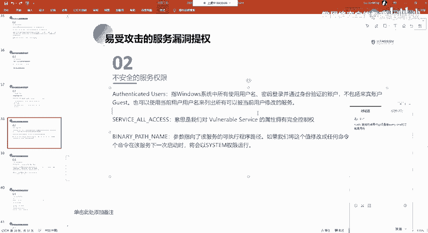

这一个就是账户。

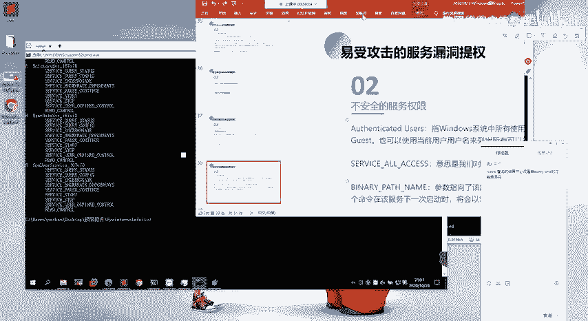

嗯。系有点高。

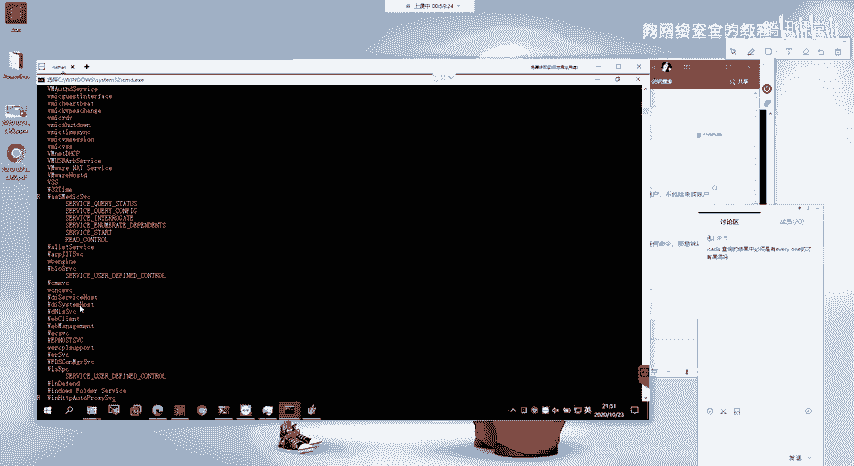

然后还有第三个第三个的话就是这个banary pace内。这个的话就是这个参数，它是指向该服务的一个可执行程序的一个路径。然后我们在这边的话就需要去知道他的一个这样子的一个路径。

然后的话我们在这边其实就是要改的话，就是改的这边的这个ban pace name。就是我们将它的这样子的一个属性，把它更改成任意的一个命令。然后的话我们再去启动这一个服务的时候，它就会去启动。

它会去找到这边的这个banbalance name。就原本的话它是一个可执行程序的一个路径，它会去啊启动它，对吧？然后在这边的话，如果我们把它改成命令之后的话，它服务启动的话。

它就会去执行我们的一个命令。而且它是一个s的一个权限去进行一个执行的。好呃，在这边的话。我以这边的这个就是我以这边的这个ACUNETITX的这个为例啊。就这个的话是呃AWVS的这样子的一个服务啊。

服务名好，我通过呃S cq c。

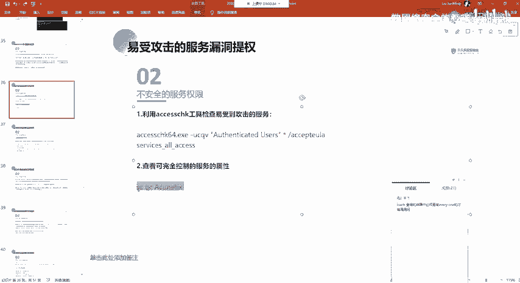

就是来去查看。还去通过这样子这个命令去查找这个呃AW院这个服务，对吧？他的这样子的一些信息。前面其实也有说了，对吧？像他的一个t type就是what start就自启动的，它是随着系统启动而启动的啊。

主要的话就是关注这边的一个 name这个的话这边的话就是表示是我们这边的一个可执行程序，它的一个路径。就其实这边的这个呃这一个服务啊，这个服务它的一个呃执行的一个程序的话是这个也就是执行这个程序的话。

它会有它会启启动为这样子的一个服务对吧。The。然后呃，这边的这个程序路径就是这一个。

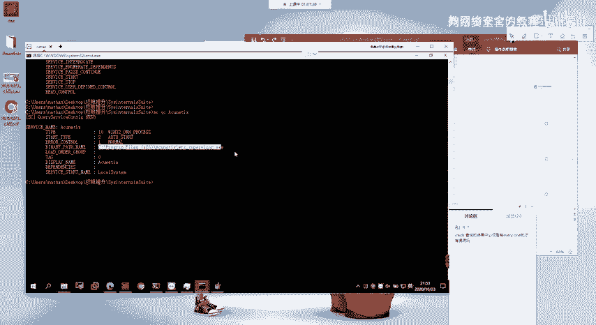

其中的一个文件名是这个对吧？然后我们在这边的话，就是说如果我们找到了这样子的一个呃找到了这样子的一个服务，就是比如说就是这个服务。然后的话所有的一个service access。

也就是它有这样子的一个属性。那么他有这样子的一个属性的话，那么我们就能够去对这个服务的一个属性拥有一个完全的一个控制权。也就是我们当前是一个普通用户，对吧？我一个普通用户。

我也可以去更改他的这样子的一个属性，也就是这边所列出来的这样子的一些属性。

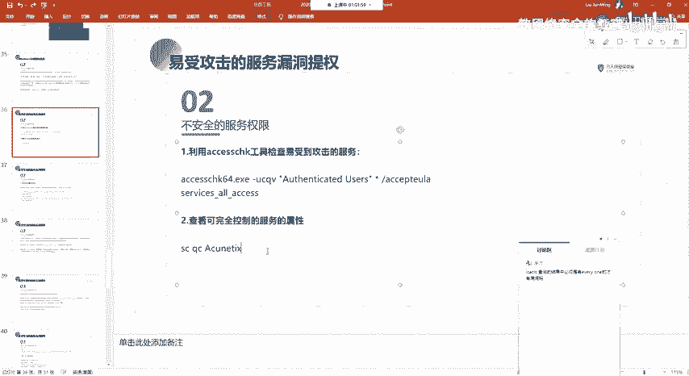

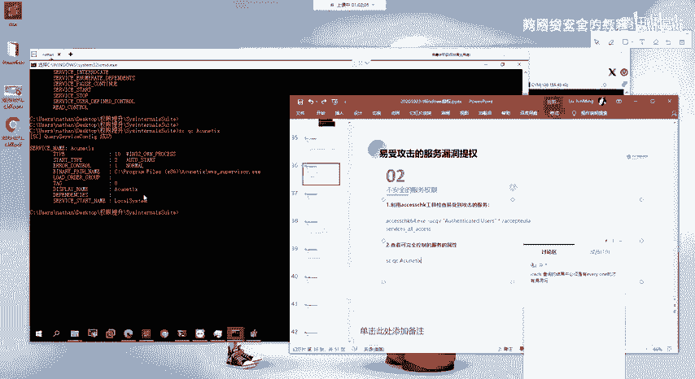

然后这这边的话，他还有就是一个。地方的话就是刚刚说的对吧？我们改这边的这个值的话，这个参数的话我们可以把它改成命令，任何的一个命令。他启动服务的时候，他会去进行一个执行。

那么实际的我们实际的一个利用的话。我们实际的一个利润的话，就是我们可以把更改他的这个服务配置，然后的话去进行一个命令的一个执行，对吧？原本的话它是指向的这一个程序的对吧？

我们在这边通过SC来去对它做一个配置。又更改这个服务，它的一个b pass。嗯，所以的话这边的一个兵pa始的话，他是其实就是指向的就是这边的这一个。呃。name它的这一个参数，它所对应的那一个呃值的话。

就是这边就这一个 pass。好，我们把它更改成像比如说在这边更更改成为一个let yield。来去添加这样子的一个update user的这样子的一个用户，对吧？然的话对他做一个。

启动就是对他做一个服务的一个重启。然后这边的一个服务重启跟前面也是一样的。就是我们就是你普通用户的话他没有权限去进行这样子一个操作。所以的话你需要去呃。等待这一个服务的一个重启。

或者是呃重启它的一个系统重启。因为他的一个服务，它是随着系统的启动启动的。呃，当然的话其实像这边去添加这样子一个用户的话是比较繁琐的对吧？然后我们其实实际的话可以就是。

我们前面的话已经上传了上传了一个那个可执行的一个程序，对吧？然后我们其实可以在这边把它把我们的一个命令改改为就是启动那个我们的那个木马的那个文件，对吧？那么它重启服务的时候，对吧？

它就会去启动我们的那个码，找到我们的那个码去执行，而且是一个stem的一个权限去执行的对吧？

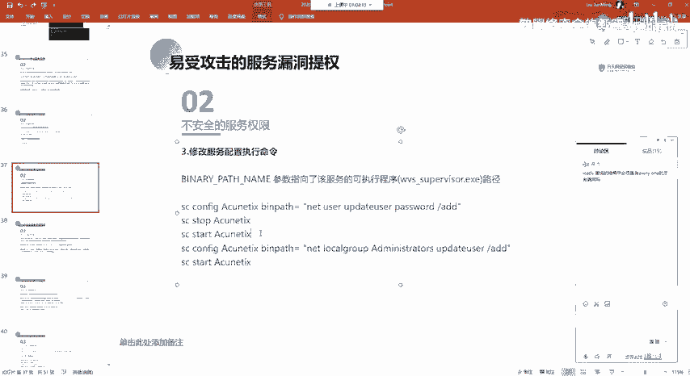

然后呃在这边的话呃。

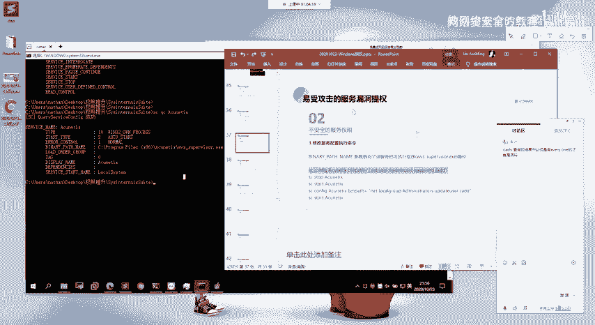

我以这个为例。主要的话就是给他演示一下吧，好吧，然后我这边的话已经更改成功了，对吧？然后注意的话，我当前是以管理员用户去那个的，就是呃我中间的话，我就因为我这边的话，这个服务的话，它其实是。

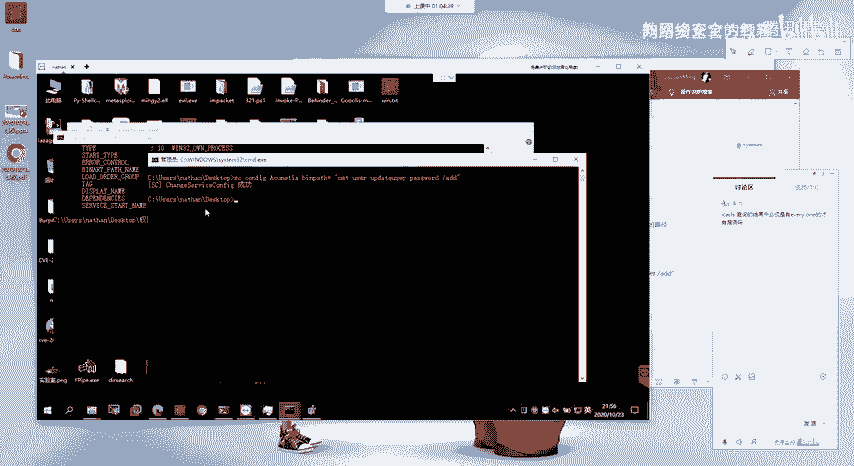

假设他假设他是存在这样子的一个漏洞的是吧？那实际上他就实没有的。呃，为了给大家演示嘛，就是。

然后我这边的话就以管理员的一个权限去更改它。然后更改之后的话，我在这边去啊进行一个重启。就是啊。首先的话net user去查看一下，我这边的话是这些用户对吧？然后我去通过SC去。那我。先停止掉这个服务。

你只要这一个。没。啊，已经停止掉了。然后的话呃我再来去启动啊。启动之后的话，他有这样子的。显示失败了呀，我们可以通过那些要准来去查看一下。然后其实我们的那一个就是就跟前其实前面一样的一个意思嘛。

因为我们这边的话更改了他的这个兵pa，也就是更改了这边的这个属性。然后他是这样子一个命令，而不是我们的那个可执行程序的一个路径了，对吧？所以的话在这边的话。而，不是这一个对吧，这边记一下。

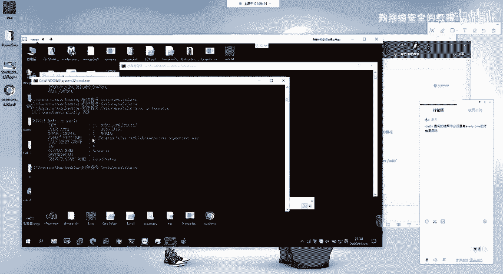

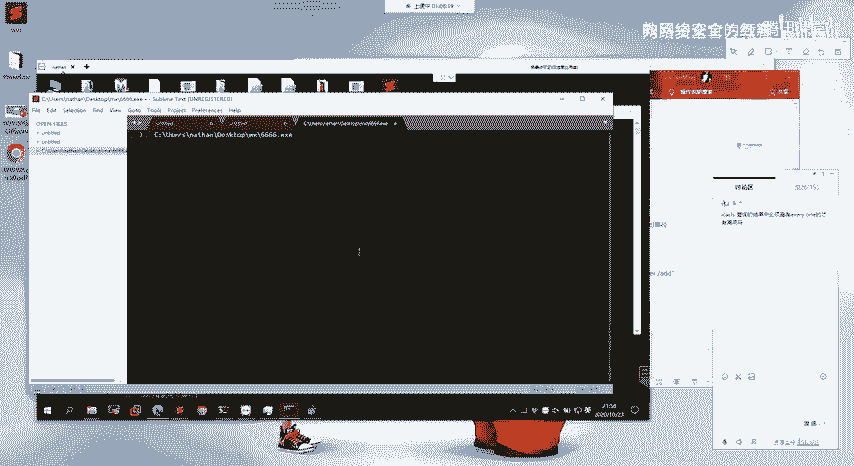

所以的话他在这边的话，他会与去控服务，他没有去响应启动啊，控制的一个请求。也就是没有与我们的那个控制管理器去进行一个那个嘛。但是实际的话，他其实是已经执行了我们这边的一个命令，对吧？

他添加了这样子的一个用户。对吧。

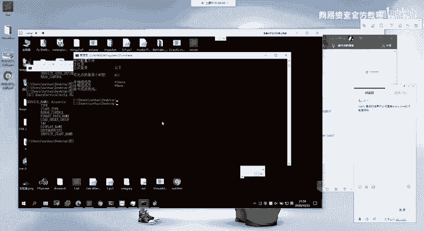

然后的话我们可以把它添加为一个管理员的用户。这边的话我就呃不再操作了。然后以及我们可以就是把它改成又启动我们的那个启动我们这边上传的这个码，对吧？

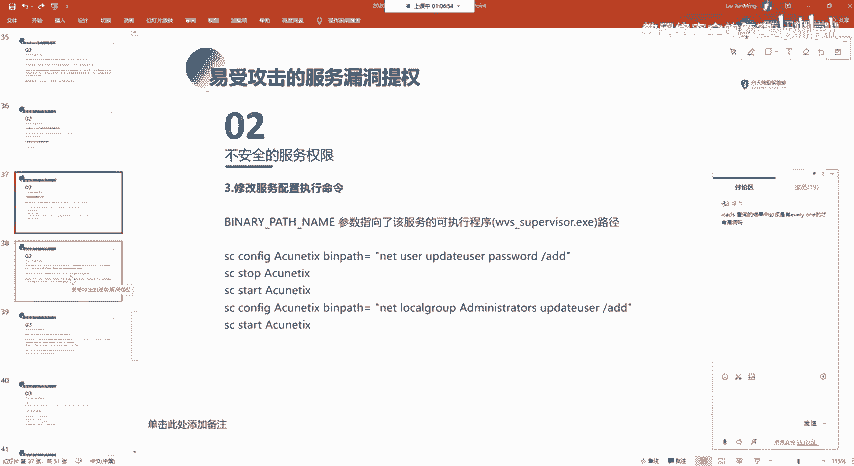

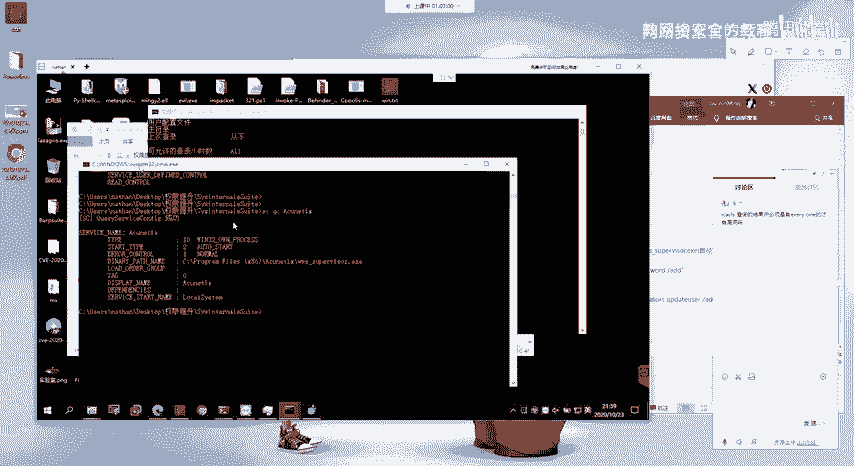

然后的话我们就能够去在MSF里面去得到一个CM的一个需要。

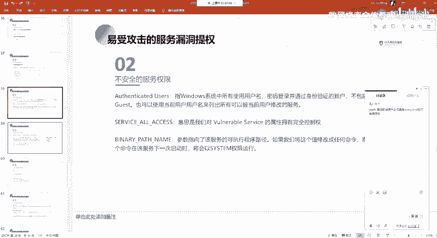