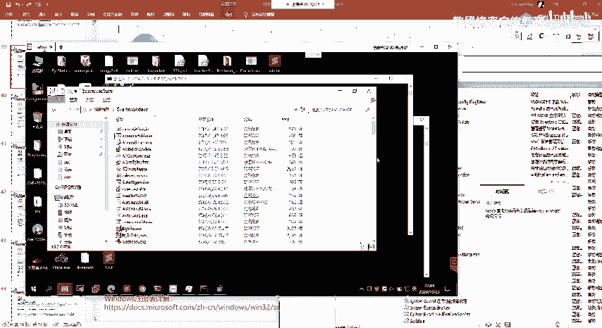
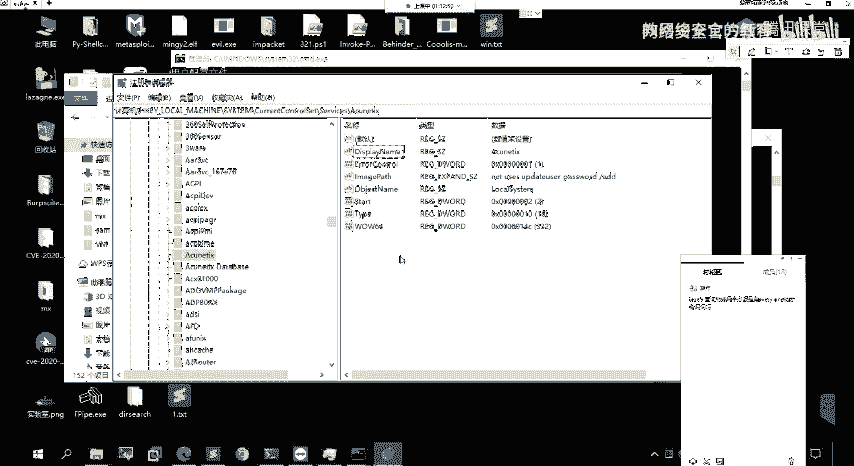
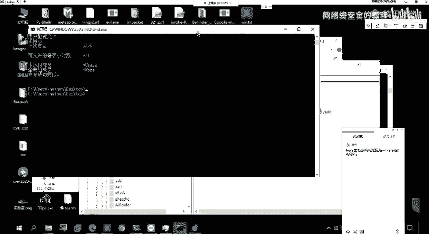
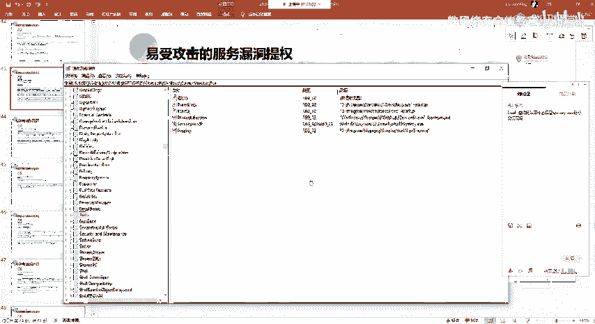

# 2024网络安全系统教程！清华大佬花159小时讲完的网络安全系统课！别再盲目自学了，学完即可就业！零基础入门网络安全！（渗透测试／漏洞挖掘／CTF／黑客技术） - P88：75.不安全注册表权限.mp4 - 教网络安全的红客 - BV1ft421A7Nj

这是第二个。第三个的话就是。不安全的一个注册表权限。呃，关于注册表的话。大家呃了解吗？然后的话如果大家不了解注册表是什么的话，呃，我这边的一个预习内容里面给了这几个链接啊，大家去看一下。

这边的话他详细的介绍的就是注册表的一个大概的一个信息。就注册表的话，他是呃。它是windows系windows系统里面的一个核心，就是你可以把它理解成一个数据库。而这个数据库里面的话。

它就是包括了有这么多的一些信息，就是你问的系统里面记录的种你呃软件的一个安装，对吧？硬件硬件的一些设备的一个信息，对吧？软件信息。还有你的一些管理的一些配置信息，网络设置等等的这样子的一些信息。

它都记录在这样子的一个注册表当中，也就是这样子的一个数据库当中。他他的这样子的一些。比如说呃设备硬件设备的这种说明啊，状态信息数据对吧等等的这些信息，他都记录在这个注册表当中。

然后注册表当中的话有这样子的呃分支。分支结构。然后呃其实注册表的话，大家可以呃win加，然后IEGDD。打开这样子一个注册表的一个编辑器啊。

然后我们在这边的话就能够去看到所有的这样子的一些注册表的一个分支。在这边的话总共的话有这样子的5个分支，对吧？跟这边的话是一对应的。然后这5个分支它分别对应的一个作用。在这的话我就不多说了，呃。

大家自己了解一下，好吧。嗯。然后以其他的一个注册表的一个存储的一个方式。呃，主要的话就是。嗯，它的一个结构吧，在这边的话了解一下注册表的一个数据结构。首先第一个话就是跟进，主要的就是5个。

其实就是我们前面说的5个那个分字，它的一个啊名字就是它是一个跟进。就是这边这5个是5个跟件对吧？然后的话指件子件的话有多个子件，还有镜子项，就像一个目录当中有桌多个子目，还有多个文件，对吧？

我们随便打开一个跟件，它下面的话有这么多的一个子向子件，对吧？比如说这一个这个指尖下面有这一些，对吧？Okay。就相当于就是这个目录下面有这一些目录嘛，对吧？Yeah。

然后的话静静值项静值项的话就是我们的这一个键键，比如说我这一个键对吧？它这一个键下面的话就有这样子的一些静值项，就是它由这样子的三个部分组成名称、类型数据，对吧？这就是禁止项。

然后的话我们大概的了解了什么是注册表之后的话，我们来看一下就是。呃。在windows当中，与我们服务相关的这样子的一些信息，它都是存储在这样子的一个注册表象当中的。就是这一个。然呃。

在这边的话还要就是说一下这一个。这边的这一个。LKLM对吧？然后这边的1个LKM的话，它其实我们可以看到我刚刚的话是直接复制的对吧？呃，复制的这样子的一个那个。然后其实你回车之后的话。

它其实跳转到的是这个HK local。嗯，mat对吧，就其实他的这个LKM的话，就是等于这边的这一个。这个跟进就这个这个跟进。然后他的这个写法的话，它就是HK的话就是HK嘛。

然后的话local就是取代L以及LM以及M对吧？就取到它的一个首字母就表示这样子的一个跟进。然后我们在这边的话呃可以看到就是在这一个指下指径下面。在这一个svic这一个指针下面，对吧？

它有这么多的一些呃。这样这么多的一些直径对吧？然后这这边的话它存储的信息的话，它其实就是我们的这样子的一些服务服务的一个信息，就是我们这边的这些服务的一个信息。像比如说我们找到那个呃。我们刚刚的那个。

啊，我这边没有。

是在。

在我这边。Okay。Okay。是呃，你同样的还是以这个对吧？我们找到这个符。然后这个服务的话，它的这一个子件对吧？它的一个净值净值的话就是这一些净值项。然后我们可以看到这边的这一个对应的一个信息。

它其实跟我们前面通过SCQC去查找的一个信息，它其实对应的对吧？

然后在这边的话，我们可以看到有这样子的一个im pass。这个imagine pass的话，其实我们前面的话改的就是这边。对吧我们改的这样子的一个那个属性，它的一个参数的话，它的一个值的话。

它存储到了这一个imagage pass的这个名称，就是名称为imagage pass它的一个呃。他的一个值的话就写到了这边了，对吧？然后其实我们重启这个服务的话，他就是他会去执行这样子的一个命令。

然后的话其实呃就是我们可以在这样在这一个注册表当中去查找这样子的一些服务的一个信息啊，对吧？然后的话如果呃就是说如果他他的这样子的一个注册表的这一个呃。好。Yeah。这边的这一个。Okay。

就是说他的这一个注册表，我们是有权限去进行一个更改的对吧？就其实像比如说在这边。我们其实刚刚改的这一个东西，它其实也存在了注册表当中，对吧？我们更改的这那个banly配pa。对吧然后的话他改的这一个值。

它同样的是存储在这个注册表当中。那么我们如果说有对这个有对这一个服务，他的这个注册表这些净值向有操作的一个权限，对吧？那我们可以直接更改这边的这一个imagage pass，对吧？

我们可以直接去更改他更改这边的一个呃。他的一个数据更改我们为我们想要的这样子的一个命令，对吧？那么我们同样的能够去实现前面的那个呃操作。所以的话在这边的话，我们需要去找到。

就是说我们要能够去对这样子的一个呃某一个服务，他的这个这个注册表，它的一个净值的话是有权限去做一个修改的。对吧，所以的话我们需要去找到对应的这样子的一个权限。就有权限去操作的这样子的一个服务。

然后这边的话我们需要去呃经常就会用到这样子的一个工具，就这个s本。三百零。SL的这一个工具啊，SUBSL这一个工具。这工具的话，它它是能够去呃紧锁就是说服务。呃。

他是能够去检查我们的一个注册表的这样子的一个权限。🤧嗯。通过这样子的一个工具，能够去检查注册表象的一个权限。如果对注册表象，我们有写入权限的话。

那么我们可以直接去编辑这一个imagage配的一个值来去更改服务的一个可执行路径。然后注意的话，在这边其实在这边呃。这一个不安全的注册表权限跟前面这个不安全的服务权限。就是大家要啊分开啊。

就我这边的话其实有特意给了这样子指的一句话，对吧？嗯。Okay。呃，这边的话。不反了吧，这边的话应该是就是说我们这边修改的话，是他的修改的一个服务的一个属性，对吧？这个应该是。在后面啊。Okay。

放在这边，就是我们这边的话是呃直接通过修改服务的这个image pass的一个注册表值啊。就我们找到我们有这个权限进行一个修改。嗯，然后呃不是去修改服务的一个属项，就是前面这边的话是我们找到。

这样子的一个服务他这个服务的话，我们有对他的一个属性有一个完全控制的一个权限。所以的话我们可以去修改它的这样子的一个呃服务的一个属性，对吧？然后在这边的话就是说我们找到这样子的一个呃。

能我们普通用户能够有权限去进行一个对他的一个注册表去进行一个编辑的这样子的一个权限，也就是一个写入的一个权限。然后的话找到他对应的这样子的一个服务。

那么我们就能够去修改它的这个im pass的一个值来去达到跟前面一样的一个效果的一个操作。然后具体的一个。反法。首先的话我们通过这个工具嘛，我们需要去查找它的这样子一个权权限嘛，对吧？

然后其实查找的话就是这一个啊服务下面的这样这样子的一些服务的一个权限，对吧？然后其实在这边的话，我这边它是以一个veable service啊，就是表示呃能够被利用的这样子的一个服务。啊。

其实我们要查找的话，就是要去查找。这边的这一个servs这个指径下面，对吧？这个指定下面所有的这一些服务，它。他的一个权限。然后的话如果我们找到了这样子的话，我们就能够去进行一个啊更改。然后更改的话。

我们可以通过IGA就是说在命令函下面的话，我们可以通过这一个方法来去进行一个注册表的一个修改。然后的话呃在这边的话，我同样的以这一个为例啊，就是我通过呃修改这一个。

ACNSUN这个AWV这个服务它的这一个净值。像。呃，我们来看一下这个完整的一个命令，就是这样子的啊，我这边的话是通过这样子的一个方法，就是首先MSF生成一个A的这样的一个可执行文件。

这样的话你也可以生可以生成一个要。然后的话上传到目标器上面，这个生成的这个A的柚子的话，它的一个功能其实就是一个单一的一个功能。他的一个功能的话就是呃添加一个，就说他执行之后的话，他会在本地添加一个。

账号添加一个我们这边生成的时候指定的这样子一个账号。Yeah。然后的话呃。我们这边的这个命令的一个意思啊，我们来看一下。首先这一个杠T的一个选项就是表示我们的这边的这个呃type。

因为其实前面的话我们有说了，就是净值项的话，它有三个部分，对吧？就是它的一个类型，它的一个名称以及它的一个呃仓一个。那个就他的一个数值，对吧？数据。然后在这边的话就是杠7的话，就是表示它的一个类型。

我们可以来在这边来看一下。啊，就是类型我们可以看一下这一个imagage pass的，它的一个类型就是这一个对吧？我们可以看一下，就这个。然后我们指定的一个类型的话，就这个。因为我们要改的话。

就这个imagage嘛，就名称为这个的。就干预的话，就指定我们的一个名称。干低的话就是指定我们的一个数据，就我们这边的一个这边这边的一个数据。然后我这边的一个数据的一个值的话。

就更改为了我们这边所上传的这边的这一个ad柚的这一个可执行程序的一个路径，对吧？Yeah。然后我们通过这样子的一个，因为我们以普通用户也能够去更改他的这样子的一个注册表，对吧？

那我们这一个命令的话是可以去执行的。然后的话更改为了。他那一个imagage pass，我我们这边的一个木马。然后当这个服务他去进行一个重启的时候，他就会去呃，就是说他会进行这样子的一个呃加载。

他会去加载我们这边的这一个。嗯。重启之后的话呃，我们的这一个程序，它会以一个系统的一个权限执辖。Okay。就铜年的话生成反弹西尔的一个pload的话，呃，要注意去自设置自动的一个清理进程。呃。

这边的话这个我就不不去操作了，好吧。然呃第三个呃还有的话就是。一些特殊的一个注册表的一个项啊，一些兼职。呃，再这个的话就是这个al run，al run的话就是自启动。就其实呃就其实大家可以。啊。

右键这边的一个任务管理器，对吧？然后在这边有一个启动，启动这边的话就记录了有这样子的一些东西。在这边的话就是我的这一个当前计算机的一个呃自启动的一些项。然后这边的这些项的话。

它其实就记录了记录在了我们的这一个这些的注册表当中。像比如说这边。我们打开这边打开这边的话，可以看到在这边有这样子的一些呃镜止项。对吧有这样子的一些镜子啊，像比如说everything。还有。

我的这样子的这一个程序啊，对吧？他是一个自体的，就他记录在了这边，然后。记录在这一个注册表象下面的话，有什么作用呢？就是说它会随着我们的一个系统的一个启动而启动。

然后的话所以我们。呃。如果说我们能够去像这样子的一个镜子下下面去写一个这样子的一个程序，对吧？那么我们就能够去在他的一个起。程序他在他的系统每次启动的时候。

他都会去执行执行一遍我们的那个呃呃我们的那个可执行程序，对吧？那我们就能够去得到对应的一个权限。好呃，像在注册表当中的这种自启动箱的话，我们呃也通常用来做一个权限的一个维持，对吧？

