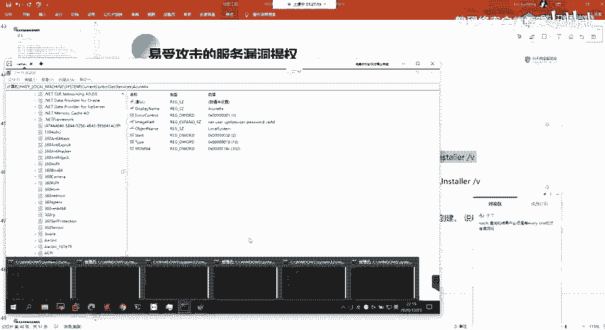
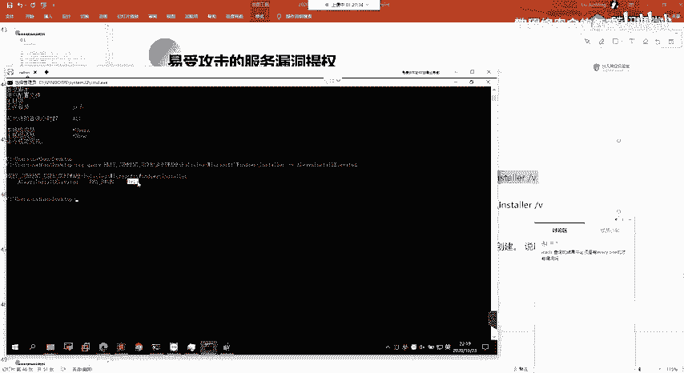
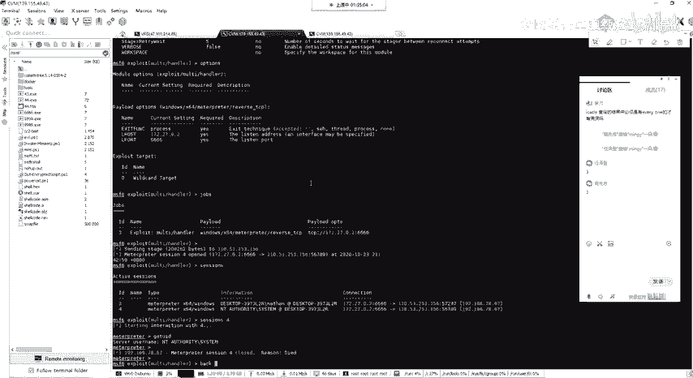
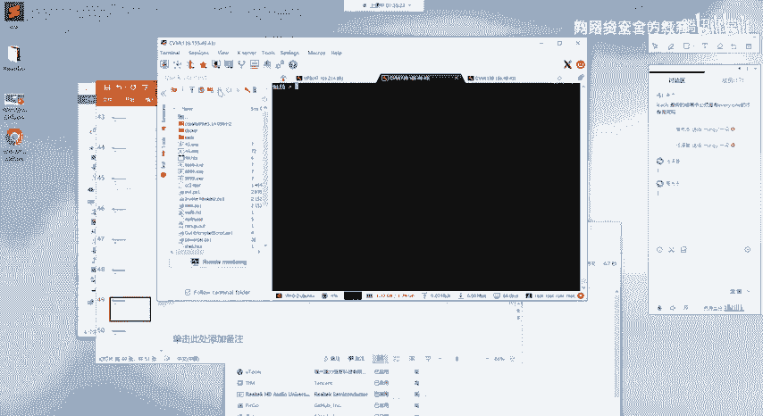
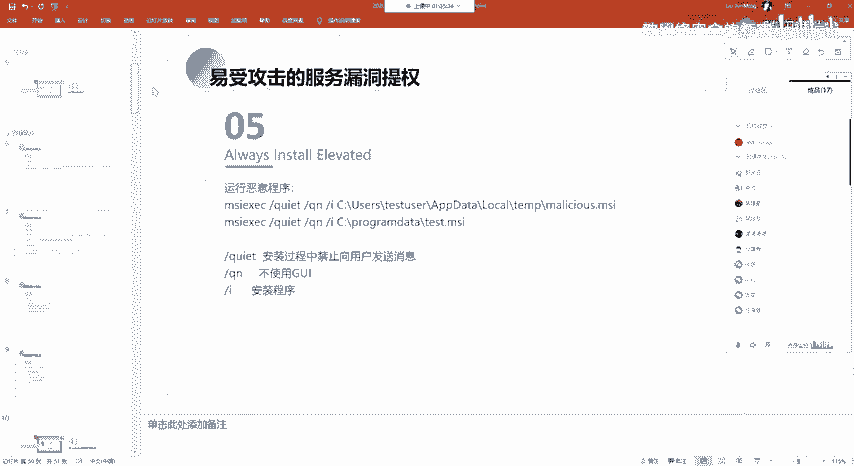
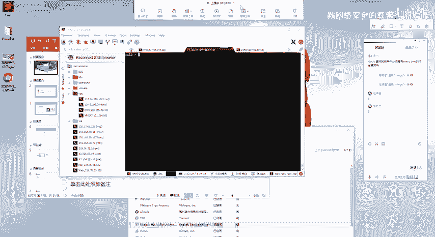

# 2024网络安全系统教程！清华大佬花159小时讲完的网络安全系统课！别再盲目自学了，学完即可就业！零基础入门网络安全！（渗透测试／漏洞挖掘／CTF／黑客技术） - P89：76.其他易受攻击服务提权.mp4 - 教网络安全的红客 - BV1ft421A7Nj

🤧。然后还有呃第四个的话就是不安全的一个文件，文件夹的一个权限。呃，关于这个的话，这个跟前面那个就是呃就是不安全的一个服务路径的话是。比较相似的，他的一个就是我们同样的就是。啊。

就是说我们利用的是他的这个服务，他的这个呃可执行程序所在所在的一个路径，我们是呃有这样子的一个权限的对吧？我们可以去做一个修改，那么我们可以尝试直接替换它的这一个可执行程序。

就比如我们可以简单的用这样子的一个反向pa的来替换我们这边的这一个路径下面的这一个可执行程序文件，对吧？然后的话它启动服务之后的话，我们就能够有一个sem的一个权限。这边的话跟前面类似。对。

就是呃我们要检锁的这个文件夹的一个目录话，就是这个，对吧？就是这一个可执行程序路径所在的这一个目录下面，我们可以尝试去把它的一个可执行文件，把它替换成我们的一个呃把它写要的一个payload。啊呃。

以及第五个呃，也是最后一个了。第五个的话就是这个all installstore的。嗯。😊，这这边的这个呃提全的一个利用的话，它是就是说利用的这一个利用的这样子的一个权限。

就是任意用户以这样子的1个NT system的一个权限去安装这1个MSI。当然的话呃前提的话就是你开启了这样子的，就是说你的一个目标系统，它是开启了这样子的一个呃权限啊，开启了这样子的一个策略。

就这个 always installstore。如果说开启了这样子的一个策略设置的话，那么就是说在windows系统下面，我们通过这个MSI啊。

不通过这个windows的inter去安装这样子的一个呃MSI的这种文件的时候。他就会去呃以一个sstem的一个权限去进行一个执行。所以的话如果我们发现了有这样子的一个设置的话，我们可以就是。

使用这样子的一个方法，就我们直接用MSF去生成一个这样子1个MSI的一个文件。然后的话我们来去进行一个执行。我们以普通用户的，我们以普通用户去执行这样子1个MSI。那么他再去安装的时候。

他会以一个呃系统一个sson的一个权限来去安装。然后的话我们生成这个马SI的话，它呃包含我们的一个呃木马。木马后门对吧？那么我们的一个木马的话，它就会以一个st统的一个权限来去进行一个执行。呃。

关于这一个策略设置的话，就是我们可以通过这样子的一个方法来去判断，就是能通过IEGcherry。来去主要的话就是查看他的一个注册表现的这里，他的一个呃名字是这个。

然后的话呃我们这边执行之后的话，他在这边的话有这样子的一些返回返回值，对吧？在这的话，其实它返回的话就是我们的一个那三三个部分，对吧？我们的一个名字，我们的一个类型，我们的一个呃数据。

如果说数据是这个0X1的话，就表明这边的话是开启了。

就说明我们的这一个策略的话，他是已经启用了。如果说是错误，系统无法找到这样子一个注册表象的话，那么就是这一个注册表象值它没有创建，也就是它的这个策略，它是没有启用的。就是说如果你启用了这个策略的话。

它就会有这样子一个注册表的一个值。呃，我们也可以我们可以通过这样的一个方法去进一个启用。然后具体的一个利用的一个方法的话，就是呃生成这样子1个MSA的1个恶意程序嘛。

然后的话呃畅传到目标机上面去进行一个执行。执行的话我们就能够去得到相应的一个的一个权限。Yeah。呃，在生成这样子的一个呃MSI程序的时候的话，呃，跟前面的话稍微有点不一样。就是在这边的话。

我们首先需要去生成一个执行配漏的一个访弹需的一个配漏的。就是我这边话是这样子一个E一个程序，以及这样子一个程序包，就这样1个MSI的一个程序包。好，首先的话我们先生成这一个payload是吧？

然后生成了这个payload的话。我们还要去生成一个就是说生成1个2页的1个MSI。嗯。嗯。Yeah。嗯。申请一个这样。申成一个阿一等于个 m，然后。呃，生成的一个方法呢。

就是像这样子杠F指定我们的1个MSI就是生成1个MSI的一个格式嘛。然后我们的一个配load的话就是这一个windows的1个EXE。然后这一个 payload的话，它的一个意思的话。

它就是呃如果你执行了这个MSI，他就会去呃调用我们这边他会去执行我们这边的一个命令。我们这边执行的一个命令话，就是我们这边的一个配load的。也就是我们前面所生成的这个配load的。嗯。然后。

我们需要把。然后的话我们需要把这两个呃文件都上传到我们的一个目标机器上面去。然后的话我们再通过呃这样子的一个方法。MIEXEC来去执行我们这边的1个MSI的一个程序。然后执行这1个MSI程序的话。

它一执行对吧？执行之后的话，如果说启用了那个策略设置，它就会以一个sem的一个权限去执行我们这边的一个payload。因为他的这边的这一个安装程序的话，他的一个。

他的一个目的的话就是去执行我们这边的一个payload。然后的话是一个系统的一个权限去执行。呃，然后还有的话，其实我们可以通过这样子一个方法，就是更简单的，就是我们直接。呃。

生用这样子一个AU的一个配load来生成一个就是。创建一个账号的一个呃这样子1个MSI的1个 payload。然后的话，他在这边执行之后的话呃，在这边执行之后，对吧？执行之后的话，他就会。

一个C什么权限去创建一个这样子的一个账号。嗯。呃，在这边的话，这边的话就是他的一个呃，分别的一个执行程序的一个方法。以及在这边的话呃，给了这样子的三个参数。这三个参数的话主要的话就是呃。呃。

大家自己看吧，好吧。就是不使用GUI的话，就表示呃我们在这边去安装的时候，他没有这样子，没有1个GUI的一个宽。嗯，就是没有这种界面嘛，然后。干Q的话就是静默的去安装嘛。

就是没有不会像我们就如果我们执行，对吧？我们执行的话，它会有相应的一些信息，它会显示出来。然后刚来的话就是指定我们那一个安装程序。嗯。呃，以上的话就是我们本节课的所有内容，就是呃内容的话。呃。

其实说的也不是很多，但是。就是也还是有点多的。然后我这边的话其实讲的也是。呃，稍微有点快，我怕这边的话讲不完。好呃，大家我看大家有没有什么反馈啊。大家有没有什么疑问？嗯。呃，当然的话这边的话其实也是。

需要大家自己去动手做的，就你可能你现在的话可能也是没有什么。呃。没有什么问题吧，应该。嗯。嗯嗯嗯。呃，还在吗？诶。哦，还有人在听吗？呃，中间的话我没有呃，我没有去问大家有没有什么疑问。

就呃我觉得这边的话。其实我觉得我应该不用讲这么细了。就我这边PPT的话其实已经。已经写好了。当时的话呃想着还是。还是给大家讲一下吧。是。嗯。然呃，后面的这一些操作的话。

这边的话我就没有我没有去一的去尝试的呀，没有给他家去做一个演示了。呃，有问题的扣一没问题的扣2。然后呃自己课后做的扣3吧，好吧。呃，还是老样子嗯。

我怎么感觉现在有18个人。呃，除了这两位同学，其他同学是不是都都没在呀，是不是就电脑挂着，然后。没没在听啊。给我一点反馈。有人在吗？没有。还是。还是这两位同学。是呃。是大家有点懵啊，都听懵了吗？

。嗯，好吧呃。打咗未。大家没什么反馈的话，那么我就默认大家是没有问题了，好吧。反正有问题的话。有问题的话，还是老样子呃，找我问就行了，好吧。

然后等大家自己课后去操作吧。然后作业的话也还是老样子，就是把我课上讲的东西自己动手去操作一下，好吧。

自己去呃操作一遍。然后自己去理解。好，我们本节课内容的话就到这边。结束了。呃，大家早点休息吧。

呃，下课。