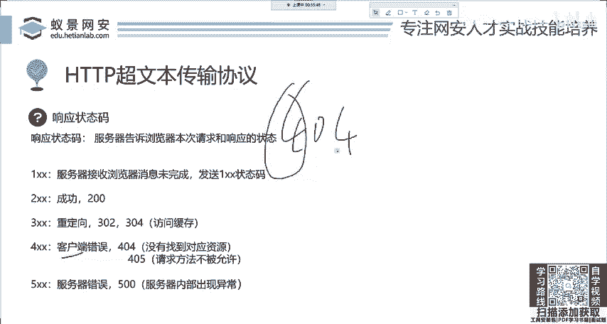
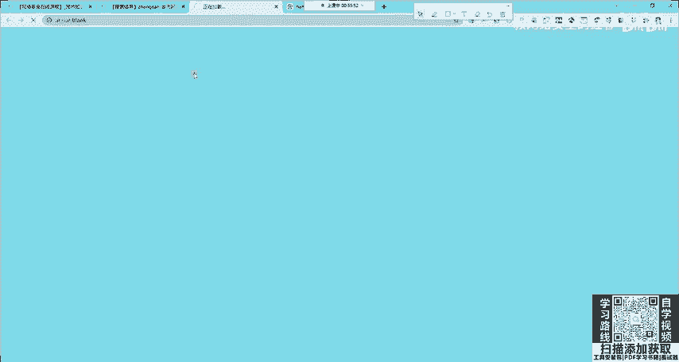
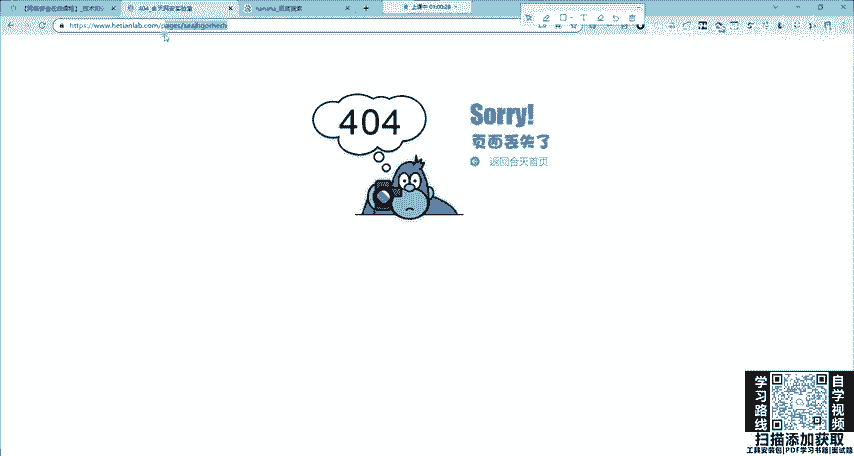

# 2024网络安全系统教程！清华大佬花159小时讲完的网络安全系统课！别再盲目自学了，学完即可就业！零基础入门网络安全！（渗透测试／漏洞挖掘／CTF／黑客技术） - P8：8.HTTP基础-响应码.mp4 - 教网络安全的红客 - BV1ft421A7Nj

我直前拿喊你令牌，别人认令牌不认人，懂吗？OK就是这cookie大家来了解一下。那下面呢我们。再来看这个请求消息，你了解到这里基本上没有关系。下面我们来看享应消息response。就是服务器在接收之后。

他给你显示啥呢？可你显示啥呢？首先显示的肯定有的图片，有视频，那这些图片视频怎么给你的呢？就遇到了这个响应消息，其实响应消息非常好理解啊。首先就是响应的协议啊，还是HTTP1。1啊，响应的状态码。

我们主要是看这个主要是看它。那后面呢就是响应的一些头，比如说把令牌给你，这个令牌就会在这个地方。然后呢，就是发送给你后面的这些图片呀、音乐呀、视频啊，以及网站的HTML以及GS文件啊。

都会在这后面一起发给你。这个就非常简单了。那下面呢我们就来看这个响应状态码到底是什么东西。响应状态码在这。这个响应体啊这个响应体就是图片、音乐、网站内容等等。我就直接忽略了。

OK我们下面呢来看享受状态码，这个地方大家都遇到过。如果你不知道，你就打开一个谷歌，你看404404大家都遇到过吧。而这个404是什么意思呢？我们先来讲叫客户端错误。出现四开头的错误。

代表错的是你懂了吧？客户端是啥，客户端是浏览器，你错了。现在我举个例子。

我们核天网盘实验室，现在正常的点击情况下是不会出现这个404错误的。

就不会出现这个404。嗯，错误的。那比如说我们随便输一个输一个。啊，我们回回车你会发现啊，这个时候报404，代表是谁错了，是我错了，浏览器错了，你看我随便打的，他根本就没有这个地方是吧？

就是说错的是你的清楚，这是4开头的错误。那这个响应状态码呀，非常的多，大家在百度百科能看到一堆，那基本上也都用不到，对这个同学说的非常对，请求资源不存在，这是客户上错误。而405也是非常也是非常常见的。

405叫做请求方法不被允许。比如说它本身是get请求，你现在非要用post它就不行。那这个行不行？不是你说了算，是别人服务器，别人网站的开发后端，他们说了算，你得按照他的来，他让你用get。

你就得用get，你非得改成po的，就是你错了，就是色用5，就是这个意思。啊，下面呢是500抽。5开头的错误，这个叫服务器错误。首先大家见到的，比如说像501502啊，这是最常见的，还有503哎504啊。

这四个是最常见的，还500就平常500。我先给你讲最简单的501501，你要记住，有5开头的是谁错了啊，就错不在你你现在再怎么再怎么整，你也打不开。错的是在服务器是在别人。比如说你打开百度一看500了。

那错的是百度，不是你一定要清楚谁在谁。啊，有的同学打开1个500的页面，还在那渗透是吧？首先。501501呢就是目标机器上面有代码写错了。比如说用零做分母了，嗯，别人写代码写了一个除除除法这样一个算法。

结果零变成了这个分母，这时候就501。为啥呢？零能做分母吗？做不了呀。服务器错了呀，他代码写会了啊第二个呢是502和503，这个今天啊大家可能都遇到过看微博，你就知道这淘宝崩了。

那双十一大家太能买了是吧？比如说看李佳琦的直播看不了卡，呃，或者抢票一看501什么503，那12306抢票的时候，那这个时候出现的叫做服务器错误，你也解决不了，你要等别人恢复，等别人抢的少的时候。

你再去访问这个页面才能够打开这个没有解决办法。OK这是最常见的两个，大家应该记住了吧。然我们来看。下面第一个是一开头的一开头的这个非常特殊啊，它代表这个消息未完成。就是你上一次的response啊。

它没发完没发完这个客户这个浏览器啊，他就会再发一次request。这个这个状态码呢就是。这个响应的状态码呢就是一开头代表没发完的继续啊，这个东西非常少见啊，然后就是二开头，二开头的200就是正常访文。

你几乎打开所有的网站，那都是200就正常访问。然后是三开头，三开头也有很多呀，叫重定向。大家可能不了解什么是重定项。我现在举个例子，首先302大家最常见的。什么意思呢？比如说我现在想访问一个资源。

我想访问，比如说我想看电影啊，我想看电影，我找腾讯视频看电影。像我看电影呢，我访问这个网站。访问这个链接，这个链接会发现这个服务器在收到你想看电影的请求之后，他发现啊我做不了，我这个网站做不了。

那怎么办呢？我发现我做不了，但是有另外一个地方它能去显示电影。那这时候怎么办？它就会回显给浏览器1个302的一个响应包，告诉你，我不行，你去找他。

就浏览器接到之后就会乖乖的去跳转到能看电影的这个网站去浏览电影。这个东西在大家最常见的就是比如说你访问一个没有的地址，比如说你访随便访问一个地址，让它啪一下就跳转到又跳回到这个首页了。

那这个这个东西呢就是呃后端它做了一个处理，就是告诉你我现在你访问的地址不存在，我给你跳到首页。那这个时候发送的这个响应也是302，叫做跳转重庆项。

下1个304，这个非常少见，但是在部分的网站中，尤其是像百度腾讯这些大网站中是经常使用。304。就比如说我们在访问一个网站的时候，它会有大量的这个图片信息，这个图片，我们如果每一次去打开淘宝。

他都要去加载这些图片是不是特别慢呀。这图片动辄几百K，动辄有几M，而且不止一个就非常的慢。呃，同时呢如果这些图片它不会再更改的情况下，它会被存储到我们本地，就像你浏览器那缓存了一堆。

你用那个杀毒软件一扫一看能缓存都十几G，就是这个原因。它都给你缓存到本地的。那这个时候比如说这个浏览器又打开淘宝，还是向淘宝去请求，比如请求一个页面的一个详情图片。他现在去淘宝服务器发起请求。

说我要要这个请求图片。这个时候这个服务器收到这个请求之后，他一看一个图片啊，你在你机器的缓存里面有。你不要再问我掉了，你去访问你自己缓存的之前已经下载过过已经缓存过后的这个这个图片了。

你去访问这个呃浏览器收到这个请求之后，它就去从访缓存里面找到这个图片，并且急于显示，就避免了这个大量的网络数据的传输，这是304，都是重定向，就是重定向。好，这就是响应的状态码5种类型啊。

一开头的二开头的345啊，这几种响应状态码。大家不论你是学网络也好，还是学网安也好，一定要清楚这些。你不清楚的话那基本上没办法去做呀，基本上没办法去做。

