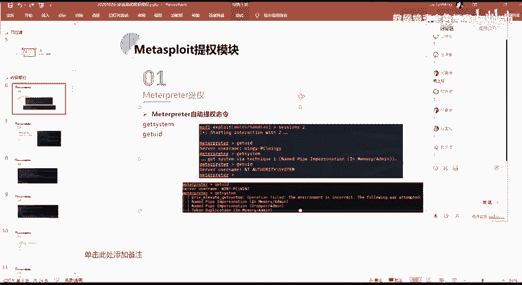
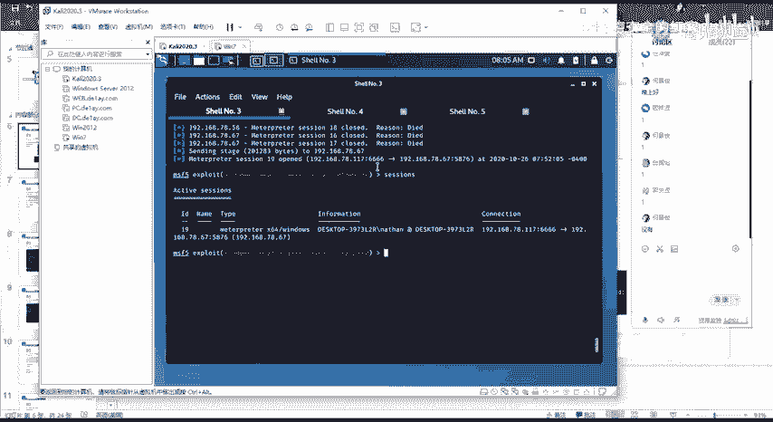
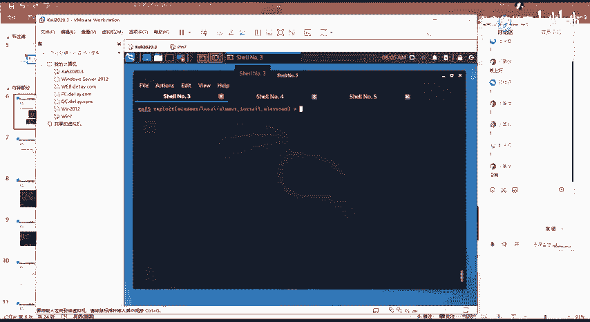
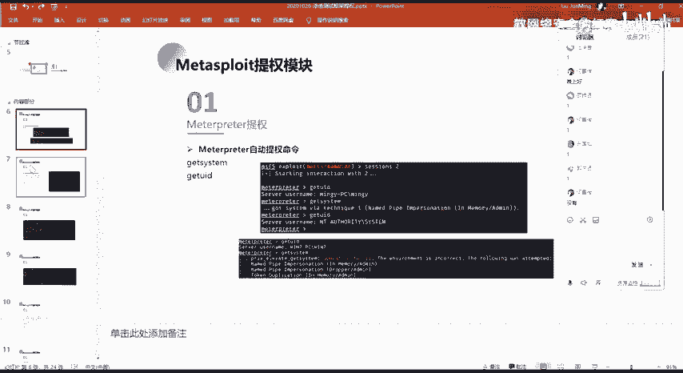

# 2024网络安全系统教程！清华大佬花159小时讲完的网络安全系统课！别再盲目自学了，学完即可就业！零基础入门网络安全！（渗透测试／漏洞挖掘／CTF／黑客技术） - P90：77.MSF自动提权命令.mp4 - 教网络安全的红客 - BV1ft421A7Nj

啊，没有问题的话，那么我们正式开始我们今天的一个课程内容。今天的话主要给大家介绍的是MSF以及CS下面的呃一些模块的一个使用。然后它的一个使用的话主要的话就是一些提群模块。呃。

上一节课的话给大家介绍就是windows系统下面的一些提全的一个方法以及技巧，对吧？以及呃比较详细的一些操作，对吧？呃，在本节课的话会就是说会有涉及到上面一节课的一个内容。主要的话就是在MSF这一块。

就说在上上面我们所讲到上一节课所讲到的windows下面的一个。windows系统下面的一些提全的一些漏洞，包括内核漏洞，还有服务漏洞的话。

在MSF下面它有对应的这样子的一个呃能够可以去直接去利用的这样子的一些模块。所以的话在本节课会一给大家就是说呃实际的操作演示一下。然后呃本节课的主要内容就是这2块。

第一块的话就是呃max的一些提全模块的一个使用，以及呃就是说给大家做一个介绍。第二个的话就是co strike，就CS这个。甚至说是框架的一些提全模块，以及它相应的一些啊。

就是说我们如何在4S上面去进行相应的一些提全的一个操作。呃，大家都知道就是说在前面也已经给大家讲过了，对吧？就是MSF跟CS的话，这两个渗透测试的一个提群啊不渗透测试的一个框架是吧？

然后我们大多数的一个时候的话，就是说在得到一个需尔之后，反谈歇尔的话，我们就是会去尝试去把我们的个反弹到这样子的两个M两个渗透测试的一个框架当中，对吧？因为它的这个框架的话，我们再去使用的时候。

它有很多的已经集成的已经现程已经写好的这样子的一些功能模块，对吧？我们可以能够去直接的去进行相应的一个渗透的一个测试，就说在测试的一个过程当中的话，我们能够去更方便的去进行一个啊使用。

然后第第一部分的话就是给大家介绍一下呃msport的一个提全模块。首先第一个就是我们常用的也是常见的这样子的一个mpri的一个提全。在这边的话，mport的一个自动提全的一个命令。

我们通常的话会去使用这样子的一个get system。对吧这个的话大家应该有去用过吧，就前面在呃。前面讲MSF的时候有用过吗？有用不的在讨论去QQ。

没有用过。嗯，没有用过吗？

啊，没有问过的话，那么我们在本节课的话会给大家介绍，好吧。

呃，这边的话我的环境稍等一下。

呃，等会再弄吧，我们先来。讲一下。呃，在这边的话嗯我会给大家就是说呃，我们先来看一下这边的这两张图吧。首先第一个第一个的这一张截图的话，就是我这边已经得到了一个筛选绘画，对吧？

然后的话我得到了这个绘画的话，我们可以看一下，我这边的话是一个普通的1个MNGY的这样子的一个用户啊，对吧？然后在这在这个时候的话，我们就是说我们是一个普通用户，我们想要去做做一个提全的话。

也就是说要把我当前的一个用户的一个权限作为就是提升到我们的一个admin，或者说sstem的这样子一个权限，对吧？然后在呃MSF的这样子的一个mat下面的话有这样子的一个自动提全命令。

就这一个get system。然后这个gety什么的话，它我们可以直接执行之后，然后的话我们就能够去得到这样子的一个是什么的一个权限。当然的话这是第一种情况。

而且就是说在去进行去呃使用这一个命令的一个前提条件。大家要注意，就是说你的得到这样子的一个用户的话，它是呃在一个这样子的一个管理员组。当然的话。你你的这一个用户，你在管理员组里面的话。

也不一定能够直接的提全成功。这个的话就是我们下面的这一个例子。我这边的话同样的是得到了这样子的一个绘画筛选，这样子的一个筛选绘画的。然后的话我的一个用户的话，同样的是一个普通用户啊，对吧？

这样子的一个win7的一个用户。然后我在这边的话，通过get system来去进行一个提群的话，你会发现而且就是说这样子的一个报错的话，也是我们通常会去看到的对吧？

就是说你要直接呃要能够或者说大多数情况下的话，我们可能直接get system的话是得不到这样子的一个的一个权限的。所以的话你这样执行之后的话，他会报这样子的一个错误。就是说你的这个操作的话。

它是失败的。也就是他的这个提群的一个操作的话，是呃无法去进行一个提群的。嗯。然后呃针对这样子的第二种情况，第一种的话我们是能够直接的去直接ge什，然后得得到这样子的一个s的一个权限，对吧？

这个的话那么我们就等于就是说我们的一个提全的一个操作就已经成功了，对吧？那么在碰到下面的这一种呢，我们怎么去进行一个解操作呢？对吧？

合诉。