# 2024网络安全系统教程！清华大佬花159小时讲完的网络安全系统课！别再盲目自学了，学完即可就业！零基础入门网络安全！（渗透测试／漏洞挖掘／CTF／黑客技术） - P93：80.upquoted_service_path模块.mp4 - 教网络安全的红客 - BV1ft421A7Nj

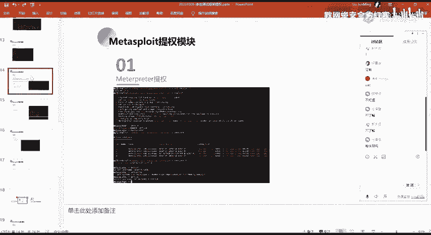

然呃，第二个的话就是这个un quarter service pace这一个模块。呃，这个模块的话其实对应的是我们上节课讲到的那个就是。呃，讲到了那个。

windows系统下面的一个服务漏洞的这样子的一个提全啊。

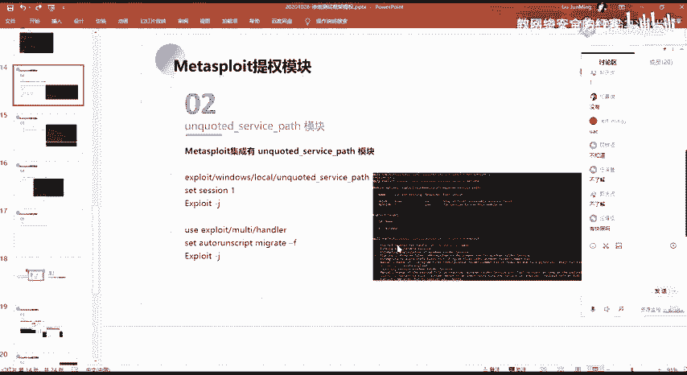

然后对应的在MSF当中的话，它就有这样子的一个模块。我们可以直接去进一个使用。呃，在这边的话，这个模块的一个使用的话呃，其实也就是。

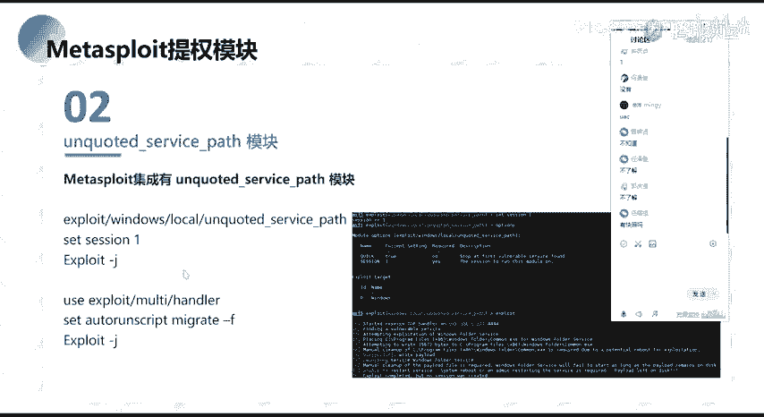

跟前面的话都是一样的，我们同样的就是需要去设置这样子一个筛选一，然后直接expo就可以了。

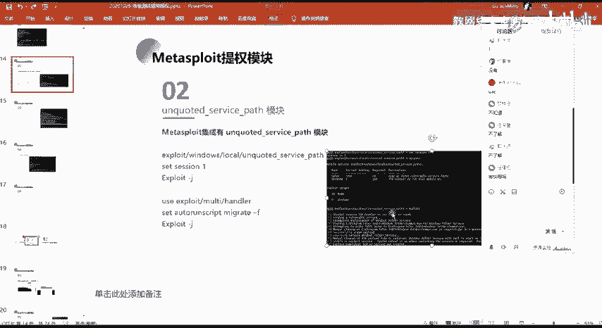

然后在这边的话呃，我们看一下这边的一个截图吧。

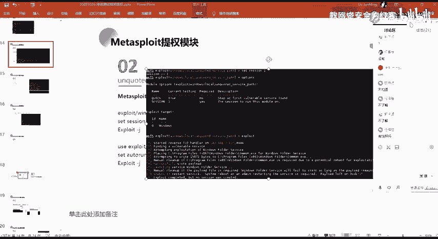

然后呃本来的话，我这边的一个靶机的话是我已经配置好了呀。

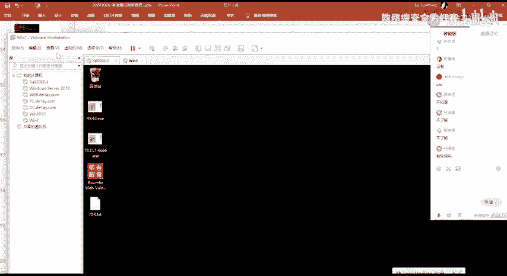

🎼就是我可以直接通过这个模块直接能够打成功。然后这边的话这边的话因为。前面的那个东西没了呀，我的这个快到这边的话。

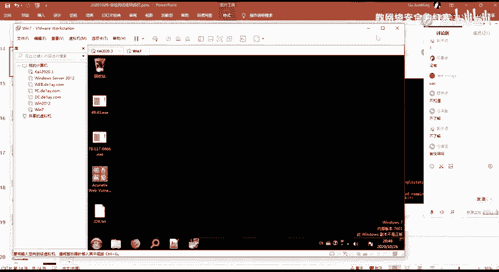

我的前面本来有很多环境的都没了。

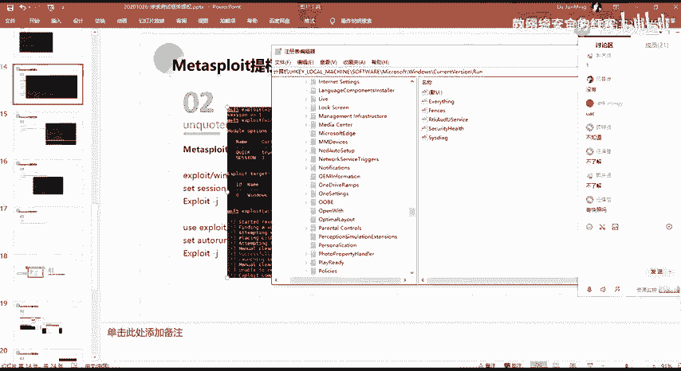

所以的话这边的话呃大家看我这边的一个截图吧，然后我给大家介绍一下。对。介绍一下这样子的一个模块，它的一个就是。基本的一个使用。在这边的话，我们直接呃设置设置一个筛选，然后直接exloit。

然后在这边exit之后的话，我们可以看一下，在这边他会去做这样子的一个操作，他会去找一个他会去查找我们的这个目标当中可以去进行一个利用的这样子的一个service，也就是服务嘛，对吧？

然后的话在这边可以看到他有找到像这边这一个这一个路径。这个路径的话其实就是我们呃在上节课给大家去讲的这样子的一个对吧？就是这边呢呃其实这个的话就是我做的一个配置，我做的一个环境配置。

就是自己创建了这样的一个windows429的一个service。然后这个s的话，它是存在这样子的一个漏洞。它的一个路径的话。

它是呃它是就是说它的它是这样子的一个un quality的unqu的话就是没有引号的。也就是说它的这个路径的话，它的这个路径的话，它是呃没有引号去进行一个包裹的这种。然后在这边的话，我们可以看到。

如果说它是没有这样子的一个引号包裹的话，那么他在去处理这样子的一个。就是说他在启动服务的时候，我们上节课的话有讲对吧？启动服务的时候，他会去紧锁这样子的一个啊服务所对应的这样子的一个B pass，对吧？

就是你的这样子的一个可执行程序的一个路径，然后他对这种他对这一个可执行程序路径当中的一个空格前面的这样子的一个字符串所对应的一个呃可执行程序，他会去进行一个加载，对吧？

然后的话他会一个一个的去查找一一层一层目录的去查找，知道找到最终的这样子的一个啊service。然后在这边的话，那么我们可以去进行对它的这样子的一个呃漏洞去进行一个利用。

利用的一个方法的话就是我们去查找到这一个路径当中的某一个目录。然后这个目录的话，我们需要有对它的一个写的一个权限，如果有一个写的一个权限的话，那么我们就可以去尝试，对吧？

在这边at尝试去写入一个这样子呃15872的字节的这样子的一个程序，然后把它写入到了这边的一个windows project这个目录下面，对吧？然后生成了这个程序名的话，就是一个commonXE啊。

就是这个。好呃生成的这个comment点X1的话。他会放到这个目录下面，对吧？然后放到这个目录下面之后的话，在这边的话有这样子的一个就是错误。这个错误的话，其实就是我们前上节课有讲的。

就是我们再去进行一个呃启动它的这个服务的时候，对吧？因为他的这一个漏洞话，要等他的一个服务重新启动的时候，他再去加载这个可执行程序路径的时候。

它才会去呃进行一个查找到我们这边所写入到的这样子的一个木马的一个程序，对吧？然后的话加载它还访他一个需要。那么在这边的话，我们是一个普通用户，所以的话我们没有权限去启动他的这样子一个服务。

所以在这边的话，我们需要去等待他的一个服务去进行一个启动。所以的话在这边的话他会是处于一个等待的一个状态。但是他这边的话没有筛选。嗯。然后呃其实我们可以通过就是说大家自己演示的话。

就呃就模拟它的这样子的一个服务的一个启动。就是你去启动它那个服务的话，那么他在这边的话是能够去得到一个筛选的。

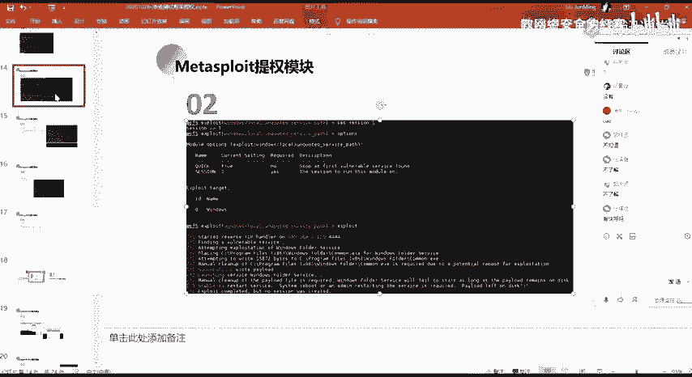

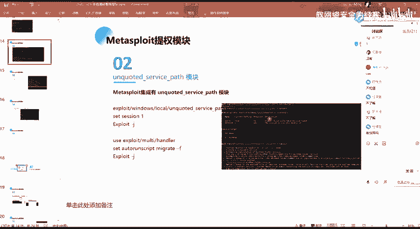

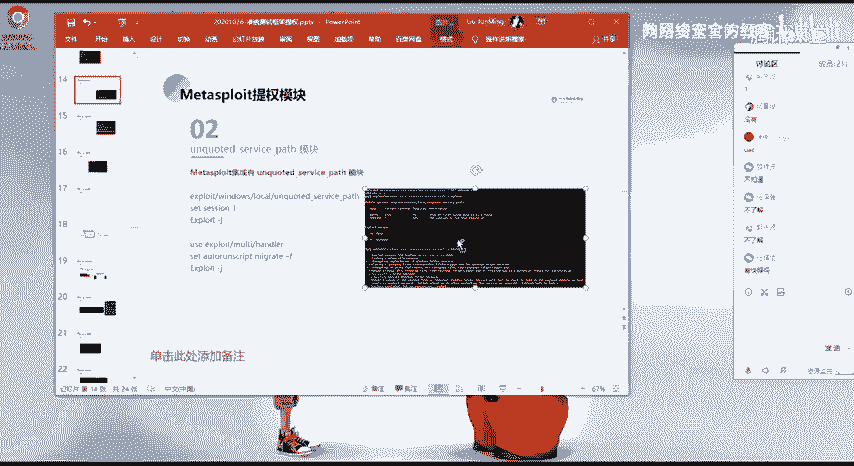

。好，呃这边的话哎因为黄建啊黄建的一个问题啊，就我。

就我另外一个机上面的话有环境啊，但是现在的话就是重新搞的话来不及了。然后呃在这边的话，我就不不不演示了。如果呃如果大家有有需求，有要就要求要看这个演示的话，我后面就是我用我另外的那个环境。

我啊可以录个屏，就录个视频，就是具体的一个步骤以及实际的一个效果给大家，好吧。然后这边的话我就不演示了呃。

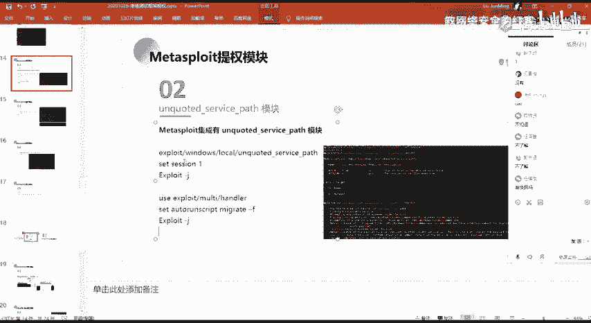

大概的看一下这边。

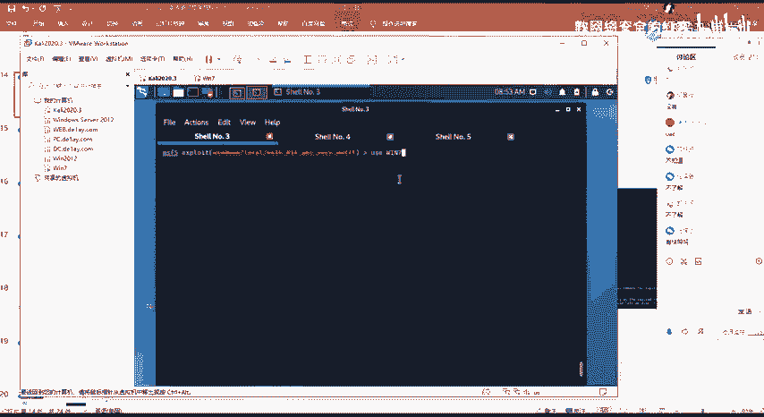

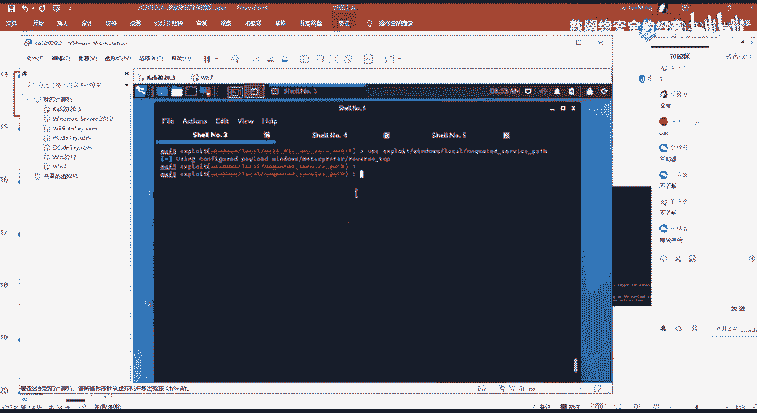

我们做这的话同样都是筛选摄这个筛选2。你错来的话会失败点。他会去查找这样子的一个和利用的一个服务。然后利用我们上节课所讲到这样子的一个logo。你看到这种的话，他没有找到对应的这样子的一个。然。

呃还有的话就是在这边要注意的一个点，就是呃我们这边的话再去设置这样子的一个her的时候，我们去设置这样子的一个。就说outto run script的这样子的一个脚本。

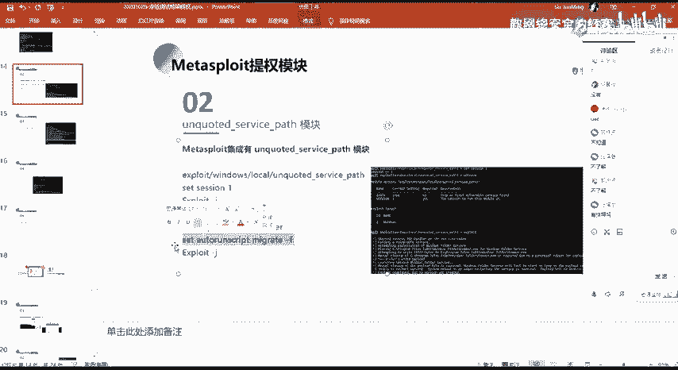

就我们在这边，其实我们在这里啊我们在这里我们执行对吧？我们利用成功之后的话，他这边是没有得到这样子的一个筛选，对吧？

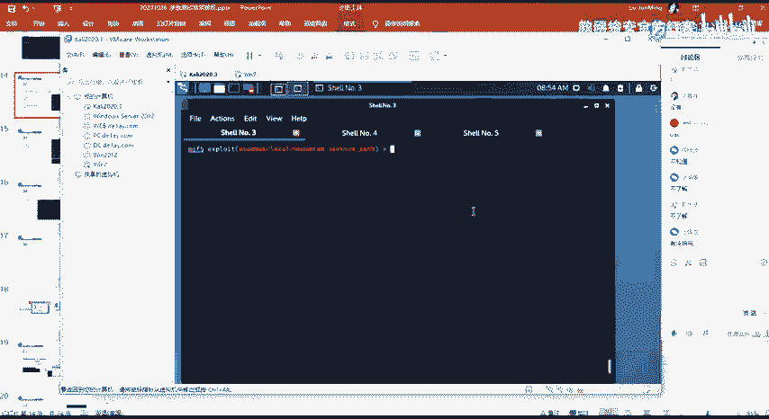

然，因为因为在这边的话，我们要等待它的一个服务的一个启动，对吧？但是在这边的话，你expoit之后的话。

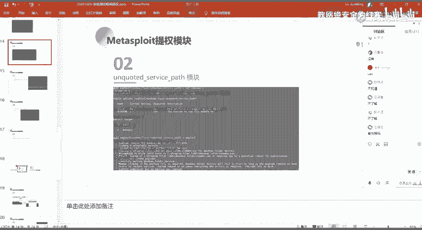

insport之后的话，他没有执行成功的话，那么我这边的话。它是无法去直无法就直接得到一个筛选方话。所以的话我们需要等待它的一个服务启动。等待服务启动的话，那么我们就需要去用去创建一个监听器，对吧？

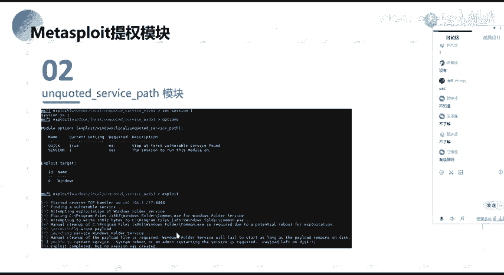

我们可以去创建一个监听器，把它挂载到就是放到后台作为一个jobs。然后我们。嗯。在这边的话，我们设置这样子一个Kload跟前面对应的对应的一个Kload是吧？然后的话我们想要去。

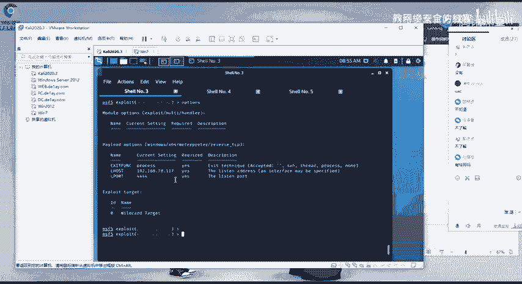

就是。没有。这边。在这边要去注意的，就是说我们上节课其实有讲。

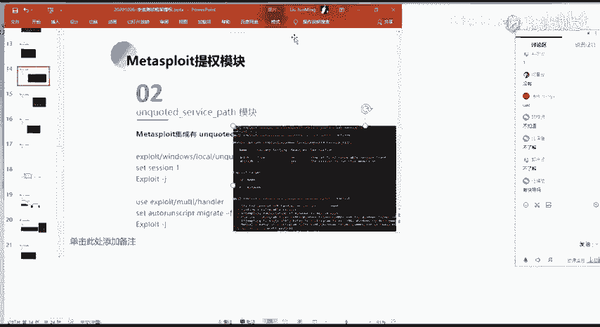

呃，我们在这边的话，我们得到我们生成的这样子的一个commentX啊，这个的话它不是一个服务的这样子的一个可执行程序，对吧？那么它去执行它执行加载之后的话，它会以一个s的一个权限去加载这样子的一个程序。

然后把它做一个服务。那么它不是一个服务的一个可执行程序的话，它会与那个服务的一个控制器去做一个通信的话，是无法去通信的。所以的话它会把那一个控制器，它会把这个进程终止的。那么我们在这边去加载对吧？

加载呃正确的服务之前的话，他会去加载这一个框本0X1。那么它加载之后的话，我们在这边就能够去得到这样的一个筛选。然后得到这个筛选的话，它会过一会儿它就会断掉。那么我们在得到这个筛选之后的话。

立马去执行一个这样子的一个mrate。make的话这个的话就是一个进程迁移啊，就是把我当前得到这个筛选的一个绘画的一个进程，把它迁移到另外的一个进程。就是说我当前得到这个筛选绘画的一个进程。

它是基于我基于我这边的这个commonEX1的这一个可执行程序的对吧？那么我这边的一个程序断掉了。那么我这个进程也就断掉了，对吧？那么当时的话。

我们可以通过就是说我当前这边的话已经得到了这样子的一个它的一个权限，对吧？那么我得到这个权限之后的话，我在它还没终止我之前的话，我做一个进程的一个迁移，把它迁移到我的一个就说其他的这样子的一个进程。

然后只要那一个进程，就是说系统的一个正常的一个进程，它不断掉的话，那么我的我这边的一个绘划的话，它就不会断掉，对吧？就是这一个。

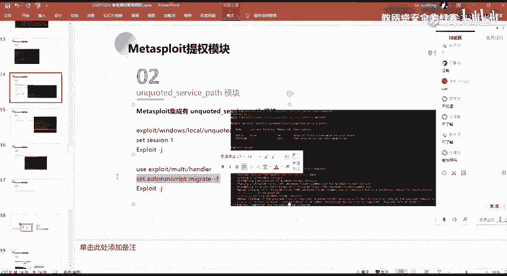

我们可以在这边呃通过。直接输入ADV然后tableable就Avis也就是高级的一个配置啊。在这边的话有这样子的一些选项啊。然后呃上节课的话有讲这一个ex个 exist onss on筛选对吧？

这个的话就是呃。就是把它设置为forse。这个默认的话，它是去啊，就去的一个效果的话，就是我这边的执行ex choice之后，对吧？一 choice执行之后，它会有一个jobs。然后这个教本的话。

它会在后台。然后的话我。我的一个payload我的一个payload来回您我这边的这个监听器之后，它得到得到一个筛选，对吧？得到一个筛选之后的话，它这边的一个jobs它就会exist。就是从自面意思。

我们也知道，就是他退以退出。也就是就exist on筛选，就是在尽力筛选绘画之后的话，我的那个今天的一个教本它就会exist掉。就所以的话就呃就是通常的话我们把它设为force，也就是只要那个绘话。

他只要执行执行的话，他就经历一个筛选，对吧？然后我的那个jobs话，它一直处于一个今天的一个状态，他只要执行了我的那个payload，我就能够去得到一个筛选。

然后还有它就这个alto run script。al run script的话这一个就是呃设置一个就是自动啊就是在我们得到绘画之后，得到绘画之后的话，它立马会去执行这样子的一个脚本。

然后这边的一个脚本的话，它会自动的去执行这边我所设置的一个mining就这个m杠F就是呃自动的去迁移我的一个进程到呃其他的一个进程当中。

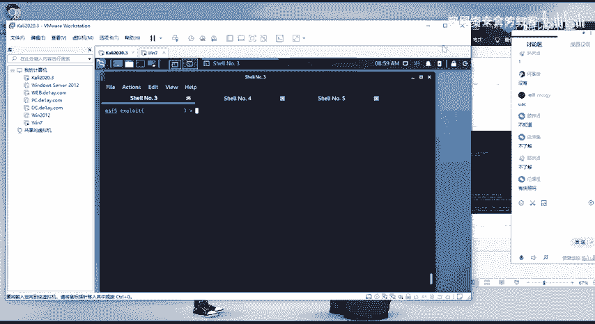