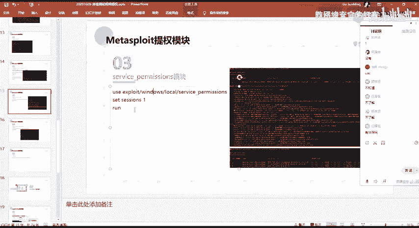
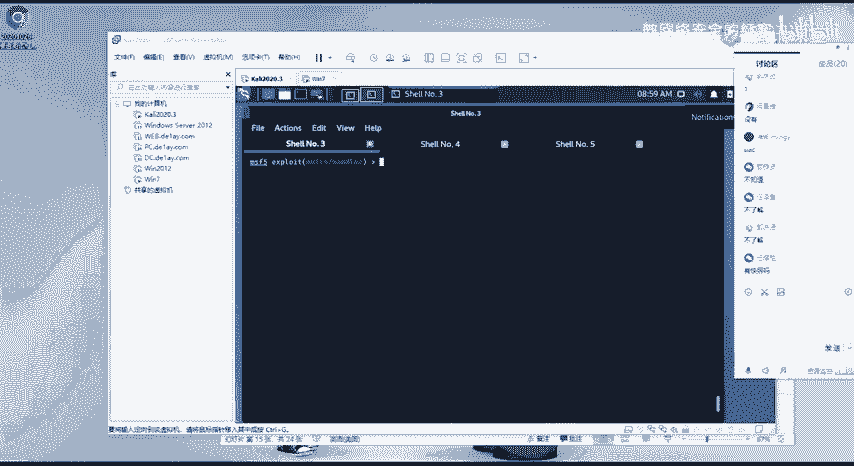
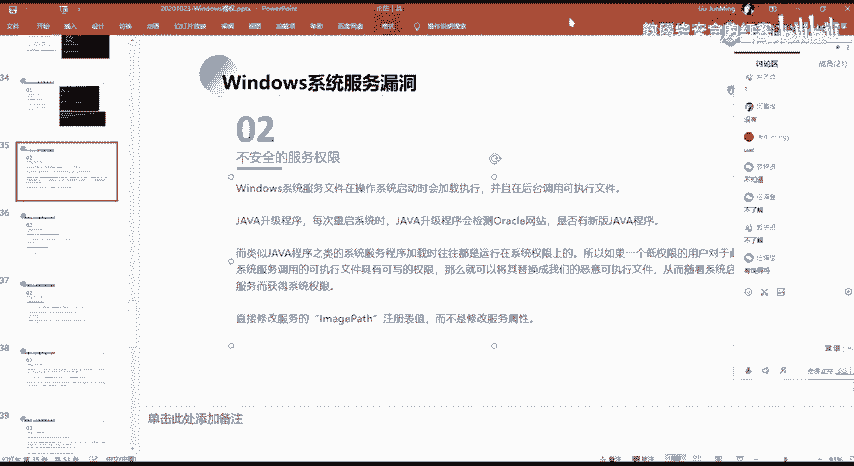
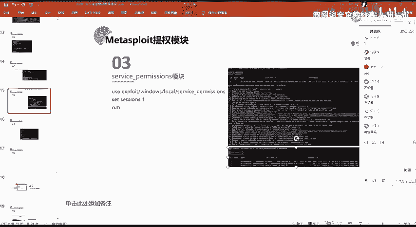
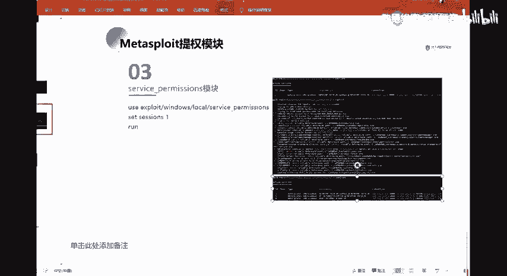
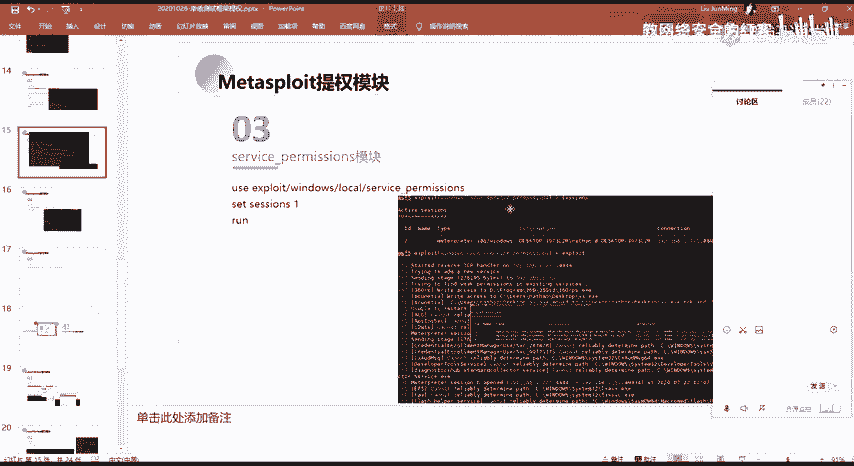
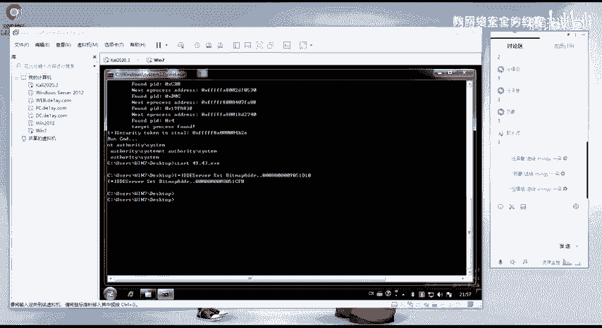

# 2024网络安全系统教程！清华大佬花159小时讲完的网络安全系统课！别再盲目自学了，学完即可就业！零基础入门网络安全！（渗透测试／漏洞挖掘／CTF／黑客技术） - P94：81.service_permissions模块.mp4 - 教网络安全的红客 - BV1ft421A7Nj

Yeah。然呃第三个话就是这个serv模块。这个模块的话跟前面对应的。就就是那个就是不安全的服务的。

呃，那个什么来着？

嗯。Yeah。呃，刚刚的话就是刚刚这个话其实就是这一个可信任服务键。就是他是利用他的这个缺陷。然呃，第二个的话就是这个。不安全的一个服务权限，就是利用他的一个服务权限的一个呃就是漏洞。

然后在这边的话，我们可以直接通过MSF它的这样子的一个模块去进行一个利用。就9点钟。

呃，我这边的话下一下。

嗯。呃，我这边的话忘记了忘记中间下课了，就是没没给大家休息的一个时间了。下次的话呃，大家提醒提醒我一下，好吧，就是到那个。到9点就是8点50嘛，8点50的时候就是呃中间休息5分钟嘛。好吧。

因为我这边的话，我讲着的话，我不会去看时间，我讲着讲着我就就就没有注意时间的话就忘了。好吧。就是呃大家有注意的话，在讨论区这边就是提醒我一下好吧。啊呃，这边的话是第三个。

这一个的话呃其实就是这个模块的一个使用。你这边的话就不演示了。呃。啊呃效果的话就是像这样子。然后其实在这边的话，我们看它的一个截图啊，就其实呃大家再去用这个模块的时候啊，用这一些模块的时候。

它其实有这样子的一个过程，对吧？这个过程的话，它其实就已经就是把它的这个脚本的一个就是利用的一个过程有写出来。当然的话具体的一个实现的话，它没有那个嘛。然后其实在这边的话，我们可以看一下。

它会有这样子的一个过程，就是。他会首先会新建一个这样子的一个服务。然后的话他会呃把我们的一个stature，也是一个payload，对吧？把它发送到我们的一个目标目标器上面去。然后这边的一个st的话。

他会去查找，就是we permission，就是在存在就是说在目标机上面存在的服务。他有这样子的一个就是呃。这个呃就是弱权限，就是他的一个权限，他没有做好的，没做好控制的这样子的一些服务是吧？

现在的话有找到像呃我我们的这边的1个360RP，还有ACUNE就这个A单名院士的这个。

他是可以去进一个写入的。然后呃在这边的话。我们找到这个就这个。这1个AWUSS的这个服务啊对吧？然后的话他把他把就是说他的这个服务程序的一个路径做了一个备份。然后的话他把它替换成了。

就是把我们这边的一个这边生成的这个。这边生成的这个stature，把它作为了一个替换。替换之后的话去进行一个执行。然后执行之后的话就能够去得到这样子的一个筛选。

