# 2024网络安全系统教程！清华大佬花159小时讲完的网络安全系统课！别再盲目自学了，学完即可就业！零基础入门网络安全！（渗透测试／漏洞挖掘／CTF／黑客技术） - P95：82.always install elevated模块.mp4 - 教网络安全的红客 - BV1ft421A7Nj

好呃，第四个话就是这个Oinstore。

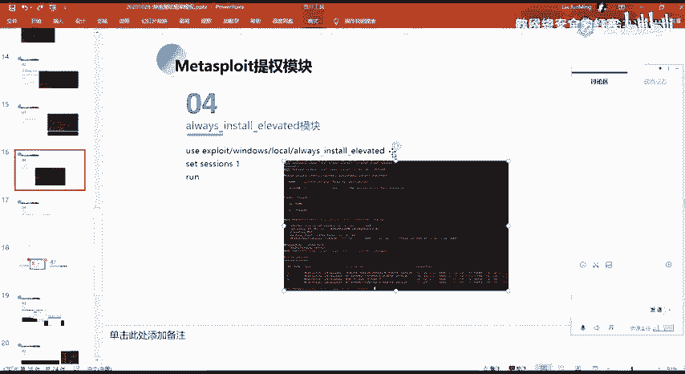

这个的话同样的就是对应的我们上节课的上节课的那一个就是呃。

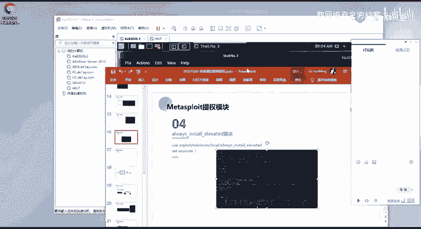

那个的内容。就是这个al store的就这个这个lo洞的话就是说。他在它的一个配置，它的一个策略配置的一个问题啊，就如果他的一个策略配置，它配配置了这样子的一个我为你说起的话。

那么他任意用户他都能够与一个s统的一个权限去安装这样子1个MSI。那么我们只需要去生成1个MSI。然后上传到物料机上面去执行。执行他的一个安装。

那么他就能够去以一个s统的一个权限去呃执行我们的一个payload。对啊。呃，在这边的话。我试一下。我这边环境出了问题，我我确定能不能成啊。就呃之前那个环境的话是肯定没有问题的。

是能够直接的去打成功的嗯。

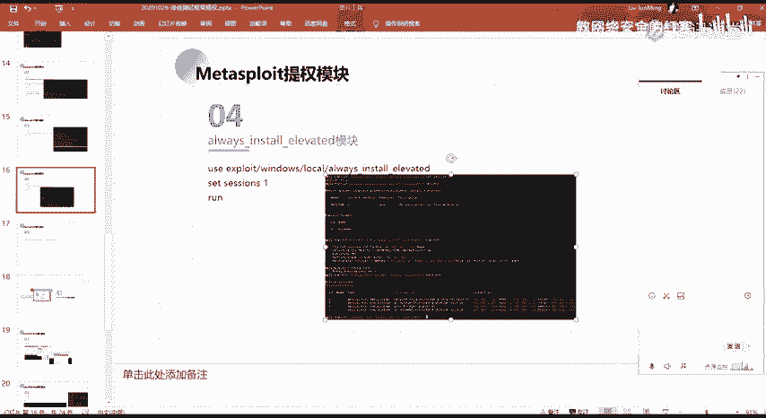

这个。其实嗯。Okay。看一下群。Okay。哎。对。呃，本来前面我前面我是有那个操作记录的，这边的话把我清掉了。这边的话直接尝试一下吧。

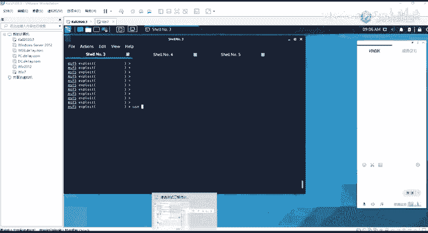

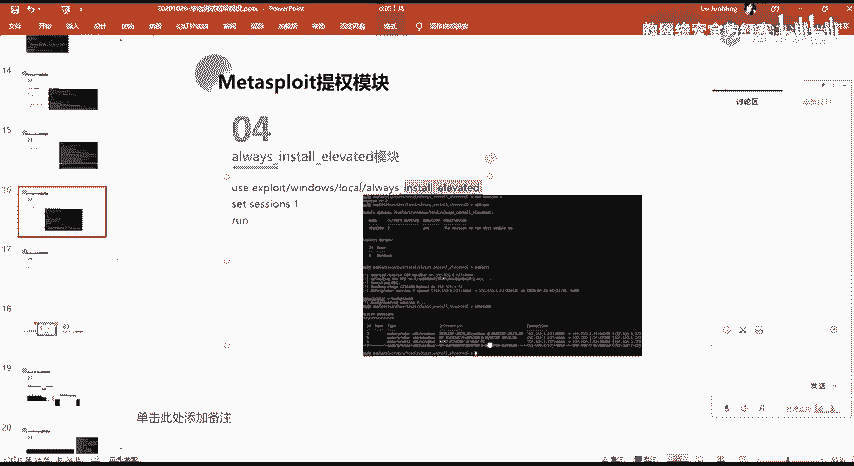

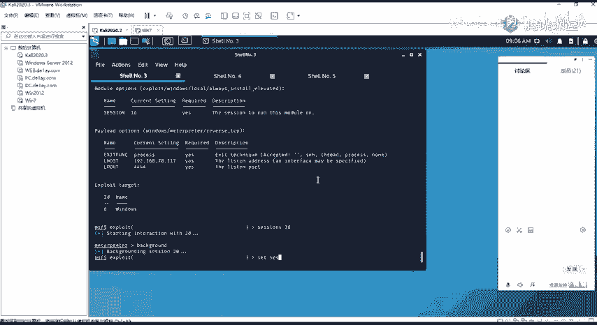

嗯。

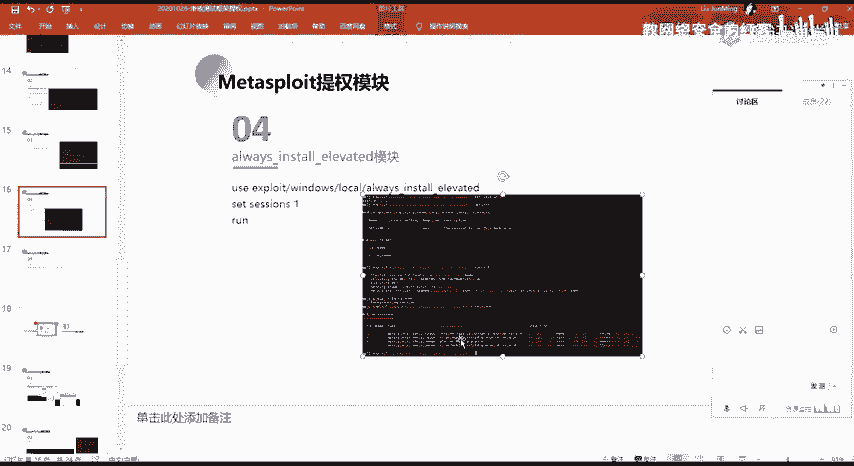

嗯，我这边的话，你这一个。这个应该是可以存的。

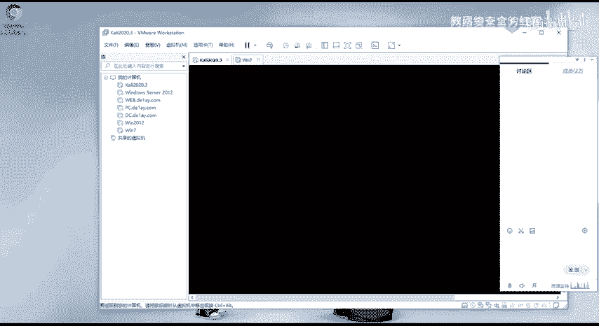

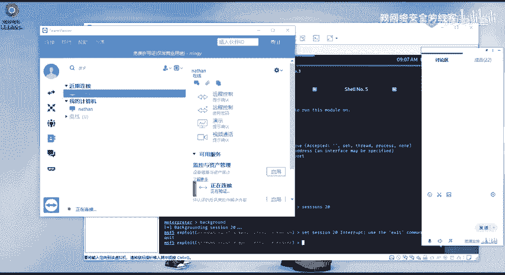

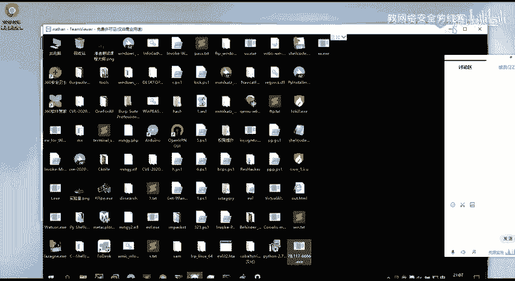

而且这一个把机原件，我这边的话得到了这个把机的一个。

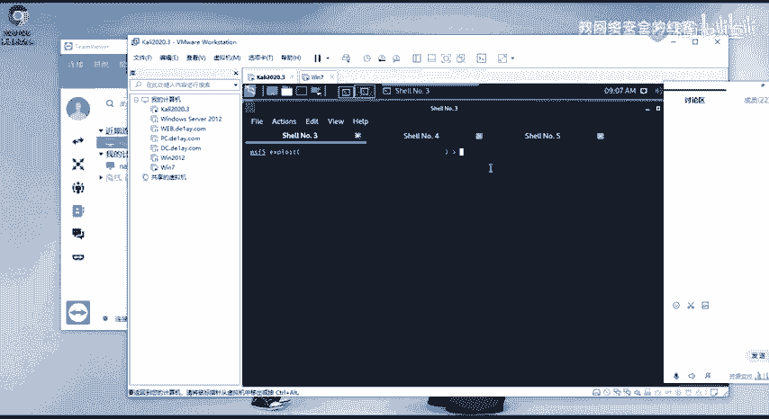

呃，NATHNA的这个用户的一个就普通用户的这个筛选，对吧？对吧。然后我在这边的话，我使用这一个O杯字错。他是。指定这个27的这一个筛选。然后我这边的话ex boys。啊，我ex执行之后的话。

执行之后的话可以看到只要到了一个这样子的一个筛选S8对吧？可以这个ID可以看一下，但这的话直接得到它的一个sem的一个权限。然后其实在这边的话它就是上传了这样子的一个uping这样子一个MSI。

就是把它就是他这个MSF所生成的这个MSI它上传到了这边的一个t目录，对吧？然后的话去进行一个执行，执行这个MSI执行之后的话，把我们的这样子的一个呃tation。

把它给传到了目标机上面去执行执加载执行之后的话，我们这边就得到了这样子一个筛选，而且这个筛选的话，它是一个s的一个筛选。因为呃我这边的这个机器的话，它是开了。他是开了那一个就是策略嘛，对吧？

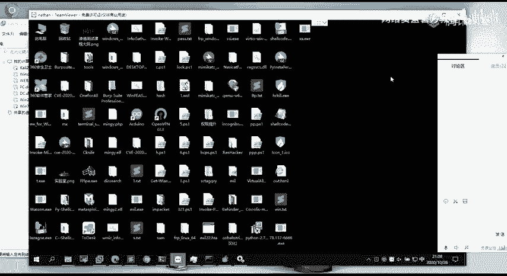

开起来那一个O installstore average的的一个策略。所以的话我这边可以直接去进行一个进行一个提群。就是。这是第4个。然后呃第五个的话，在这边的话，我给了一个另一句啊。

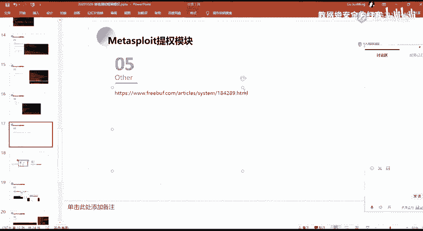

就是关于更多的这样子的一个内核的，就windows内核漏洞利用的一个齐全。

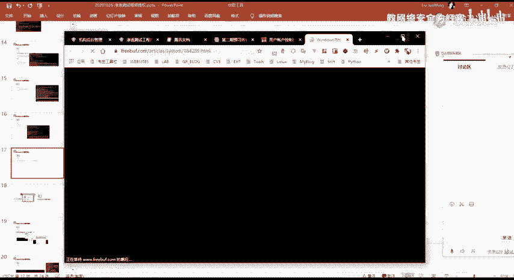

呃，在这边的话就是说在MSF当中，其实有很多的这样子的一些，就是它已经有内置的这样子的一些齐全漏洞的一个模块。就我们可以去直接去写一个6。然后呃大家可以看一下这篇文章在这边的话有提到有这么多就是。

以及就是在MSF当中所对应的一个模块，我们的话进行一个使用。就它这个使用的话是。使用的话其实是最简单的对吧？它有给现成的模块，我们只要柚指它，然后的话设置我们的一个今天的一个目标，然后的话设置一个筛选。

然后直接ex就能够去进行一个呃利用了，对吧？那呃，更多的这个的话，大家自己看一下这篇吧，这一篇文章吧。

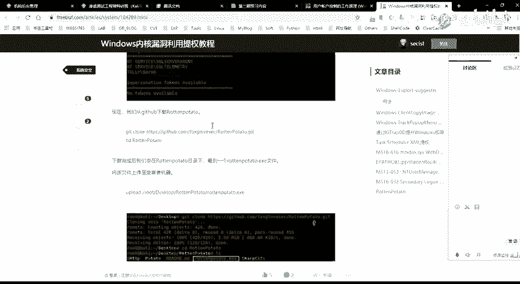

我这边的话就呃不会去多讲了。以及这样子的一个就是浪土刀这个主吧这个的话上节课有有讲。呃，上面它就是MSF相关的这样子的一些齐全的一个一些技巧。呃，下面的话就是给大家介绍一下CS的一些提全的一个模块。

