# 2024网络安全系统教程！清华大佬花159小时讲完的网络安全系统课！别再盲目自学了，学完即可就业！零基础入门网络安全！（渗透测试／漏洞挖掘／CTF／黑客技术） - P96：83.CS提权模块Elevate.mp4 - 教网络安全的红客 - BV1ft421A7Nj

呃，CS的话。CS的话，其实大家大家了解嘛，就是呃它CS它的一个发展，它其实是呃基于MSF的，就说基于MSF的那个M体积，就M体积的话，它是一个就是MSF这一个框架。

它的一个图形化的一个呃图形化的一个界面。然后的话在后面的话就是慢慢的发展成了这样子的1个CS。然后的话呃就是独立独立出来，就独立于MSF的这样子的一个框架。然后其实再去使用的时候的话。

其实CS啊就是如果你两个工具你都比较熟的话，然后的话你再去你去使用了，你去有使用过这两个框架的话，那么就其实CS的话呃挺多时候的话会比MSF要好用一些吧。当然的话就是呃。M3F的话，它的一个优点的话。

就是它里面的一个模块，以及它的一个就它框架里面的一个模块，它是很多的对吧？而且的话就是实时的有更新。就是最新的一些漏洞的话，一些模块的话，也有也有人就是把它写成MF能够去直接去使用的这样子的一些模块。

然后CS的话就呃相比MF的话就是会。呃，可能会更加灵活一点吧。就是呃在CS当中的话。他的一个最大的一个就是。他的一个比较好的一个。呃。或者说他的一个优点以及比较好的一个好好的一个地方。

就是他能够去加载我们自己去写的这样子的一个脚本。然后的话它有这样子的一个脚本管理器，然后我们自己的，或者说别人已经写好了的写好了的这种脚本，我们可以把它给加载进去。然后的话扩展我们的1个4S。呃。

在这边的话就是呃当然的话MSF你也可以自己去就是说去写对应的这样子的一些呃脚本，对吧？这样子的一些模块。然后的话你同样的也可以加载到里面去。因为他也有提供对应的这样子的一个就是API啊。好。

呃在这边的话讲到CS的一些提全模块的话，首先第一个就是一个ever。

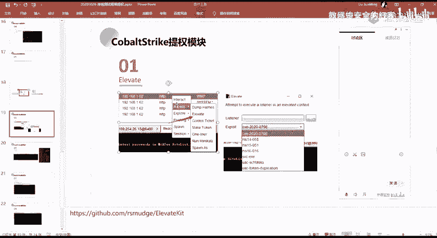

evererage这个的话，它是CS里面自带的这样子的一个功能。

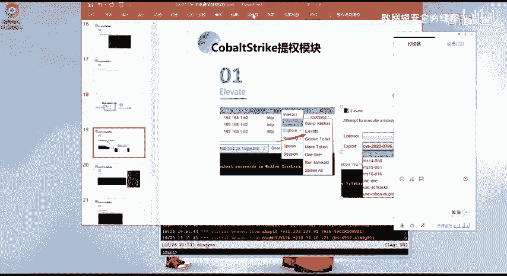

就是我们在这边的话。

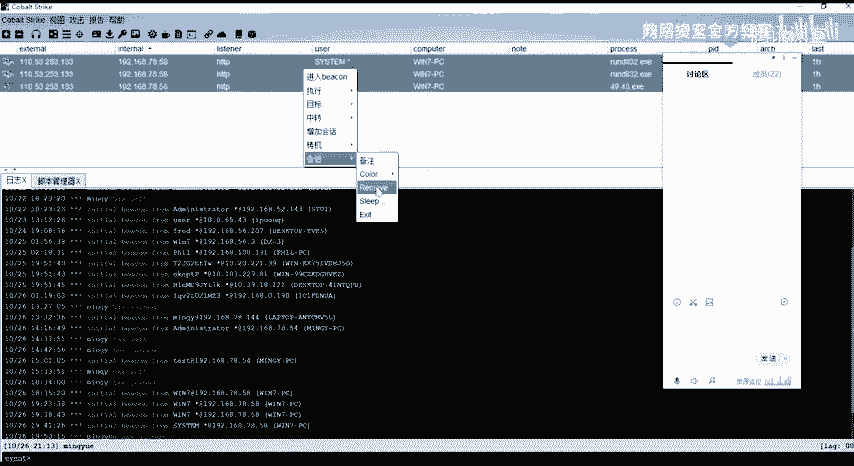

我这边的话先。等一个规划。

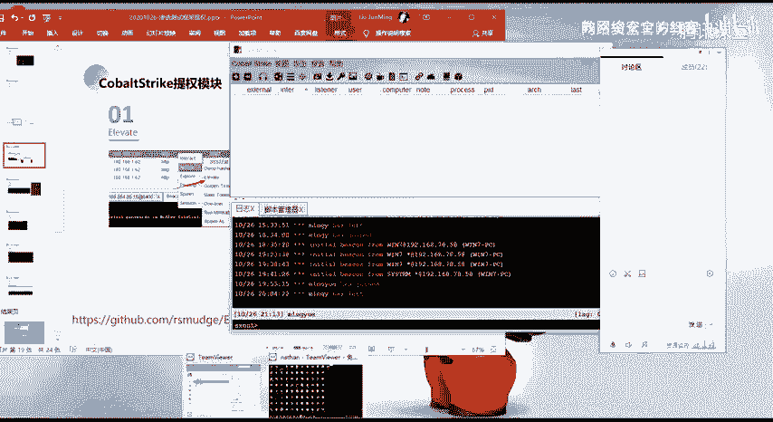

好像的以这个把击为件。

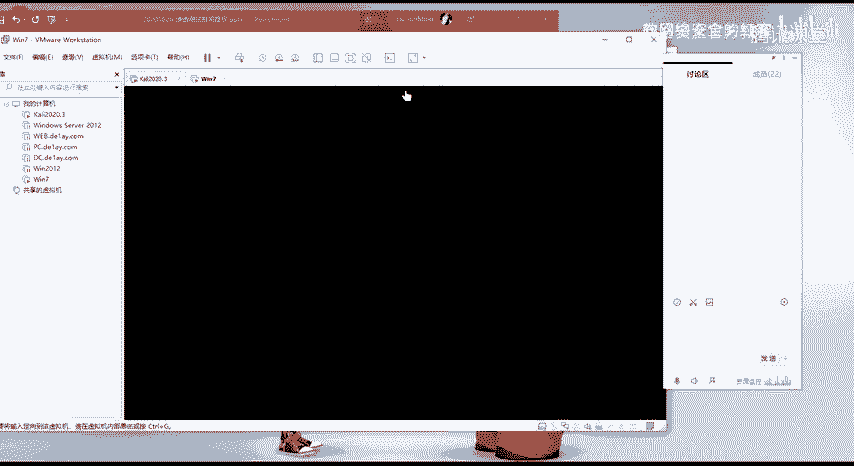

嗯。对的。

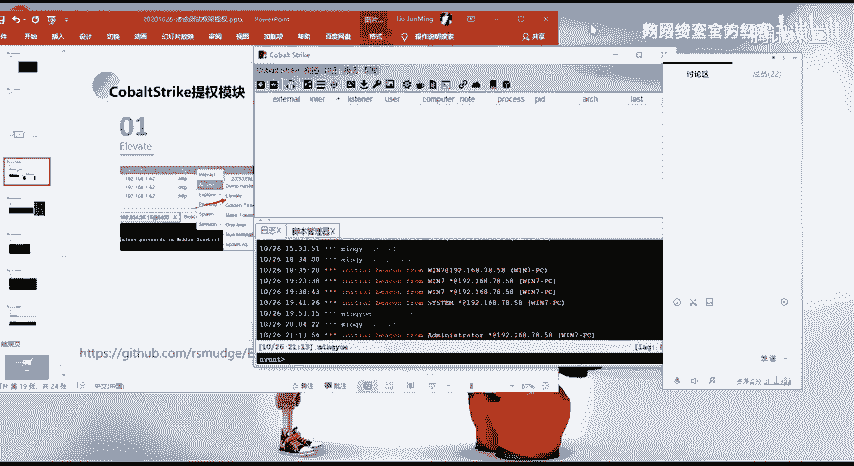

我这边的话得到了这样的这个win7这一个普通用户的一个en，对吧？Oh。呃，这边的话要。等等那一分钟，就是呃CS的话，它默认的是就是说默认的这样子的一个sleep，它是一分钟。就是这边的这个sle。

大家知道是就是说为什么吗？就是他为什么要就是设置这样子的一个就是等待。然后他是呃他的一个。背后的一个东西大家有了解吗？就CS的这样子的一个。就比如说我这边sleep sleepep0就默认的话。

它是sep news嘛，就是它的一个等待睡眠的一个时间是？然后这边的话1到60的话，他就会去呃就显示这样子的。就是说我们那个目标机器已经就是回应了我们，对吧？然后我这边的话是发送了这样子的一个。

就是我这边是leep零的话，他是有发送了这样子的一个16的16一个字检，对吧？然后我这边执行一个，比如说什么？就是他的一个等待睡眠的一个时间，对吧？然后这边的话1到60的话，他就会去呃就请示这样子的。

就是说我们那个目标机器已经就是回应了我们，对吧？然后我这边的话是发送了这样子的一个，就是我这边sleep0的话，他是有发送了这样子的一个16的16个字节，对吧？然后我这边执行一个，比如说需要货卖。

我这边执行之后的话，执行之后的话可以看到我这边执行这一个命令之后的话，他就立马就发了这样子的1个37个字节的一个请求包，对吧？发送到了一个目标，我们的一个host，其实就是发送到了我们的一个back。

然后的话执行执行我们这边的一个命令之后的话，呃，我们接收到了它的一个呃输出。然后的话这边的话就是我们的一个结果。然后其实CS的话，它它的一个我这边的话大概说一下吧。

就是关于更多的CS的这种它的一个通信的一个机制以以及基本的一个呃基本的这样子的一个就是CC的一个通道，对吧？它其实是这样子的。就是我们这边的话是我这边是一个呃控制台，对吧？然后我这边的这个控制台的话。

我们可以控制，就是说我这边的一个客户端连接到了这个服务端，连接到这个服务端，也就是一个T teamam seven对吧？我连接到这个team seven，这个team seven的话。

其实就是CS的一个就是一个CS seven。这样的一个服务端。然后我们这边的话这边的话是我的一个客户端，客户端的话，我可以去连接到这个服务端，然后的话去管理下面的呃操作下面的这样子的一些backken。

对吧？然后在这边的话，这一个backken的话。这一个backing的话，DICO。这个backken的话，其实就是我们所生成的那样子的一个呃那一个st。那个st的话，它呃我们通过前面。

就其实这边是得到了一个绘画嘛，对吧？得到了这个绘画的话，其实就是把我们那个st就是发送到了我我的一个目标机器上面执行。执行之后的话，我这边经历了这样子一个绘画，对吧？然后在这边经立的这一个。开垦之后。

我们要去执行命令，对吧？执行命令的话，我们这边的这样子的一个。

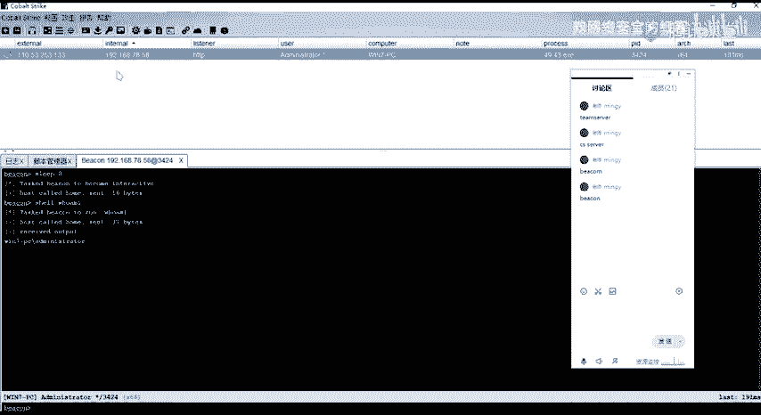

今听器啊这边的一个今听器啊，就通常的话在CS当的话会去使用这样子一个HTP或者是HTPS对吧？然后其实在这边的话，就是说我们比如说我这边使用的是HTP，那么我的这边的1个CS的1个severever。

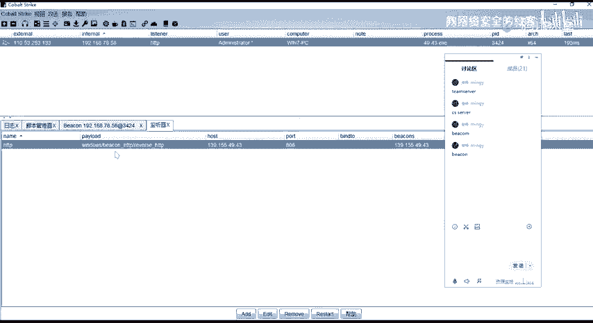

我的一个s sa与我的一个backcon。资金去进行一个通信的话，它是通过HTP的一个方式啊，就是通过HTP的一个方式去进行去去进行的一个通信。然后HPHDP的一个方式的话，4S它会默认的话。

它首先它会是通过get的一个方式。就是嗯。呃，我们这边的一个建立了建立了之后，对吧？我的一个。呃，backen我的一个back它会隔这样子的一个sleep的一个时间。

和这样子的一个sleep的一个时间来去发送这样子的一个get请求，来像我这边的一个service来去呃发送一个get请求来获取我服务端所发送的一个命令。像比如说我这边执行一个换卖，对吧？

那么他在我这边leep是0。那么他我这边执行一个换卖之后的话，其实那个backken的话，它立马它就会他他因为它是0秒的一个时间嘛，它会一直去发这样子的一个get请求来去请求我的一个s端的一个呃命令。

对吧？然后的话我这所以的话我这边直接输入换卖，它就能够直接的去得到去get到我这边的一个命令。get到这个命令之后的话，它会在呃back的目标机上面去执行，对吧？执行之后的话。

就返回结果返回的这个结果的话，它就会就是呃发送到我这边的一个服务端嘛，对吧？就是这样子的一个过程。然后呃如果你就是如果你设置是立虎为0，那么他的这个请求的话。

他是会一直一直的去来请求我们这边的一个服务端，对吧？所以的话一般都不建议大家去设置设置这么短，就是你设置长一点。嗯。你设置长一点的话，就是它会隔隔多少秒，对吧？

隔多长的一个时间再去发送一个请求来执行我们这边的一个命令，对吧？这是呃就CS的一个。基本的这样子的一个请求啊，通信啊。就其实我们在前面其实不是有讲嘛，就是讲这样子的一个今听器，对吧？讲听今听器。

其实这边的这边的话就是我们的一个payload嘛，其实就是一个backer嘛。

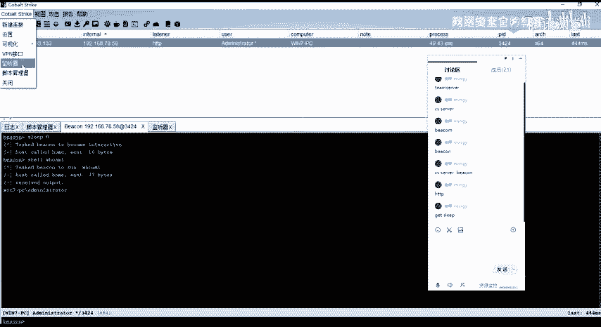

对吧然后像HDPHPS的话，就是它的这样子的一个通信的一个方式，对吧？它是呃HP上是以HP的一个流量的一个形式。DNS的话就是DNS嘛DNS解析对吧？TC的上就是TCP的。呃，这边的话。

扯的就是有点扯远了。就是呃正好讲到了这边的话，就给大家介绍一下吧。然后更多的一些的话，大家自己去。呃，那个去去怎么说呢？自己去研究吧，好吧，然后CS的话，这个工具的话是就是很多人都在用嘛，对吧？

为什么很多人都在用？因为它确实好用。就是也方便。呃，我们言归正传讲到我们的一个今天的这个。3S的一些提群的一个模块。呃，在这边的话，我们得到了这样子的一个baton，对吧？

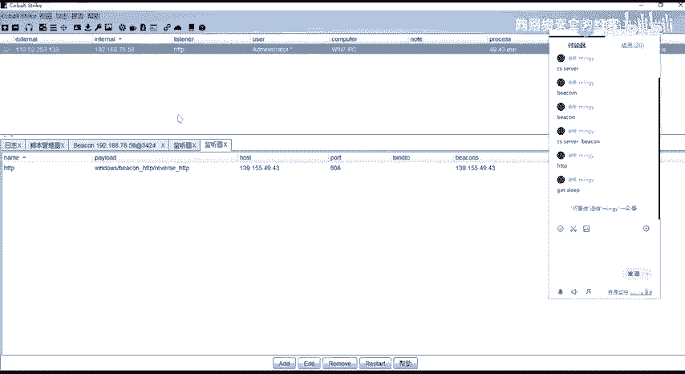

得到这个这一个back，然后我们可以右进右进在这边的话，它有这样子的一些呃这样子的一些选项，对吧？像呃执行执行的这些的话，呃，我们前面的话讲的这样子一个run mini对吧？

run mini就是我们去用用它CS当中呢，它自带这样子一个min卡的一个模块，然后的话来去获取它的一个铭文的一个密码，对吧？然后还有就是。呃。还有就是这个转属哈希对吧？哈希钓也是同样的。

就是能够去得到他的这样子的一些呃，它的一个哈希值是吧？前面的话有介绍这个，然后后面这些的话在呃后面的话会有介绍，像比如说。呃，黄金票据制作令牌这一些对吧？制作令牌的话，其实那个托肯那边的话。

就讲那个托肯注入的时候，其实窃取的时候，其实也那个然后以及在后面的一个。横向移动权限维持的话会有会讲到这一项。然后在这边执行的话，有这样子的，就转手I机下面有一个提群。当然的话这边的话是一个中文的。

就英文的话就是这个average。1EVAT就呃漏洞齐全的这样子的一个模块。然后我们打开之后的话，在这边选择这样子的一个监替器，就我这我就选择一个对吧？

然后在这边的话就有这样子的一些呃有这样子的一些exloit。对，就是我们能够去利用的这样子的一些模块，对吧？然后其实呃实际的话CS当中他给的话就给了是呃三个还是几个吧。

然后在这边的话就是可以通过这边的一个脚本去进行一个加载，就是呃这个el kit这样子的一个脚本。然后所以的话。

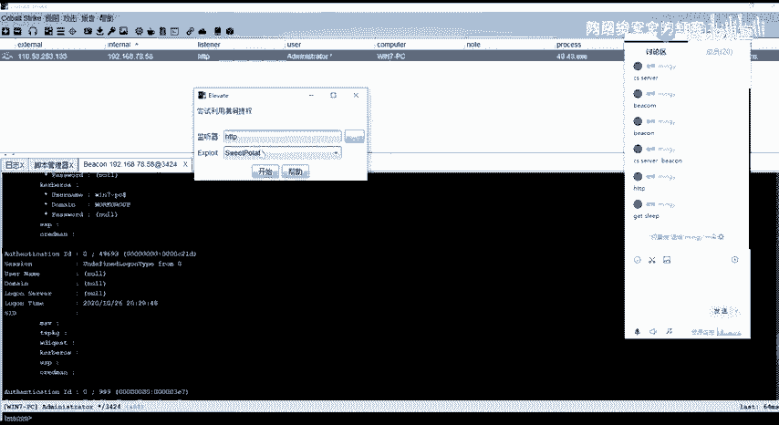

加载加载之后的话，在这边的话，你就能够去看到有更多的这样子的一些提全的。像比如说0796对吧？

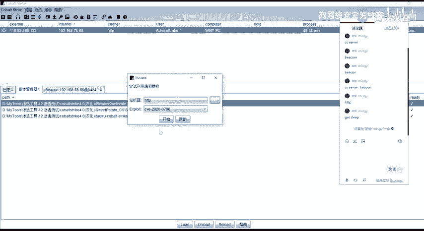

喂。报一下，然后这边的话0796的话是比较新的这样子一个提全的一个logo。然后这个0796的话，它是有限制的，就是可以看到，就是它只支持win10的19031909的这样子的一个系统。

因为我这边它一个win7的，所以的话它利用不了。呃，在这边的话，我们。以这一个为例。我这边的话以这一个。呃。这个。😔，这个你这个UAC talkingken。就可以这一个为件啊，我这边的话执行这一个。

首先这一个齐全的一个模块。嗯。哎。好，我这边的话已经那个了。我这边是atmin的呀。等一下。因为我当前的话是已经是直接是一个admin的一个用户。

所以的话它显示就是you are already in high，就是你已经得到了这样子的一个高高权限的这样子的一个那个。因为我当前的话是一个min啊。

我这边的话是因为我是直接在admin的一个那个下面去执行的。我这边的话呃。

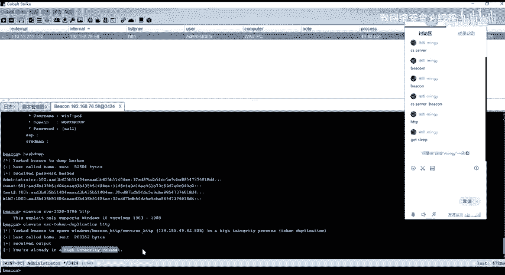

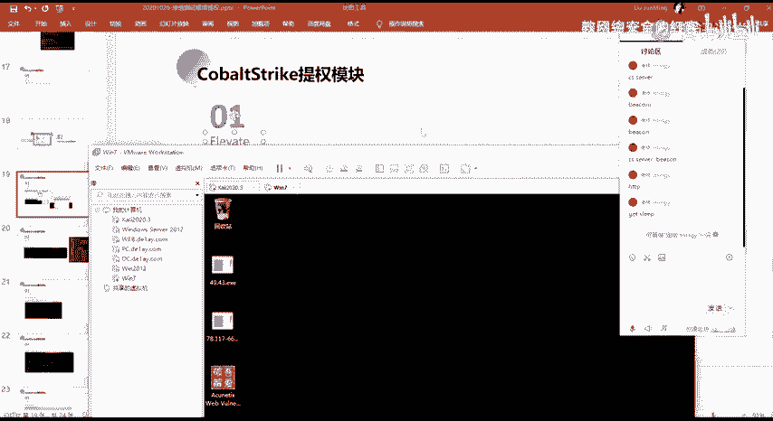

切换一下用户。切到这个普通用户。好的话，我再去。

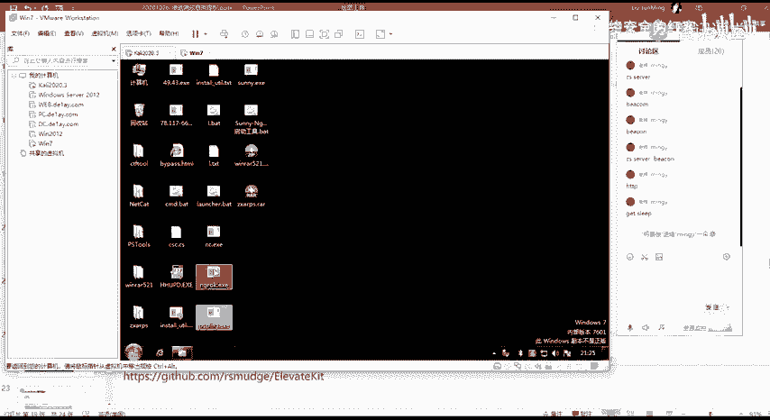

呃。找到一个麦凯。

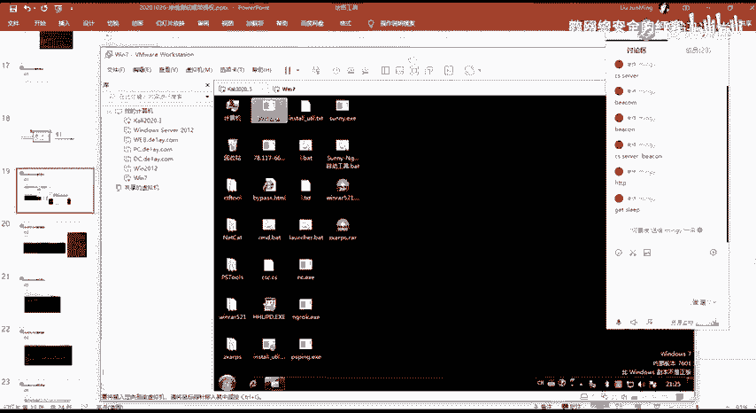

就是这个这个U者win7的这个普通用户对吧？然后我这边的话因为是在本店做测试嘛，所以我实6不灵啊，就是为了快一点嘛的。嗯。这边的话要等待。一分钟的一个时间。就其实呃大家就刚进入一个backken对吧？

刚你进入这一个baken进入之后的话，你执行sni0。其实在这边的话，你可以通过在这边这一个last这边，能够看到他的这样子的一个时间对吧？就5051秒。

也就是说他他最后通线的一个时间是55秒之前56秒57秒对吧？58秒59，然后到60到60的话，他这边的话就立马去，因为它的一个get请求过来了，对吧？把我这边的一个命令就是呃获取过去了，然后的话执行了。

然后现在的话我们就可以呃执行命令。需要空卖，我担心的话是一个普通的一个用户啊，我再去尝试用这边的一个模块去进行一个提群。然后呃在这边的话我可以看。我在这边在这边的话。我们执行这一个模块。

我们可以看一下它的一个命令，就其实这边执行的一个命令的话，就是ever，然后执行了它的这样子的一个它已经内置的已经写好的这样子的一个呃模块，对吧？这样子的一个脚本。执行之后的话。

在这边有1个HTP这个HTP的话，其实就是我们的那个呃今听器的一个名字，就是。

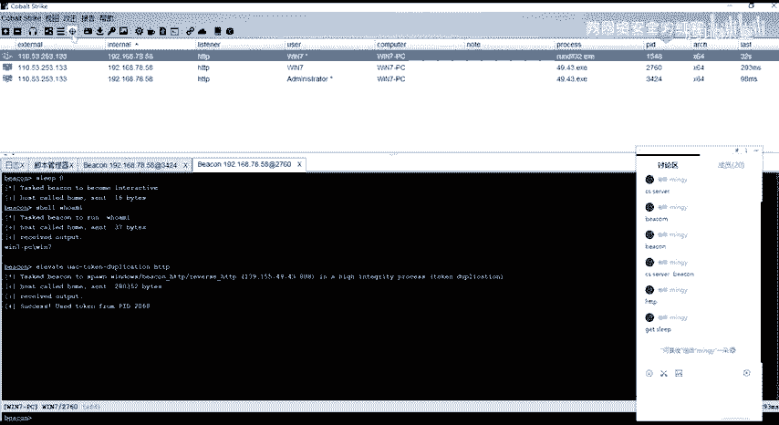

嗯。这个就这边这个今听器的这个name，也就是我这边执行这个模块之后的话，呃，他如果能够去反弹一个需要的话，那么我这边的话就他会反弹到我这个HP的一个监听器，对吧？

然后在这边的话我们可以看到sexs的话就是执行成功了。执行成功的话，我这边的话就得到了这样子的一个。

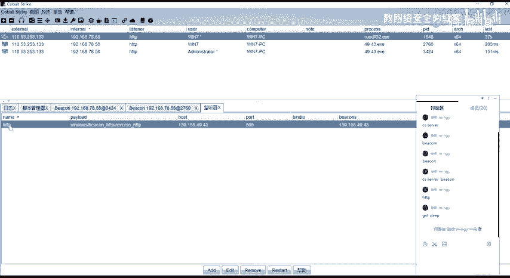

进程这边的一个进程的话，其实就是这个。就是我们通过这个模块对吧？这个功能进行一个提全，提全之后的话，得到了一个新的一个绘画。然后这一个绘画的话，其实我们可以看一下，我们可以看一下这边的这一个绘画。

跟下面的这个面的这个绘画。你会发现的话，它其实是一样的，对吧？就是怎么看的这一这些，对吧？你看到有这样子的一个红框，以及你的右子后面有一个新的话，那说明你的这个权限的话，其实是一个管理员的一个权限。

然后在这里的话，其实我们就已经得到了这样子的一个呃管理员的一个权限的这样子的一个back了。然后在这边的话，这一个back的话，我们想要去把它做一个。就是把它进行一个把它提到一个seat的一个权限。

在这边的话，我们再去进行一个提群。呃，在这话我们使用这一个。执行。嗯。呃，这边的话因为这边的话因为是一个新baer，所以的话呃干净的话，它是有60秒的这样子的一个睡眠时间嘛，对吧？所以的话要等待一下。

嗯。😊，呃，等待时间的话，就大家有没有什么问题啊，就是问一下，就呃关于前面的一个内容，大家有没有什么疑问？然后可以看到我这边的话呃，执行之后对吧？执行之后的话。

这边日志这边的话就呃初始化这样子一个backken就是来自这边的一个stem的一个权限。就这一个机器来的，然后这在这边的话就得到了这样子的一个sstem的这样子的一个back，是吧？然我们就可以进入。

好，又要讲。好，这边的话。我们就直接得到这样子的一个sem的一个backken，对吧？就通过这样子的一个方法。把就通过这样子的1个CS当中，它内置了这样子的一个提全模块。

从一个普通的一个win7的这个用户把它给提到了一个stem的一个权限是吧？

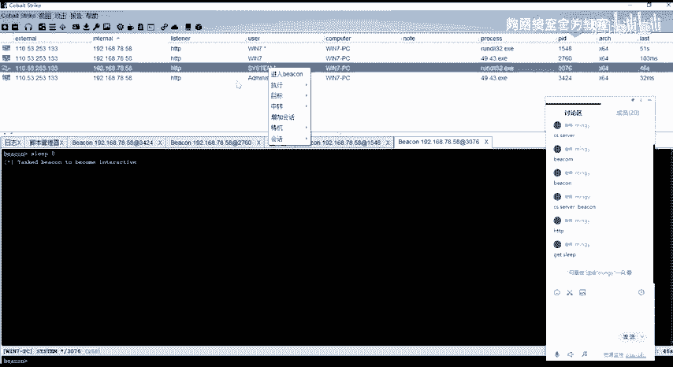

呃，其实这边的话就是。

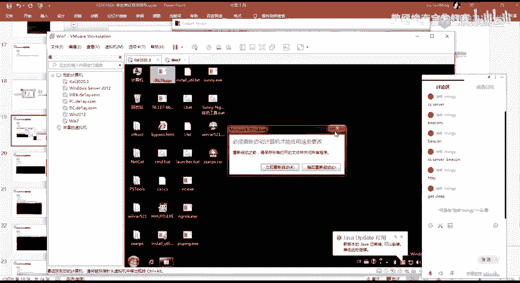

就是这个everage这个齐全模块的一个使用了。然后呃然后的话就是这一个 kit这一个就是插件那个脚本。大家可以在这边去进一个下载。

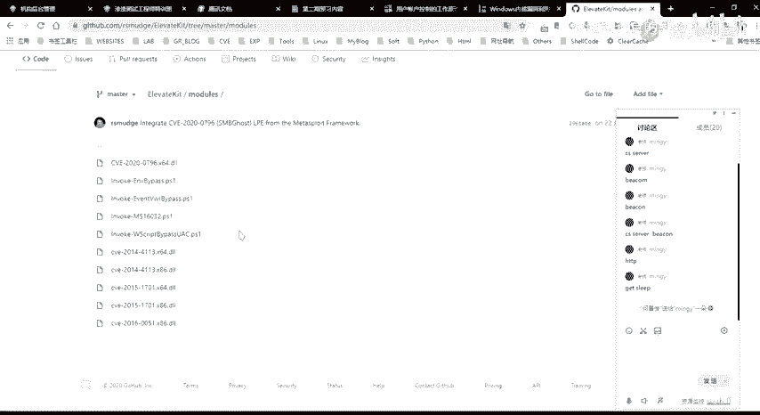

然呃加载插件的话，这边提一下。嗯。

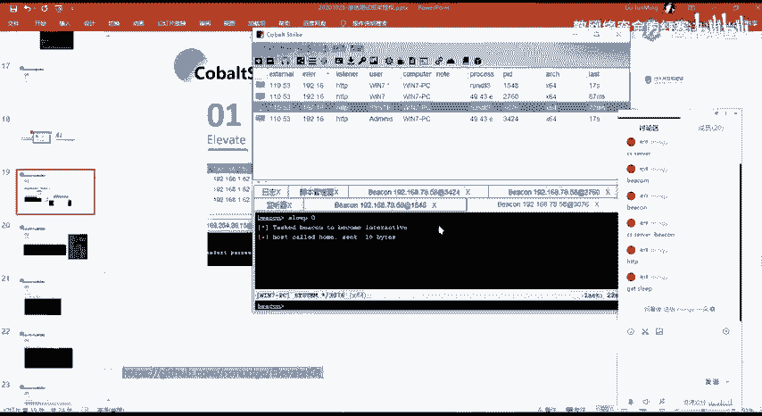

前面应该没有讲吧，就是这些脚本对吧？怎么去加的是吧？我们在这边的话，我们可以在这边脚本管理器嘛，就这边construct脚本管理器对吧？这个然后我们漏漏之后的话，在这边的话就呃。到了我们本地嘛。

我们选择我们的那个。民事大。对，没有。地盘。这运行。就这一个对吧，这个ever这个的话，其实就是你这边你呃下载之后的下载之后的这一个这个内容，对吧？就是这这在这个文件夹当中。然后的话我们要去加载的话。

其实就是这1个CNA的这个文件。就这个后缀文件为点CNA的这个文件啊，我们打开。打开之后的话呃，因为我这边的话是已经有加载了，对吧？就是这边已经有了，所以重复了，这边的话就加载失败了。

然后呃你们自己加载的话，你们自己去尝试一下。

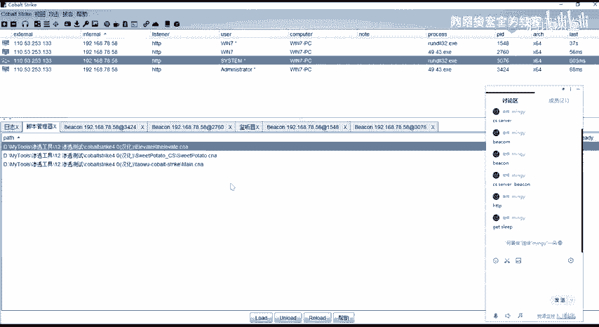

加载的话是没有问题的。