# 2024网络安全系统教程！清华大佬花159小时讲完的网络安全系统课！别再盲目自学了，学完即可就业！零基础入门网络安全！（渗透测试／漏洞挖掘／CTF／黑客技术） - P97：84.自用提权程序.mp4 - 教网络安全的红客 - BV1ft421A7Nj

然呃第二个的话就是这个自用的一个提全验词一。下面的一个。提全的话用到了这一个。呃。就是用到了K8。大佬他的这样子的一个提全的这个EXE的一个程序啊。

就是这个CV2019的1个0803的这样子的一个提全的一个。提全的1个E叉P。

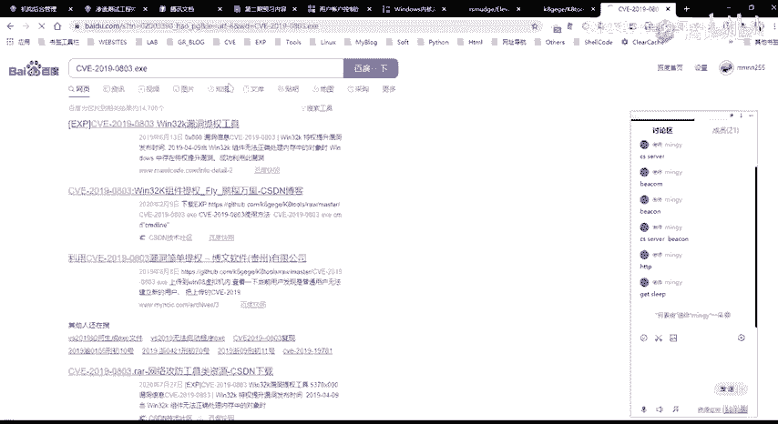

嗯。

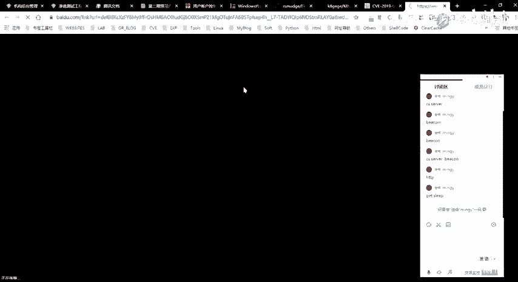

就就是这一个你利用的是这个win32K这一个logo。这边的话是它1个CB编号，大家可以去了解一下。然后它的一个影响的一个版本，我们可以看一下。它影响的一个版本的话，有这么多。

有win10到win7win82008。2012就是s的嘛，20162019对吧？它的一个影响的一个范围呢，它是很广的。所以的话这一个这一个提全的这一个。

工具的话是呃这个齐全的这个漏洞的话是呃比较好用的一个。

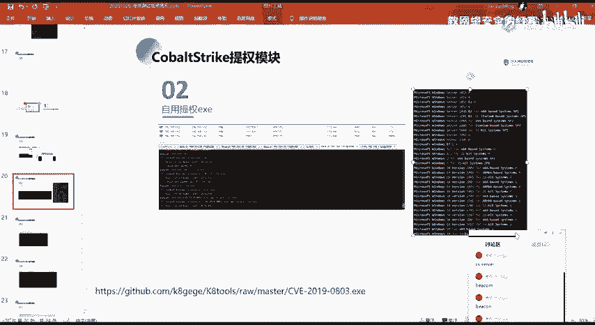

然后在这边的话，我给大家就是呃演示一下。我们如何去利用它的这样子的一个提全的这样子的1个E叉P。因为他在这边的话，我这边的话直接用他的这个EXE一个程序啊，然后他的这个EXE的一个程序的话。

我们来在呃这边来看一下。

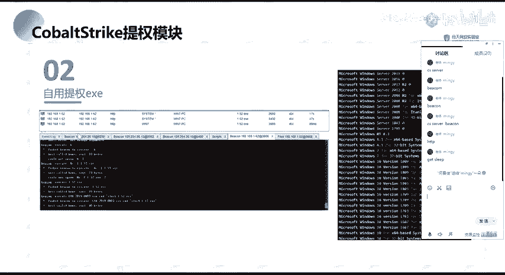

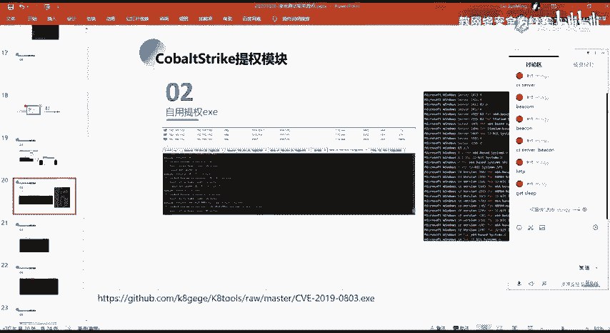

给大家介绍一下它的一个基本的一个使用。我这话我直接把它复制进来了然，其实呃实际使用的话，对吧？我这边CS我已经得到了它的一个backer，对吧？

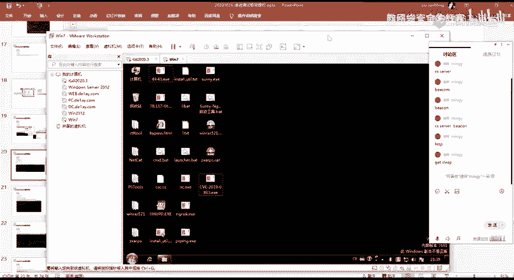

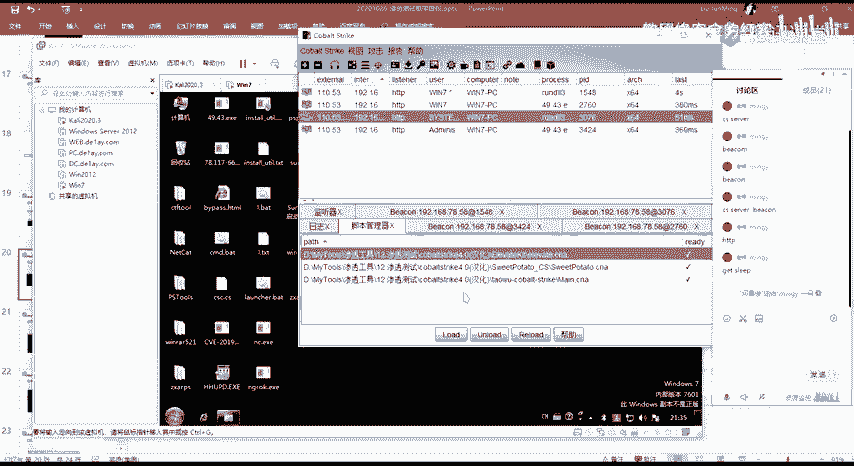

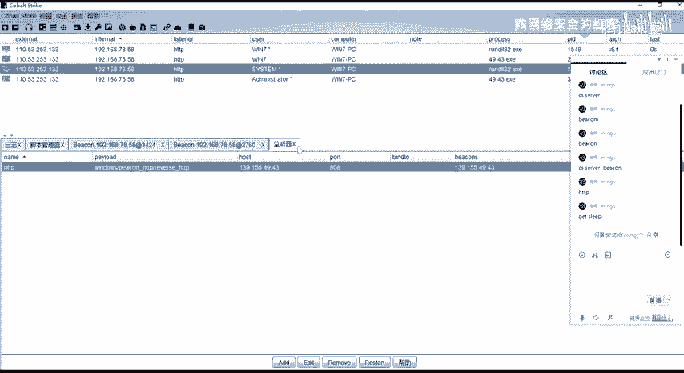

我这边的话还是以这个。

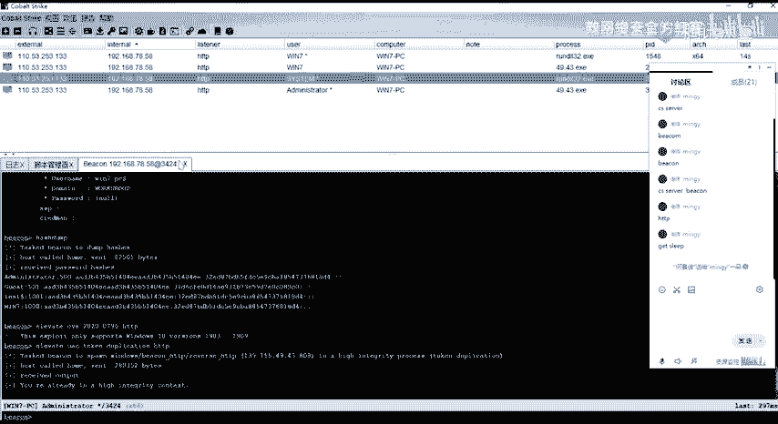

3724。你这一个啊不是那个。

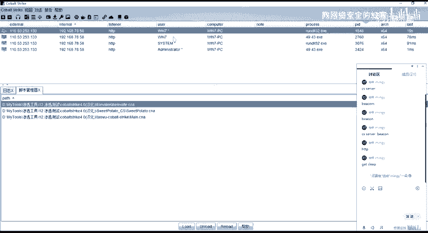

以这个普通用户的为例啊，是吧？然后这句的话我直接可以呃进他一个文件管理器嘛，然后上传到他的一个目。

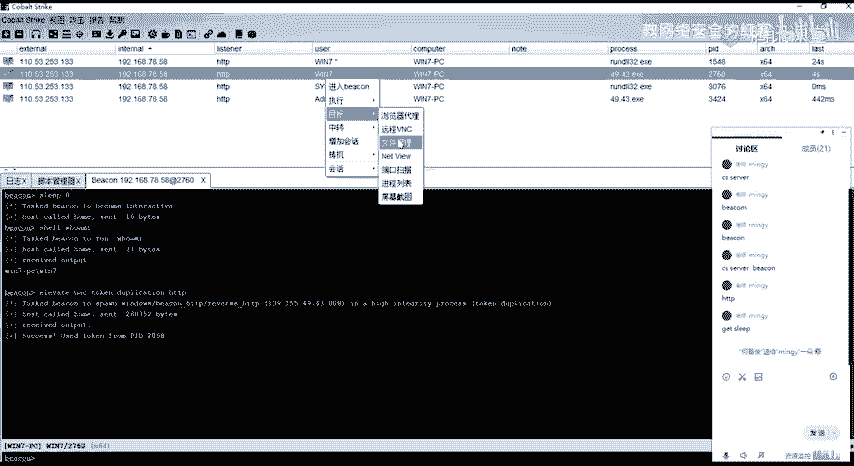

上传上去对吧？上传上去之后的话，它的一个使用。他使用的一个方法的话是不这样子的。

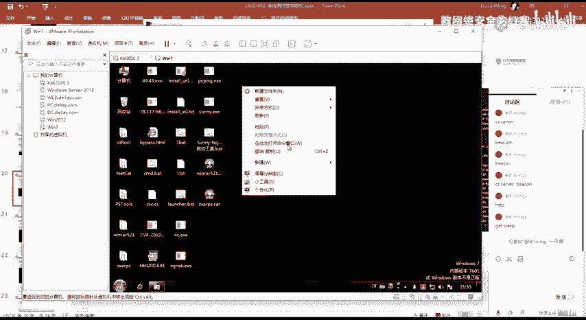

我们可以，因为我这边的话，我直接在靶机上面去操作。还有一个执行的一个。它的这个脚本，它的一个使用的话是在后面接1个CMD的一个选项。然后的话在后面接我们的一个命令。像比如说我的一个行换换。呃。

在执行之前的话，我先直接一下。卖对吧，之前之的话。我担心号是一个win7的一个用户，对吧？我执行执行互外卖的话是一个win7的。啊，我在的话通过他的这样子的一个提前的1个E叉P啊。

然后的话我去执行1个CMI啊，户外卖。然后在这边执行之后的话，你会发现啊它它的这个提群脚本，对吧？我这边执行之后，在这边返回的一个结果，你会发现是1个NT systemt的一个权限。哎看到对吧？

所以的话我通过这个脚本，我执行命令的话，就通过他的这个集权的EEXP执行命令。我在这边执行的一个权限是一个stem的一个权限。那么我在这边的话，想要去访谈一个stem的那个需要，我后。

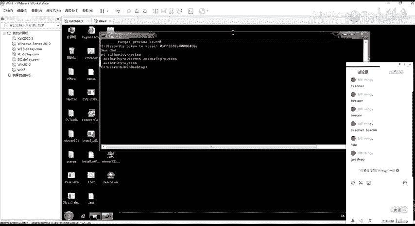

我们可以怎么去操作呢？就其实我知道我通过这个脚本，我就能够去呃得到一个stem的一个权限，对吧？那么我们想要反谈一个stem的一个权限的一个back是吧？我们可以尝试就是。

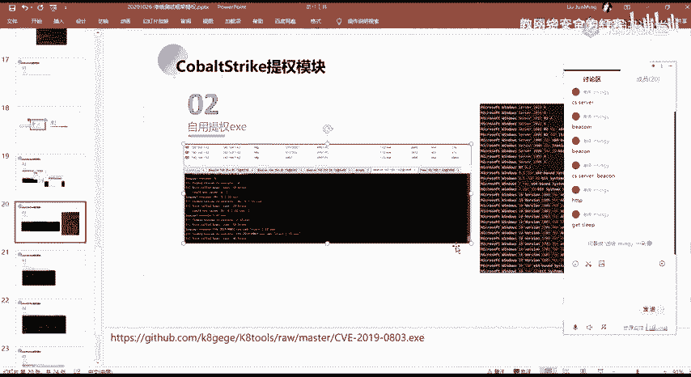

呃，我在这边的话，我是通过这样的一个方法。

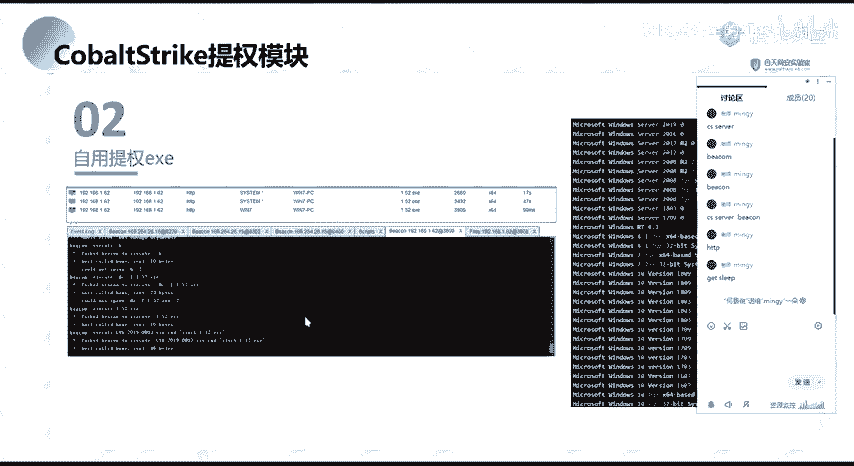

就是我生成一个可执行程序，对吧？生成一个可执行程序，然后的话我再用我这边上传上去的这个。

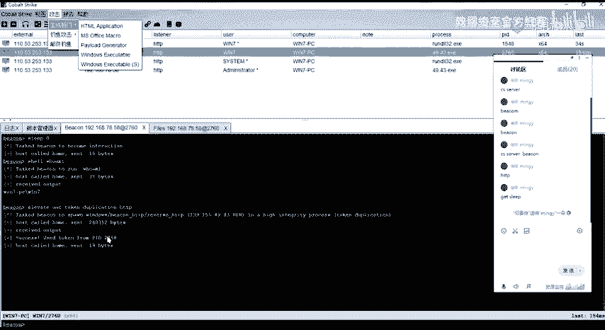

脚本。

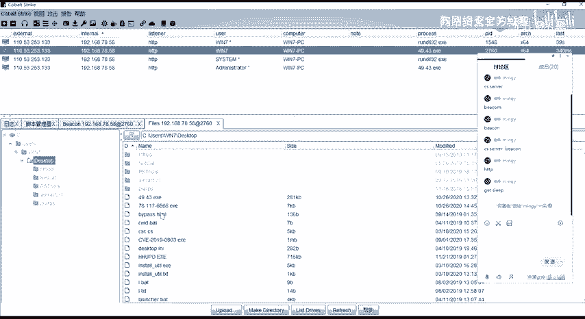

这一个提全的一个漏洞啊，不提全的一个工具，提全的1个E叉P。然后的话去执行我这边的这个呃上传上去的这个反特西尔的一个呃木马，对吧？然后我这边执行之后的话，因为我是一个seastem的一个权序去执行的。

那么我这边所得到的这样子的一个呃绘画得到这样这样子的一个backken的话，那么自然而然的也就是一个sstem的一个绘画对。

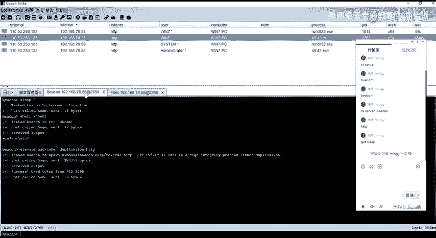

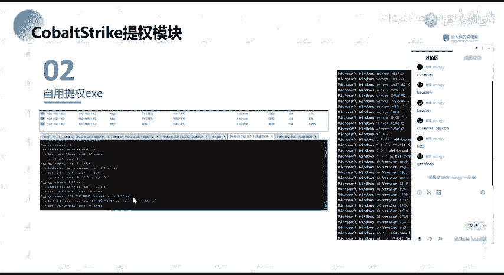

能来看一下，我这边的话。在SS上面去操作。我当前的话是这个。呃，当前话是一个。普通普通用户。对吧，一个普通用户的一个权限。然后我这边的话。看一下。我这边的话当前在的一个目录的话是这个desktop。

就其实就是我这边这个Kload的所在的目录嘛，然后我上传上去的话，也是在这个目录。所以的话我在这边我可以通过。呃。在这边介绍一下这个XQ呃，这个前面。已经有有介绍完，就这一个SQ。

SXQ整这一个命令的话，就是呃我们可以用它来去执行。

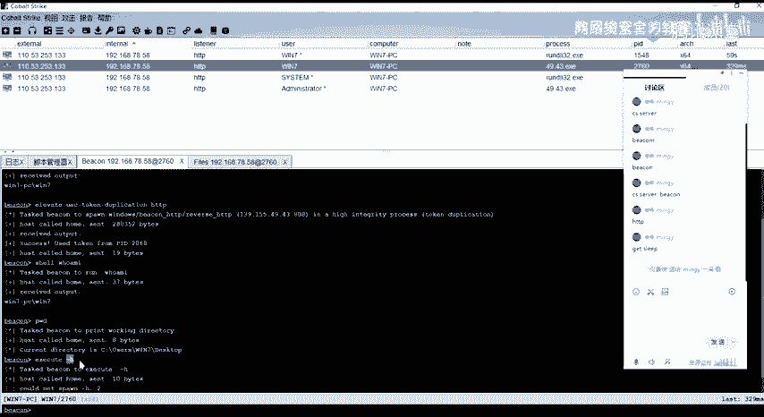

去执行目标机器上面的呃文件，以及能够去执行目标机器在目标机上面去执行命令。

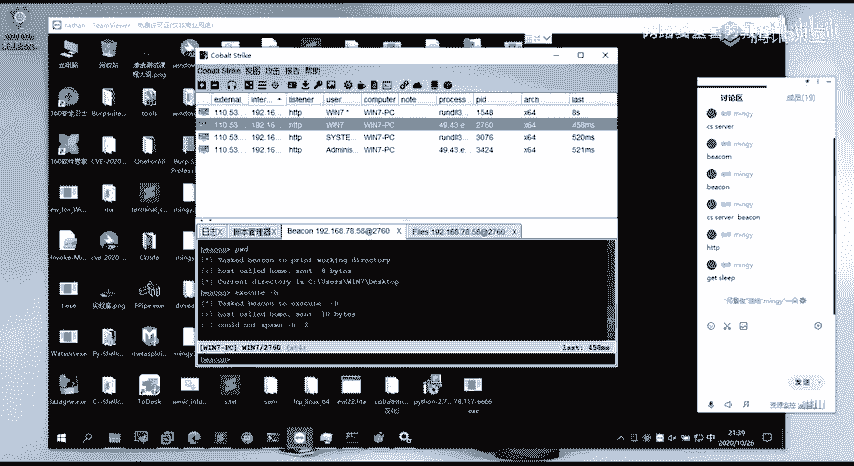

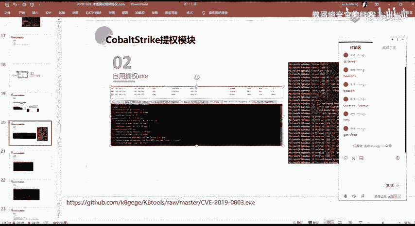

没写错吧。明白。然后我这边的话，我直接呃，比如说我在这边直接执行这一个。

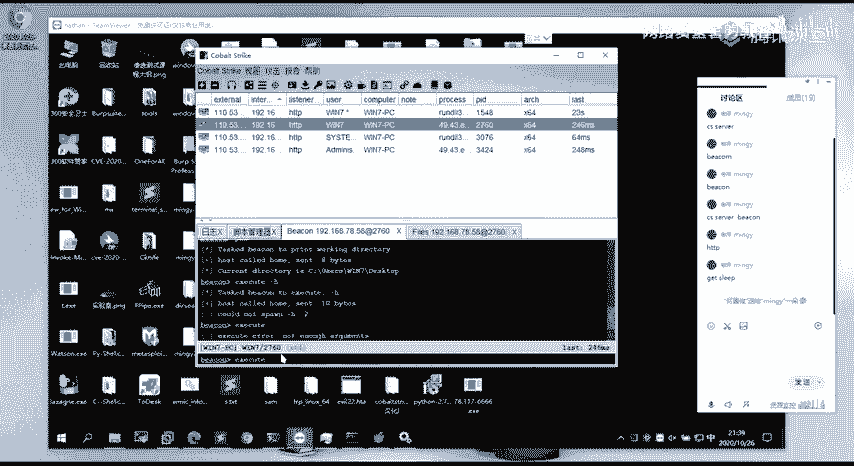

嗯。你搞过。我把反弹到那个。CS方面的这个co过来。

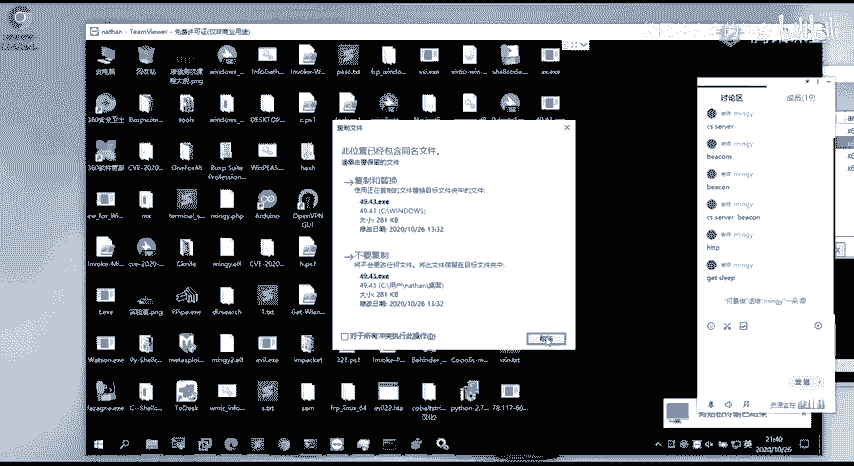

好，我们可以来以这一个为例啊，执行这个49。43。

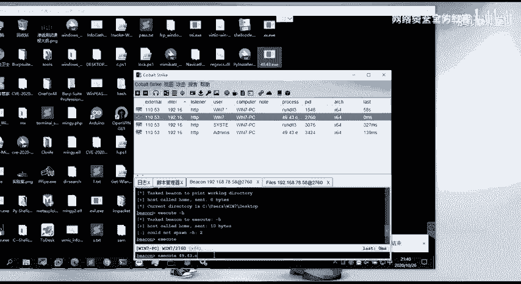

之前这一个对吧。哦。可以看到我这边为excut执行之后的话，在这边立马就得到了这样子的一个。规划对吧？但是在这边的话要注意就是。2，76年。得到的是。诶。这个就这个这一个掰开。跑不上这一个。

这一个普通用户的一个back。然后我们在这边，因为我当前的话是一个普通用户，对吧？所以的话我执行这一个以当前的一个普通用户权限执行这一个返弹的一个配out的话。

所以的话我得到就是一个普通用户的一个呃一个win7这样子的一个back。对吧？那么如果我能够以一个stem的一个权限去执行我这一个返弹下的一个呃。木马这个文这个程序的话。

那么我自然而然就能够去得到一个seastem systemtem的一个权限，对吧？所以的话我在这边的话呃，可以通过这样子一个方法，就是执行这一个。C。贾本银。我通过这一个。通过这样子的1个E叉P对吧？

然后这个E叉P的话执行的一个方执行运的一个方法就是CM机啊，接我们要去执行的一个。是吧然后我在这边的话就通过这个starstar的话就是在CMD当中呃，在windows下面的话。

我们可以通过star来去执行我们想要的一个文件。

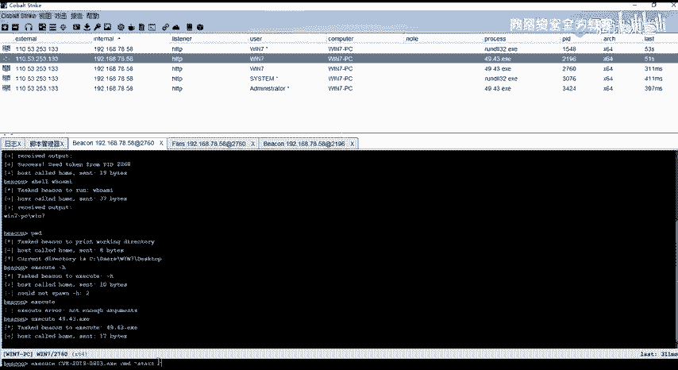

就执行呃命令程序。比如我在这边，我就。比如说我在项第当中，对吧？我s。大时这一个。

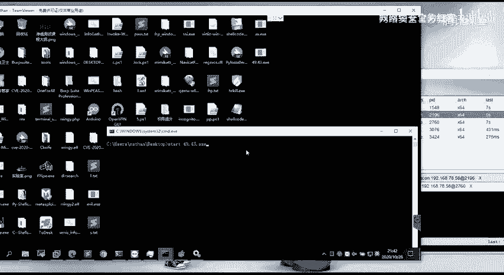

是9点。我这边失到的时候的话，我在这边又能去收到一个。

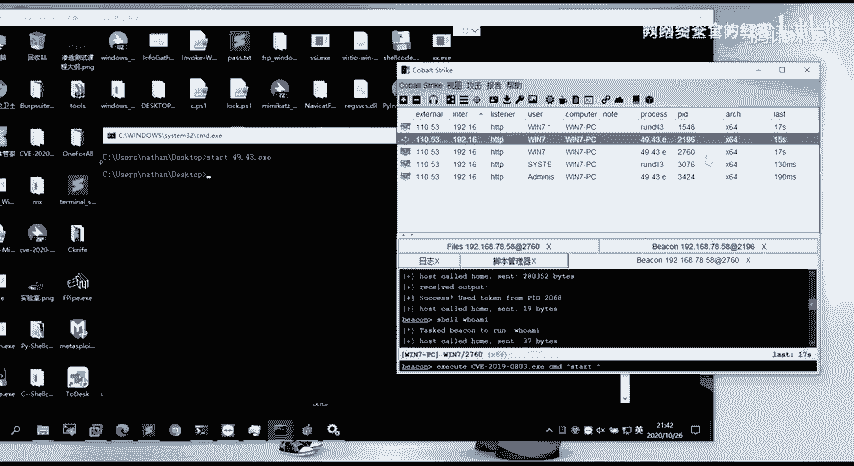

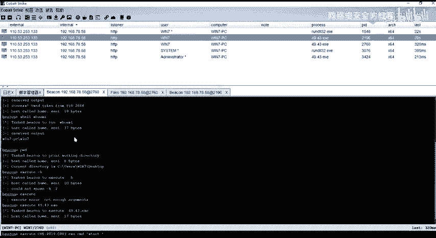

嗯。没有啊。😔。

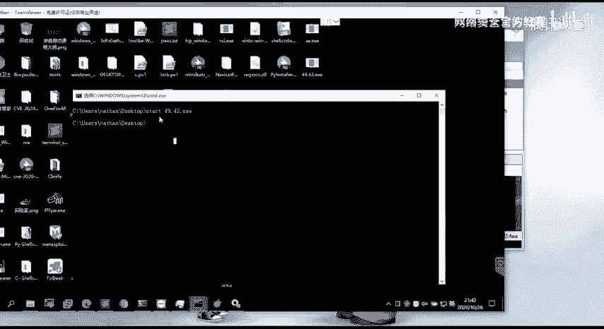

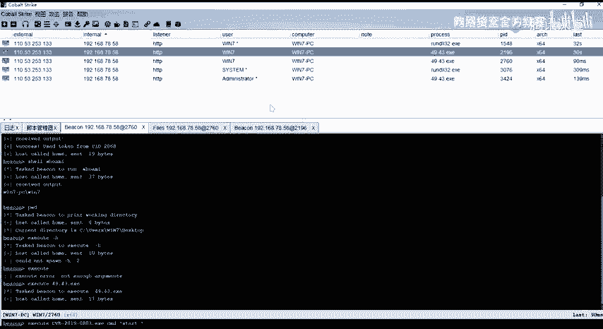

太过安嘛。要说我之前那一个。对吧我可以适大的来去执行。当然的话他这边一闪而过了，就是那个宽度吧。

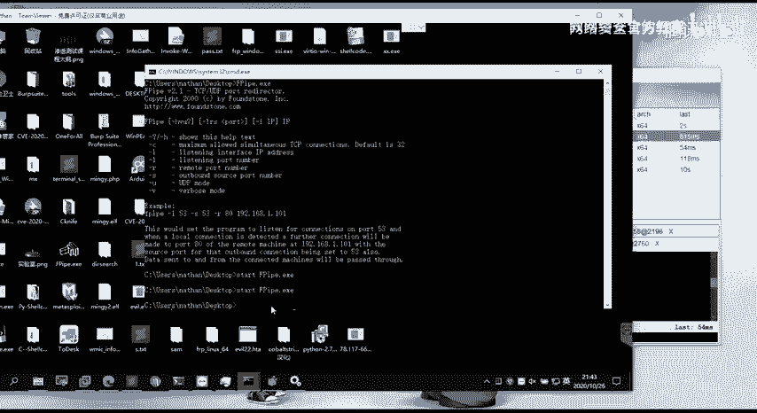

来去执行他。所得边有未请。然后我在这边的话就通过这一这边的。这个提全的这个E叉P对吧？然后的话执行这样子这个面就是49点。直前这1个49。43的这个。一财。哎。好是。

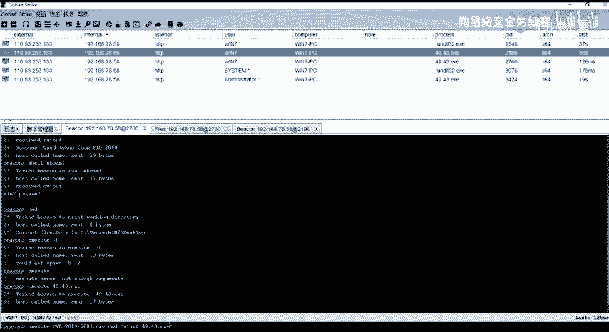

我的把就是这边呀，在这边。这个是啥。二次。

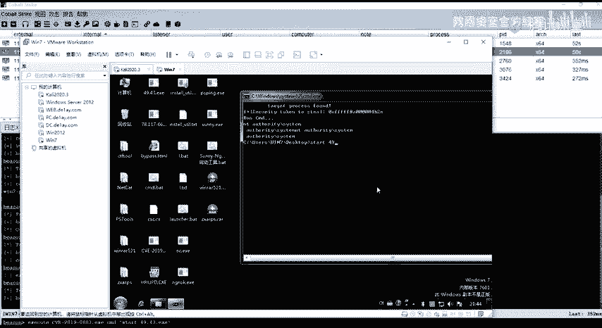

啊，我这边执行之后的话，立马就得到了一个又又得到了一个新的，对吧？是通过这个49。43来的。然后在这边的话嗯。我们再把所有的断了吧。

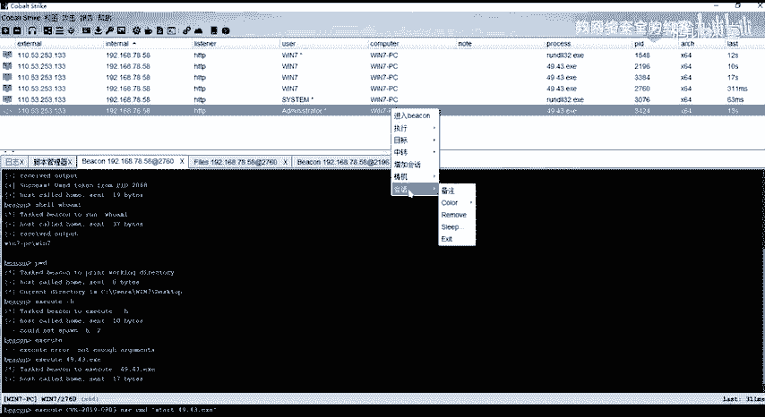

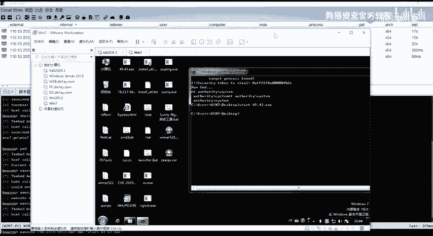

我们再在这边通过这样的一个方法来去进行一个执行。执行之后的话，在这边我们可以看。嗯。

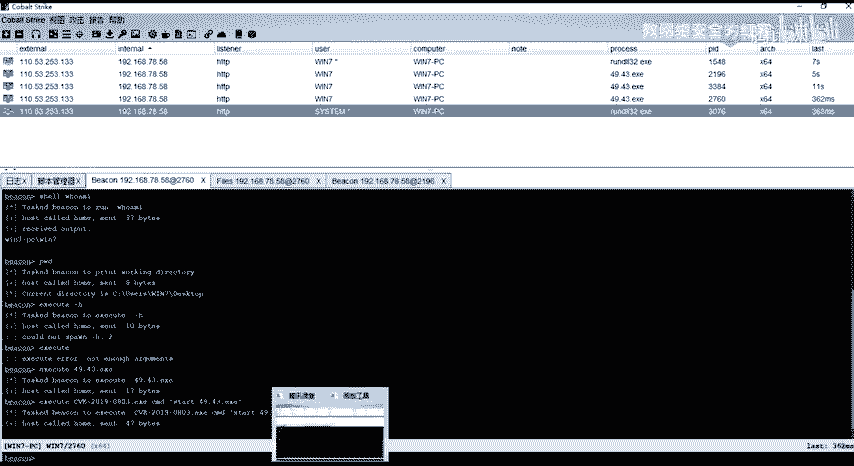

嗯。

怎么弹回了。

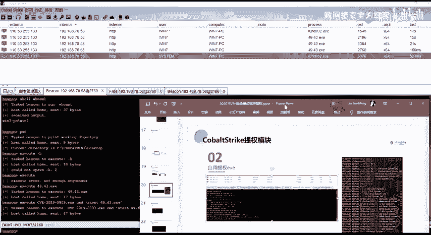

哦，有有了。他这个应该是有点慢啊。你看到我在这边的话执行之后对吧？执行之后的话，这边反谈了一个stem的，就是这个对吧？是通过这一个进程。而就是我通过这1个49。43的这一个程序的话。

得到了一个stem的一个权限。因为我在这边的话是一个seastem的一个权限去执行这一个程序的。所以的话创建这个进程的话，所对应的这个权限的话，就是这个sstem，对吧？

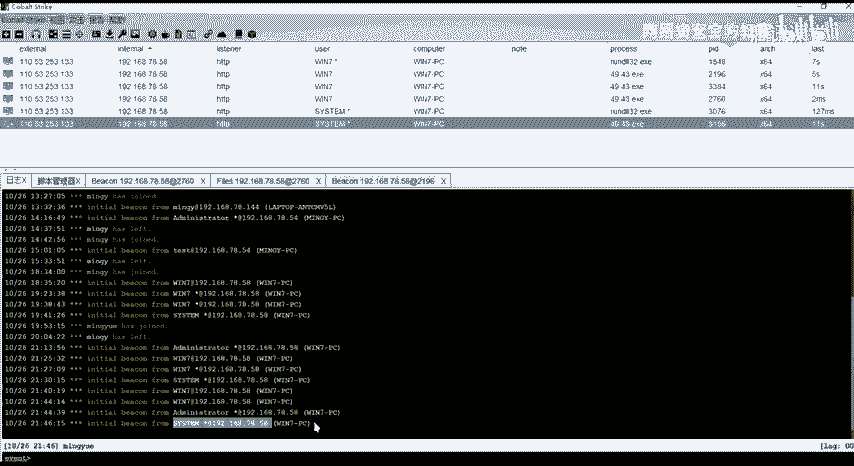

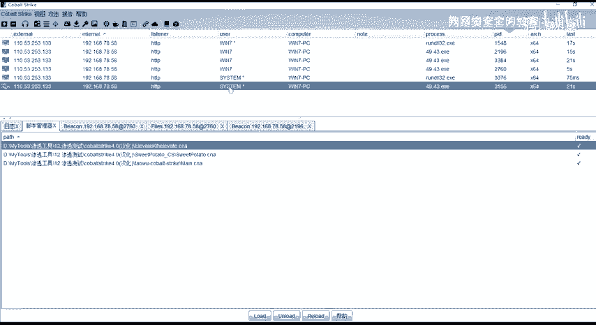

然后我当前的话就是呃这一个back的话就是一个seaem的一个权限嘛。

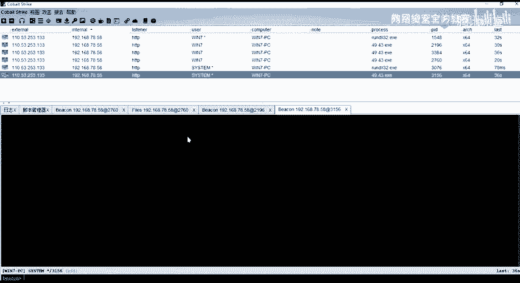

就是呃这一个。就自用的这种提全的一个一差异啊。我们可以通过这样的一个方法去进一个使用。

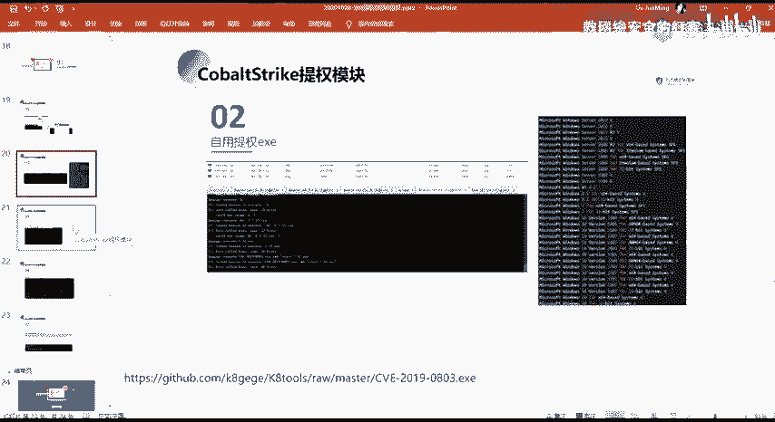

然后他就是关于这里，因为我们可以去执行命令嘛，对吧？然后这这边的话你也可以自己去拓展嘛，对吧？就是你反他西尔的这样子的一些呃。这样子的一些方法。

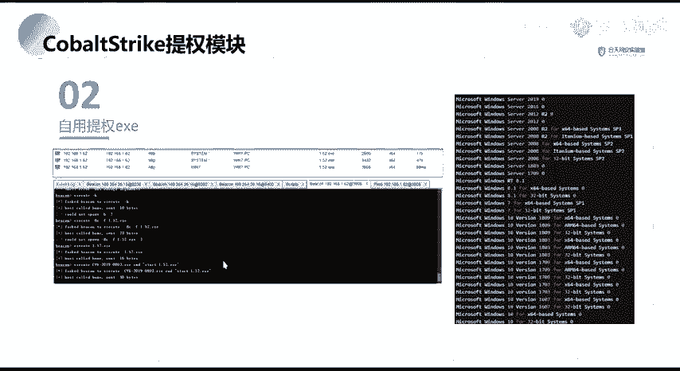

我们可以一个系统的一个权限去执行。