# 2024网络安全系统教程！清华大佬花159小时讲完的网络安全系统课！别再盲目自学了，学完即可就业！零基础入门网络安全！（渗透测试／漏洞挖掘／CTF／黑客技术） - P98：85.Powershell提权模块.mp4 - 教网络安全的红客 - BV1ft421A7Nj

然后第三的话就是这个power过屑。抛 share尔的话，这个前面前面应该有介绍的吧，就是这个抛 share尔这一个导入这样的一个抛 share尔的一个模块。

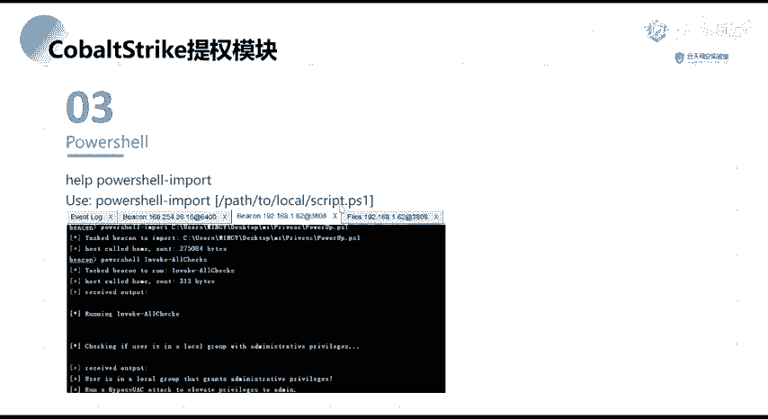

就是呃在4S当中。嗯。这个前面前面有讲过吧。有的对吧？那呃这这那这里的话我就呃就大概的说一下吧，就不不去给他演示了。前面的话有讲，也有操作对吧？

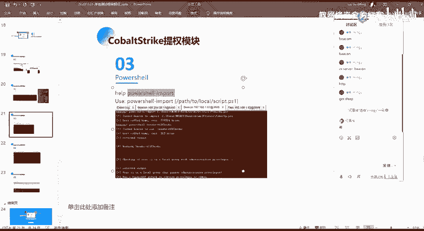

然后在这个话就是在CS当中用这个po share import来去进行一个加载我们的一个p share的一个脚本。然后在这边的话就是通过这个power up。这个power up的这个脚本。

这个p up这个脚本，它是就是power share下面的一个比较有名的这样子的一个提全的一个脚本。就是执行之后的话，它会去对我们的一个目标去器去做相应的一个信息的一个收集。他要去尝试呃这样子的一些。

去尝试一些齐全的一个漏洞的一个检锁。

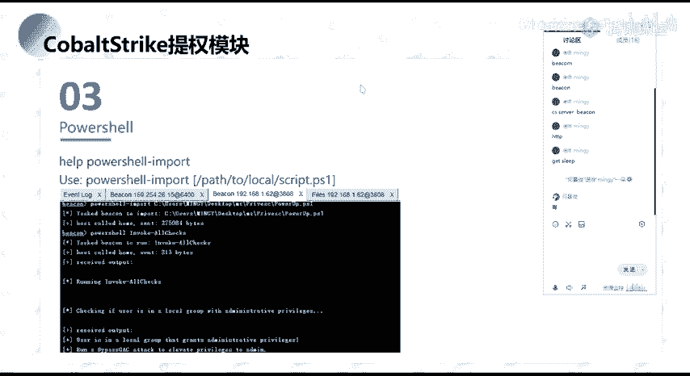

。就是这个这个话就是它的一个脚本。然后这在这边的话，用这个脚本的话，我们首先通过poion或把它加载加载进去。加载进去之后的话，在这边它有这样子的一个方法，就我们直接inwork这个。

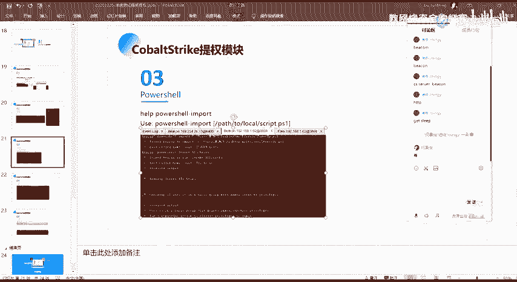

就这一个。我们可以用这个方法，就是这个invo or check，我们使用它的话，它会去做这样子的，就是它会去加载它所有的这样子的一些能够去探测提群的这样子的一个去紧锁提群漏洞的这样子的一个脚本。

然后的话它会对目标系统下面去做一个比较全面的这样子的一个。

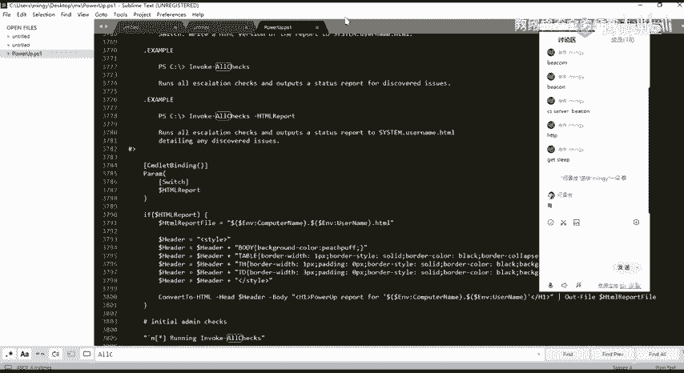

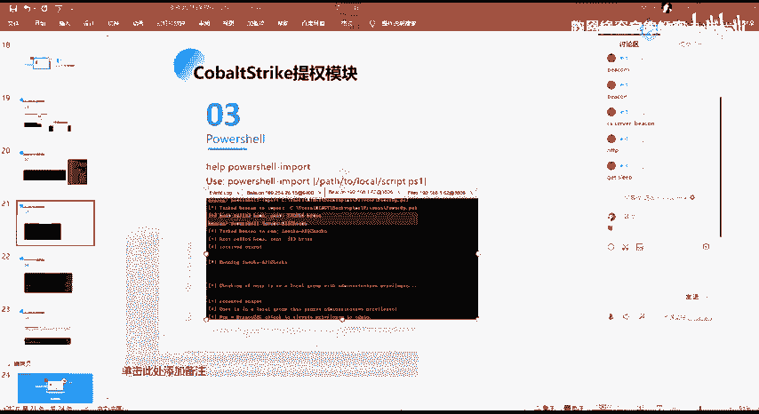

齐全的一个漏洞的一个检锁。啊，这边的话同样的还是操作一下吧。

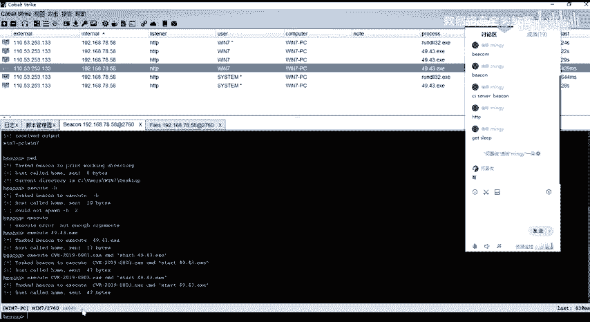

好。

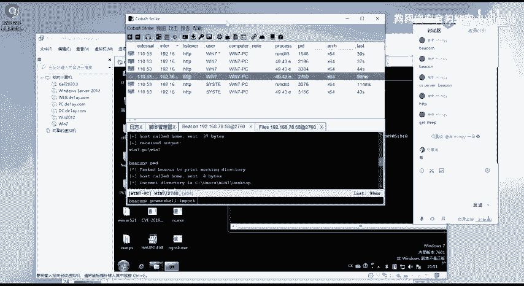

我去呃通过p讯port加载我这边本地的这个p up的这个脚本。啊，然后加载进去之后的话，我直接通过抛 share。

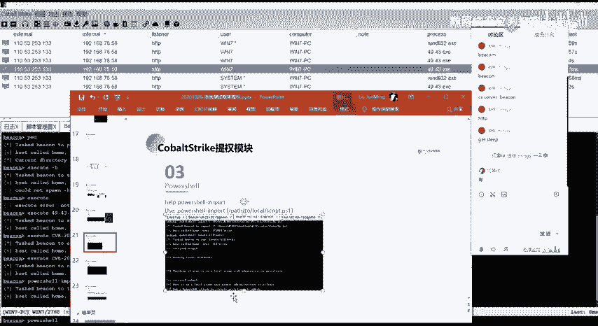

通过抛ship来去执行他的这样子的一个。还有嗯。他的这个方法。嗯。然后执行之后的话，呃，他会去加载很多的这样子的一些信息啊。嗯。这个的话先让他跑着吧。你，看一下，大概看一下就是。然后他会去检查。

就是你的这样子的一些文件，对吧？然后的话还去检查，就是可以看到always install store every的对吧？

就是这个的话其实就是我们前面的那个就是以一个sem权限去安装MSI的这样子的一个策略嘛，对吧？然后还有还有这个对吧，这个uncorty的service pace。

就是我们讲的那个windows下面的那个啊服务漏洞，对吧？他都会去做这样子的一个检锁，就是这个脚本。

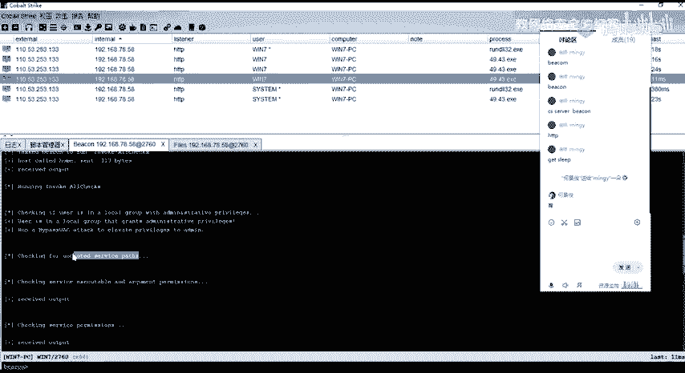

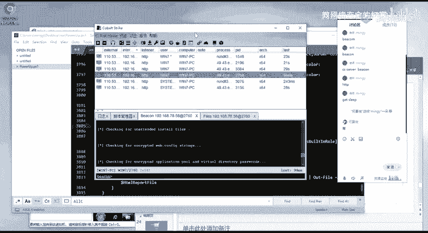

这是这个。好呃。他这边的话是呃这边列举的一个，像比如说这个就是check service，就是可以可以执行的这样子的一个权限，对吧？然后在这的话，他返回了这样子的一些信息给我们。然后在这边的话。

其实我们可以看到就是我们前面所应用到的这样子的一个漏文，对吧？它的一个路径就在这边显示出来了，对吧？我们可以去做一个更改，它显示了这个这个服务，它对应的一个路径。然后的话modmodify able。

也就是说这个目录的话是我们能够去进行一个改，就是更改的，也就是有写的一个权限的，对吧？然后再的话他有。相应的一些信息是吧？

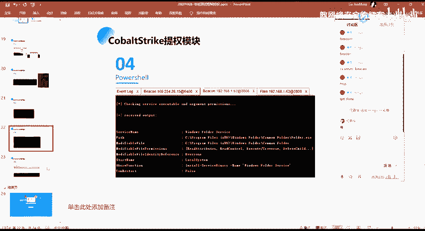

然后还有其他的这样子的，这个的话，大家自己执行的话，自己去查看，对吧？因为他这边的话，他有很多这些东西啊，就是要跑完的话，需要一些时间。

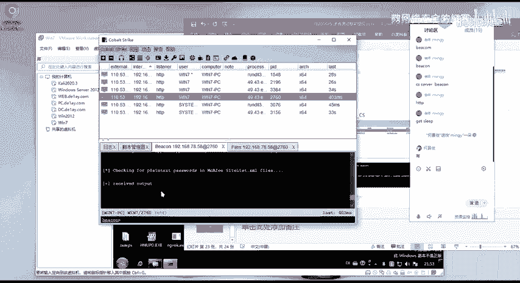

然，以及呃我们本节课最后的一个内容就是这个sweet pot potato。这个的话就是呃跟前面的就是就是前面讲的那个土豆家族的一一个对吧？然后他这个的话就是把它写成了1个CS的一个脚本。

然后我们在CS当中能够去加载它。然后其实在这边的那个套件当中，其实也有啊。然后这个的一个使用的话，就是其实跟前面都是一样的。就是呃你加载之后的话，它会在那个提全的这个模块当中能够去选择它，对吧？

然后的话接我们的一个今天的一个名字。今天器的一个名字。然后的话如果能够存在提全的这个漏洞话执行之后的话，我们就能够去得到一个stem的一个呃back。

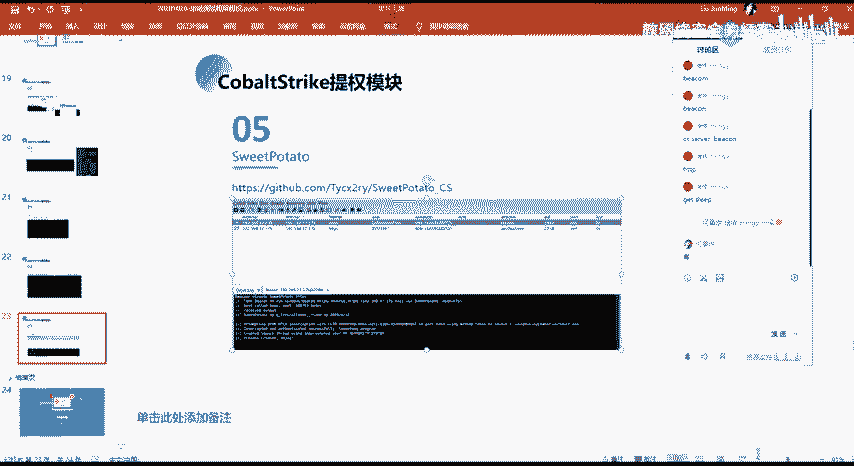

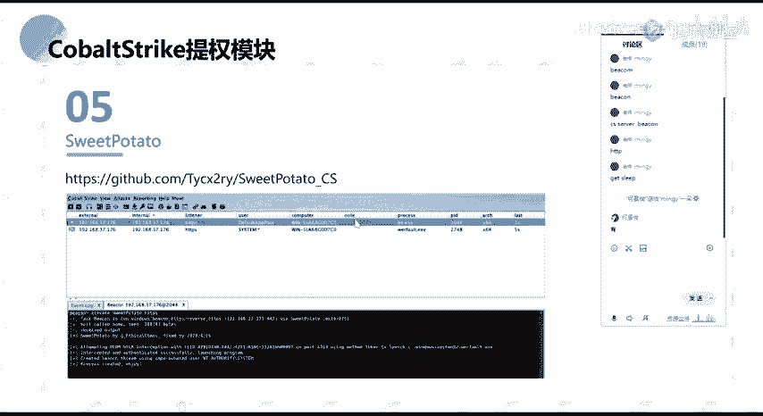

呃，以上的话就是我们本节课的所有内容，大家有没有什么疑问？

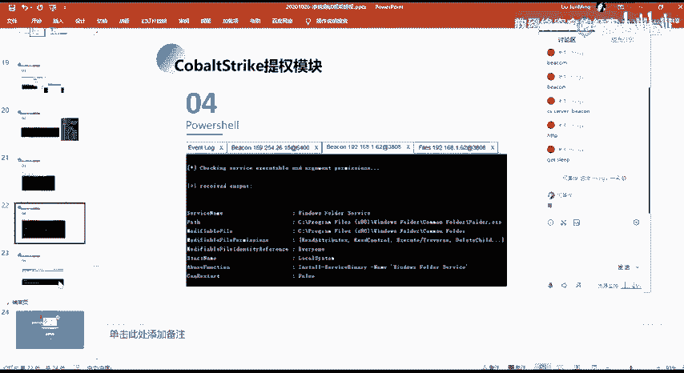

呃，本这个的话主要的话就是呃。就是。怎么说呢？就其实主要的话就是这两个框架，就是说我们在去提全的这一步的时候，对吧？我们在使用这两个框架的时候，我们有什么样子的一些方法，对吧？以及相应的一些技巧。

以及脚本对吧？为为何。就是大家这些的话应该没有什么问题，好像就。大家看我的哦，有问题吗？有问题的话，你说。就我觉得的话这个的话大家看我这操作的话，可能没有什么概念。然后自己去做一遍的话。

应该是没有什么问题了。就是一些呃操作嘛。就是呃给你这样子的一些东西啊，那你实际的在这两个框架当中，你去进行一个应用，对吧？

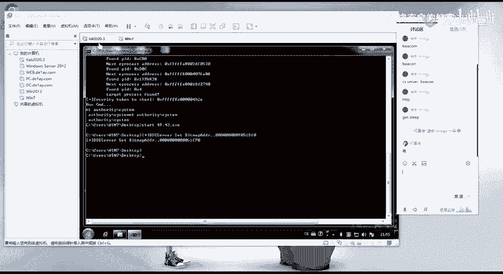

关于知识点的方面的话，这里块的话没有涉及很多。好，这位同学有有问题，有什么问题直接说吧，好吧。Yeah。然呃给大家。2分钟的时间吧，好吧。现在时间也不早了。呃，有问题的扣一没问题的扣2。

然后自己下课做的扣3。呃，回答之前的问题是哪一个？呃，OK我还以为你是说有问题啊。是。啊，那应该都是没有什么问题了是吧？这节课的话其实东西不是很多啊。同样的就是课后作业的话。

就是大家把我这边的这些内容的话，自己操作一下吧，好吧。好呃，没有其他问题的话。那么呃我们本节课的话就到这边就结束了。呃，大家早点休息，好吧，呃，下课。

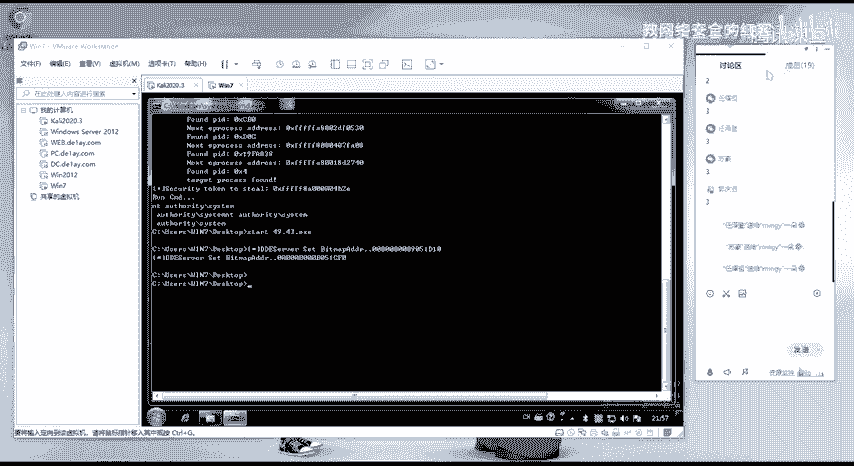