# 2024网络安全系统教程！清华大佬花159小时讲完的网络安全系统课！别再盲目自学了，学完即可就业！零基础入门网络安全！（渗透测试／漏洞挖掘／CTF／黑客技术） - P99：86.linux提权.mp4 - 教网络安全的红客 - BV1ft421A7Nj

没问题的话，那么我们正式开始我们今天的一个课程内容。我们今天的话主要给大家介绍一下lininux下面的linux系统下面的一个提全。呃，本节课的话主要的话有这4块内容。

首先的话就是第一块linux的一个提全信息收集。第2块的话就是linux系统内核漏洞的一个提全的相关的一个介绍，以及以及利用的一些呃方法。第三个的话就是lininux环境变量的提全。

第四个的话就是密码哈希。我们通过密码哈希的呃一个方法来去进行一个呃提全。以及最后一部分的。嗯。啊，不好意思啊。🤧哎有。最近这几天喉咙喉咙之间有点有点废了呀。直接哑了讲哎给你们讲课。

讲的好不容易有点受不了。打系有点咳嗽。所以说中间可能会就是呃突然会就是我讲话的话突可能突然会卡一下，就是可能讲着讲着突然喉咙就卡住了。这个的话呃大家见谅一下，好吧。然呃最后一个话就是提全实验。

就是我们呃实验室里面的两个提全的一个实验。大家呃给大家作为一个课后作业。啊，首先的话我们呃先来看一下第一块的一个linux提全的一个信息收集。呃，就跟我们前面在讲windows提全的时候。

其实也是一样的对吧？我们windows信息，我们windows下面的一些提全的话，我们的第一步同样的也是去进行一个信息的一个收集。然后这边的一这些收集的一个信息的话。

其实就是为我们后面去做一个提全是作为一个准备的。就我们前前面前期收集到的这些信息的话，我们用来寻找，就是说作为我们去进行一个提全的一个呃依据。我们。通过相应的一个信息收集的一个呃方法。

收集到各方面的一些信息，然后再通过这些信息，从这些信息当中去筛选出，我们能够去进行一个利用，也就是能够去进行一个提全的这样子的一些方法。啊呃，其实前面的话在讲linux呃信息收集的时候。

lininux内网信息收集的时候，其实这些的话都已经呃已经介绍过了，对吧？就是呃前面的话就已经给大家就是呃比较详细的介绍，就是说我们通过什么样子的一些命令，对吧？在linux下面。

我们通过什么样子的一些命令去收集对应的一个信息。那比如说它的一个发行版本对吧，就linux的一个版本，以及内核版本，就我们再去进一个呃linux的一个内核的一个漏洞提群的话。

我们肯定需要去知道它的一个内核版本了。然后的话我们再去根据它的一个内核版本来去寻找对应的呃可能存在的这样子的一些提群的一个漏洞。然后黄金冰量黄金冰量的话在呃。待会儿就是后面的话会讲。

就是呃一个黄金变量的一个提全，就是我们利用的就是它的一个黄金变量。然后我们可以通过相应的这样子一些呃命令。嗯。就呃能够去查找到对应的环境变量的一个配置。然后还有就是网络信息，对吧？网络信息的话。

我们需要去知道我们的一个目标机器上面它的一个呃网卡，它有哪一些网卡，对吧？然后还有就是一些应用程序，一些呃应用程序服务。就是我们针对某一些服务，就是对他的一个服务的一个信息做一个收集。

就是呃我们前面其实在讲那个提权的时候，对吧？就有讲就是呃。就是呃系统的一个提全以及应用程序的一个提全，对吧？以及在windows上面的话，就是相应的一个呃服务的一个漏洞，对吧？那么。

它的就是说系统上面的这种应用程序，它的一个版本，对吧？以及它所运行的这样子的一个服务。那么如果说我们通过这样子的一些信息的话，找到了其中正好有是正好对应的它运行的这个服务的一个版本。

它有这样子的一个提群漏洞。那么我们就能够去作为一个突破口去进行一个提群。然后以及还有就是呃运行的一些服务。在这的话就是特指的一个root用户啊。就是说我们要去进一个提全。在我们linux下面的话。

就是从一个普通用户去提群到一个root用户，对吧？那么我们在呃寻找的一个目标的话，其实就是呃针对这一些服务，就是说利用它的服务的一些配置的一个缺陷。

然后的话它的这些服务的话又是一个root用户去运行的话，那么我们可以通过这样子的一个服务来去把它提全到一个root用户。呃，等等的，还有计划任务的一计划任务相关的这样子的一些信息。

在呃下一节课的话会讲计划任务的一个提全。呃，在这边的话就是我不会去把这些命令详细的做一个介绍。这个的话大家可以接受吧。就是这些命令的话，大家自己课后去呃了解。呃，应该不需要我一个一个去讲吧。就前面。呃。

前面也有提到。然后的话就是相应的一些服务的一个配置。像服务配置的话，像我们的HDP的HTP的这样子的一些呃配置，对吧？它的一些配置呃错误以及。嗯，我们从这样子的一些呃外保服务的这样子的一些配置文件当中。

能够去找到对应的这样子的一些敏感的一些信息。Yeah。呃，等等还有其他的这一些。这边的话我就不一一的去说了呀。嗯，这边的话大家自己看一下吧，PP的话已经发给大家了，我这边的话就不一一的去说了。好吧。

然后这边的话就是。linux的一个提全的一个信息收集。就我们前面已经有介绍了这么多的一些啊收集的这样子的一些信息，对吧？但是我们实际的话去进行一个呃对目标主机去进行做样做这样子的一个信息收集的话。

你不可能一个一个命令，对吧？你照着我这边的这样子的PPT对吧？这一点你去呃查找它的一个信息。这一点你再去查找对应的一个信息。那么这样子的话其实是没没有效率的对吧？所以的话我们通常的话会去用这样子的。

就是相应的一个信息收集的一个脚本。就是我们直接执行这个脚本，它就能够去批量的获取我们所想要的这样子的一些信息，对吧？

然后的话其实我们前面讲这一些讲这些分别去讲这样子的一些命令来去做对应的一个信息收集的话，其实就是让大家去了解，对吧？让大家心里知道就是说我这个脚本它收集到的是哪一些信息，以及对应的这些信息。

我们可以去干嘛，对吧？然后在这边的话呃，我这边的话有给这样子一个脚本，就是这一个linkux的一个。集群的一个信息收集的一个脚本。Okay。呃。

这边的话是在get up上面的一个就是提全的一个信息的提全信息收集的一个脚本。它这边的话是一个呃需要脚本，它里面写了很多的这样子的一些呃，就是内容啊。这些内容的话，它就是针对的去做一个呃信息的一个收集。

呃，关于这里面的一个内容的话，大家想了解可以去看一下。但是呃我们在这边的话，你只要知道就是说他我们执行这个脚本之后得到的一个结果，对吧？就是那个结果它才是我们想所需要的。然后在这边的话，我们看一下。

我这边的话已经有执行了，因为他的一个脚本的话比较多呃，执行的话还是需要一点时间的。呃我这边的话已经提前的呃执行了，就是这一个。

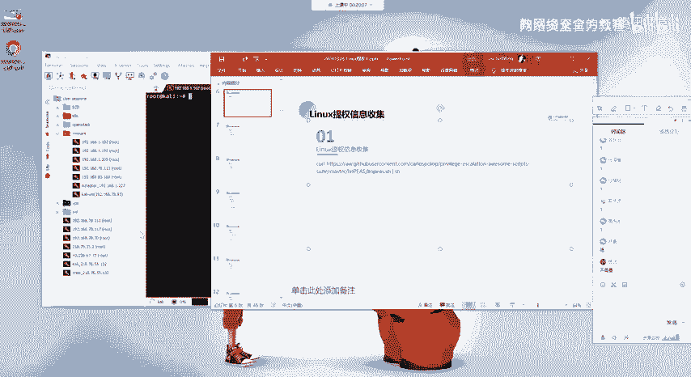

就是这样子的一个。嗯。就这样子的一个脚本。呃呃你们可以通通过PPT上面的直接1个CL来去就是获取下载它的这个脚本，然后的话给SH去执行嘛，就是通过SHH来去执行这样子的一个需要脚本。执行的话它就会。呃。

进入到这边。进入到这边的话，下面这些的话就是它的一个分别的呃，它的一个脚本执行之后所收集到的一个信息，也就是返回给我们的一个信息。那么这些信息的话就是我们所需要的。在这边的话。

我大概的就是呃提一下对应的。对应的他收集的这样子那些信息。呃，其实大家执行之后的话，通过这个脚本这边也能够很清晰的知道。首先第一个的话就是basical information，对吧？

就是基本的一个信息。也就是我们的一个基本的一个信息信息收集。然后他这边的话就是收集我们常就是常用的，也是经常。常见的这样子的一个系统的一个版本，对吧？其实这边的这一句的话。

就是我们通过U name name杠A对吧？因为内刚才执行之后执行之后的一个结果，对吧？就是放在了这边。其实你要会去写这样子的一个脚本的话，然后的话你又知道你你了解了我这边讲的这样子的一些东西的话。

你自己也可以去写这样子的对应的一个脚本，对吧？就是他这边的话就是执前有那么该之后的一个输出嘛，对吧？然后在这边的话就是你当前的一个用户嘛，就是比如说你当前的用户执行ID这边反馈的一个结果，对吧？

然后当前的一个用户的话是抱抱是吧？以及hose name啊等等的这样子的一些。呃，还有的话就是。呃，rightriable也就是可写的一个目录。也就是在这一个目录的话，我当前的这一个用户。

这个普通用户可以往这里面去写东西，对吧？然后写东西的话就说明我如果说我们要去写入写入一个这样子的一些脚本什么的，我们可以写落到这个目，对吧？呃，以及还有的话这边有列出了两个命令。

就是两个常用的一个命令pin以及NC。然后它这边有列出这两个命令，它是干嘛的对吧？像pin的话，我们可以呃用来做这样子的一个网络发现，还有NC就是说它的这一个呃linux系统下面的话。

有装有安装这样子的1个NC的一个命令。那么我们就可以直接去使用，对吧？它能够去进行一个端口的一个扫描啊，还有网络的一个发现，对吧。他这边的话呃其实都写的很清楚了，对吧？

还有的话下面的话就是系统的一些信息。其实就是我们的呃这边的话就是那一个。在物班图下面的话，就是那个LB杠re。🤧执行这一个命令之后的一个结果啊吧，然后还有就是收度收度的一个版本。在我们后面的话。

在我们下一节课的话会讲就是收度的一个权限的一个滥用。就是说它收度的话，它的一个权限它没有做好的一个控制。然后的话我们就可以利用它来去做一个提群。嗯うん。嗯。以及还有paspa的话就是我们的一个环境面。

就待会的话会呃讲。就是这样子的一个目录。然后待会的话再给大家讲，就是环境变量它的一个作用。其实环境变量话就是跟我们windows下面的那个环境变量一样嘛，对吧？你在windows下面。

你去配置那样子的一个环金变量，然后的话你把你想要去执行的这样子的一个程序，把它给添加到这样子的一个环境变量当中。那么你在CMD下面，你去执行对应的一个命令的话，它就不会说报not found，对吧？

就是找不到那那样子的一个命令。因为你配置到环境变量当中的话，它就会去环金变量当中，你所配置的那个目录当中，它去查找是否有这样子的一个程序。如果有的话，它就可以去直接的执行。

就lininux的话跟windows上面的话呃也是类似的。就是你在lininux上面去执行相应的一个命令，它会去在这个环境命令当中去查找啊，是否有对应的这样子的一个呃你执行的一个命令的一个程序。

如果有的话，他就会去呃执行它，然后的话返回结果给我们，对吧？以及还有时间啊，还有呃系统的这样子的。这边呢的话就是一些磁盘。CP u 等等的。呃。我这边的话我就不一一的去那个了，然后他这边的话。

他所输出的一个信息是相当丰富的。嗯。还有像在这边yautiful soft software，也就是呃。我们可以去执行的，或者说呃它的一个目标这边的这一个机器上面。

它能够去呃我们能够去执行的这样子的一些命令。像比如说NC啊，对吧？呃，we gett cL这些命令，我们都是有权限去执行的，还有pin以及GCC make这样子的一些兵役的一个环境，对吧？等等的。

还有python3，还有这样子的一些脚本。嗯。呃，以及。嗯。这样子后面的话就是我们要去收集的这样子的一些服务的一个信息，就是我们的一个定时任务，我们的一个进程，我们所就是系统当中的一些服务，对吧？

这边的话就是呃进程的一些信息。以及这边呃定时任务。对吧。在。呃，这边啊定时任务，然后在这边的话，你可以看到这边它有这样子的一个定时任务啊。就其实这边的话呃我们下节课的话会讲。

就是我们通过发现它这边定时任务的这样子的一个呃这一个程序啊，就是它每隔一分钟执行的这样子的一个程序。因为它是一个漏ot用户去执行的。所以的话我们可以去查找到对应的它的这一个程序，它的一个作用。

然后的话如果我们可以去分析它的一个行为。如果他能够去进行，就是说我们可以利用他的这样子的一些一个呃。权限的一个配置的一个错误。能够去进行一个提群。当然的话就是呃后面给大家介绍的呃。

以及后面的还有很多的这样子的一些东西的话，其是就是对应的我们前面分别去讲的这样子的一些在另上面执行的这样子的一些信息收集的一个命令。我这边的话我就不一一的去说了，好吧。啊，这边的话应该。

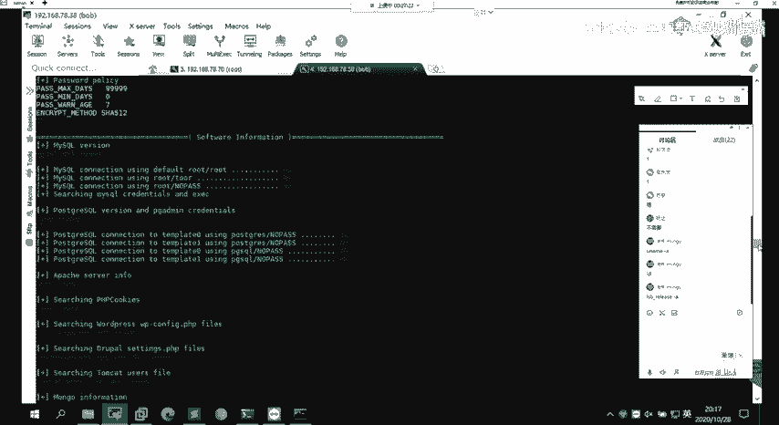

而已带大家大概的看了一下，他这边的话有很多的这样子的一些信息啊。好，我们可以根据这边得到这一些信息，对吧？能够去有针对性的去分析它。呃，这边的话就是这一个信息收集的。

就提前的一个信息收集的一个脚本的一个使用啊，以及对应的这样子的一些。收集到的一个信息的一个介绍。呃，上面的话就是一些信息收集的这样子的一些呃一个方法。然后还有的话就是这边。准备还有查找利用代码。

就我们前面在讲提全的时候，就呃也有说有一个条件，对吧？就是你要能够去提全的话，你首先要有对应的这样子一个提权漏洞。然后的话你有这一个漏洞的话，你还需要有对应的一个利用的一个代码，对吧？

如果你没有对应的利用代码，那么你。那么你也利用不了这样子的一个漏洞，是吧？然后的话有对应的一个利用代码的话，我们知道就是说利用代码的话有像这个这样子的一个像C。呃，C加加。对吧然后还有像Pthon的。

还有像。rebu等等的这样子的一些环境。就说通过这样子的一些呃脚本语言所编写的对这样子的一些利用的一个代码，对吧？那么对应的你要去在对应的它的一个目标机器上面去执行的话，你就需要去知道它的一个目标机器。

它支持什么样子的一些呃语言环境，对吧？像比如说你要去执行一个pathon的一个脚本。那么如果目标机器上面它没有pathon这样子的一个环境。那么你怎么去执行呢？对吧？你执行不了。

以及对应的你要去做一个就是编译你的一个C代码的话，你需要有GCC。这样子的一个兵役的一个环境，对吧？以及呃就是上传文件的一个环境，就我们去做一个在另上面去进行一个文件上传嘛，就我们前面再。

文件传输的时候，其实也介绍了，就是另令上面的一些方法。那呃最后的这一个的话就是呃查找利用袋吧。就我们前面对吧？加应的一个信息的话，我们已经收集完了，收集完了对应的一个信息。我们分析我们分析之后的话呃。

查找就是说通过。对分对信息的这样子的一个整合，对吧？我。可能就是发现了其中有对应的这样子的一个漏洞。那么我知道了它有这样子的，可能存在着这样子一个提群漏洞。我想要去查找对应的一个利用的一个代码，对吧？

那我们通常的话会去哪里去寻找呢？就你可能会说你直接百度对吧？你百度的话，你可能就是你的一个针对性不强，而且呃你百度的话，就是你看别人的一个文章的话，可能呃千奇百怪哦，对吧？

然后在这边的话就是呃给大家介绍一下就是。一些常用的这样子的一些，我们去查找利用代码的这样子的一些网站。

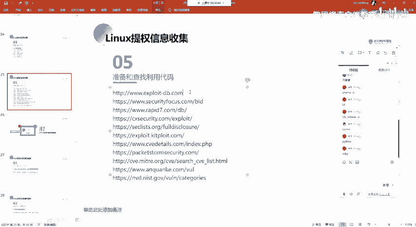

呃，包括呃国内外的这样子的一些网站。就我们再去，比如说我们最近去爆发了这样子的一个呃就是爆发了这样子一个漏洞，对吧？然后的话它的一个利用代码呃爆出来了，那我们去哪里去找呢？

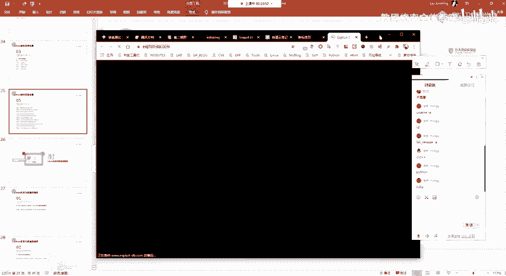

首先第一个的话就是这个expoitDB啊，这个的话就是一个漏洞信息库。然后我们在这里的话，我们能够去查找到，就是说你呃就是说能够去查找到已经爆出来的这样子的一些漏洞。它的一个。利用代码。嗯。嗯。

比如说嗯。就这一个吧。嗯。比如说就这一个吧。这个的话正好符合我们的一个今天的一个课程内容啊，就是一个。本地本地的一个提群。就本地提全的一个漏洞。然后我们在这里的话，我们就可以去找到它的这样子一个漏洞。

它是在一个blue men。他。这个版本它小于2。1。4的这个版本的话，它存在这样子一个本地提权的一个漏洞，对吧？然后在这边的话就能够去找到它的1个E叉P就它的呃有它详细的关于这个漏洞的一个信息，对吧？

然后的话以及他的一个利用的一个方法。然后我们在这边的话也可以去。去下载它的这样子的1个E叉P啊，然后的话去进行一个使用。这是一个。あか？有点咳嗽啊，我这。

然后还有的话第二个的话就这个security Foxox。这个的话也是呃比较好的这样子一个网站，就是你要去做，比如说你要去。你要去对某一个就是已经爆发的一个漏洞做一个复线，对吧？

然后的话你做漏洞复线的话，你要去了解它的就是这个漏洞它比较多的相关的这样子的一些信息，就不仅仅是你的一个利用脚本，对吧？还有其他的这样子的信息一些信息。那我们就可以在这边去做一个查找。然后像在这边的话。

他。呃，我们通过CV的一个编号能够去搜索我这边话，我就呃就以这一个为例吧。我这这边就不说了，就是这个jacken时的这样子的1个CV的一个漏洞。然后我们在这边的话就是找到对应的这样子的一个页面，对吧？

在这边的话，它就有关于这一个漏洞，它的一个详细的一个信息。像比如说它能够它就是它影响的一个版本。就呃存在漏洞的这样子的一个版本，以及它的这个漏洞发现的一个时间，对吧？而且下呢个 c b d 嘅编号。啊。

还有的话。呃，这个没有。然后还有的话就是这边exportit就是我们的1个E叉P嘛，对吧？然后他这边的话他没有念的话，就说明呃在这边他没有啊，我们找一个看。有的。有。听意。谢谢。Yeah。没有了。😔。

看一下能不能找到一个有的呀。就是呃在这边E叉P这边，我们就能够去查找到对应的就是在呃这边exportit dB或者说其他的一个地方的这样子的一个呃利用的一个脚本啊。这个没有。没有的话就算了。然后呃还有。

就是说在这边的话，我们能够去查找到对应的一个信息啊，以及在这边有一个reference。 reference的话就是引用嘛，就是说他的这样子的信息，他是从哪边获取到的。嗯。😊，然后这些引用的话。

我们就可以去查找到对应的。像在这边的话就是这个插map的它的这样子一个漏洞，对吧？然后这是它的一个官网，以及在这边的话，有对这样子的一个漏洞的一个详细的一个分析，对吧？如果你想要去复现这一个漏洞。

你就可以去参考它的这样子的一个文章，然后去。去对他做一个分析。对吧这个的话是一个叉SS的一个漏洞嘛。这是一个呃，还有的话。我我这边的话，我就不一的去那个去说呀。我这边列举几个就常用的。就这些的话呃。

这边我念的这些网站的话，都是就大家去找对应的这样子一些漏洞的一个信息的话呃。反正是我我这边要去找的话，我通常会去这样子的一些网站去查找。好，这个话就是这个。rapid7rapy的7的话，呃。

如果大家就这个的话大家应该都听过啊，都知道吧。就是我们的1个MSF的这样子一个框架的话，就是这个公司的一个产品。就MSF的话是呃这个公司的一个产品，然后的话是由他们在做的一个呃维护，对吧？

然后在这边的话，就是呃他这边他有对应的这样子的一个就是漏洞利用的一个数据库啊。然后在这边同样的就是有对应的这样子的一些呃。对应的这样子的一些呃E叉P以及对应的这样子的一个信一些信息。对吧？

像比如说这样子的这1个CV的一个漏洞，它的一个呃描述，以它的一个解决方法。就应该有。以及呃这一个的话是另外一个网站，就在这边的话，它有列出了就是。

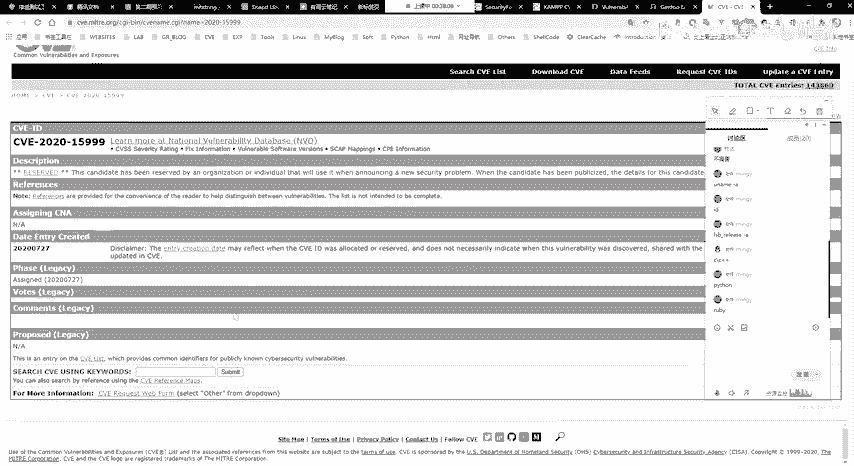

呃，他了一个信息啊，也是。嗯。

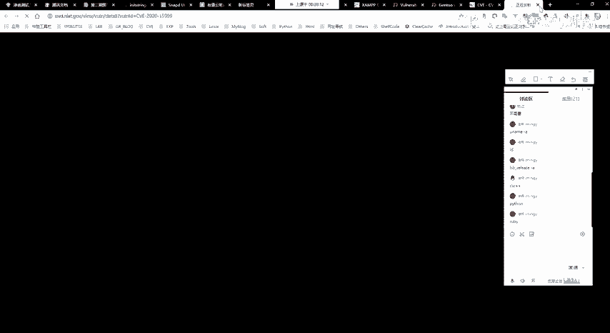

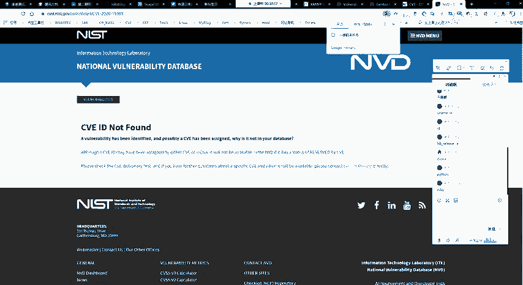

嗯。

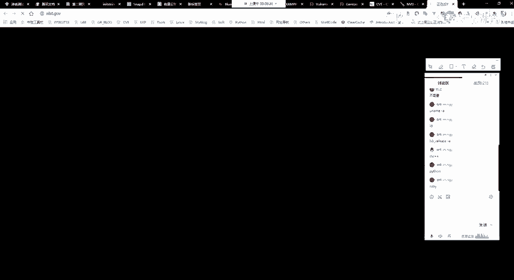

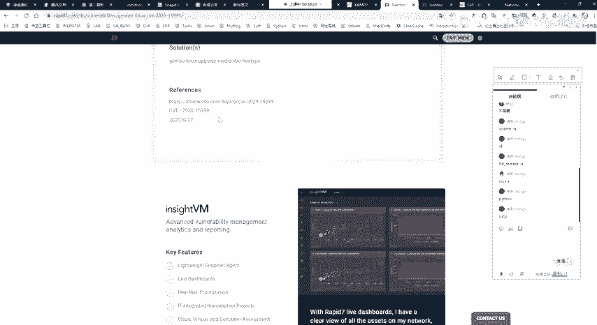

。

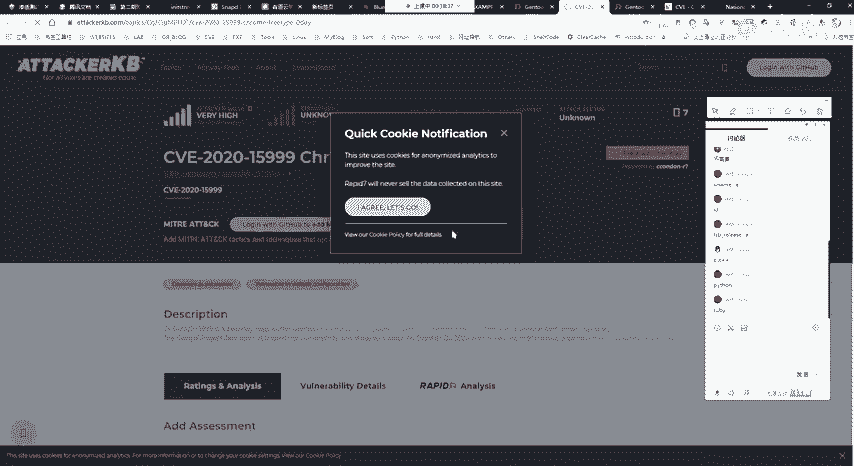

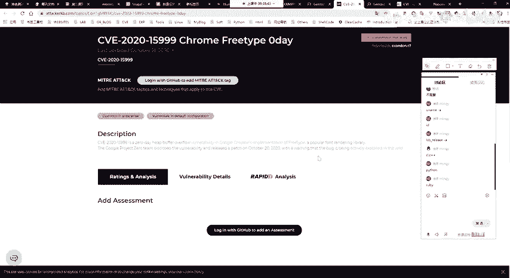

呃，我这边的话就不翻了。就是呃我们通过这样子的一些网站，他所就是收集的一个一些信息嘛，去查找我们想要的这样子的一些。呃。我们想要的这样子的一些内容。然后还有呃像在这边的话有。

modelmodel这边的话就是。我可以翻译一下。model这边的话就是我们MSF当中不是有集成很多的这样子的一些漏洞利用的一些模块嘛，对吧？那些模块的话其实就是呃就是漏洞报出来之后的话。

就有对应的一些安全营究人员，对吧？它针对这样子的一个漏洞，它会去呃写这样子的一个就通就写这样子的一个漏洞利用的一个模块，对吧？然后的话把这个模块集成到我们的个MSMSF当中，对吧？

然后在这边的话就有对应的，就是这样子的，就关于这一个漏洞，它的这样子的一个呃利用的一个模块啊？就这样子的这一个漏洞，它的1个S1。然后关于这一个漏洞，它的这样子的一个呃模块的一些选项，对吧？🤧嗯。

在这边的话，我们都能够去看到。就是呃然后的话这边的话都是就是最新爆出来的这样子的一些漏洞嘛，对吧？然后我们在这边的话就也能够去就实时的去查找到，就是说他最新的这样子的一些漏洞，对吧？然，这边的话就是。

一些呃查找漏洞利用代码的这样子的一些网站。呃，还有像就国内的话，就是这个。呃，这个安全课对吧？安全课这个的话应该也是大家就是常经常会去看的，对吧？他这边的话也有去就是实时的再更新。

就是最新报出来这样子一个漏洞。然后我们可以在这边去查找到他对应的这样子的关于这一个漏洞的一个信息，对吧？就大家再去就大家如果从事安全这个行业的话，你就必须要去实时的去关注这样子的一些最新的一个漏洞。

对吧？然后你最新漏洞，你报出来的话，你需要去你需要去研究它，对吧？然后去复现它。那么你要去复现它的话，你就需要去知道这个漏洞，它的一个详细的一些信息，对吧？

所以的话你就需要去呃查找到对应的这样子一些信息。我们可以通过这样子的一些网站。因为这些网站的话，它已经把我们想要的这样的信息都已经就是呃囊括进去了。我们只需要去做一个简单的一个检锁就能够去找到了漏洞。

呃，以上的话就是我们的一个link上面的一个提全信息的一个收集的一一部分。第二部分的话就是。硬s系统的一个内核漏洞的一个提全。呃，就是讲到讲到系统的这种提全漏洞啊，就是内核的这种提权漏洞的话。

都是就是很常见的。而且就是内核这种漏洞的话，也是我们就是最常去进行一个呃尝试利用的对吧？因你的一个内核漏洞的话，你去利用的话，我们就是比较简单，直接是吧？我找到对应的一个代码利用代码。

然后的话我直接就能够去进行一个提群，然后在这边的话就是呃给大家介绍这一个lin视频的一个提群漏洞的一个集合。这个的话跟我们上节课讲的windows下面的一个提群漏洞集合的话，其实是对应的。

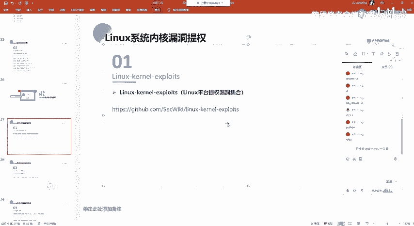

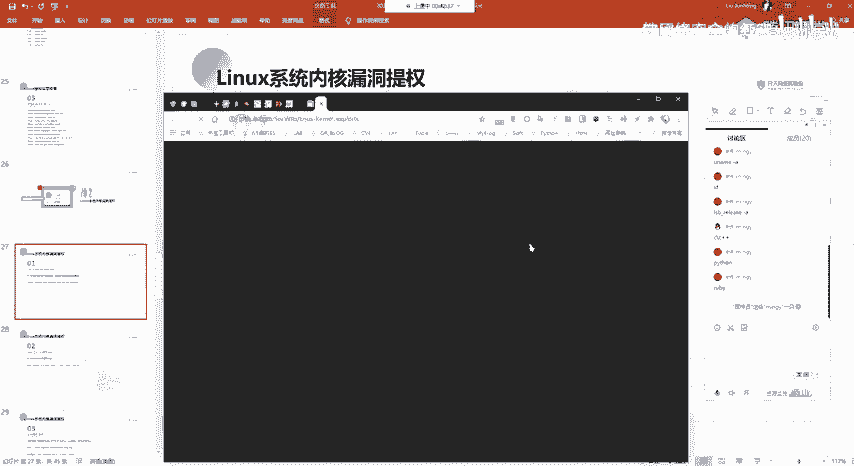

就是说那边的话，他那个的话就是windows下面的对吧？然后这一个的话就是linlinux下面的这样子的一个，其实呃都是这一个six white它的。总结的这个。就他把呃历史上面。呃。

爆出来的这样子的一些提群相关的这样子的一些啊，不是提群相关，就与内核相关的这样子的一些漏洞。然后的话他做了一个这样子的一个集合。然后在这个集合当中的话，比如说我们找一个最新的这一个。

2018年的这一个对吧？就这一这样子的一个漏洞。然后在这的话就有对应的这一个漏洞，它的一个呃介绍，对吧？以及呃与这个漏洞相关的这样子的一些呃链接。以及这边的一个。能够去做一个权限提升。

这个的话是这一个gle C的一个权限提升的一个漏洞是吧？然后这个漏洞这边的话就是它的一个呃。它的1个E叉P，也就是它的一个利用代码，对吧？它是一个C源所编写的。

所以的话我们只需要去呃通过GCC把这样子的一个代码做一个编译，我们就能够去进行就能够去得到对应的这样子的一个呃利用这个提群漏洞的一个可执行程序，对吧？嗯。

然后还有其他的这边这个的话就是其实这些的话就是你没必要去一个一个的都去看啊，当然的话你想要去那个。去研究的话，你可以去看看看这里啊呃其实。

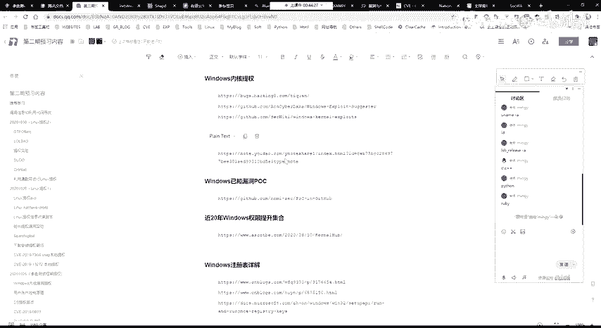

这边。这一个。就如果你。对这一些东西感兴趣的话，啊你可以像像他一样是吧？像他这边。

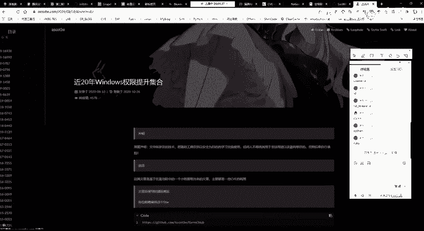

就呃像他这边一样，他做了一个这样子的一就是windows下面的1个20年来windows权限提升的一个集合。然后其实这边的这一个集合，其实就是它的他对这样子的一些提群漏洞，他的一个信息的一个汇总，对吧？

然后的话他去对这样子的一些漏洞，他自己呃去做一个研究，去做一个尝试，然后的话做下的一个笔记，对吧？然后其实大家自己去做这样子的一个安全研究的话，然后呃一定要去一定要就是说做好笔记啊。

就是说你的这样子的一些内容的话，你的这样子的一些内容，你你自己去做过了，你自己去做过了，然后你把它记下来，对吧？记下来的话，你写到笔记当中，就是你之后的话。

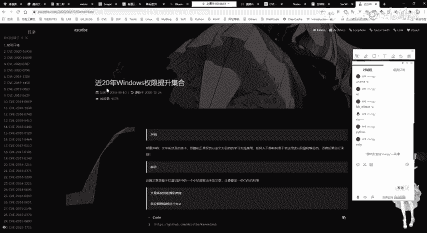

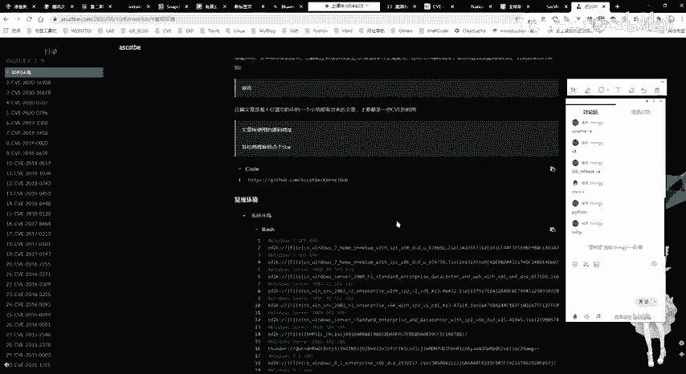

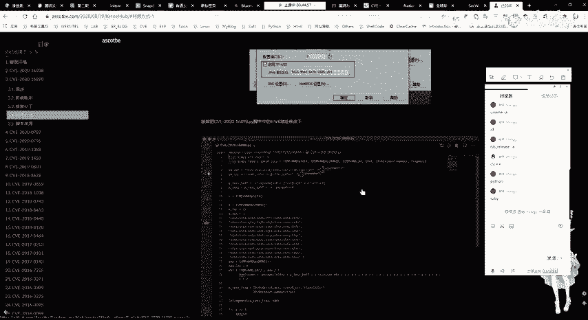

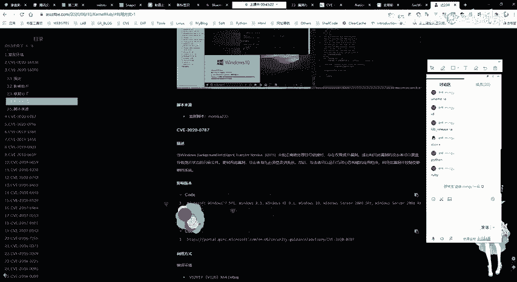

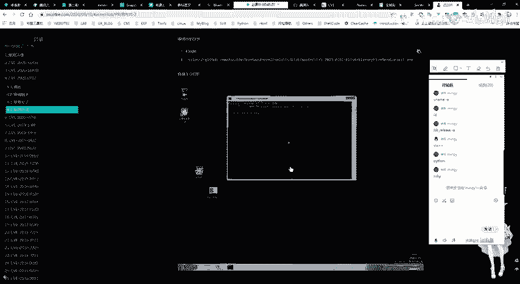

笔记你之后的话，你再去看对吧？然后的话你也可以把它分享出来，对吧？就是像像他这样子，对吧？

他把对应的这样子的一些提群漏洞，他做了一个汇总。

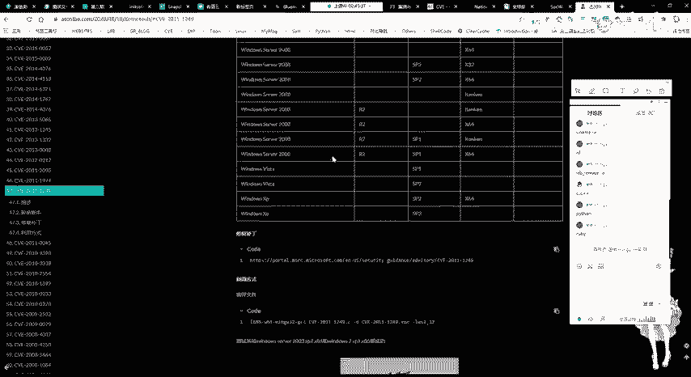

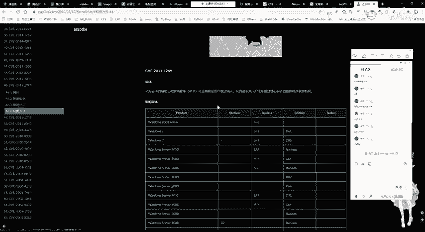

然后的话你下次你去那个的话，你可能就是说因为这些东西的话，其实你都自己有尝试过，对吧？你尝试过了他的这样子一些东西，你已经学过了。但是你学过了的话，你说不定忘了呢，好吧？

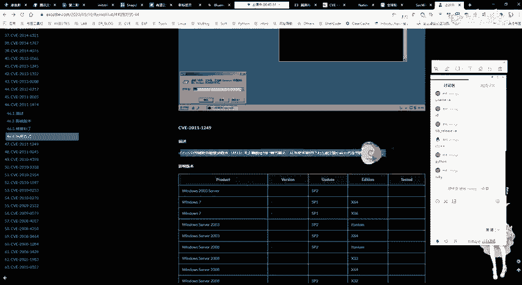

然后在这的话，你就可以在你自己的这个笔记当中去做一个检索嘛，就不不不用说你再去呃那样子的一些。

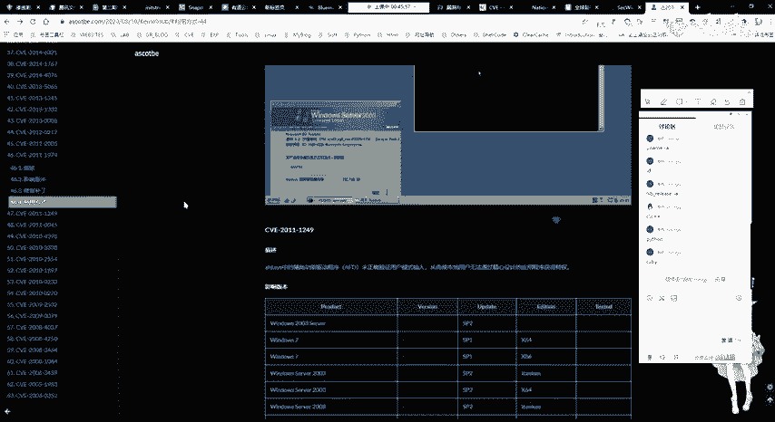

网站当中去进行一个检锁。

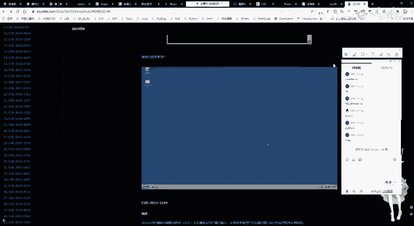

啊，其实我这边要说的话，其实就是让大家做好比较。然后的话就是你去做做这样子的一个研究的话呃。就其实就多分享吧。就其实我这边的话，其实。我这边的话，我的笔记都是在有有在在我这边。

就是但是的话我没有说去总的很。没有去总横的，就是去做一个很好的一个总结吧，然后的话就比较零散，就可能。就自己要用的时候，对吧？就去搜一下，然后看一下。就是呃。Yeah。嗯。呃。

这边的话就是linux平台的一个提全漏洞的一个集合。就是我们再去要去用到的时候，对吧？我们通过前面的一些信息收集，对吧？我们知道它可能存在这样子的一个呃CV的一个漏洞，对吧？

那么我们可以在这边去查找对应的一个利用代码，对吧？他这边的话都已经就是已经把它放做成了一个集合嘛，对吧？我们只需要知道1个CV编号，我们就能够去找到对应的一个利用代码。

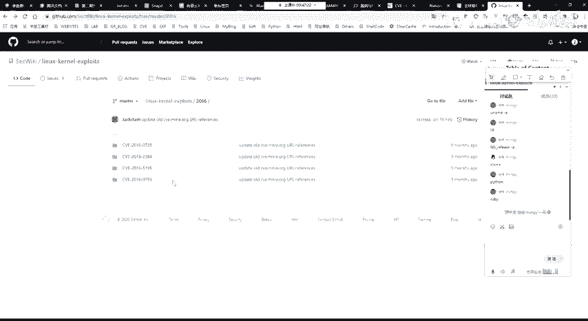

就能够也能够去呃减少自己的很多的一个时间。

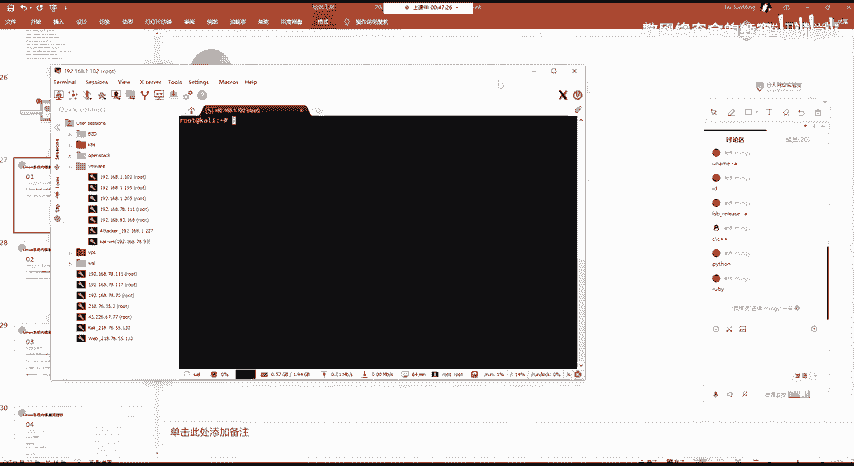

啊，第二个的话就是这一个呃s point。搜索 e叉 p。就我们。就我们前面的话是通过这样子的一个网站，对吧？去紧锁对应的这样子的一个漏洞。它的一个异叉P。但是的话我们在这边的话。

如果说我只知道就是说我只知道它是一个lininux的一个系统，对吧？然后的话我知道它的一个内核的一个版本，那么我。那么我去进行一个紧锁的话，我需要在这样子的一些网站。

我去我要去一个一个关键词去去进行一个搜索，对吧？然后在这边的话在这边的话有这样子的一个ssport的一个工具啊。这个工具的话就是用来去检锁我们的一个可用的这样的1个E叉P的。然后它的这个工具的话。

它是依托于那个我们的这个expoitDB。就是这个依托于这个exit dB就它里面所检索了出来的一个数据。它其实是从这个exportDB。🤧呃。从这一个网站他的一个数据当中获取的。

然后的话这边的话就是他的这一个工具，它的一个呃详细的一个使用。我这边的话已经。呃，贴贴出来了，然后这边的话是我的一个。笔记啊就是总结的这样子的一个东西，就关于这个stport。关于。

这边话介绍了他的一个安装，就是呃我们因为他的一个数据库的话，就是说他去检锁的一个数据库。你再看里面的话，它是自带的。然后的话如果你不再看里面的话，你需要有对应的这样子的一个数据库。然后。呃，在开你里面。

其大家可以直接打开看你啊，打开看你的话。因为之间输一个spo，他就能够去。呃，执行。然后这边的话在看你里面，他其实呃有。已经有。存储了就是我们常用的这样子的，就是说在ex在这边exportitDB这边。

对吧？比如说我要去下载这个E叉P然后就是像这样子的一个文件，对吧？就是这1个49。48963点text这样子一个文件。就这个文件的话。嗯。う。嗯。

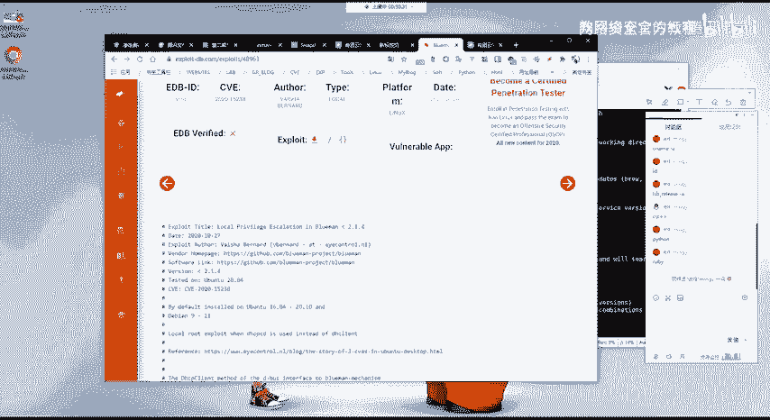

啊呃其实对应的这样子的一个文件的话，其实在呃我们的一个set point，就是说在我们的一个count里里面的话，它已经存在了，就是它已经保存到了我们的一个看理机上当中。

然后的话我们在such point这边的话，我们可以直接去检索到对应的这样子的。像比如说。我去检索一个linux，对吧？我这边搜索这样子的一个linux，搜索之后的话，在这边它就有列出了。

就与linux相关的这样子的一些E叉P是吧？以及在这边的话，就是他的这一个文件的一个路径。呃，这个文件路径的话是。这个文件录径我忘了在哪就呃，在这边。就是。就我们在这一个目录当中的话。

我们就能够去查找到，就是这一个脚本，对吧？就是这1个47292点C的这样子的一个CC语源的一个脚本。然后它是存放在我们看你里面的这样子的一个目录。然后其实对应的这边的话，其实就是这边的这个信息啊。

其实就是这里的这一个嘛，对吧？然后我们可以。到这个目录里面去看一下，它里面的话有存的。存储着很多的这样子的。一一些脚本对吧？像比如说。我要的话是linux的对吧？然后我CD到linux这一个目录。

然后他在这边的话就有列出了这样子的一些C。然后对应的这边有这么多的一些目录的话，它同样的都存在有。多个这样子的一个呃EXP的这样子的一个呃。

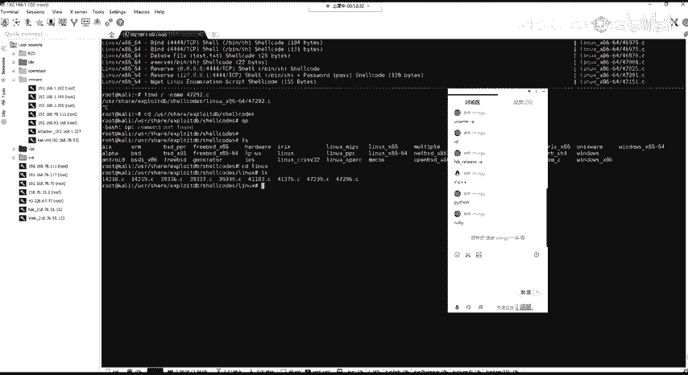

这样子的一个脚本。嗯。然后的话呃关于这一个工具，它的一个使用的话，大家看我这边的一个笔记吧。好吧，呃，就是在用之前的话，我们可以通过现奇port杠U来去做一个更新，就是更新我这边的这样子的一个数据库嘛。

对吧？

嗯然后其实sport的话，它也可以就是在线的去进行一个查找。就是他查找的一个数据的话，它同样的就是直接在我们的一个exportDB里面去查找。

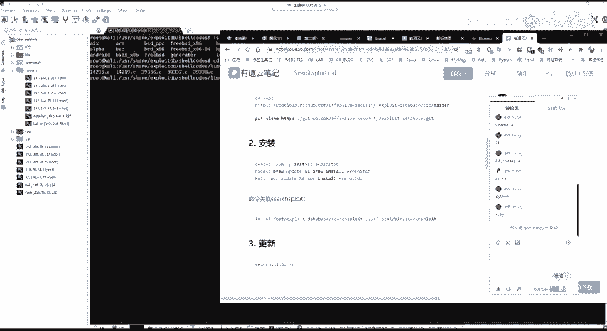

去紧锁对应的一个信息。嗯。是更要。然后他在这边的话，他就会去自动的去更新啊，去更新我们这边的一个呃。EXP的这样子的一个数据库。

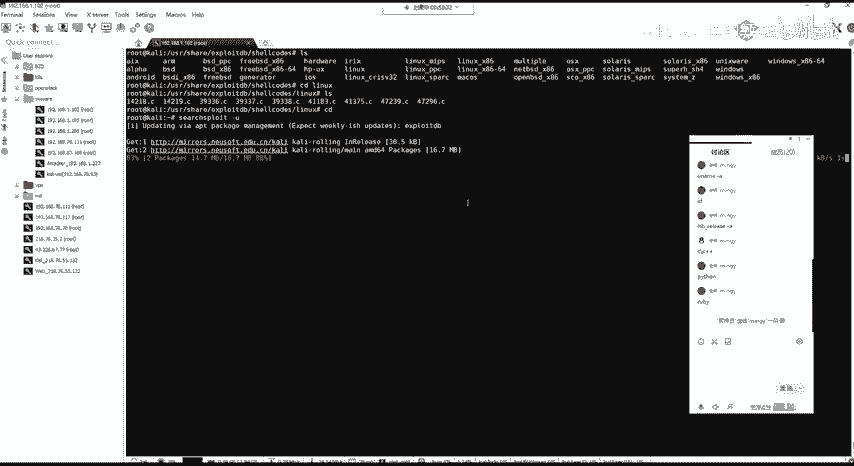

然后我们更新完之后的话，它就能够去获取到。就我们在这块就能够获取到最新的这样子的一些呃E叉P对吧？然呃关于他的一个使用这边的话呃，我们以一个实际的一个例子。我这边以一个实际的一个例子给大家做一个介绍。

我这话我就不会去一一的去那个。呃，这边的话我已经就写的应该比较详细了，对吧？

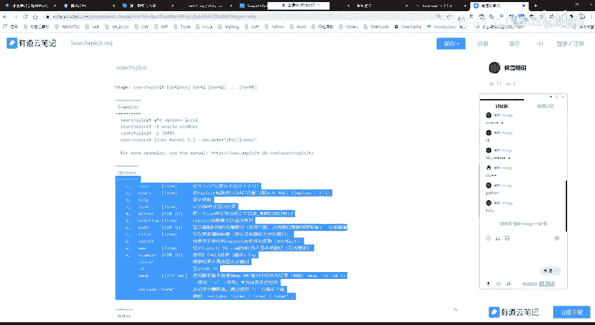

在这个话，我以一个例子就是。以以我这边的这个机器啊。诶。这个吧。以我这边的这一个机器吧，这一个无光图的一个机器为理。呃，我这边的话是一个。木班图的一个机器。18。04的按我当前的一个。版本。

我哋嘅呢个版物。我这个内好版本的话就是这个4。104。1。5。对吧4。15的这样子的一个内核版本。然后的话我我想要去检锁，就是说我想要去检锁，就是说。

紧锁能够去在这样子的一个呃系统当中去进行一个利用的这样子的一个提权的一个漏洞，对吧？然后的话。我们可以通过。呃，我这边的话哇这么多。那不更新了呀。我这的话呃可以通过这个s point来去进行一个检锁。

就首先的话我这边的话我要去检锁的话，就是呃我当喜欢是一个linux的一个系统，对吧？所以的话我要去获得这一个信型号，就是linux下面相关的这样子的一些E叉P，对吧？

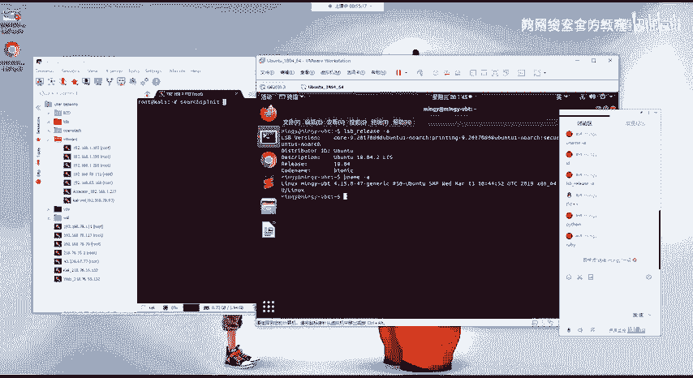

然后这句的话他有列出了有这么多的这样子的一些。对吧然后这里的话。像在这边的一台P的话，这边就有。其实。它是这样子去做的一个构成啊，就是这边的话是你的一个linux的这样子的一个呃架构，对吧？

像呃ARM的。还有的话残留式的这样子的，然后中间的话就是关于这样子的关于这一个漏洞的一个介绍。然后呃最后最后面的话，这边话就是pa，也就是路径。

就是这边的这个漏洞所对应的这样的1个E叉P所存放的一个路径。就是在我们刚刚的那个目录下面嘛，对吧？然后这边的话它的一个信息的话是比较多的对吧？就是我们还需要去做一个进一步的一个筛选。然后在这的话。

我想要去利用的话，就是我想要去紧锁这一个系统，它是不是有一个呃内核的这样子的一个提群漏洞，对吧？那么我们可以加这样子一个关键词。对。Cannel。就是呃KERNEL这个话就是内核的一个意思。

这个内核核心内核对吧？然后的话呃在这里的话，它同样的也也有列出了这样子的这么多的一些信息啊，对吧？然后在这边的这些信息的话，我们就。就比较直观了也算就是linux。呃，内核对吧？

然后后面的话这边的话就是内核的这样子的一些版本，对吧？以及这一个漏洞它的一个呃名字介绍，对吧？然后在这块有对应的它的这些信息都已经列出来了。然后我这边要去查找到的话，就是我这边的这个系统，它的一个内核。

我看一下是这个4。15是吧？然后我这边我再去加这样子的一个。呃，条件。现在的话。现在的话就是返回的这样子一些信息的话就明显少了很多，对吧？然后的话在这边的话就是呃他返回的这样子这些信息的话。

就是我们的这边linux系统下面的1个4。5，就是4。5版本，就是满足呃你的一个内核版本是4。5这样子的一个呃系统。它所就是存在的就是说已经被爆出来的这样子的一些漏洞。

以及它对应的这样子的一个可以去利用的这样子的一些E叉P的一个路径，对吧？然后在这边的话呃，我们就可以去查找对应的。呃，我们想要去进行一个尝试的这样子的一些提成的一个EXP对吧？我这边它是1个4。15。

然后再找到这边的一个就是一个提全。啊，找到提全的话，就是我们的像我们这边的这一个就是local，对吧？这这边这一这边的这一个。

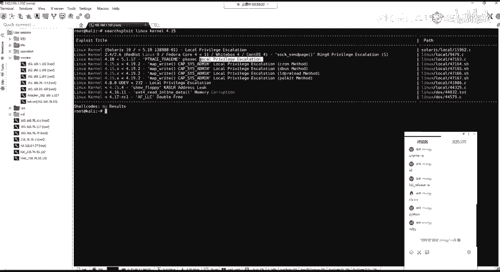

三个单词的意思呢就是本地特权提升，就是本地的一个权限的一个这个是逃脱嘛，其实就是逃脱本地的这样子一个权限嘛，也就是权限的一个提升。

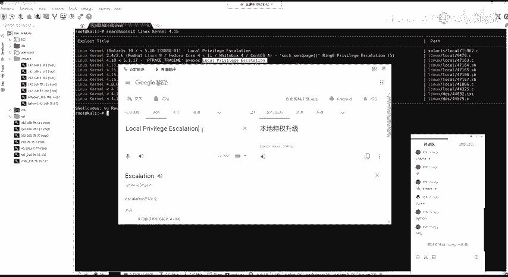

然，这句的话我们就呃有找到他的这样子的一个描述，这边对吧？是这个这一个是可以去进一个利用的。他这边的这个内核版本的话，就是就说你的一个系统是处于这1个4。10到5。1。

17的这样子一个版本的一个内核的话，你就可以去尝试，就有可能存在这样子的一个本地特权提升的一个漏洞。嗯。对吧。然后这边的话对应的这样子的一个EXP套，就是这一个。对吧。然后在这里的话。

我们可以通过setport。

呃。加加一个杠P，就指定一个路径，指定我们的一个papa的话就是这边嘛，这边所显示的。然后我们在杠P参数加我们的一个pa的话，就能够去显示这个漏洞利用的一个完整路径。

我来。执行一下执行之后的话，在这边的话就显示了关于这一个E叉P的对应的这样子的一个详细的一个信息，对吧？这边的话是关于这一个就是内核版本的这样子的一个呃本地提取的一个漏洞。

然后这边的1个UL这个URL的话其实就是我们的一个。

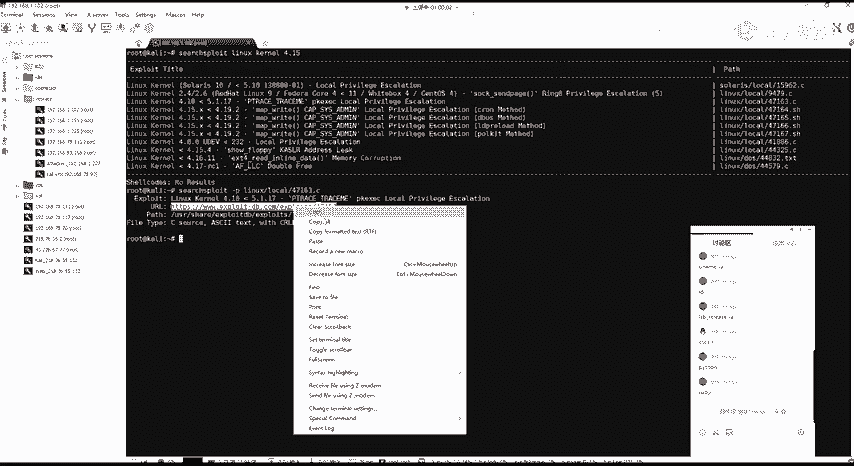

这这边的一个exexDB上面的这样子一个链接。然后它的这样子一个E叉P的话，其实就是这边的这一个就47163。

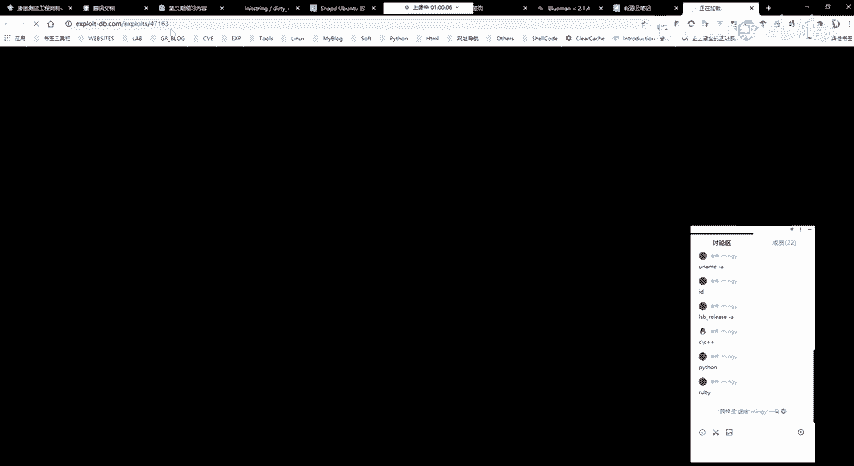

对吧。就这样这样子的一个。呃，是程序的这样子1个EXP。对吧这个一拆票就是针对这样这一个内核版本的这样子的一个提群的一个漏洞。

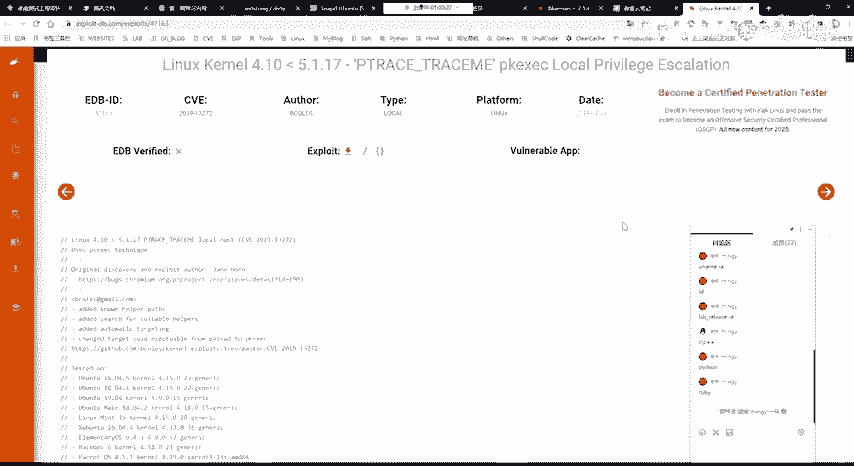

然后还有的话就是呃完整的一个路径，对吧？这一个路径的话其实就是呃我们这个脚本它所对应的。在我们看你你咖你机器上面的这样子的一个所存放的一个路径，我们可以在这一个目录上面去查找到，对吧？

然后我们可以把它 copyll出来，就是把它 copypy出来嘛，然后的话把它丢到目标机上面去执行嘛。然后在这边的话也有，就是可以通过。你可能扩的话就是通过CP对吧？然后s point的话。

这边有这样子的一个参数可以。呃。呃杠M杠M参数的话，它可以把1个E叉P拷贝到当前的一个工作目录嘛，是吧？就我们不需要加这么长的这样子的一个东西，我们可以直接s for杠M。然后接这边的一个。4763。

C对吧？然后这边的话就拷贝到了。诶。不对呀。不是呃。是这样的啊，47163点C啊，刚刚复制错了。这个这个的话是我们的这一个程序的一个路径嘛，对吧？然后我这边执行的话，他就可以把它复制到我当前的一个目录。

然后我当前的目录的话就有了这样子的一个。47263点C。这样子的一个呃C程序的这样子的一个代码，对吧？然后这的话我就可以对他做一个。B。嗯。没。然后在这边的话就多了一个这样子的一个。一叉皮。

对吧这样子的一个程序，这个程序的话，我们可以直接去进一个直旋。当然的话我当前的这一个机器的话是。啊，应该是不存在这样子一个漏洞的是吧？我这边执行的话，他这边的话是而且我当前的话是一个漏水用户啊。

执行的话，这边他应该是没有就没有成功，对吧？我当前这个计划是没有。没有对应的这样子的一个提悬漏洞的。但是呃我这边的话执行的话，就是为了验证我这边的这个脚本，它其实是能够去执行的对吧？

就我这边的话是编译的话是没有出错的。

然后在这边的话呃，我这边的话就是需要去把它放到这边来去进行一个执行，对吧？呃，我这边的话。我这边的话其实已经。弄过来了呀。어。就是这一个嘛，对吧？我可以看一下，就是这一个呃。4。10到5。

1017的这样子的一个。脚本。713。C对吧，就是跟这边的话是一样的，是吧，内容是一样的。然后我这边的话在这边通过GCC做一个编译。呃，我这边兵役之后的话，就有了这样子的一个。一叉PPP的这样子一个。

程序对吧？然后我这边的话我就可以去进行一个执行。你是尝时指定。然后在这边的话可以看到，就我这边执行之后的话，他立马的话，它有这样子的一个利用的一个过程，对吧？然后利用过程完之后的话。

他这边我当前其实是1个MNGY的这样子的一个普通用户啊。然后呃我通过这样子的一个提全漏洞的一个脚本啊，我可以看到我当前的话是得到了一个root的一个用户。对。开了。就说。对吧。

是一个完整的一个root用户的一个权限。我这边话。退一下。我当前的话是一个普通用户。

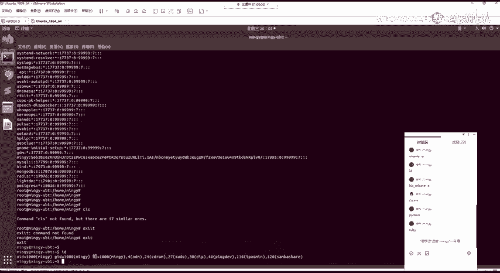

这边的话就是这一个。呃，其实这边的这个提恤龙的话，就是呃待就是我这边要讲的这一个。然后在这边的话，我通过这样子的一个sex point，对吧？去查找对应的。

我通过这样子的一个内核的一个版本的一个信息来去检索对应的这样子的一个提群漏洞。当然的话，因为我这边的话是我这个机器是正好是存在这样子的一个提群漏洞的。所以的话你通过这样子的一个检锁能够正好去。

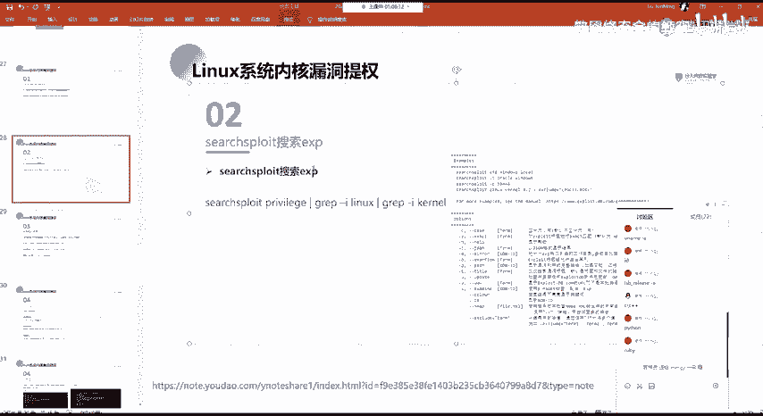

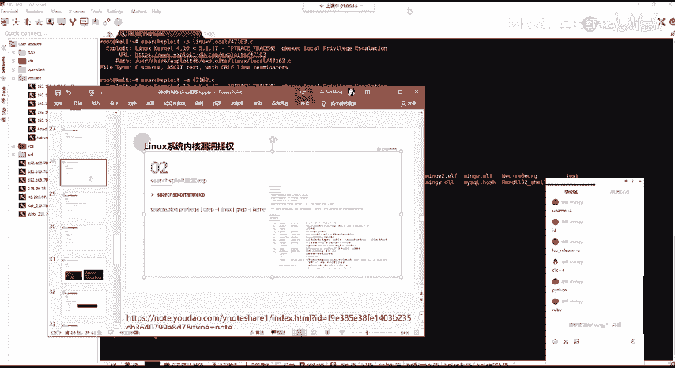

找到能够去进行一个利用的1个EXP对吧？当时的话。就提全的话，真的提全这个东西的话是比较靠运气的。然后呃，像这种东西的话，你可能就是你通过这样子的一些信息的一个检锁，对吧？

你可能就觉得他可能存在这样的一个提取漏洞，那是他不一定存在，而且的话也不一定能够去进行一个呃利用。这个话是需要大家去知道的。嗯。呃，这边话就是。通过这样子的一个例子啊，给大家介绍了。

就是说实际的演示了这样子的一个工具的一个使用啊，对吧？我们通过这一个工具来能够去比较方便的去检索我们想要的1个E叉P是吧？尤其的话在看里面的话，它已经呃已经内置了这样子的一个。呃，数据库。呃。

第三块就是这样子那个暂留的一个提全漏洞。呃，这边的话我先下一下课，好吧。已经。怎么没有怎么没有同学提醒一下我呢？我在讲着讲着又忘了。大家都不想休息的吗？Yeah。呃，那我们继续吧，中间的话就不休息了。

因为时间也过了。就呃大家下次。有下次的话，同学看到了就提醒一下我，好吧。那我这边的话，我讲着的话，我可能不会去注意时间就是。就中间的话给大家留点那个休息的一个时间嘛，对吧？呃。

第三个话就是这样子的一个粘牛提权漏洞。呃，粘牛的话就是说再讲提权，讲定义思下面的一个提权的话，就是不得不去说一下这样子的一个提权漏洞。因为这个漏洞的话是。呃。就是他那个影响。

他那一个就是漏洞的一个危害的话是相当大的。但的话在现在的话就是说在现在的话，它的一个这样子的一个漏洞上存在的一个概率话是比较小的呀。就在这个漏洞刚爆出来的那个那个时间段的话是。

他的一个危害的话是相当大的。它的一个影响的话。所以的话它的一个就是张留提裙漏洞，它的一个就是是很出名的一个提群提群的一个漏洞。就它的一个作用的话。

就是我们那个低权限用户能够去利用这个漏洞来在全版本的一个linux系统上面去实现本地提权。但然的话这边的一个全版本是注意的话，是在当时那个时那就是当时这个漏洞爆出来的那个时间。也就。

也就是说在当时那个当时那会儿就是这一个漏洞报出来的话，我们可以直接利用这一个漏洞。在所有的这样子的一个lininux系统下面。因为它是在全版本啊，所以是在当时那会的一个linux系统上面。

所有的linux系统上面去用这样子的一个漏洞去达到一个提全的一个目的。所以说它那个影响的话是影响了当时全版本的一个linux系统。它的一个影响力的话是相当大的。

而且这个漏洞的话是一个就是很严重的一个漏洞嘛，是吧？我们从。从这边的一个意思也能够去知道。然后他的他是能够去做一个本地的一个提全。然后这边的话是他那个POC呃，关于这个漏洞的话。

我这边呃就不给大家演示了。因为这个漏洞的话其实也算是比较老了，就可能存在的一个概率的话是不是很大，当然的话也不一定，对吧？以及的话这边的话大家去做一个去做一下这边实验室的这个实验。

这个的话就是关于这个单流漏洞的就那全版门的一个通商提全漏洞的一个复性以及分析。

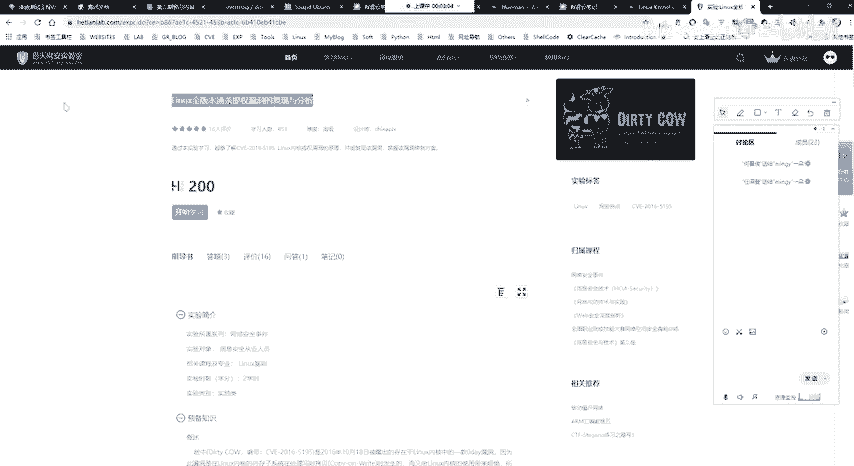

大家可以去做一下这个实验。在这的话就是呃。介绍了这一个漏洞，我们如何去进一个利润，对吧？然后的话在这边的话，有关于这一个漏洞，它的一个详细的一个就是涉及到的一个技术。

然后对他的对他的做的这样子的一个呃介绍，就研究的一个介绍，对吧？就很详细了，这边我这边话我就。我就不再给大家去再读一遍了，好吧，这边的话就大家自己去看。因为我要去讲的话。

其实也是跟这边就是没什么太大的区别。

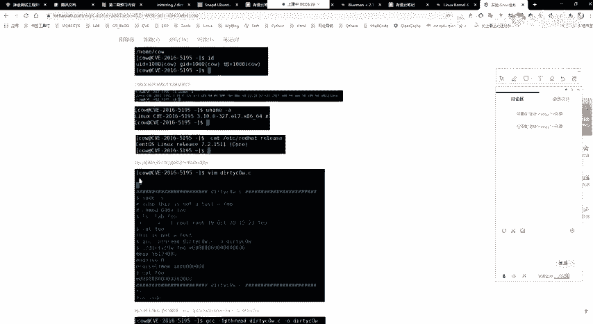

哎，像这种的话，你需要你知道怎么去用就OK了。呃。呃，第四个的话就是这个呃，刚刚给大家介绍的这样子的1个CV2019的1个13272的这样子一个提全漏段。啊，这个提全漏洞的话。是一个本地提全的一个漏洞。

然后它的一个漏洞范围的话是影响呃，它的一个内核版本是4。1到5。1的这样子的一个范围。然后呃它所影响的一个范围还是比较广的呀，就是它影响的这样子的一个系统，像乌班图啊，还有卡里地病，对吧？

然后这边的话是他的1个E叉P，其实就是我刚刚对吧？去通过那样子的一个检锁。通过spoint检索到的呃。通过内核的一个版本，然后的话检索到了在exDB上面检索到对应的这样子一个E叉P，对吧？

这个的话就是它的一个链接。Yeah。

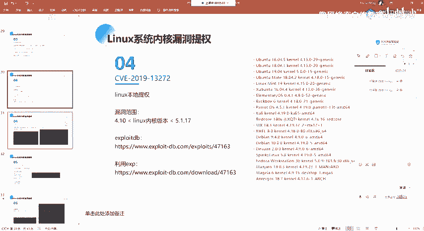

哦呃。这边的话就是这个EXP的话，我们下载下来，我们下载下来之后的话，我们直接GC去做一个编译。编译之后的话，直接执行的话就能够去得到一个。呃，root的一个权限，就像这样。

这边的话是在我的那个物班图的一个系统。呃，这一个漏洞是去年去年还是前年？19。去年吧去年年底年底出的这样子一个漏洞。然后这边的话是我当时就是付现的这样子那个截图啊。呃。

这边的话这个物班图的话就是我这边的这个机器嘛，有这个机器。18。04的这样的一个机器。然后这边的话是一个呃看你机器啊，就是这一个看你它同样的影响这样子一个看你的一个机器啊。

它的一个在这边的话是它的一个内核版本是4。19这样子的一个看你机器机器的话，我们也可可以去做一个提全，是吧？这是它的一个效果。

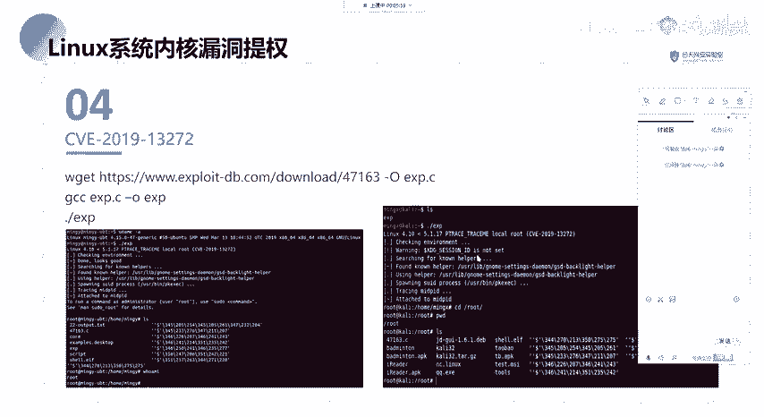

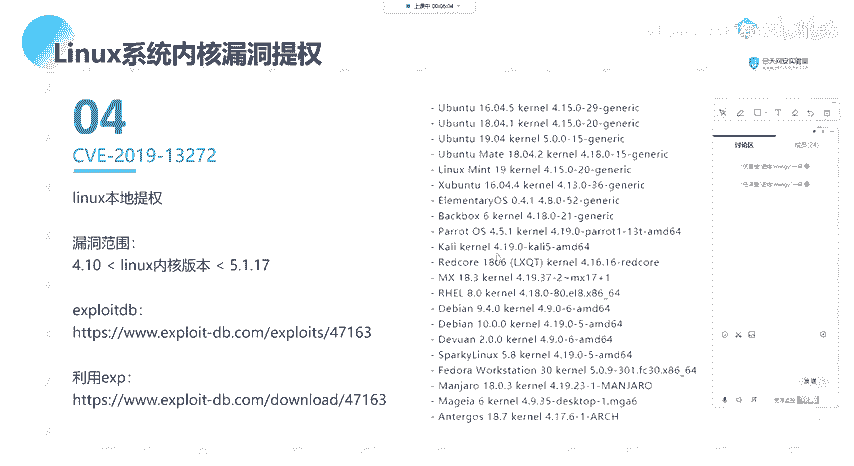

系。看机器的话，这边的话我就不演示了。因为现在最新的话，现在最新的看你的话是没有这样子一个漏洞。它这一个内核版本的话不属于这一个范围了。这个是呃2018的。2018的。

如果大家现在有就手上有这样子的1个2018的这样子的一个三还是几的？这样子的一个看理机器的话，你可以去尝试一下，能够去进行一个提群。

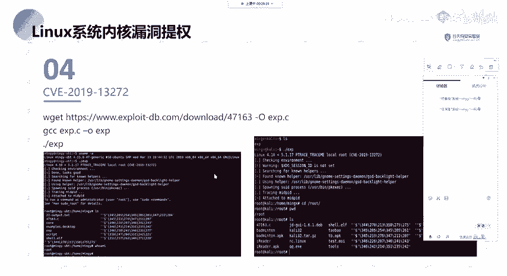

🤧嗯。然后呃，第五个的话就是这一个。CB209的7304这一个漏洞的话就是一个lin历的一个包管理器。这个SNAP的一个本地齐全的一个漏洞。呃，提提这个漏洞的话，是就是在这边。

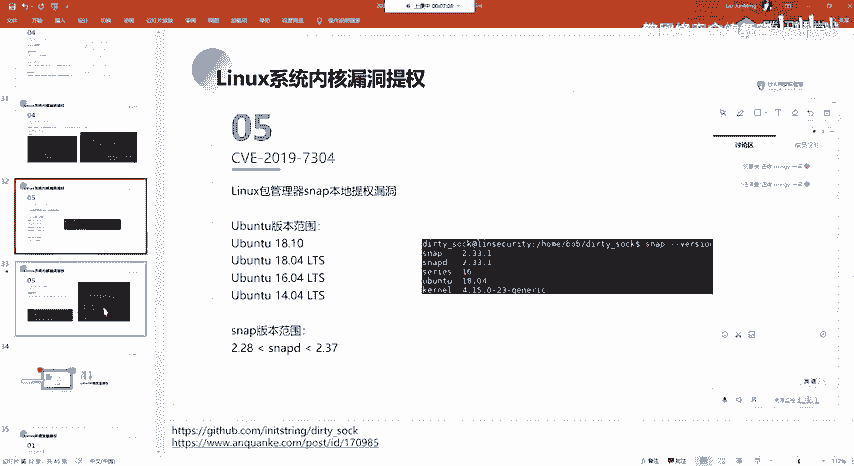

这边。

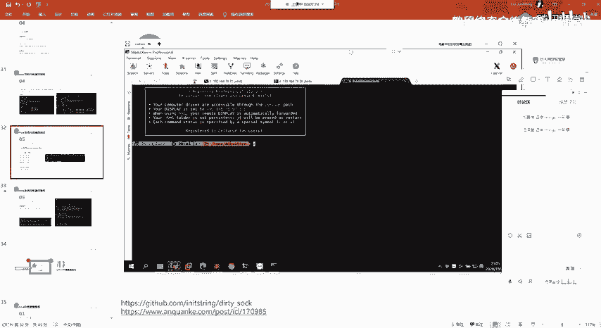

就是呃在这边的话有这样子的一个靶场，就是。呃，这个就这样子的一个把机啊，这个把机的话，这个把机的话是一个就是linux，就它里面的话有。呃，很多的这样子的一些就是。呃，配置它的一个权限配置啊。

以及对应的这样子的一些服务的一个漏洞。我们可以去利用它去进进行一个提悬。然后在这边的话，它这这个把件里面的话，正好有这样子的1个SNAP啊。

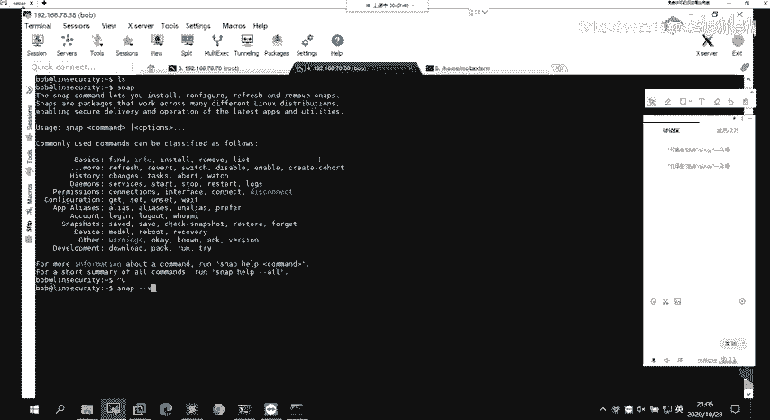

对。就正好有这样子1个SNAP的一个服务啊，其实这关于这一个服务它的一个信息，对吧？我们怎么来？我们前面的话就是通过前面的这样子的一个脚本嘛，对吧？同样的。

他会去就是获取到系统上面所运行的这样子的一些服务，它的一个信息嘛，对吧？然后我们针对这一个服务，它的一个版本对吧？去检锁对应可能存在的这样子的一些提全的一个漏洞。

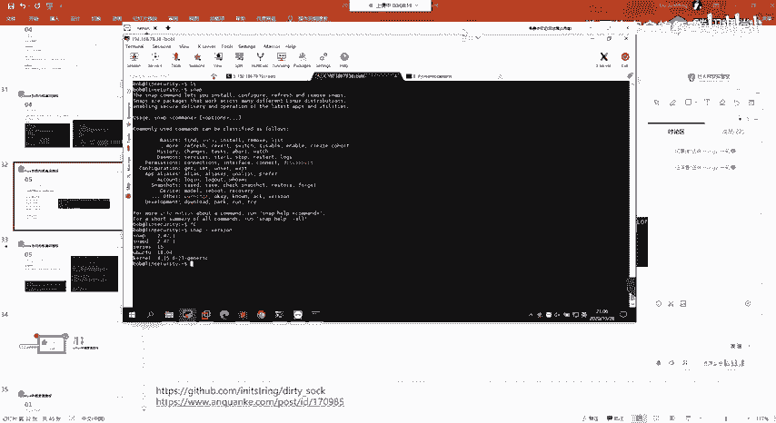

然后在这边的话。呃，在这边的话。如果大家有去下载这个呃下载这个靶场去玩的话，在这边会有一个问题啊，就是用这1个SNAP的这个提群的话呃，你在这边的话。大家可以看啊，我这边的话是2。47。1，对吧？

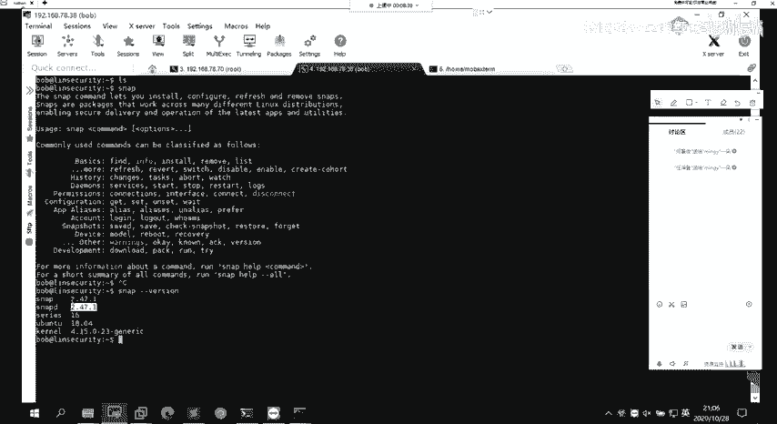

然后在这边的话，其实实际的话，你刚进你刚启动这一个靶场的话，它是1个2。33。1的这样子一个版本。就是这一个漏洞，它的一个影响范围的话是设定秒2。28到2。37的这样子的一个范围。然后他在这边的话。

他会有这样子的一个问题，就是。

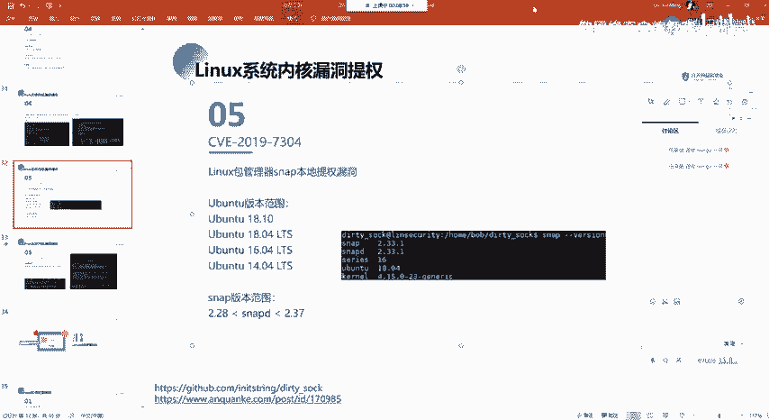

我这边的话，我这个机器起起来，然后的话我这边能够去联网的话，对吧？它会去自动的去更新这1个SNAP。就是他会所以的话在这边的话，我这边的话已经放了一会儿，然后我这边也可以。所以的话他这边的话。

它自动的把这一个就是它的一个版本做了一个升级，把，它升级到了2。47的一个版本。所以的话它这边的话是不存在的，就不存在了这样子一个漏洞。

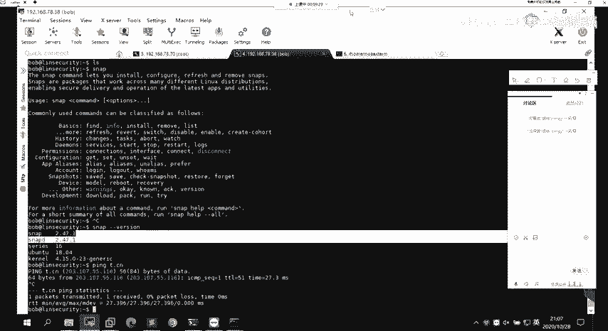

然后大家就是。记得打个快照。就你启动之后的话。嗯。

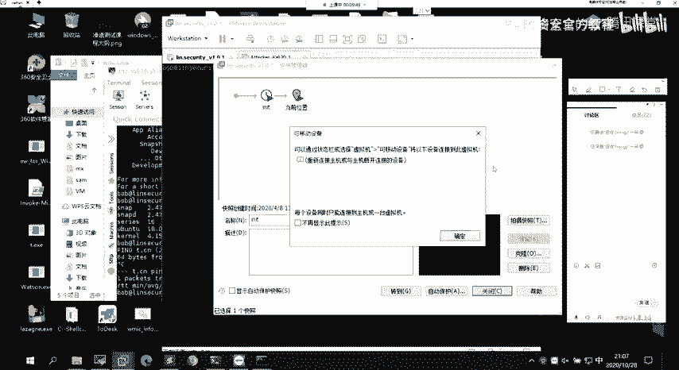

然呃这边的话才是他。真真正的一个版本就是就是它初始的一个版本是2。33。1。然后的话这一个版本的话正好是处于这一个提权漏洞的一个范围的。以及在这边的话呃，就是。

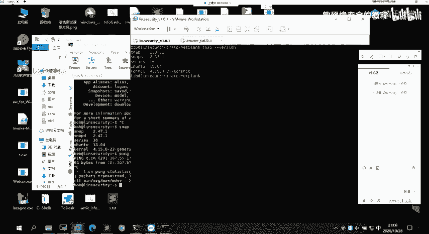

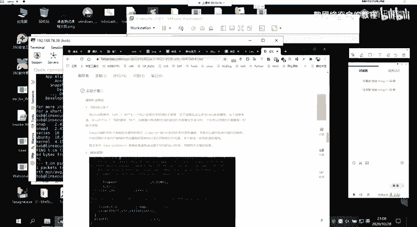

嗯。就是在这边我们去利用这个提群，去利用这个漏洞的话，这边有这样子一个脚本，对吧？你执行这个脚本之后的话，它就会去触发它的一个更新。就是你执行这个脚本之后的话。

他就会去去更新去更新这1个SNAP然后的话。就是你利用之后的话，你的这个SNAP的话，它就更新到了一个新版本。也就是说你利用之后的话，它你还你想要去再去利用的话。

那么是利用不成功了也会因为他那个版本的话做了一个更新啊。这的话是呃给大家提一下，大家可能如果自己去做的话，碰到相应的一个问题。然后这边的话呃它影响乌班图141618的这样子的一个版本。

然后这一个把机的话，正好是1个18。04的一个把机。

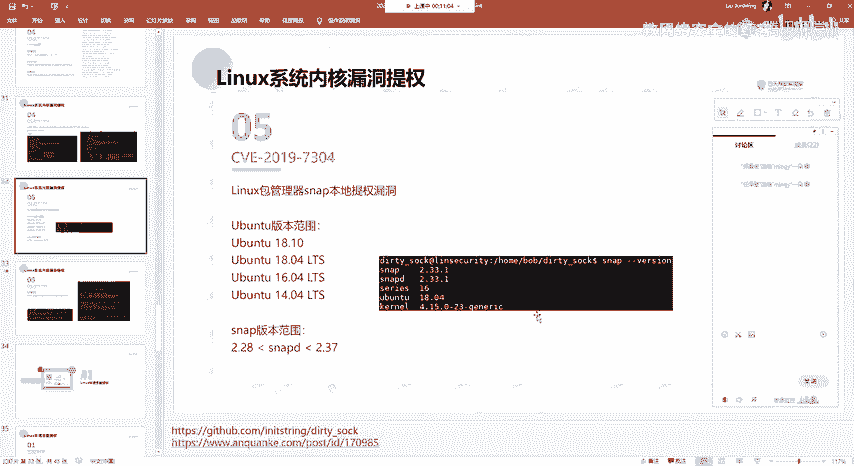

一。

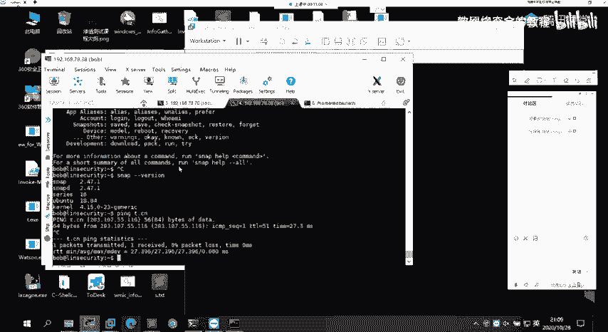

嗯。

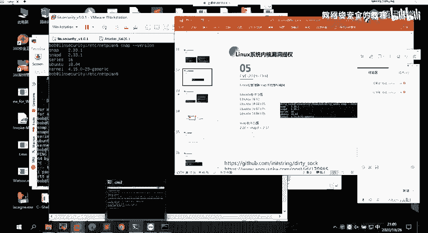

在这边的话。呃。在这个的话。我们先看一下效果吧，就是我这边看一下我这边的一个截图。然后的话我给大家就是大家看一下这边的这个getar吧。嗯。然后这边的话是呃这个漏洞作者。

他给出来的这样子的1个E叉P是吧？然后在这边的话，他给了两种方法，就是两种利用这样子的一个漏洞的一个方法。然后呃方法一的话，它是就是他需要有这样子的一个就是1个SSH的一个施钥。然后。

我们可以通过这边的这个。这样子的一个你去创建这样子的一个账号，然后的话你去创建一个这样子的一个私钥，然后它会有这样子的一个邮箱。然后你可以通过这样子的一个脚本来去指定我们的这边的一个生成的这个私钥。

然后的话就能够去得到一个信要。然后第二种方法呢就是通过他的这样子的一个脚本，通过这个脚本执行之后的话，他会去创建这样子的一个呃dty杠s的这样子一个账号，密码也是dty shock。

然后的话这一个账号的话，它其实就是一个有root权限的这样子一个账号。然后我们可以通过这个账号登录这个账号来去得到一个root的一个权限，也就是达到一个提全的一个目的。呃，这边的话我。演示一下第二种吧。

就第一种的话，因为。

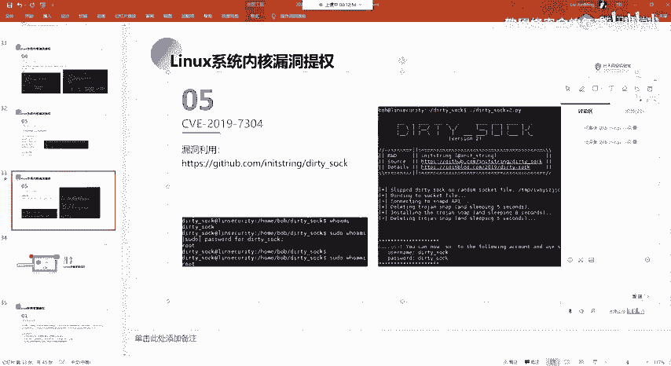

稍微有点复杂，就操作的一个步骤的话比较多。那个的话打留给大家自己课后去进行一个尝试。

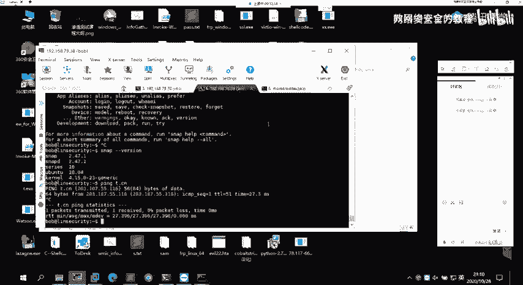

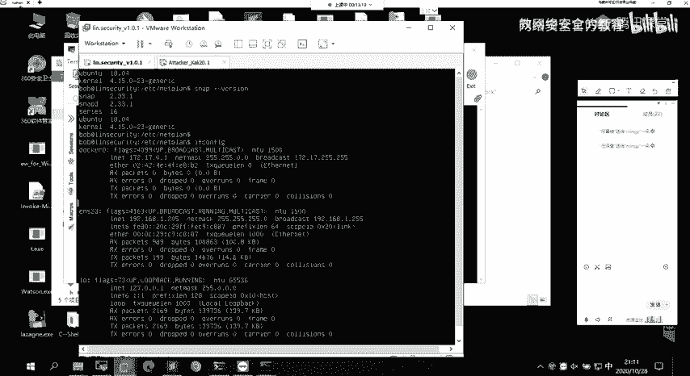

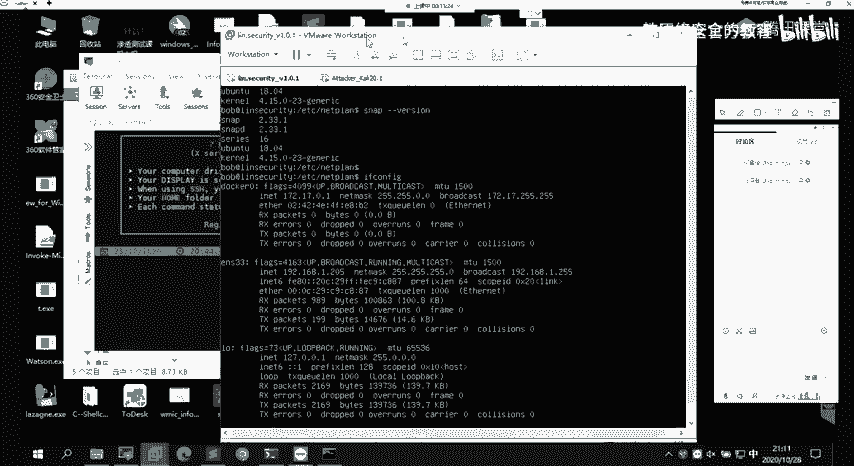

好。

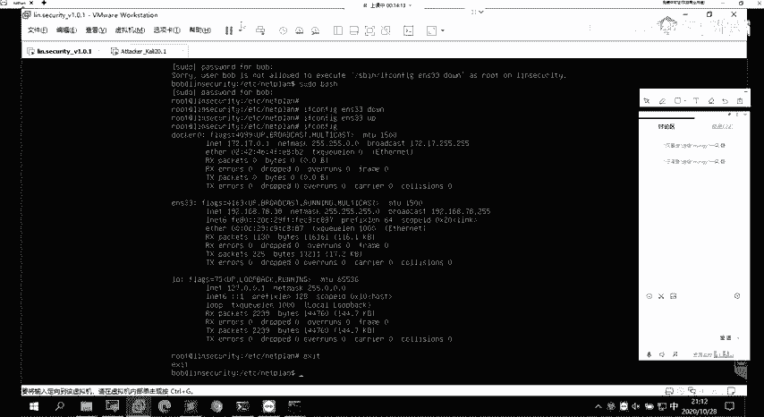

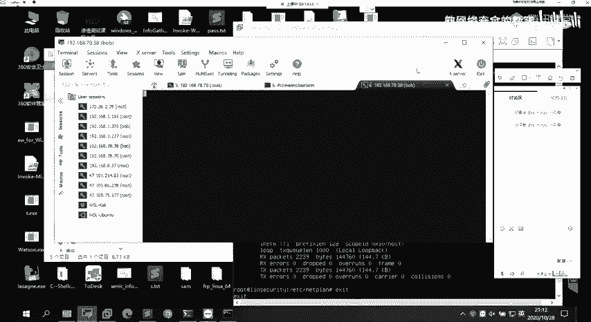

然后呃这边的话是这个832是给了你一个普通用户的一个权限。啊，然后的话你基于这个普通用户的一个权限，你在这个把机上面尝试去进行一个提群。在这边的话，我们就通过前面的一个信息收集段。

发现有这样子的一个呃可以去利用的这样子的一个漏洞，是吧？我们找到这样子的1个E叉P。

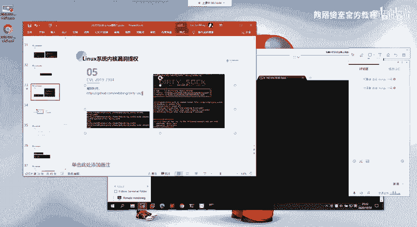

找到这个E叉P之后的话，我们只需要去把这个EXP上传上去嘛，上传上去。责任话已经。下载好了。嗯。拷过来拷过来之后的话。依确执行。Okay。执行之的话可以看到这边的话就是success，对吧？

就是然后的话有了这样子的一个getty socks。我们可以CT一下。说话的。啊，我们在这边的话可以看看到有了这样子一个用户，对吧？然后这个用户的话，其实我们SU。그。然，这里的话我们可以登录进去。

对吧？登录进去之后的话，我们可以执行一下外卖。IDID这边的话可以看一下，你输入ID之后的话，在这边它是这样子的一个它还是一个普通的一个那个当时在电话有了一个这样子的一个收对。然后我们在这边的话。

我们就可以通过收对。还去执行一个。对吧来去执行命令。啊后我这边搜度换外卖的话，我当前的话就是root，因为我是通过收度的一个呃方式。呃，大家知道收度吧，就收度的话就是呃我们可以通过收度来去得到一个。啊。

就是。来去暂时的去得到一个露ot的一个权限。就。如果你的这个用户的话，你允许去通过收度来去执行命令的话，那么你就可以通过收度来去啊执行啊以root用户的一个权限去执行相应的一个命令。

像比如说我这边收度货卖，对吧？就是一个root。然后我这边比如说我要去ca一下这个。下载文件对吧？可以看到我当前的话是没有权限去那个的。但是我这边的话，我可以通通过收据。还去执行这样子的一个cat。

对啊，当前的话就能够去读取这样子一个需要的文件。而后这个需要的文件是只有ro存用户，他才有去权限去进行一个读取的。这边的话我们的一个。提全的话就已经成功了。这边版本还没变。

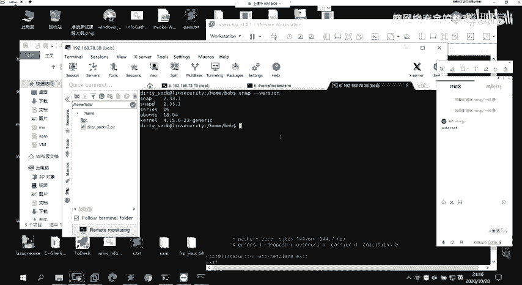

这是这这一个提全漏洞的一个效果。呃，大家关于以上两部分的话，有没有什么疑问，有没有什么问题，应该没有什么问题吧。都是呃比较简单的。一简单呢些东西。有问题的扣一，没问题的扣2。啊。

应该是没有没有什么问题啊。呃，第三部分呢就是linux的一个环境变量提取。就我们前面的话有大概的有介绍一下是吧？然后在讲这个之前的话，我们先来看一下就是。什么是环境变量？

也就这一个令下面的一个pass环境面量。这个pas的话是linux，还有这种内uninux操作系统中的一个环境变量。P。他呃指定存储可指定程序的这种所有并，还有S变的一个目录。

然后当用户在去终端上去执行任何这种命令的时候，他会通过这样子的一个pass变量来去响应用户执行的一个命令，然后向需要发送请求来搜索可执行文件。然。

其实这一句话就是我刚刚给大家介绍的这样子的一个pass完境变量的一个作用，对吧？这这一个的话大家能理解吧？就是呃，我们通过。大家可以在linux系统上面去执行这样子的一个。

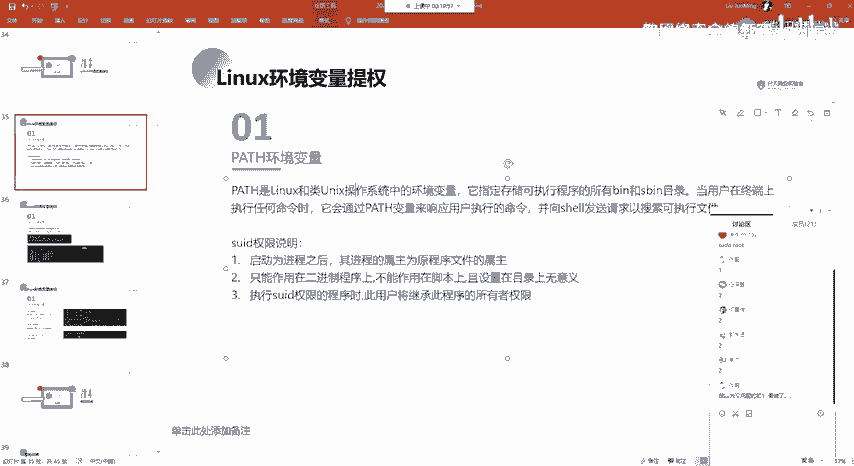

呃，e啊，加一个。呃，多了福加1个BATHpa，然后你就能够去输出这样子的一个pas的一个黄金变量，输出这一个变量。然后在这边的话就是它的一个记录的一个值。然后其实这边记录的一个值的话，我们可以看一下。

就是它是一个冒号作的一个分格。然后每一个冒号的话，它是一个这样子一个目录。对吧像优着 localS病像这里的话呃，前面的话讲定历史的时候相关的奖历史相关的一些啊木结构的时候有介绍，对吧？像SB的话。

就是你的一个就是呃像这种ro用户，他就有权限去进行一个执行它里面的一个命令，就是高权限的一个用户。然后在这一个目录下面存储的一个命令，它才能够去执行。然后像并的话。

就是你普通用户也可以去执行这里面的这下面的目录下面的一个可执行程序，对吧？还有U bin啊，U则 bin啊 bin等等的这样子一些目录。然后这边的这些目录的话，就是当我们比如说我去执行。呃，一个。

Yeah。执行1个L的一个命令，对吧？我这边执行LOS执行这个L命令的话，它会去列出这边的一个内容，对吧？那么在执行这个L命令的时候，它中间它是怎么去找到的呢？我们可以看一下。

通过where来去查找这个L0的一个文可行程序所是所在的一个目录，对吧？它是在这个并L的一个目录下面，对吧？然后的话就是当前的话当前是一个普通用户啊，对吧？普通用户的话，他去执行IOS面的话。

他是会在这个目录下面去进行一个查找。那么这个目录的话，它是怎么去找到的呢？就是在这个呃pass环境变量当中去找到的对吧？他去一个一个目录去紧锁紧锁紧锁这一个目录下面，它是否。能够去执行这样子1个L命令。

对吧？以及是否有这样子的一个命令。然后的话直到找到在这边呃，这个并目录，对吧？他找到这个并目录下面的话，这个目录下面正好有1个L的一个命令。然的话他有权限去执行。然后的话他执行之后的话。

他就会呃返回结果给我们，对吧？

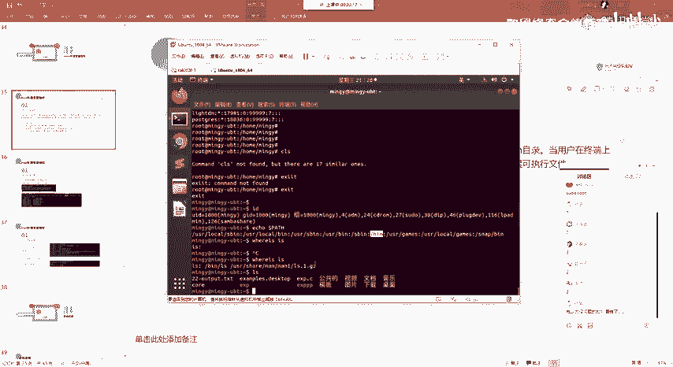

这是这样子的一个，就是你去执行命令的话，他有这样子的一个过程。然后的话还有就是这个SUIDSUID的一个权限。这个SUID的话是一个特殊的一个权限。呃，我这边的话通过这样子的三句话呃。

就是大概的说一下这1个SUID权限的一个作用。就是呃我们的这个SUID权限的话，它就是启动为进程之后，它进成了一个鼠组为原程序文件的一个鼠组。我们这边的一个数组的话。

就是我们知道我们的一个权限像比如说root。roro对吧？就是这个文件，它是啊它的一个属组，就这个。然后这个的话是它的一个所有组，对吧？然后的话，如果这个程序它是一个呃SUID的一个权限的话。

它执行的话，它的一个这个进程的一个主组。也就是说它这个进程的话，它是同样的是这个ro的一个。权限。他是属于这个root的这个用户的，是吧？然后的话这个权限的话，它只能作用在二进制程序上面。

就是只能去作用在我们的这种可执行程序啊。啊，其实我前面说的话。不是说目录啊，就是。这种可执行程序啊，对吧？然后的话呃它是不能作用在脚本上，而且就是你也不能设置在目录上面，它是没有意义的。

就你只能作用在这种二件制可执行程序上面去。2呃，执行SUID程序的时候，这个用户将继承此程序的所有者的一个权限。就说我们的1个SUID的一个程序，对吧？就是有这样子的1个SUID权限的这样子一个程序。

它是一个root的一个属主，对吧？就是这个程序的话，它属于一个root用户的对吧？然后的话在这一个用户他去执行这样子的一个程序的话，那么他的这一个执行这个程序。执行这一个程序的一个用户啊。

他会去继承这边的这一个文件，这个可执行程序所有者的这样子的一个权限。也就是这边所说的一个root。对我们这边的一个属组的话，其实就是这一个可可执行程序的一个所有者嘛，对吧？嗯。那么呃这一个权限的话。

我们如何去进行一个利用呢？就是说我们如何去利用它来去进行一个提权呢？在这边的话呃，首先的话就是呃我们需要去找到这样子的一个拥有SID这种特殊权限的这样子的一个文件。在这的话。

我们可以通过这个放und的命令来去进行一个查找。这边的话其实前面也介绍了，对吧？就去查找这样子的可执行的文件，还有文件夹，对吧？

然后在这边的话就是放的干就是在跟目录下面去查找他的一个权限是这样子的一个干优。就是他的1个优者是有这样子的1个SID的SUID的这样子的一个权限的，以及它的一个呃类型的是文件，对吧？就不是说目录。

因为你目录的话，它是没有这样子1个SUID的一个权限的。而且没有异义。然的话呃把错误的一个输出把它置为空。啊我们通过这样子一个命令话就能够去查找。

就是说在当前系统下面呃有这样子的1个SUID权限的这样子的一个文件，对吧？然后呃我们通过执行之后的话，在这边有找到这样子的一些程序，对吧？可以看到在这边的话有这样子的一个需要的一个文件。这个文件的话。

它正好是有1个SLID的一个权限。然后我们当前他是在我们的一个普通用户的一个目录下面，对吧？就这个卡里的一个目录。呃，这边话是我做的一个这样子的一个场景，就是来给大家讲解。对演示的一个场景。

然后这边的话是一个这样子的一个可执行的一个二进制程序的。我们找到这个程序之后的话，去执行它执行执行它之后的话，他返馈的一个结果的话是这样子的一个东西。然后其实大家熟悉的话，就是这边他执行的一个结果。

它其实就是我们执行PS的一个命令的一个结果，对吧？就执行1个PS命令的一个结果。

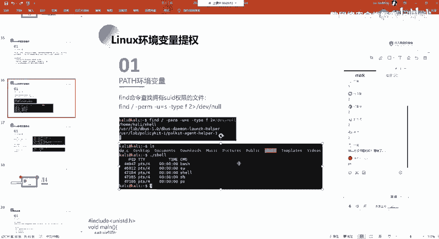

我们呃，我这边的话。以我这边的这个机器为例。呃，我这边已经切到。哪里用户。就我当前的话是一个卡领用对吧？一个普通用户啊，我通过这样子的一个命令来去查找。拥有SUID权限的这样子的一些程序啊，对吧？

啊我们可以看到在这边有。SU。嗯。嗯，没错。应该的有这样子的SU，还有。呃，CHSH等等的这样子一些泌令mount这样子的一些泌令啊，然后这些的话都是比较常见的。然后在这边的话有这样子的一个程序。

我们可以呃通过。LL来去查看这样子的。像比如说我以这1个SU这个命令为例，对吧？你通过L去查看这一个程序，你会在这边可以看到它有这样子的一个。本来正常的话是RWX，对吧？然后他在这边的这个U的U着。

也就是呃属主的这样子的一个权限上面的话，有一个S的一个权限。然后这边话其实就是它那个SUID的一个权限。也就是这一个程序的话，它是呃有SUID的一个权限。然后我们在这边的话去执行这个SUID的话。

去执行这个SU命令的话，那么它是一个root的一个权限。然后在这边的话。我们找到有一个比较特殊的这样子的一个文件。就是这个这个对啊，它同样的也具有1个SUID的一个权限。啊我们执行。

执行他执行它之后的话，他返回了一个结果，他是跟我们就执行PS之后的一个结果，它其实是一样的对吧？呃，这边的一个区不同的一个点的话，其实是不一样的。就是我这边对吧？

我这边他因为是一个普通的一个car里用户。而你之前PS的话，它只是列出了你当前的，就我当前的话是一个半喜，对吧？能够去就是列出当前我所在的1个PTY。啊，然后这边的话执前的一个需要的话。

因为它是SUID的一个权限。然后的话它这个文件它的一个所有者是root。然后其实执行这一个的话，它是一个root的一个权限去执行的。也就是他这边我们可以看啊，他这边的话。

他执行的一个内容结果的话是比我们多的对吧？像包括SU。因为我们刚刚的话是通过SU来去得到的，来切换到了这样子一个看里的对吧？所以的话它同样的有这样子一个。有这样子的1个PID以及有伴喜，对吧？奥特话。

我们怎么去利用它呢？就是说他这边的话，它我们可以看到这个程序它的一个功能，它的一个功能的话，它其实就是去执行的1个PS的一个命令。但是的话因为它这边执行的话。

我当前的话执行PS它其其实是以我当前的一个普通用户去执行的对吧？但他这边的话它有SID的一个权限的话，它能够去继承这边的一个root的一个权限来去执行这样子一个PS的一个命令，对吧？

所以的话它它是其实是以一个root的一个权限去执行的。

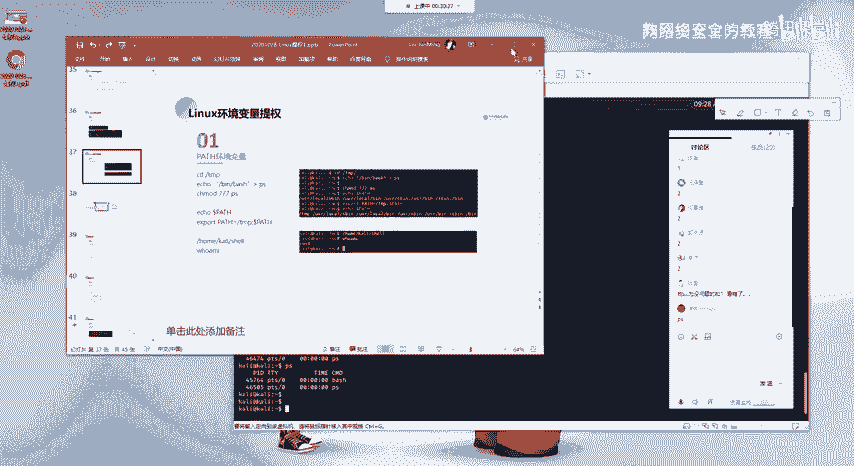

但是我在这边的话，我去执行这个程序的话，是一个普通用户啊。啊，就是我当前是一个普通用户，但是我这边执行的话，它虽然是一个root的一个权限的对吧？

但是我们无法去呃说我们无法去通过这样子一个可执行程序去得到这样子一个root的一个权限，对吧？然后在这边的话，我们就需要去结合我们这边讲的这样子的一个环金变量。

来去做一个呃这样子的一个利用它来去进行一个提群。呃，具体的一个方法的话，就是像这样子。呃，我们首先的话就我当前是一个普通用货，对吧？我首先呃进入到time目录。time目录的话。

我们写入这样子的一个呃文件。然后写的这个文件的话就是1个PS的这样子一个文件。然后它这个文件里面的一个内容的话就是beanbsh。然后的话我给这一个程序给1个777的一个权限。因为我在探的话。

我是有权限去对他做这样子这样子的一个操作的对吧？然后下面的话就是这里的一个重点。就是我们可以通过。呃，export来去给给我们的一个pa变量去添加去加我们的这样子的一个tamp。

去添加我们的这样子的一个就是呃可执行程序的一个目录。就这边的一个我这边的话是添加了添加了一个碳篷的一个目录，对吧？然后的话在这边的话。我们都这样子一个pas环境变的话就变成了这样这样子，对吧？

就原本的话是这样子的一个这样子的一些目录。然后我通过export添加一个这样子的一个环境变量，把这一个t盘目录把它给添加到添加进去了，对吧？然后这边添加去添加进去的一个意思是什么呢？

就是说比如说我这边要去执行L的一个命令，对吧？我这边执行L的一个命令，那么它首先他会去他会去一个一个目录去找，对吧？那么他我这边添加进去之后的话，它会去在这一个探盆目录。

他去查找是不是有这样子个L的一个可执行程序，对吧？然后的话如果有的话，他就会去执行。然后如果没有的话，他就会一次的去查找，对吧？那么。下面的话我们。呃，再去执行这样子的一个，就是说再去执行这边的一个项。

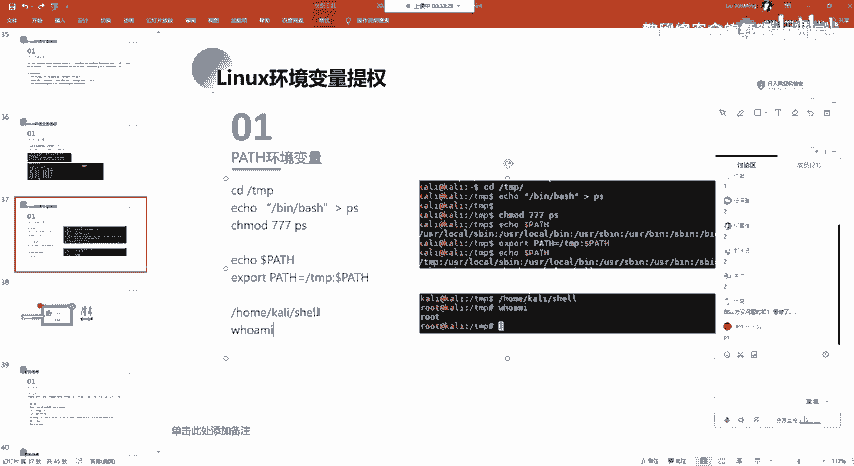

我们这边的话当前的话是一个普通用户，对吧？我去执行这样子的一个需这一个命令。我这边执行之后的话，它是一个root权限去执行的1个PS对吧？那么他在这边去执行这个PS的时候。

他怎么去找到这样子的一个PS的一个命令呢？是吧。他同样的也是去黄间面料当中去查找。

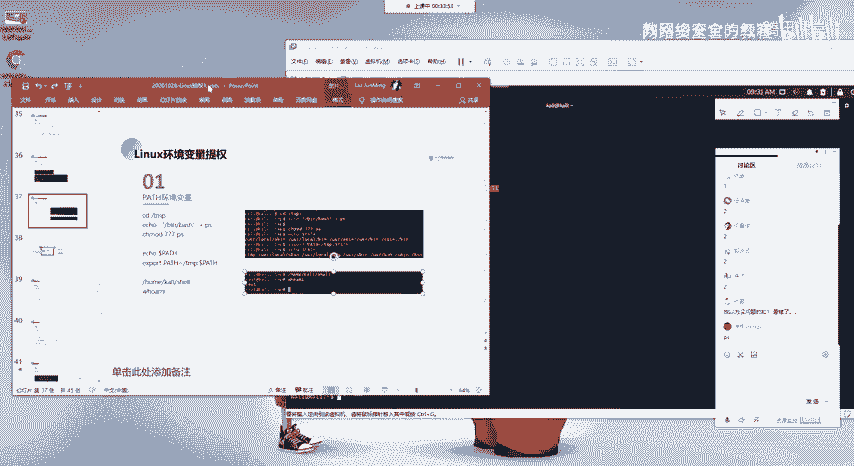

所以的话他同样的会走这样子的一个过程，就是走这边环境面料，他要去这一个目录它当中去查找是不是有这样子一个PS的一个命令，对吧？如果有的话，他就会去执行他。然后在这边的话。

我们在探棚录下面有添加了这样子1个PS的这样子一个呃文件，对吧？然后他正好的话找到了它。就是在看盘目录下面找到有这样的一个PS文件，然后的话他就会去执行这1个PS文件。然后执行这个PS文件的话。

这一个文件里面的内容是一个beb。

也就是他执行之后的话，他会去有得到这样子的一个呃bsh，对吧？我直我直接执行拜喜的话，就进入到了拜喜嘛。啊一个dist。啊，就退出了当前的那个ba啊。然后在这边的话就是呃可能就是正常的话，对吧？

你如果没有这样子1个SUIE的一个权限的话，你只你正常的你就算去添加这样子一个环境变量，对吧？你添加这一个环境变量之后的话，你在当前你去执行这样子一个PS命令。他去找到这样子一个目录，你得到这一个兵b。

它其实也是一个你当前用户的一个权限的一个be，对吧？就像我在这边去执行的这样子的对吧？我这边执行之后的话，我还是要看你的一个权限。

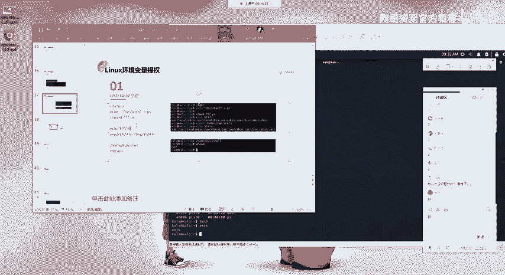

然后在这边的话就是不同的一个点的话，就是。这边的这个呃程序这边的这个需要程序，它是有1个SUID的一个权限。也就是我这边执行这个SUID的话。他会去查找目录，下面。

它是不是有这样子一个PS的这样子一个命令，对吧？然后的话他找到这个tamp目录，找到这个t目录，找到这边的一个PS文件，他会去执行这个bb。然后这边执行编办学的时候的话，大家回过头来看一下这边。

就是他在去执行这样子的1个SUID权限的时候，就这个用户他会去呃继承这个程序的一个所有者的一个权限。也就是呃以及这边就是启动为进程之后，对吧？就你执行这个PS命令之后的话，它同样有一个进程，对吧？

然后这个进程它的一个属主是云程序程序的一个属主，也就是它是一个root的一个权限。就呃总结的来说的话，就是我这边执行这执行之后，执行这个命令之后的话。

它会以一个root的一个权限去执行这边的1个PS里面的一个内容，也就是这一个beb。所以的话我们最后的话就能够去得到这样子的一个root的一个b。因为执行这边的这个办学的这个进程的话。

它会继承这边的这一个root的一个权限。所以的话我们就能够去得到这样子的一个root的一个权root的一个需要。

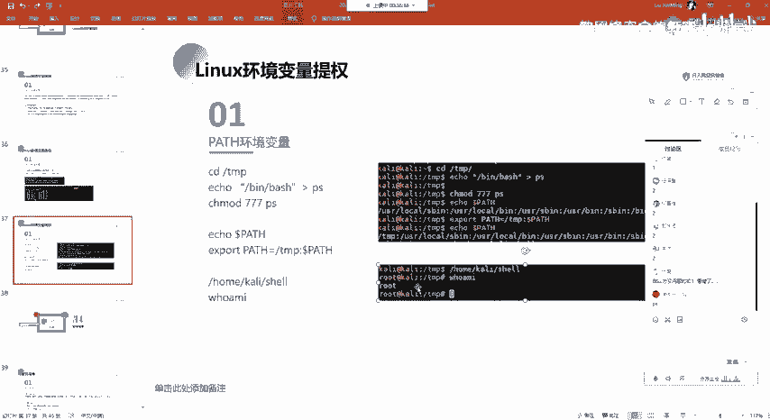

也就是达到了这样子一个提全的一个目的。我问诶。实际的来看一下。啊，我。这边的话我先到太本公路，对吧？呃，我这边的话。写一个这样子的一个。文件。把我们的1个PS文件当中。啊，其实。呃。

我们给他1个777的1个权限。然后我这边去执行这个PS对吧？就执行这个PS的话，你就是执行了一个这样子的一个败型嘛，对吧？我可以existexist之后的话，就退出了当前那个bus系是吧？呃。

可能这样子不是很明显，我这边改一下吧。我改成SH吧。啊，我这边执行这1个PS执行之后的话，就得到了1个SH。对。这边当前的话是1个SH。我这边有ex个。退掉。但是的话我我当前的话是一个普通用户，对吧？

我一个普通用户，我去执行的话，它还是一个普通用户的一个需要嘛。那么我当前的一个pas的一个环境变量，我们可以来看一下。是这样子的一个啊记录记录的一个值，对吧？然后在这边的话。

我们可以通过export来去添加这样子的一个去更改我们这边的一个环境变量的一个值。呃。然后其实这边的话就是呃更改了这样子的一个pass的一个环间变量，对吧？为这一串这边的这一串的话。

就是其实就是前面的这一串嘛，对吧？然后在这一串前面的话，我们加了这样子一个tamp，以一个冒号做一个风格。其实就是在这一串前面加了这样子一个tamp冒号。也就是添加这样子一个t目录嘛，对吧？

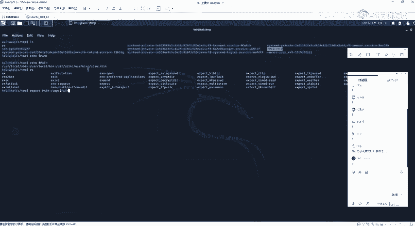

看一下应该。没写错啊。

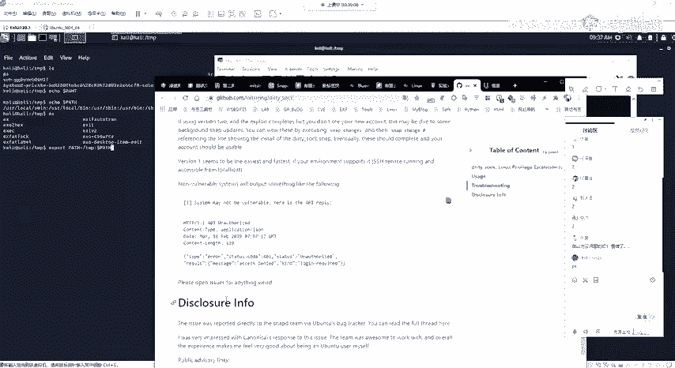

啊。没错。然后我再艾一下黄间面料，然后它就变成了这样子，对吧？也成这样子。那么我当前我去执行PS对吧？你会发现。你会发现我进入到的是一个呃线，对吧？我当前执行我执行PS我进入到了一个。SH的一个线是吧？

它不是它不是像我之前去执行一个嗯。不是像我之前对吧？我直接执行的话，它是一个返回这样子的一个内容是吧？然后我在这边的话，我执行的话就得到了1个SH的一个选。但是我这边得到了1个SH需的话。

是一个普通用户的啊，其实其实就是我这边执行面的话，他在这一个探部下面去找到了这一个文件，对吧？然后的话执行了。然后在这边的话就是我们结合这边我发现的这一个。这个拥有SUID权现的这个程序，对吧？

那么我在这边去执行之后。你会有发现。我这边执行之后的话，它同样的进入到这样子的1个SH的一个线是吧？但是不同的话是我这边执行换卖。你会发现的话，我这边是一个root的一个权限，就不是像。

前面这边是一个呃当前的一个看你的一个普通权限。你我这边呢。就得到了这样子的一个root的一个权限。

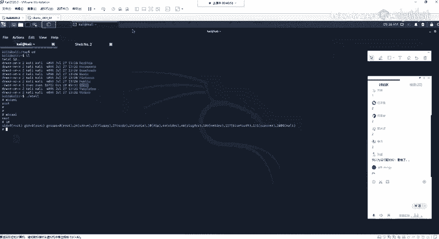

呃，也就是通过这样子一个方法达到了这样子的一个提群的一个目的。就利用利用的是这样子的，它的这个SUAD的这样子的一个权限。以及结合我们这边的一个bus喜的一个环境面料。就是整好的话。

它的这个USUID权限的这一个程序，对吧？就是他想要让普通用户，让普通用户也能够去执行，就是root用户的这样子的一个命令，对吧？就是他写了这样子的一个呃可进行程序的一个就是二进制的一个程序，对吧？

就是他其实他原本的一个目的是想要让普通用户去执行这样子的一个呃卸尔之后的话，能够以漏ot用户。的一个权限去执行对应的一个命令啊。然后的话他在这边的话就。存在这样子的一个问题，我们可以利用他。

的1个SUID的一个权限，以及结合我们这边的一个环境变量，来达到一个提全的一个目的。

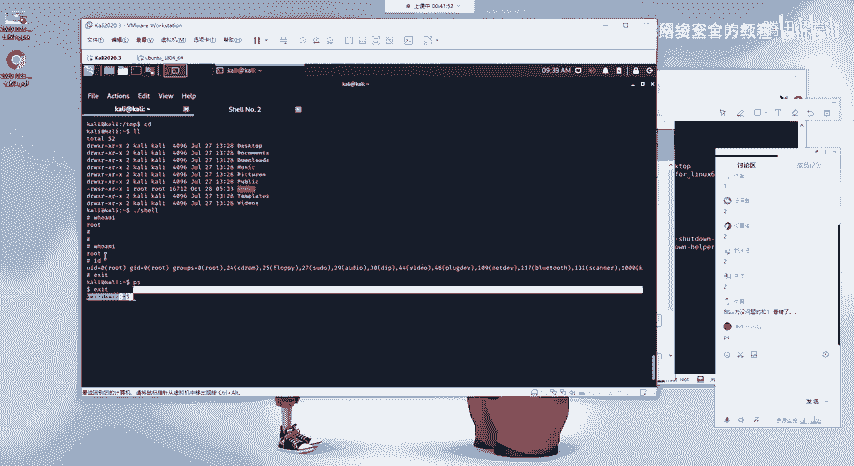

这边的话就是呃一个环境变量提全的一个例子。以及呃第四个的话就是。密码哈稀。密码哈希的话，其实呃我们就刚开始讲就说提群的时候，就有提到就是通过密码的一个方法来去进行一个提群，对吧？就密码的一个方式。

账号密码的一个方式提群是最直接最简单直接的一个方法对吧？如果你知道了对应的一个呃用户的一个密码，那么你就能够去得到它对应的一个权限嘛，是吧？然后在这边的话就是呃介绍就介绍一下密码哈西。

其实就是这样子的两个文件，就这1个ETC的1个password以及这边的1个ETC shot的一个文两个文件。呃，这个的话就前面已经呃比较详细的有介绍了，我这边话我就不多说了。

就前面在讲那个linux的一个呃信息收集的时候，对吧？去收集我们的这样子一个用户的一个信息。就有有给大家介绍啊。嗯。然后这边的话呃，我就大概的说一下，就是这两个文件它的一个特点。

就是这个ETC的1个password的话，它是所有用户都可以去查看的。哦，他是存储着所有用户的一个信息。每一行的话，它代表一个用户，我们可以。如在这边是吧。Cat ETC password word。

开始之后的话，在这边的话，它就有这么多的一些内容，对吧？他这边的话都是存储着用户的一个信息。每一行的话代表着一个用户。然后呃。每行。他的。每一行它所存储的这样子的一个呃内容代表什么意思的话。

就是我这边写的，我这边话我就不说了呀。前面已经有介绍过了是吧？啊呃第二个话就这个ETC需的这个文件的话，它是只有root用户能够去查看的。它保存加密后的一个密码和用户相关密码的一个信息。

然后同样的也是每个用户一行。好。然后的话就是。然后的话就是我们如何去进行一个就是说还去进行一个利用利用它呢？

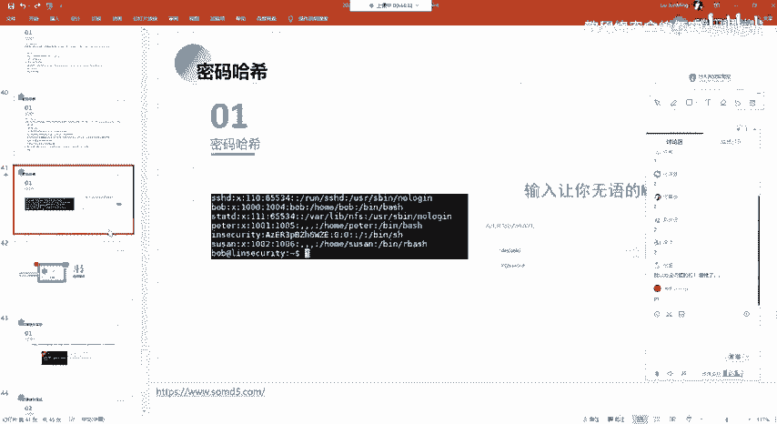

就是呃我们原本的话就是我前面有说对吧？就是ETC password word这个文件的话，它里面它是不存在，就是它没有存放我们的这样子的一个呃密码的一个哈希值的。就是说它的一个密码的一个哈希值。

我们可以看一下像root，对吧？然后后面的话有这样子的一个X这样子的一个就是占位符。这个X的话就是表示的就密码的一个哈希值。它这边X的话，它。呃，就是。呃，它原本的话是存放着这一个密码。

这个用户对应的一个密码的一个哈希子。但是后面的话就是啊为了安全的一个考虑。因为这一个文件的话是所有用户都能够去查看的对吧？那么如果你得到了一个普通用户的权限。然后的话你查看这个文件的话。

那么你就能够去得到他对应的一个哈希子，对吧？那么你得到他的一个哈希子的话，也可以去尝试做一个解密，就是有可能能够去解密出来，它的一个铭文的一个密码。对吧。

然后的话呃他实际的话实际它的一个密码的个卡西的话，它是存储在这样子一个小的的一个文件当中，对吧？

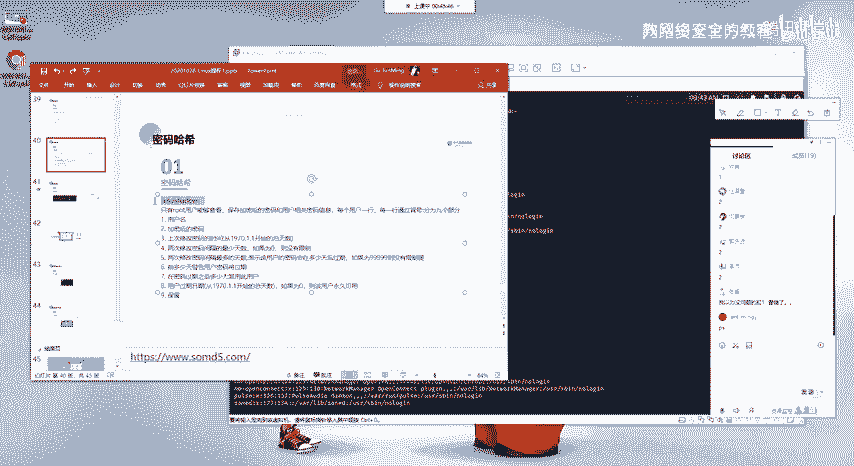

那么在这边的话，我们通常的话也会去查看这样子的两个文件就是。这一个呃password以及消消的这两个文件，对吧？然后通常的话，你想要去印证就是你的一个用户，他是不是有root权限的话。

就是呃就是我这边的话就最简单的一个方法就是你去ca一下那个的一个文件，对吧？如果你能够去查看的话，那么你就是一个root的一个用户嘛。以今天可以去CD一下root的一个目录是吧？然后呃在这边的话呃。

在这边的话，我们去因为我们是一个普通用户，对吧？我们可以去有权限去查看这样子的一个呃ETC的1个password。那么我们在这边的话，我们呃以这一个。

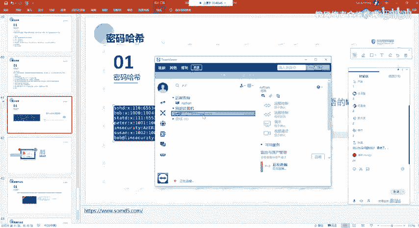

你这边的这一个。把字为件。就真是。啊，你你可以发现啊，就是对吧？原本的话它是2。3。1的这样子的一个版本。然后你过一会儿的话，它会自动的去升级到2。4。7的这样子一个版本。不的话，我如果我现在我。

再去进行一个利用的话，是利用不成功的呀。这点的话大家要注意。然后在这边的话，我以这一个榜机原件，对吧？我们去收集它的1个ETC的1个password的一个信息。其实如果你用脚本的话。

就是用我们前面的那个信息收集的一个脚本的话，也同样的能够去就发现啊。呃，以及在那个脚本当中的话，他还会有。

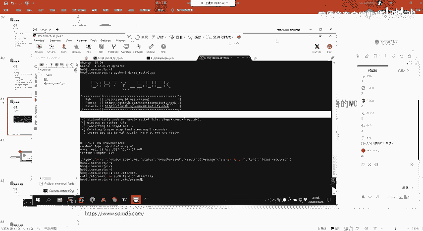

呃，啊，关掉了。就是你去认真看你在这个把这上面你去执行那个脚本的话，他会就列出来。就是像比如说在这边对吧？我这边查看这1个ETC password word这个目录。

然后我去查看这边有的这样子子的一些用户，对吧？然后像比如说在这边。就有一个这样子的一个用户对吧？这个用户的话可以看到跟前面这一些的话，他有不同的一个地方。就是在这边原本第二位他是一个呃。

就是正常的话是一个普通的。正常的话是一个X的这样子一个占位符，对吧？就是它的一个密码哈希，它不会在这边的。然后在这边的话，它是它的一个密码哈希，就是写在了这边，以及它它有这样子的一个特点。

就是它是一个root的一个权限。我们可以看到它的这边的1个UIDGGID的话是为0。前面的话有讲就是你只有root用户的话，他的1个UID以及GID它才是为0。也就是如果你的一个用户。

你的1个UIDGID为0的话，那么你的一个权限它就是一个root的一个权限。就呃就linux它会通过这样子的一个呃UIDGID来去标识来去就是。就是来去标识你嘛，对吧？

就是能够呃通过这边的这一个内容来去判断你的一个权限。然后在这边的话，它的一个哈哈希值的话是这边。那么我们得到它的一个哈希值对吧？我当前是一个普通用户，我都能够去看到的。

我可以去对他的一个哈希值尝试做一个解密？

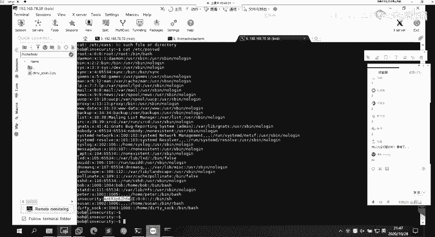

这边的话要付费呃。

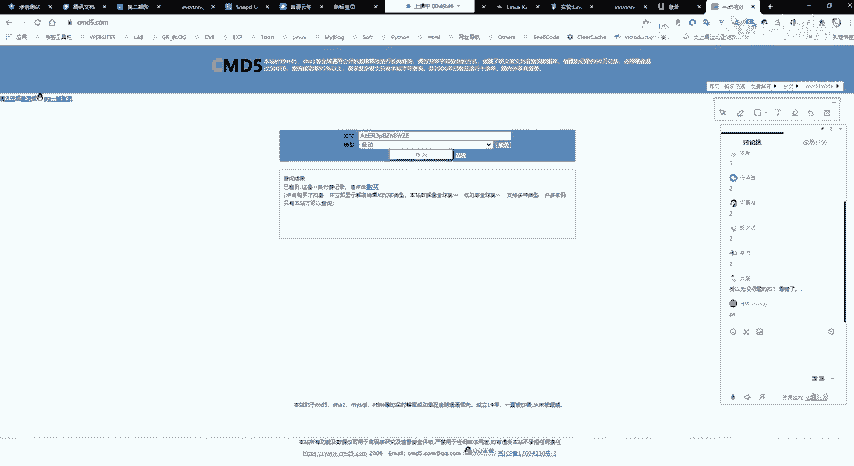

我通常的话是就是用这两个就是CMD5，还有这1个COMD5。

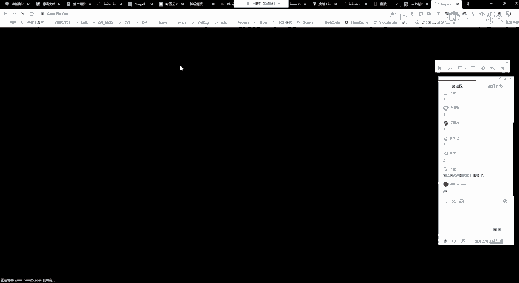

就其实呃挺多时候的话。

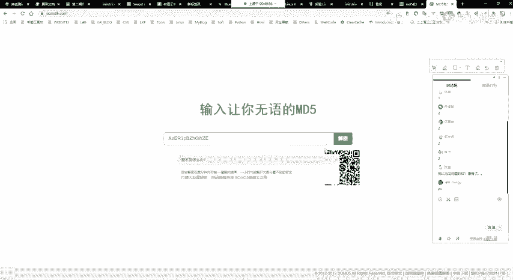

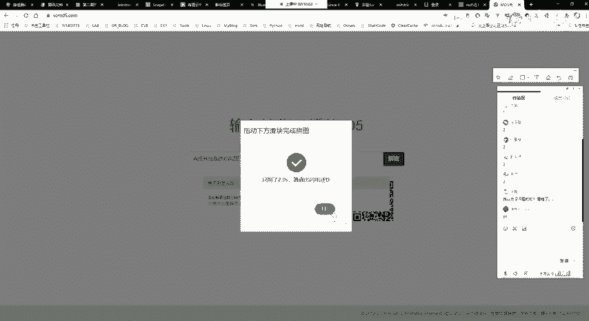

这个soMD5要还要好用一些。当然话你这边的话，你要是呃。你付钱的话，那那么肯定这一个要好用一些啊，这个的话。然后这边这个的话是这个CMD5的话，它是就免费的嘛，就不用钱，而且就是能查出来的东西的话。

也是跟这边的话呃，我个人感觉的话是差别不大。然后这的话我们就解除了他的一个账号密码，对吧？就这个。

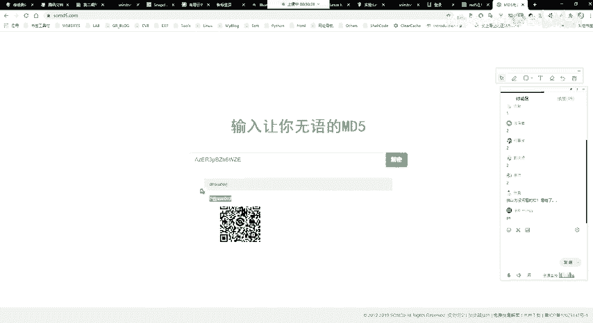

那么我们就可以通关石优。来切换到这样子的一个。し。这样子的一个用户，对吧？呃，它的一个需它是变SH，所以是这样子的然后我们可以执行一下花卖。可以看到当前的话是一个root的一个用户啊。

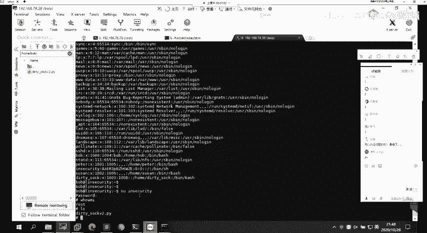

这是这就是通过这样子的一个呃密码哈希的一个方法，就他那个密码哈希的话，它是。存储在这样子的一个呃文件当中。然后其实呃我们在linux当中对吧，我们想要去添加这样子的一个后门的一个账号，对吧？

然后想得到一个root的一个呃用户。然后的话你留这样子的一个你可以去留这样子的，通过这样子一个方法，就是给这一个普通用户给1个UIDJID为0，你就能够去得到这样子的一个root的一个呃账号啊。呃。

以上的话就是我们本节课的一个所有内容啊。呃，最后这边的话就是呃两个提全的一个实验，就呃包括这个呃张留的一个提全实验，以及这一个无关图的一个本地提全的一个实验呃，给大家做为一个课后作业。

以及呃还有的话就是呃同样的PPT上面的内容啊，大家自己动手去做一下。然后呃就是课户做的话就是两个嘛，就是这两个实验以及PPT的一个内容，大家自己动手去操作，好吧。然呃，大家有没有什么疑问？呃，今年的话。

今天的话呃。因为喉咙确实有点难受啊，以及有点咳嗽。就我个人感觉今天确实没讲好，就大家。就我自己都讲的有点难，我自己都觉得讲的不是很好啊，今天。这边的话哎喉咙确实有点有点难受。讲话都有点。就是卡着对吧？

就是呃希望大家尽量啊好吧，这边的话说声抱歉吧。应该呃今天的内容的话，今天内容话不是很多。是。哇。这个。我就是卡萨维卡萨维。去年去年这个时候也是好像也是。喉喉咙哑的话是。哇。

确实这样子连续给大家讲课有点顶不住啊。主要一讲没得填，一讲讲一两个小时。嗯。然后呃有问题的话，在讨论区扣一，没问题的话扣2吧。嗯。呃，应该是没有问题的。然后PP的话已经发给大家好吧。那么没没有问题的话。

那么我们下课吧。好吧，大家早点休息。今天的话呃同样的跟上节课给大家介绍的同样的内容，就是linux的一个系统提全。啊，本节课的话主要呃分为了4个部分。第一部分的话就是滥用的一个收度权限。

第二个的话就是linux的一个定时任务的一个提全。第三个是SUID这一个特殊权限的一个提前提全。第四个的话就是其他的一些提全的一个呃实例。🤧嗯。第一部分的话就是滥用的一个收度权限。

就我们前面在讲linux的时候，对吧？呃，以及前面再去。呃，与提前与提前相关的，就说就是说在linux下面，我们以一个普通用户的一个权限要去执行。呃，比如说要去启动一个服务，对吧？

以及比如说你要去执行一个像呃if confi这种命令。如果说你是一个普通权限的话，它可能就是有限制你的一个执行，就是你没有权限，没有相应的一个权限去执行这样子的一个命令，对吧？

所以说我们通常的话在linkux系统下面的话，通常会用这样子的一个搜度命令，对吧？这个命令的话，大家应该都熟悉，就是呃经常呃玩linux的话，对吧？然后这边的这一个搜度的话。

就是它是linux系统的一个管理的一个指令。主要的话它就是用来就是呃允许我们的一个系统管理员，让普通用户去执行一些，或者是说全部的这样子的一个rootroot命令，它是一个呃工具。

就我们可以简单直接的理解，就是它是一个呃links上面的一个提全工具啊。嗯。然呃这个命令的话，它的一个执行流程就是大家可能就呃就是经常用这个，对吧？但是你不知道他是他实际的一个流程它是怎样的对吧？

这边的话我们来一起了解一下，就我们执行这一个收度命令的话，他会呃将当前的一个用户，他会转换成一个root的一个用户，然后的话以root的一个身份去执行一个命令，然后执行这个命令之后的话，呃。

他就会直接退回到当前的一个用户。也就是他有这样子的一个过程啊，就是比如说我去执行一个收度。我之前一个收队要去起一个service，对吧？我提起一个这个service，我一个普通用户的话。

我是无法去启动这样子的一个服务的。那么我们在这个时候的话，我们尝试使用收度这一个命令，对吧？然后他在呃执行这个命令的时候的话，他就会把我当前的就说如果你当前这当然的话。

前提是你当前这个用户有权限去执行这样子的一个收度啊。然后的话你当前的这一个普通户，你通过收度这个命令，它会呃以一个root的一个用户来去进行一个执行。因为我们知道的话。

root用户它是呃另时系统下面的一个最高权限的一个用户，是吧？那么他肯定是有权限去执行这样子的一个服务的一个启动这一个命令的对吧？那么他呃用这个命令之后的话。

他以root身份去执行执行这一个服务启动之后，对吧？启动之后的话，它就会立马退回到当前的一个用户。所以说我们呃这这这边的这个收度命令的话，只是一个达到一个短暂提全的一个目的。

就是呃短暂的把我当前的一个用户提提升到一个root的一个权限，然后去执行相应的一个命令。但是你执行完之后的话，你还是会回回到当前的一个用户，也就是回到一个普通的一个用户权限。嗯。呃呃，要注意的一点的话。

就是你在执行收度的时候，就是输入的一个密码。就是你如果说你的这个用户，你是有权限去执行这样子一个收度命令的对吧？然后的话你执行这一个收度命令之后的话，他会让你输入一个密码。

这个密码的话就是你当前用户的一个密码，而不是root的密码。对呃，这个的话应该很好理解对吧？就是你你你当你以当前的一个用户权限去执行这个命令，那么你肯定输的一个就说你验证的一个密码的话。

肯定就是你当前用户的密码是吧？如果说你都知道root的密码的话，那你不就可以直接呃得到root的一个权限吗，对吧？然后呃还有的话就是这边有一个需要注意的，就是收度的一个配置文件。就我们的收度的话。

它有这样子的一个配置文件，就是这1个ETC的1个sers这样子的一个文件。这个文件它的一个文件权限是0440，也就是它是没有其他这种特殊权限，然后只有root用户以及root组。

他才有权限去执行这样子呃，去读取这一个文件里面的一个内容。他是然后其他的一个普通用户以及呃他是没有权限去呃读取以及写录的。我们这边的话。们。大家如果就是有在电脑前面操作的话。

大家可以跟着我就是这样子来查看。

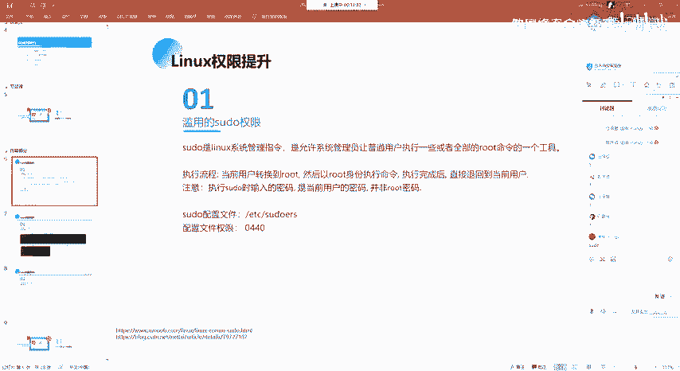

就呃比如我这边的这一个机器对吧？

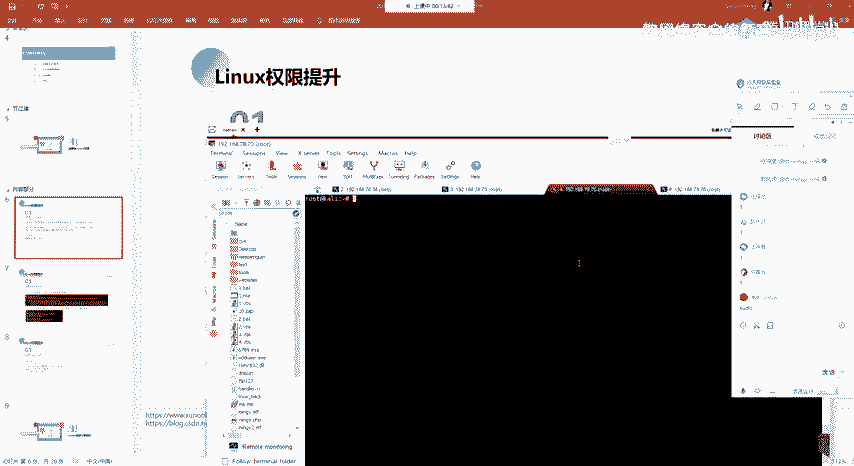

呃，这边能看得清吗？应该能看得清吧。我们可以呃。我们先来查看一下这一个收的这个文件，它的一个权限。这个文件权限的话是这样子的，就是只有root用户以及root组的用户，他才有权限去读取这一个文件。

然后你会发现其实root用户，他这边也没有给一个写的一个权限，对吧？但是因为root用户的话，你是一个系统的一个最高权限，对吧？呃，你虽然没有在这边没有写这样子的一个写的一个权限。

但是我们可以通过像比如说VM然后我这边PC。そうだす。这一个文件对吧？然后我在这边我进入这一个文件，我修改之后的话，我可以通过就是WQ加一个杠，就是强制保存。然后的话也是可以去做一个修改的。

因为你是一个露腿。然后还有的话就是你要去修改的话，有这样子的一个VI收度的这样子的一个命料。我们呃可以通过这一个命令来去做一个修改。就同样的也是进入到这边。

然后他在这边的话就是呃你他这边使用的一个编辑器的话是那个narrow。然后呃我我是我是不常用这个，我对这个编辑器的话不是很熟悉。然后我通常的话都是使用VM。然后在这边的话。

在这边的话就是你可以做一个编辑嘛，就跟我们平常的一个呃编辑器是一样的。就你可以在这边去写入，对吧？然后呃退出的话就是conttrol加X。哦，嗯。就通过这样子的一个方法来去做一个修改。

但是你如果说是你是一个普通用户的话，是没有任何权限，是没有任何权限去查看以及修改这一个文件的。因为在这一个文件当中的话，我们可以来查看一下。

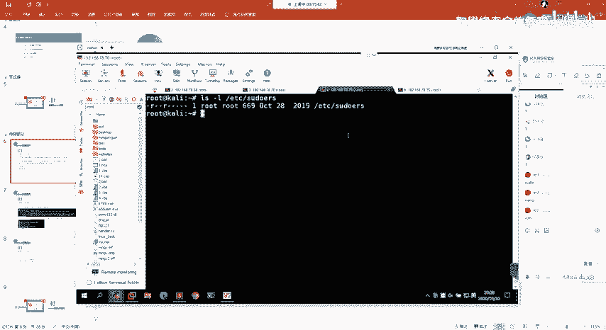

在这个文件当中的话，它里面它是存的存的存储的这样子的一个内容啊。就是我们这边的一个收度的这个特权用户的一个信息。就说我们的一个普通用户，对吧？我们的一个普通用户。

我们要想要去执行这样子的一个收度命令的话，你需要把你的这个用户把它给添加到这个文件当中，然后可以在这边有看到，就是这边有一个root，就他这里面它默认的话是有这样子的两个，对吧？

有这样子的一个rootroot用户，然后的话or等于or等于or，然后or对吧？这边全是or全是or的话，就代代表就是说这一个用户他是有。呃，有完全的一个权限。

就是有一个完全的一个root用户的一个权限。也就是因为他本我这边的话本来就是一个root用户嘛，所以的话我可以有完整的一个权限去呃，用收度，对吧？然后这边的话就是S这边有一个百分号，然后收度的话。

这个的话就是表示收度组啊，就这个的话就表示组这边是表示用户。然后这边呢这一个搜度组的话，它同样的也有就是呃有root的一个权限，就我们可以通过搜度来得到root的一个完整的一个权限，对吧？

那么我们想要去就是呃想要得到一个root的一个权限。你也可以把你的一个用户把它给添加到这样子的一个搜度组中搜度组这这一个搜度的一个组当中。然后的话你同样的也能够去得到这样子一个root的一个权限。

这是呃收到时这一个文件。然后呃关于这一个文件的话。关于这一个文件更详细的这样子的一个呃。介绍啊大家可以看一下这篇文章，我有放在这个预习内容当中了，就这一个收到时这一个文件。

这这篇文章的话详细的介绍的就是这一个收到文件，它的一个就是它的一个。它的一个配置的一个组成。就是像比如说在这边对吧？就默认的话，它这里的话它会有这样子的几行。呃。

还有的话可能还会有这样子的一个min的这样子的一个组。就是表示的话就是这一个min主的一个用户，他同样的有所有的一个权限。然后呃他这边的话呃，我这边就大概的给大家介绍一下，好吧。就是来理解一下。嗯。

其实详细的话，大家看这一篇文章吧，好吧，我这边的话就以他这边给的几个例子给大家介绍。然后在这边他有详细的介绍，就是说有这样子的一个公式，对吧？就是首先的话这边的话授权用户还有主，对吧？也就是我们这边。

比如说root这一个用户，或者说你是一个其他的一个普通用户，像比如说呃一个看你用户，对吧？然后主机主机的话，这边这边对应的就OO的话就是表示所有的一个主机就是呃。你任何的这样子的一个主机，你都你去登录。

你去用这一个用户的话，你都有都能够去得到这样子的一个就是对应的这样子的一个权限。然后后面这边的话就是切换到哪些用户或主。就是这边的话沃的话就是表示所有的。

也就是他可以通过收度这一个命令去切换其他的所有的一个用户，以及你可以就是指定某一个用户。像比如说指定一个root用户，对吧？就是在这边指定一个root用户。然后要注意的话，要在括号当中。

然呃像这边的话就是偶尔的话就是所有的一个用户嘛，偶尔的话就是所有的一个组，就是用户，还有组通过这样子的一个形式。Yeah。然后呃其实还也可以省略，就是省略，就是在这边只加一个or，它就是表示所有的嘛。

对吧？然后的话要注意要加括号。然后还有的话就是呃，是否要输入密码凭印证。像我们呃如果说不加这样子的一个no password这一个字段，就这一个字段。那么你再去呃用收 do。

就是说你当前的这比如说这边的一个lucy这一个用户，对吧？你通过收度，你切换到呃漏的一个用户的话，你你用收你用收度去执行相应的一个命令的话，像我们正常的话，如果不加这个我们执行收度。

我们需要去输入当前的一个用户的一个密码，对吧？那么你如果有这样子的一个字段的话，那么你去执通过收度去执行呃相应的一个命令的话，你可以不用输当前用户的一个密码。也就是说你不需要知道当前用户的一个密码。啊。

其是像我们前面的话，我们要执行收度的话，我们需要输入当前的一个用户密码，对吧？所以的话你想要你虽然你得到了这个用户，你你得到了这个用户的一个权限，你而且这一个用户有权限去执行这个收度，对吧？

但是的话如果你不知道他的一个当前用户的一个密码的话，你同样的就是呃不能够暂时不能够临时的去获得这样子的一个root的一个权限。然后后面这边话就是接我们执行的一个命令。也就是说他限定了在这边呃。

如果说是的话，就是表示所有嘛，就是所有的一个命令你都可以去通过收度来去提全对吧？那么你在这边限定了相应的一个命令的话，也就是像以这边的这一个为就是这个这个用户。他执行收度的话。

他可以不输不输入当前的一个用户密码对吧？然后我要去通过执行这一个U也就是他不输入当前密码的话，他只作用于这一个这一个命令，而且是只只有执行这一个这个命令的话，你才能够就是说你才有权限去执行。

你才能够通过收来去执行这个来去得到一个就是的一个权限去执行这个命令来去添加用户对吧？而且不需要去输入密码。然后其他的一个命令的话，就是没有权限去执行。就这个意思。呃，然后还有这边要注意的话。

就是像比如说这边的这边的这个例子的话，就是这个no password，它只重于只重用于第一个命令。然后后面的这个命令的话，就是它同样的也需要去输入密嘛。

也就是你只有在执行用收对去执行这个来去更改我们的一个权限的时候，对吧？就执行这一个命的时候，你可以不输入密密码。然后你后面的这些命令的话，它同样呢需要输入密码。以及的话就是多个命令之间的话。

用这样子的一个逗号做一个分隔。呃，关于更多的话呃，其实主要大家要了解的话，就是我上面讲的这一些，对吧？然后你想要去了解更多的话，你从头到尾看一下这篇。他的这样子的一篇文章，好吧。应该能。

大家应该能理解吧。我刚刚讲的那些能大家理能理解吗？好的，能理解是吧？那么我们继续。

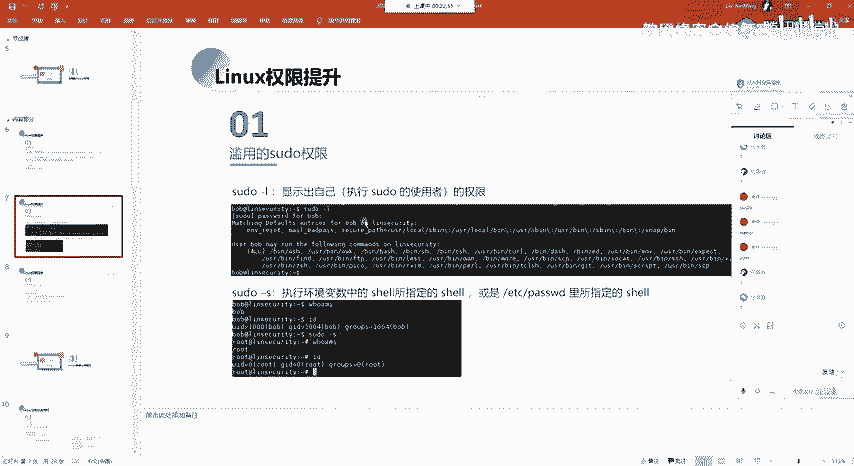

嗯。下面的话就是两个命令，就给大家介绍这两个命令，就是我们呃我们如何去进行一个。查看查看自己当前用户的，就是能够去用收度这个命令去进行一个提全的这样子的一些命令。首先第一个话就是这一个收度杠L。

就是显示出自己的一个权限。注意的话这边呢一个权限的话，就是显示出自己当前用户能够去通过收度这个命令去执行的这样子的一些命令。呃。其实啊。可能用收度这个命令来去说。

可能大家不是很那个就是呃通过收度这一个提成工具，对吧？这样这样说应该应该会更好理解一点，对吧？就是通过收度这一个工具来去执行呃这样子的一些命令。你才能够呃。就说你。不好意思啊，我这边突然卡了一下。

就是我这边执行收度杠L对吧？然后的话它在这边有显示出这样子的一些命令，对吧？这些命令的话就是说你呃你可以有权限，你可以去使用收度这样子的一个工具来去执行这样子的一些命令。然后这些命令的话，呃。

我们可以通过我们能够以一个root的一个权限去执行。然后收度杠S的话就是执行环境变速中的需所指定的一个线。或者是。ETC password里面所指定的这样子一个系，就我们呃so度杠S就我当前用户的话。

我当前用户的话呃就是。

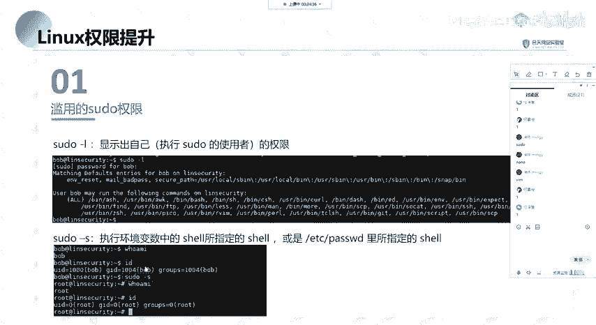

我看实际的例子吧。我们先看一下他 work。这个文件对吧？然后这个文件里面的话就存储着当当前所有用户的这样子的一些信息嘛，对吧？然后最这边的话有这样子的一个字段。

就是最在最后有这样子的一个呃需要环境变量的这样子的一个字段。在这边也就是像比如说我这边的这个卡里用户的话，你的这样子的一个需有的一个病数的话，就是这个beb，对吧？

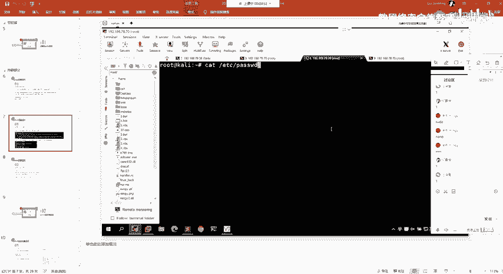

然后的话你在当前的话，你呃通过呃就是你远程登录，你远程登录这个用户的话，你得到这个 share的话，就是这一个bass的一个 share。然后在这边的话就是我们通过so do杠S。

因为我们知道so do的话，它是以root的一个权限去执行，对吧？那么在这边的话呃就是对应的我so do杠S的话。

就是表示的就是我这边。以一个root的一个权限去指定去执行我们这边的一个呃root的所对应的这样子一个选，就是这一个b，对吧？比如说我这边。一个意思，我先进入SSH取对吧？让我搜对干S对吧？

我这边的话就进入到了一个bash。对我当前的话就是一个bash嘛。因为root的话，他在这边他呃默认的他指定的这样子一个需要的一个变量化，就是这个需要环境的话是这一个冰b。然呃。

收度杠L的话就是查看当前的当前用户能够以用收度这个工具去执行的这样子的一些命令。收都干了。啊，我当前的是一个root用户，所以的话它这边表示的是沃尔沃啊。

就是我们在那个收到文件当中所配置的这样子的一个权限，对吧？然呃我们我在这边的话，我以这样子的一个这一个把机为例。

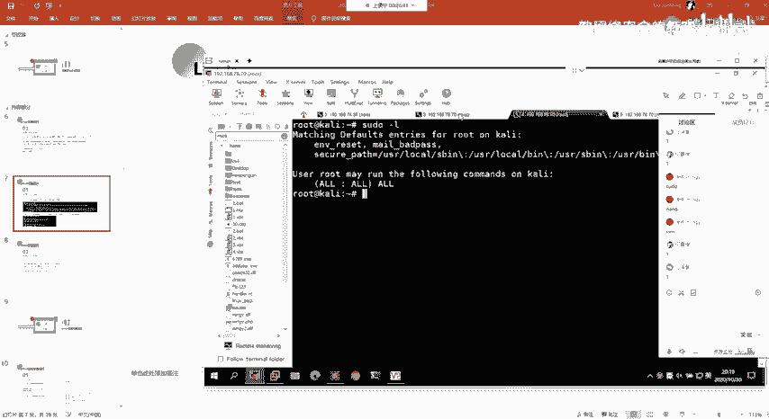

就这边的这一个把机的话，我当前我通过执行这个收度杆啊，他这边的话需要我们输入这个bo勃的一个用户名呃密码。然后我这边输入密码之后的话，我在这边就能够去查看到呃，当前的。

这个报表用户能够去用收度这个工具所执行的一个命令，也就是能够以root用户去执行的这样子的一些命令。就在这边的话有列出来了。然后其实这边的他所列出来的这样子的一些。所列出来的这样子的一些命令。

我们在这个它的这样子的一个缩短时的。在他的呃这一个s的文件当中，我们能够去查看到。呃，我们来呃。一我们呃我带大家一起来看一下他的这边的这个收的是文件，它的一个组成啊。首先的话就是呃。

他在这边的话有这样子的。这么几条对吧？第一条的话就是这个root，这个root的话就是我我们默认的话就有的对吧？然后在这边的话，它有这样子的两条，这两条的话就是它添加了两个普通用户。

然后peter首先电话。首先的话就是这个peter用户。peter用户的话，它的一个呃。它的一个特点的话就是在这边有一个no password，对吧？就我们前面说的就是说它peter。

再去执行这边的这个命令。这边的这一个命令的话，它其实是对应的在这边。在这边就呃他这边加了这样子的个案ice，也就是别名嘛，也就是他再去执行这一个命令。执这边的话，他其实就是指指定的这边的这个命令。

就是这个这面的话就是一个呃路由跟踪的，就是跟踪进程的通信的这样子的一个命令。然后呃他在这peter这个用户再去执行这一个确确实命令的时候，他是不需要输入当前用户的一个密码的。然后波宝的用户的话。

就是他这边的话，他指定了这边的一个bo。what sense对吧？然后这边what sense的话，它同样的就是对应的这边。对应的这边他给了这样子的一个值。然后这边的这一串的话。

就是说他限制了他限制了这边这个报表用户，能够通过收对这个工具来去执行这边的这些命令。然后其实就是对应的在这边所显示的。啊。

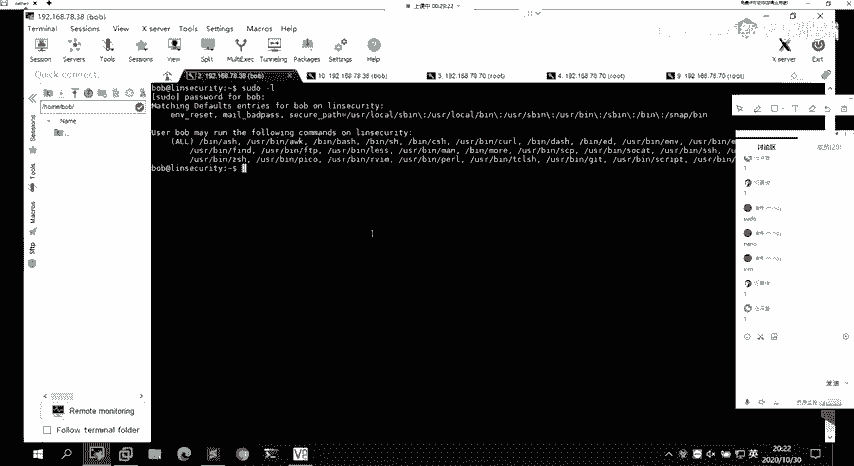

就是呃这两个。哦呃，下面的话我们来就是介绍一下。

就说我们通过这一个收度干啊，对吧？我查看到了当前的这一个用户，他能够与root用户去执行这样子的一些命令，对吧？那么我知道这一些东西有什么用呢，对吧？我当前的一个普通用户用收度来去执行对应的这一些命令。

那么我们因为我们最终的一个目的的话，我们是要去进行一个提全的，就是我们的。本节课的一个主要内容就是去进行一个提全，对吧？那么我们通过这样子的一个收度，我们能够去临时的得到一个root的一个权限。

以及我们在去执行这一些命令的时候，能够去临时的得到root的一个权限，对吧？那么我们如何去利用这样子的一些。呃，他在这边所配置的这样子的一些命令来去进行一个提全的。

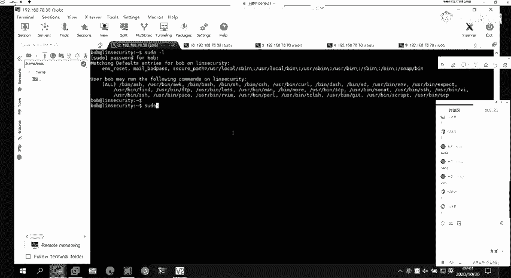

然后讲到这边的话呃，就是。现带大家来看一下这边的这一个项目嗯。

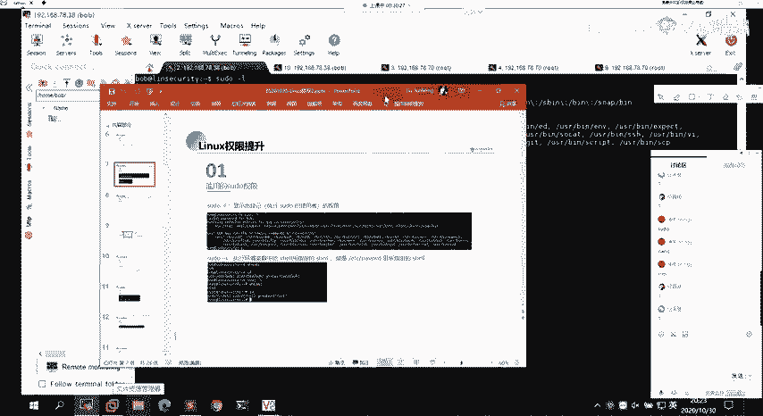

我这边的话放在了这一个。呃，预习内容当中。就这个。🎼就这个GTFOB这样子的一个项目。这个项目的话，他是呃。怎么翻译一下吧。Okay。这个项目的话，它是一个呃uni下面的一个二进制的一个列表。

然后的话它主要的一个作用就是我们可以利用它来去绕过本地的一个安全限制。也就是这边呢这他这边他所收集的这样子的一些二进制的一些面令。它有对应的这样子一些功能，我们可以去进行一个利用。然后呃他在这边的话。

就是说他收集了这样子的一些就耽误。当系统它再去滥用这样子的一些呃二进制的一些。程序的时候，我们可以利用它来去进行一个呃。权限的一个提升，也就是突破我们的一个。

壳这边的壳的话翻译的意思的话就是需要就是突破当前需要的一个限制，也是能够呃进行一个由普通权限去提升到一个高权限的一个目的，以及可以去传输文件，还有对应的反弹系尔等等的这样子的一些作用。然后在这边的话呃。

这边先不翻译了。在这边的话有列举了这样子的这么多的一些命令。然后这一些命令的话，我们可以在这边去一一的去查看啊。像比如说这一个。ISH对吧？

然后这边的话它就有列出了关于这1个ISH这个二进制呃程序的这样子的一些作用。首先第一个位置需要。谢尔的话就是他这边可以用它来去得到这样子的一个谢尔绘画。嗯。翻译一下吧。

能够呃得到这样子的一个程序系统的一个外壳，也就是我们的一个sh。你我们在这边直接执行1个AH的话，就能够去得到。我们来尝试一下。比如说我在这边对吧？我在这边我去执行这个ISH对吧？

我这边的话就得到了这样子的一个需要，对吧？

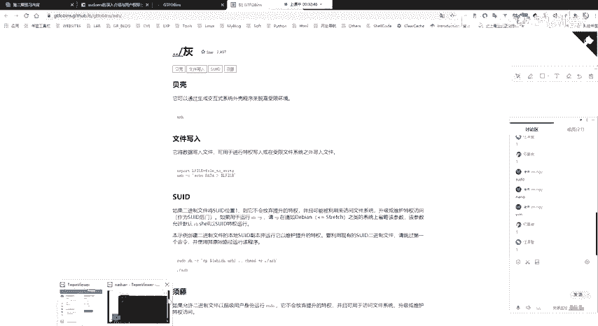

就得到了这样子的个ISH的一个效是吧？

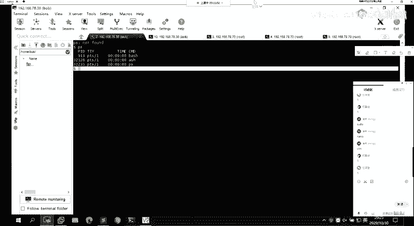

然后的话还有就是它有文件写入的一个功能，就是我们可以通过SH来去写入文件。就像在这边的话就是。呃，他首先的话加了这样子的一个变量，这个变的话就是你要去写入的这这一个文件。然后的话你在ISH。

然后其实就是写了，就是通过ele这一个命令来去写了这样子的一个数据，把它写入到这样子的一个文件当中。这边的话就是。添加了这样子的一个变量。然后其实像这整个的这一句意思的话，就是我们AH的话。

杠1的话就是呃我们之前AH的话，它会进入到一个需，对吧？然后在这一个hell下面执行这边的这一个命令，这边的这个面化就是le就是把我们这边的一个数据把它重定向到了这一个文件当中，对吧？这个大于号的话。

就是我们的一个输入重定项嘛，对吧？前面已经。讲过了。以及还有搜SUID也就是这边的这个，如果说这边的这个SH这个二进制程序，对吧？它有1个SUUID的一个权限，那么我们就可以利用它来去进行一个呃提全。

就我们其实前面有有有说，对吧？就如果说你你是1个SUID的一个呃权限的话，你一个普通用户去执行这样子的一个权限，执行这样子的一个程序，对吧？他会继承他的一个这个文件的一个所有者。

就这一个文件所有者的话呃，一般的话是root，对吧？那么你以普通用户去执行这样子的一个有SUID的这一个程序的话，我们就能够去得到一个呃root用户的这样子的一个外壳，就这样子的一个需要，对吧？

以及还有就是收度，就我们如果说你有收度的这样子的一个权限，对吧？你可以通过收度来得到这样子的1个AH的一个线。因为我们收对的话就是一个root的一个权限嘛。

等于就是说我们一个root的一个权限去执行了1个SH，然后的话就得到了一个root的一个呃需要。我这边的话就以这一个为例子，就给大家大概的介绍了一下呃，他这边的这样子的一些组成的。

以及就是呃就大家看不懂英文的话，就是翻译一下嘛，是吧？以及就是大家碰到一些错误啊，就是大家再去呃执行一些命令啊，以及去安装软件，对吧？有碰到这样子的这些错误。像一般的话在进行省面的话。

都是用的英文的对吧？然后的话这些英文的话，其实这些报错的一些信息，其实你的一些解决方法的话就包含在了它的一些报错信息当中，对吧？然后如果你看不懂英文的话，你就把它抠ll出来嘛，然后翻译一下嘛。

翻一下之后的话，你至少能够去大概的知道他是什么意思，对吧？然后的话你就能够去进行一个尝试了。就是呃提一下，就是大家大家去解决这样子的一些方法的一一个思路啊，也其实也是一个就是。

解决自己问题以及去自己去学习相应的这样子的一些知识的一个思路。对大家要养成这样子的一个习惯。然后在这边的话就是呃他这边有列举了很多的这样子的一些me令。呃，他在这边有这样子的一些标签。

像比如说需尔需尔的话也就是。像我们在这边就是这个需要，对吧？就等于就是说如果说他这一个程序他有这样子的一个标签的话，那么他可以去得到这样子的一个外壳，也就是得到这样子的一个。需环境对吧。

然后还有的话就是common的话就是执行命令以及呃的话就是反弹等等的。还有SUID就是如果说这一个程序它有1个SUID的一个权限，我们可以利用它来做什么。然后他在这边的话就已经都。详细的列出来了。

就是它的一个使用方法，对吧？像比如说它是有收度的一个权限，就我们可以用收度来去执行这边的这一个，比如说这个SPN，对吧？那么我们就可以通过这样子一个方法。速度加这1个SPN。

然后的话执行这样子的1个ESEC来去得到这样子的一个伴喜的一个需。然后在这边得到了这个伴喜需的话，它其实是一个root的一个需。就是它是因为我们执行这个CPN的话，CPN的话。

它是一个root的一个循序执行对吧？以及还有等等的，像在这边可以去访他蟹。他在这边话就列举了这样子的一个实例，我们可以直接去进行一个呃。可以直接呃去。进行一个使用。然后在这边的话呃。

为什么要去给大家介绍这一个呢？

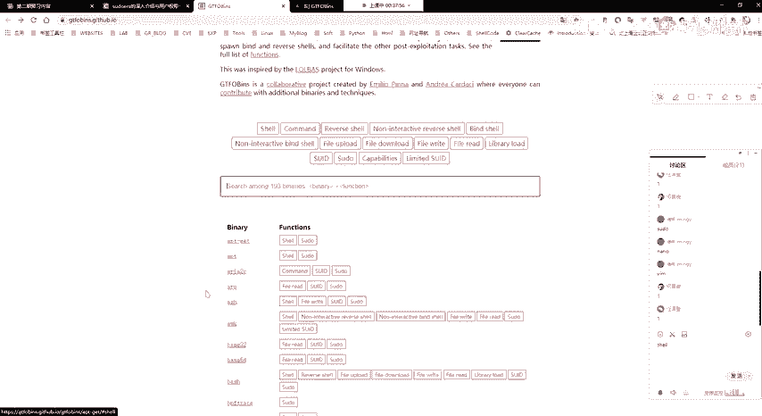

就是我们结合我们在这边通过搜度杠L所收集到这样子的一些信息啊。Yeah。就是我们在这边收都感哦，对吧？我在这边的话就有这么这一些可执行。呃，就是我这边对吧？我通过收度干啊这个命令执行之后。

我在这边的话获取到了这样子的一些呃命令的话，我是可以通过收度这个工具去进行一个呃用ro的一个权限去执行的对吧？那么对应的这一些程二进制的一些程序，我们怎么去进行一个利用，对吧？你可能不是很清楚，对吧？

那么我们就可以把它扩出来，对吧？我们放到这个项目当中来找到这样子的，像比如说这个AH也就是我们刚刚我刚刚给大家介绍的它的这样子一些作用，对吧？然后在这里的话，我们是收度。

我们能够去用收度的一个权限去执行，对吧？那么对应的在这边的话，就是找到这边的一个收度，我们有这样子的一个收度的一个权呃，能够去用收度这个工具去执行的话，我们如何去进行一个利用。

就这边我们可以通过收度加这样子的个AH。

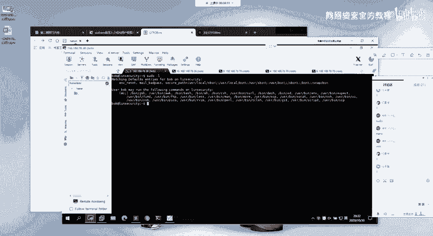

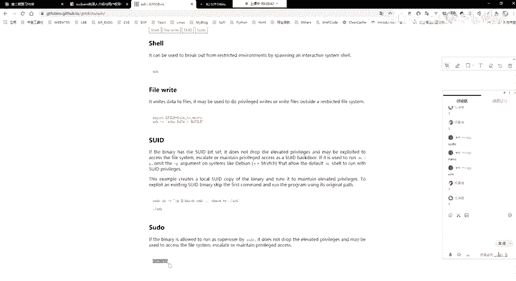

收据价。然后的话得到了这样子的1个ISH，对吧？然后在这边的话呃。我在这边的话就是呃。提个问题，就我这边的话，我执行AH对吧？我在这里的话能够去得到这样子的一个呃小的一个外壳，对吧？

那么我当前执行的这个SH然后我当前得到这个外壳呃，是什么样子的一个权限，就有谁能回答一下？能看得清吗？就我当前我这边执行1个SH对吧？然后的话我得到这样子的一个需外壳。

我当前的这个权限的话是什么样子的一个权限，就是什么呃哪一个用户的一个权限是ro用户还是这个bo勃这一个用户。有知道的同学回答一下吧。诶。知道的同学扣一不知道的扣2。嗯。每一位同学知道吗？不。好吧。

那我们继续看，就我这边执行SH对吧？啊，这边这个的话其实毫无疑问嘛，对吧？我们执行换卖，我当前话这就是一个bob。因为我当前是一个波ob的一个用户啊。我以一个bob用户的一个权限去执行这个SH，对吧？

那么我得到的对应得到的这样子的一个需，不就是一个bob用户的一个小嘛，对吧？这个应该好理解吧。这这你能理解吗？就就跟。这边就不不就是跟我这边执行SH对吧？那我这边之前SH得到这样子的一个小的一个外壳。

我当前的一个呃用户的一个权限是什么呢？现在知道。那肯定是包文嘛，吧？因为我是一个报表的用户去执行的嘛。那么我现在用收度，对吧？我这边。我这边的话它是能够用收度去进行一个执行的对吧？

那么我在这边通过收度来去执行这1个SH。我当前这边得到了一个用户的一个权限，就我这边得到这个小的一个外壳的一个权限是什么？有同学能回答一下吗？Root。Out。嗯，好的，对呀。那大家还是理解了是吧？

没错，就是root，就是说我在这边的话收度对吧？就是其实这边的话就是大家理解收度这个工具啊，它的一个作用，对吧？我在这边我能够用收度去执行，对吧？然后的话收度的话，它是能够去进行一个提全的。

它是一个提全的一个工具。然后的话它会以一个root的一个权限去执行这边的一个命令，对吧？嗯，那么他在这边的话，以root的一个权限去执行这个AH的话。

那么我在这边得到这个小外壳不就是root的一个权限吗？对吧？也就是我通过这样子的一个方法，我就简单的进行了一个提群，就得到了一个root的一个权限，对吧？你有发现是不是很简单，就是说他这边的一个呃。

他他这边的一个漏斗。或者说这个权限的一个配置的一个缺陷。就是说他在这边他配置的这样子的用收入的这样子的一个权限。嗯m。他给了这样子的1个ISH。

那么我们就可以用收据来去呃执行这样子的1个ISH来得到一个root的一个权限。以及同理的话，在后面后面在这边。还有其他的。嗯。还有其他的这样子的一些面料，对吧？有这么多，像我们常见的冰半喜对吧？

半喜的话，它同样的也是一个外壳嘛，对吧？那么我当前我之前半喜的话，我得的还是一个豹纹嘛，对吧？那么我他可以用收度来提全。那么我收度办起的话，我这边的话就得到了一个root嘛。对吧。

以及还有就是呃SH还有CSHCSH等等的这样子的一些就是小的这样子的一些呃。

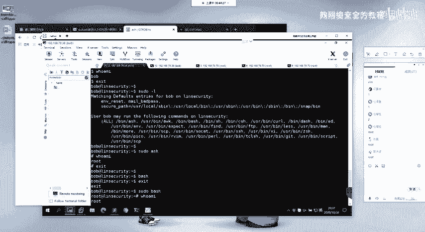

这样就是能够去得到需外壳的这样子的一些uni的二进制的一个程序。然后其实如果你不知道这样子的一些。呃，程序它的一个利用的一个方法，对吧？我们就可以把它抠过来嘛，抠到这边来。

我们以这个同样的以这个拜喜为例，对吧？拜喜这边的话，你会发现就有这么多的一些标签了，像法兰西尔对吧？以及西尔的一个外壳。啊，对应的呃需尔外壳的话，我直接执行拜洗，我就能够去得到这样的一个需尔外壳。

以及能够去反弹系尔。反正仙儿的话这边的话就不用多说了吧，对吧？前面已经花了很多的一个时间给大家介绍这一个。就呃重点的介绍了，就linux下面反纳需尔的这一个beush下面的。就通过这样子的一个方法。

对吧？以及还有就是呃像文件上传文件下载等等这样子的一些。他在这边的话有列举了这样子的一些实例啊，大家自己去看，好吧。然后呃我们这个话主要就是看这个收对，对吧？就我当前的话是收对嘛，对吧？

我能够用收对来去进行这样子的一个操作。那么我的一个操作的一个方法就是收对加这一个b。我就能够去得到一个root的一个线。

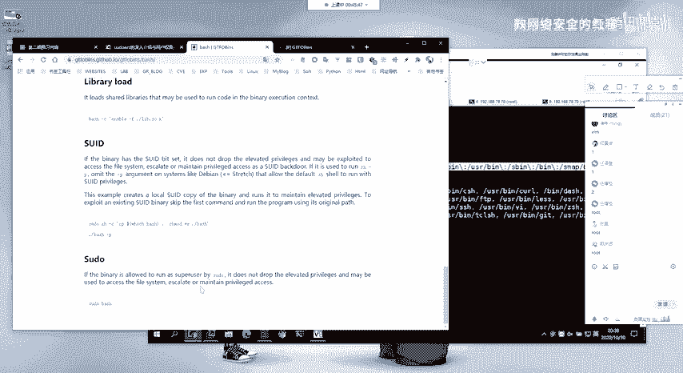

同理其他的也是一样啊。嗯。

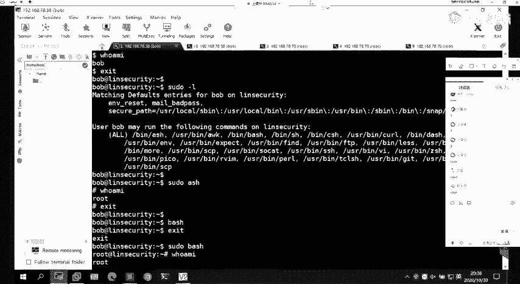

啊呃，介绍了。就说介绍了这个收度杠L，以及就结合我们这边的这个项目啊。的一个使用。下面的话我这边的话就以一些啊实际的一个例子给大家来展示一下。

就是说我们如何去利用他的这样子的一些滥用的这一个收入的一个权限来去进行一个提全。首先这一块就是前面说的这个AH对吧？然后第二个话就是这个AWK。就在这边的话。

这边可以看到这边它同样的有这个AWAW的K的一个命令，对吧？那么我们把它扩过来。跑到这边来，就这个对，找到这个速度。首都这边的话，我们可以怎么去利用它呢？就这里啊这边他命令他命令都已经给出来了。

我们直接 call过来。

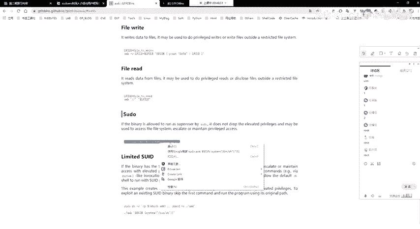

然后的话在这边来去进行一个执行。嗯。然后呃我通过执行这一个命令时候，得到了这样子的一个需尔的一个外壳，对吧？然后我来查看一下当前的一个权限，就是一个root的一个权限。

然后这边的一个面的话就是利用这个AWK的这样子的一个文本呃文本的一个处理器啊。文本的一个处理工具处理命令。然后的话他这边的是它的这样子的相应的一个语法。然后其实主要的话就是在这边，对吧？它在这边的话。

我们可以去通过调用这一个stem来去执行这这样子的一个边b。啊，并需要。

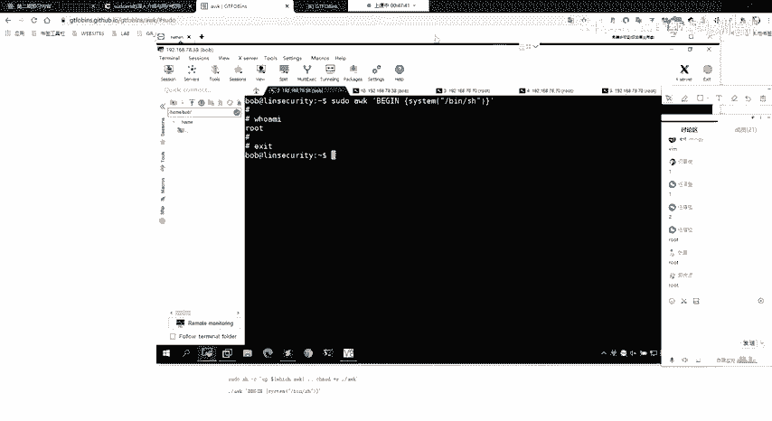

然后的话呃。呃，这边还有一个例子，就是用这个AWK来去进行一个呃文件的一个读取，就是读取文件。然后在这的话就是以这样子的一个需要的这个文件为量。就是我们正常的话对吧？我们正常的话。

普通用户是没有权限去只去去读取这一个文件的对吧？那么我们在这边的话可以利用这1个AWKL。我们在这边向这1个AWK呃。文件的fire read就文件的一个读取，对吧？嗯。嗯。他这边表示怎么跟我不一样呢？

嗯。

直接这样可以读吗？

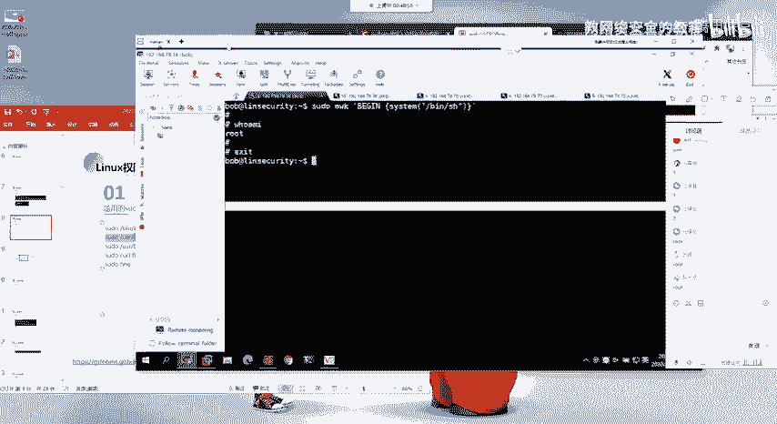

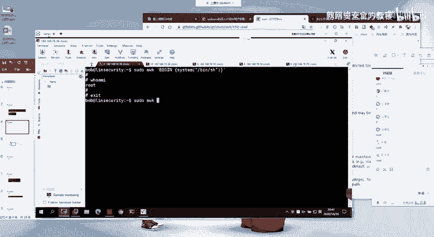

试一下。

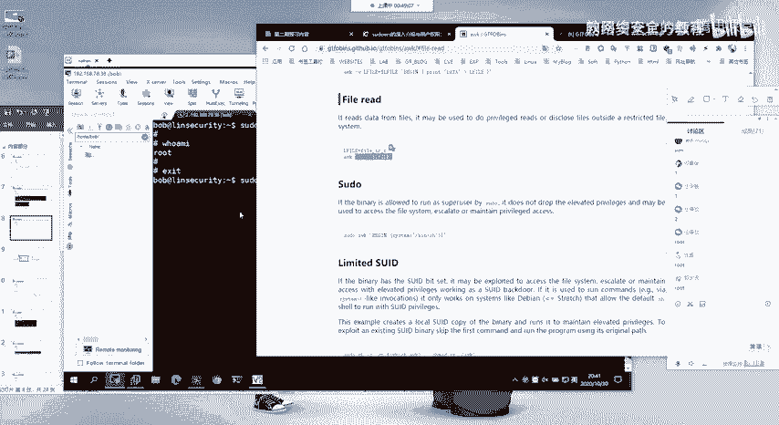

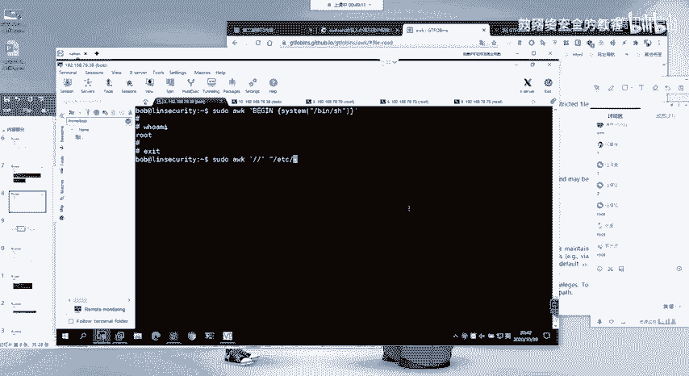

哦，可以读啊。就直接通过这样子的一个方法就能够去读啊。这样子。然后呃，我这边的话是通过这这一个方法就是。同样的也是用AWK嘛。然后的话在这边的话就是。

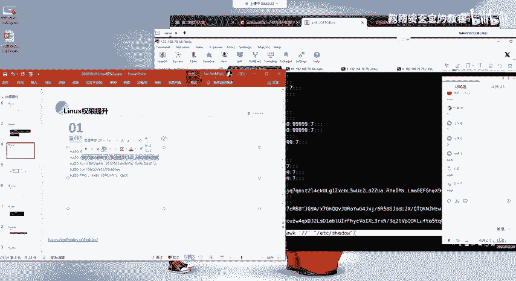

我这边只输出来就是print of输出第一列以及第二列。然后的话这边的话指定这一个文件，然后其实达到的一个效果的话，就是跟他这。

呃。类似的。然后主要的话就是在这边，在这边的话，你执行一下，就是我只要那个用户以及密码，对吧，我只列出。

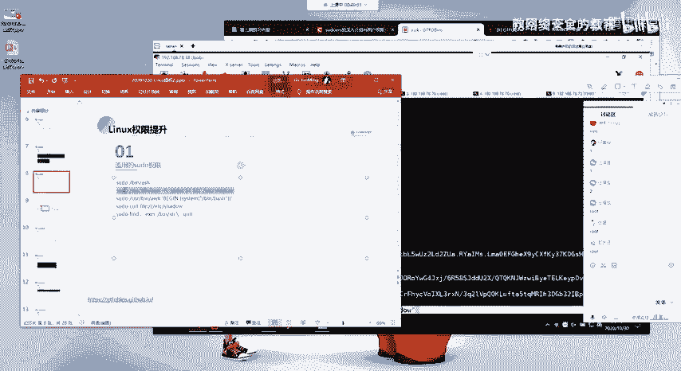

对吧在这边我只出列出了第一列以及第二列，就第一列的话就是用户嘛，对吧？第二列的话就是用户的一个哈希嘛。因为是在需要的是文件当中嘛，是吧？然后我只要第一类以及第二类这个内容。

然后现在这边的话就是他呃列出了这一个需要的文件所有的一个内容。

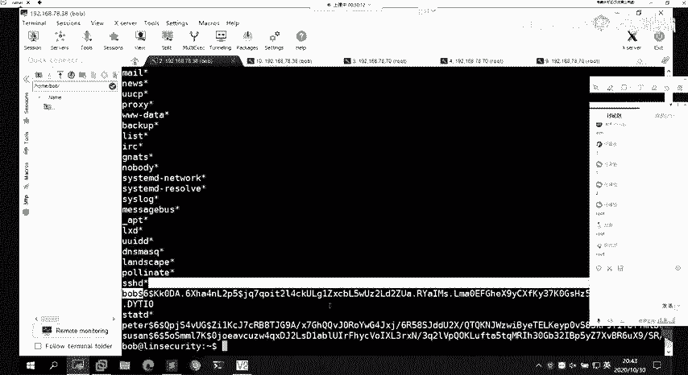

就是呃通过AWK的这样子的一个文件的一个读取。

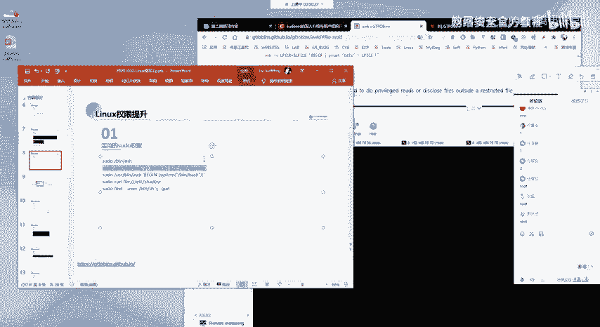

以及还有就是文件的一个写入。这边的话我就不演示了，就是可以看这边是吧。然呃还有的话就是CCURL就CRL的话也是我们采用的暂定的下面。就前面在讲那个文件传输的时候。

我们可以通过CL来去进行一个文件的一个下载，对吧？然呃。同样的CL的话，它也能够去读取本地系统的这样子的一个文件。像比如说来看一下，对吧？首先的话就是一个文件的一个上传。我们可以通过这样子，就CL的话。

有这样子的一个pos的一个方法，对吧？我们可以通过啊这个po的方法来去把我们的一个数据把它给传递到指定的这样子的一个啊UL当中，对吧？就给一个指定的一个网站。以及能够去进一个文件的一个读取。

就读取我们的一个文件。通过干小写的O把呃就是下载的这个文件保存到我们本地指定的一个目录，是吧？还有文件的一个读取。就文件读取的话，在这里话就利用了这一个fire尔协议啊。就我们的这个fire尔协议的话。

就是用来读取我们本地的一个本地文件系统的一个文件的。像比如说呃我们可以通过就是要干。

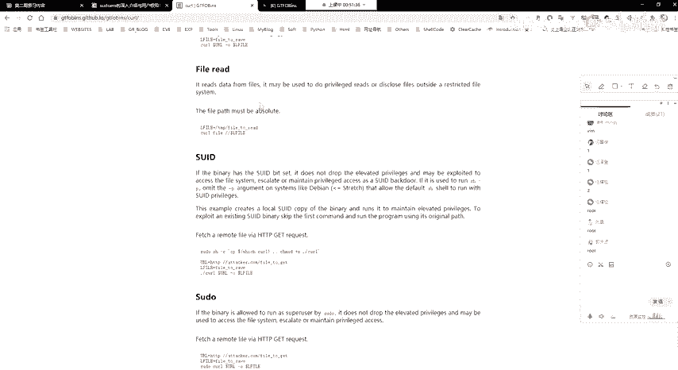

对。就我通过这边的这个发尔协议，能够去读取我本地的这样子的1个ETC passwordword这样子的一个。呃，文件的一个内容。然后的话我尝试读取需要的。然，这电话。可以看到就是不能够去打开这啊。

这边写错了。这的话是打不开这样子的一个文件，对吧？因为在这边的话，它没有权限，是一个普通用户的。然后这的话如果说这个CR我们可以用速度来去进行一个执行的话。我是可以去读取本地的这样子的一个。呃。

这个root用户才能读取的一个文件的。呃，以及最后的就是我们常见的这样子一个 fund的 fund的命令。

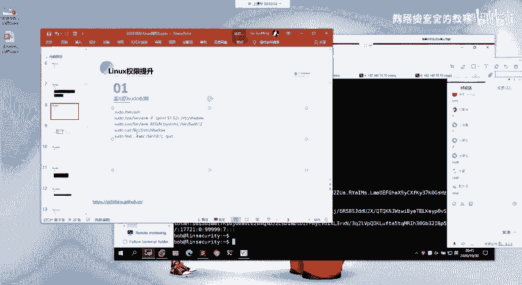

就放等命令的话。我们我们。前面有介绍，我们通过方案的命令能够去查找，就是说它是一个就检锁我们文件系统，我们呃指定的这样子的一些文件的对吧？就是用来去做文件的一个检锁以及查找的这样子的一个命令。

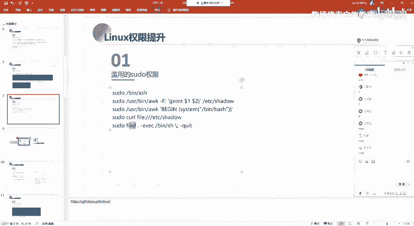

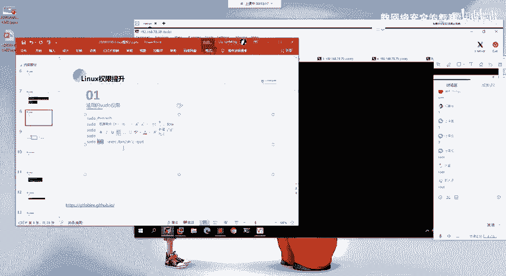

然后在这边的话，我们可以通过这个方案的命令来去进行一个提全。就是主要的话就是利用到它的这个干EX easy。干EXEC来去执行这样子一个命令。就是说他再去找到这样子的一个呃找到这样子的一个。

通过放案的命令去找到我们呃文件系统当中的一个文件的时候，对吧？它会去执行这样子的一个命令，然后的话就会去得到这样子的一个序。我们来看一下。

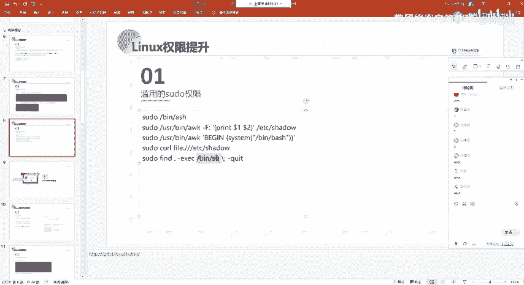

对。我们得到了一个露腿一个权限。然后现在这块主要的话就是用的这个干EXEC的这样子的一个选项。呃，这边的一个命令的一个意思的话，就是我放的嘛，放的点的话就是当前目录嘛，就是我从当前目录开始查找。

然后的话找找的话就是。呃。我当前目录去查找，然后的话找到。然后的话加这一个选项的话，就是他会去执行这边的1个BSH。然后杠Q的话就是找到之后的话，就退出啊，也就是我通过放的话，放的这样子的一个查找。

因为在这边的话，加目录的话是它的一个命令的一个格式。所以的话你需要去加这样子的一个那个。你来查看一下。这一个。这个放展命令的一个选项。

就是。呃，他这边的话。刚刚有是是。啊，我这边不找了，就是。就是在这一个杠杠EXEC这一个选项后面的话，我们可以去接我们的一个命令。就是他查找之后的话，我们可以去执行命令。嗯。

然后的话如果他能够去用收度去进行一个查找的话，那么我就能够去得到这样子的一个漏ot的一个选。以上的话就是呃关于这个收度的这个权限的一个滥用所导致的这样子的一个提全的这样子的一个一些方法。呃。

大家能理解吗？就是第一部分的一个内容。呃，先休息两分钟吧。

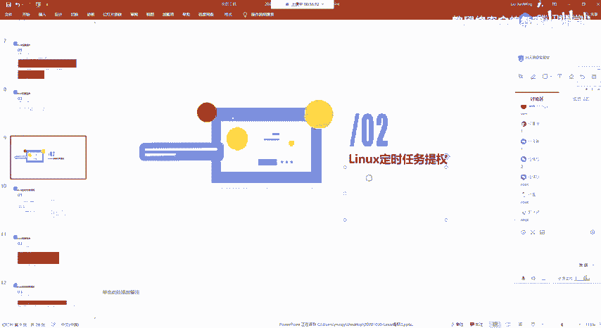

啊，我收的时候的话。Yeah。

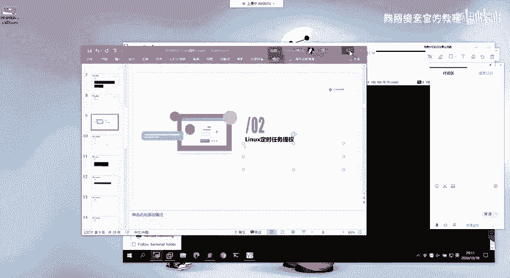

啊，我们继续啊。呃，大家关于第一部分的这个收度乱用权限的一个提全的一些方法，大家能理解吗？理解的在讨论区扣个一。不理了口爱。嗯。嗯。是是是有有有延迟吗？我我怎么感觉是不是有点延迟啊，我这边说完话。

然后大家总是要就是过一会儿才有回应啊。还是没有问题的，是吧？应该讲的。讲的应该挺详细的。然后下面还就是第二部分的一个历的一个定时任务的一个提全。呃，关于这个电池任务的话，就是在讲题权的时候。

我们先来大概的了解一下，就是什么是这个电池任务啊，就linux下面的一个电池任务。就这一个con table那前面在讲信息收集的时候，对吧？也有对这一个定时任务的一个信息的一个收集，对吧？然后呃同样的。

我们想要去。去利用它的这样子一个提群，对吧？我们同样的需要去对这样子一个电视任务去进行一个新型的一个收集嘛啊。哦，那么我们就需要去了解这一个croon table这个电池任务，它所对应的这样子的一些。

像比如说它系统的一个电池任务的一个文件，它是在哪，对吧？以及用户的一个电池任务，它的一个文件在哪？啊，我们需要去在这样子的一些目录下面去查找到对应的一个定时任务的一个配置。

然后这边的一个空table的话，就是linux下面的一个电时网，就是它的一个首护进程。大家理解什么是电时物板。就定损人务的话就相当于就是嗯。相当于就是一个闹钟，对吧？你定你每天早上定一个闹钟，8点钟的。

那么你每天每天早上的8点钟，它就会去它就会响，对吧？那么就是每天他去想的这一个。时间是8点钟对吧？那么我们就可以去设，我们设置闹钟的话，就是需要去设置时间以及设置他呃到了这个时间之后的一个行为，对吧？

也就是呃。也就是闹铃嘛，对吧？或者说设置播放什么样子的一个歌曲，对吧？那么在这边的话，这边的一个c type的一个定时的话，那么我们需要去设置。呃，哪一个时间就是到了这个时间之后的话。

去执行对应的一个命令。对吧就是去执行这对应的一个任务嘛。然后在这边的话要去了解的话，就是这样子的两个目录啊，就系统的一个定时任务是在这样这样子的一个文件当中，我们可以来看一下。

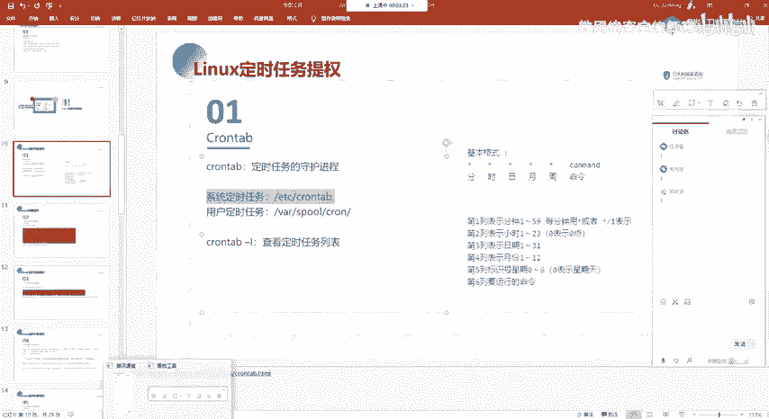

像比如说在这边的话，我们可以通过CATT。来查看一下这个commetable。这个文件对吧？然后这边的话就是我们的一个系统用户的这样子的一一个定时任务。然后在这边的话，我们可以看一下就是。

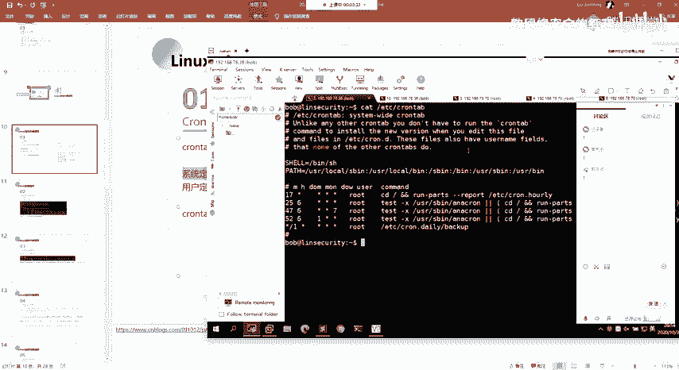

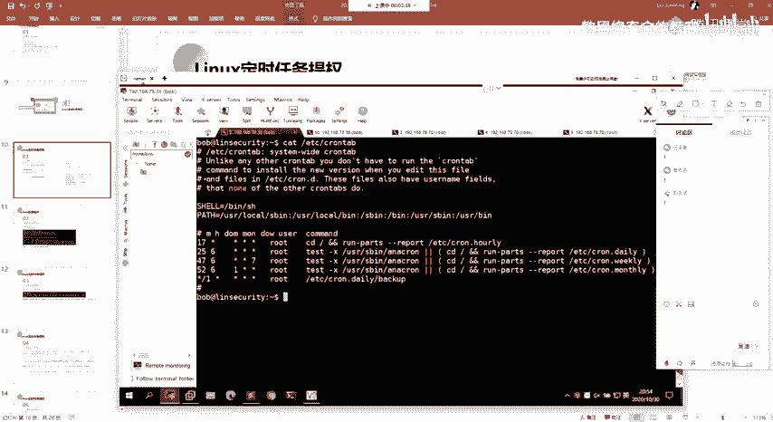

有这样子的一个电磁炉，就这个。看。然后在这边的话，他的这一个电视任务的话，就是像这样子的一个呃这样子的一行啊。然后关于这一行的话，我们来理解一下，就是说他是他这样子，他为什么是这样子写的对吧？

他这样子写的一个作用是什么？

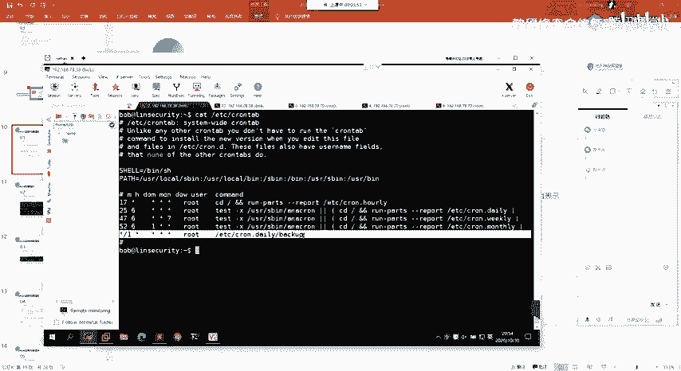

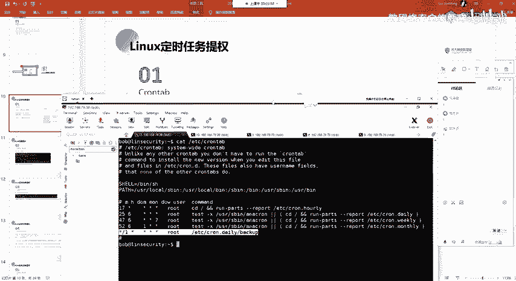

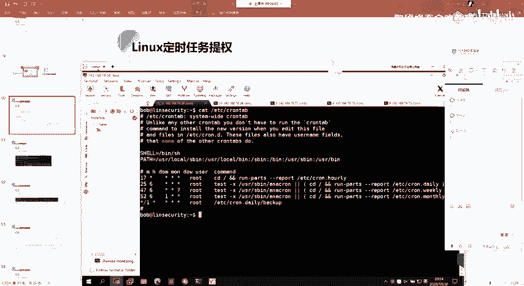

就是大家看一下这边。就这边的一个空空table的这个定时任务，它的一个格式啊是这样子的。就是。我们可以看到。我们可以看到对吧？就在这边的话，它有这样子的一个星号。

这边的这个星号的话就是代表了就是有这样子的123455个星号，就代表了分时日月周，也就是每分钟每小时。或者说几分钟几小时，几天几月几周，对吧？然后common后面的话就是解秘。

然后在这边的话就是呃详细的对吧？就是第一列就是我们知道分钟的话就是1到59分钟嘛，对吧？然后的话每分钟的话可以用心来去表示，或者说用心杠一。这边的干一的话就是表示频率嘛，就是你每隔一分钟。

它会去执行这边的一个命令。如果你这边是二的话，它就是每隔2分钟，对吧？然后还有就是小时日期等等这样子的一些。呃，然后在这边的话，这边实际的一个例址，对吧？我们来看一下。就在这里的话，就是他会每隔一分钟。

然后的话去执行这边的这一个命令。执行这边的这一个目录，下面的这个back up的这个命令，对吧？然后在这边的话有这样子的，中间在这边跟前面。稍微有点差别，对吧？就在这边有这样子一个ro。

这边的这个root的话就是说它会以一个root的一个权限去执行这边的这个命令。也就说这个定时任务的话，它是一个root的一个权限去执行的。啊呃，如果说你想要以其他的一个用户，像。

比如说你想要你想要一个普通的用户去执行这一个程序的，那么你就。可以通过这样这样子一个方法来去做一个设置。

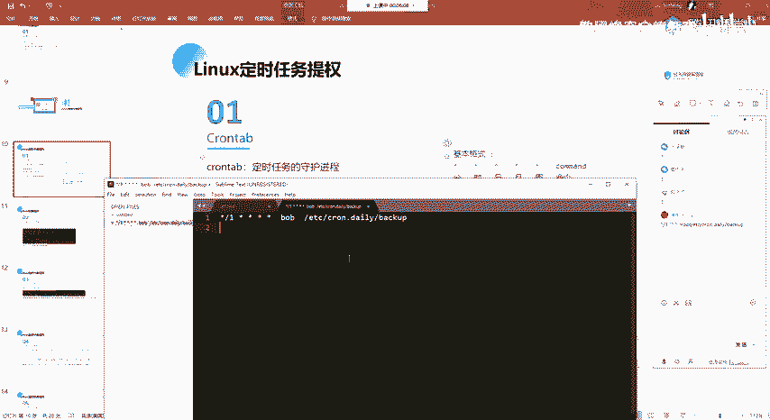

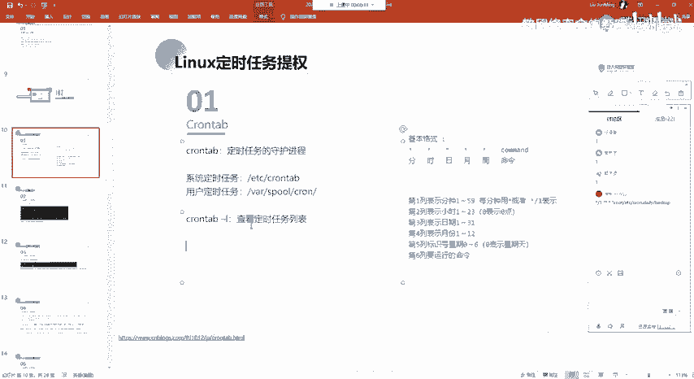

然后还有的话就是用户的一个电池的话，也就是呃我们的。

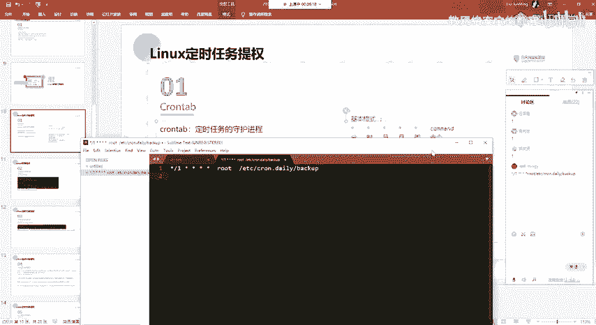

一些普通的用户对吧？

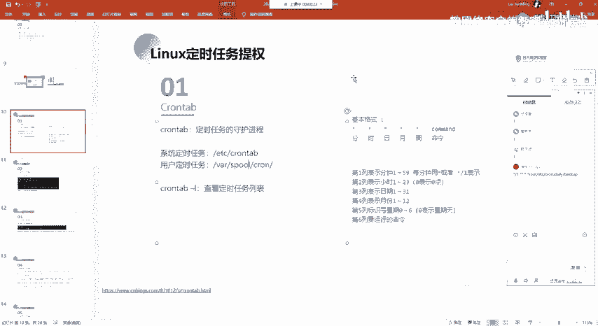

。用户的一个电池活的在这个PTC下面。On table。啊，不是。在这样子的一个木录下面，然后在这个木录下面的话，它会有这样子的一个。我这没去。呃，我这边他没有权限限。就是说在这边的这一个目录下面。

不好看。那个等一下。啊，不好意思啊，有人因为我在家家你这边讲课，刚有人敲门。呃，然后的话就是说在这边啊这一个目录的话就是用户的一个定时的话，也就是他在这一个目录下面的话，如果说你是bob用户。

我这边的一个bob用户。我。有我在bob用户下面有去创建这样子的一个电池任务的话，那么它会在这一个目录下面，它会有一个以bob用户为名的这样子的一个文件夹。然后的话在这一个文件夹下面的话，就是写的。

记录着我们的一个电时的一个任务。然后我们可以通过这样子的一个。从table杠L来去查看当前用户下面的是否有这样子的一个用电池任务。然后我们从这个文件夹这边也看到，他没有这样子的一个boob的是吧？

然后当前的一个bo用户的话，他是没有没有设置电池任务的。

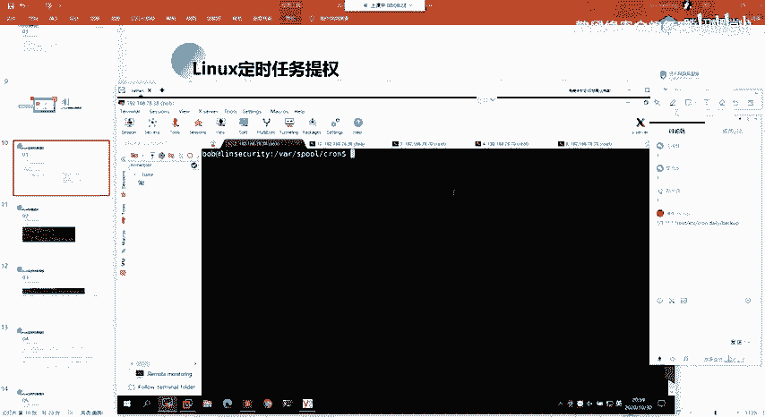

然后的话在这里的话。我们通过在。系统的一个定时任务当中，对吧？这个文件夹的这一个文件当中。有找到了这样子的一个电磁路，对吧？发而且它是一个root的一个用户去执行的一个电磁路，对吧？就这个。

那么我们如何去利用它呢？啊，首先的话我们先要去搞清楚，就是说他执行的这样子的一个定时任务，他是他是干嘛的对吧？

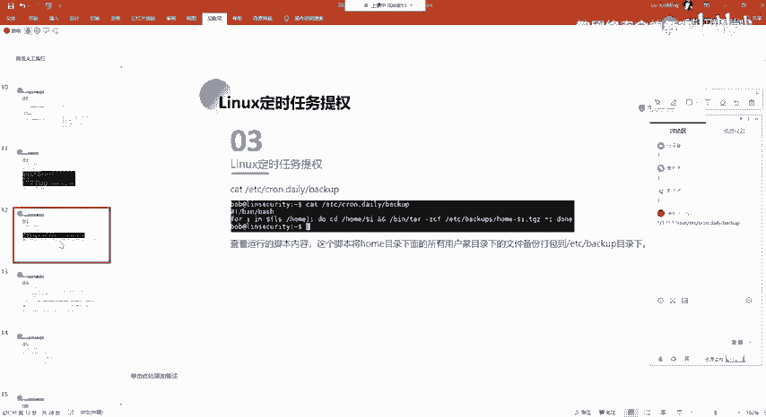

我们可以呃。就是这个。我们可以呃CD到这个目录下面。🤧哼。然后的话他有这样子的一个。嗯。Look up。还有一个这样子的一个back up的这样子的一个呃文件，对吧？然后的话我们可以。

通过cat来查看一下它的一个文件内容，对吧？我们要了了解清楚他执行的这一个程序它是干嘛的，对吧？我们才能够去说有方法，或者说找到方法去尝尝试去利用，对吧？然后在这边的话，我们查看它里面的一个内容。

它是一个这样子的一个拜喜的一个脚本，对吧？然后这是它的一个脚本内容。他这边的一个脚本内容的话，我们来分析一下。

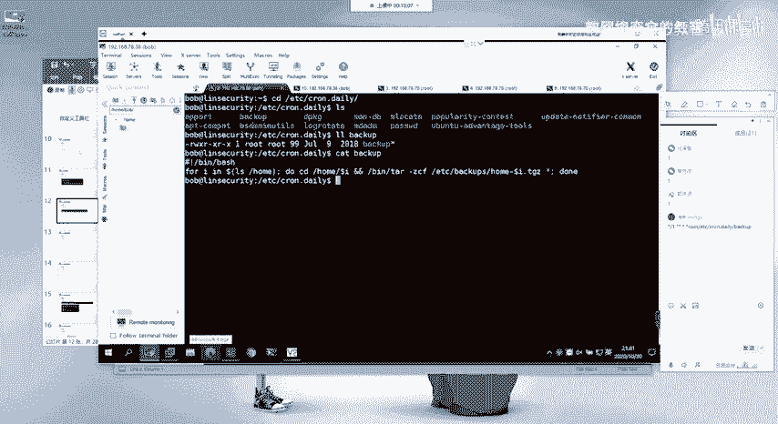

是这样子的对吧？然后这里的话。前面的这部分就是一个for循环嘛，就是forI in对吧？这种的话应该大家。应该都都都理解对吧？大家都是学计算机专业的话，这种的话应该很很好理解，就是一个for循环嘛。

是吧？然后在这边的话，for循环这边音的话，就是说它会呃这里啊这里有一个N的这样子的一个变量。然后这边的话，他括号里面的话是执行的这1个L的这个后干ho，对吧？然后其实这一部分的话。

其实就是呃这边L干ho执行的一个结果，对吧？我们来可。

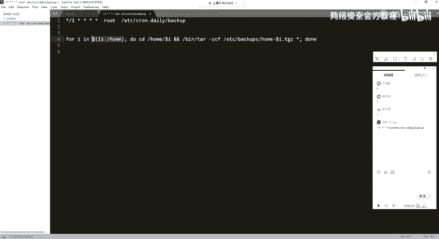

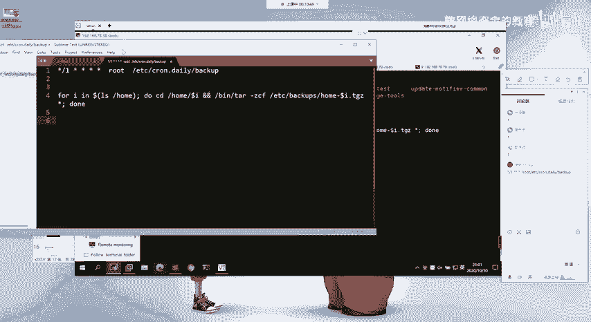

在这边执行一下L杠ho执行之后的一个结果，话就是有这样子的3个，对吧？那么在这边的话就是它会把I这一个变量，对吧？它会把这边执行的这个结果，它会分别的付给I这个值，也就是分别就是bobpe苏。

然后的话I的的话，I的值话就分别等于这三个嘛，对吧？

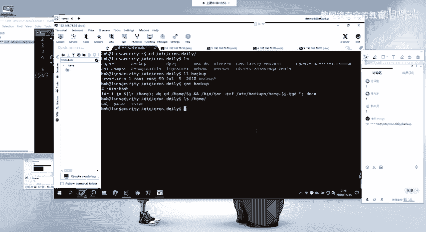

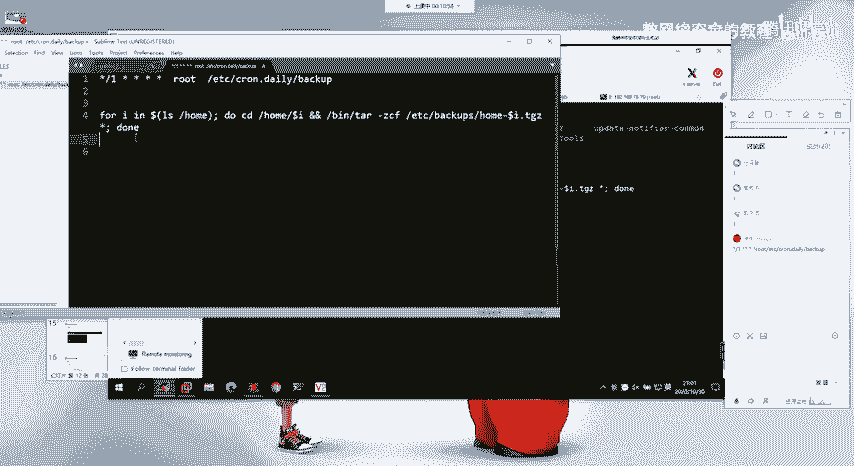

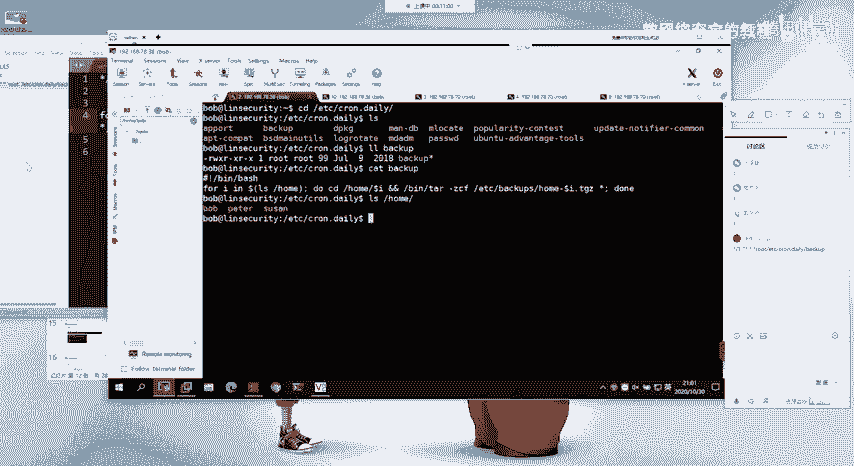

他会付他会付给他，然的话。呃，单就是。它是一个循环嘛，对吧？它会做这样子的，就是当比如说I等于这个bo表的时候，对吧？I等于这个报b的时候，它会对对的话就是CD到这样子的一个干ho，就是把呃多了I。

也就是进入到这样子的。呃，比如说我当前的话是得到的是一个bob。

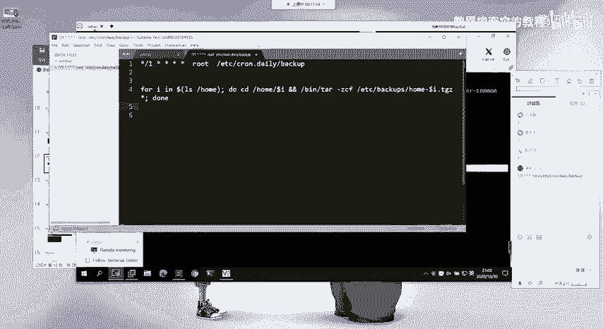

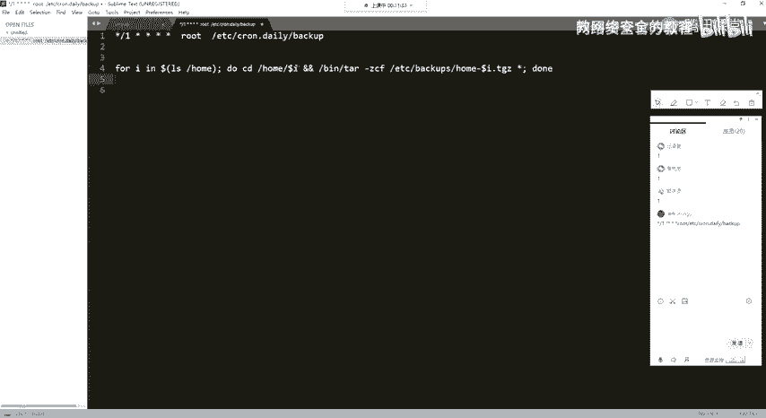

对吧，那么这边I这个边的话就等于爆保嘛，然后在这边的话就执行了CD到这个抱勃这个目录下面，对吧？然后的话执行了这样子的一个命令，就是并差的话，就是在并目录下面找到这个踏程序，对吧？

他的话就是我们的一个压缩的一个程序嘛，解压缩的一个就压缩。啊，我们的这样子的一个压缩包的这样子的一个命令。然后呃在这边话就是。

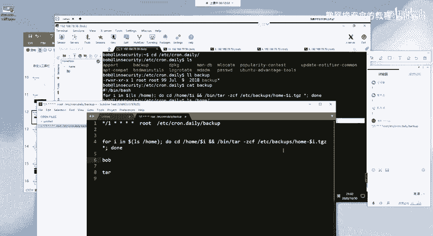

呃，压缩了这样子的一个嗯。这一部分啊对吧？这一部分的话就是说他通过他这个命令把这边当前目录。然后注意的话，这边当前目录是在这里啊，就我们先CD到了这个报表这个目录下面，对吧？

然后CD到这个报表下面目录下面之后的话，这边用了一个通配符星。关于通配服务的话，这边大家大家呃了解吗？就理解嘛。通佩福。嗯。像呃我们这边的一个新，就是我们linuxlinux上面的话。

通常会呃常用的这样子的一个新的一个通配符，对吧？

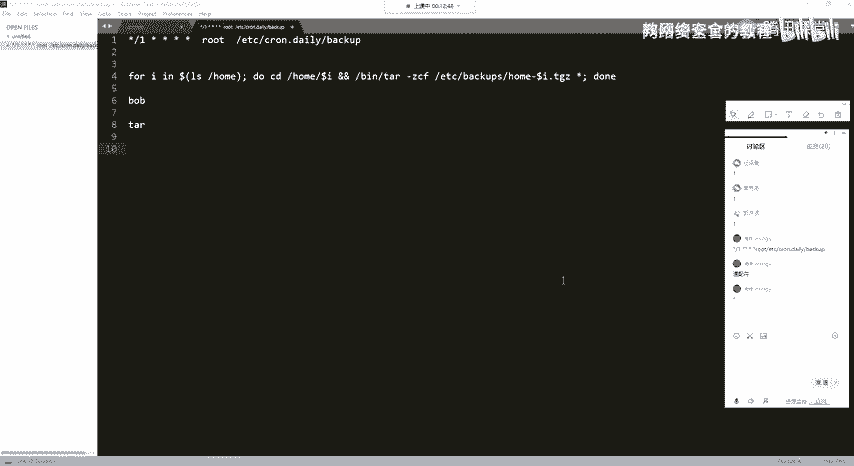

大家了解吗？啊，不了解的话，我这边以一个例子来看一下是吧？就比如说我这边。

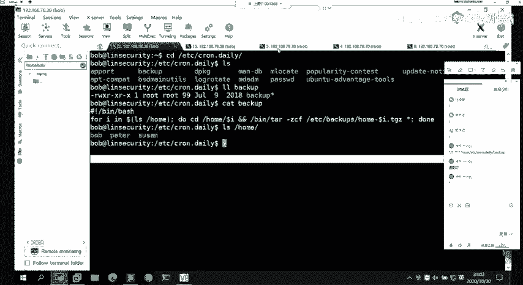

我这边。呃，比如说我这边我这边的话，当前有这么多的一些文件，对吧？有这么多的一些文件。然后的话我想要去把这边所有的这一些文件。呃，或者是说。把这边以VBS结尾的这样子的一些文件，对吧？

以这边以点VBS结尾的这样子的一些文件，把它给copy到这样子的一个呃time目录下面，对吧？那么我的一个命令的话通常是怎样的？对吧？就是CP新嘛，然后点这样子的一个。VDS然后到看盘幕下面。对吧好。

我们可以在这一个探访录下面看一下，就是多了这样子的1个1234这4个VBS的一个文件，对吧？那么这一个命令它是怎么去找到这样子的四个文件呢？就是利用的这样子的一个新的一个通配符务。

这边通配服的一个意思的话，它就是会有这样子的一个就是模糊查询。就是他会去我当前的话，在这个目录对吧？当前这一个目录下面的话有这样子的一些文件。这些文件的话，我这边新点VBS就是新的话。

它首先它会去找到这样子的一个点VBS嘛。嗯。就是以点VBS结尾的这样子的一个文件。然后的话新这边的话，它不管就是不管前面。不管点VBS前面它是什么样子的一个内容。

只要它是以点VBS结尾的这样子的一个文件，那么它都会去执行，它都会copy到这样子的一个探路。然后其实它是这样子的一个过程，就是我这一个通配服务我CP他首先会找这一个文件检锁这个文件。

看它是不是符合我这边的对吧？就是它是以点VB结尾的，它不是对吧？然后找第二个这一个2点VBS，然后它是一个点VBS结尾的。然后前面的这一个它是2，然后这一部分我们不用管，因为它是就是呃模糊查询嘛，对吧？

它不它不是像我们的一个精确的去找到某一个文件，然后它会去一的去进行一个紧锁。然后的话匹配这边以点VBS结尾的这样子一个文件，然后的话它会去分别的去执行copy这一个命令，把它复制到这这一个探幕下面。

现在应该能理解吧，对吧？以及我们以及我们就是我想要copy当前所有目录下面的一个文件，到这一个time目录，对吧？我我的个面就是像这样子嘛，CP新对吧？然后我不可能说我不可能说我一个一个文件的去。

就是我一个一个文件。像比如说CP10点CP，然后到t，然后的话下一个文件的话就是2。VBS这样这样子去copy是吧？这样子的话就是。呃，没有任何效率的一个方法，对吧？我们通常会用这个通配符星。

然后在这边的话，他就会去把当前目下面所有的一个文件，它都会去紧锁。紧锁之后的话，它会去执行一个copy的一个命令。然后的话复制到time幕下面。

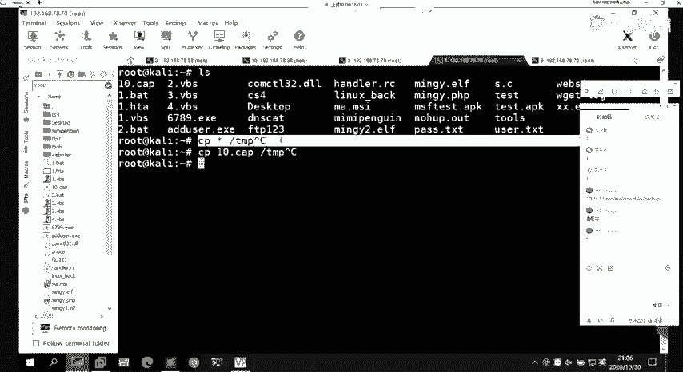

这边这我这样讲的话，应该能理解吧。

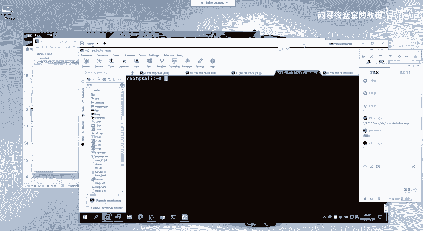

Okay。大家都没有点没有点反馈啊。就就其实。呃，就我我一般的话我会我首先会问大家，就是大家对这一个了解嘛，对吧？就是如果你了解的话，或者说大部分同学都了解的话，我就不会去细讲了，好吧。

如果但是你们不你们不回应我的话，我不知道你们就是有没有了解就。所以的话我这边的话就是。我我可能的话就是。就觉得大家不了解这个东西所以的，所以的话我就会给大家就讲的比较细嘛，对吧？但是如果大家都了解的话。

我就没必要去再讲这个东西了，所以的话还是。我问大家的时候，大家给我一点反馈的吧，就是就。节省一点时间，好吧。然后的话呃，就是这边的话就是这个。

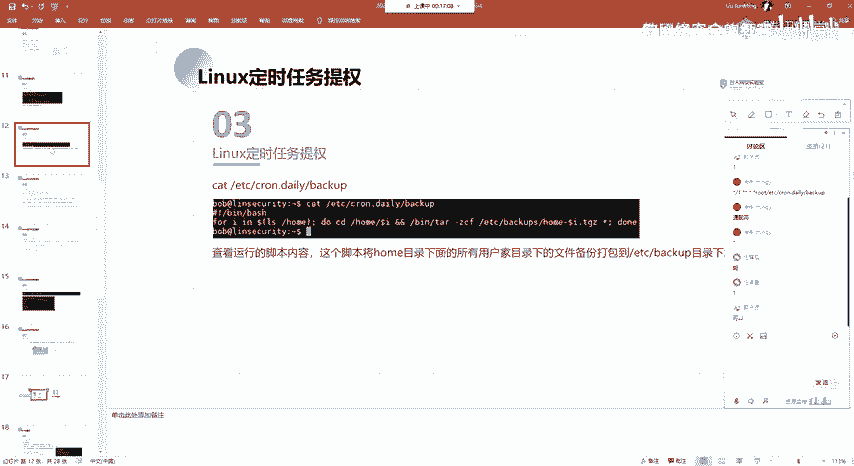

电池任务的一个意思啊，对吧？然后在这边的话，他就是他会去分别的去报本目录，以及在这边。

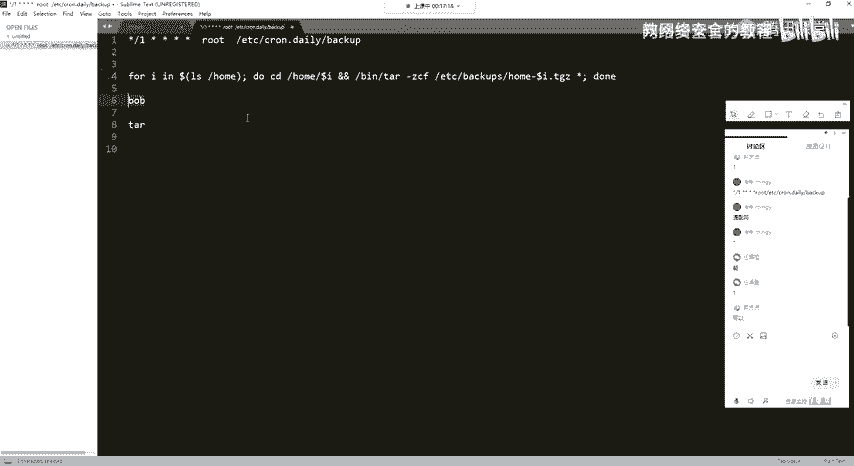

🤧Yeah。有。以及在这边呃批审目录，还有书审目录下面去呃做一个压缩，就是把它目录下面的所有文件都做一个打包，打包到这样子的一个目录下面，对吧？ETC back呃back up这一个目录下面。

然后的话它的一个名字的话就是home干呃，以它的一个呃用户名为名的这样子的一个TGG的一个压缩包，对吧？

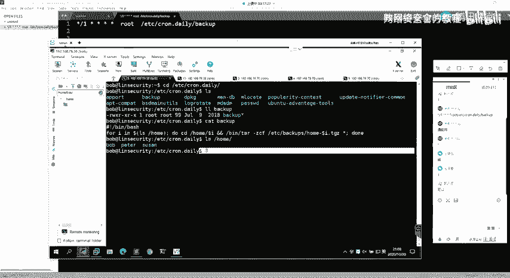

然后其实这里的这个定时任务的一个作用的话，就是他每个一分钟他会去啊这个用户目录下面去把他下面所有的一个文件做一个打包，对吧？像这种的话，应该也是比较常见的一个操作的，对吧？

就是备份你的这样子的一个用户的一个文件嘛。就是你用户文件的话，呃。就是你每你每次的。每次都这样子的一些更改，一些数据的话，他都会去做一个打包。然后的话备份到。哦，字典在目录下面。

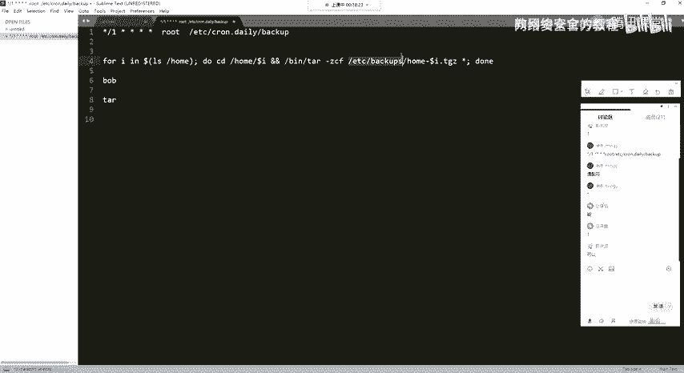

然后这边的话就是它的这一个电时任务的一个作用。那么针对这样子的一个电池的话，我们单从这样子看的话，它其实是没有问题的，对吧？是一个比较正常的很正常的这样子的一个就是呃备份的一个电时任务嘛，对吧？

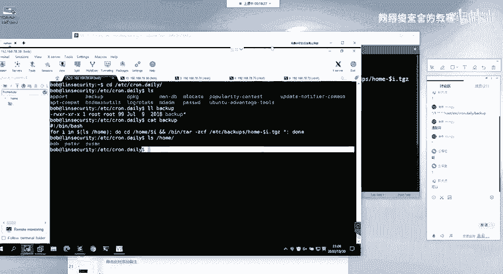

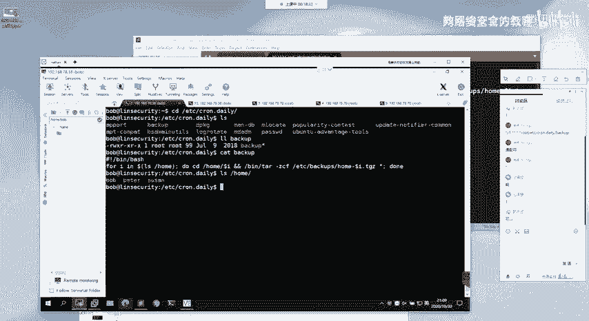

那么他的一个问题它是出在哪呢？就是我们如何去利用它的这样子的一个电池任务来去达到一个提全的目的呢？就是我们下面要讲的。呃，像在这边的话，其实他的一个问题的话就出在于这一个呃新。呃。

这一个新的一个通配符啊，就是我们这个通配符的一个注入。关于这个的话，大家可以去看。看一下这篇文章。嗯。うんふん。😊，就这一个他这篇文章的话呃很详细的介绍了。

就是说lining下面的这一个通配符务的一个注入，以及我们如何去利用它。现在这边的话，他也介绍了这一个他的一个通配符的一个注入方法，就通过这样子的一个定时任务。然后其实他的一个问题的话。

它就是这边的这一个呃新的这一个通配符啊。好，我们可以去注入我们自己的这样子的一个呃命令以及选项。哦呃具体的一个利用方法的话，就是我这边的。这边列出来的这一个。

就这三条命令就能够去达到这样子的一个提全的一个目的。呃，在这话我分别给大家就是。

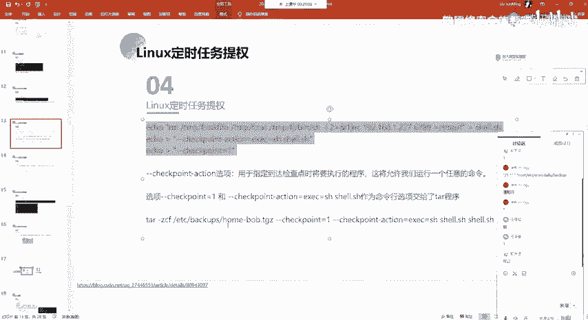

我们分别一起来看一下。我这边命令的一个意思。首先的话就是ele这边的这一个关于这里的话，应该不用我多说了吧，对吧？大家应该都都熟悉了。这边他就是一个法特西尔的这样子的一个呃命令嘛，对吧？

然后的话它是就是NC就是NC没有杠一这一个选项的这样子的一个。呃，这样子的一个方方式对吧？利用的是这个make makeake FIFO的这样子的一个呃。

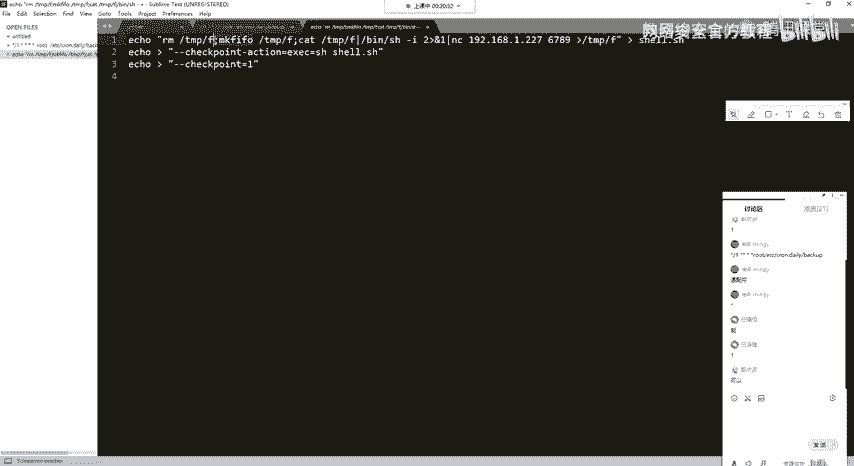

这一个命令。

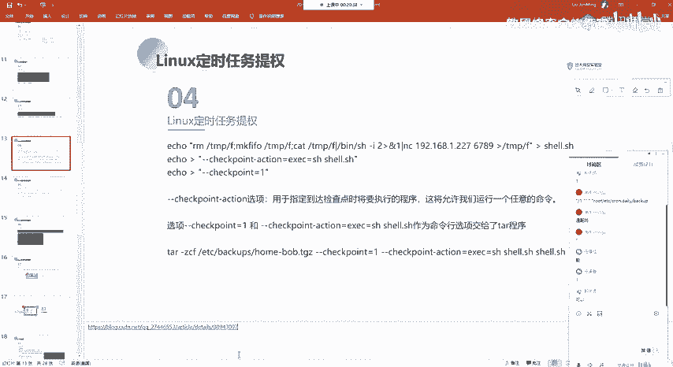

然后呃其实我们在这边的话，NC这边的话，它是有NC这个命令。但是它这个NC这个命令的话，它就有这样子的一个情况，就它没有杠一的这一个选项，对吧？

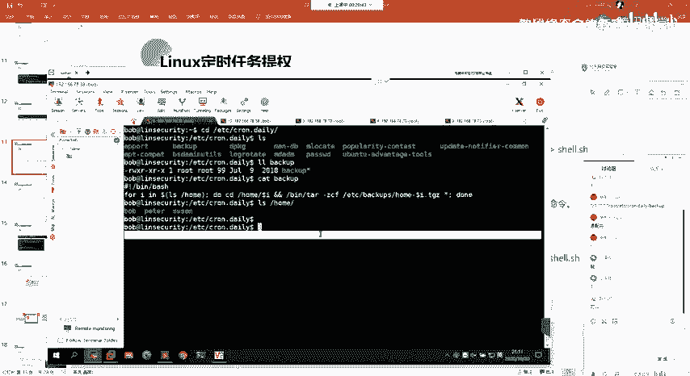

就我们前面的话有介绍就是NC如果有杠一这一个选项的话。那么我们可以直接NC，然后的话直接干一嘛。就是NC到指定的那个。IP端口，然后的话把我们的一个需要环境把它给做一个重电下，对吧？然后在这边的话。

它没有杠一选项的话，就用到我们前面讲的就是没有杠一的这个选项的这样子一个反谈需尔的一个方法。然后这边的话是把它写入到这个需尔点SH的一个需ll呃一个文件当中，对吧？然后的话第二个的话就是acle。

然后的话加了这样子一个输入的一个重电项。然后这边acle前面的话，它没有东西，也就是呃acle为空，也就是它像这一个文件当中，它写了一个空的一个呃内容，对吧？其实就是相当于就是创建了这样子的一个文件。

然后这个文件的话，它里面内容为空。就这两。然后的话呃还有的话就是这个跟上面的话，这边的话是一样的，就是它创创建这样子的两个文件，然后命令的一个执行的一个效果的话，就是像这样子。

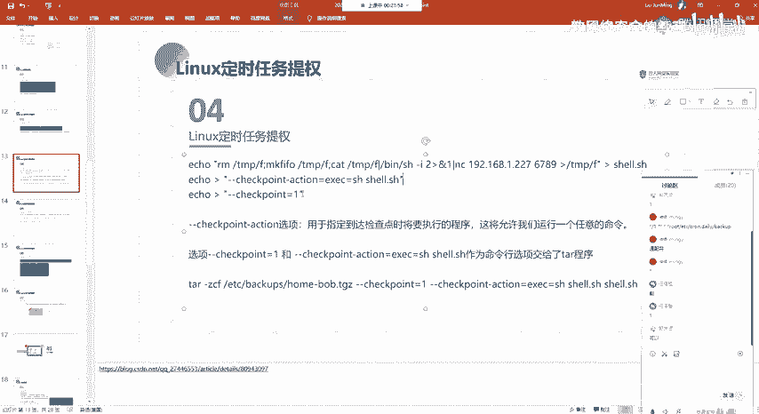

就是。在这里分别的话有创建了这样子的三个文件。首先第一个话就是这一个需需要点SH。这一个然后再这的话我就写入了这样子一个访特西尔的一个呃。命令对吧？然后我这边反差的话是反差到了。这边。然。

其实在这边的话。我这边话其实已经得到了呃，等会的话再重新来给大家看吧。然后呃还有的话就是在这边有创建了这样子的两个文件，对吧？就是。应该是。对。对。呃，在这边的话。

在这边的话是不能通过这样子的一个方法去查看。然后其实在这边的话，你会发现我在这边通过cat这一个命令去查看这一个文件，对吧？他会发现就是它的一个报酬就是unrecized的op。

也就是他没有找到这样子的一个选项。就是说选项是什么意思呢？就我们ca这个命令，对吧？我们看的这一个命令的话，它会有就是。对应的这样子的一些参数选项，对吧？就是呃这边的这些option嘛，对吧？这一些。

然后他在这边的话，我们通过这样子的一个方法cat这一个文件的话，他报的是没有找到这样子一个选项。这一个。然后的话也就是说我这边的话，本来是我要去cat这个文件的对吧？我们看。

对吧我们来看一下这一个它是一个文件的对吧？它是一个文件。本来的话我是要cat就是查看这个文件里面的内容的。但是在这边的话，他把我这边的一个文件的这一个文件名把它作为了一个选项。对吧。

然后呃我这边的话再以另一个例子为例，比如说我在这一个探棚幕下面。🤧我C个探古幕下面啊，我。嗯。我创建一个这样子的一个文件。就是刚刚he对吧。就这边刚刚 half的话，我们可以看一下，就我这边的话。

就这一个吧。然后你会发现有这样子的一个效果。我这边的话创建了这样子的一个文件，对吧？然后就是这个刚刚 help的这个文件。

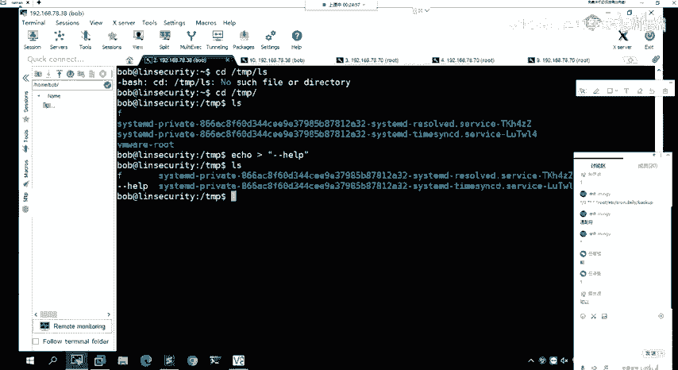

看一下它是一个文件。然后我在这边的话，我想要通过cat来去查来去查看这一个文件的一个内容，对吧？这样应该是。还是不行。然后我通过这样子一个方法cat来去查看这一个文件的一个内容，对吧？然后你会发现的话。

在这边它不是查看的文件内容，而是他把我这一个文件的一个文件名作为了他的一个选项。也就是跟我们前面这边cat刚刚hel的这一个min它是一样的，对吧？然后其实是我的一个目的的话。

他是要去查看当前的这个刚刚help的这个文件。但是他在这边他把我的这一个文件名作为了一个选项。然后的话执行。然后在这边的话，其实也有利用到了这里的这一个。就是我们通过构造这样子的呃一个文件。

然后的话就是主要的话就是利用了它的就我们上上面呃，我刚刚所演示的那样子的一个效果。然后在这边的话，实际的一个。呃，实际的一个利用就是这样子的两个选项。

就是主要的话其就是这个chereckpoint action的这个选项。然后这个选项的话就是它的一个作用是用于指定到了检查点时将要执行的一个程序。然后它将允许我们运行一个任意的一个命令。

其他的我们都不用管，我们只只要知道就是说这一个选项后面的话，我们可以指定我们就是指定我们想要去运行的一个任意的一个命令。那么我们在这边的话，我们就可以构造这样子的一个干杆checkpoint。

然后后面的话我们可以接这样子的一个就是它的一个语法，就是干等于EXEC，然后的话需要需要点SH。然后这边的这个选项的意思的话就是他会去执行我们这边的一个就是通过EXEC的一个方法去执行我们这边的一个呃需尔脚本。

也就是执行我们这边的这个。然后在这边的话，我们是通过创建了这样子的一个文件的一个方法，对吧？那么我们呃它的这样子的一个定时任务，他们是怎么去进行一个。

就是说我们如何去利用它的这个定时任务来去进行一个提全的呢？就是我们来捋一下，就是捋捋一下它的一个定时任务，它再打包我。

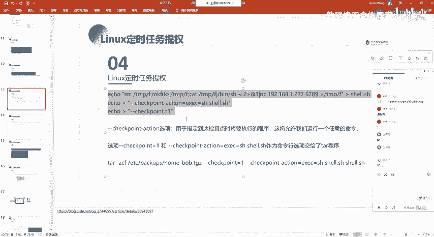

呃，他在做一个打包的这个操作的时候的一个过程。

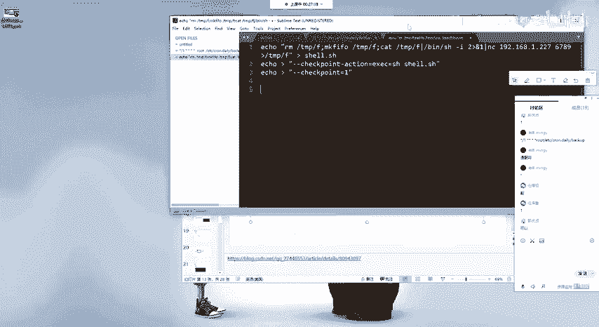

首先的话，我当前的话是在这一个目呃。我当前的话是在这个bob的这个用户目录下面，对吧？因为我当前的话是一个bob用户嘛，所以的话我的一个加目就是home bob嘛，对吧？然后的话我当前是在这个目。

那么它的一个电池任务，它在呃打包的时候，对吧？当这个I。

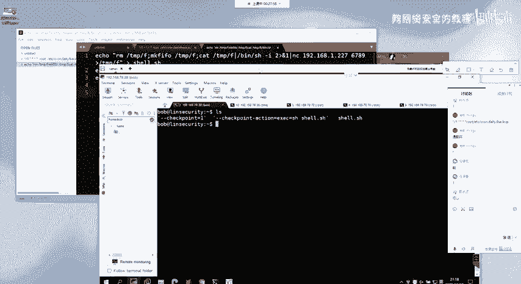

当这边的这个I。等于bob的时候，那么它就会进入到这个bo用户目录下面去打包我当前的所有的一个文件，对吧？然后他执行的一个命令的话，就是t。

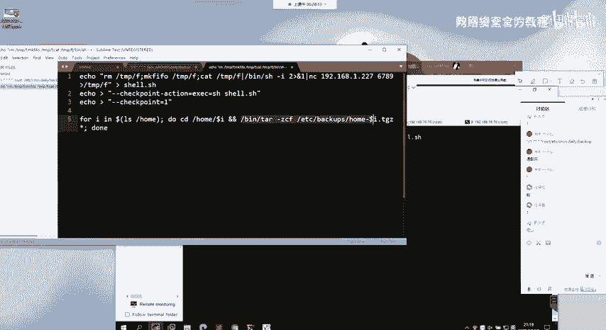

呃，当前新的话就是他其实就是在我当前的这一个目录下面执行了这样子一个命。

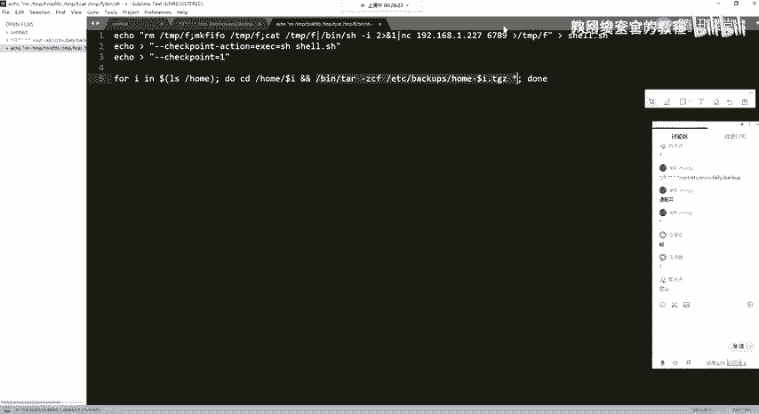

。对吧就是执行了这样子一个命令。然后的话他是把我当前的所有的一个文件，也就是这边的这一些所有的一个文件他。通过time命令做了一个打包，对吧？那么实际的话，在这边新这个通配服的话，我们前面有讲了。

它是会有一个这样子一个模糊的一个紧锁。它会紧锁当前目录下面所有的这样子的一个文件，对吧？那么实际的话，他当去打包这个bob用户的时候，他实际执行的一个命令，它其实是这样子的。

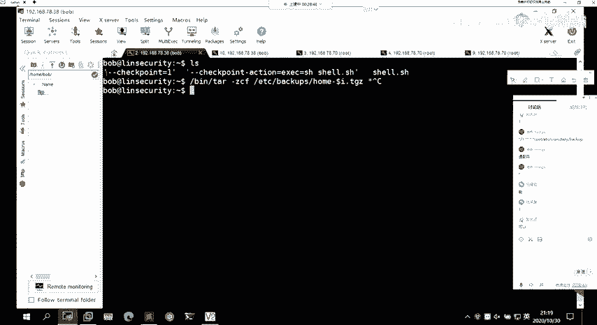

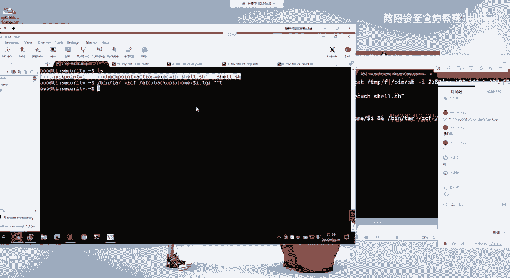

就这边。

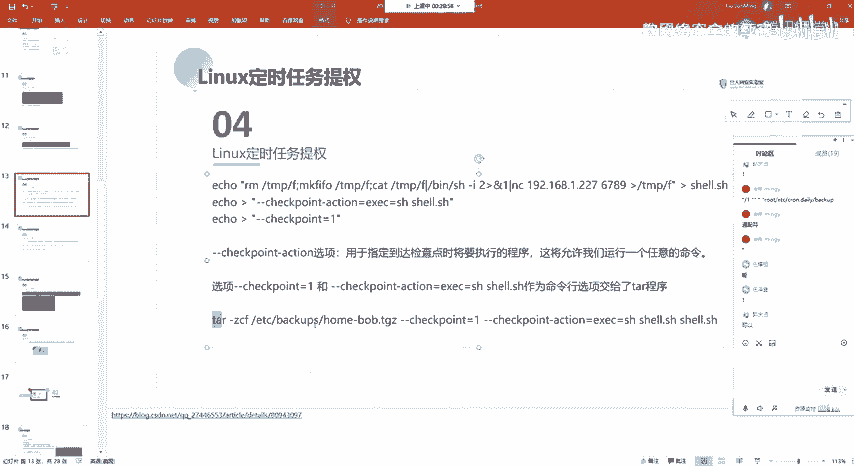

🤧哼。对吧他实际执行的话，就是说我们的一个新的一个通配符的话，它其实就是检锁到了我这边的这一些文件吧，对吧？就是我这边的这一个新的这个通配符，它其实就是检锁到了我当前目的这样子。这三个文件是吧，12。

三这三个文件。当然话如果还有其他文件的话，就一样的嘛，就是往后面加嘛。然的话他检索到这一些文件的话，它会去把我这边所有的文件做一个压缩，对吧？压缩到这个文件当中。那么其实完整的一个命令的话。

就是像这样子。🤧嗯。就是这样子的一个面料，对吧？那么在这边的话。

我们就用到了前面的这样子的一个呃，他的一个特性就是我们。

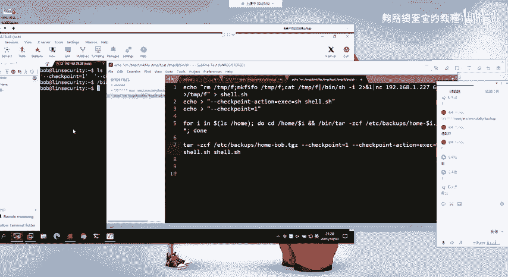

嗯。嗯就我们。嗯，哪里。

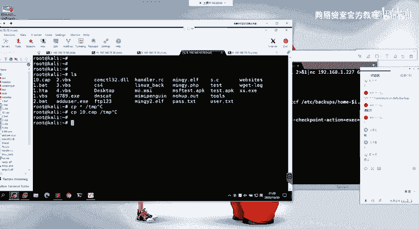

。嗯。对我们的这里啊对吧？我们这边cat这个命令去执行去执行，或者说去查看这一个当前目录下面这个文件的时候，它会把它作为一个选项，对吧？那么在这边也是同样的嘛，就他这一个命令，他把它。压缩到这边。

然后的话它在这边的话，同样的是我们的一个选项。就他要把我们这边的这个文件作为一个选项，以及这边它也是。那么他作为一个选项的话，就是他在这边他会。他当加载到这边，对吧？

他会去执行我们当前目录下面的这个需要点SH的一个文件。也就是执行我们这边一个反贪希尔的这样子的一个这个希尔文件，对吧？那么。在这边他执行这个需文件的话，它的一个效果是什么呢？就是反他一个需嘛。

反他到我们这边的这1个IP对吧？然后的话大家还要注意的一点的话，就是我如果说只是单纯的就是在当前用户下面去执行这一个希尔点文件的话，我虽然反他的一个sure，它是我虽然能反他需，对吧？

但是他得到了一个需，它只是一个当前用户的一个权限，对吧？而不是说我们想要的一个root用户的一个权限，对吧？但是的话他在这边的话就是说它的这个定时任务的话，它是一个root的一个权限去执行的。

就是说它每隔一分钟他会以root一个权限去执行这一个程序。然后这个程序的话，它执行的话，它同样的是一个root用户去打包我们这边的一个文件的对吧？那么他在打包这个文件的时候，他是以root权限去打包的。

也就是说他在执行到这边的时候，它是以一个root的一个权限去执行我这边的一个需2点SH的一个文件的。也就是我它会以root的一个权限去执行我这边的这个命令。以及反谈一个root的一个需要给我们。

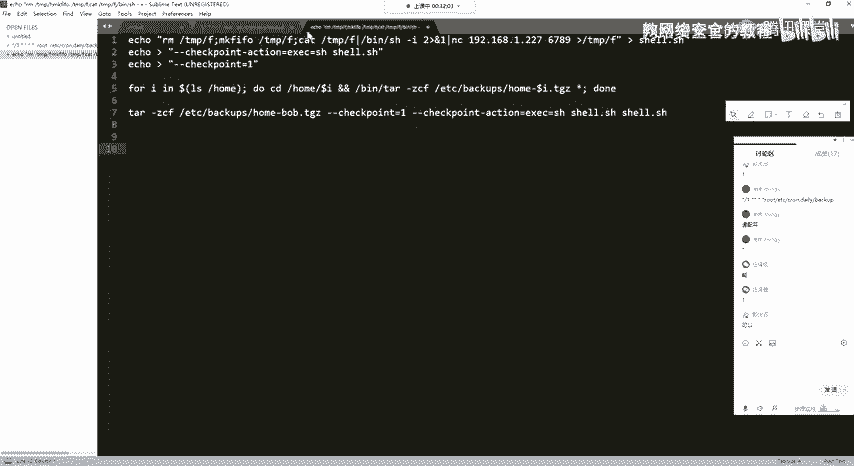

就是像这样子的一个效果。在。大一点。No。然后我当节目的话已经呃已经写好了吧，对吧？然后只需要在这边做一个监听。我这边进行一下我的6789的一个端口，然后的话在这边等他定时任务，就等他一分钟，对吧？

等他一分钟，他会去压缩我我这边目录的一个文件，那么他就会去执行我这边的这样子的一个需点SH的一个效。然后我这边就能够去接收到，需要，这边的话要等一下。

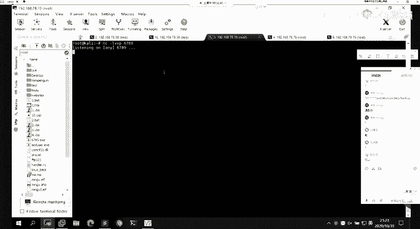

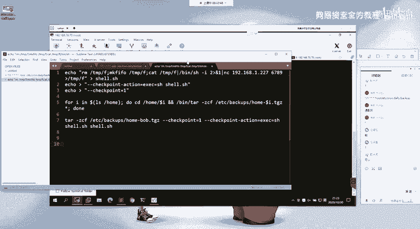

等待时间的话，我们先继续看后面的。

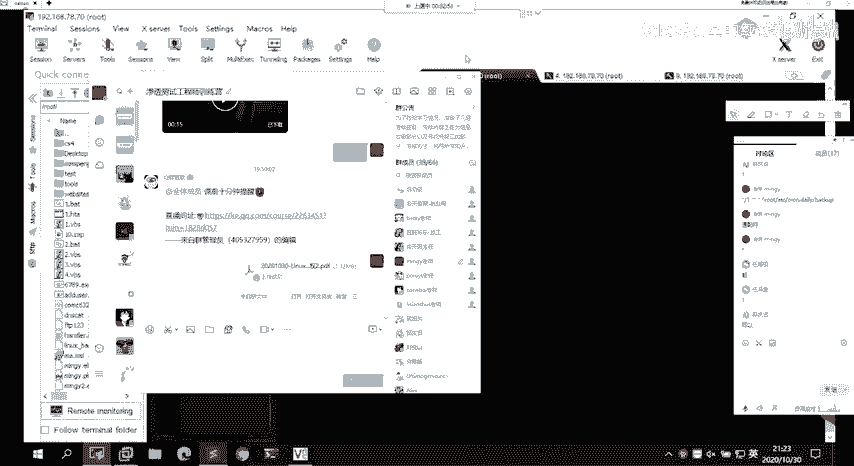

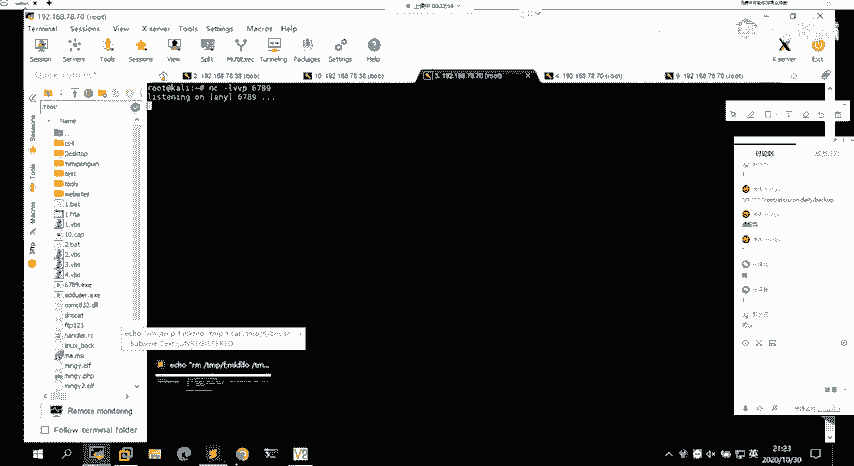

那么呃。在这边的话就是呃我在这边话就是使用的这一种方法，对吧？就是我首先写一个细2点SH。对这样子的一个需尔的一个脚本，对吧？然后的话通过这样子的一个check point这个选项。

然后的话去执行这边的一个需文件啊。然的话同样的我们这边的这个。需要点H取的一个内容啊，对吧？我们前面这边的一个内容的话是反谈一个需要，对吧？我们也可以通过这样子的，就是写一个。

就是说把我们这边的这一个内容把它写入到我们的一个s文件当中。就呃因为我们如果说我们前面的这样子的一个操作的话是正确的对吧？

就是说他能够去得到这样子一个root的一个权限。那么我们在这边的话，他去。

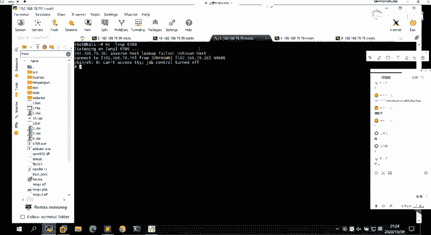

呃，执行我们这边的一个需要点SH的这样子的一个文件的时候，它会以ro权限去执行。也就是他能够去啊ero权限去。

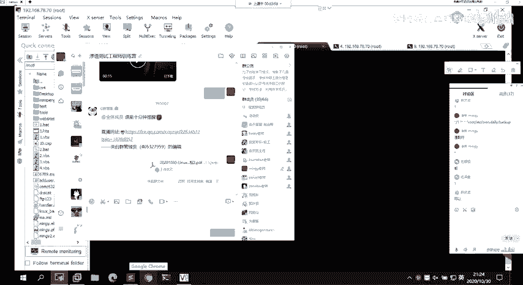

加往这个ss文件当中去加这一部分内容，对吧？这一部分内容的话就是我们前面也讲了，对吧？就它能够以root的一个权限，而且它不需要去输入密码，去执行任意的一个呃所有的一个命令。

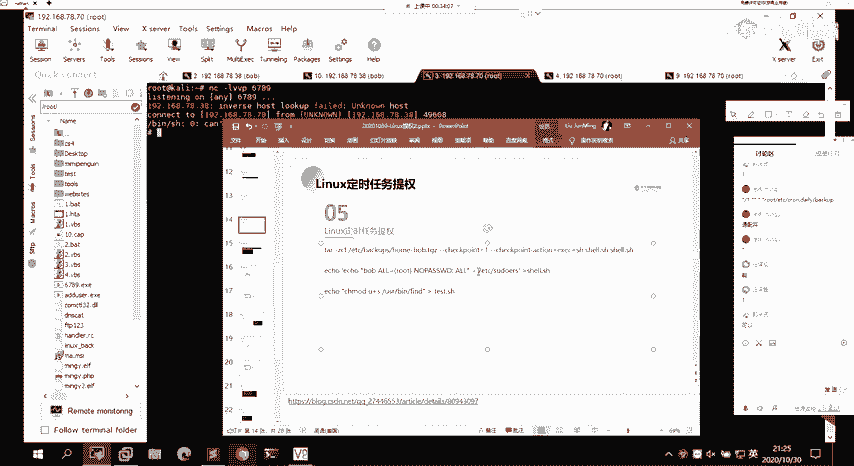

所以的话这边是有空格的，就是而且的话它的这个n sword的话，这边是有一个冒号。这样子的一个格式。也就是说我这边的话加入到这个ss文件的话，我就可以通过ss的这个工具，对吧？

就是在bob用户下面能够以ss这个工具去得到一个root的一个权限。以及还有的话就是通过这边我可以写入这样子的，就是ero的一个权限去执行这样子的一个就是给放的命令加1个SISUID的一个权限，对吧？

然后的话我们就可以通过前面的这边的一个呃。放的。通过前面这边的f以SUID的一个方法来去进行一个得到呃，就这里啊对吧？得到一个root的1个SH的一个需。

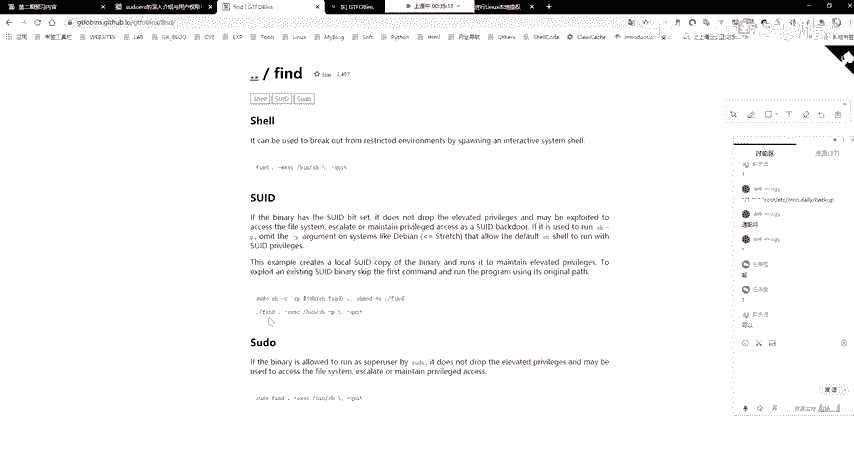

就是呃给大家扩展一下另外的一些思路，对吧？

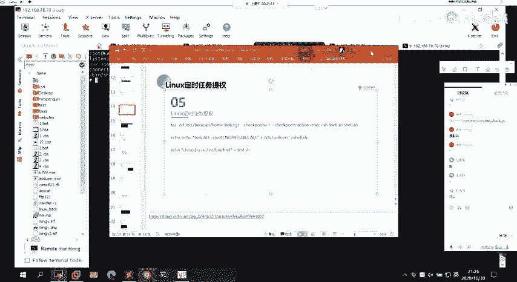

就其实就结合了我们前面所讲的一一个内容，对吧？我们可以通过这样子的一些方法来去呃得到一个root的一个权限。

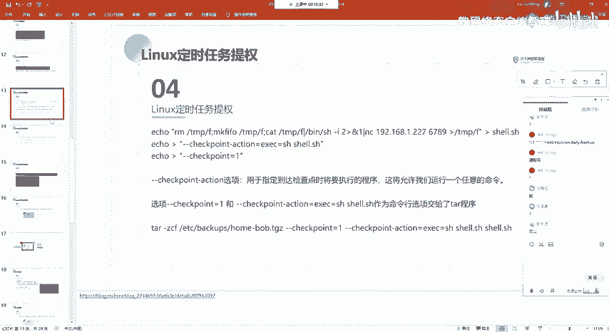

哦，然后的话在这边呃应该就是差不多一分钟了，对吧？在这边话我就得到了这样子的一个接收到了这样子一个呃BSH的一个，对吧？然后他的这个的话，它是来自这边的1个78。38，也就是这边的这个机器。

那么我们在这边的话，我就可以。之前货卖可以看到当前的话是一个root的一个用户。

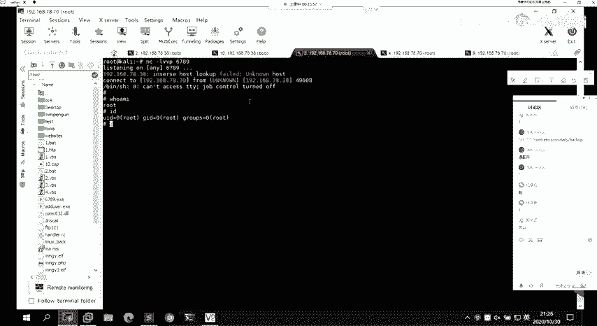

说明的话我我们这边的话是呃成功的达到了一个提全的目的。然后呃，效果的话就是像这样子。最终的一个效果。然呃以及的话就是说关于这个历定时任务提全的有相关的这样子的一个使用。

就是这样子的一个w hub的这一个靶场。大家可以去那个我们的一个实验室上面去做啊。然后大家也有VIP有会员做这些话都是免费的啊。

Okay。

呃呃，建议大家去做一下，就是这这里的one hub的话，它是一个靶场，它是一个实战的一个靶场。然后它这边的话呃，大家可以照着指导书做，也可以自己先尝试自己做是吧？它这里面的话。

它是一个中条性的一个东西啊，就是它。而，涉及到了。就是我们呃渗透测施相关的这样子的一些内容吧，对吧？首先的话就是信息收集端，通过给定的IP端口找对应的服务的一个漏洞。

然后通过相应的这样子一个漏洞来去得到需要。得到需要之后的话，还有相应的一个提群。对吧然后的话结合我们MSF的对应的这样子的一些利用的一个方法，对吧？得到需要之后的话呃，通过提全。

然后在这边的话就是他这边也是通过就是在计划任务当中找到了这样子的一个定时脚本，就定时任务的一个脚本。然后通过这一个脚本，它的一个就是它的一个。呃，功能对吧？

就他通过他这个脚本那个功能来达到了就是提全的一个目的。呃，这边的话内容就涉及到内容话，内容的话还是挺多的呀。就是你通过做这边的这一些实验的话，你也能够去学到很多的一个东西。就综合性的话比较强。Yeah。

好呃，下面的话我们来一起看一下，就是SUID的一个提全。就SUID提全的话，其前面的话也。前面的话已经有有介绍了，对吧？就是SUID的这个权限啊，主要的话就是理解他的这个权限的一个作用。

就我们呃我这边话我就不多说了，因为上节课的话也也介绍了是吧？啊我们如何去利用它的这样子的1个SUID的一个权限呢？就是我们首先需要去找到对应的就是有这种SUID权限的这样子的一个呃可执行的一个文件。

对吧？

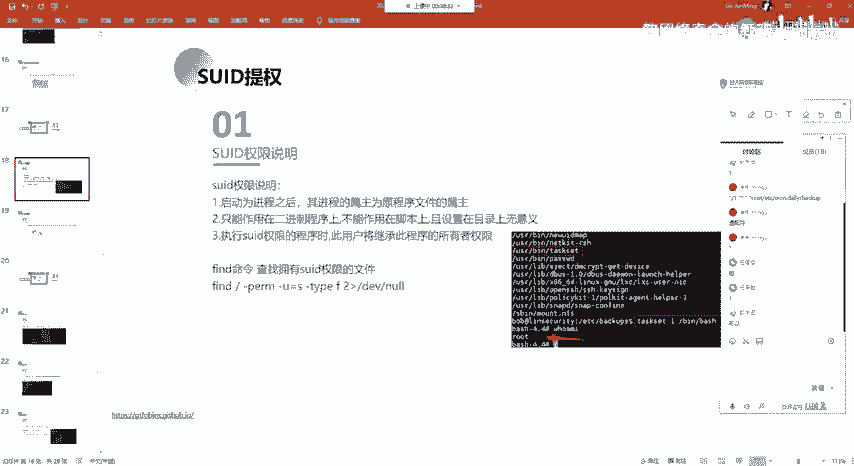

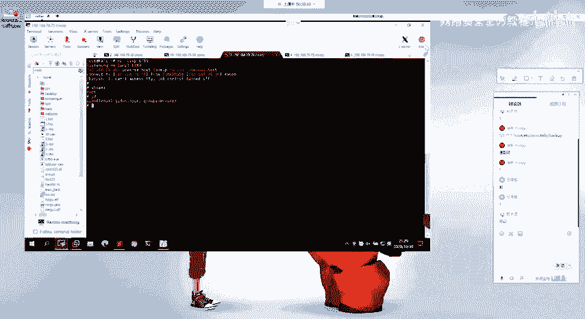

然后我们可以通过通过放的命令，然后的话加这样子个干P。

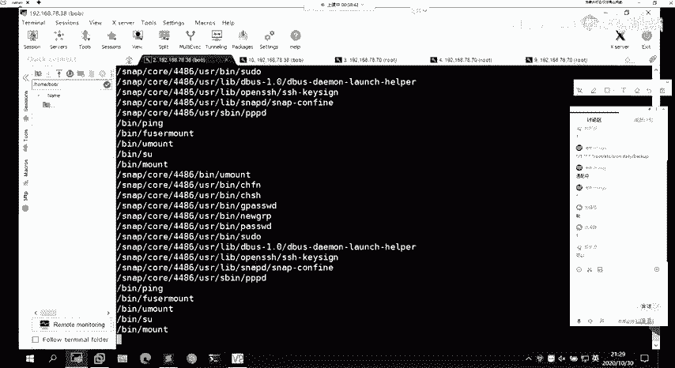

P按PM的这个参数，这个参数后面的话就是接我们就是指定了这样子的一个U嘛。也就是文件的一个所有者，有SUID的一个权限。的这样子的一些文件。然后的话通过这样子的一个方法找到，然后的话列出来对吧？

也就是这边的这一些文件都是有啊。

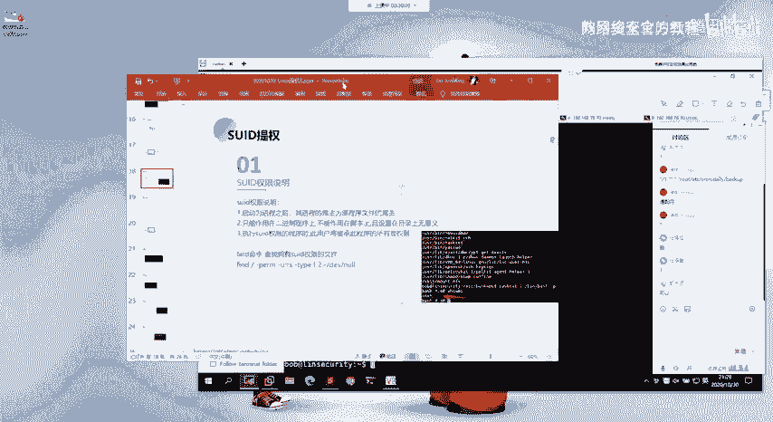

SUID的一个权限的。

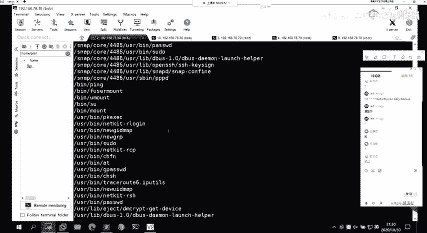

然后在这边的话，就针对这样子的SUAD的这一些文件，对吧？我们如何去利用？

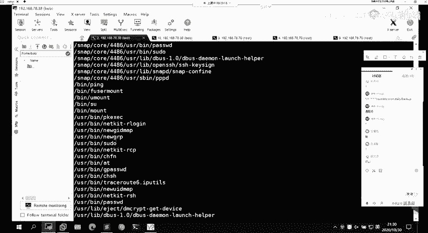

这边的话就又回到了这一个项目嘛，对吧？你一个一个去那个嘛去尝试去呃在这个项目当中去找到对应的一个利用的一个方法。

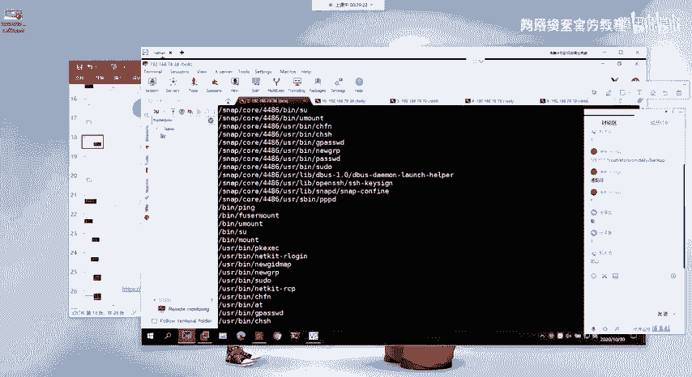

我这边他就是用。

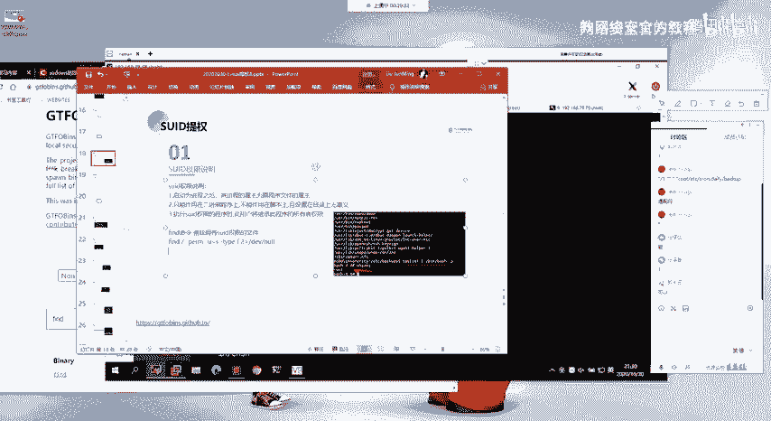

这一个。啊。我这话就是举了以这一个task set这一个为例啊。就是。

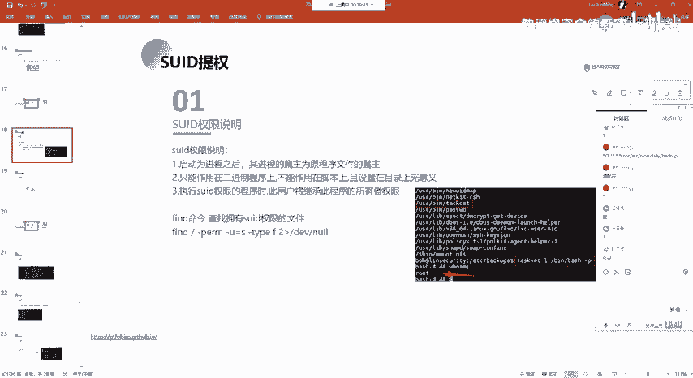

在这边对吧？找到有这样子的一个。好。As aさ。嗯。你怎么没有啊？呃，应该是有的吧。哎，我这边不找了，应该是。

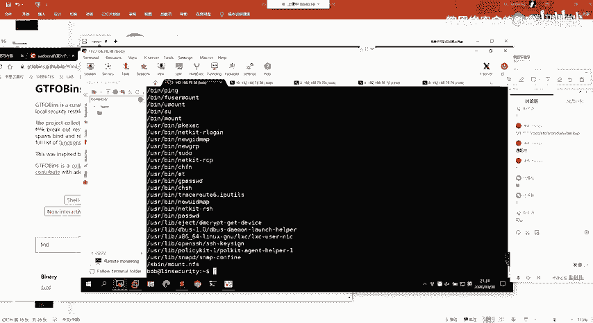

有这个有一个这样子的。Ts effect。就是我们在这边直接搜一下，好吧，就是这一个，然后的话有SUID权限，对吧？那我们可以去怎么去利用，就通过这样子一个方法。

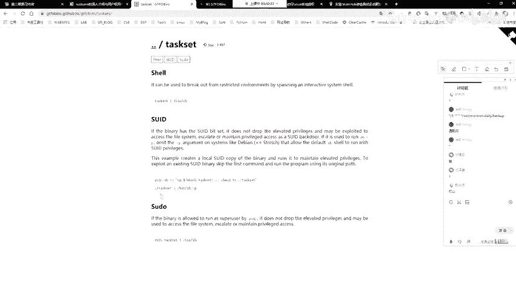

我们在这边试一下吧。

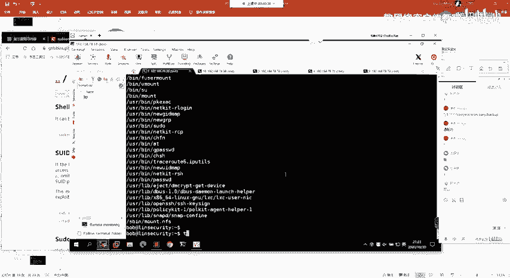

对摄像头对话，是有这样子一个命令的。这边的话应该是哎，我懒得找了。然后的话呃通过这样子的一个方法，就是一然后并SH杠P是吧？E杠。

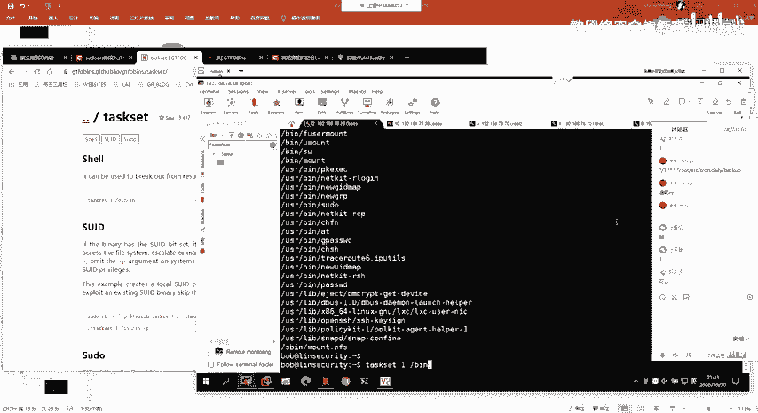

然后再这的话就得到了这样子的一个血。线下换咦。怎么还是爸爸呢？

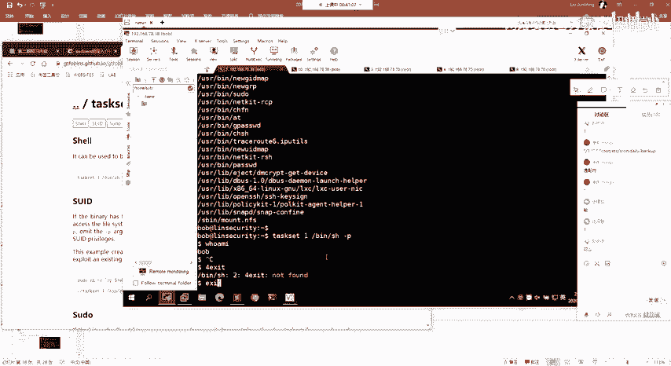

。问一下。😔。

诶。什么关系。

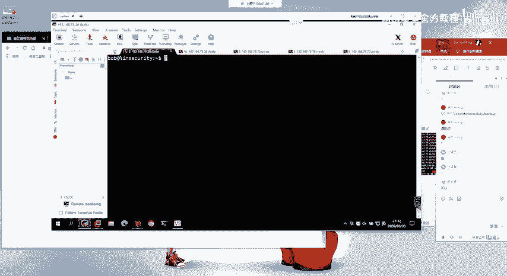

是不是没有SUD的一个权限？没找到吗？

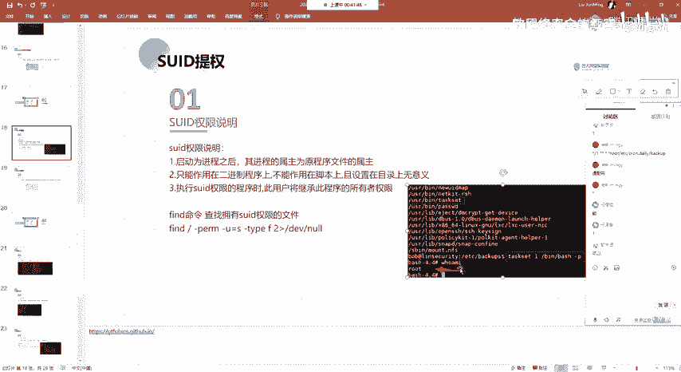

诶。怎么这边他没有。

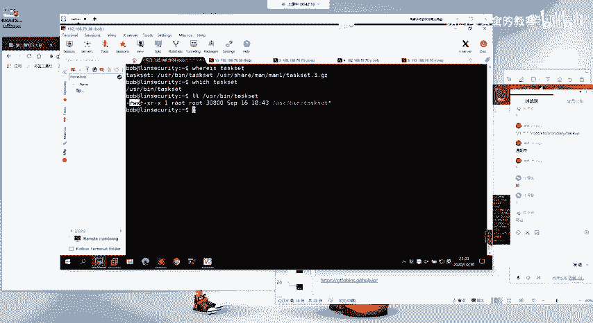

是要就的一个权限呢？你奇怪了。这边的话呃，我这边的截图话是之前的。这边的话是同一个靶场。

呃，我这边给他加一个吧。算了，不加了吧。

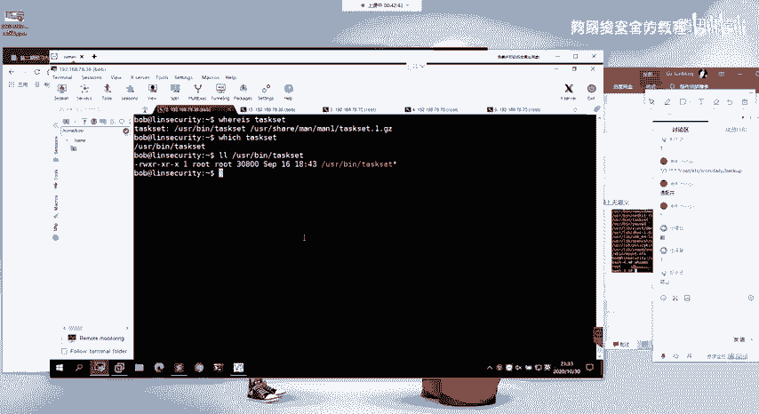

就就这样子的就就这样子。他是如果有SLD权限的话，是可以通过这样子一个方法去得到的。啊，我这边怎么。就没了呢。就是这样子那个呃直接通过这样子一个方法就能够去得到这样子一个root的一个吸。呃。

那个的话大家自己课后再去自己去尝试，好吧，所以我就。我就不做了。然后呃同样的就是这边的话就是。这一个实验同样的也是这一个靶场。就是在马场下面的话，有涉及到这样子那个SUID的一个提群。

然后这个实验就是作为客户作业啊。那呃，第四部分的话就是阿子阿子的话就是我这边话就其他的这样子的一些方法。首先的话第一个话就是这一个隐藏文件，就是隐藏文件的话。

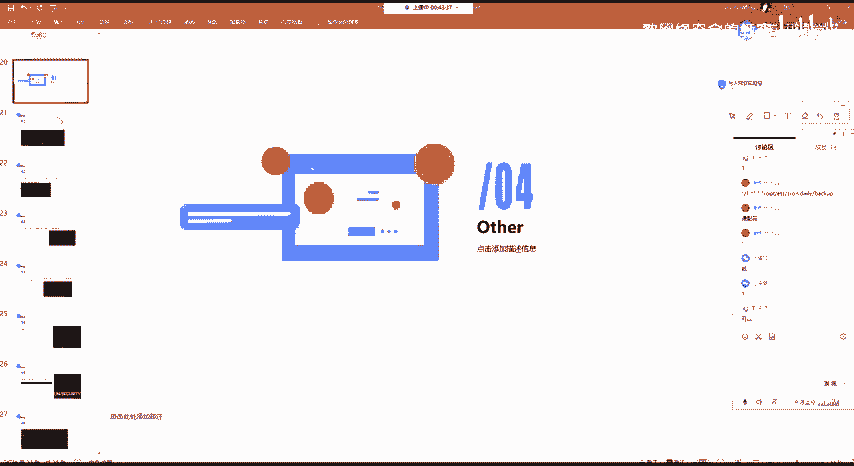

就说我们的一个目标系统下面的话，有一些就说有一些隐藏的一个文件，这些隐藏文件什么呢？就是像比如说我们L的话，查看的话是这样子的一些对吧？那么我L跟LA啊，就是有能够查看到以这种点开头这样这样子一些文件。

就这些文件的话，它是呃就通过LOS。

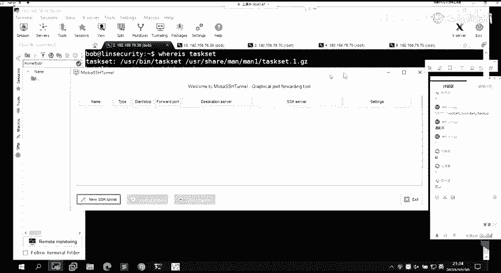

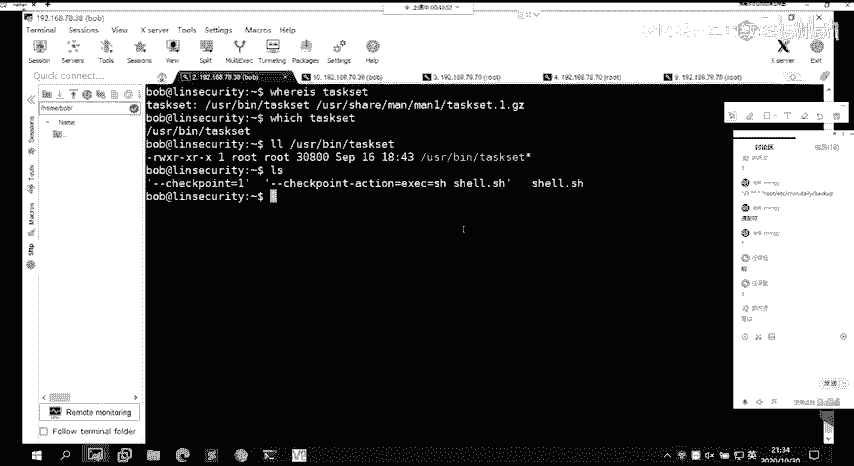

就列出当前的一个目录文件的话是看不到的对吧？那么在这样子一些文件当中的话，我们可能去找到就是说啊一些隐藏的这样子的一些文件，包含有敏感的这样子的一些信息，对吧？我们可以。

通过这样子的一个放und的命令来去做一个紧锁。그。是这样。通过翻律面令。然后这边的话就是。查找这样子的一个就是在home目录下面嘛，就是在home目录下面就包括了就。就是在ho目目录下面。

所有的这样子的一些用户，对吧？然后的话他会去查找，就是呃顶顶心，对吧？就是以点开头的，然后点开头的后面的就是模糊的一个检索就是。不管后面它是什么，就是只要一点开头的这样子的一个文件，我都找到。

我都列出来，对吧？然后的话他是在所有的这样子后目录下面，就是所有的这种用户目录下面去查找的。就在这话就列出来了，有这么的一些文件，对吧？然后呃像RC吧M这一些的话都是我们常见的这样子的一些配置文件。

对吧？我们都知道他是干嘛的。然后主要的话就是我们要去在这一些东西去找到我们就是说可能是用户添加的这样子的一些文件是吧？像比如说这个。就这一个的话，在这边的话，它的一个文件名就是secret对吧？

就秘密的一个意思嘛。然后我们查看这个文件里面的话，它这样子一个支符上，我们猜测是他的一个就是这一个苏审这个用户，对吧？他把他的一个密码的话，他记录在了当前的一个目录下面是吧？记录在这个文件当中，对吧？

我们猜测他是一个用户，我们可以尝试去登录。是。然呃可以看到成功的登录啊，对吧？就我们这样子去尝试，把它作为一个密码去尝试的话是正确的。然后当前的话。我是一个苏神的一个用户。

那么书省这个用户他有什么就是特别的一个地方呢？我们可以来查看一下这个ETC passport word。看一下这个用户，他有什么。嗯。嗯没什么特别。然后呃手地。啊，说什这个用话不行。诶。

这边的话就是说这个用户的话，他不能用收对吧，就是他没有在收的时那个文件当中的。呃，其实就是这样，就是我通过对吧，就查找他的这种隐藏的一个文件。然后的话发现它里面的一个敏感的一个信息嘛，对吧？

然后的话就能够去得到对应的这个用户他的一个权限嘛，对吧？

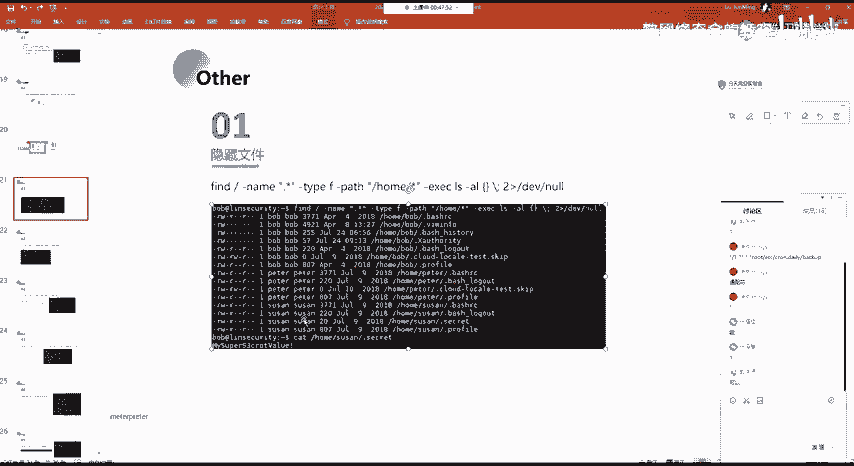

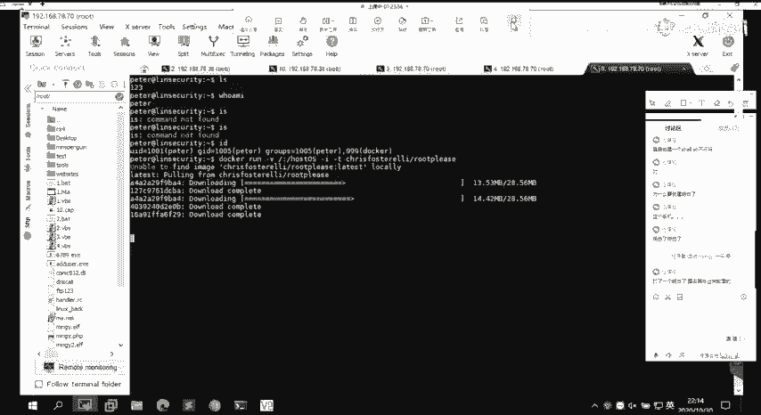

然后第二个的话就是这个NFS的一个低权限访问。呃，这个的话。涉及到的一个东西比较多啊。首先的话就是关于这个NFS啊，就它是什么样子的一个东西，就是一个网络文件系统。

它可以允许网络中的计算机通过TCVIP网络共享资源，就一个文件共享嘛，对吧？然后的话我们可以通过就是搭建这样子1个NFS的一个文件系统来去共享我们的一个文件。然后的话在这边的话，我们首先对吧。

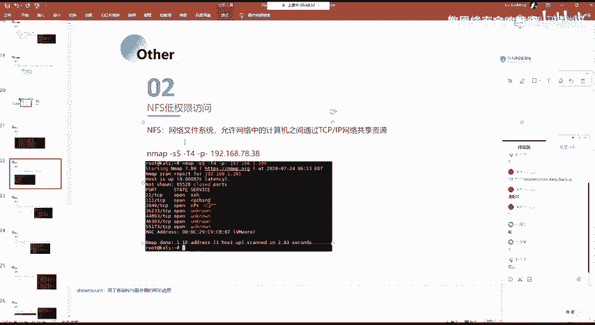

我们可以通过这样子一个方法，就对吧我们从哪里去知道他是不是开启了这样子的一个服务呢，对吧？嗯。这边就。给个机前。就这一个机器。啊，这个。

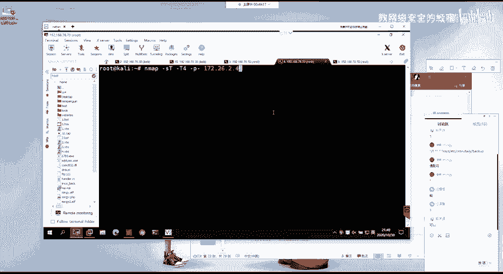

呃，我在这边的话，我在这个呃看你机器上面啊。首先的话我们要去就是说我们如我们是通过什么样的方法去发现呢它是它是有这样子的1个IIFS的1个服务的呢，对吧？

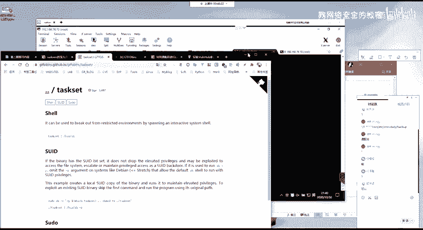

那么肯定的话就是通过我们前面的一个信息的一个收集嘛，对吧？就是。

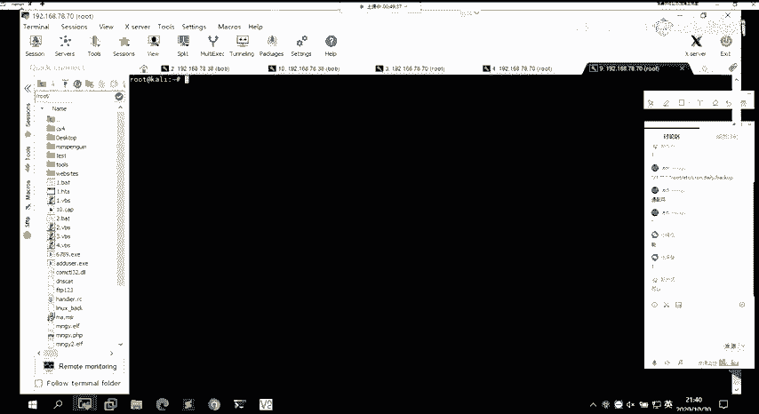

我们的一个通过这样子的一个端口的一个扫描。

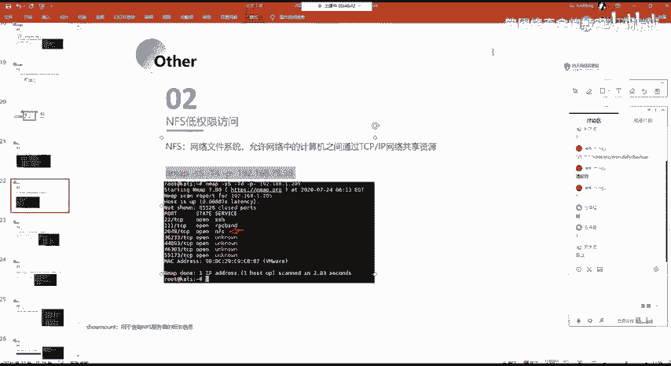

首以先话我们通过Mm啊，我们通过M map去，就我们首首先得到这个目标，对吧？我们肯定也会去对它的一个呃IP做一个这样子一个端口的一个探测，对吧？就看探测它开放了一些端口及对应的一个服务，对吧？

然后在这边话就有这样的1个NFS的一个服务开启了，对吧？它的一个端口的话是这1个2049TCP的一个端口。然后这个NFS服务开放了，对吧？那么我们通过可以通过什么样的一个方法来去呃获取到它的一个信息呢？

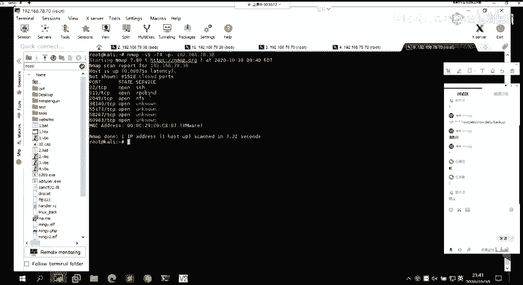

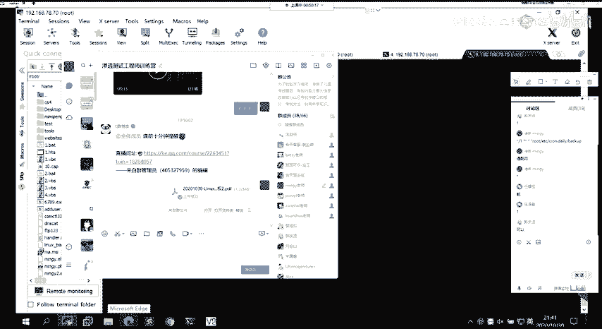

就是通过这个smount这个命令，我们可以通过smount来去查看到这个NFS服务的一个信息。

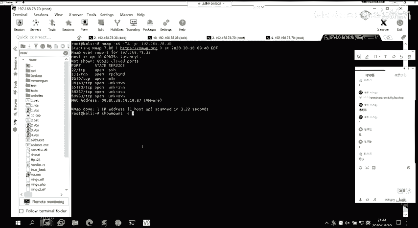

就是。嗯。通过这样子一个命令杠一加我们的这样子的一个这个NFS呃。服务所在的1个IP。

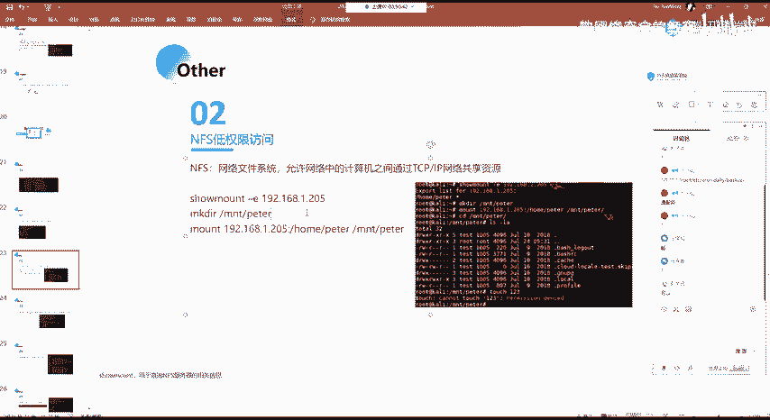

然后它是用于这一个面料，它是用于查询NFNFS服务器相关的一个信息啊。我们在这边在这边上通过修mount来查看这一个我们的一个目标。七八点。三八。对吧，来去获取到这一个远程的这个机器。

它的关于NFS的一个相关的一个信息。然后在这边的话，它就有列出了这样子的一个这样子的一个目录啊。就列出来这个目录，它是什么意思呢？就是说呃它的这个NFS服务的话，它有就是有共享的这样子的一个目录。

这个目录的话是这个homepe的这个目录。然后的话他把这一个目录的话，它共享出来了，是通过这个NFS的这个呃服务啊。那么那么他这一个目录共享出来了，对吧？那么我们其他的这样子的一些机器，对吧？因为我们。

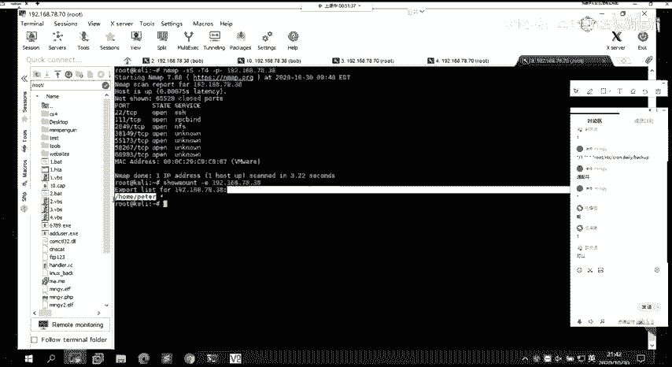

这1个NFS的这个呃网络文件系统的一个作用的话，就是允许网络中的一个计算机来去进行一个资源的一个共享，对吧？那么它共享出来了，我的一个在这个网络当中的一个机器，我就能够去访问到它的这样子的一个目录。

对吧？那么我们怎么去访问呢？

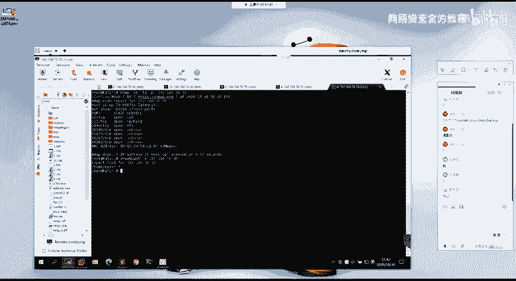

访问这一个目录的话，我们需要去用mountt这样子的一个面料来去做一个挂载，就是把我们的这样子的一个。

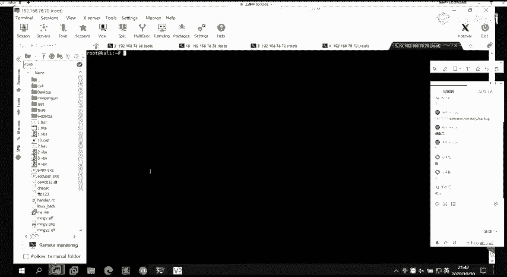

呃，把远程计算机的这样子这个它共享的这样子一个目录，把它挂载到我们的一个本地。就呃大家可以理解成就是我们前面在讲windows的时候，对吧？那个用net钥匙来去映射磁盘，对吧？

就我把远程的这样子的一个共享的这样子的一个目录，对吧？把它映射到我本地的某一个磁盘。然后在历史里面的话。在另个层面的话，就是通过这个漫腾面料。就是呃如果大家经常玩硬时的话，应该应该比较熟吧。

就这个命令像比如。呃，我以我这边的。不气吧你。可。

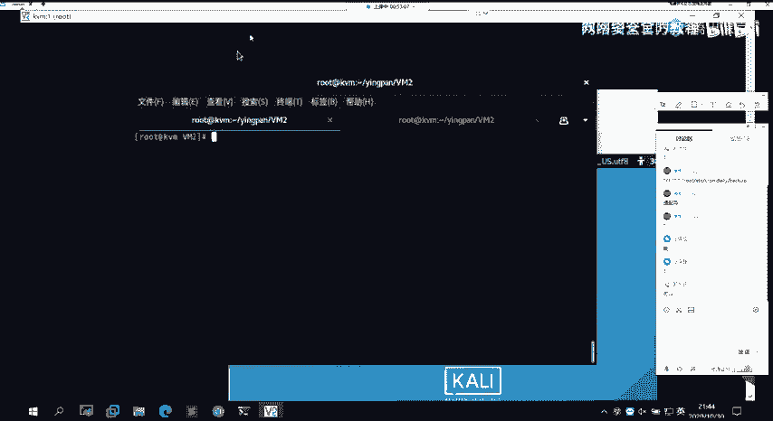

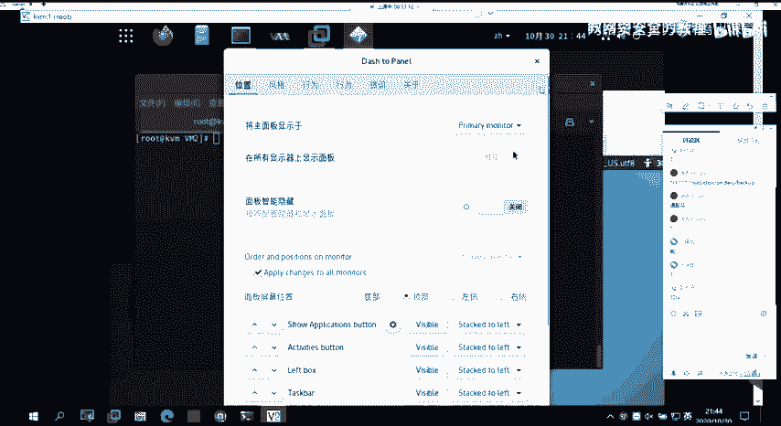

比如说我这边的这我这边的这个服务器。我哋通过。

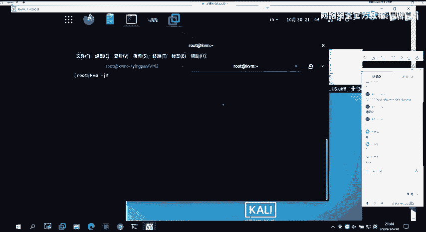

慢子。哦可以通过漫来去查看到我当前的这个机器，它所挂载的这样子一些目录。然后其实在这边的话。就比如说你要去把你的一个硬盘，对吧？把你的硬盘，你要去把它呃插到你的这个呃服务器上面去。

你插到服务器上面去之后的话，它不会说像windows下面它会自动的去加载，对吧？像比如说它会自动的去加载。加载到我们的这样子一个文件系统当中啊，其实会啊会的。

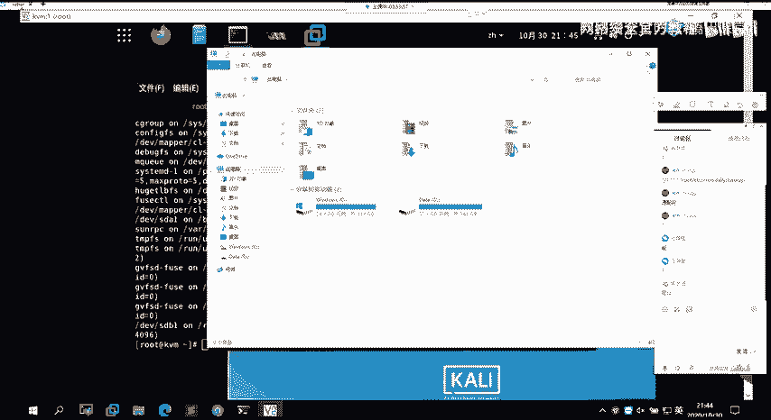

其实会的，就是说你插入进去啊，它就会去加载到呃你的一个磁盘。你的一个目录下面。然后在这边的话。就是大家可以看到，我这边的话是我这一个服务器的话是有。插了我的一个硬盘。

然后的话它的一个硬盘的一个目录的话就是在这边。就DB的SDB就大家就是。应该理解吧，就是linkinux下面的话，一切接文件，就是就像这种硬盘，对吧？像这种硬盘，它同样的。

它是你插不到linkinux系统下面的话，它同样的是把它作为一个文件。作为一个文件或者文件夹的一个形式。那么他这句话，他就是在这一个文件文件下面，对吧？那么。我们想要去把它放到本地去进行一个访问的话。

我们需要去做一个挂载，也就是通过这样子的一个命令。没有啊。我这边。就这样，我是通过这样子的一个。办法把它挂载了。就是你插入到你把硬盘插进去之后，的话，他会分配这样子一个呃，他会有这样子的一个呃目录。

对吧？然后的话你要去你要去在本地去访问的话，你是需要去把它挂载的，挂载到我们本地的某一个目录下面。然后它其实它也会自动的去挂载到一个目录当中。但那个目录的话比较长。我一般我一般的话先把它给就是。

会自己自己新建一个这样子的一个目录。像比如说我在ro层幕下面建一个这样子的一个硬盘的一个目录，对吧？然后把这一个把硬盘挂折到这一个目录下面，然后我去访问的话，就不用输那么长的一个路径嘛，对吧？

然后挂载一个方法就是像这样子。然后因为呃硬盘上是NTFS的这样子一个格式，linux下面的话，它不是呃不是像NT像windows下面的那个格式。所以的话我们需要用这样的一个方法去把它转一下。

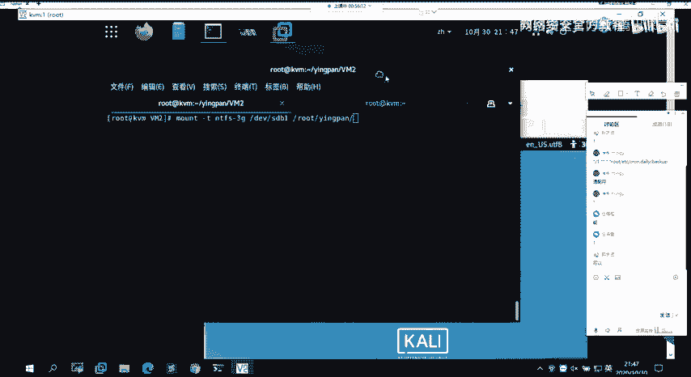

呃，好像扯远了呀。

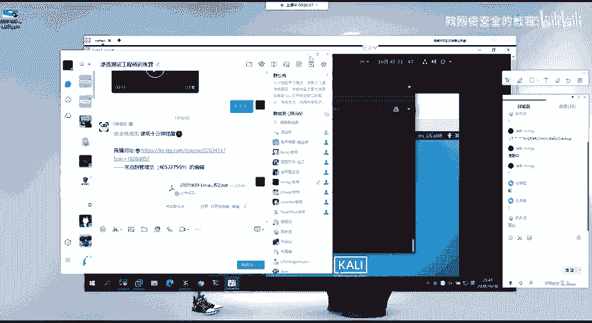

就其实就是当大家理解就是。同理的话就是说在这边它是一个远程的这样子一个目录，对吧？那么我我们要去访问远程目录的。下面的一个文件，我们同样的可以通过这样子一个mountt命令去把它挂载到我们本地。

然后的话去进行个访问。

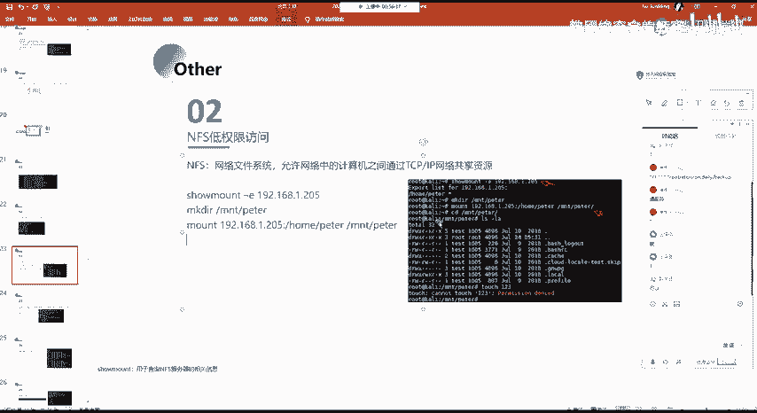

就前面说这些的话，其实就是让大家理解这个。🤧呃，那么的话那么。我现在这边的话，我知道了有他的共享的一个目录是这个P层目录段。那么我现在我要把它挂走到本地，我先。创建一个这样子的一个木。

啊厂家在这个还没人替了。这个冇样。创建一个peter的这样子一个文件夹。嗯。错了。创建了一个这样子一个peer的一个文件夹，对吧？然后的话我在这边的话，我通过mountt来去做一个。

挂载挂载我远程的这一个共享的它的一个目录。对。三八。下面的。西草木。怕的话挂着到我这边的一个。本地的这样子的一个目录系统对吧？然后这边没有报错的话，就说明挂载成功了。

然后的话我就可以在这一个批准目录下面去查看，对吧？然后在这边呃，你可能你输了IOS你看不到东西啊，但其实是。就其实是他这一个目录下面他没有文件，对吧？但其实他有这样子的一些隐藏的一个文件。

就是大家一定要注意啊，就不是说。就是大家在碰到这种对吧？就你linkux下面，如果你进一个目录下面，你哎你连OS，你发现你没有下面没有东西，你就不要真以为里面没有东西啊，对吧？

你可以通过加一个这个概位参数啊，就我们一般的话习惯是用L嘛来查看是吧，但是这个习惯也是你可能因为这个习惯你就。没有发现有趣的东西是吧？加一个杠A加一个杠A的话。

你就能够去查看到这样子的一些呃一点开头的这样子的一些隐藏的一个文件。尤其实在这边的话，他是。有文件的对吧？也就是我这边的话，我这边的话是呃这边的这一个文件的一个内容啊。

其实是我这边远程的这一个波这个用户啊，不是这1个78。38这个服务器上面的这个peer用户的一个呃加目录下面的一个内容。就是。就这这就这一些，对吧？那么在这边的话，我们就是我们进入到它一个目录，对吧？

因为它是一个这样子的一个文件共享，那么我们可以去尝试去。呃，写文件。比如说我在这一个目录下面，我踏起一个文件，那么它其实它会同步到远程的那一个呃共享的一个文件夹当中，对吧？因为我这边的话挂载到本地的话。

它其实我我在这边这一个目录下面操作的话，它其实相当于就是在远程的它的那一个home干peer这个目录下面去操作的。那么我尝试去套集一个文件，然后发现的话没有权限。就没有权限，为什么呢？

就是呃大家可以看一下，他你会发现有这样子的。一个一串字符段，就是说原本的话在这边就正常的话应该是。嗯。就正常的话应该是有这样子的一个。像比如说如果说你是一个root用户，那么他你这边的话就是ro嘛。

对吧？比如说普通用户就普通用户的这样子。就说它在这边显示是这样子的话，就说明我当前的这一个系统下面，就我当前的这个看你机器下面没有这样子的一个呃没有这样子的1个UID为1001以及GID为1005的这样子的一个用户。

所以的话它会显示为这样子的1个UID以及GID的一个形式。呃，在这边的话。我以一个例子为例吧，就比如说我又。我又在的一个用户吧。pa13的一个用户的。然后我可以查看一下我的一个password。

然后在这边的话就有他有他会去分配这样子的1个UID以及GID对吧？就是1004。都是104。那么我在这边的话呃。我在这边。当前目录我创建这样子的一个文件。我。啊，不唱了吧，我就改吧，就。就改这1个1。

BT的这个文件，对吧？1。BT的话，它是一个roro的对吧？那么我把这一个。roote note改为test123。81。17。对啊。他的一个就是用户都是t的123，用户和主都是t的123，对吧？

然后的话我在这边的话，我。delete我把这一个用户给删掉。然后的话你再去查看这个1点变T。你就会发现他这边显示的话是UID为1004，以及GID为1004，对吧？因为我当前的这一个系统下面的话。

它没有这样子的一个用户。对吧我这边删掉了嘛，他没有这一个用户，所以的话这边它会显示这样子的一个数字。这个数字它就表示这一个用户是UID为这个GID为这一个的这样子的一个用户。三。

然后同理的话在这边的话应该就能理解了吧，对吧？就是我这边的话。这个目录下面它是这样子的1个101UID为101001GID为1005的这样子的一个用户。对。

那么呃我们知道这边的话是它的一个peter这个用户的一个账目。那也就是说明我当前这个系统下面的话是没有这样子一个peter的这个用户的，对吧？别听。来看一下对吧？确实是没有这个P头用。

所以的话它会显示成这样子。那么在这边的话，我们就可以尝试。我自己去，因为我当前是没有权限的对吧？因为这个peer用户，他是要peter的一个用户他才能够去进行一个。写入的。

因为他是peter的一个加目录嘛，对吧？只有Per这个用户，他才有权限。那么我们是不是可以尝试说我自己我在这边我自己。

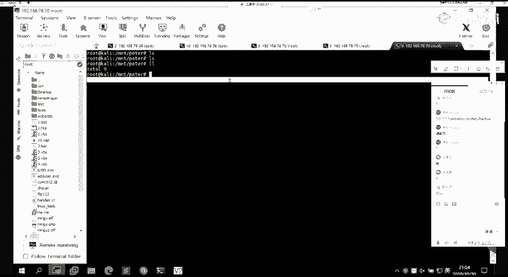

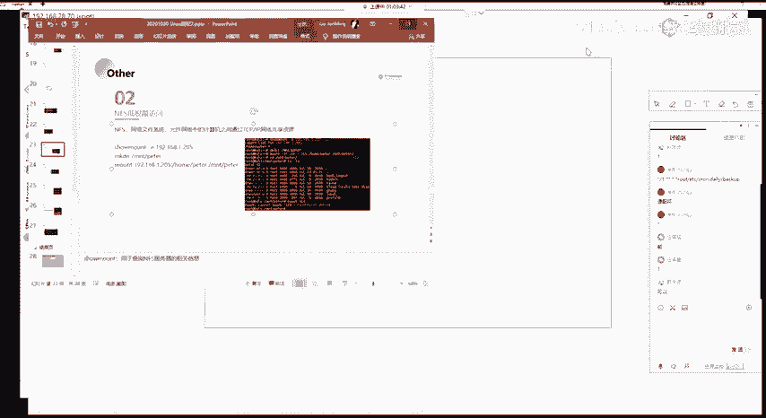

因为我当前的一个系统它是没有P用户的，所以他。

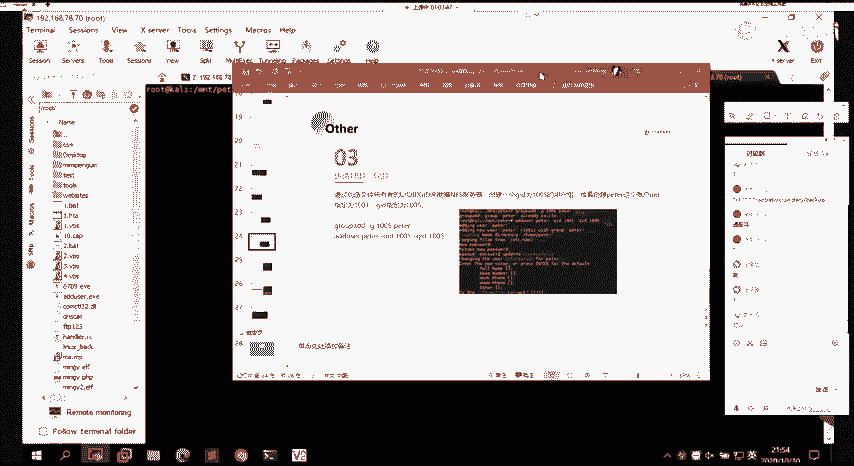

没有权限是吧？那么我通过就是说我自己来我在我当前的这个探启器上面，我去创建这样子的一个peter这个用户是不是能能行呢？啊吧，就是创建这样子一个peer用户来去呃欺骗。

或者说来去伪造这样子的一个文件所有的1个UIDGID来去批欺骗这1个NFS的一个服务器。那么具体的一个步骤的话，就是我们通过这样子的一个方法。

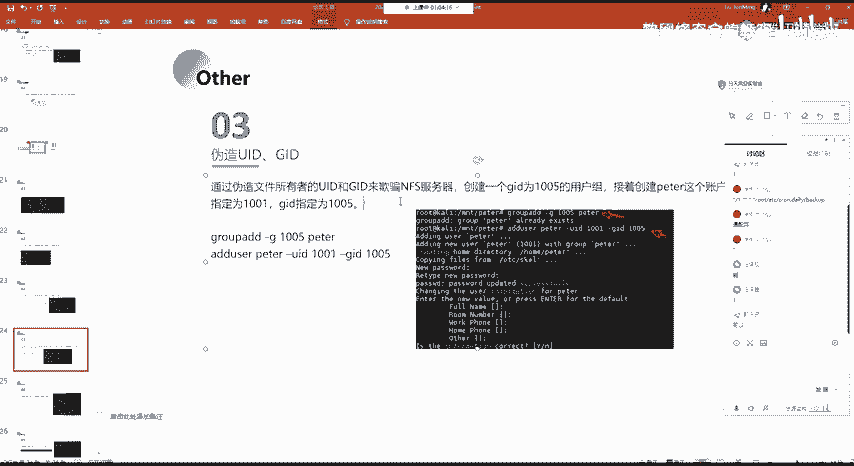

首先的话我们需要去添加这样子的一个组，就是鸡呃peter组啊。然后的话。呃，再去创建这样子一个用户。创建的这个用户的话，UIDGID话要分别为这边。

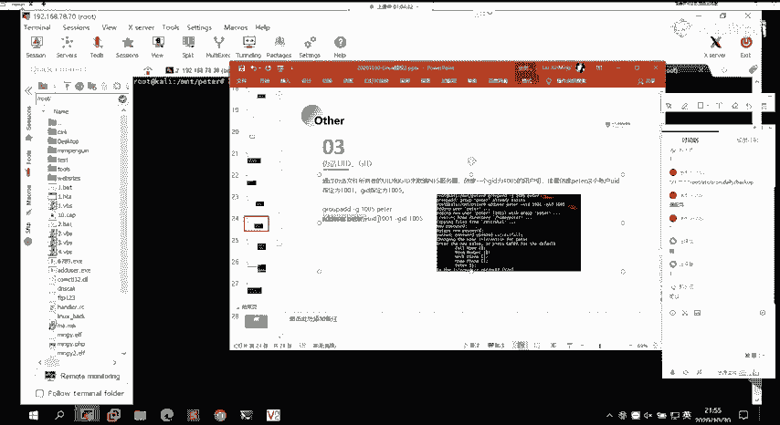

这边的这个对吧？因为它你只有这边跟这边都是对应的话，他才能够说就是说那边呃IIFS服务器，它才能够识别出这边的这个用户，它是一个peter的一个用户。

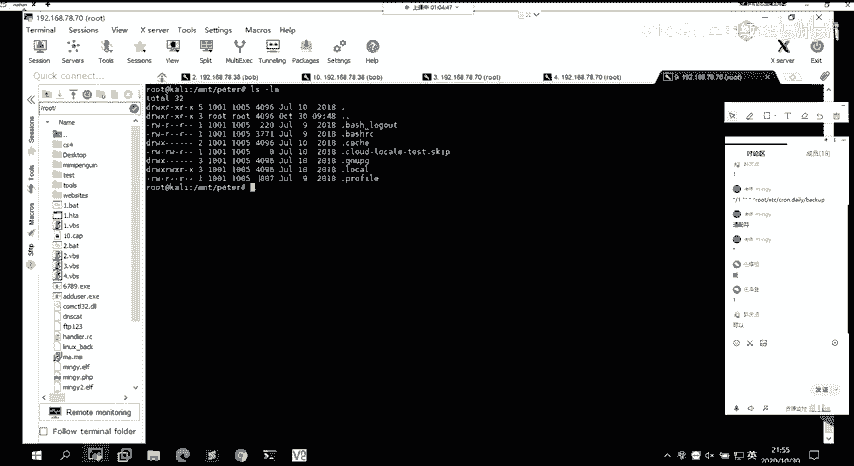

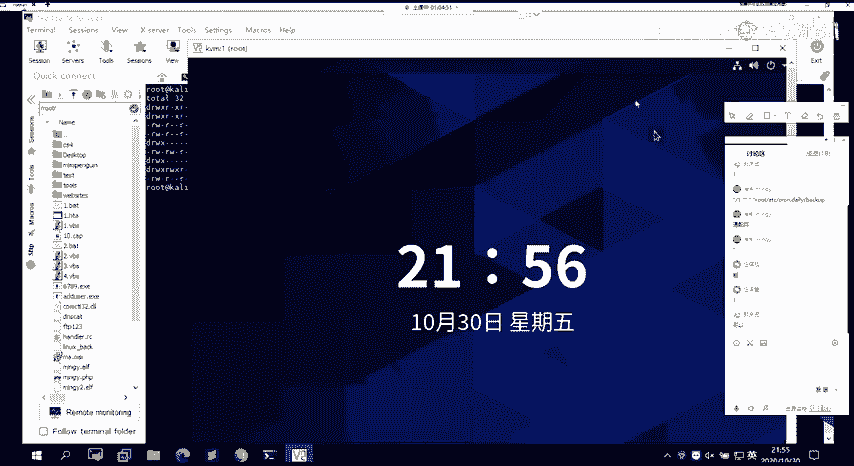

嗯。

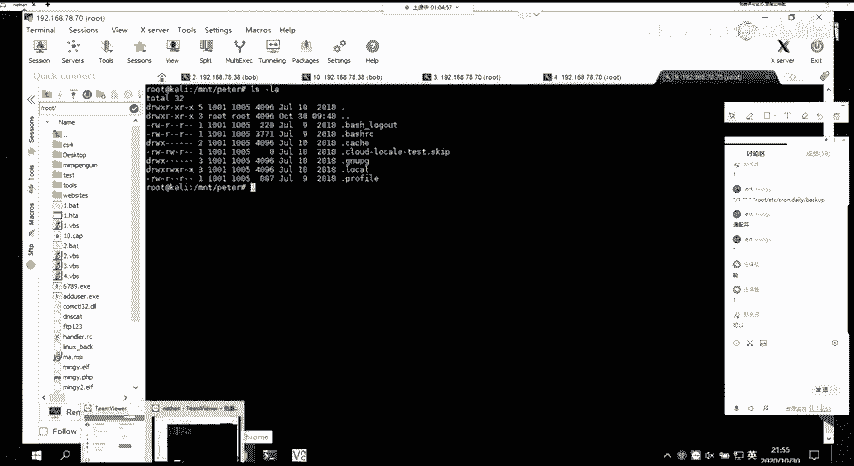

具体一个步骤的话就是这样子，我先。添加一个这样子的一个peter的这样子，就GID为1005的这样子的一个呃Pter组。

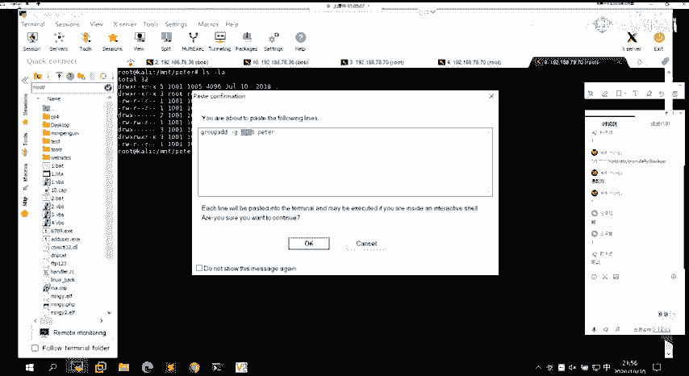

要通过。Grop 8。

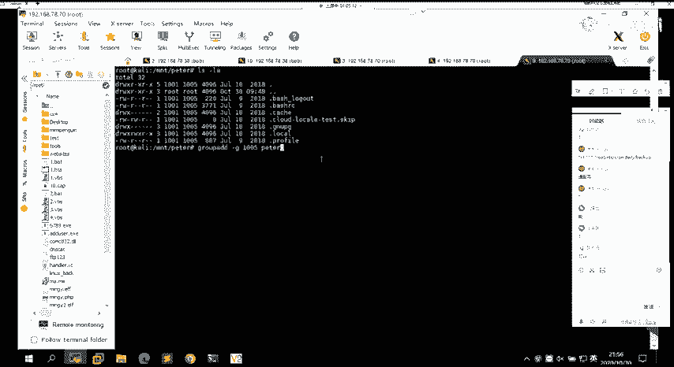

然后的话呃添加一个这样子的一个用户。就添加这样子一个P头用户，就是UID还GID分别为1000以及1005的这样子的一个用户。

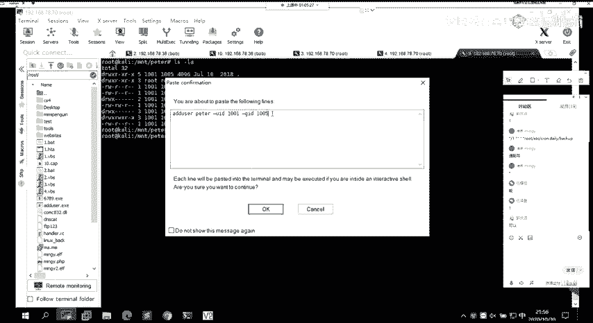

看看那呃我这边的话就是创建这一个用户，对吧？他这边的话需要你输入密码，对吧？我这边的话就输入1个PPR对吧？T提啊。然的话呃，福建国的话这边我也不管了。啊，确定确定之后的话。

我在这边的话查看一下这个pasword。这边的话就添加这样子一个批次用户。然后这边的一个用户的话，它是UID是1001GID是100，对吧？然后的话我们再来看一下这边。

我再来看一下这边呃挂载的这个目录啊，就原原来的话它是这样子的对吧？然后下面我们再来看一下，可以看到在这边的话，它就得到了这样子，就是它显示的是peter，对吧？

也就是说我当前的话是有peter的这样子的一个用户，对吧？我因为我当前系统上面是有peter的一个用户，以及他的这边的一个呃权限的话，它得到了，就是说它是用的我的这样子的一个peter的一个用户。

我在这边显示的话就是Per的一个权限，对吧？然后我现在的话，因为我当前的话是一个Per的一个用户。啊，我当前不是。我这边的话。

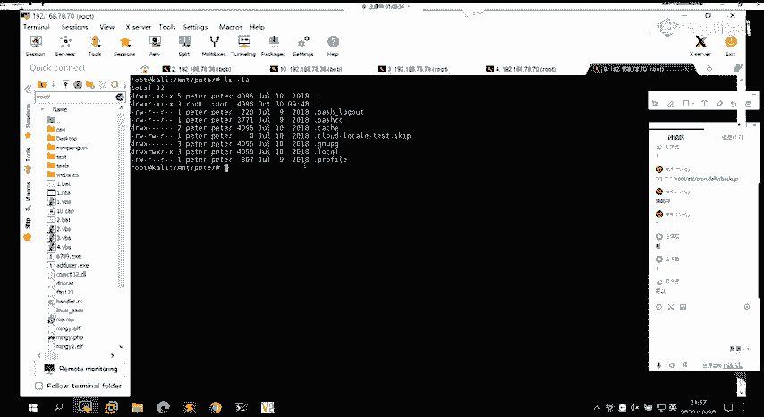

我们先就是要切换到这样子一个peer的一个用户，对吧？因为我当前是一个root用户，我root用户我在这边去创的话，他那边他不认识。

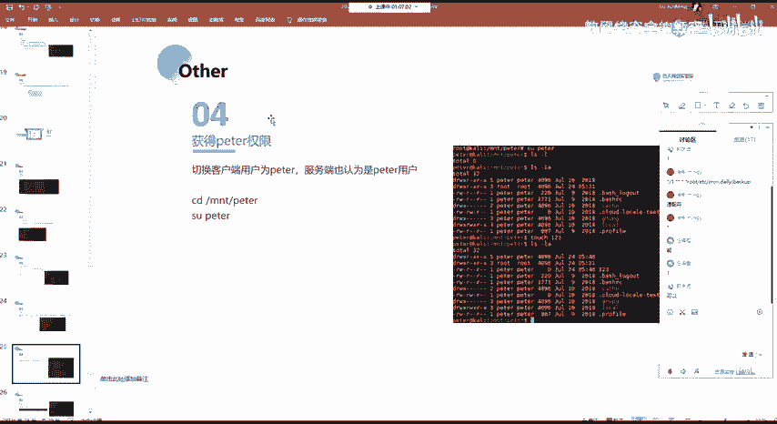

然后他认识的话，他这边只认识的话，这只认识这个Per用户。所以的话我们要先切到这样子的一个peer这个用户下面。对啊我切到这个P准用户下面。是蛋。对吧然后我当前的话是一个peer用户。

以及呃这些文件的话都是peer用户的。那么我当前在peer用户的这个加目下面，我是不是能够去创建文件呢？我当前是一个皮手的一个权限。我来尝试一下对吧？可以看到，我套齐123。好呃那。啊，我开一下123。

对吧没发现的话。我当前我暂我当前我切换到这个P的用户的话，我就有对这一个文件有写的一个权限了。对。也就是说我现在的话我现在在这个目下面创建了这样子的1个123的一个用户，对吧？

那么在这边的这个peter用户。我们来看一下吧。我们可以来查看一下这样子的一个hom下面的。这个。用户对吧，然后你会发现在这边的话就多了1个123的一个文件，对吧？因为在这边跟这边的话，它其实同步的。

也就是我在这边写的文件，我可以把它写入到这个目录下面去了。

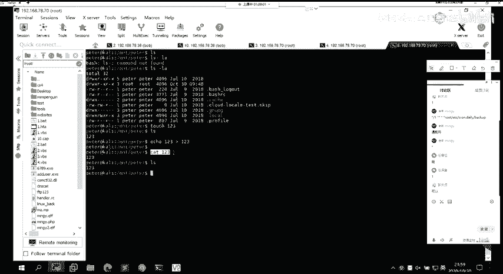

然后的话呃。然后的话我现在对吧？我现在可以有写的一个权限，对吧？那么我就是不是可以尝试去写相应的一个文件。然后我这边的话就以这一个就写入1个SH的一个公样来去进行一个免密登录。就是我当前的话。

我是能写文件的。但是我这边的话，我执行的一个命令啊，我执行的一个命令，它其实你还是在你当前的这个机器上面去执行的，对吧？我只是能够我只是得到了这个目录的一个写文件的一个权限。对？

那么我想要去得到这边的这一个呃这边的这个机器的一个权权限的话，我需要去。

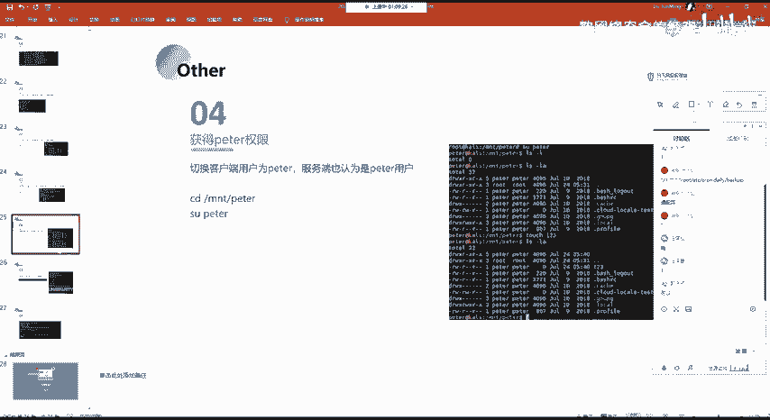

我可以去做这样子一个操作，就是我能够去写嘛。那么我可以去写一个公钥，写1个SSH的一个公钥。然后的话以呃以这个peter的一个用户来去进行一个登录。因为我写入公钥了嘛。

所以的话我不需要知道这个peter用户他是他的一个密码，对吧？我直接就可以去进行一个秘密的一个登录。然后具体的一个步骤的话就是像这样子，我在这边的话。首先去生成这样子一个公钥以及私钥是吧？就是嗯。不。

然后我这边的话我生成了这样子的一个石钥，对吧？是在这样子的一个点SH的这样子一个幕下面。然，就这个IDSA的ex个el，以及这一个公钥IDSA点POB对吧？

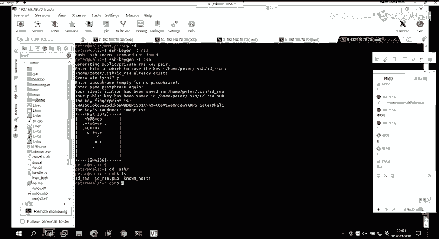

那么现在的话我。就可以把这边我这边的这个公钥啊，对吧？把它给写入到呃目标机器上面的这一个呃点SH的这个目录下面。

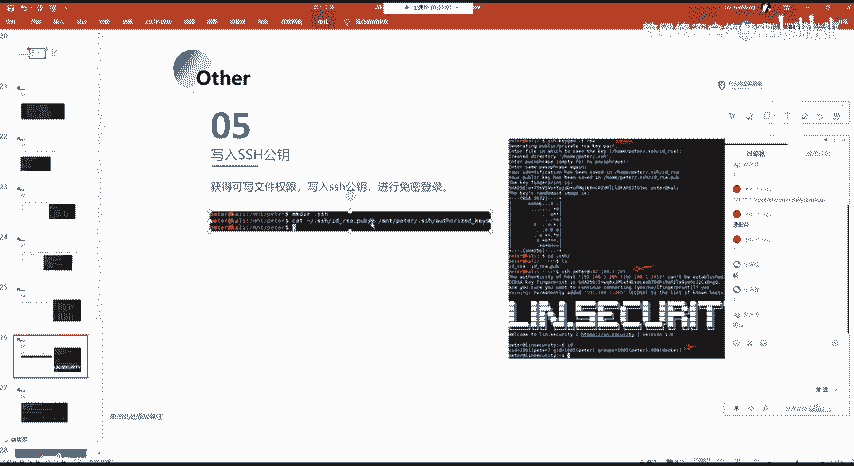

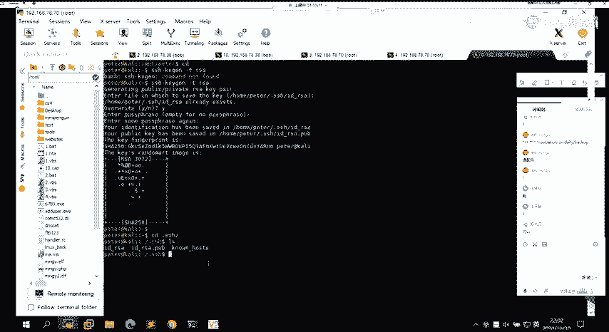

看一下这个公业。对，这是他的一个。就他的一个内容。然后的话我们。我们要写入到他的这个。皮草目录下面。嗯。没有。他这边没有这个文件。我这边看一个。那我在。呃，那个文件名有点长，我这边call一下。

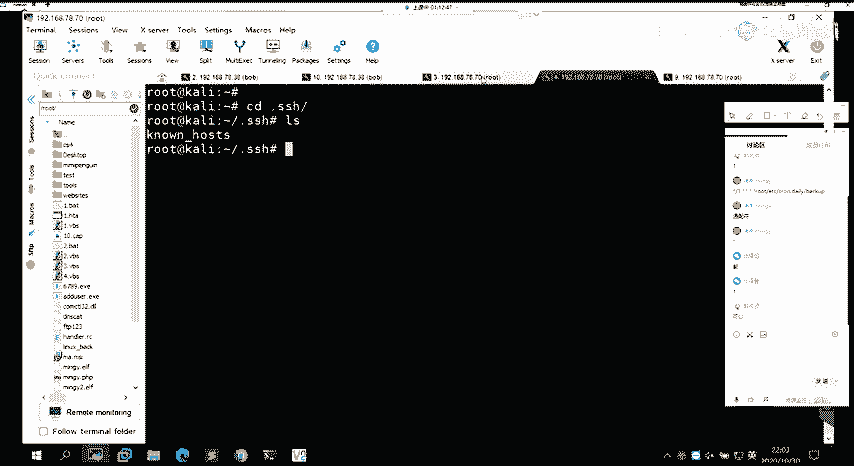

怎没有。

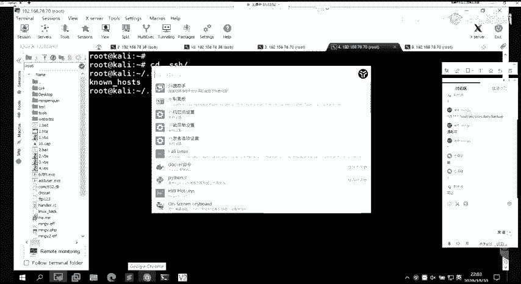

Authorized kiss。

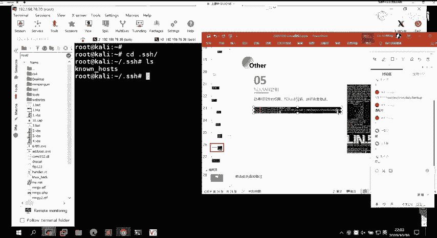

Okay。结不到这一个文件当中。

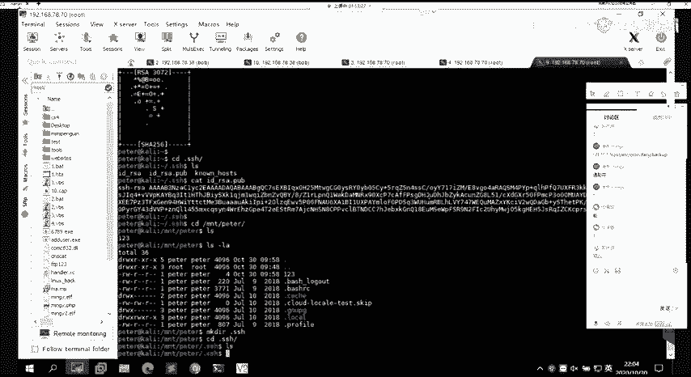

哎，我先托起一个这个文件嘛，然后的话我再。

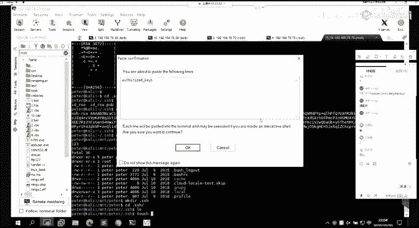

嗯。那，我们来查看一下这一个。他说的K对吧？我现在这边的话就已经写进去了。写到了这个。问下面我们可以在这边来看一下。

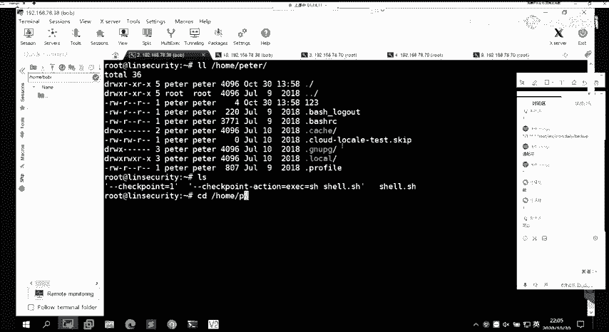

Okay。对，然后在这边话就。

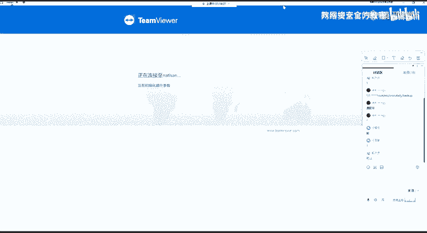

然后在。然后在这边的话就已经写入到了他的这一个。呃，auor kiss这个目录就是我们的一个公钥的话，就要写入到就是要写入到呃我们的目标机器上面的这个目录下面这个文件当中要写进去。

然后的话我们在这边我们就可以通过SH来去进行一个秘密的登录。你没登PPer。以Per用户来去登录这个19201682点78。38的这个机器，对吧？好，这句话嗯，yes。我们这边话没有输入密码，对吧？

我这边的话就进入到了这个peer这个用户。就得到这个Per的一个权限。然后在这边的话嗯。我们的这个peter这一个用户啊。嗯。我们的这个peter的这个用户啊，他我们可以看一下。

他其实也是一个普通的一个用户，对吧？它不是一个很高权限的一个用户，就是就一个普通用户。我们通过这样子一个方法得到了他的这个peter的这一个普通用户的一个权限，对吧？但是他在这边的话有这样子的一个权限。

就这一有一个多可的一个权限。然后在这边的话就是呃涉及到了。

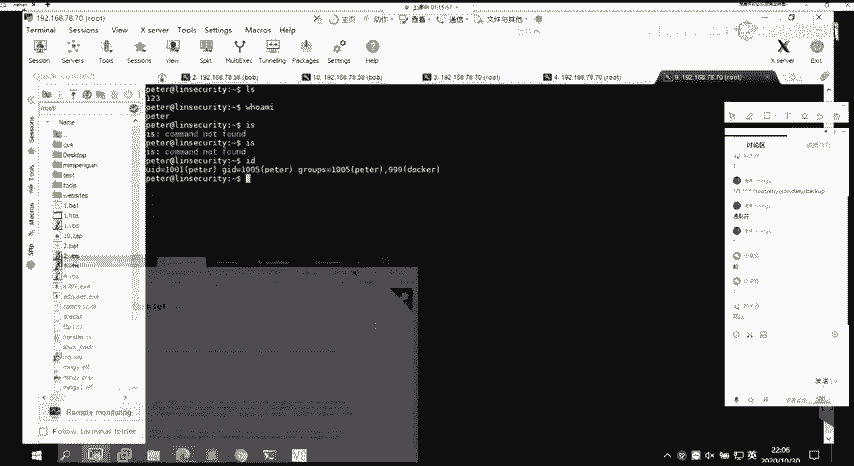

这里啊。最后的这一个多可主题选就是。哦，大家看预行内容吧。🤧以及看一下这篇文章。呃，这边的话虽然是英文的，你翻译一下的话就知道就是。通过多可的一个升级的特权。

就是通过多可的一个组的一个权限来去进行一个权限的一个提升。然后他在这边的话，就是他的一个作子的话，他呃添加了就是说他用。他做了这样子一个多口的一个镜像。然后的话如果你发现就是说你得了这个用户权限。

它是一个多可族的一个成员成员。那么你可以通过这样子一个方法。就是直接执行这一个就是这一个面块，它就会是起一个容器。它起了这个容器，然后他是从这边拖下来的。这边的话是他的一个进线地址。

然后的话他会拖一个容器下来，然后拖一个容器下来之后的话，在这边上我们就能够去得到这个需。

没来。看一下。嗯。呃，在这边的话呃，需要有一个前一天，就是你的这个机器要0网，就是你要能访问到这边的一个网络。就是你要能访问到这个镜像。然后这边的话，他起这一个多口的这一个镜像的话。

他首先会去在本地去找是不是有这样子的一个镜像。如果没有的话，他就会去呃远程的去拖。脱取这样子一个镜像。然后的话基于这个镜像来去创建一个容器。这边的话。有几十到，可能要稍微等一下。有4点钟右。

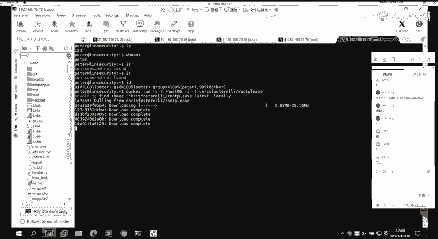

好，呃我们先来看一下实际的一个效果吧，实际的一个效果它就像这样子。它呃把这个镜线拖下来之后的话，它会自己的启动。启动之后的话，它会进入到这样子个选。进入到的这个需要的话，就是一个ro的一个需。

然后他就是利用的他的这样子的一个do组的一个权限。因为这个P用户，它有这个do可组的一个权限。那么它可以通过这样子的一个do组权限来去得到这样子一个root的一个权限。

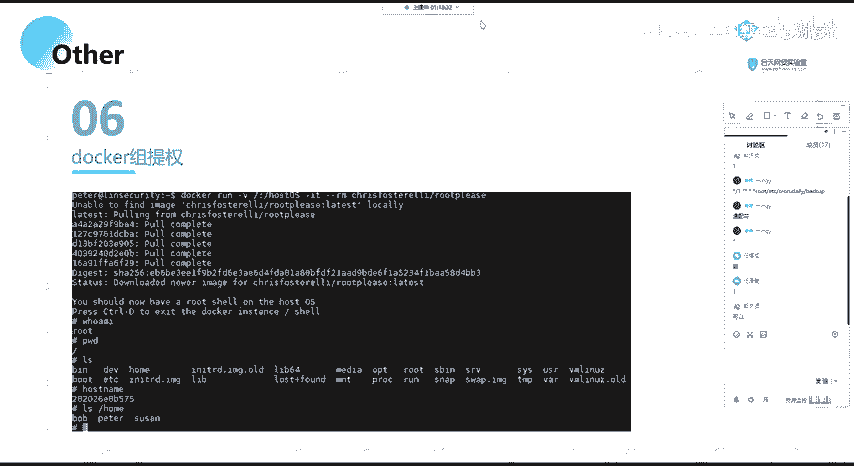

有。呃，以上的话就是我们本节课的所有内容。大家有没有什么疑问？落起来的。呃，大家觉得呃能听懂吗？就呃觉得有问题的好吧，觉得没问题的，以及能听懂的在讨论区扣个一。然后觉得有问题的，然后就是你指出哪里就是。

你觉得哪里。听不懂或者说哪里有问题，你现在指出来，我再给你讲一遍，可以吧？计划任务那里。定视任务吗？这里吧。呃，具体一点。直接创建一个需要，你直接创建，你怎么创建需要呢？就是说他这边的一个定时任务啊。

不是说你能够去写，你能够去往这个定时任务里面去写的呀。你知道吗？他的这个定时任务的话是已经写死的，就是说它是这样子的，不是说定时任务你能够去写，然后的话你直接写一个C，对吧？

那么你定时你能够去写定时任务的话，你直接那你不直接定时任务反弹需不就可以了嘛，对吧？他在这边的话，它的这个电池任务的话，它是它的这个配置，它使用了一个通配符，就是这边的一个新。这个。知道吧？

他的一个问题的一个点的话就是通配服这边用心，就他用他的。然后我们利用这个他的这个通配符的一个注入，我们注入了这样子的一个呃选项。这个选项的话，我们是因为他他他就去打包。

这个幕录下面的一个所有的一个文件的时候的话，它用通配符务的一个方式，他会去检索下面所有的这样子的一个文件，对吧？然后的话他在用他执行这个命令的时候，他其实是实际的话是执行的这样子的一个命令。对吧。

而不是他实际是执行的这样子一个命令。然后他会把这边我们原本是文件的，这样子个命令，他会把它作为一个选项去执行。

然后具体的话其实实际的一个利用点的话就是这两就这个checkpoint action的这个选项。他能够去执行这样子的一个呃，后面接一个命令。然后我们这边执行的一个命令的话。

就是执行我们当前目录下面的这个需要点SH。没意见吗？🤧嗯。为什么要创建？明白了？就是说这边的这个SH点下R的话，我们是在当前的这个普通用户下面去创建的对吧？

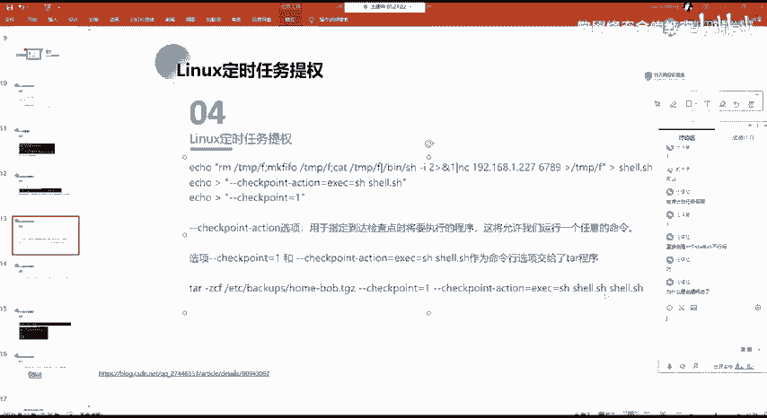

然后我为什么要去创建这一个呢？就是因为我要去我构造的这一个对吧？构造的这一个选项。他再去他去去检索这边的这一个文件的时候，他会把这边的一个我这个文件作为一个选项。然后这边的这个选项的话。

在后面可以接一命令，接了这个命令的话，他就会去执行他，对吧？就是他的一套命令的话，就是我这边写的嘛。

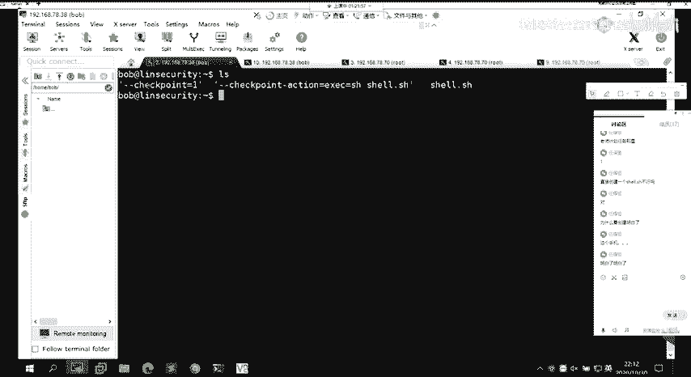

他就他到这边对吧？他到这边的话，他就会去执行这边的一个希尔的希尔的脚管吧。然后的话他就会去执行我当前目录下面写的这一个嘛。

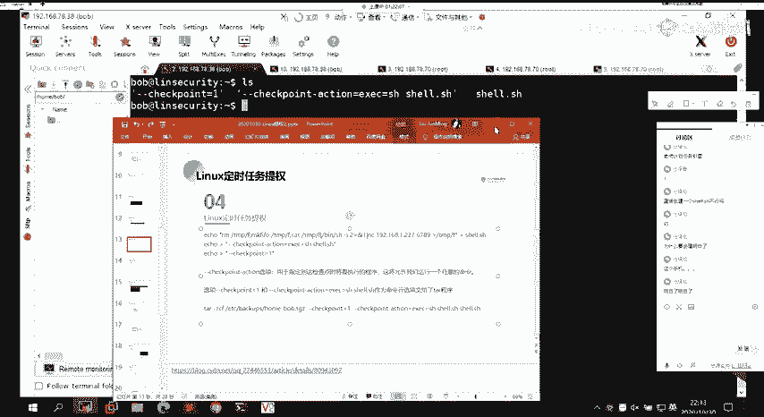

这边有点慢啊。😊，明白了。还有其他问题吗？う。这手机什么意思？到我。呃，其他同学呢其他还在听的同学。能理解吗？就有有没有问题，有问题直接提啊。或者哪里我你觉得我没讲好的话，你可以直接指出来。呃。

应该是都没有什么问题了，是吧？好嗯。这个的话这个的话大家自己。哎自己去尝试吧，好吧，就实际的一个效果的话是能达到的这没有问题的。

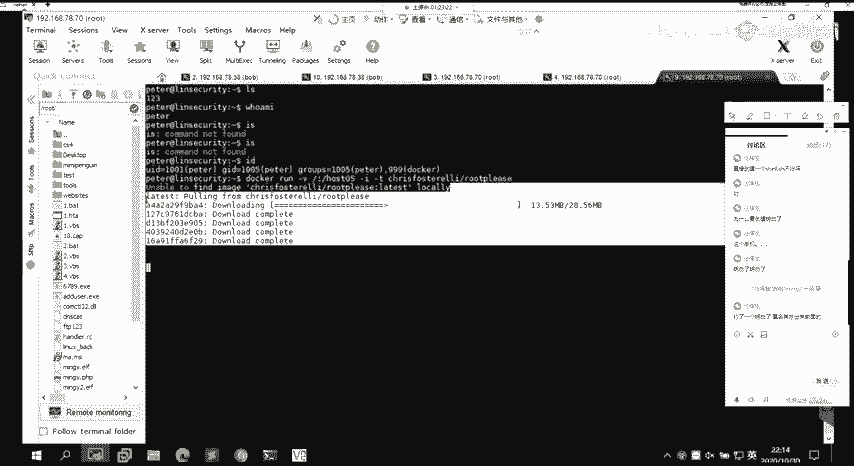

就是我PPT这边的一个这边的这一个效果。我这边的话。他这要下的话。

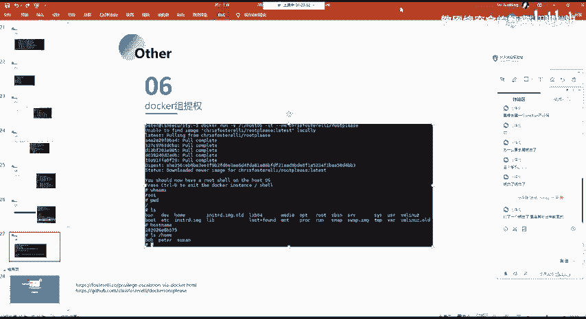

还要一会儿。好吧，呃，大家没有问题的话，就下课吧。好吧。🤧应该是没有问题。呃，那么下课大家早点休息。

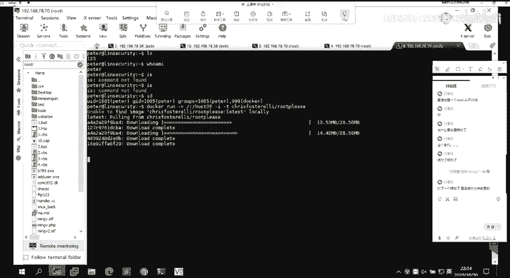