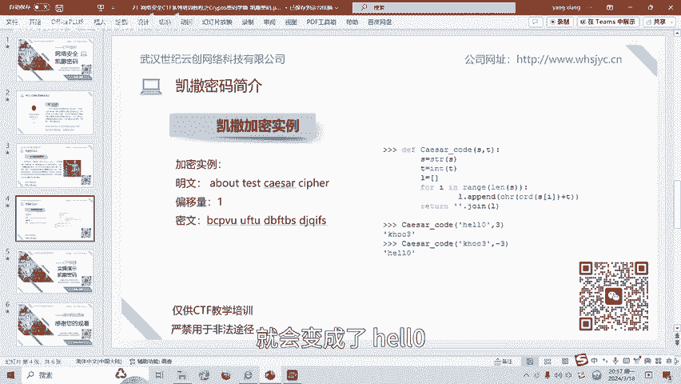
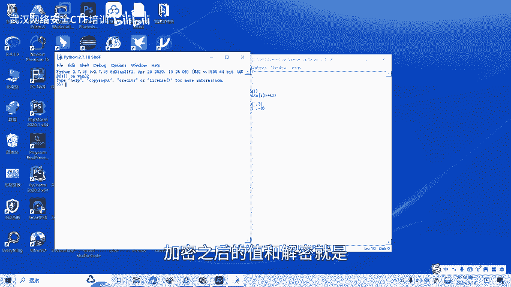
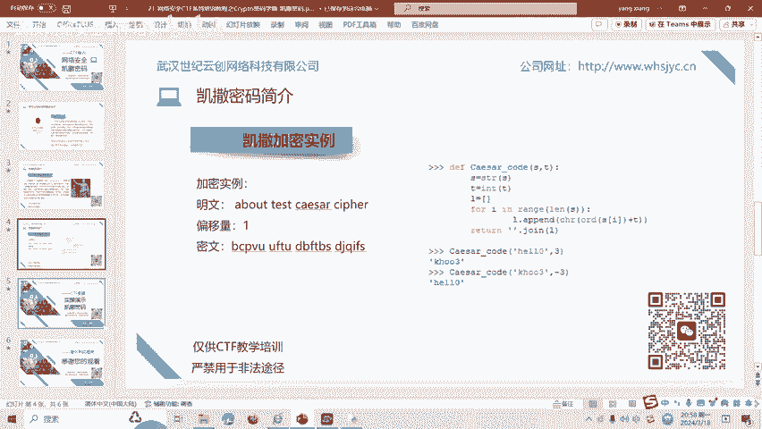
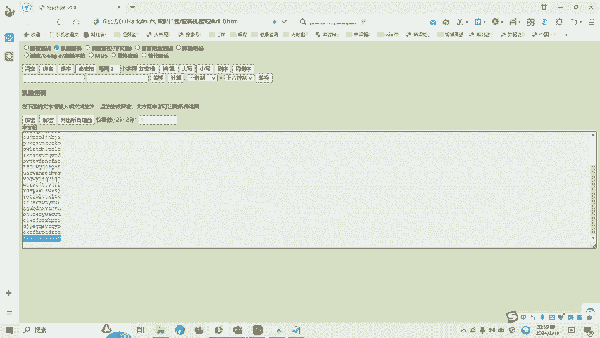

# 21-网络安全CTF系列培训教程之Crypto密码学篇-凯撒密码 - P1 - 武汉网络安全CTF培训 - BV16w4m1R7bC

大家好，我是阿阳。我们制作此视频的目的是希望帮助一些想要学习CTF的同学快速入门，提高CTF竞技水平。本视频为CTF网络安全系列培训教程，后期将会持续不断的更新。大家如果有兴趣进一步深入学习CTF。

可访问PPT上面的公司网址进行电话联系，或者扫描视频中的二维码进行报名咨询。我们的教师团队均来自CTF省赛世赛前10名选手，通过顶尖战队的手把手指导，大家学完之后，即可达到省赛世赛的夺奖水平。

🎼首先大家一定要遵守网络安全法。本课程内容仅用于CTF网络安全教学培训，请大家遵守相关的法律法规，勿用于其他用途。今天这节课主要是讲CTF比赛密码学中的凯撒加密技术。那么什么是凯撒密码呢？在密码学中。

凯撒密码或称为凯撒加密。凯撒变换是一种最简单且最广为人知的加密技术。它是一种替换加密的技术，铭文中的所有字母都在字母表上向后或者呢向前，按照一定的固定的数目进行偏移后，被替换成密文。

例如当偏移量为三的时候，所有的字母A将会被替换成DB变成一以此类推，这个加密方法是以罗马共和时期，凯撒的名字命名的。因为呢当年凯撒曾用此方法，与其将军们进行联系。

接下来介绍一下凯撒加密的python实例。第一个呢就是凯撒密码的加密原理呢，其实是通过将明文中每个字符按照字母表中的顺序全部后移KK位K呢为密钥，得到了新的字符及密文，如右图中的python脚本。

当运行凯撒函数时呢输入需要加密的字符串H1LL0。当步长为三的时候呢，函数呢会将每个字符按照字母表的位置呢替换为原来字符向后移三位的字符，H呢将会替换成为K。一呢就会替换成H。

L就会替换成O3呢零呢就会替换成3。所以呢H1LL0呢就会替换成KHOO3。第二个呢就是凯撒的一个解密原理，其实呢也就是加密的一个反过程。

凯撒解密呢将密文中的每个字符按照字符表中的顺序呢向全部呢前移N位。加密呢是后移几位，解密呢就前移几位得到新的字符即为明文。比如右图中的python脚本，当运行凯撒函数输入需要简密的字符串为KHOO3。

步长为-3的时候，函数呢将会将呢每个字符按照字母表中的位置替换成原来字符前移三位的字符啊，K就替换成了H。H呢就替换成了一O呢就替换成了L3呢就变成了0。所以呢KHOO3。

通过呢凯撒的解密就会变成了H1LL0。

我们运行一下这个。凯撒的一个。拍成脚本。这个呢就是刚刚PPT里面一个脚本，我们输出凯撒加密啊三位或者凯撒解密三位之后的一个。加密之后的值和解密这个是。

HELL0加密层。三位字符布长之后呢，就会变成了KH003。然后呢，KH003呢，然后向前负3位移及三位的话，就会变成解密成为H1LL0。

最后呢我们讲一下凯撒加密的实操部分。大家看一下这道题目。题目为凯撒，然后呢描述题目呢就是这个，然后fllaag呢。啊，需要我们提交回，我们复制一下。然后呢，有一个工具叫做。密码机器。需要这个工具的。

网友呢可以扫描视频中的二维码呢，添加我的微信。然后呢，我会把这些CDF的一些工具就会发给大家。然后我们把这个描述也有这个题目啊。放到这个密码机器里面，然后选择凯撒密码。最后呢我们就是列出所有组合。

就是输出啊，所有的位移偏移量是吧便历一遍，看哪一个才是它的。解密之后的一个。铭文我们解面还发现。最后一个flag is凯撒，有一个flag呢就是这个值。这个值。凯撒加密呢还有很多种方式。

后面呢将会针对各种类型的凯撒加密制作相应的教学视频。

大家呢也可以扫描视频中的二维码，领取资料或者呢报班学习。好了，今天的课程到此结束，感谢大家的观看。🎼Yeah。🎼B face face。

