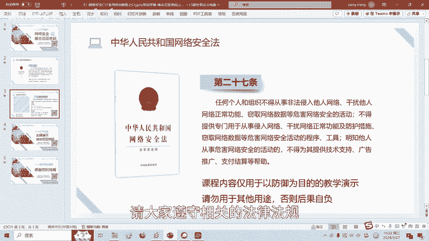
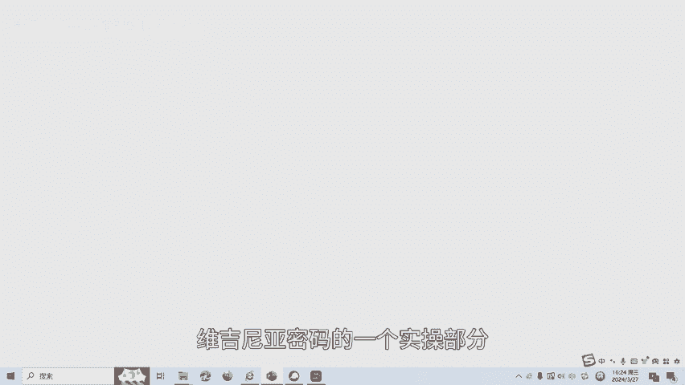
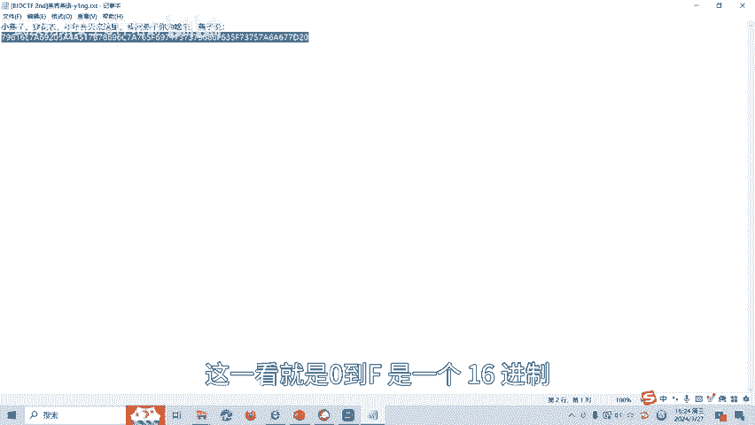
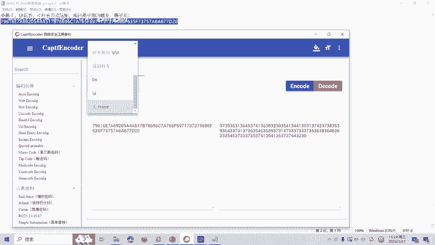
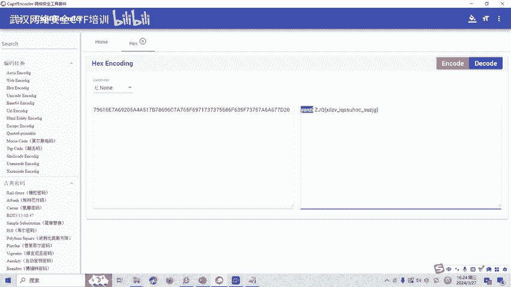
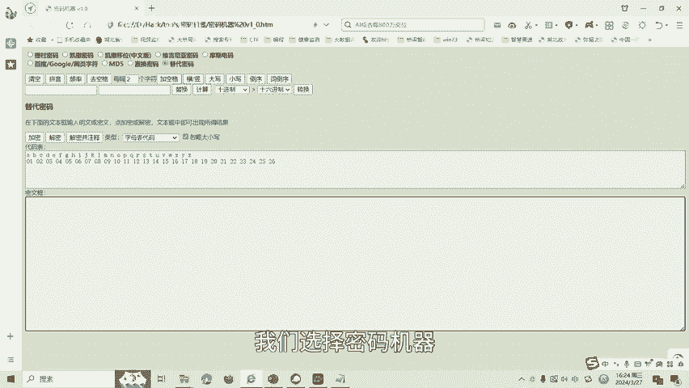
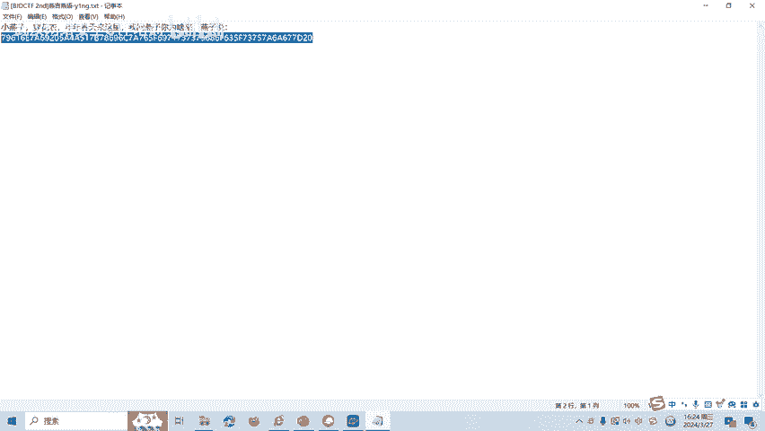
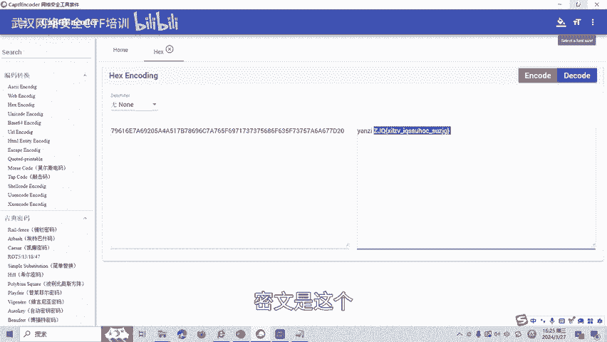
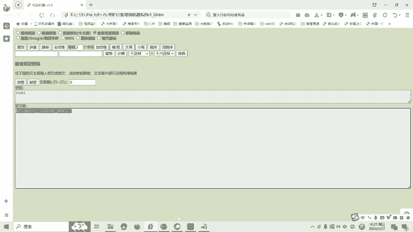
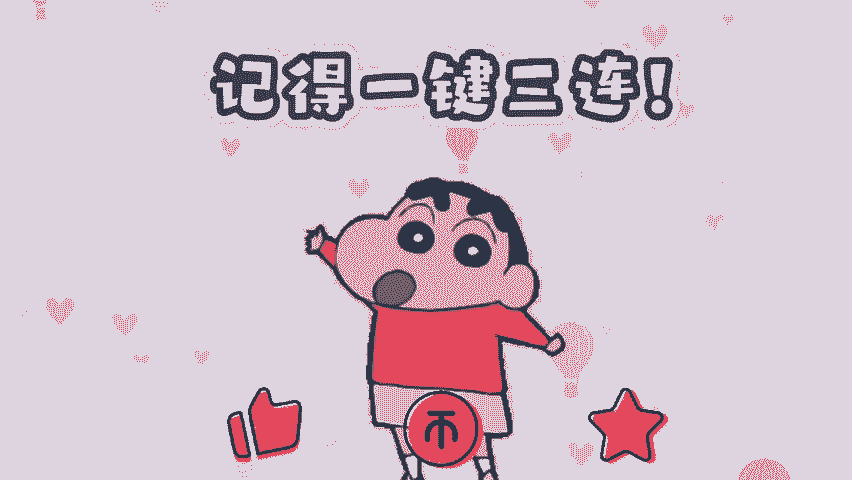

# 22-网络安全CTF系列培训教程之Crypto密码学篇-维吉尼亚密码 - P1 - 武汉网络安全CTF培训 - BV1Fm421H7Ld

大家好，我是阿阳。我们制作此视频的目的是希望帮助一些想要学习CTF的同学快速入门，提高CTF竞技水平。本视频为CTF网络安全系列培训教程，后期将会持续不断的更新。

大家如果有兴趣进一步深入学习CTF可访问PPT上面的公司网址进行电话联系，或者扫描视频中的二维码进行报名咨询。我们的教师团队均来自CTF省赛世赛前10名选手，通过顶尖战队的手把手指导。

大家学完之后即可达到省赛世赛的夺奖水平。首先大家一定要遵守网络安全法。本课程内容仅用于CTF网络安全教学培训，请大家遵守相关的法律法规，勿用于其他用途。

今天这节课主要是讲CTF比赛密码学中的维吉尼亚加密技术。那么什么是维吉利亚密码呢？它是在单一的凯撒密码的基础上扩展出来的多表代换密码。根据密钥来决定用哪一行的密表来进行替换。当密钥长度小于明文长度时呢。

可以循环使用。例如，我们的一个加密实例。然后呢，密钥是C嘛。密文呢，那么呢它的密文是什么呢？第一个字母是T。那么我们就选择T行，然后呢，密钥的第一个字母是C，那就是T行C列T行C列，那就是V。

我们查维西利亚的这个表。那么第一个字母呢加密之后就是V。第二个字母呢是H，名文是H，那么就是H行，然后呢命钥呢就变成了IH行I列的话呢。那么查维吉利亚这个表呢，那就是P加密之后呢，就变成了P。

以此呢类推我们呢得到了这个明文，利用simmer这个密钥加密之后的密文。接下来呢我们讲一下维机立亚密码的一个实操部分。

我们打开这道题目。然后呢，有一串。1六进制这一看就是0到F是1个16进制。我们把十六进制呢进行一个。

解满。

抵扣的。我发现呢这里呢有个空格啊，燕子啊中间有个空格。那么呢如果是维吉利亚的话呢，燕子呢就有可能就是一个密案。

我们选择密码机器。

选择维机密亚密码，然后呢，密钥选择燕子。

密文是这个。

把密文呢放进去进行一个解密。然后这就是解密之后的一个值。那么这个呢就是这道题目的一个。Fag。

维吉尼亚加密呢还有很多种方式，后面呢将会针对各种类型的维吉尼亚加密呢制作相应的教学视频。大家呢也可以扫描视频中的二维码，领取资料，或者呢报班学习。好了，今天的课程到此结束，感谢大家的观看。🎼。

🎼再见喽。

