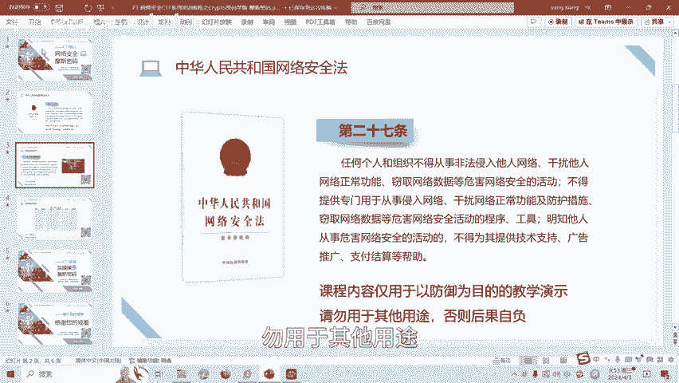
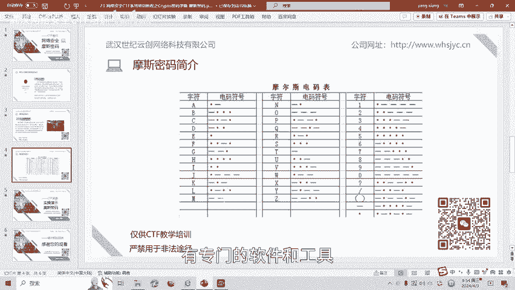
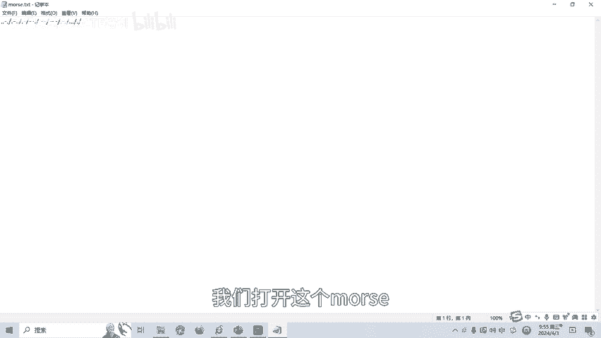
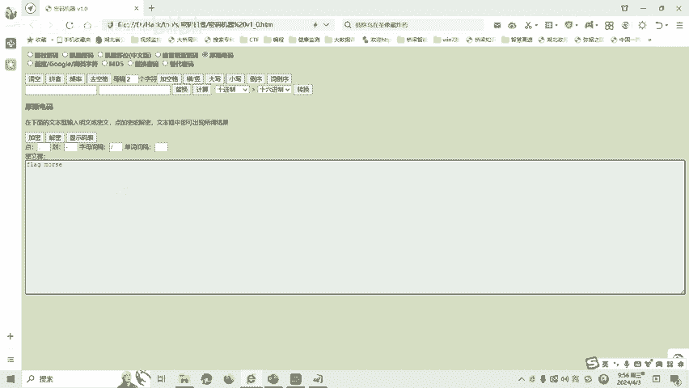

# 23-网络安全CTF系列培训教程之Crypto密码学篇-摩斯密码 - P1 - 武汉网络安全CTF培训 - BV1HJ4m157XC

大家好，我是阿阳。我们制作此视频的目的是希望帮助一些想要学习CTF的同学，快速入门，提高CTF竞技水平。本视频为CTF网络安全系列培训教程，后期将会持续不断的更新。

大家如果有兴趣进一步深入学习CTF可访问PPT上面的公司网址进行电话联系，或者扫描视频中的二维码进行报名咨询。我们的教师团队均来自CTF省赛世赛前10名选手。通过顶尖战队的手把手指导，大家学完之后。

即可达到省赛市赛的夺奖水平。首先，大家一定要遵守网络安全法。本课程内容仅用于CTF网络安全教学培训，请大家遵守相关的法律法规，勿用于其他用途。

今天这节课主要是讲CTF比赛密码学中的密模式密码。那么什么是模式密码呢？摩斯密码是一种时通时段的信号代码，通过不同的排列顺序来表达不同的英文字母、数字和标点符号。摩斯电码呢是一种早期的数字化通信形式。

但是呢它不同于现代只使用零和一两种状态的二进制代码，它的代码包括5种点华点和华之间的停顿，每个字符间的短的停顿。每个词之间的中等停顿以及句子之间长的停顿。接下来呢我们看一下摩斯密码表。

比如说大写的A就是点横大写的B呢是横点点点3个点。比如说我们的数字一是一个点，四个横，然后呢包括括号问号。这都有相应的一个标志啊，典层的一个标志排列组合。我们一般破解摩斯密码的时候呢。

就按照这个对照这个摩斯密码表，然后进行一个破解。当然了，也有一个专门的一个破解工具啊，破解摩斯密码的工具。如果我们对应这个摩斯密码表，一个一个的去破解人工破解的话，会花很短的时间。有专门的软件和工具。

后面我们做实操的时候就会讲。

啊。接下来呢我们就讲一下摩斯密码的实操题目啊，实操部分。我们打开这个模式，点TT这个文文件就会发现。

这个有点有横啊，这就是一个很有恒，就是模式密码。那么我们把它用软件，用我们的密码机器来进行一个破解。进行一个破解，我们试一下，我们把它粘贴进来。点我们点啊。

我们可以复制一下它这个机器里面点和我们点流痕字符啊不一样。横我们也复制进来。字母母间的间隔呢用这个斜线表示。然后呢，我们点击一下解密啊，因为这是选中的是模斯电码，然后选择的是解密。

我们解密一下flag模式啊。那个呢就是摩斯。

这呢就是这道题目的一个flag和答案。模斯密码呢还有很多种方式，后面呢将会针对各种类型的模斯密码呢制作相应的教学视频。大家呢也可以扫描视频中的二维码，领取资料或者呢报班学习。好了，今天的课程呢到此结束。

感谢大家的观看。

🎼再见喽。