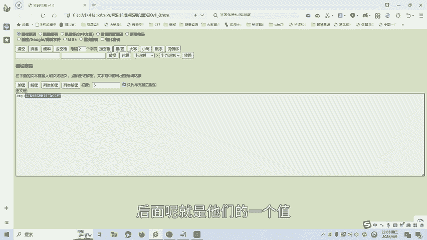
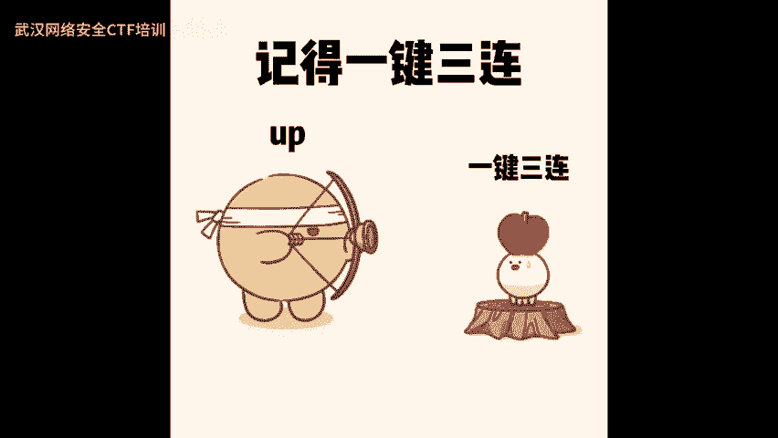

# 24-网络安全CTF系列培训教程之Crypto密码学篇-栅栏密码 - P1 - 武汉网络安全CTF培训 - BV1Sq421F7A6

大家好，我是阿阳。我们制作此视频的目的是希望帮助一些想要学习CTF的同学，快速入门，提高CTF竞技水平。本视频为CTF网络安全系列培训教程，后期将会持续不断的更新。

大家如果有兴趣进一步深入学习CTF可访问PPT上面的公司网址进行电话联系，或者扫描视频中的二维码进行报名咨询。我们的教师团队均来自CTF省赛世赛前10名选手，通过顶尖战队的手把手指导，大家学完之后。

即可达到省赛世赛的夺奖水平。首先，大家一定要遵守网络安全法。本课程内容仅用于CTF网络安全教学培训，请大家遵守相关的法律法规，误用于其他用途。今天这节课主要是讲CTF比赛密码学中的栅栏密码。

那么什么是栅栏密码呢？所谓栅栏密码，就是把要加密的铭文分成N个一组，然后呢把每组的第一个字符组合，每组的第二个字符组合依此类推。然后呢，每组的第N个字符呢呃进行一个组合。最后呢它们呢全部连起来就是密文。

接下来我们看一下栅栏密码的实例。这里呢以三栏栅栏加密为例，比如说铭文为test for real，去掉空格之后呢，我们进行以三栏为一组，三个字符为一组。第一组呢，那么第一个字母就是TTR。哎。然后呢。

第二组就是每组第二个组母一。F。RI。然后呢，最后一个字符呢呃以ar符，然后来进一个填空。最后呢形成了密文，就是这个这就是栅栏密码的一个加密部分。我们呢接下来看一下。带来密码的一个实操题目。

讲一下实操题目。

题目呢是刘翔是跨栏的，他跨5个栏应该很轻松。这个时候题目的提示就相当于有可能就是栅栏密码。武兰啊。假设是五栏，我们把这个密文复制到我们的密码机器里面。

选择栅男的吧。然后呢，将。栅栏数呢写成5，最后解密。我们发现这个K值啊K值就是我们的答案。一般呢CTF比赛要么就是flag，要么就K，要么就CTF作为一个标记，后面呢就是他们的一个。

值。栅栏密码呢还有很多种方式，后面呢将会针对各种类型的栅栏密码制作相应的教学视频。大家呢也可以扫描视频中的二维码，领取资料或者呢报班学习。好了，今天的课程到此结束，感谢大家的观看。

