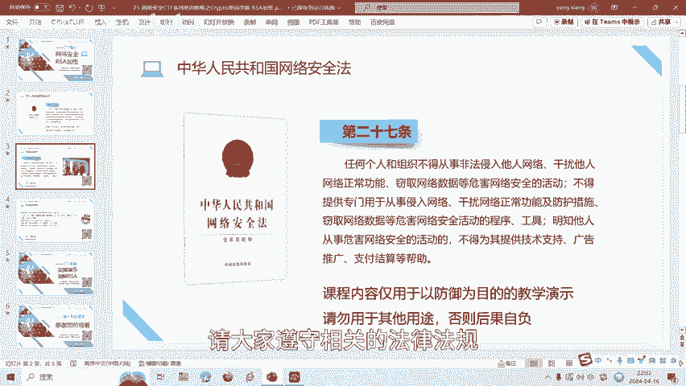
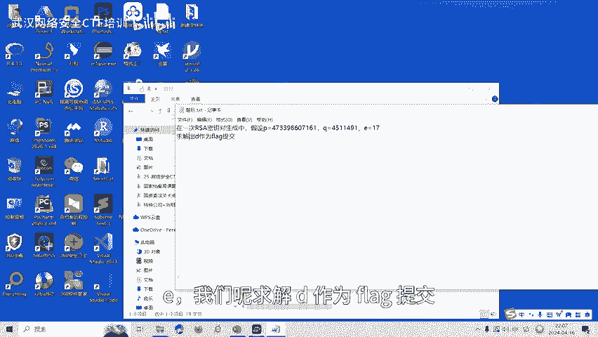
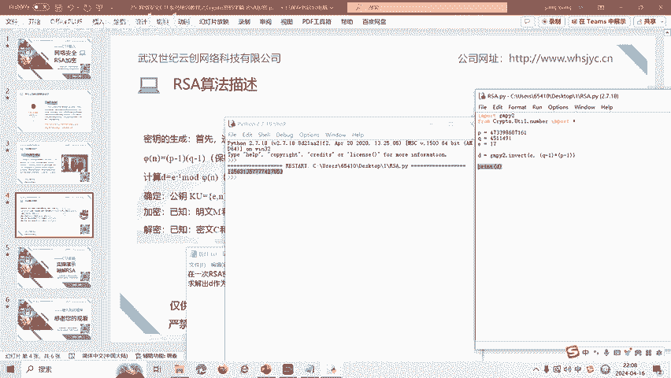

# 25-网络安全CTF系列培训教程之Crypto密码学篇-RSA加密 - P1 - 武汉网络安全CTF培训 - BV1Dp421Q7Gs

大家好，我是阿阳。我们制作此视频的目的是希望帮助一些想要学习CTF的同学，快速入门，提高CTF竞技水平。本视频为CTF网络安全系列培训教程，后期将会持续不断的更新。

大家如果有兴趣进一步深入学习CTF可访问PPT上面的公司网址进行电话联系，或者扫描视频中的二维码进行报名咨询。我们的教师团队均来自CTF省赛市赛前10名选手。通过顶尖战队的手把手指导，大家学完之后。

即可达到省赛世赛的夺奖水平。首先，大家一定要遵守网络安全法。本课程内容仅用于CTF网络安全教学培训，请大家遵守相关的法律法规，误用于其他用途。

今天这节课主要是讲CTF比赛中的RSA密码。RSA呢是1977年由罗拉德李维斯特啊阿迪萨莫尔和。伦纳德阿德曼三个人一起提出来的，他们三人呢当时呢都在麻省理工学院工作。

RSA呢就是他们三人信氏开头字母拼在一起组成的。RS算法呢它是一种非对称的加密算法，与对称加密算法不同的是呢，RS算法呢有两个不同的密钥，一个是公钥，一个呢就是私钥。

接下来呢我们看一下RSA算法的一个描述。算法描述。首先选择两个互译的大素数P和Q啊，这个呢P和Q呢就相当于私要部分，私要部分内容啊是保密的。然后呢，计算N等于P乘Q两个大素数相乘得到的N。

斐N呢等于P减1乘以Q减1，这是一个欧拉函数斐N。然后呢，选择一个随机整数啊，小一小一呢大于零，小于斐N啊。小一呢它是公钥啊，可以公开的。一和斐N呢最大公约数为一GCD呢就是great啊最大的公因数。

然后呢，计算D小写的D。小写的D呢就是一的负一方摩范N。然后呢，小写的D呢和PQ都是私要部分。然后呢，公钥部分呢是小写的一和N。因为你知道N，因为N是两个大素数相乘，你N的话是很难破解出P和Q的。当然。

RSSA呢，如果有一些简单的RSA或者是有漏洞的SA，我们就可以对这个小写N进行破解。加密如何加密呢？ISA已知明文M和公钥一和N。那么呢得到的密文C就是明文的1次方。摩恩。解密呢。

比如说已知密文C和C要D和N，因为C钥是D和P和Q。然后知道P和Q呢就相面知道。嗯呐。那么呢明文就等于C的D次方摩N。这呢就是RSA的一个加密和解密算法部分的一个描述。

最后呢我们讲一下RSA算法的实操题目。

题目描述，在1次RSA密钥对生成中呢，已知P。和Q以及呢一我们呢求解D作为flag提交。那我们看一下算法。

如果当知道P和Q的值之后呢。那么N的值是不是也就知道了？如何求解D呢？D等于一的负1次方摩N。一我们是已知的。然后斐ine呢就是P减1乘以Q减1，那么斐N也就知道了。

从而呢我们就可以用pyython脚本计算出来D。pyon脚本呢。是什么呢？我们来运行一下。我们看一下派on脚本，我们用到了GMPY2这个包。然后呢。已知PQ1，那么它D呢就等于进用PY2这个包里面的一。

跟P减1乘Q，这是斐N，这是斐N。对照了我们这个公式公示。然后呢，对他一个。反。求立摩求力摩，于是呢计算它了D，然后我们将D输出呢这个值就是我们这道题目的flag flagag值。

CTU比赛中呢RSA算法呢还有很多种解题方式，包括共谋攻击、小公要指数攻击。后面呢将会针对各种类型的RSA题目制作相应的教学视频。大家呢也可以扫描视频中的二维码领取资料，或者呢报班学习。好了。

今天的课程到此结束，感谢大家的观看。🎼And。

🎼再见喽。