# 26-网络安全CTF系列培训教程之Reverse逆向篇-静态分析 - P1 - 武汉网络安全CTF培训 - BV1tT421X7RA

大家好，我是阿阳。我们制作此视频的目的是希望帮助一些想要学习CTF的同学，快速入门，提高CTF竞技水平。本视频为CTF网络安全系列培训教程，后期将会持续不断的更新。大家如果有兴趣进一步深入学习CTF。

可访问PPT上面的公司网址进行电话联系，或者扫描视频中的二维码进行报名咨询。我们的教师团队均来自CTF省赛世赛前10名选手，通过顶尖战队的手把手指导大家学完之后，即可达到省赛世赛的夺奖水平。首先。

大家一定要遵守网络安全法。本课程内容仅用于CTF网络安全教学培训，请大家遵守相关的法律法规，勿用于其他用途。今天这节课主要是讲CTF比赛中的立项分析。

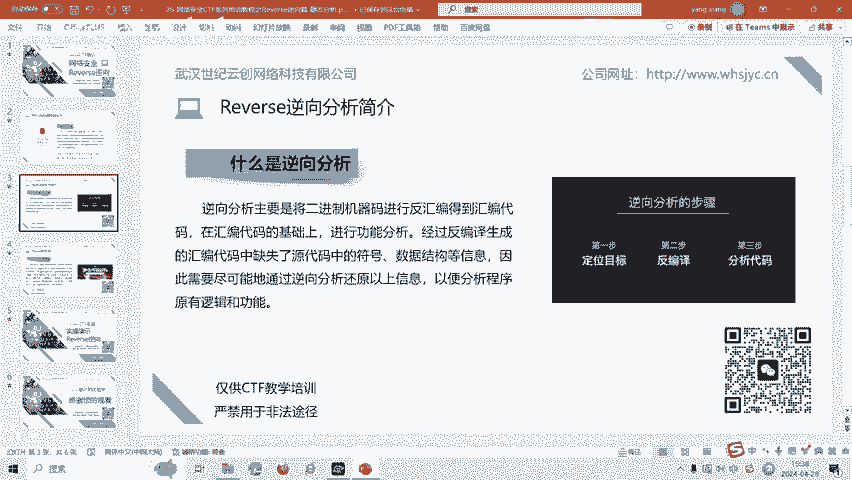

reverse立项分析主要是将二进制机器代码进行反汇编，得到了汇编代码，在汇编代码的基础上进行功能分析。经过反编译生成的汇编代码中缺失了源代码中的符号、数据结构等信息。

因此呢需要尽可能的通过立项分析还原以上信息，以便分析程序原有的逻辑和功能。逆向分析一般有静态分析和动态分析两种。这节课主要是讲静态分析，那么什么是静态分析呢？静态分析是在不执行代码文件的情况下。

对代码进行静态分析。通过对代码外部特征进行观察，主要包括静态反回编反编译。文件类型分析主要是用于了解程序是什么语言编写的，或者呢是用什么编译器编译的，以及程序是否被加密处理过。在立项的过程中。

主要呢是使用反汇并工具，查看了内部代码分析代码结构。最后呢我们讲一下逆项分析的实操题目。

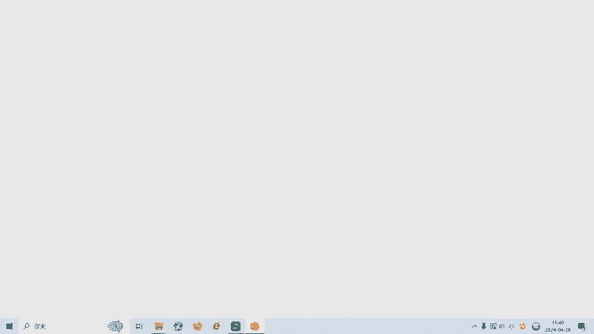

这里呢有1个ESE程序。

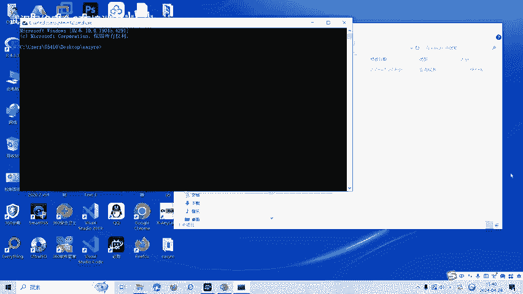

EZRE点ESE。我们回去之后发现可以输入一些字符串。

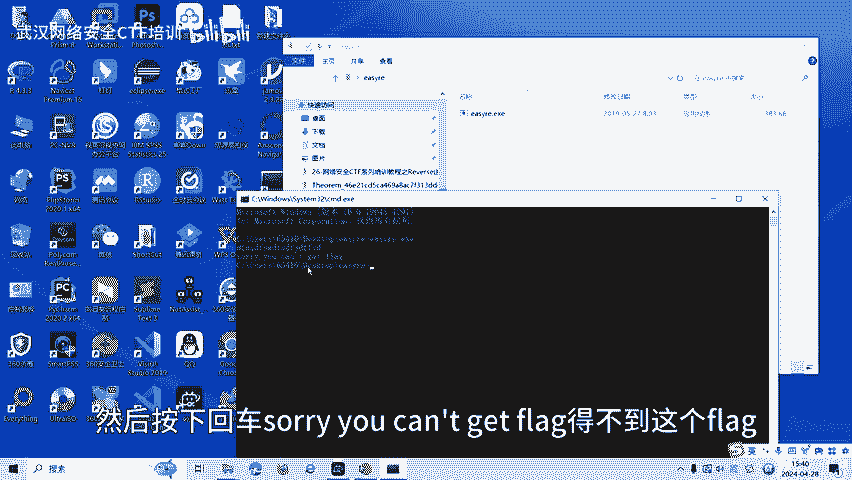

然后按下回车，sorry， you can't get the flat。得不到这个flag。那我们面对EX1的。立项程序怎么办呢？

首先我们用DIE这个软件进行一个检测。

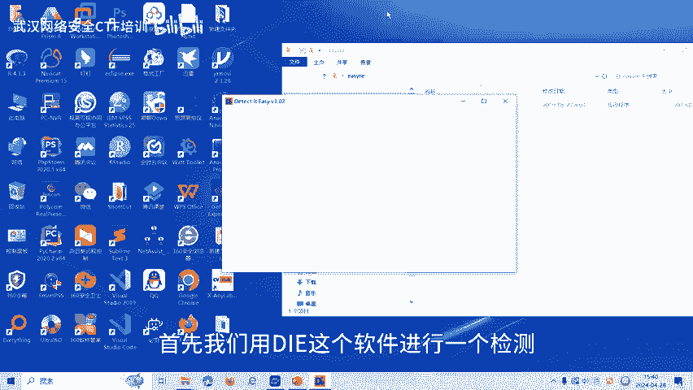

我们通过DIEdetect it。检测它发现了它是1个64位程序，对不对？64位程序啊。64位程序，然后呢，我们再找到64位的一个反编译软件，叫IDA。IDA有32，也有64。那我们找一下64。

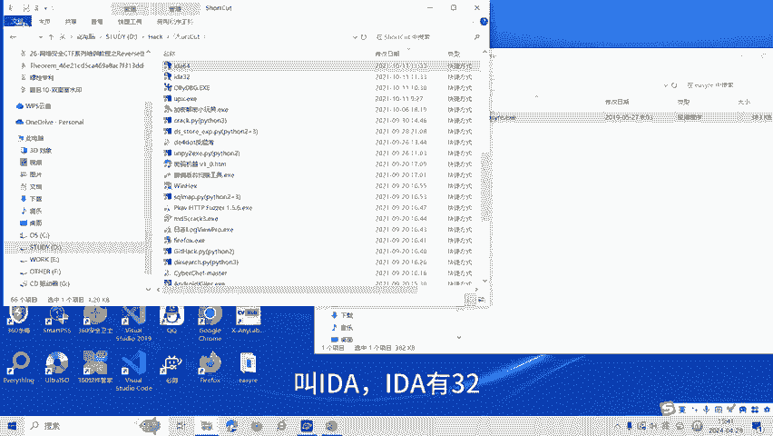

🎼将文件拖到IDN6点OK。て意。嗯。按一下F5进行一个。返汇编啊，反名叫它叫汇编代码的，然后呢。变成了一个。C元啊类似于C元的一个代码。输入两个数字，A和B，如果A和B相等，就会输出这一个flag。

对不对？这个负列表我们通过反汇编就会得到。这个是用出来的，就这个。

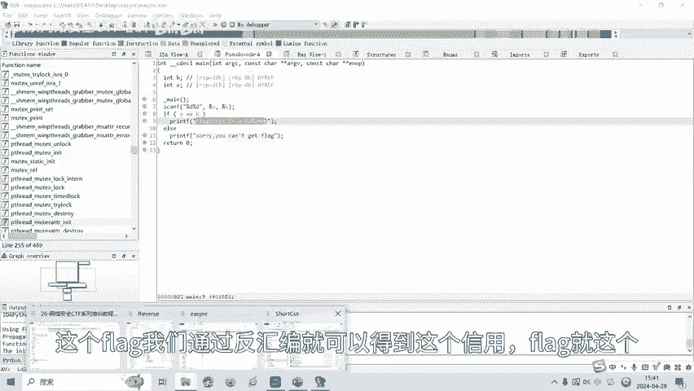

我我看一下，然后他让我输入两个数字相等，我们看一下。

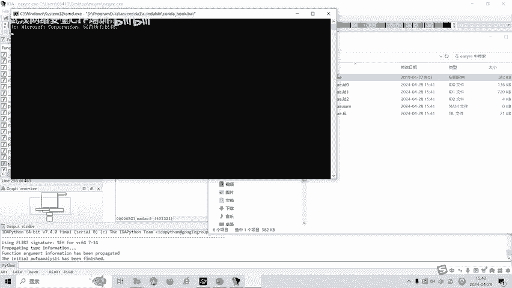

EZRE点EX1。我们输两个次，比如说12和12按全回车，诶，那那就对了。如果是13呢？1314发现就不对。

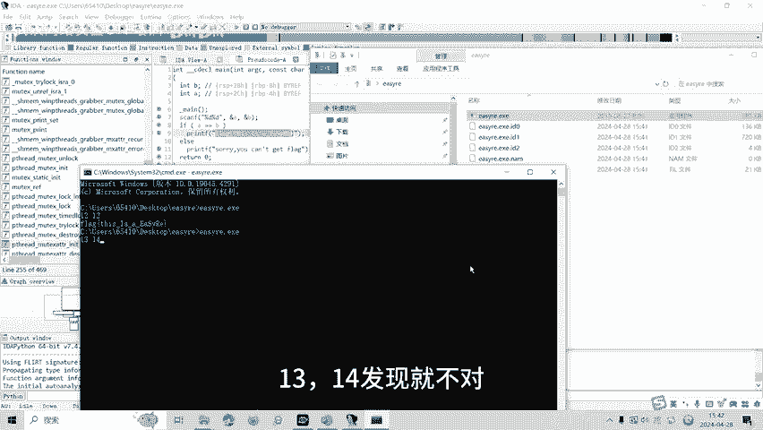

还有一种方法呢，比如说通过view open sub view啊，也就是我们一个查看字格串。用shift加1F12快捷键也可以查看，也可以找到呢fllash，对不对？也就是说做立项题。第一步。

我们首先可以通过一个呃shiftif的F12查看字符串，看一下字符串里面有没有flag。第二个呢就是通过按F5进行一个呃通将汇编代码呢变成变成我们一个VC语言的一个代码。通过来分析这个结构啊程序。

来得到这个flag啊，找到flag。比如说直接查看有flag。或者呢我们通过程序判断啊，阅读代码代码审计发现呢要输入两个整形，两个int型整形要相等就可以找到flag了，对不对？

我们就直接运行程序就可得到这道题目的flag。

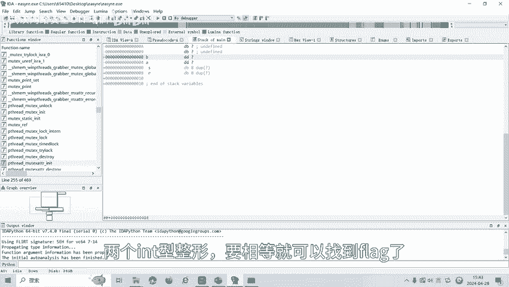

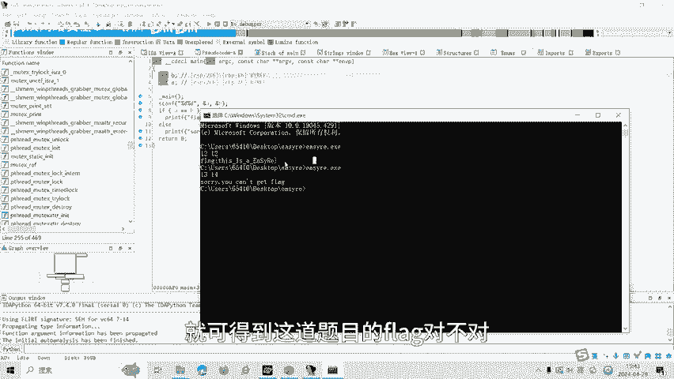

对不对？CT部比赛中呢reverse立项呢还有动态调试、画指令混淆等多种解题方式。后面呢我们将会针对各种类型的立项题目制作相应的教学视频。大家呢也可以扫描视频中的二维码领取资料，或者呢报班学习。好了。

今天的课程到此结束，感谢大家的观看。🎼And为。🎼再见喽。

