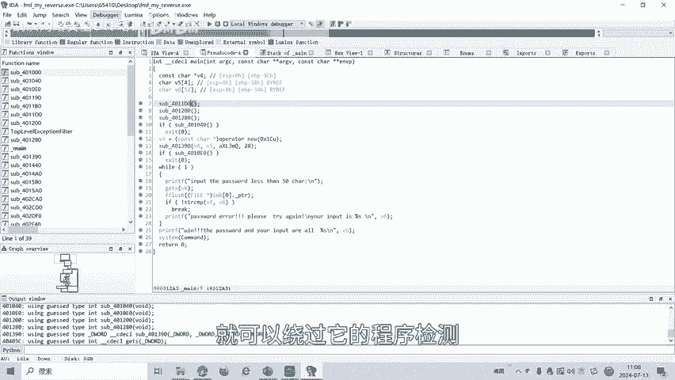
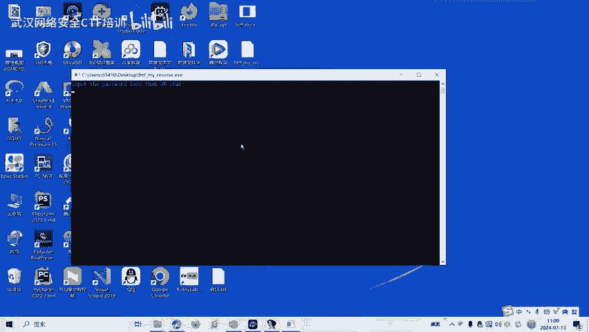
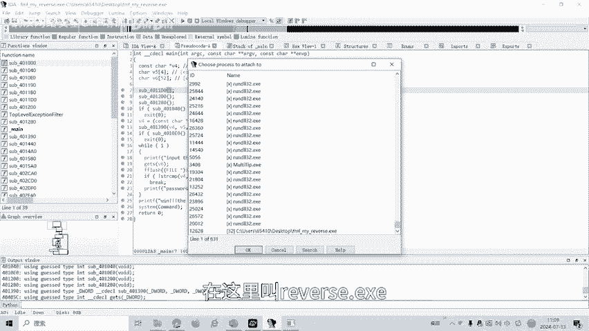
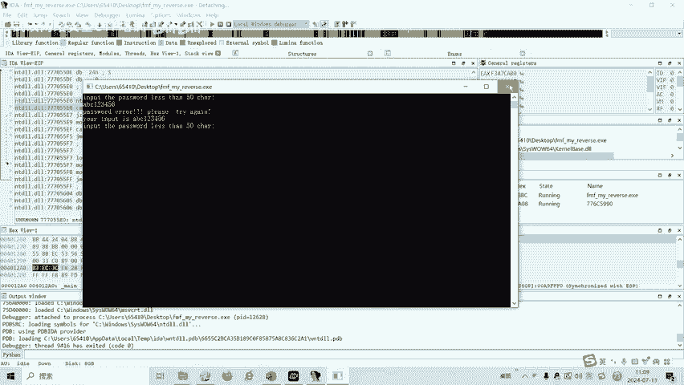
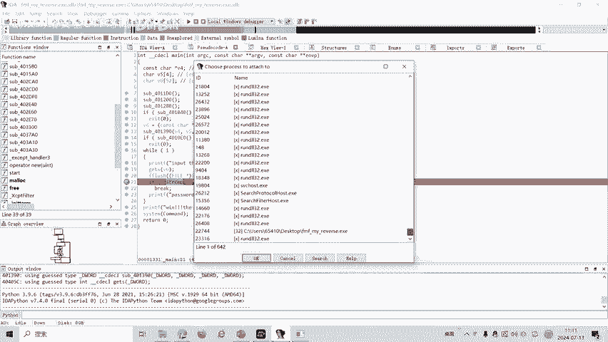
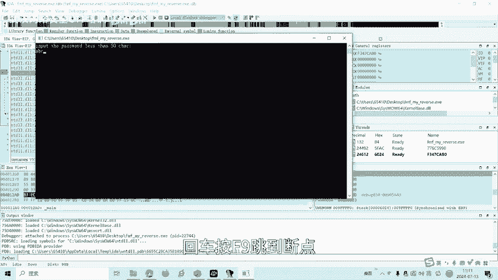
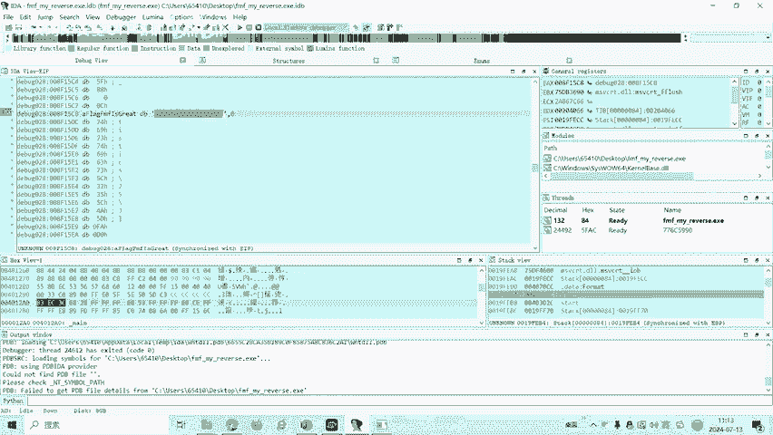
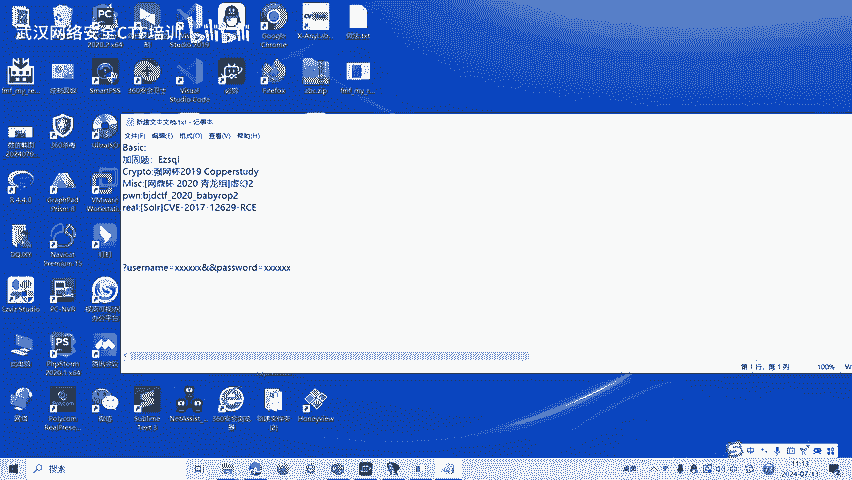
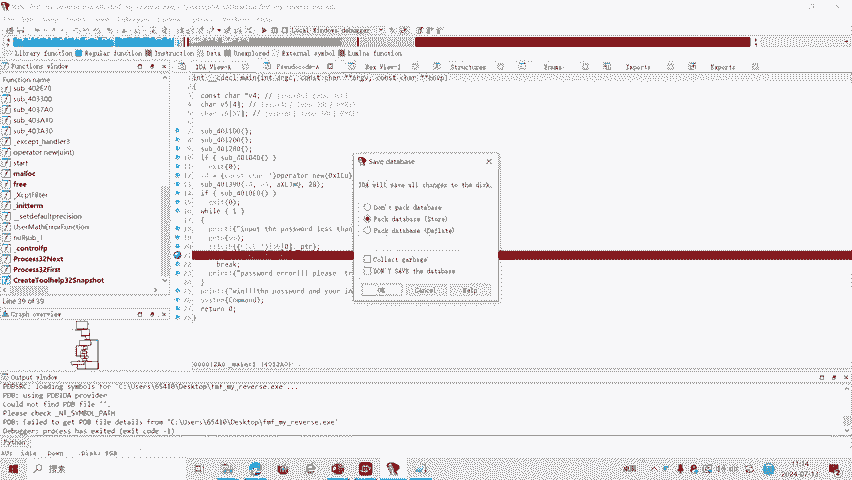
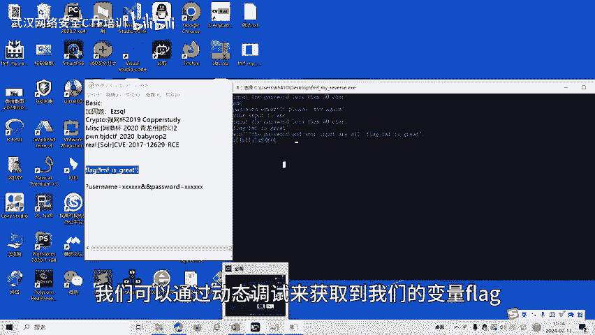

# 27-网络安全CTF系列培训教程之Reverse逆向篇-动态调试 - P1 - 武汉网络安全CTF培训 - BV1jm421g7qq

大家好，我是阿阳。我们制作此视频的目的是希望帮助一些想要学习CTF的同学，快速入门，提高CTF竞技水平。本视频为CTF网络安全系列培训教程，后期将会持续不断的更新。大家如果有兴趣进一步深入学习CTF。

可以访问PPT上面的公司网址进行电话联系，或者扫描视频中的二维码，进行报名咨询，也可以免费领取我们的教程资料。我们的教师团队均来自CTF省赛世赛前十名的选手，通过顶尖战队的手把手指导，大家学完之后。

即可达到省赛世赛的夺奖水平。首先，大家一定要遵守网络安全法。本课程内容仅用于CTF网络安全教学培训，请大家遵守相关的法律法规，勿用于其他用途。今天这节课主要是讲CTF比赛中的reverse立项分析。

立项分析主要是将二进制机器码进行反汇编，得到汇编代码，在汇编代码的基础上进行功能分析。经过反编译生成的会编代码中呢，缺失了源代码中的符号、数据结构等信息。因此呢需要尽可能的通过立项分析还原以上信息。

以便分析程序原有的逻辑和功能。逆向分析分为静态分析和动态分析。这节课主要讲动态分析的动态调试。那么什么是动态调试呢？动态调试是指软件作者利用集成环境IDE自带的调试器跟踪自己的软件运行。

来协助解决自己软件的错误。一般的话呢我们可以使用IDA和ODBG来实现动态调试。做reverse逆向分析题的时候呢，我们可以采用动态调试的方法来获得CTF比赛中的flag。

最后我们讲一下立项分析的十道题目。我们呢主要讲动态调试。我们可以看到桌面有1个ESE程序。那我们呢首先。通过DIE这个软件检测一下它是多少位程序。啊，拖进来，我们发现是1个32位程序。

那么我们就采用IDA32。Mei。啊变硬啊会边。将我们程序拖进IDA32。🎼我们按一下F5。进行完毕。这个时候就可以看到内函数伪代码。我们在这里输入一个密码。小于50个字符的密码。

然后呢把这个用户输入的值保存在V6这个变量里面。然后比较V6跟V4，如果是相等的话呢，那么就说你是正确的，否则呢就错误。那么我们就要通过查看。动态调试查看V4值到底是多少，我们在这里直接查看是看不到的。

只有程序运行的时候才能看到动态调试的时候呢，才能看到V4的值是多少。有时候V4的值呢很有可能就是我们的flag。这让我们看到前面还有三个函数，我们可以看下前面什么函数。点进去看。

我们可以看到它会检测我们有没有进行调试。如果是在进行动态调试，就会返回。2。然后去之后呢就跳出这个进程，跳出我们的程序。也就是说我们呢。要绕过绕过它的debug检测。如果。被他发现我们在断调试。

那么这个程序就无法断断调试就会会被跳跳出来。那我们的IDA呢有一个防止动态检测的一个过程，叫做attach plus。也就是说呢我们首先打开我们EC程序，打开之后呢。

我们再把这个程序呢唉tach到这里面来。就可以绕过他的。

程序检测我们就可以实现我们的断调试。我们现在把这个程序打开，打开之后呢，我们再attach一下。

找到我们的程序，在C盘桌面上面。在这里。

叫reverse等于一，我们点O。实现了。这个动态小示。我们这里输入AB。See？123456，我们假如说密码是这个，然后按回车见。F9。我们好像没有打断点嘛，有没有打断点？没有打断点，我们再来一下。

停止。把关掉吧。再打开一下。这个地方我们要设置个断点。爱玩爱玩。9个事半年。你可以按一下试一下。A删除A有设置，可以设置断点。然后呢，把这个程序打开。打开之后呢，我们再attach一下。

O。在这里面输入ABC。回撤。

按F9跳到断点。调断点地方。这个时候我们就要跳到断点地方了。我们可以看这个这里有一个比较的值，就是比较。我们按F8。全部跟踪。比较。我们输入值与我们的。这是我们输入的ABC。这是我们输入的值。

然后这里的D点呢就是我们的。这比较这个值。然后DR值是来源于EAX看ES计算器复制给DR。那我们这个地方呢就在我们的E电算器呢，就可以看到我们的值就是flag。这个呢就是我们。f个的吃。

在我们ES计算器，我们选择跳到我们ES计算器就可看到。

好，我们结束掉我们的调试。关掉。

这个时候我们直接运行这个程序看一下。fllaag是不是这个？假设我们输是ABC。回车。他会让报错。那么输入之后我们刚刚获取到了flag。Bag。Yes思。Great。回去。正确。

所以这个呢就是我们动态调试。当我们静态分析，如果获取不到我们的flag值的时候呢，我们可以通过动态调试。

来获取到我们的变量flag。CTF比赛中的reverse立项呢，还有画指令混淆等多种解题方式。今天呢我们讲的是动态调试。后面呢我们会针对其他的各种类型的立项题目呢制作相应的教学视频。

大家呢可以扫描右侧中的二维码进行。免费的资料领取或者呢报班我们的CTF培训。好了，今天的课程到此结束，感谢大家的观看。

