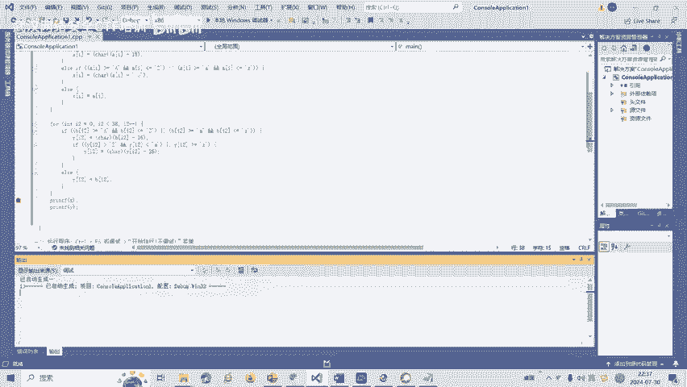
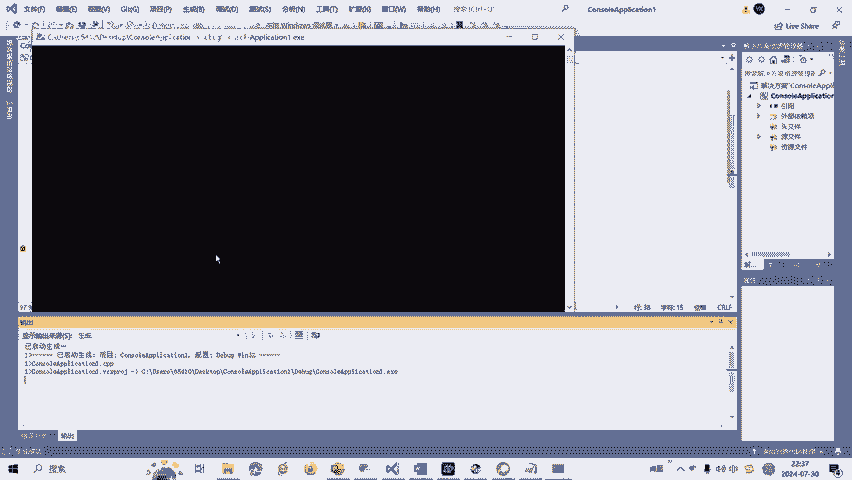
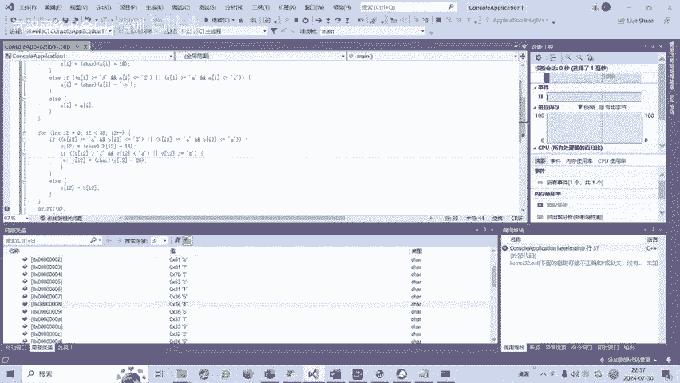
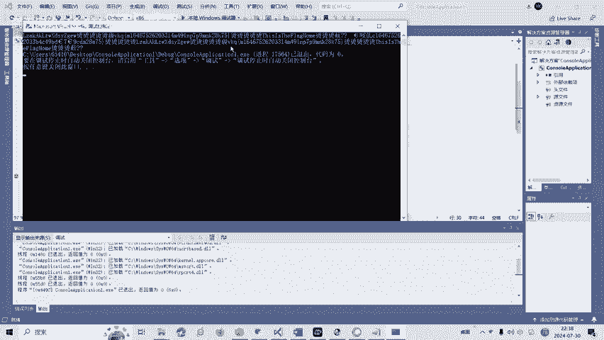
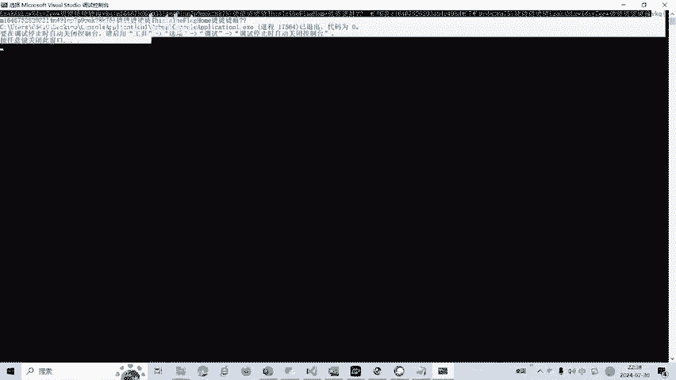
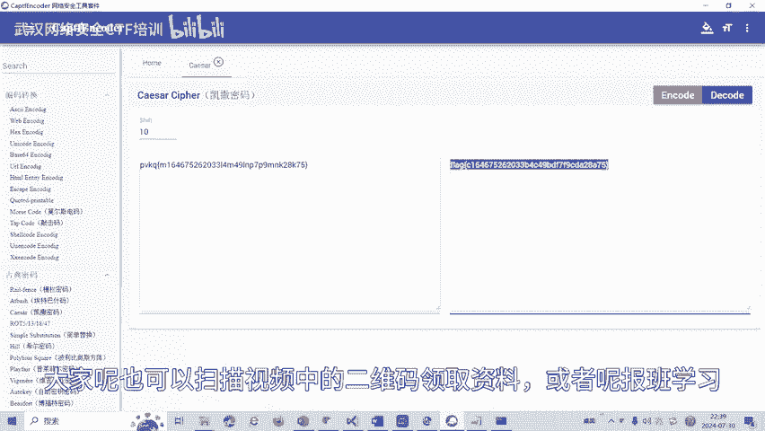

# 28-网络安全CTF系列培训教程之Reverse逆向篇-安卓APK - P1 - 武汉网络安全CTF培训 - BV1vzv1eqEZA

大家好，我是阿阳。我们制作此视频的目的是希望帮助一些想要学习CTF的同学，快速入门，提高CTF竞技水平。本视频为CTF网络安全系列培训教程，后期将会持续不断的更新。大家如果有兴趣进一步深入学习CTF。

可以访问PPT上面的公司网址进行电话联系，或者扫描视频中的二维码进行报名咨询。我们的教师团队均来自CTF省赛世赛前10名选手，通过顶尖战队的手把手指导，大家学完之后，即可达到省赛世赛的夺项水平。首先。

大家一定要遵守网络安全法。本课程内容仅用于CTF网络安全教学培训，请大家遵守相关的法律法规，勿用于其他用途。今天这节课主要讲CTF比赛中的reverse逆向分析。立项分析主要是将二进制机器码进行反汇编。

得到汇编代码，在汇编代码的基础上进行功能分析。经过反编译生成的汇编代码中缺失了源代码中的符号、数据结构等信息。因此呢需要尽可能的通过立项分析，还原以上信息，以便分析程序原有的逻辑和功能。

这节课呢主要是讲安卓APK的立项。那么什么是安卓立项呢？安卓立项开发是指利用各种技术手段对安卓应用程序进行立项分析和研究，以了解应用程序的内部机制，发现应用程序中的漏洞、脆弱性或者安全问题。

并提供相关的解决方案。好，我们看一下安卓立项的一个实操题。这里呢有一个安卓的APK。我们用安卓立项工具打开。选中这个APK文件。点击打开。我们可以看到这个主函数。一个变量A一个变量B。然后A呢。

它是有17个字节，我们可以数一下，B呢有38个字节。然后相当于把X值X这个数组通过用A的一个变化复制给X。Y呢同样的也通过。B数组的这个变化，0到38。进行一个变换，然后复制给Y。我们需要。

用户的输入是吧，get text。和它相等，然后呢我们再输出Y。那我们来看一下。首先我们一般的编程就会知道PVKQ。这个呢和flag呢。是很相近的，只相相差多少个X码值呢？我们可以看一下。PVKQ。

Blaag。那想上多少？P是112。然后呢，F呢是107相差5。哦，F是102相法00，因为中间有空格，空格是32。我可以试看看我要空格看看。那我就把空格删掉。112和102相差时。那么V呢是118。

L呢是108，也相差1107和97相差10，113和103相差时。也就是说PUVKQ和flag呢是X码值相差10。那么呢。是不是像凯撒密玛？我们就可以把这个纸复制出来，看看是不是凯三米码。凯撒密码。

这样复制吧。把这个呢替换成空。这个呢也替换成科。空格也替换成空。然后进杰码，这个呢就是fl。还有一种做法呢，我们就把这个代码。复制到我们的C代语言里面去。A和B。

然后把这个和这些代码XY这种变换代码都复制进去。最后我们输出XY我们再设个端点。直接代码都会以直接复制的，因为它和C语言是基本上是一致的。我们按F调试一下。

我们可以看到B是这个A是这个。然后呢，变换之后的Y我们可以找到。Y是C164和这个是不是一样的。C164我们发现Y是一样的。

不知过来看一下。应该是复制只在这里复制。我复着下。这个呢就是我们的。我们就把这个。Fage呢。获取到了。关于的安卓立项呢，我们除了安卓立项呢revis立项中呢还有画指令、混淆等多种立项解题方式。

后面呢将会针对各种类型的立项题目制作相应的教学视频。大家呢也可以扫描视频中的二维码领取资料，或者呢报班学习。

好了，今天的课程呢到此结束，感谢大家的观看。🎼まさか？🎼まさか安らが。まさか？