# 29-网络安全CTF系列培训教程之Reverse逆向篇-python逆向 - P1 - 武汉网络安全CTF培训 - BV1uWakegEKj

大家好，我是阿阳。我们制作此视频的目的是希望帮助一些想要学习CTF的同学快速入门，提高CTF竞技水平。本视频为CTF网络安全系列培训教程，后期将会持续不断的更新。大家如果有兴趣进一步深入学习CTF。

可以访问PPT上面的公司网址进行电话联系，或者扫描视频中的二维码，进行报名咨询。我们的教师团队均来自CTF省赛世赛前10名选手，通过顶尖战队的手把手指导，大家学完之后，即可达到省赛世赛的夺奖水平。首先。

大家一定要遵守网络安全法。本课程内容仅用于CTF网络安全教学培训，请大家遵守相关的法律法规，误用于其他用途。今天这节课主要是讲CTF比赛中的python逆向分析。我们先看一下python的运行原理。

python是解释型语言，没有严格意义上的编译和汇编过程。但是呢一般可以认为编写好的python源文件有python解释器翻译成以点PYC为结尾的字编码文件。PYC文件是二进制文件。

可以由python的虚拟机直接运行。也就是python源码，然后呢，经过pyython的解释器。变成了点PYC2进制文件，然后呢在我们的python虚拟机运行这个二进制文件这个程序。

python代码的编译结果呢是。PY code objectject对象啊，这个对象呢可以由序拟机加载后呢直接运行。PIC文件呢就是PY code object对象在硬件上的保存形式。

也就是PIC文件保存的是PY code objectject对象。然后呢。这个对象是。在硬盘上的一个文件的保证形式，并且呢在pyython讯机。

然后运行这个按键制文件运行pyythoncode object对象。那么呢什么是python逆向分析呢？python立项通常指的是利用python语言对某个软件、应用程序或者网络服务进行立项工程的技术。

常用的python反编工具，如uncomp6，可以将python的字建码也是PSC文件。反编译成为pyon源代码。最后呢我们讲一下python逆向分析的实操题目。我们可以看到。

这里有一个安衡8月赛的EXE。然后呢，通过屏幕的文件PY点一滴，我们可以猜测。

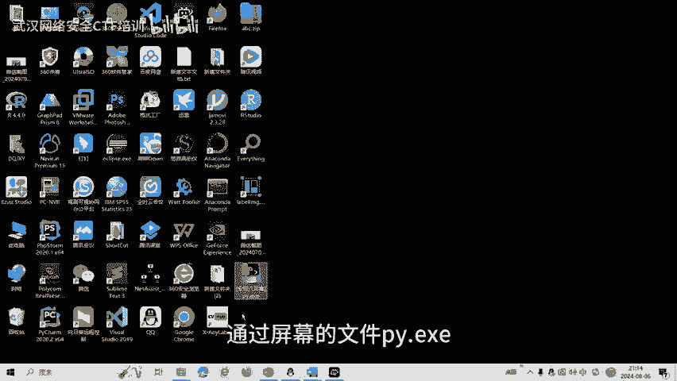

它呢很有可能是一个python点1个Z程序。

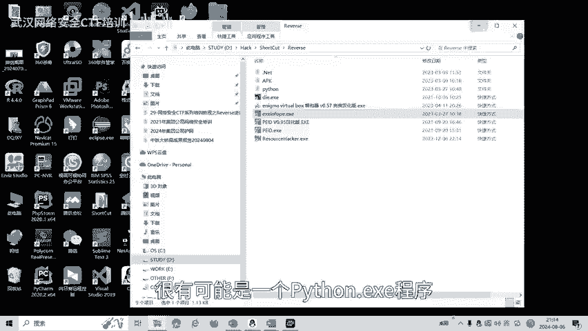

我们把它放进来，可以看到它是由PY in store。然后生成的打包生成的一个一一程序。是由pyon语言编写的。那么遇到这样题目怎么做呢？

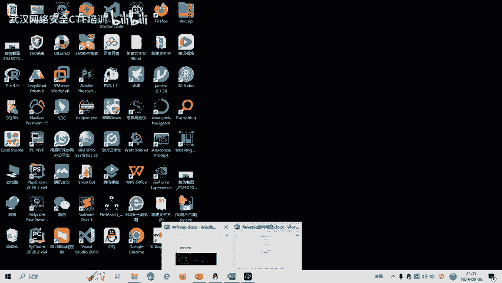

首先第一步，EZE程序是不是应该把它反编译成为PYC之间码？

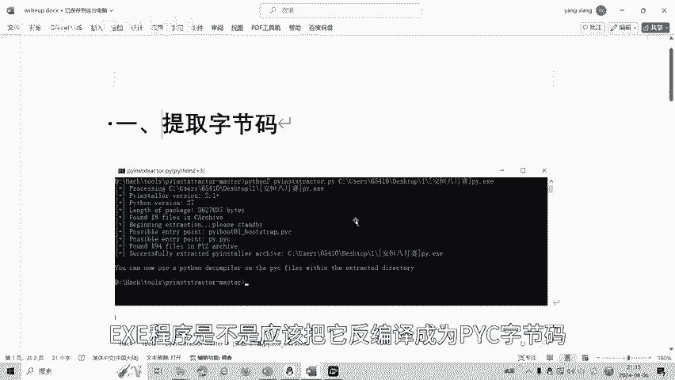

让我们试一下。

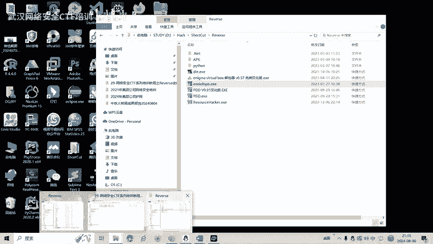

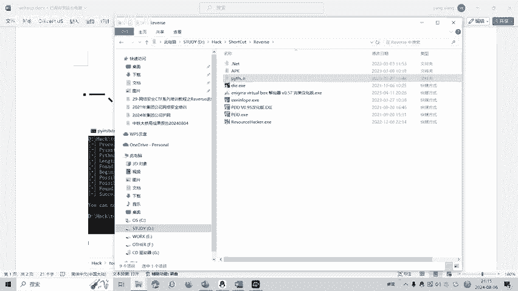

拍子里面有一个。

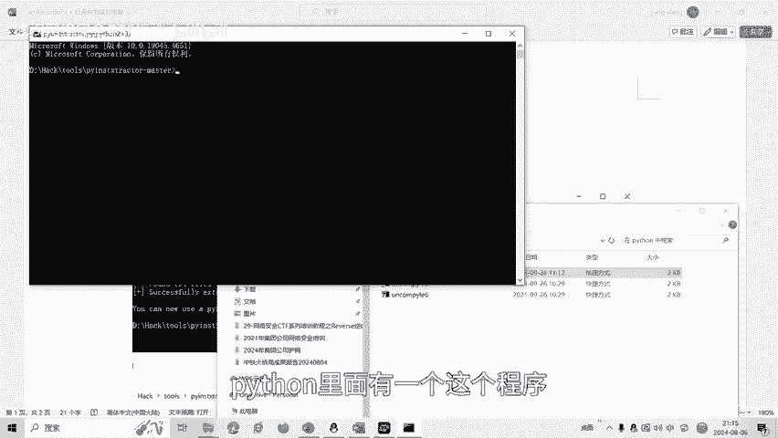

这个程序。然后我们输入一下命令。

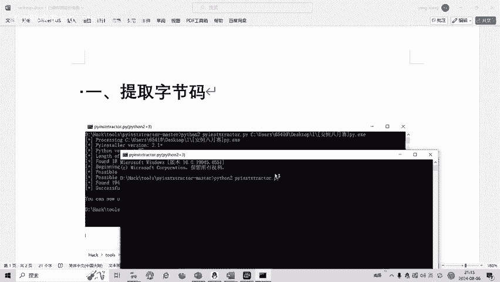

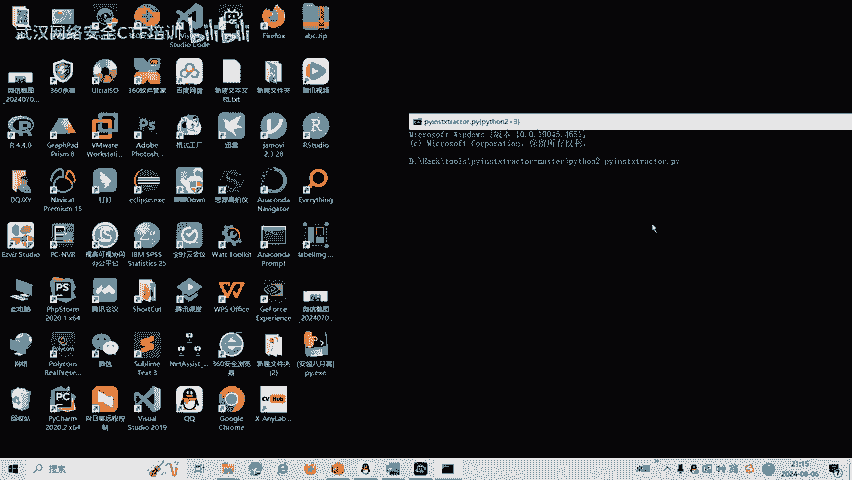

文件拖进来。

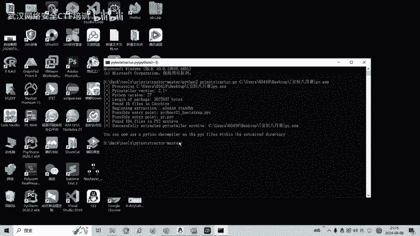

我们再看一下生成的目录。

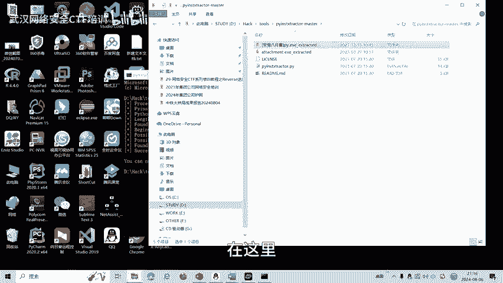

在这里。又生成了这个PYPYC。程序。

啱系。拷没出来。自接嘛提出来了。然后呢，我们再进行一个反变一，将字检码。反变译层。拍摄语言。U N。COMPYLE。杠红输出。

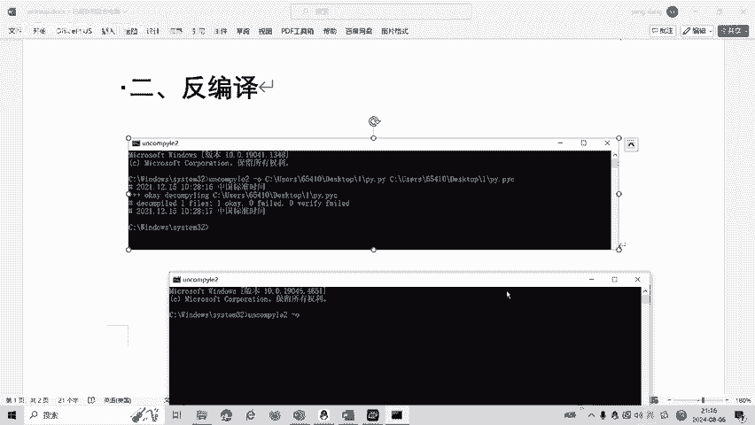

输出是什么呢？我们就把书上。PY。白色后缀。

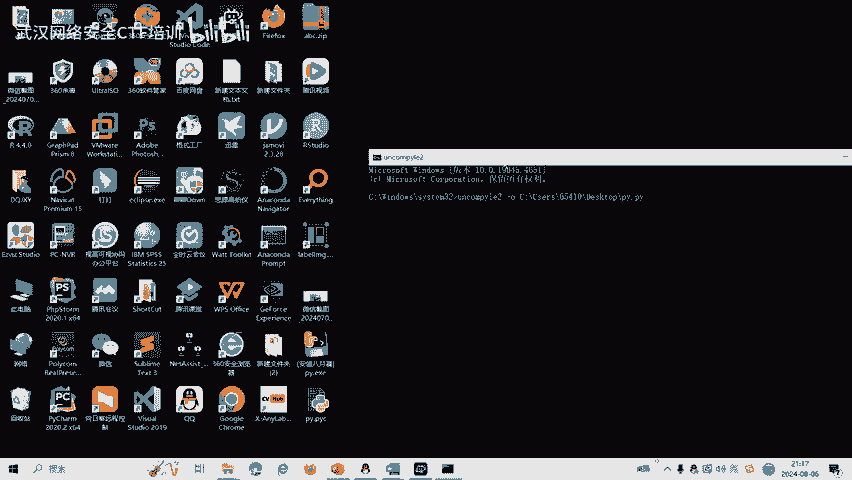

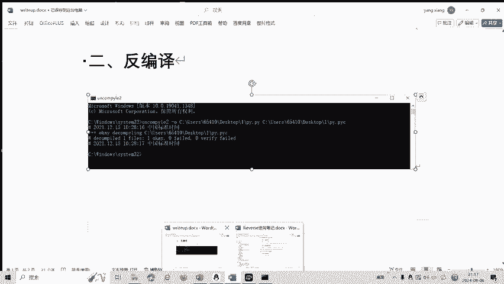

最后火车。O。

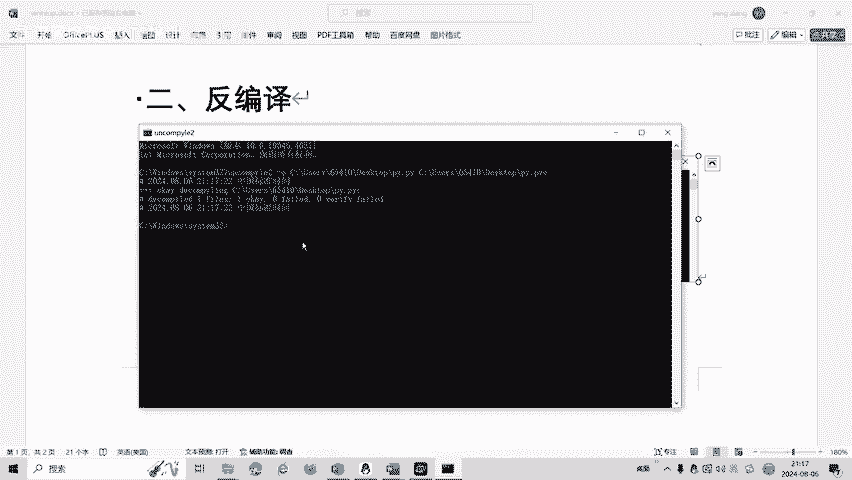

我们看一下PY这个程序就出来了。

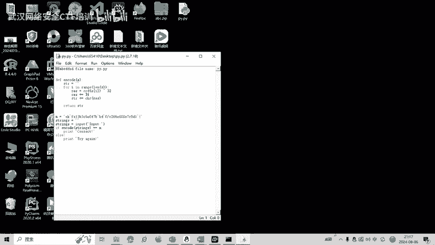

也就是说，我们反变页得到了pyython源代码。源代码呢，我们通过分析源代码，我可以知道铭文是这个。然后呢，对这个用户的输入进行一个编码，编码呢是便利这个字符串。然后呢，首先先将它与32进行个异惑。

然后呢再加上31。比如说我们进行一个抵扣的编码，抵扣的呢就是一个。反编码。我们这个编码呢，因为异货操作是可逆的，所以验货操作呢，我们就可以先执行一个减31，把结果的一个减31。

然后呢再抑或32就得到我们的。白吗？那我们再看一下这里我把书的第扣的。交换一下他们的顺序就行了。减31。SI减31，那就是S。Okay。我地。As I。他的只能减去31。然后呢，RES呢就等于。

然后再让他进行一个抑货32。一会损伤。最后呢我们就把它。这个它就M。立刻的。嗯。Pring的。Stins。预习一下。

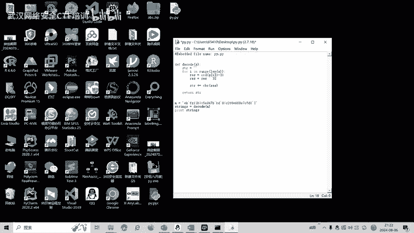

这就是我们的。看一下结果对不对。

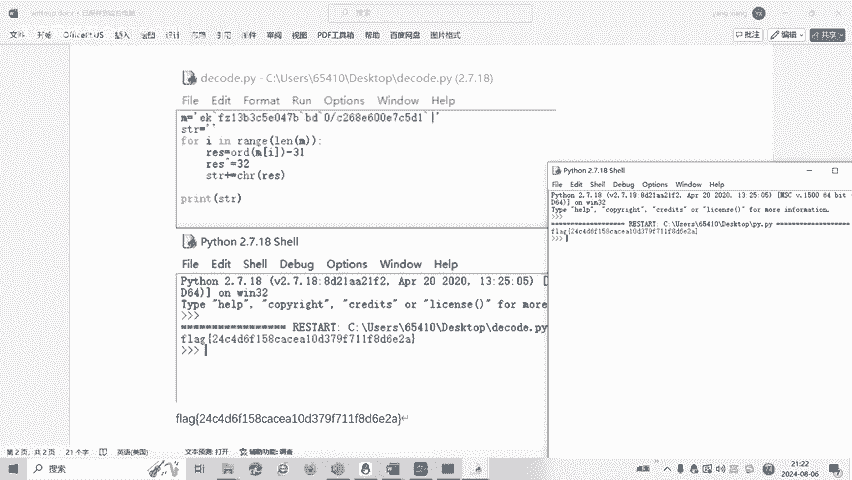

两本一模一样。CTFV比赛中呢，reverse立项，还有换指令混淆等多种解题方式。后面呢将会针对各种类型的立项题目制作相应的教学视频。大家也可以扫描视频中的二维码，领取资料或者报班学习。好了。

今天的课程到此结束，感谢大家的观看。😊，🎼まさか。🎼まさか安らが。まさか。