# 3. IDA使用方法 - P1 - roderick01 - BV1M6421w79Y

大家好，我是roadrick。从今天开始，我将给大家带来一门名为快来胖一胖的系列公开课。大家可以在哔哩哔哩或者youtube上面观看公开课的系列视频。下面有我的个人博客地址，以及我的个人邮箱地址。

大家在观看视频的过程中，如果遇到了什么问题，都可以发邮件与我交流，或者直接在评论区给我留言。右下角分别是山海关安全团队的微信公众号和我个人博客的微信公众号，欢迎大家扫码关注。

特别是我的个人博客微信公众号。关注后，你将能及时收到最新的课程视频信息。本节课是快来胖一胖系列公开课的第三节课，主要讲解挨打的使用方法。我将从以下五个方面。依次进行介绍。第一是对挨打。

进行一个简要的介绍。第二，介绍艾da的常见的界面。第三，介绍idda中最常用的一些功能。第四，重点介绍如何使用idda进行远程调试。第五，我会分享一些学习资料，包括艾da的下载地址。

推荐的插件以及一些idda pro相关的学习资源。首先是艾da的简介。艾da是一款著名的反编译软件，它的全称叫interactive disassembler，也就是说它是一款交互式的反编译软件。

那么在右边我们可以看到艾da的简介，这个简介是我从官网摘抄过来的。艾da pro是一个强大的反编译器和一个通用的多样化的调试器。艾da已经成为了分析有害代码的事实的标准。

并且可以作为漏洞研究和商业验证的标准。那么我们说艾da有哪些功能特性呢？首先它是一个交互式的软件。其次，它是可编程的。挨打提供了IDC这种脚本语言。以及还提供了id打pyython的接口。另外。

id打是支持多架构的。也就是说。它支持叉86指令集arm指令机mps指令集等等。此外，艾打是可扩展的。所以我们在这里总结到艾da是一个反编译工具，调试工具和一个代码分析工具。在这里。

还给大家分享一个小知识。就是挨打软件上面的logo的这位女性，她是谁？那么从危基百科上，我们可以知道。他是。法国国王。路易十四的一个秘密的情人。

因为维基百科上使用的是secretly married秘密结婚。那么在in popular culture我们可以看到。艾打 pro使用了这位女性作为她的logo，也就是抹红框所标注的部分。

那么我愿意把它称为逆向女神，或者说她是古希腊掌管逆向的神。接下来给大家介绍一下艾打的文件目录。挨打的文件目录层次非常清晰，我们重点需要关注的是以下几个目录。第一个CFG目录。里面主要存储挨打的配置文件。

第二个。第八个收份目录。里面存储了调试的一些服务器程序。我们在使用远程调试的时候，经常会使用到这个目录下面的文件。接下来是plug in目录，这个目录是插件目录。也就是说。

我们所有下载的id打插件都要放到这个目录下面，其他的目录可以不用特别的关注。在下面我们可以看到id打的安装目录下还有两个可执行文件。一个叫艾da点EXE。一个叫挨打64点EXE。

那么他们分别对应的就是解析32位的程序和64位的程序，右边是关于idda调试服务器目录，也就是debug server下面的一个详细的文件列表。从红框中我们可以看到，我们重点需要关注的是两个文件。

第一个是lininux server。第二个是lininux server64。我非常建议把这两个文件拷贝到你的linux机器上。当然这里拷贝的前提是你的宿主机是windows。也就是说。

当你在windows上面使用ida来分析和调试程序的时候，你需要把这两个程序拷贝到你的linux机器上。这个机器可能是位于WSL系统，或者说位于你的VM well。虚拟机软件接下来我会介绍一下。

挨da的常见界面。首先，当我们打开idda不载入任何文件的时候，所显示的原始界面是这样的。这里我演示的版本是idda pro7。7，并且是idda64。EXE在最上面一栏是菜单栏。

可以看到菜单栏有非常丰富的按钮，接下来是操作栏。也就是说一些快捷操作会被定义在操作栏。然后中间这一个灰色的区域可以拖拽二进制文件。下面的output主要是一些日志的信息。比如说你的插件报错了，或者说。

你的pyython。交互窗口的输出也会显示在这个窗口，在输出窗口的下面就是一个交互式的pyython命令行。那么我们来看一下菜单栏下面有哪一些具体的功能。文件按钮下主要是与文件操作有关，可能是打开文件。

导入文件或者导出文件。编辑按钮下面则是修改数据。跳转这是跳转到某一个地址，某一个符号。搜索则用于搜索函数文本或者一个数值。视图是我们用的最多的一个功能。

可以看到函数表、导入导数表等等一些很多有用的界面和窗口。调试器同则则是我们使用本地调试和远程调试的时候会用到的一个按钮。选项则用来配置挨打。窗口包含一些汇编伪代码重置等等。

帮助按钮下面则是艾da的使用帮助。接下来我们一个一个看。前面所提到的哪些窗口，首先是交互与函数窗口。交互窗口可以看到，我们在这里可以输入一些pyython的语句。而且可以使用艾达pyython的API。

还可以与插件配合使用。比如说在这里我import挨打API。然后呢，使用idda APII点get input fire pass这个API返回了当前艾da所载入的文件路径，下面是函数窗口。

可以看到在函数窗口，我们可以看到函数的名字，函数所处的段，函数的起始地址以及函数的长度。这里的长度是指的将函数编译为二进制码的字节的长度。当然这里显示的长度以及地址都是十六进制的。接下来是主界面。

主界面最上面有一个颜色分区。这个分区上面有一个浮标，当我们点击不同的颜色的时候，会把我们带入到不同的段。比如说这张截图里面，我们处于tax的段。当然，段有关的知识点现在还没有讲到，大家可以先不用关注。

然后在颜色分区的右边是一个快捷窗口，定义了一些比较有用的快捷操作。在颜色分区的下面就是刚刚所讲的函数窗口。在颜色分区的右下部分，这这是一个很大的区域，它是代表了你当前所打开的。一些子窗口。以及。

当前所显示的。汇变窗口，我们来讲一下这些子窗口是哪些窗口，以及它的作用是什么？首先是IW view窗口，这个窗口会展示一些汇编代码、调用关系窗口等等。第二个窗口是s code，也就是伪代码。

主要是显示C和C加加代码。第三个窗口是hax窗口。它是显示文件字节的1六进制表示。第四个窗口是结构体窗口，那就是用来显示结构体信息。第五个窗口是枚举窗口。显示枚举信息。第六个窗口是导入表。

导入表里面提供的是从其他第三方程序中导入的API的信息。最后一个是导出表。导出表则是当前程序为其他程序所提供的API的函数信息。接下来介绍设置窗口。打开设置窗口后。我们所看到的界面是这样的。

那么我建议把tack point这个选项给勾选上。勾选上这个选项之后。我们就可以看到函数它的堆栈是否平衡。同时我们可以把下面的number of OP code bys把它设置为一个合适的整数。

一般设置为8就可以了。设置了这个选项之后。就可以在汇编窗口看到。汇编代码的二进制字节码。很方便，我们去拷贝一些需要 code。同时有时候也可以把自动注释这个选项给勾上。在这个图里面，我并没有给它勾选上。

你把它勾选上之后。在挨打的汇编窗口会给出一些自动的注释。可以帮助你更好的理解代码。至于其他的选项，一般保持默认就好。然后我们来到了汇编窗口，可以看到汇编窗口的信息非常丰富，最左边是一个断信信。

我之所以把这个窗口称之为汇编窗口，是因为在这个时图下，我们主要来看汇编代码。虽然这个窗口还可以看数据段以及一些其他的程序段。但是。主要的作用还是text端。好，在断信息的右侧是地址信息。

比如当前start函数，它的起始地址是0叉4010B0。然后。在地址信息的右侧是站变化信息。以及汇编对应的二进制码，需要说明的是。这两个信息的显示与我前面的设置窗口有关。如果你的设置和我的设置是一样的。

你就可以看到这两个信息，否则你可能看不到他们。再然后是函数的名称以及函数所对应的汇编代码。至于伪代码窗口。我们只需要在汇编窗口的某个函数地址处按下tab键或者F5键，就可以切换到为代码窗口。

伪代码窗口中，它会给出函数的签名和函数体。比如说当前内函数。我们知道内函数它是有参数的。同时，在伪代码窗口，我们一般可以看到数据与BP指针的位置。也就是说。

这个数据它距离base point计算器的位置是多少？这非常有利于我们判断不同的数据，它的分布情况是怎么样的。比如说这里的8分数据。它距离RBP是0叉60的距离。当然需要说明的是，伪代码并不完全可信。

它的可信度有99%，但绝对不是百分之百。很多时候我们还要去分析一下汇编代码。但可以这么说，在大部分情况下，挨打给出的伪代码是正确的。接着我们来到16进制窗口，这个窗口主要显示数据的十六进制信息。

比如说窗口的最左侧是地址信息。然后右边是十六进制码。在16进制码的右侧是可见的一些字符串，它会显示在这个区域。比如在这张图中，我所截取的是1个ELF文件，它的字节信息以十六进制形式所呈现出来的内容。

可以看到它的地址不一定是以零开头的。比如说这里的地址，它是一个虚拟地址。此外，16机制码是可以编辑和修改的。在这个窗口下，我们按下F2键就可以修改数据。在最右侧，它一般只显示可见的字符。

不可见的字符会以点作为代替。我们一般在这个窗口查看数据的字节形式。接着我们来到结构体窗口。在结构体窗口的最左侧会显示当前程序所含有的所有的结构体的名称。然后在右侧的最顶部。

我们可以看到它给出了一些与结构体操作有关的快捷键。比如说创建删除结构体。新建一个结构体的成员或者重命名结构体。或结构体的一个成员，以一个具体的结构体为例。左侧显示的是成员的偏移。比如说在这张截图中。

ST name它的偏移是0。ST in four它的偏移是4。那么我们知道ST name它所占用的字节大小是4个字节。所以在右侧它会给出成员的字节长度。Egy。在字节长度的右上角。

它还会显示结构体的一些信息。比如说这个结构体它的大小是多少，它对齐是以多少字节对齐的。那么我们可以直接在结构体窗口里面操作结构体。或者我更加推荐在local types里面操作结构体。

然后是导入和导出表。导入表它含有API的名称、地址所处断的信息。导出表。还包含导出的类型。导出表所导出的可以是数据，也可以是函数。一般情况下，我们不需要特别的关注这两个表，直接看函数窗口就可以了。

下面是字符串窗口，这个窗口我们使用的频率是非常高的。打开字符串窗口的方法有两种。第一种是从view到open sub views一直到train。通过这种方式可以打开字符串窗口。

或者我更加推荐直接按下shift，加上F12就可以打开字符串窗口。在字符串窗口中，他所显示的内容依次有字符串地址。字符串长度、字符串类型和字符串内容。字符串窗口的作用。主要有两点。第一。

它用于定位关键的信息。比如说我们可以在字符串窗口中搜索是不是含有flag等字符串。此外，字符串窗口还可以用于辅助我们猜测和分析程序。对于一些比较复杂的程序。

我们需要借助这个窗口来猜测函数的功能和数据的状态。接下来是本地类型窗口，也就是local types窗口。这个窗口主要用来操作结构体。它所显示的内容依次有类型名称、类型、大小和类型描述。

打开local types窗口的方法同样有两种。我还是更加推荐使用快捷键，使用shift加F1就可以打开这个窗口。那么local types窗口的作用主要就是用于。增山改查结构体信息。并且它非常方便。

可以支持导入C结构体。然后是地址细节窗口，这个窗口我平时用的也比较多。因为在这个窗口里面，它会显示地址的很多种形式的信息。包括相关的名称，相关的描述和相关的数据。比如说在这个图里面，它所显示了当前地址。

所对应的信息以及不同类型的数据视角。你可以直接在这个窗口拷贝你所需要的。格式的数据。那么如何在挨中查看函数调用关系呢？我们可以以树状结构来显示所有函数之间的调用关系。借助这个图。

我们可以快速的定位到关键函数，分析函数的运行分支等等。那么它的查看方法是这样的，首先点击view，然后点击graphraphs，然后再点击functionction course。

就可以得到函数调用关系的图。刚刚是查看所有的函数的调用关系。如果我们想显示某一个函数的运行流程呢，我们可以在函数运行流程窗口里面进行查看。这个窗口可以用于分析某个复杂函数的处理流程。

比如说这里我所显示的是魅函数，它的函数运行流程图。那么可以看到它在处的时候所跳转的分支和在for的时候所跳转的分支是非常清晰和明了的。它的查看方法如下，同样是在graphras这个子按钮下面。

我们点击flowow chart就可以打开函数运行流程窗口。函数的运行流程窗口，还有一种更加方便的打开方式。我经常使用这种方式。它的步骤是这样的。首先我们处于汇编窗口，然后按下空格键。

接着按下ctrol键，并滚动你鼠标的滚轮进行缩放。你就可以得到和刚刚一样的函数运行流程窗口。接下来介绍一下。挨da的一些常用功能。首先我会介绍如何在挨中创建编辑、删除和修改结构体。

在这里我录制了一段视频，我首先会播放视频的操作，然后我会暂停进行讲解。好，可以看到我们通过view sub views，然后通过local types打开了本地类型的窗口。这里是在做创建结构体的操作。

你可以直接在这里输入C代码。好，大家可以看到，在这里我创建了一个名为sdent的结构体。这个结构体包含4个成员，分别是当前学生的名字、ID、分数，以及他同桌的名字。然后我们点击OK就创建完成了。

接着我们可以点击edit来修改这个结构题。比如说我把同桌姓名的长度改为32。然后我们还可以删除这个结构题。好，以上就是关于结构体的相关操作。然后我们来看一下艾da里面常用的一些快捷键有哪些。

以下的这些操作推荐使用快捷键进行操作。当然你也可以在目标符号上右键，然后选择操作动作。就是当你遗忘了某些快捷键的时候，比如说你不知道怎么重命名，不知道怎么修改函数的签名。

你可以直接在函数或者变量的符号上面右键，它就会有对应的选择。首先是N，这是重命名，然后是Y，这是修改函数签名和数据类型，然后是一个。正斜杠，这是添加杭注式。反斜杠是隐藏类型描述，G是跳转到地址。

X是查看变量函数的引用U是取消代码函数等定义。C是转为代码，P是创建函数。U加C加P是一个丝滑小连招。我们经常把这三个快捷键一起使用，然后shift加F12，打开字符串窗口。alt加T打开搜索窗口。

ctrol加W保存数据库。这里需要说明的是，保存数据库并不是cttrol加S。事实上，control加S显示的是断信息。然后conttrol加shift加W是拍摄当前数据库的快照。

建议你在修改数据库之前，先执行一下这个操作。接下来我依然会使用一段视频来演示前面所提到的那些快捷键操作。同时右下角会有一个键盘显示我当前的操作。好，这里我是使用tab键。

从ida view到s code，也就是从汇编窗口到伪代码窗口。然后我们查看了一些相关的函数。以及通过这里的参数A一和它的偏移。来思索如何建立一个结构体。好，我们首先打开了字符串窗口。

查看了一下字符串的相关信息。然后我们打开了本地类型窗口，新建一个结构体。这个结构体的名字叫book。第一个成员是书的名字。第二个成员是书的ID。第三个成员是书的价格。好，这里我们修改了当前函数的名称。

然后我们修改了当前函数参数的类型，把它更改为了一个指针类型。这样的话我们看第二行print f，它的形式就更加让人容易理解。接着我们使用了controrl W来保存当前的操作。

我们同样修改了这个函数的名称。以及这个全局变量的类型。他是一个数组。好，这里我们介入了一些注释。说明当前函数的功能。然后我们使用反斜杠，隐藏了当前参数的类型。接着我们来到了汇编窗口。这里是按下了G。

这个快捷键跳转到指定的地址。好，我们跳转成功了。这里是按下了X键。可以查看函数或变量的引用。好，这里是按下了U键，U键的作用就是把某一个地址内容显示为unified未定义的。然后我们再使用C键来创建。

会变代码？接着按下P键来创建函数，这就是刚刚提到的那个丝滑的小连招。好，以上就是。关于前面所提到的一些快捷键操作。我们接着看第四部分的内容，如何使用idda进行远程调试。需要说明的是。

为什么我不介绍如何使用I打进行本地调试呢？因为在胖方向里面，我们的艾打经常安装在windows机器上，而我们的程序需要运行在linux操作系统上面。所以我们需要使用远程调试，除非你使用。

挨打来调试PE格式的文件，这种情况下你才需要使用本地调试。远程调试有两种选择，第一种是remoteGDB第buer，第二种是remotelinux第bu个。

第一种remote GDB第bu个它需要使用idda pro和GDB server，把这两个程序结合使用。它的使用条件是。在你的linux操作系统上面，需要安装GDB server。

并且保证你的宿主机和虚拟机是网络互通的。第二种，remotelinux debugger需要把idda pro和debug server文件夹下面的。服务器程序结合使用。

使用条件是你需要往你的linux操作系统上面拷贝服务器程序，并且保证你的两台机器，它的网络是互通的。我非常推荐使用remotelinux第bu个用了都说好。需要说明的是，在这里所介绍的挨打远程调试。

其实在研究胖题的时候用的不多。在研究一些程序漏洞的时候，可能会使用的到。因为常规的胖体，我们使用GDB命令行调试就可以解决。首先介绍如何使用remotelinux第8个这种调试器。

这个调试器下面还包含两种模式。第一种模式，我们直接使用debug server下面的linux server32或者linux server64来启动程序。它的步骤是这样的。

首先我们点击idda的第八个按钮，然后选择remotelinux第八个这个调试器。然后我们再点击第八个按钮。然后点击下面的process options，就是程序设置或者说调试器的设置选项。

填好我们所有可填的选项之后，选择start process来启动程序。中间是设置的窗口，下面是窗口的每一个字段的含义，以及如何填写所需要的字段。

application需要填写在linux系统上的文件路径。input fire和前面是一样的，directy就填写程序启动所处的目录。也就是说你填写了这个参数之后，这个程序就会在指定的目录所启动。

然后是parameterters，就是程序执行所需要的参数。hos name需要填写远程linux主机的域名或者IPport填写linux server所监听的端口，这个端口默认是23946。

它是可以修改的。然后最下面就填写它的访问密码。这个模式的优点包含两点，第一，它可以在程序运行的任意位置下下断点。第二，它可以设置不同的参数来启动程序。但是这个模式也是有一些缺点的。

首先他需要设置的参数非常的多。第二，它不方便输入，不可见字符，也就是我们只能在。命令行中输入字符，我们很难在命令行中输入不可见字符。以下是模式一的一些操作细节。以及相关的截图。比如说我这里以一个。

book程序为例。我在左图中填写好了乔试book程序所需要的。每一个参数。然后我在右图中点击了start process，开始调试。调试之后，我们会得到这样的一个窗口。

我也对这个窗口进行了一个详细的说明。它包含汇编窗口、伪代码窗口，以及我所设置的断点。然后当程序被成功的断住之后，会显示寄存器区域、模块区域、现程区域。寄存器区域显示的就是寄存器的信息。

这里我们显示了16个通用寄存器的信息。模块区域就是显示当前程序所加载的共享链接库，现程区域会显示当前程序的现程。还有下面的十六进制数据区域以及占区域分别显示。16进制数据以及占的情况。

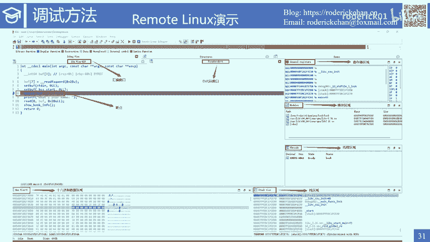

那么这是我们在linux操作系统上的状态，程序它是64位的，所以我们需要运行linux server64。然后我们的默认接听端口是23946。就是我们不添加任何参数。

直接运行这个linux server64程序，它的默认监听端口是23946。我们可以使用杠Pport改变监听的端口，这里的P是小写，我们也可以使用杠P大写来设置密码。右边的下面这个图表示。

我们使用ida成功调试了程序，并且运行到了return0这一行。然后在上面的图片则显示了当我们运行到return零这一句的时候，程序所打印的信息。在我们进行远程调试的时候，有一些常见的快捷键。

比如说使用F2可以设置和取消断点F4可以运行到光标处。F7是步入，也就是跟踪进入子程序。F8是不过，它会执行下一条指令，但不进入函数。F9是开始和继续运行程序，shift加F7是不出。

就是执行到从当前函数返回的点。

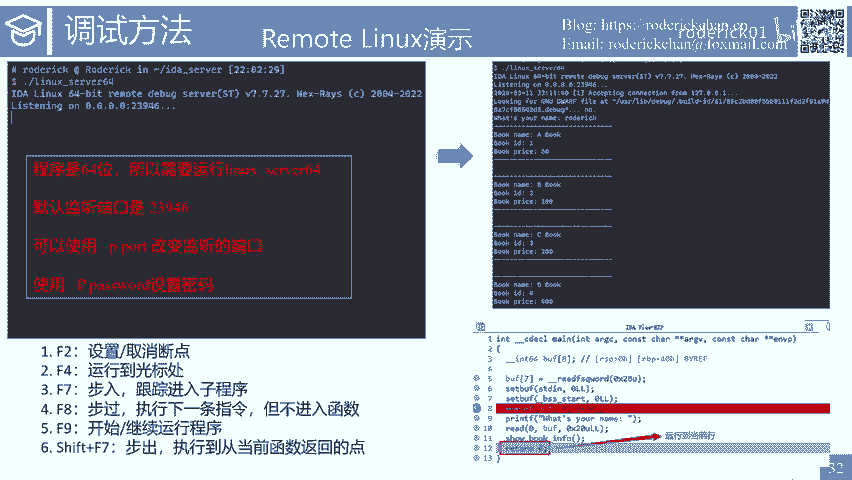

好，刚刚是第一种模式。第二种模式是我们先在linux上面启动程序，然后点击attach process，让idda server来帮我们寻找到当前linux系统上面有哪些进程。

然后使用attach的方式来调试这个进程。它的步骤是这样的。这里呢我们不需要填写那么多的参数，只需要填写好主机和端口就可以了。然后我们在linux上面启动程序。

接着来选择attach to process这个按钮，从中间这个图可以看到，我只填写了两个参数。这个模式也有一些显而易见的优点，它是可以与p兔尔结合使用的。

也就是说你可以在pyython脚本里面启动这个程序，然后给他发送一些不可见的字符。这种启动方式，它的输入参数只有两个，不用填写那么多复杂的参数。但是它的缺点也是显而易见的，就是当你运行程序后。

你需要保证你的这个程序，它运行后不会立马结束。如果它结束了，挨da server就找不到你的进程。所以程序要么就是。在持续的运行当中，或者它存在一些交互。比如说需要用户来输入一些数据。

由于它的第一个缺点，我们就知道它还有另一个缺点，就是它不方便调试交互之前的一些代码。你在这些代码的前面设置断点是没有用的。好，接下来是模式二的一些详细的相关截图。首先我们需要配置好主机和端口。

当然还需要填写application。好像不能缺掉这个字段。然后我们在linux操作系统上面运行了程序之后，我们使用第bu个。然后选择attach to process，可以查找到当前所运行的进程。

它的进程ID是18311，它的进程名字是book。

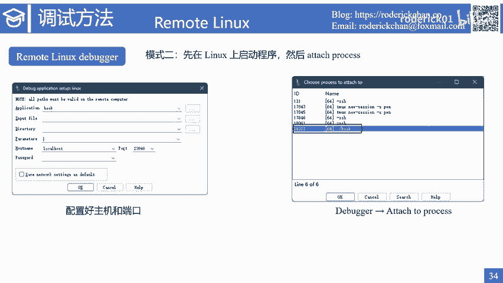

这是对应的linux操作系统上面的程序状态。通过这张截图，我们可以发现。我们仍然是先启动linux server64这个程序，然后我们再运行。当前目录下面的book程序运行完book程序之后。

inux server64会收集当前用户运行的进程，然后显示在窗口给用户选择。

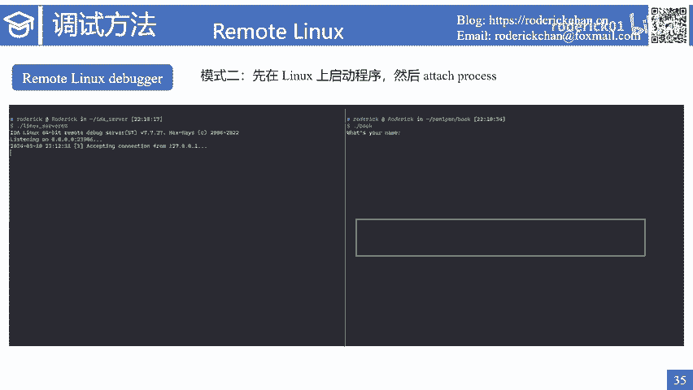

下面我依然会使用一段视频来展示如何使用remotelinux第8个来进行远程调试。首先我们选择调试器。

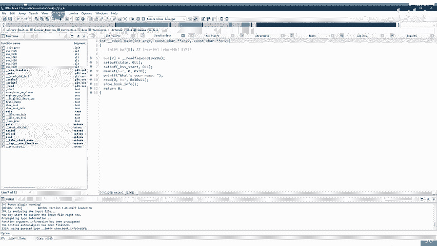

这个时候可以给大家看一下远程服务器的状态。我们启动了linux server64，并且监听的端口改为了23947，并设置了一个地码是roadrick。

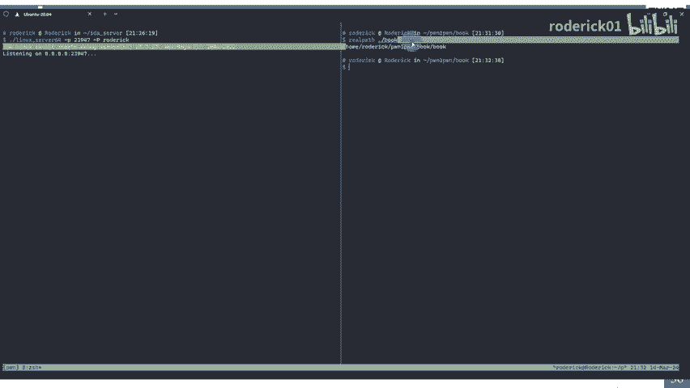

好，我们拷贝了要调试程序，在远程服务器上的路径。然后依次填写好各个参数。这里的directory直接填写。远程服务器上的目录就可以了。端口需要修改为23947。这里的主机我填写的是local host。

因为我所使用的。操作系统。是WSL发行版。我们在宿主机上是可以通过local host访问发行版里面的虚拟机的。然后填写密码。点击OK。接下来下一个断点，然后点击启动程序。

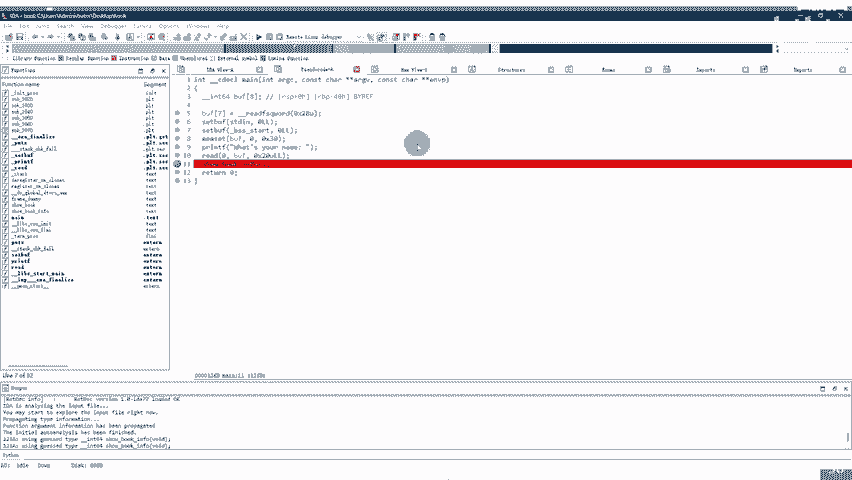

好，可以看到我们的艾da已经成功的。开启了调试。程序也成功的运行了。

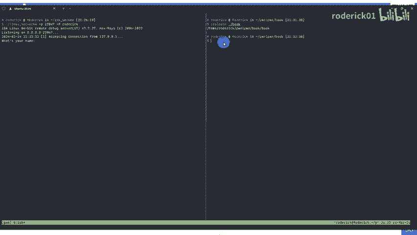

然后我们输入一些交互的内容。这里我没有选择使用快捷键进行调试，你可以点击第bu个上面的一些按钮进行步入或者步出。当然还是推荐使用快捷键。好，我们这里已经运行到的return零这一句。

然后我们去看一下远程的服务器上面的状态。

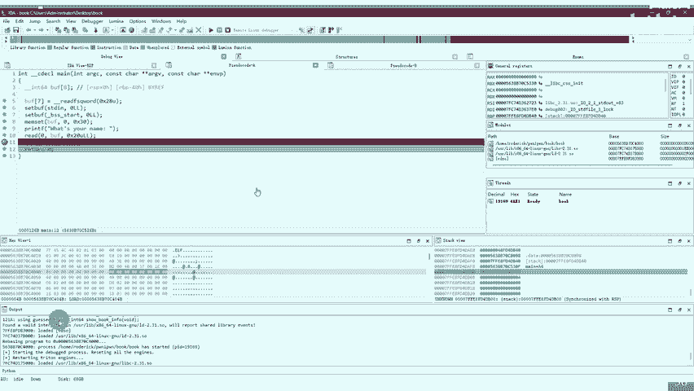

他已经成功的打印了相关的信息。

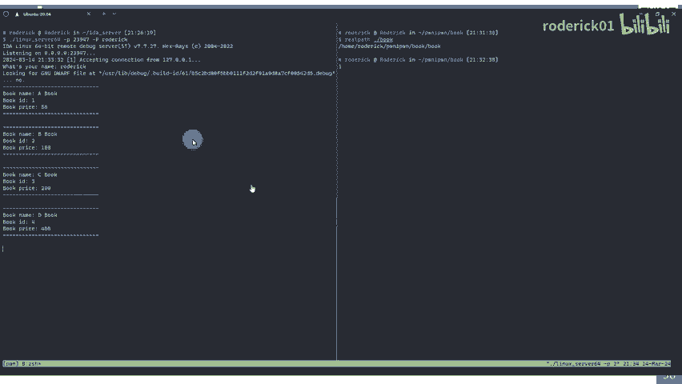

我们停止了调试。

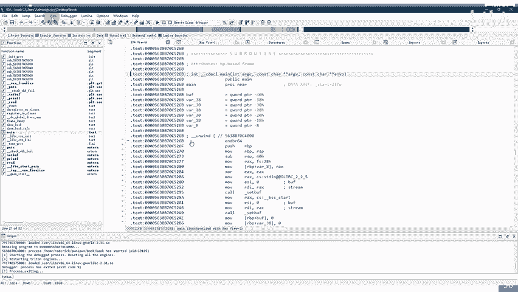

接下来我们使用模式二进行调试。首先。左侧linux server64已经开始继续监听了。然后在右侧，我们先在当前目录下运行book程序。

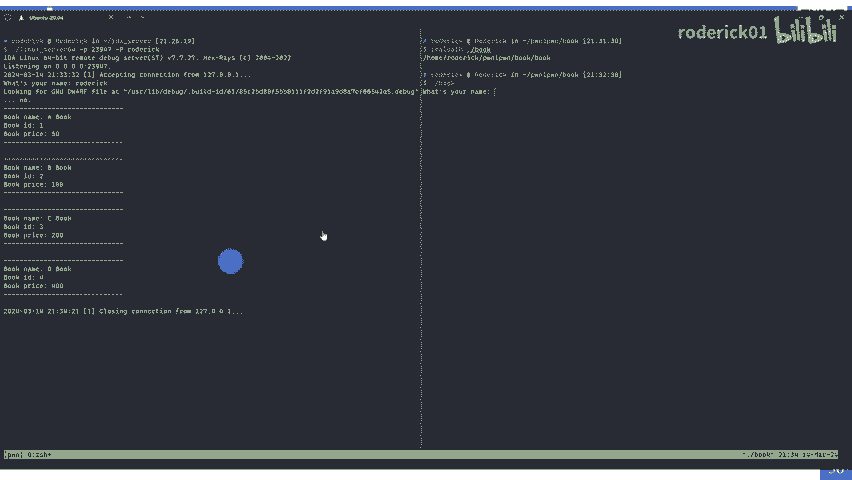

这些参数都不需要修改。然后我们点击attach to process，它就会显示出来。刚刚我们所运行的book程序，它的PID我们选中它。

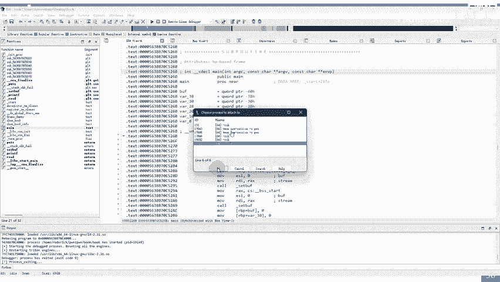

可以看到又成功开启了调试。还是输入一些内容。

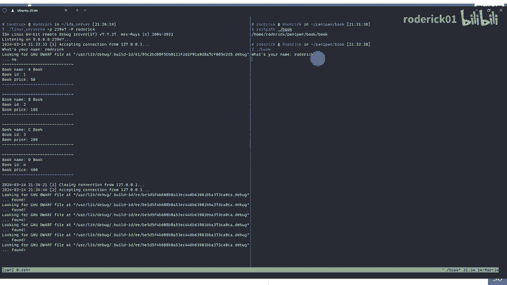

和刚刚一样，运行到了re蹭0这一句。

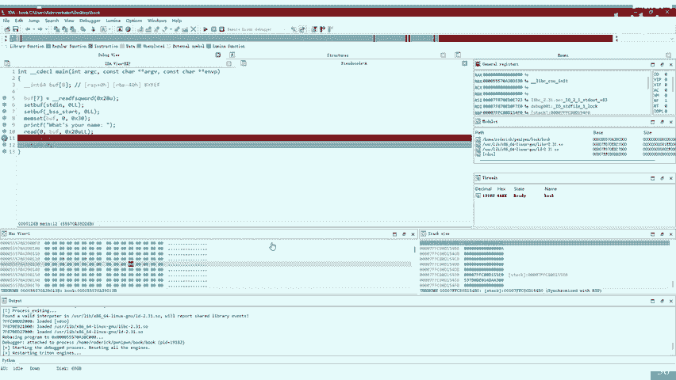

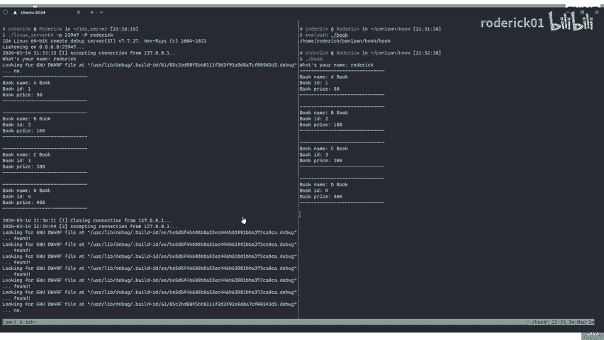

好，以上就是如何使用。remotelinux第bu个进行远程调试的演示。接下来我们继续介绍remoteGDB第8个。这种方式就是将挨打和GDP server结合起来使用。

我们需要使用GDP server来启动程序，然后填写好远程主机，以及在port这个字段上面填写GDP server所监听的端口。如右边的两张图所示，下面是我们使用了GDP server。

然后监听了1234端口启动了。book程序上面是我们在配置remoteGB第8个的时候所需要填写的两个字段。第一个是主机，我填写的是local host，第二个是port，我填写的是1234。

这里好像还是需要填写application，你可以填写为一个任意的字符。下面这段视频演示了如何使用。remoteGDB第8个这个调试器。我们来看视频。因为我是在刚刚录制的视频的基础上录制的第二段视频。

所以我先切换了调试器。然后。这些参数。除了保留application以外，其他都不用管修改一下端口。

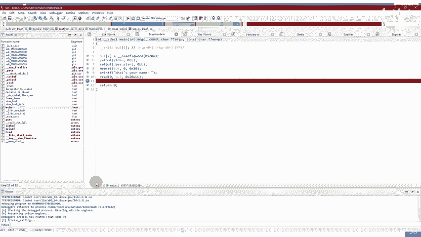

我们首先在远程机器上面使用GDP server启动目标程序。

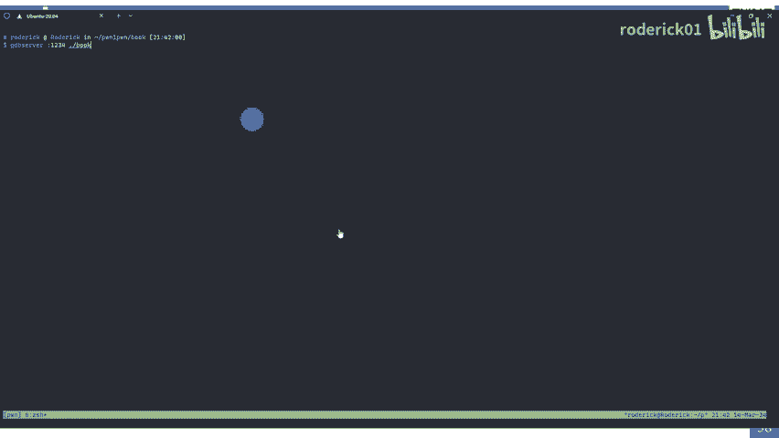

可以看到它已经启动了。我们再点击start process开启调试。点击yes。他也成功的开启了调试。

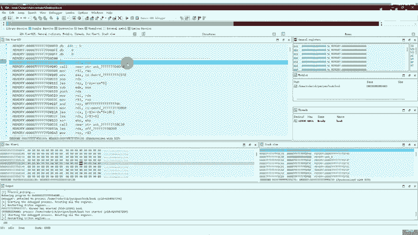

我们让程序继续运行。这个时候回到远程上面输入一些交互的内容。

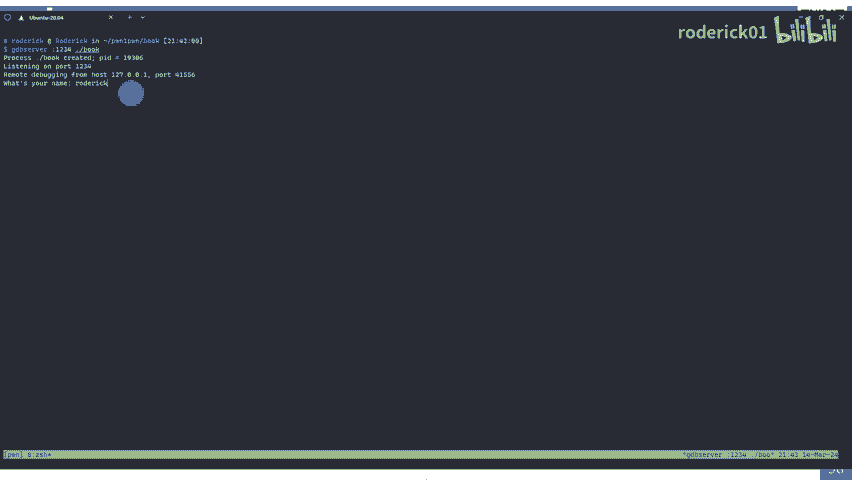

好，挨打已经成功的断在了我们的断点。并成功的打印出来了相关的信息。以上就是使用remoteGDB第8个远程调试器。最后。我来介绍一下学习使用idda pro的相关资料和资源。

adad pro可以到哪里下载呢？在这里给大家推荐两个资源下载社区，一个是看雪社区，一个是无碍破解社区。目前比较推荐的稳定的版本是艾da pro7。6和7。7。有一些版本呢还自带许多丰富的插件。

也省去了安装插件的步骤。艾da pro本身非常强大，并提供了可扩展插件开发的接口。很多安全研究人员为艾打开发了非常强大的插件。以实现更为复杂的代码分析功能。我们可以通过安装这些插件来获取所需要的功能。

左侧是get up上面一个公开的rapple。里面维护了许多爱打插件。比如说属于。代码类别的标签自动重命名的插件。用于查找加密常量内容的插件。等等。另外。

我们还能在git up上面搜索idda plug in等关键字。查找相关的插件。此外，看雪社区也提供了一个插件专区，在这个专区里面有很多安全爱好者制作，分享了许多非常有用的插件，大家可以自由探索。另外。

官方还有一个插件仓库，里面提供了官方所推荐的一些插件。在这里我推荐一些我常用的插件。包括。表格里面的四个插件，第一个是用于检测加密算法的，第二个是用于去混淆的。第三个插件，Dcomp to GDB。

它可以将艾大与GDB联动起来。第四个插件b地需要额外安装一个b地软件，这个软件是需要java的环境支持的，它是一个非常强大的二进制对比插件。非常推荐大家安装这个插件。除了以上所提到的插件。

针对一些特殊的功能，我们还可以自己开发插件，特别是提供的爱搭 python的API大大加快了开发插件的进度。另外我会分享一些学习的资源。首先推荐的是官方网站。

这个网站上有idda pro的文档教程、博客和问题。我们在使用idda的过程中遇到了任何报错，都可以到官网上去搜索问题。官网里面一般会给出对应的解决方案。你只需要按照这个解决方案。

一步一步就可以解决你的问题。搜索的时候直接复制报错内容即可。另外，艾da pro本身会提供一个帮助文档，我们按下快捷键F1就可以打开艾da的帮助文档，并且可以在帮助文档里面搜索。另外艾a还有一本参考书。

它的中文版叫做艾da pro权威指南。他的英文版叫the iddapro book。我在这里放置了这两本书的下载地址，大家可以使用OCL的方式识别出下载地址，然后进行下载。好了。

本节课关于idda pro的分享就到这里。那么这里还会布置一个课后练习。我编写了一个名为fruit的程序，并且把它编译为了两个版本。第一个版本fruit debug是带有调试符号的。第二个版本。

fruit release是没有调试符号的。所以大家需要使用ide pro来分析fruit release文件。完成分析之后呢，再对比fruit debug文件查看分析结果。在分析的过程中。

你需要完成以下任务。第一个是重建结构体，然后是重命名函数与变量，并且你需要在练习的过程中熟悉idda的常用窗口，练习idda的常用快捷键和练习idda的远程调试功能。这里是两个文件的下载地址。

大家可以通过这个地址去下载对应的文件进行练习。

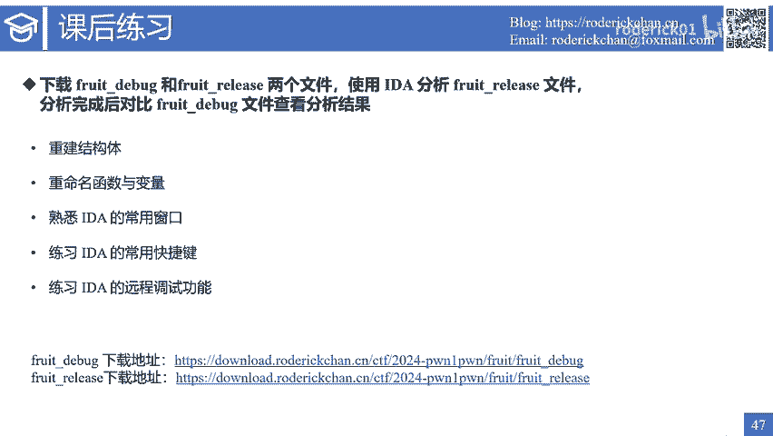

下节课我们将讲解如何使用GDP调试。最后祝愿大家学习顺利。