# 30-网络安全CTF系列培训教程之Reverse逆向篇-.NET逆向 - P1 - 武汉网络安全CTF培训 - BV1fjY1evEWz

大家好，我是阿阳。我们制作此视频的目的是希望帮助一些想要学习CTF的同学，快速入门，提高CTF竞技水平。本视频为CTF网络安全系列培训教程，后期将会持续不断的更新。

大家如果有兴趣进一步深入学习CTF可访问PPT上面的公司网址进行电话联系。或者扫描视频中的二维码进行报名咨询。我们的教师团队均来自CTF省赛世赛前10名选手。通过顶尖战队的手把手指导，大家学完之后。

即可达到省赛试赛的夺奖水平。大家可以扫描右侧的二维码，添加微信，免费领取教程资料或者呢报班培训。首先大家一定要遵守网络安全法。本课程内容仅用于CTF网络安全教学培训，请大家遵守相关的法律法规。

勿用于其他用途。今天这节课主要是讲CTF比赛中的点net逆向分析。点net的逆向分析呢主要是分析点net编写的程序集。如DIL或者呢ESE文件，以下呢是一个基本的立项分析流程。首先。

第一步使用迭代的反应编译工具，如reflector来获取了源代码。第二呢，分析程序集中的原数据，了解程序集的依赖关系、版本信息等。3、查找程序集中的内核方法，理解程序的逻辑结构。

4、对关键的内核方法呢进行反编译，理解其具体实现。5、分析程序集中的资源文件，如字符串常量图片等。6、使用调试工具，如spy等调试器插件，逐步执行代码跟踪变量和函数调用。7、分析加密或压缩的代码段。

如加密产量、压缩算法等。8、分析安全相关的特性，如代码的认证授权机制。最后呢我们讲一下点代的逆向分析的实操题目。这是一道湖北省省赛的CTF立项题。我们可以看到有一个ECE文件，还有3个B文件。

我们首先通过工具来看一下EE文件是什么。我们用这个。影箱工具。P我们可以看一下。把EU文件拖进去，我们可以看到它是有点代的随效果编写的。那我们呢就用点net转编工具来反绘编这个ESE程序。

我们点击program可以看到这里呢有一个密码，然后呢进行一个加密。首先呢用户输入了一个字符串，然后呢，他呢对这个字符串进行了加密。从加密的函数呢可以看到用的是AES加密算法。然后呢，ki。

和向量都是这个字符串。这个就是K。然后呢，我们看一下这三个B文件。基本看到是一些乱码，加名之后的乱码。

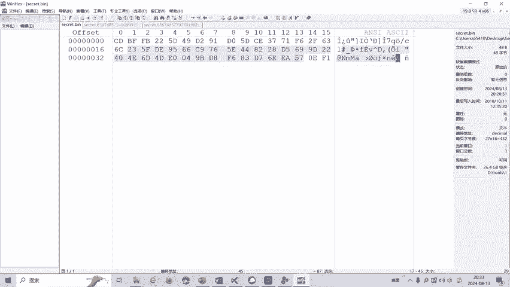

那我运行这个程序。比如说是ABCDEF。然后呢就会生成一个。

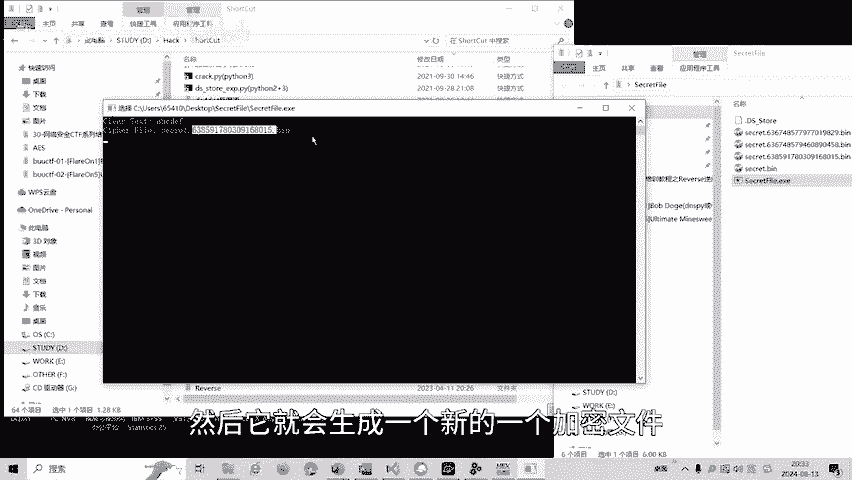

新的一个加密文件。

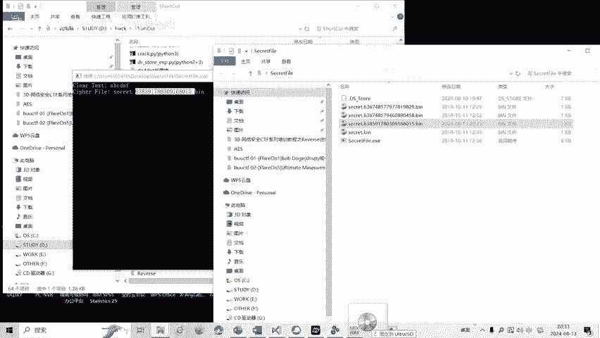

我们呢就用C下进行一个反定义。我们呢。知道AES加密算法的一个K。然后呢，我们首先读这个病文件。

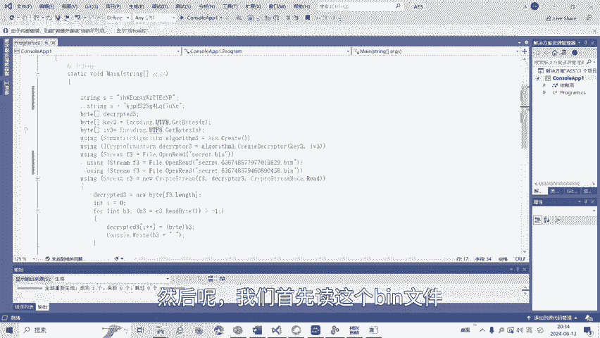

运行一下。

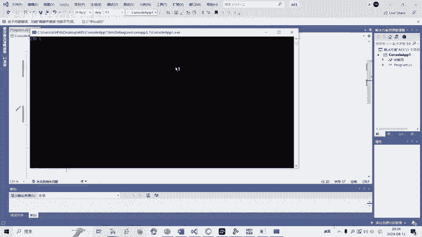

显示情报。密码泄露。

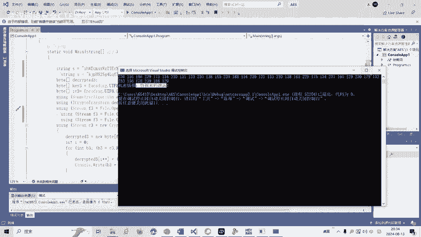

然后呢，我们再运行第二个文件。解密第二个问件看一下。

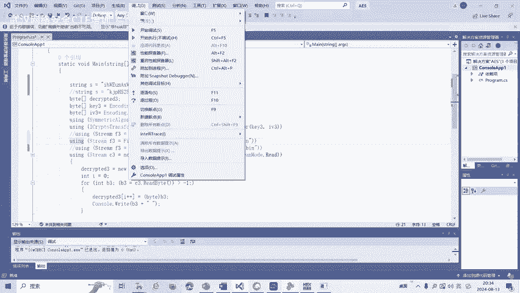

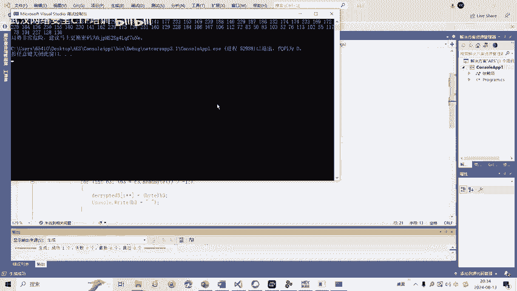

然后显示密码呢要进行更换更换这个。那我们把密码更换一下。然后再去。解密第三个病文件。

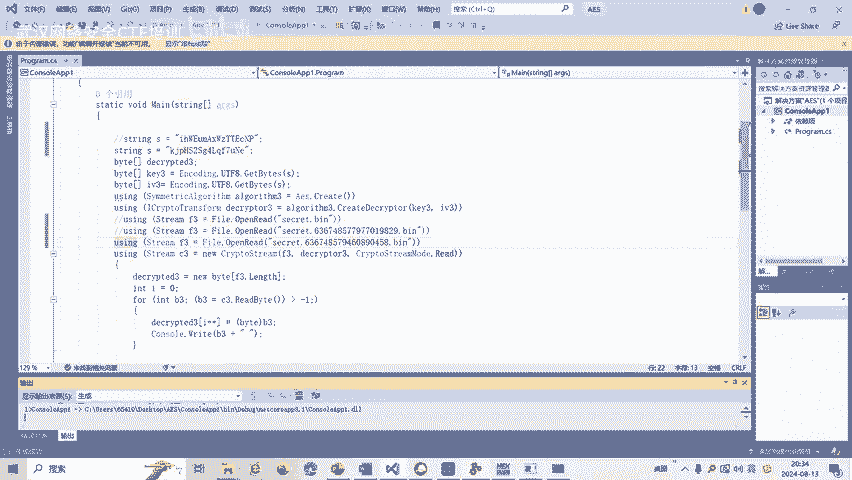

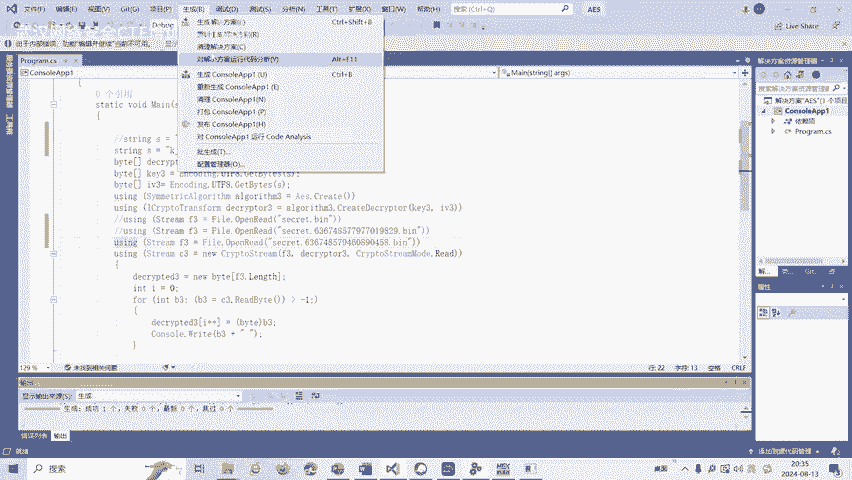

这个时候呢就得到了这道题目的那个。

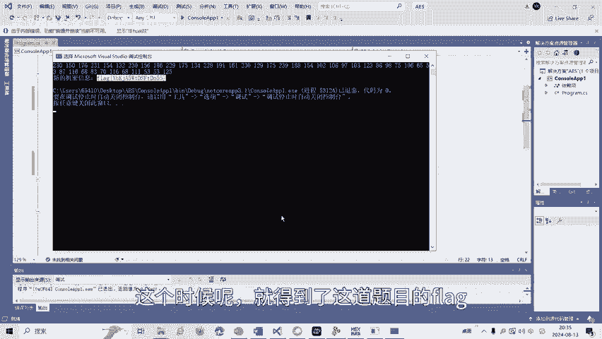

CTF比赛中呢reverse立项呢还有花指令、混淆等多种解题方式。后面呢将会针对各种类型的立项题目制作相应的教学视频。大家也可以扫描视频中的二维码，领取资料或者呢报班学习。好了，今天的课程到此结束。

感谢大家的观看。🎼The。

🎼再见喽。