# 31-网络安全CTF系列培训教程之Reverse逆向篇-UPX脱壳 - P1 - 武汉网络安全CTF培训 - BV1eZW4eHExh

大家好，我是阿阳。我们制作此视频的目的是希望帮助一些想要学习CTF的同学快速入门，提高CTF竞技水平。本视频为CTF网络安全系列培训教程，后期将会持续不断的更新。大家如果有兴趣进一步深入学习CTF。

可访问PPT上面的公司网址进行电话联系。或者扫描视频中的二维码进行报名咨询。我们的教师团队均来自CTF省赛世赛前10名选手，通过顶尖战队的手把手指导大家学完之后，即可达到省赛世赛的夺奖水平。

首先大家一定要遵守网络安全法。本课程内容仅用于CTF网络安全教学培训，请大家遵守相关的法律法规，勿用于其他用途。今天这节课主要是讲CTF比赛中的壳的定义。壳是一种对程序进行加密的程序。

壳形象的表现了这个功能。我们呢可以把这被掐壳的程序呢当成实物。而加壳程序呢就是在外面加上一层坚硬的外壳，防止别人去窃取其中的程序。价格后的程序呢依然可以被直接运行，在程序运行时，壳的代码先运行。

然后再运行原来的程序。主要目的是为了隐藏程序的OEP，也就是入口点，防止外部程序对程序的反汇编分析或者呢动态分析。许多病毒通过加壳来达到免杀的目的。弹壳也用在了保护正版软件，不被破解。

技术呢没有对错诸分，关键呢看使用的目的。壳呢分为以下几种。第一种呢是。压缩壳压缩壳的作用呢就是压缩程序的大小啊，压缩壳呢并不会对程序进行修改，而是改变了存储方式，使程序呢更小。

运行程序时呢先运行壳的解压缩程序，解压缩程序到内存中，然后呢执行常见的压缩壳呢有UPS。可以呢将一般的程序压缩到原本体积的30%。第二种呢就是加密格。加密壳的作用呢是保护程序不被破解。一般情况下呢。

加密壳加密之后的程序大小呢视情况而定。有些加密壳呢也有压缩壳的效果。加密壳呢会对程序进行修改如。打人代码混淆等常见加品盒呢有APbread S protectEEcryptto等等。

最近流行的呢还流行一种虚拟机保护盒，关键技术呢是软件实现CPU的功能。由于程序不遵循啊OP code的标志，所以呢分析起来会比较麻烦。

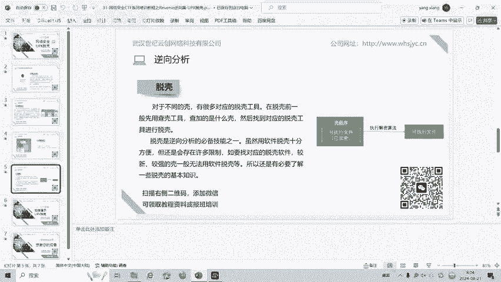

对于不同的壳呢有很多对应的脱工具，在脱壳前呢，一般呢先用查壳工具查加的是什么壳，然后呢找到对应的脱工具进行脱壳。脱壳呢是逆向分析的必备技能之一。虽然呢用软件脱壳十分方便，但还是会存在许多限制。

如要找对应的脱壳软件，较新较强的格呢，一般无法用软件脱格的，所以呢还是有必要的了解一下脱壳的基本知识。好了，接下来呢我们实操演示一下脱壳中的UPX脱壳。我们可以看到桌面上有一个新年快乐的。ex个Z程序。

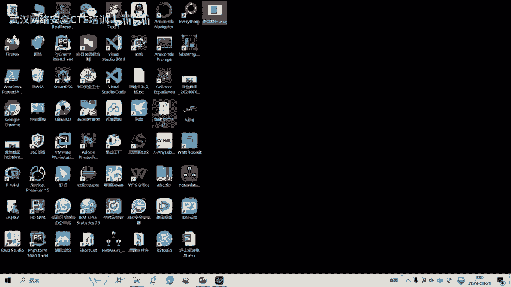

那我们首先。用DIE分析一下它是多少位的。

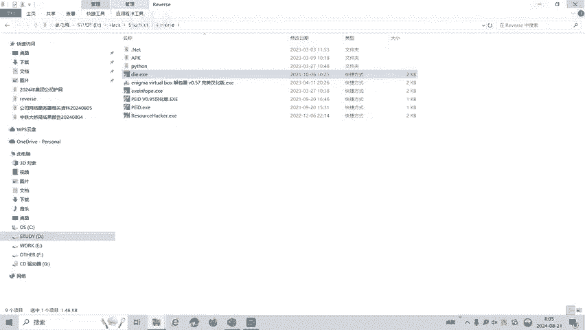

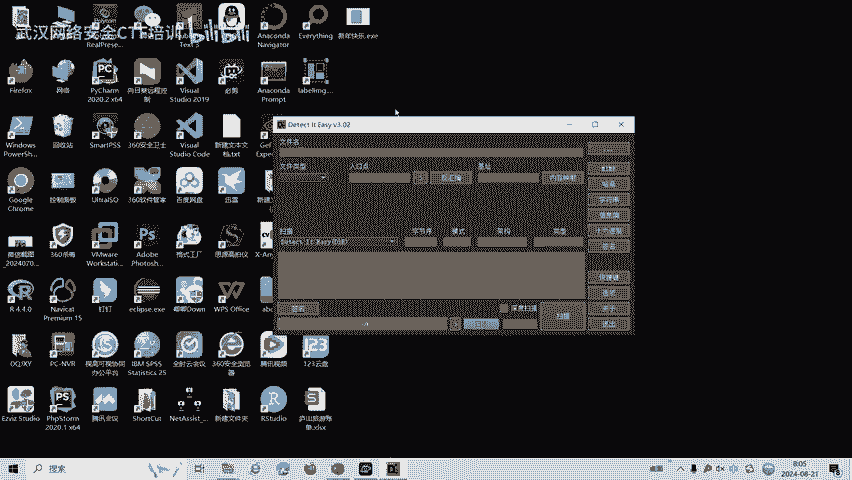

我们看到它是1个32位的程序，并且呢具有UPS组合。这个。BIE的已经检测出来了。如果我们不脱壳，直接用IDA32进行分析，会是什么样的结果呢？

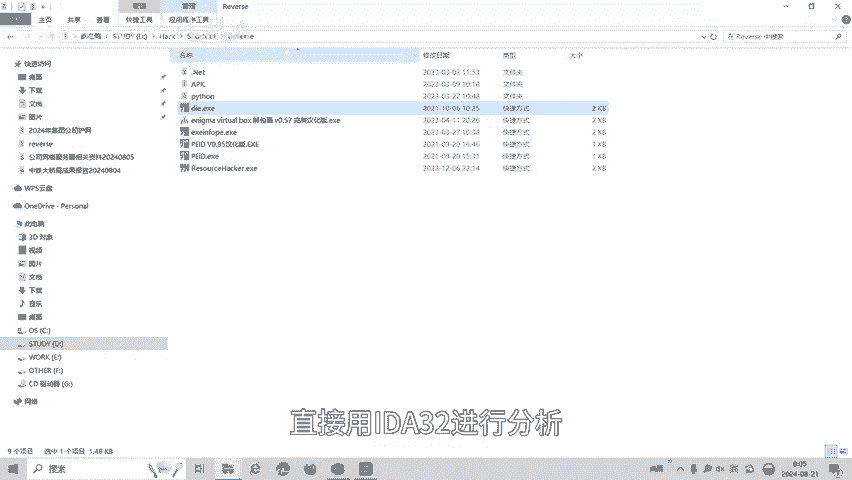

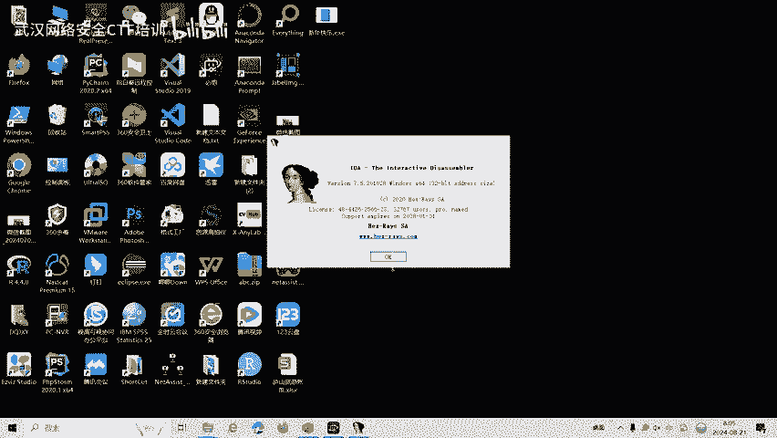

可以看到艾玛非常的难懂。妹还说也没有出来，对不对？所在的函数。

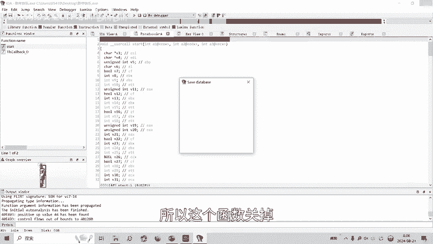

吧姑娘。我们看一下程序员大小。乘以大小是20KB20KB。那我们用UPX多可试一下。

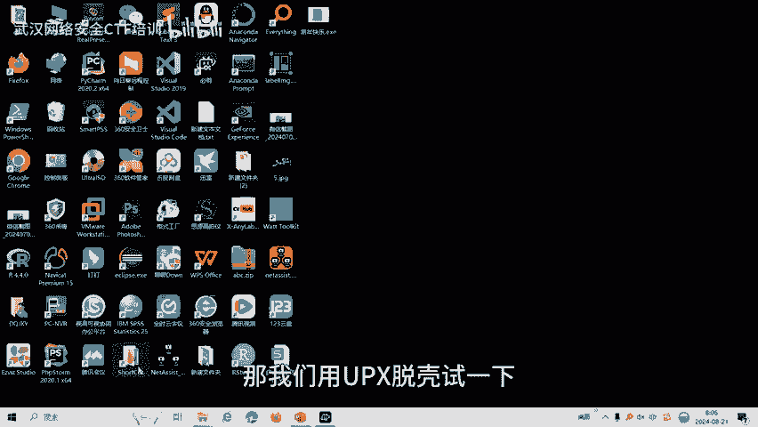

杠低就是脱壳。

偷偷完成，覆盖了原文件。我们看一下，变成了27KB。

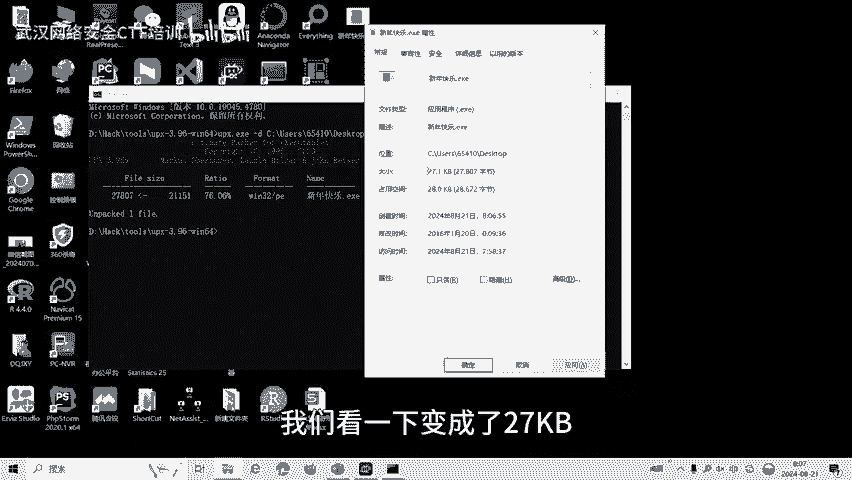

是不是文件变大了？

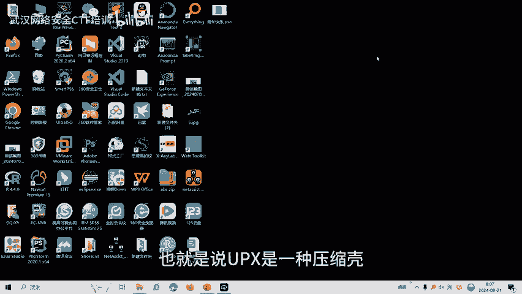

也如说UPS这种压缩可。我们拖了之后呢，程序会变大。然后我们再用A3R打开这个脱壳之后的程序，新年快乐。按F5返回边。可以看到。我们可以看到这个呢happy new year就是我们的。可以试一下。

用户呢输入这个不类，然后呢要求这个STR1呢与STR相等。STR呢就是这个答案。

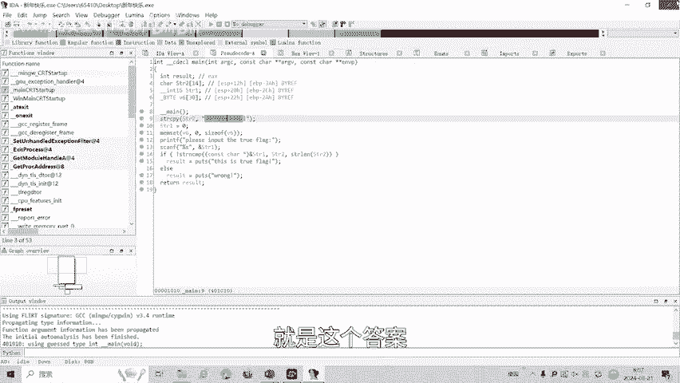

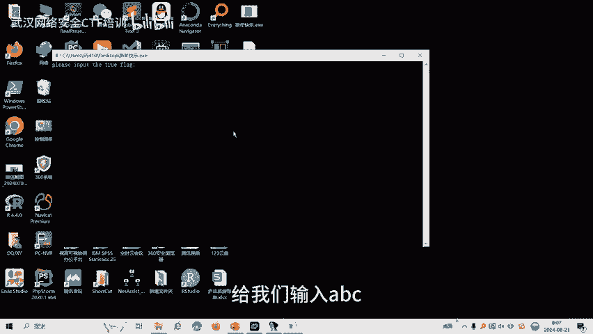

说我们说是ABC。

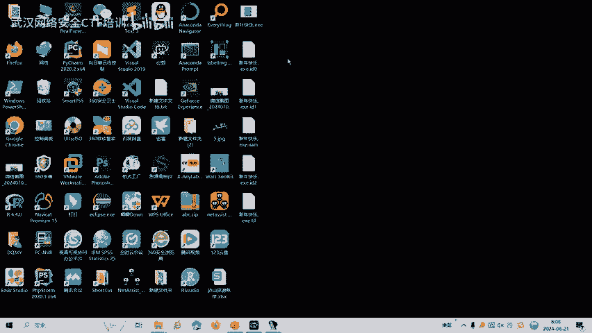

我们试一下。

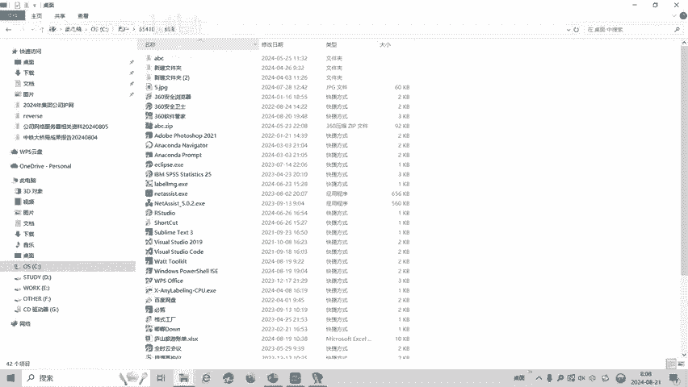

Yeah。

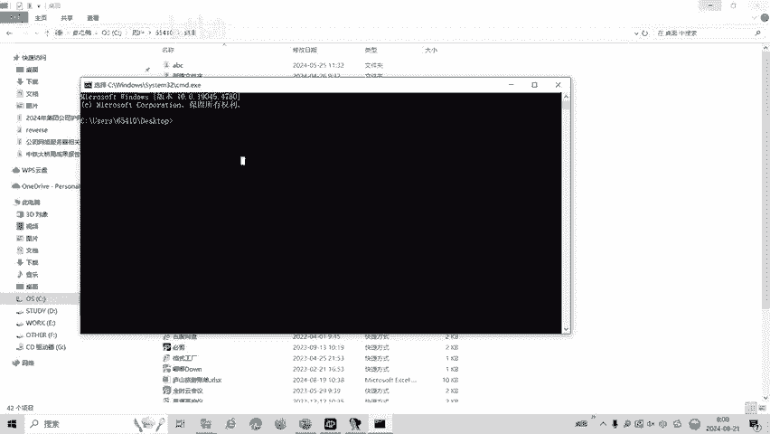

ABC。

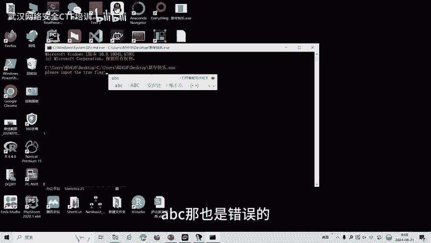

反应是错误的。如果我们输入这个呢。

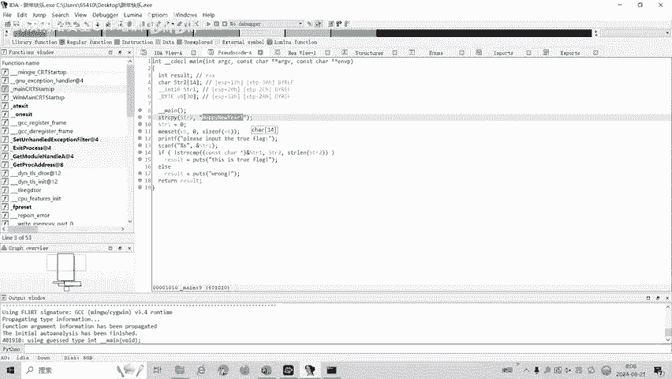

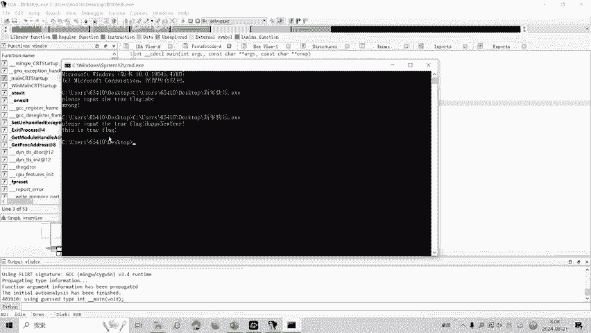

这就是正确的答案。正确的弗来的。CTF比赛中呢reverse立项，还有发指令、混淆等多种解题方式。后面呢会针对各种类型的立项题目制作相应的教学视频。大家呢也可以扫描视频中的二维码。

领取资料或者呢报班学习。好了，今天的课程到此结束，感谢大家的观看。🎼小狗乖乖。😊，🎼小狗乖乖。😊。