# 32-网络安全CTF系列培训教程之Reverse逆向篇-迷宫maze - P1 - 武汉网络安全CTF培训 - BV12Bs5e6EgH

大家好，我是阿阳。我们制作此视频的目的是希望帮助一些想要学习CTF的同学快速入门，提高CTF经技水平。本视频为CTF网络安全系列培训教程，后期将会持续不断的更新。

大家如果有兴趣进一步深入学习CTF可访问PPT上面的公司网址进行电话联系，或者扫描视频中的二维码。免费领取资料或者呢报班培训。我们的教师团队均来自CTF省赛世赛前十名的选手。

通过顶尖战队的手把手指导大家学完之后，即可达到省赛世赛的夺奖水平。首先，大家一定要遵守网络安全法。本课程内容仅用于CTF网络安全教学培训，请大家遵守相关的法律法规，误用于其他用途。

今天这节课主要是讲CTF比赛中的逆项分析迷宫类的题目。理功题呢是reverse立项中的常考点。说不来，但也不简单。本片呢记录了常规的二维思想迷宫解题套路，以及帮助快速解题的脚本程序。

二维四项呢指的是题目规定的迷宫呢，应该是一个二维的平面，如右图所示。有一题目呢是用一维数组呢来实现二维提供的，也是也适用。并且呢二维四项呢，它的移动方向呢只有4个，也就是上下左右四个方向呢进行移动。

题目呢一般会给一个迷宫的起示点呃，终点。然后呢，你来去找一个路径，最优路径。最优路径呢就是我们的一个答案。最后呢我们讲一下逆项分析迷宫的实操题目。

这是2024年贝CTF的一个高线联合新人赛的一个迷宫题详解。

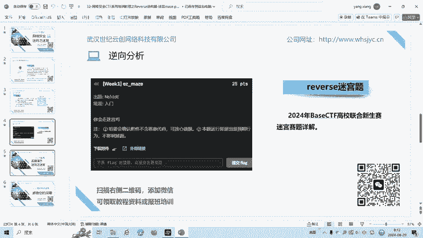

我们来看一下这个题目。Hes in miss。

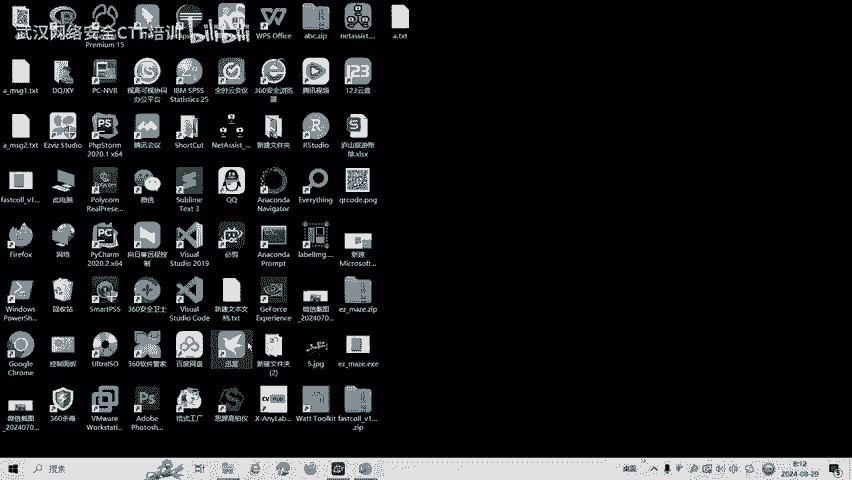

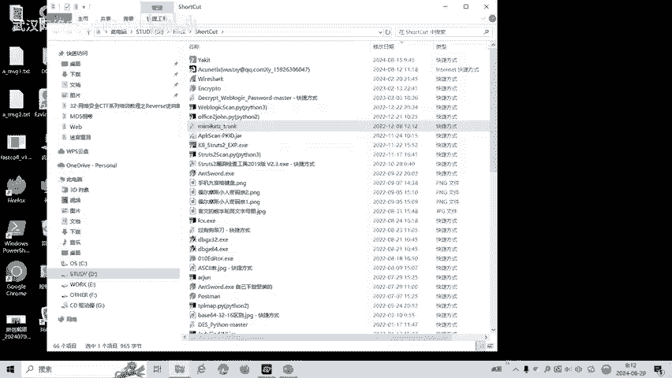

我们首先用DIE去检测它是多少位程序。They are到 easy mess。

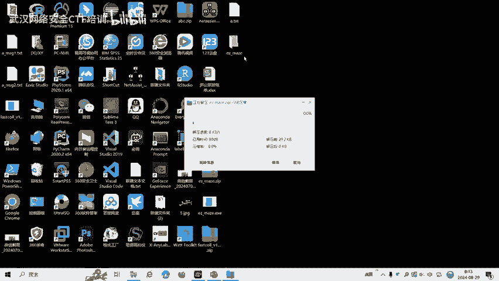

DIE检测呢发现是64位程序平音64。然后呢，我们用IDA64来打开。按F5返汇编。我们首先查一下祖串。他现在有这么一个字符串。这个呢很有可能就是我们的一个。数组一共数组。我们看一下代码。

要求我们输入V5，V5是我们输入，也就是说迷宫的路径V5。32个字度。然后呢，如果。等于DWSD啊方向键DD的话呢，我们玩游戏知道D呢应该是向右移动，向右移动。那就是加加V9，就不长加1。然后呢。

如果我们是SS呢，是向下移动，向下呢就是增加一行，那就是加15。也就是说这个米宫可能是1个15行，就一行只有15个。很有可能十5行十5列。然后我们再看一下W是向上向上呢是。Impput invade。

如果小于等于14。那么他每一行呢和那个就是0到14，0到14，每一行15个。嗯们再看一下。如果它等于A的话，那可能就向左移动一个，就是减减为角减。如果呢它等于36，我们看三六是什么？就是多纳福。

move hit就是撞击了。也就是说这个多伦斧呢很有可能就是撞击了枪。撞击了枪。Y呢就是U病，你那Y很有可能就是我们的终点终点。最后呢我们看一下这个数组。这个要后求这个等于用Y。我们呢把这个数据呢拖。

导出到呢我们的桌面桌面。

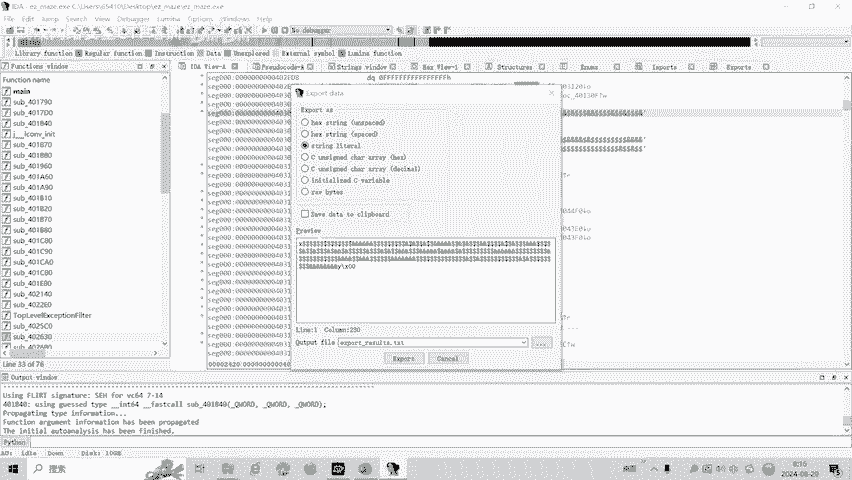

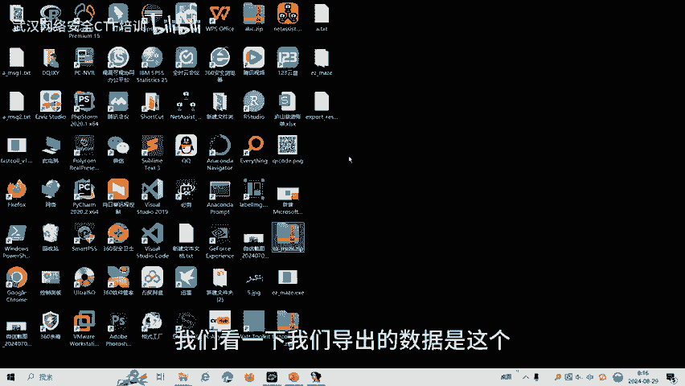

我看一下我们导出的数据。是这噶。

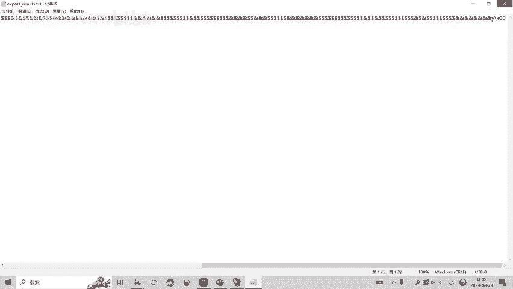

也就说他是十5行十五练。

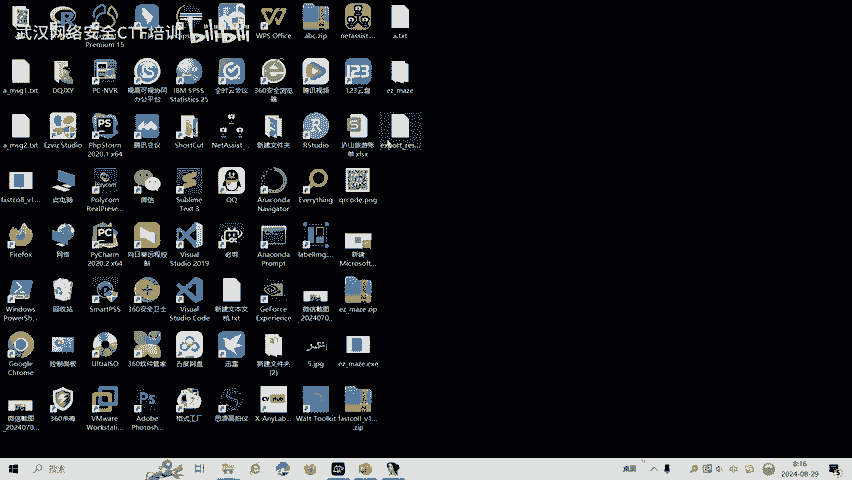

那么首先手动做一下这道题目。我们选中15个。这15个我们用到鲁佩莱家可以很容易看到这里选中15列，我们就15列进行一个回车。没车。回了。等了。我们看到X呢就是我们的起点。Y呢是我们终点，我们要X要到Y。

然后呢。多乱浮呢就是说你撞击了，mo hate多乱浮是我们不能撞击的。我们的语，也就是说雨发什我么的路径。我们可以用肉眼可以看一下这个路径是不是就可能就是。这儿。这个就是S。Yes。下下一段。Yes。

Yes。一直向下移。因为我们不能这边，不能向右移向右移之后，他这里就到那个死胡同了，我们依然要。Yes。测完之后就是D向右移动D。D地。D然后在WW。相上于W。W。然后DD。这里面又是S了。Yes。

大有没有发现这样手做的话，用眼睛去看密密麻麻的迷宫是非常低效率，非常慢的。而甚至你找的未必是如果复杂点的迷宫，你可能。很难找到。正确的一个答案。暂时要到这。Yes。Yes。嗯。D。啲。啲。最后一个是D。

对不对？就这么了。然后我们最后的呢就是。我们同一下12。当然。345671234。1231。1234。6712。嗯。3次。这个可能就是我们的答案。一般答案呢我们要进行一个MD5的加密。

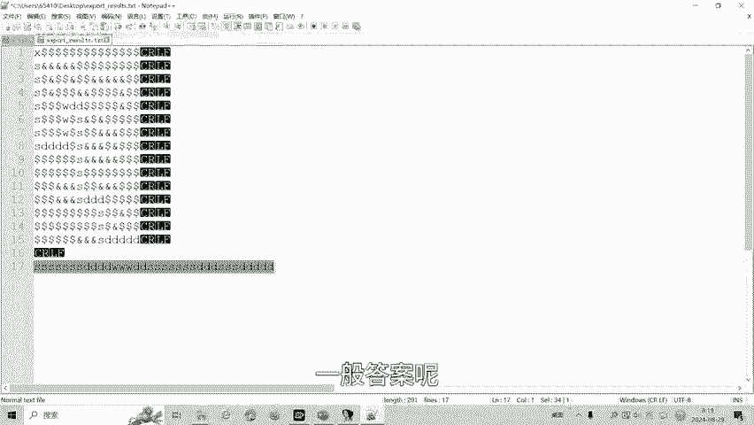

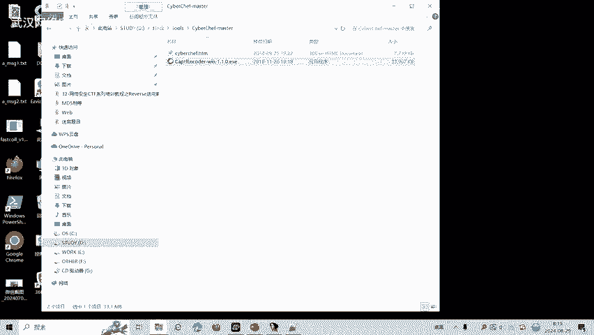

加密之后这种。

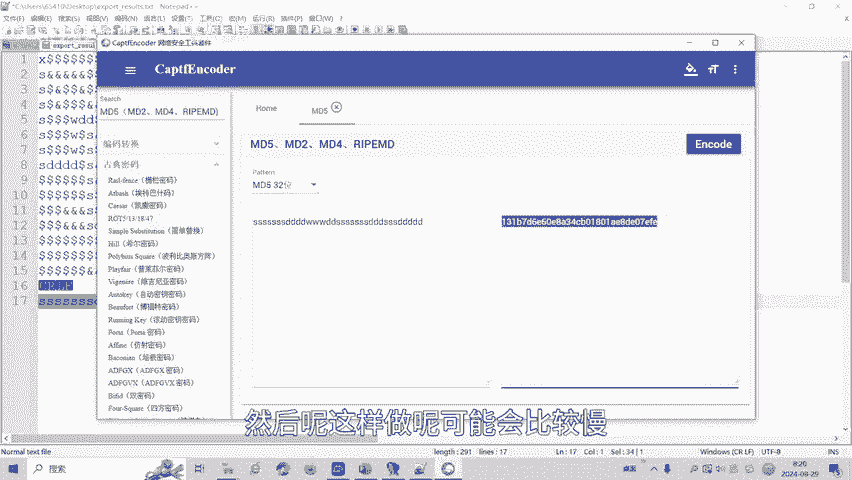

然后呢，这样做呢可能会比较慢。我这里呢会有一些快速做迷宫题的脚本，然后需要的可以扫描二维码，然后呢添加我的微信，然后把这些脚本发给大家。

脚本的第一步。将我们的。迷宫体剃须刀的数组啊。迷宫的数组呢，然后呢复制进来。所按着我们输入15行15列，然后呢让它呢计算出我们的迷宫列表。迷宫列表计算完之后呢，我们把它复制到我们的第二步。

计算路径计算路径。复制进来就可以了。然后我们输入我们的。多浪福是我们的碰撞的点。然后呢，弯的是终点，X是起点。我们再运行一下。就可得到我们的坐标。最后呢一般迷宫题呢会要将这个衰表图标复制过来。

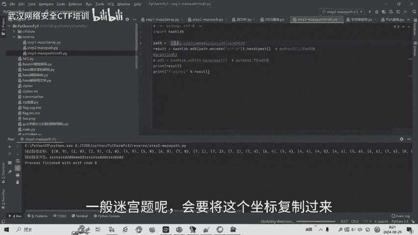

路径。复制过来，我们进行M0D5的加密。MD5这就是我们的最后的一个答案。大家可以看到这样做呢会非常的快速，比自己用眼睛去看密密麻麻的理工呢那容易很多。有需要脚本的同学呢可以添加微信。然后呢。

我们在微信这边发给大家。

好了，CTF比赛中呢，reverse立项还有花指令混淆等多种解题方式。后面呢会将针对各种类型的立项题目制作相应的教学视频。大家呢也可以扫描视频中的二维码，领取资料或者报班学习。好了，今天的课程到此结束。

感谢大家的观看。Yeah。🎼Yeah。🎼。