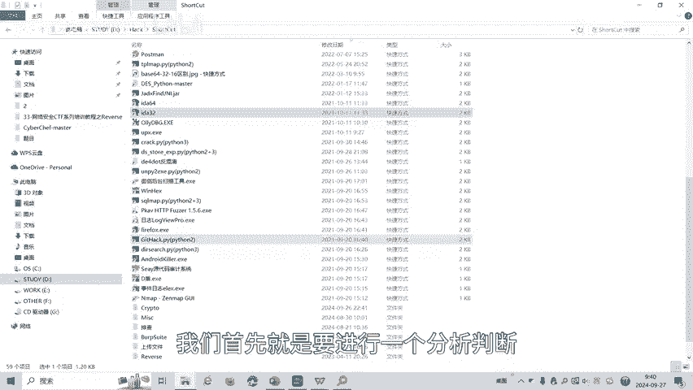
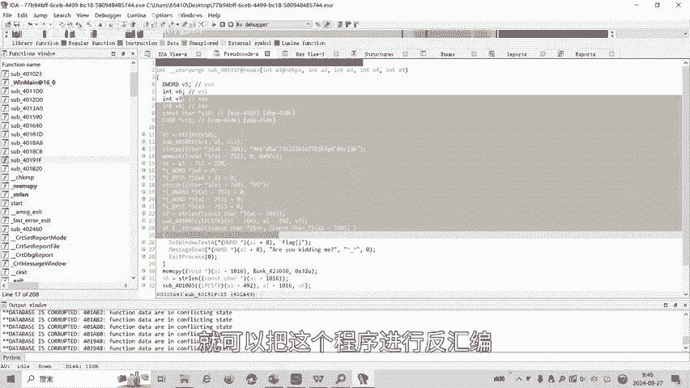
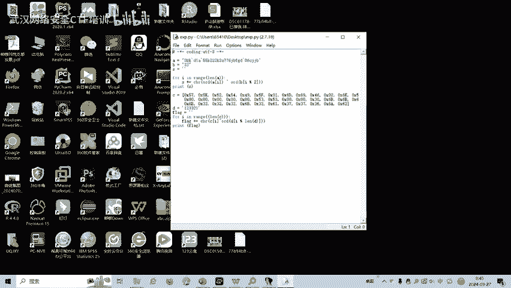
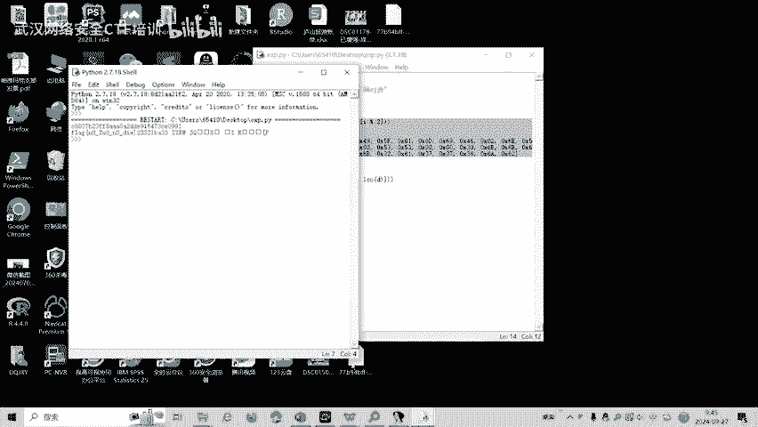

# 33-网络安全CTF系列培训教程之Reverse逆向篇-花指令 - P1 - 武汉网络安全CTF培训 - BV1uhsde4EWc

大家好，我是阿阳。我们制作此视频的目的是希望帮助一些想要学习CTF的同学快速入门。提高CTF经济水平。本视频为CTF网络安全系列培训调程，后期将会持续不断的更新。大家如果有兴趣进一步深入学习CTF。

可访问PPT上面的公司网址进行电话联系。或者扫描视频中的二维码进行报名咨询。我们的教师团队均来自CDF省赛市赛前十0名选手。通过顶尖战队的手把手指导，大家学完之后，即可达到胜赛胜赛的夺奖水平。首先。

大家一定要遵守网络安全法。本科的内容仅用于CTF网络安全教学培训，请大家遵守相关的法律法规，勿用于其他用途。今天这节课主要是讲CT度比赛立向分析中的花指令。那么什么是花指令呢？发指令有叫垃圾代码。

张志杰，英文名是ju克 code。发者令呢就是在不影响程序运行的情况下，往真实代码中插入一些垃圾代码，从而影响返汇编器的正常运行。起到呢干扰立项分析人员的静态分析，增加分析难度和分析时间。

划指令呢基本上从定义上来看呢，有两个作用。第一呢它是垃圾指令。不影响程序的逻辑，用于增加。静态分析的难度。第二。花指令呢可以备用在病毒或者木马上，通过加入花指令，改变程序的特征码，躲避杀人的扫描。

从而达到秒杀的目的。右边这个流程图大家可以看出来。有一个无条件分支。就if直接就跳到了我们的代码去，绕过了画这里也就画着令呢，在这里面是永远不会被执行的。所以呢它不会影响程序的结构。但是如果呢。

它放到了我们IDA里面，返汇编反拼译软件里面去呢，可能会那个影响返汇编软件的一个返回编，然后呢增加立项人员的一个分析难度。划指令呢大概可以分为两大类、四小类。

两大类呢就是会被执行类和不会被执行类这两大类。每的那里面呢又牺牲两个小类。我们首先看第一大类不会被执行的。争议大里。它分了两小类。第一个就是换指令时操作嘛，画指因为后面原本的机器码呢会被误认为测度数。

从而导致了反汇并解析错误。第二种呢画认为它是平衡堆栈的代码。I列解是由于该指令来使对账操作，而认为对账不平。是个F5来返回变视效。第二大类呢就是汇被执行类。

我们看第二大类的第小类挂制令呢是正常的汇编执令，可以改变堆栈操储，但不会改变原程序的堆战计算器。但是能起到干扰进态分析的作用。第二首呢是利用库增加复杂路。或执行的是会向对战中加入返回地址。

可以修改返回地址，配合return跳转到任意地方。比如我们可以参考2018年晚礼杯如果券他能用的就是这种方法。我们来看一个花展的事例。这是一个不会被执行的化指令事令。划指令呢是操作码。

划指令呢原本的机器码呢就不会被误认为是操作数，从而导致呢啊会编解错误。我们可以看一下这个C代码。有个魅函数，没函数里面有一个s万函数，有三个函数的第一条会编代码就是异惑。

将EAX里面直行一个异或与自己与自己异或，那么的ES就被置为0。如果它是零的话呢，GZ如果压等为0的话，就跳到lavel一。也就是说lave一下面的这三条画质0呢永远一个推行。

那么如果这三量化是你的是操作嘛。他操作完后灭原本的机器版的就会会被误认为。其实我们首先这个发指令去参加换境令，不会影响程序的正常运行。因为程序呢直接就跳到0个一了，中间的话是永远不会执行。

但是它会会影响我们防回边的一个操作。增加我们逆向分析人员的一个分析难度。好了，接下来我们看一下一道花指令的实操题目。这里呢有1个SE程序，遇到1个SE程序嘛，我们首先就是要进行一个分析判断。

我们把它拖到DIE里面。

可以看到它呢是1个32位持序。那么我们就用32位的IDA进行打开。挖者灵呢在反片里面是有一个特征的，我们可以看一下。红色部分呢如果返回变IDA。拖进来发现是有红色部分。

那么基本上就认为呢是有可能存在幻指力。我们找一下画指令的特征。对就可以看到。如果遇到一个函数地址。加上一个场面。加上一加2。但是ED呢减二就是。EF对不对？这里没有yF没有。如果出现这种情况呢。

很有可能就存在患指病。我们接着往上看。因为这个地方ED，这还是历史定啊，是存量化指定的。我们可以看到这个地方和这个地方都有复习。那我呢两个一样的操作的话呢，肯定有一个是多余的无效的。那么呢我他其。大起。

配完之的ED加2就是EF。那我们就可以看到这里。就是我们的一个。函数。我慢你。皮。将它的声名为函数。这时候可以看到红色部分都没了啊，这两有红的部分，我们可以接着按P。这地面还有这里还有？

40181D开始。啱咪。といは。等我们把红色部分的都把它。清楚。这时候患者应该就会被清除。我才看到刚刚那个函数。1F这就我们刚刚进轴或者零函数。这里呢就有一个密文，这个匿密文呢经过了一系列的操作之后呢。

就是flag。你。然后呢，我们这一课呢主要是教大家如何清除画质。因为我们刚刚的19EF，我们把清除画成以后，就可以把这个程序进行返回编，找到了它的源代码。

然后呢，再根据原代码分析利用脚本。要跑出来。

다 있지。最好认这就是这要题目的一个答案不类。

CTO比赛中呢reverse理想分析化者令呢还有很多种解题方式。后面呢将会针对各种类型的解题方式呢呃制作相应的教学视频。大家呢可以扫描视频中的二维码，免费领取资料。

或者呢报班学习我们更详细的一个划展令的一个操作。好了，今天的课展呢到此结束，感谢大家的观看。🎼Yeah。🎼Yeah。🎼。

