# 34-网络安全CTF系列培训教程之Pwn二进制漏洞篇-nc连接靶机 - P1 - 武汉网络安全CTF培训 - BV1JC2vYWE5j

大家好，我是武汉世纪云创公司的阿阳。我们制作此视频的目的是希望帮助一些想要学习CTF的同学，快速入门，提高CTF竞技水平。本视频为CTF网络安全系列培训教程，后期将会持续不断的更新。

大家如果有兴趣进一步深入学习CTF可以访问PPT上面的公司网址进行电话联系，或者扫描视频中的二维码进行报名咨询。首先，大家一定要遵守网络安全法。本课程内容仅用于CTF网络安全教学培训。

请大家遵守相关法律法规，误用于其他用途。今天这节课主要是讲CTF比赛中的胖二进制漏洞。那么什么是胖？胖是CTF记载中的术语，指的是通过寻找和利用程序漏洞，以获取系统权限的过程。胖发音类似于碰。

对黑客而言，这就是成功实施黑客攻击的声音，砰的一声，被黑的电脑或手机就被你操纵了。今天我们来看一下BOUCTF里面的一个真题详解test有NC。这也可以看到题目呢给了一个把机的一个网址加端口号。

另外呢还有一个test应用程序。好，接下来我们就实操演示一下如何使用。NC也就是netca这个软件连接8G。我们首先打开虚拟机。

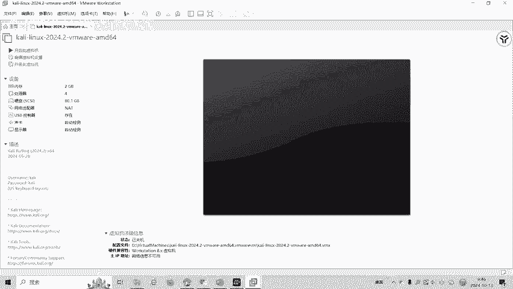

我们可以打开卡密看一下。

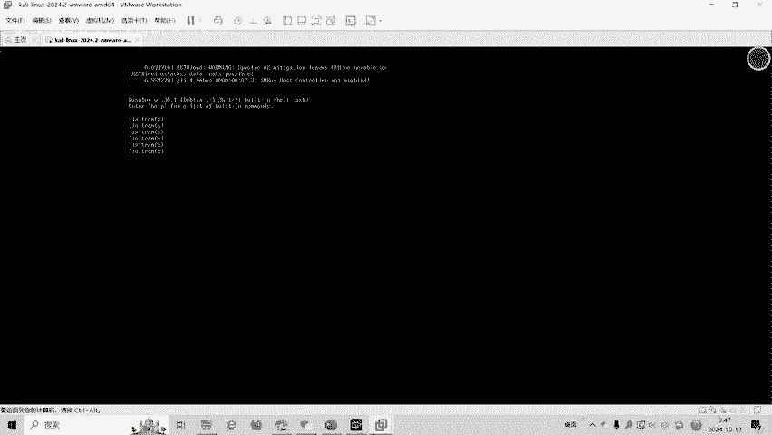

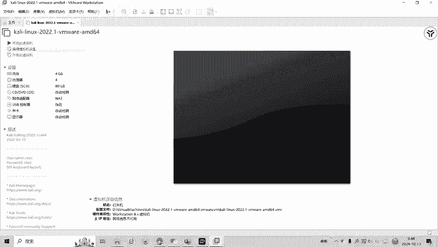

我们现在就输入NC命令啊NC然后呢输入我们的。网址网址是。

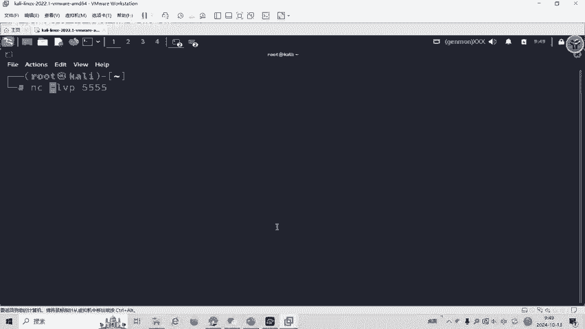

落地。

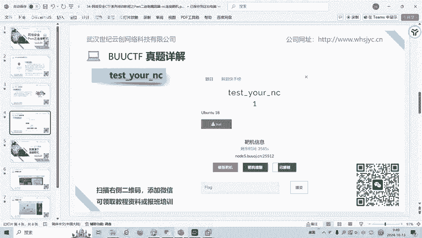

再输入单口号回车。然后输入S命令。发现拒绝的。

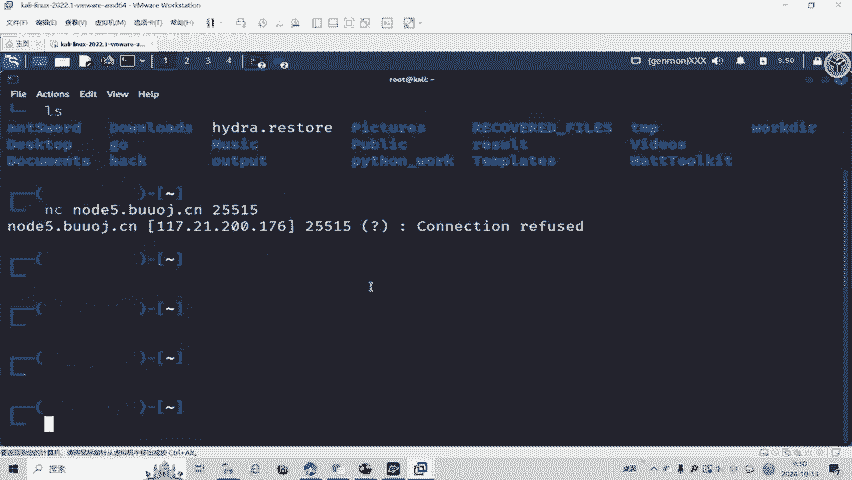

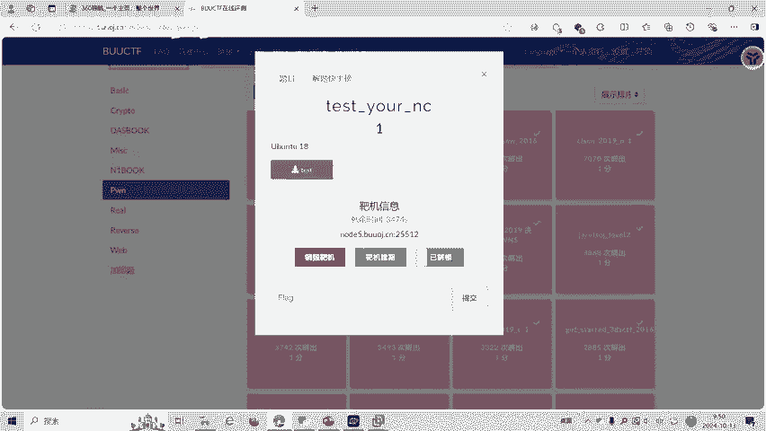

刚刚说错了，是25512。然后输入IIS命令就可以查看当前跟目录下所有的文件，发现有flag。那我么ca flagag看一下。就发现了。

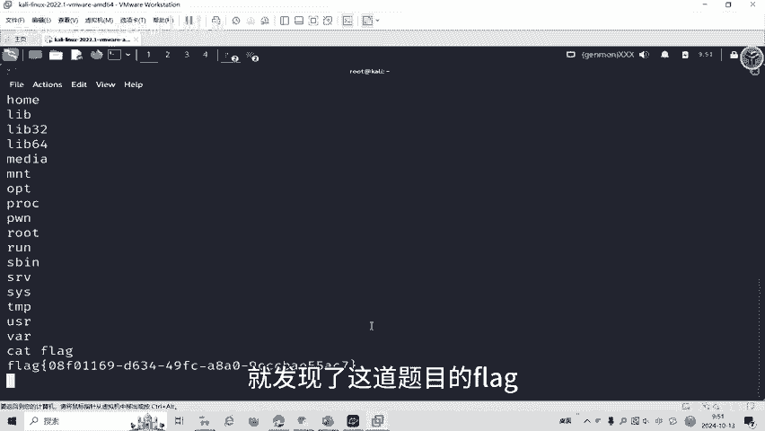

这道题我它分。我们把这个test文件下载下来。

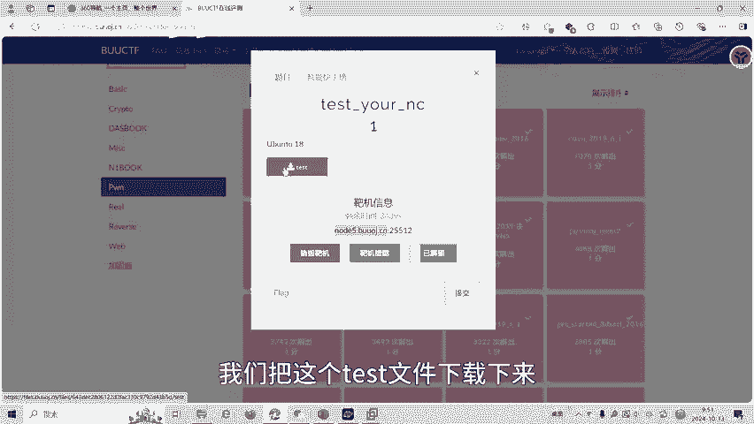

看一下。为什么就可以执行这个命令？

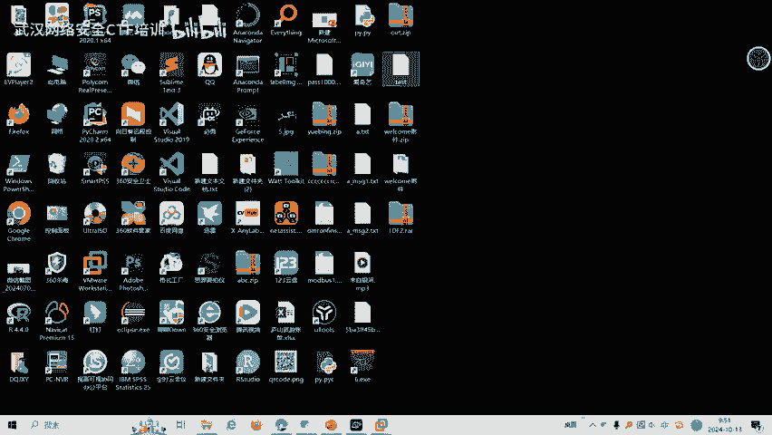

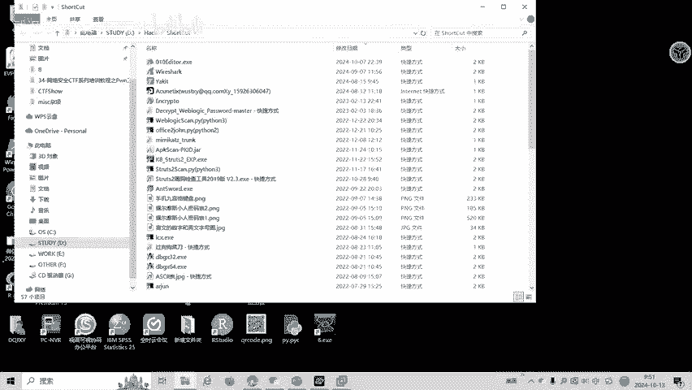

我们把test文件拖入DIE发现呢它是1个64位程序ERF64位。

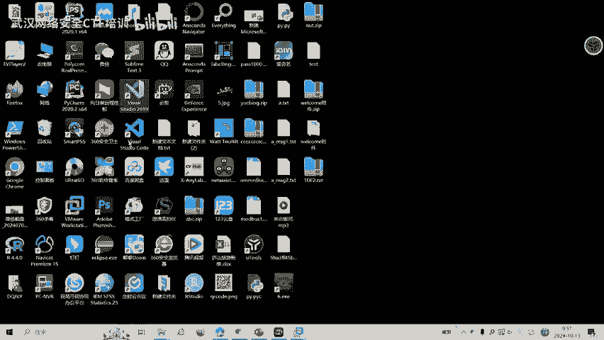

然后我们用IDA64打开看一下。

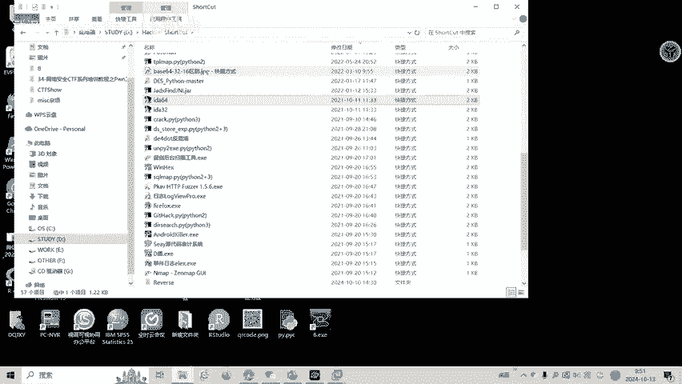

F5反比1，发现在魅函数就直接执行了C层函数啊，就执行了例6是根目录下并文加的SH。也就是我们连接这个打机程序，就可以直接执行获得了shaer权限，执行sha命令。啊，CTO比赛中呢。

胖还有很多种解题方式和技巧。这些呢我们将会在培训班中呢进行讲解，大家也可以扫描视频中的二维码领取资料，或者呢报班学习更多的胖的知识点。我们的教师团队均来自CTF省赛世赛前10名选手。

通过顶尖战队的手把手指导，大家学完之后，即可达到省赛世赛的夺奖水平。

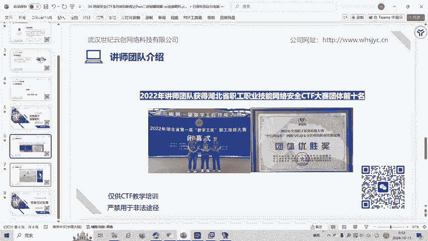

好了，今天的课程到此结束，感谢大家的观看。では、取引ですわ。知っ て いる こと を 洗らい ざら。