# 4. GDB调试指南-下 - P1 - roderick01 - BV18w4m1e7RB

我们继续上节课的介绍，首先来看一下怎么使用断点。首先我们启动这个程序。然后使用start meaning。让它断在媚函数这里。就是锻炼的方法有很多。首先第一个我们使用一个。break加上一个函数名称。

比如说read函数，这样就成功的设置了断点。或者我们使用。break加上一个星号，加上一个。可执行的地址。比如说我随便截取的一个地址，好，这边也设置成功了。当我们的程序是含有调试信息的时候。

我们可以通过源码来设置断点。比如说我们断在地。十二行。我们还可以。指定多个源码。比如说我们这里是一个修X点C，然后在第十四行下面下一个断点等等。这些方式都可以帮助我们下断点。好。那除了普通的断点以外。

我们还有一些断点比较特殊。比如说。第一个是一个临时性的断点。也就是T break。我们在。printntF这边。下一个断点，那么他在命中了一次printF之后呢，它之后的printF它都不会停下来。好。

那么还有一个叫做正则表达式设置断点。比如说我们想把所有跟printF相关的函数啊都给它设置上断点。那我们就直接使用一个up break加上一个print，就可以这样的设置。好。

现在我们首先删除一下所有的断点。那么我们查看断点呢，就用in for。breakrick points或者使用像我这样的缩写IB来完成。OK现在我们来设置几个断点。好，我们回到。最初的这个界面。

首先我在。read这里设置一个断点。然后呢，我们在print F。这边设置一个临时的断点。也设置一个普通的断点吧。然后呢，我们来让这个程序继续运行，可以看到它首先断到了print F这里。

然后我们C一下。好，现在就断到了read这里。OK我们随便输入一些字符。因为它要我们读取一些输入。嗯我们可以发现它又断到了print F这里。那这个时候呢。

我们可以使用inable或者diable这两个命令。来通过breakpoint的 IDD控制它是否启用还是不启用。比如说我们使用。Disable。这个命令把我们设置的printF也就91。给他不启用。

那我们之后我们再看一下。这个地方有一个enable这一个行。我们的90，也就是read这个断点，它是启用的，但是我们的printF它是不启用的。OK这是使用断电的一些基本的方式。当然还有一些。

比如说我们可以。忽略这个91。让他忽略两次，对吧？就是他给出了一个提示，这个接下来的两次的这个croing of breakpoint91它都会忽略掉。好，这是关于断电的一些基本的使用。

那么除了普通的断点以外，我们还有一些特殊的断点。比如说观察点和捕获点，下面我分别来演示一下。首先我们来看一下观察点。观察点呢是用来监视内存的变化，也就是当你读写某一个。内存的时候。

你可以让这个程序暂停下来。在这里我们首先使用。普通的断点在read的这个地方停下来。然后呢，我们接下来会往RSI这个地方去写入一些数据。所以在这里我们设置一个。读写的观察点。

也就是说这个地址它的读和写都会被监测到。那么如果你是用一个地址的话，你就需要在一个地址前面加上一个星号，默认它是会监视四个字节的。如果你想监视更长的字节，比如说8个字节的话，你需要在前面加上一些。

类型比如说我们加上n long in，这个地方就会。今是8个字节的读写。OK好，我们现在回车一下。然后呢，我们现在继续。运行这个程序。的往里面写入了一些数据，那么函数在这个地方断了下来。也就是说。

他触发了内存的写操作。啊，他原来的这个值它是这个零是吧？现在变成了65646F72。OK我们继续C的话，可以看到他又监视到了他的读写的状况，并且呢会把它的值给他打印出来。好。

这边的这个触发的次数比较多啊，我们继续往下看啊，这个地方它又从这个值变成零了。就说明我们。确实成功的监测到了这个内存的读写。好，这是观察点。那么那么除了观察点以外，还有一类。我们常用的断点是补货点。

补货点主要是用来捕获系统调用异常等等。通常我们是用来捕获系统调用的。比如说。它内置了一些常用的系统调用，我们可以caXEC对吧？我们可以。这个catch。fuck等等。

当然这个地方我们需要cat一个ss score。那么这个ss score呢就是我们的这个。read这个ssco可以看到，我们现在是设置了两个catch point好，我们现在。😊，把这些都删掉。然后呢。

我们来看启一下这个。Ss called。rate你可以输入ss code的名称或者ss code的系统调用号，它都会识别出来。接下来我们按一下这个C，让这个程序继续运行。那么我们可以看一下。

他这边显示是catchpoint。S， call to Cisco read。这个地方他被捕获到了，所以他就停下来了。吧我们回去看一下我们的断点的设置。发现他hate了one time。

也就是他被命中了一次。就证明我们确实成功的捕获到了这个read系统教用。那么除了捕获read以外，我们当然也可以捕获right。对吧那这样的话，在print F的时候，每次它都会输出啊。

首先我们写出一些东西进去。啊，这边结束之后呢，它又会这个断一下。就执行完readread的系统调用之后会断一下。然后每次right的时候呢，它又会。断下来。OK这就是断点的设置和使用。

这里展示打印相关的命令。打印中用的最多的是print命令。会打印表达式并记录历史。一般我们会使用print的缩写一个字母P来打印信息。printnt可以打印数据、变量、寄存器、内存地址等等。

另外还有一个P type命令，专门用于打印各种结构体，各种类型。需要重点讲一下的是。X meaning。也就是examine memory命令。这个命令用于显示某个地址的内存信息。

命令的使用频率也非常高，examine的格式是X，然后接一个个数，再接格式和单位。其中，格式有以下这些O代表八进制。X代表16进制。需要注意的是，十六进制是非常常用的。D代表十进制。U是无符号数值。

T是二进制。F是浮点数类型，A是地址，I是指令，C是字符，S是字符串，Z是左对齐并十六进制打印。而大小则有以下4种，分别是。B代表字节。H代表两个字节表示half world。W是四个字节。

G代表8个字节。另外，这里列举的help命令非常推荐使用。这个命令也是一个打印命令，专门用于打印命令的帮助文档。当我们不知道该如何使用一个GDB的命令时，就可以输入help，然后再加上我们要执行的命令。

使用help命令，可以快速弄清楚某个命令的用法。关于打印的命令演示如下。这一页是一些其他的命令，我统一放置到这里。第一个是diassemble meaning，用于显示汇编指令。

后面可以接一个函数名称或者函数地址。甚至还能指定显示的函数汇编指令的长度。infer registers用于显示寄存器。back trace打印战争信息。这些在基本窗口里面都有介绍。

frameme用于显示战争，然后我们可以使用up和down，分别向上和向下移动战争。移动战争后，我们可以使用inform locals或者infer x显示当前战争的局部变量以及函数参数。

而扩命令可以直接调用函数。当铺命令可以把内存变量值等保存到文件。sll命令可以执行外部的sell命令，或者我们一般使用感叹号作为执行shall命令的指令前缀。这些命令的演示如下所示。

OK我们继续来看这些命令的演示。首先仍然是启动程序。那关于print命令，其实大家用的比较多，对吧？那最常用的就是使用一个杠叉去打印出来它的1个16进制的信息啊，或者使用我们这个ptos或者。呃。

其他的GDP插件提供的各种功能来打印，有很多丰富的打印的方式。那么printnt还有一个很有用的地方，就是在于它可以打印结构体。

比如说我们经常使用到的STD inSTD outSTDarrow这三个结构体，我们需要知道它的每一个结构体的值是多少的时候呢，我们就可以使用P杠叉。然后呢，前面加上一个星号，再加上这个结构体的名称。

然后再加上一个信号。然后再来把这个。比如说这是STDERR啊，标准错误流。把它给你打印出来，那这样就可以成功的去打印一个结构体。那么你可以用这样的方式去打印任意的。结构体的信息。OK这是P。那除了。

print这个命令以外，我们查看数据常用的另一个命令是X，也就是examine。那么examiamine呢有很多格式，我们在视频里面也讲到了。比较常用的一个是杠GX，这个是16进制。当然我们需要更多。

比如说我们一次性可以看20个。好，除了杠GX以外，我们还喜欢使用的一个是。杠I，比如说我们打印20条汇编指令。对吧以及我们可以使用。B。来打印字节等等。这是X。

那P type呢是用来打印这个结构体信息的。比如说我们来打印一下这里的name是什么，那么name它告诉我是一个恰33好，那除了P type以外。

还有一个非常有用的命是what is比如说你可以问问他what is main main是什么？他会告诉你ma的类型啊，可以看出来它是一个函数的签名，当然还可以what is name。对吧这是一个。

数组what is STTD in。这是一个fi性的指针等等。那么我们还讲到了一个命令是help命令。事实上这个命令是使用频次比较高的。也就说你不知道你不知道如何使用一个命令的时候。

你就可以help加一个。这个命令就可以打印出来它的一个帮助信息。那么我们通过帮助信息就知道怎么去成功的调用这个命令。好，我们继续往下看。那除了使用X杠I去打印汇编以外。

GDV还提供了一个diassemble这个命令。用来用于直接来显示我们的这个汇编代码。比如说我们打印这个内函数其实地址这里的对吧？那么在这个地方呢，我们就可以成功的把整个魅函数它的汇编给打印出来。

并且它是带有一个。程序的偏呃基本地址的。OK那除了使用。地址以外，我们还可以使用函数的签名名称是吧？使用ma也可以打印。甚至我们可以使用打印一些这个系统的函数。比如说stem，我们经常用它来执行命令。

对吧？那么它的这个汇编代码我们也可以实时的去查看。那么还有一个是我们使用infer来查看很多信息。比如说infer寄存器，当然啊在p debug里面，我更喜欢用REG这个缩写来查看所有的寄存器信息。

以及这边还给了这个标志位，他的信息是什么？OK然后接下来是一些关于这个战争的一个操作。啊，比如说这个frameme它会显示你当前的这个战争啊，当然如果说我们去。监测一下这个输出的话。

它的这个战争会更加的深啊。好，我们现在在这个right这里。啊，他这个战争就很深啊，最后因为最后是会执行到这个libacy right。这个系统调用就是个封装系统调用的函数。

这里那么我们可以通过up或者档来。切换我们的战争啊，就是我们从比如说这个编号为零的，我们切到编号为5的。那么切换有什么用呢？切换之后呢，我们就可以用这个。一个是。inform命令啊。

可以去查看它的参数是什么。我们可以用用这个local命令。切换到这个战争。里面然后去查看在那个上下文的一些局部变量的值啊，叉叉叉。所以up和当就是。的作用主要是这个。

那么我们还有一些这个GB的命令是有一个coll命令。这个co呢可以直接去调用函数，对吧？我们可以co printF，我们可以扩这个。system等等之类的。然后还有一个当铺命令呢是用来打印内存的。

把它把这个内存信息给它输出到文件里面。然后最后有一个比较常用的一个命令呢，是执行需要命令，对吧？一般来说，我们在tybug直接使用LS也能去打印。

但是它会有一个提示说这个将会在ptybug里面会被移除掉。如果你要使用sell command的话，你要在前面加上一个感叹号，是吧？比如说我们感叹号LS好，这个时候就成功的显示出来了。

这个当前目录下有哪些文件？比如说who am I对吧？它都能成功的显示。最常用的是我们在GDB的时候，需要去知道它的one gadget有哪些，对吧？我们直接使用这个one gadget。然后呢。

再加上这个。呃，利C的这个地址。那我们首先可以先看一下。OK然后我们现在使用one gadget。比如说这个SO。OK他就成功的打印出来了玩ge的这个。哪些可以使用的项？好，这是这些命令的演示。

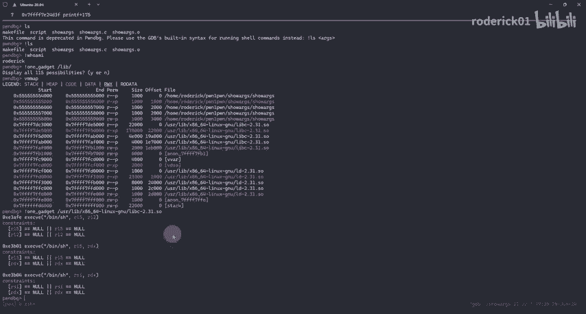

在上一章，我们介绍了许多GDB常用的基本命令。但是如果我们遇到一些复杂的程序，需要调试，GDB又支持哪些命令呢？在这一章，我将介绍GDB的一些高级调试技巧，包括如何调试多线程程序、多进程程序。

如何处理信号，以及如何对变量计存器进行修改。

进行任意函数跳转等。首先我们来看GDB如何调试多进程的程序。在操作系统上有进程和现程的概念。其中进程是操作系统分配资源和调度的基本单位。

每个进程有自己独立的地址空间、内存、数据站以及其他用于跟踪执行的辅助数据。进程之间相互独立，一个进程无法直接访问另一个进程的数据和资源。除非使用一些进程间通信机制，比如借助管道、消息队列、共享内存等。

从进程的定义可以看到，进程主要含有两大块，第一块是资源。这些资源包括但不限于内存、磁盘、IO、网络等等。另一个是占有1个CPU核心，即可以进行计算。当操作系统创建一个进程的时候。

会分配一系列的资源给进程，而父子进程只是进程之间的关系描述，并不存在资源的包含关系。也就是说，父子金程的内存地址空间都是相互独立的。然而，尽管他们的空间是彼此独立的，但是对于地址空间的描述可能是一致的。

比如说当我们使用fok系统调用后，子禁程会克隆附禁程的地值空间。他们的虚拟地质空间分布是一样的，只是对应的物理地址不一样。好，回到GDBGDB操作进程的命令如最上的表格所示。首先，在GDB中。

我们可以使用infor inferiors查看当前所有的进程，并获取进程的ID这里所提到的ID是GDB分配的序号。然后我们可以使用inferriel加上ID切换到目标进程进行调试。如果需要杀死目标进程。

就使用kire inferior加上ID。下面两个是与多进程调试相关的设置选项，其中detach on fork用于设置进程调用fork的时候，是否同时调试父子进程。

而followfuck mode则用于调试fuck的时候，GDB是否进入此进程。这两个选项很容易混淆。所以我在下面列举了一个表格，说明这两个选项的作用。

当follow fork mode设置为parent detach on fork设置为on的时候，表示只调试附进程。

而当follow fork mode设置为child detach on fork设置为on的时候，表示只调试为子进程。当前者设置为parent，后者设置为of的时候，表示同时调试两个进程。

GDP会跟踪副进程子进程阻塞在fok处。当前者设置为child，后者设置为of的时候，表示同时调试两个进程。GDP跟踪子进程。副进程阻塞在fk处。一般来说，我的配置会设置为第三个。

也就是follow fork mode设置为parent detach on fork设置为of，会同时调试两个进程。而当我们需要在父子进程之间切换的时候，就使用上面的inferior系列的命令。

然后我们继续来看GDB如何调试多线程程序。在操作系统上，一个进程有资源和CPU，而一个线程，它是一种轻量级的进程，线程是最小的执行单元，一个进程可以包含一个或多个线程。

所有线程共享其所属进程的地址空间和资源，如内存和文件描述符等。但是每个县程有自己的执行站、寄存器和程序计数器。县城的创建和销毁比进程更为高效，因为县城共享了大部分副进程的资源。

简单理解就是县城只占用了CPU它的数据、内存等不是独占的，而是共享的。多线程调试的关键字是thread。in four threads查看所有的线程，这里的ID也是GDB分配的ID。

ID前面有星号的代表当前调试的线程，使用thread加上ID切换要调试的线程。当我们要对所有的线程下断点的时候。可以使用break，加上断点，加上thread or。

另外我们还可以使用thread apply，让指定的线程执行命令。线程调试过程中，最重要的一个选项设置是set schedule locking。当其被设置为on的时候，会锁定当前调试的线程。

只有当前线程会继续往下执行，而这个选项被设置为off的时候，不锁定任何线程，也就是所有线程都会执行。这是一个默认的值。当程序运行到断点处的时候，所有的线程都会暂停下来，直到指定的某个线程继续运行。此外。

还有set no stop on或者of用于设置调试一个线程时，其他线程是否同步运行，set target a think on或 off用于设置选择同步或者异步调试，及是否等待线程终止的信息。

以下分别演示如何调试多进程和多线程程序。我们来看一下如何调试多进程的程序。那么首先这里我已经编写好了一个多进程的程序。我们看一下程序的源码。也就是我们会启动一个子禁程，然后子禁程呢会获取一段输入。

当输入等于axy的时候呢，这个子禁程会退出，否则呢就会把子禁程接收到的输入给它打印出来。那我们的附禁程呢会等待子禁程的结束。好，程序比较简单。然后呢，在。调试这个多进程之前，我们首先来看一下。

我们对于多进程的配置是什么？我们的follow fuck mode设置的是child detach on fog设置的是of。也就是说。我们不会断开对负进程的调试，同时我们会去追踪这个子进程。好，那。

我们现在开始来调试这个程序。我们刚刚从源码里面可以看到。我们的子禁程里面有1个STRNCMP函数，那么我们直接断在这个函数这里。好，然后我们我们启动这个程序。

那么可以看到这边有一个new infe to，也就说我们成功的启动了一个新的进程。啊，然后这边还有一个attaing after process。

这个23903fk to child process23907。好。好，然后我们随便输入一些内容。这个时候可以看到我们成功的断到了这个紫禁城里面，我们使用这个in four inferious来看一下。

我们现在处于这个紫禁城里面，就是23907这个禁程里面。好。然后我们需要去。这个。切换进程的话，我们就用这个infi infer real。然后我们切换到这个附进程里面啊。

我们看一下我们的CTX contextt，就是它会停在fork这里啊，它会停在fork这里。好，然后我们还可以把紫禁城给他。杀掉啊，比如说我们这个kill。加上我们的这个infer，加上ID，比如说R。

然后我们再来看一下的话，那么我们的。这个第二个进程就。被杀掉了。所以它就会显示这个thethe program is not be wrong，对吧？他没有继续运行了。好，这就是调试这个多进程。

那调试多进程需要注意的就是关于。视频里面所讲到的那两个配置。把这两个配置弄清楚之后，就可以很方便的去调试多进程的程序。那么同样的，我们继续来看一下如何来调试多线程的程序啊。

我们还是已经编写好了一个多线程的程序。从这个代码来看，我们首先创建了一个新的线程。然后我们的主线程会等待子线程执行，等待它执行完成之后。啊，我们的主线程才会结束运行。好，我们首先启动这个程序。好。

我们首先启动这个程序，然后呢，我们仍然断在这个。STRN3NP这个函数这里我们run好，那么这边打印出来的信息呢跟刚刚是不一样的。他这边打印出来的是有一个这个。newth。

然后给出了这个LWP26129，对吧？我们随便输入一些。字符啊，它也成功的断到了这个函数这里。我们来看一下我们的。有多少个县城啊？我们发现一共有两个县程对吧？一个是主县程，一个是子县子县城。

那么这个子县城呢，就是我们现在正在追踪的这个县程。我们可以通过这个。thread命令来切换我们要调试的线程，跟刚刚的多进程是类似的那我们这个时候在CTX看一下。

它就会在这个Pth clock join等等这个函数，它就是在等待此线程结束。啊，因为他被阻塞在了这个地方，然后呢，我们可以。只针对第二个县程来下断点。就可以看到它成功的断到了print F这里。好。

那么在调试多线程的时候，我们一般会把这个。Schedule locking。把它设置为这个on，也就是说我们只调试。就是锁定当前调试的线程啊，并且会设置一个这个。单步调试step。

这个时候我们在使用这个SI命令，就可以保证线程不会跑飞。好，关于多线程调试的介绍就到这里。在lininux系统中，信号是一种软件中断机制，用于通知进程发生了某个特定事件。

他们是操作系统与运行在其上的进程之间进行通信的一种方式。信号可以被视为一种异步的通知，告知进程需要注意或者处理某个情况，比如外部中断硬件异常、软件条件的触发等。进程可以通过系统调用。

比如signer或者sign action注册自定义的信号处理函数。从而在接收到信号时执行特定的代码。此外，进程还可以阻塞，也就是暂时忽略或者解除阻塞特定的信号。GDP中要查看当前的信号设置。

使用infer signals。传递信号则使用signner加上信号的序号。关于信号，一般使用handle设置GDB如何处理信号？hander有3个选项。

其中print和no print用于设置接收到信号后打印还是不打印信息。stop no stop则是接收到信号后终止还是不终止被调试的程序。

而pas no pass则是接收到信号后传递还是不传递给被调试的程序。一般来说，我们最最最常见的信号是alarm信号，也就是程序设置了定时器，运行超时后会发送alarm信号。

因此可以对alar信号设置为hander single alarm，no stop print no pass表示不停止程序，打印信息不传递给运行的程序。需要说明的是。是否需要把信号传递给运行的程序。

也是需要分场景的，并不是说永远都不传递给程序。有时候程序注册了alar信号的回调函数。如果程序利用过程中涉及到这个回调函数，则需要把信号传递给程序。我们关于某些特定的信号处理。

一般会把它写到GDB的配置文件中，这一页则展示了多个高级命令，有关于GDB中监视修改打印信息，设置快照等。我们依次来看一下。第一个display命令，它用于在程序终止的时候，自动打印值，其格式如表所示。

比如你想在每次命中断点后查看一下RAX寄存器的值，可以使用display斜杠叉 dollarRAXDprint F动态打印是GDB中的一个高级功能，它允许你在不修改源代码的情况下。

动态的在程序执行时打印变量的值或者表达式的结果，这对于调试那些难以重现的问题，或者不方便修改源码重新编译的情况非常有用。

Dprint F插入的打印点在程序执行时是动态解析的这意味着它不会修改程序的二进制文件。因此，使用deprint f不需要重新编译程序。当我们需要设置某个内存地址的内容时，可以使用set，加上类型。

加上地址，然后使用等号复制。当我们需要设置寄存器时，则直接使用寄存器的名称设置即可。GDB还提供了一种高级功能叫做checkpoint检查点。检查点就是在当前程序运行处打上快照。

以便后续可以很方便的恢复in for checkpoint，可以查看所有的快照点restar加上快照点的序号，可以恢复到指定的快照处，使用deelete checkpoint ID来删除快照点。

关于以上这些命令的演示如下所示，我们继续来看一下这些命令的使用。首先仍然是启动程序。然后首先我们来看一下display这个命令，我们随机设置一个display。要监视的表达式。比如说我要监视一下这个。

IX它的变化。OK他已经成功的。执行了这个监视的表达式。接下来呢我们每每单步执行之后，他都会去打印出来。那这个地方我们的一些视野被遮挡了。所以我们先使用这个。把这个sections啊给它设置一下。

那我们只要这个。汇编。code和tack就可以了。O。那么现在我们继续来单步执行，我们在这里是可以看到，每次单步执行完之后呢，它都会打印出来RAX的值。现在RX还没有什么变化。那么我们直接执行到这里。

那可以看到执行完之后呢，XX就变成了0。因为我们执行了一个易货的指令。好，这是display，我们需要取消这个监视的表达式之后呢，我们只需要用一个un display。然后再加上他的编号就可以了。

我们再应fer一下，就发现它又被我们删除了。好，这是display命令，是一个非常有用的命令。那除了这个监视的一个命令之外，我们还讲解了另一个叫Dprint F。

动态的打印Dprint F可以执行一些动态的打印功能。下面我们来演示一下我们这个程序，首先我们让它正常的去运行啊。随便输入一些，会发现它会有很多的这个打印，对吧？那么我们待会儿在这个。

printntF也就是每次执行完打印之后，我们添加一些画。那么怎么来设置这个表达式呢？首先我们还是让它start，然后呢我们。这个使用这个print F在print F函数执行完成之后。啊。

我们来打印一段话，什么画呢？我们加上一些明显的提示啊。end吧，我们来一个杠NO那么现在就已经对print F这个函数做了一个插装的工作。然后我们执行完之后呢。

我们可以用in for break points看到我们的differ F的这个断点。好，接下来我们继续C。那可以看到它首先就打印出来我们插装的这句话，对吧？然后我们输入一下。

那么就可以发现程序每打印一次都会去打印一下我们的这一个话，我们插入的这一个语句。所以D printF是一个非常强大的命令。系啦。接下来要介绍的另一个命令是set命令。

set命令可以去设置寄存器或者函数的值。比如说我们现在的。我们首先看一下我们计存器的值啊，我们的IX它是。指向这一个地址的那么我们可以。82X设为0。然后在REG看一下。我们的IX就变成了0。

那如果我们只想设置指定类型大小的数据，也就是说我要设置两个字节，四个字节或者8个字节的数据，我们就需要在表达式前面加上一个类型来约束它。比如说我们想把这个地址。的第两个字节给它修改掉。

那我们依然使用set，然后加一个星号，加上一个shothort新，再加上这个地址，我们把它设为零叉。DAD。啊，然后我们再看一下sack，可以发现我们就成功的只设置了最低位的两个字节。同样的。

我们可以来设置。PC寄存器让它。让我们的程序任意的跳转。我们现在是在执行媚函数，对吧？我们可以直接跳转到这里。比如说我们把PC啊。设为他。好，接下来我们使用SI的时候。

我们就直接跳转到了它的下一行的这个地址，这里就已经执行了幕ESI等于0这条指令。第三个有用的命令是checkpoint。那我们重新来启动一下这个程序。好，假设我想在这个地方打上一个快照。

那么我们就直接进入这个checkpoint。他就会。说在这个打打了一个快照点啊，然后reen这个什么PID8011等等之类的那我们执行几步。好，现在发现。我这个程序运行的分支出错了。

我想回到我们的快照处。那么我们首先用infer。ja个point看一下我们的快照。啊，然后呢。现在我们。要回到我们的快照的地方的话，我们就需要使用这个restar。加上快照的ID。

也就是刚刚给我们的这个ID是一，对吧？我们就可以。又回到我们的内函数这里了。

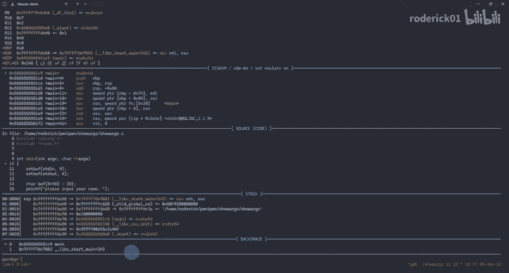

那么我们运行一下contex发现，我们又回到了这个地方。前面我们介绍了基本命令和一些高级的调试命令。但是GDB还有很多有趣的功能等着我们去探索。在这一章中，我会介绍一些常用的使用技巧。

这些技巧在调试程序中会让你事半功倍。第一个调试技巧是分离GDB和程序的输入输出。在默认情况下，GDB和程序的输入输出在同一个终端。有时候并不方便程序的调试。

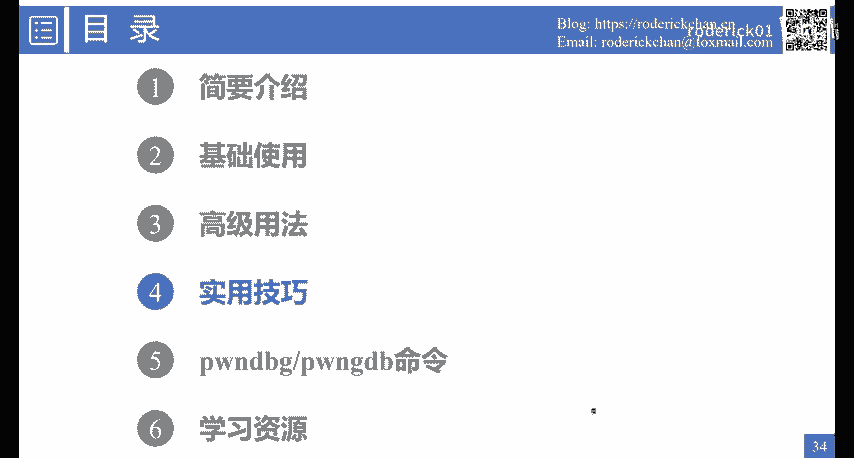

GDB提供了一个启动选项杠TTY来设置程序的输入和输出终端。同时启动了GDB之后，还可以使用GTY命令，指定程序的输入和输出，如图所示。上面的图我使用了杠TTY指定了程序的输出尾终端为DVPTS5。

这样的话就把二者的输入和输出分离了。下面则是使用TTY命令的事例。需要注意的是，我们可以使用TTY命令查看当前终端的终端号，并且输出的终端最好建入一个sleep命令，使得终端陷入休眠状态。

否则输出有时候会跑飞。一般来说，在调试cumule启动的程序的时候，可以使用这个技巧。就可以避免我们按下conrl C之后，直接退出了Qm。因为当程序陷入交互的时候。

我们希望使用controrl C进入调试界面，而不是退出comm。第二个技巧就是使用define自定义GDB的批处理命令。使用define定义P处理命令的时候，dollar a c是参数的个数。

dollar a0是第一个参数，dollar a一是第二个参数，依次类推。我们可以把命令写到一个脚本中，然后使用sourcece命令动态的加载GDB脚本。

或者可以直接把命令定义到加目录下的点GDBin文件，也就是GDB的配置文件。在每次启动GDB的时候，会自动加载这些命令。如图所示，我定义了一个加法命令ader。

并且还使用document命令定义了这个命令的帮助文档。这样我们使用helpad命令的时候，可以查看如何使用ader命令。除了把命令写在脚本里面。

我们还可以在GDP运行的时候直接使用deffinine命令。动态的实时添加所需的批处理命令。对deeffinine的理解就是GDP提供了一种类似于现有脚本的机制，只需要进行简单的命令组合。

我们就可以创建出自己所需的各种命令。命令的加载如右图所示。我们首先查看了一下。脚本的内容和左图是一致的。然后我们使用sourcece命加载了这个脚本。

并且我们使用ad meaning计算了12和123的。加法的值。结果都是正确的，并且每次显示的值会有一个变量的编号。第一次是doer一，第二次是doer2。

接着我们使用了health other mini。查看了这个命令的帮助文档。还有一个和deefine类似的命令。这个命令叫做comcom用于定义断点命中后要执行的批处理命令。

比如这个图里面我定义命中了断点二之后，首先打印RAX寄存器的值，然后显示一下当前进程的信息，可以看到comons是专门针对断点的和display很像。但是display命令只能显示和打印。

不能做别的事情。而coms可以做设置修改数据等操作，前面其实反复提到了GDB的配置文件，我一般会在加目录下设置当前用户的配置文件。GDB启动时会自动加载用户目录的配置文件。我们可以在配置文件中定义命令。

比如这里我定义了两个命令，修base和Bbase这两个命令是用于开启了PIE的程序。其中Bb可以使用相对地址。

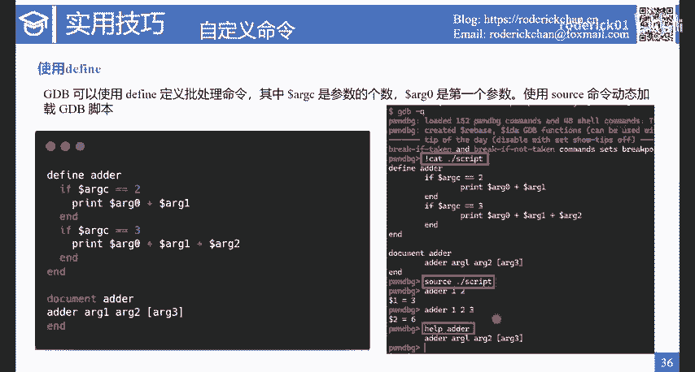

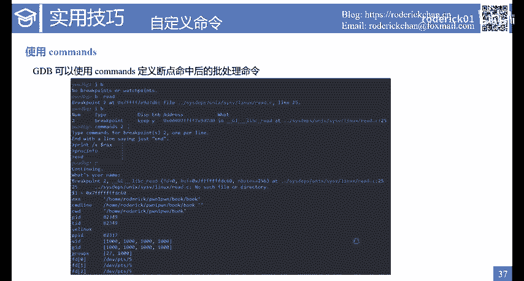

设置断点修 base则是查看相对地址的信息。这两个命令我都使用到了pbug中的一个变量dollar reb这个变量表示程序加载的基地址。由于每次基地址都会变化，所以我们使用一个变量来表示。

设置这两个命令的原因是因为我们在挨中查看到的地址都是相对地址。为了方便断点的设置和查看程序内存信息，就设计了这两个命令。右图是这两个命令的显示结果。

我们可以看到S base显示出了相对地址为零差4000。这个地址处的内存信息。Bb适用于设置断点，可以看到我们成功的在内函数里面设置了一个断点，并且使用的是相对地址。

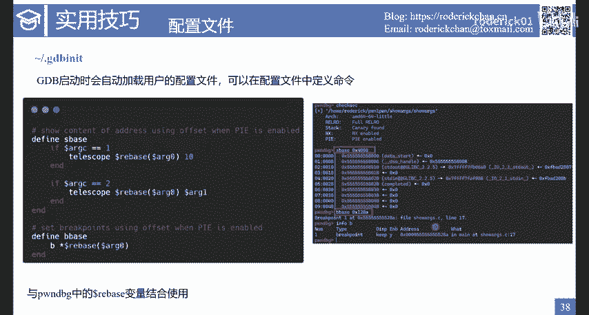

另外一个使用技巧是。GDB调试ca up文件。在我们分析fas结果的时候，我们经常要调试co up程序。co up在前面已经有了简要介绍，在linux系统上，我们可以配置程序在运行崩溃的时候。

是否生成coll file文件，使用unimit杠C。unlimited设置生成的文件的大小默认生成在当前目录。但是在WSL系统中，默认配置会生成在如下这个目录下面。扩文件会保存程序崩溃时的快照。

便于分析程序崩溃的原因，使用GDBEXEC file call file命令可以用于调试cod文件。unimit命令设置后，仅对当前泄有生效。一般来说。

我们在fa子程序之前会自动检测是不是开启了call dump。不开启的话会有一些提示。下一页展示了co up调试的一个示例。首先我们看这一页的左上角的程序。

在这里我写了一个战一出变量buff指定分配的内存大小是0叉10个字节，也就是16个字节。但是我们使用readd的时候，可以最多读取零叉100个字节，也就是256个字节。

我们启动了程序，输入了很多个A。A对应的字节是0叉61。我们在这里输入的数量肯定造成了战役出。而当程序检测到战役出后，程序会运行崩溃。我们加载了扩程序后，使用BT命令。

也就是back trace站回溯命令，可以看到战争被很多0叉61覆盖了。然后程序检测到了战役出，这是因为开启了站保护，有canary的检查。

然后程序从 main中调用了tack check file这个函数。这个函数最终会调用到ras发送一个abor的信号，程序就运行崩溃了。从示例中我们可以看到，使用GDB可以很方便的分析程序崩溃的原因。

除了使用deffi编写简单的批处里命令外，GDB还提供了pyython APII以编写GDB的扩展插件。关于pyython的APIGDB的官方手册上有详细的说明，在之后的学习资源章节。

我会介绍这个手册以及其下载地址。事实上，使用pyython编写一个命令是非常简单的这一页提供了一个用pyython编写GDB命令的事例。首先我们看右图中。我编写了一个get PID点PY文件。

这个文件的内容我使用了cat命令显示出来文件的第一行是import GDB。这是导入GDB这个库。然后定义了一个类，这个类的名称叫做get PID command。继承自GDB的command类。随后。

构造函数也写好了构造函数中需要传入命令的名称。命令的类型。然后我们重载了invoke函数，在这个函数里面写命令的具体逻辑。我在这个函数中获取了当前进程的ID，也就是process ID。

然后使用print meaning令打印了出来。最后在文件的最后一行实例画了get PID command类。好，文件的内容是这个样子。我们再来看左边。

我们使用sourcege pID点PY载入了这个文件之后，就可以使用这个命令了。使用get PID命令可以打印出进程的ID可以看到和process info打印出来的结果是一致的。事实上。

我们可以在pbu或者jeef这些插件上开发我们自己的命令。这些GDB的插件定义好了一些框架，封装好了一些AP，使我们开发GDB插件的效率更高。所以如果你需要编写一些复杂的命令。

我推荐你使用胖 debug开发，而在胖 debug的官网上也提供了开发的详细教程。另外在这里给大家介绍一个联动idda和胖 debug的调试插件，这个插件可以实时显示idda的伪代码。

并使用idda中的函数名下断点，查看idda中的变量的数据等等。我之前在博客中写过一篇关于这个插件的使用教程，感兴趣的话，可以阅读这个博客。

或者直接到我的博客地址里面搜索decom toGDB关键字即可，从右边的图可以看到，这个插件会自动同步函数名称符号占变量等。

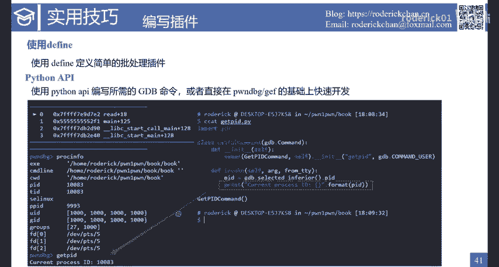

目前，关于结构体的同步还在开发之中，我觉得这个插件最好的功能就是能实时显示当前汇编的伪代码，帮助大家理解函数运行到何处了。对于一些逻辑复杂的程序，可以提升调试的效率。需要说明的是。

目前插件并不适用于大型的程序，特别是程序中含有混淆花指令的时候使用这个插件，插件并不能正确的工作。总的来说，这个插件提供了一个很好的思路，就是把GDB和反编译软件结合起来。

帮助大家在调试程序的时候更好的理解程序逻辑。当然，你或许会问为什么不直接使用idda pro调试程序呢？这是因为挨da中查看内存操作寄存器查看堆的分布非常的不方便，并没有GDB好使。

所以调试胖的时候主要以GDB为主，挨打为辅助。我曾经也想过，是不是可以反过来开发一个插件，给挨打一个命令行窗口，让我们能实时的输入一些GDB的命令。这样的话。我相信大多数人就会选择挨打为主的调试方案了。

毕竟挨打提供了类似源码级的调试体验，肯定比GDB调试汇编要好一些。好，下面是这个插件的使用示例视频。接下来我来演示一下Dcomp toGDB这个工具是如何使用的。

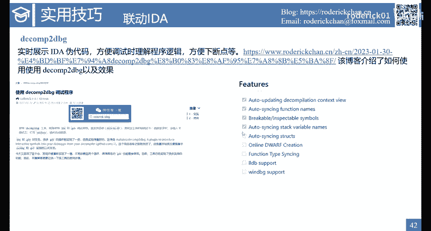

首先呢我们需要。打开艾打。

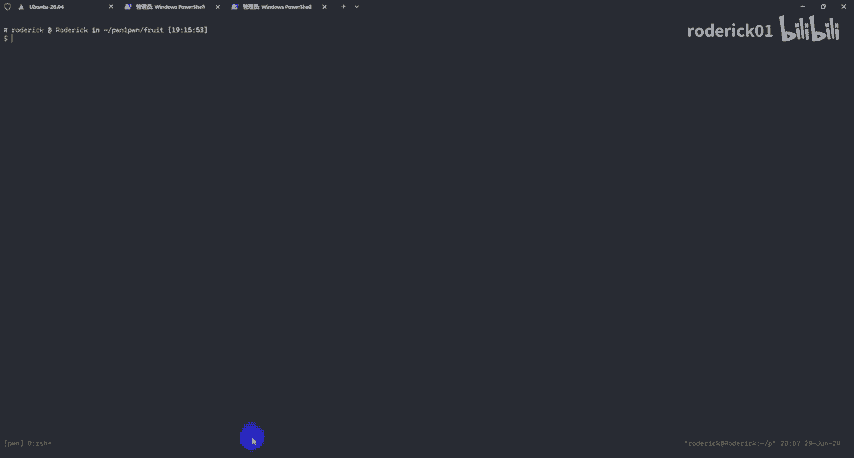

那这里我已经打开了。我使用的是上一次课里面提到的一个叫fruit的程序。然后呢，我们安装好了插件之后呢，我们需要。启动这个插件。那我们选择监听的地址是127。0。0。1。然后端口是3662。

这里因为我使用的是WSL，所以。

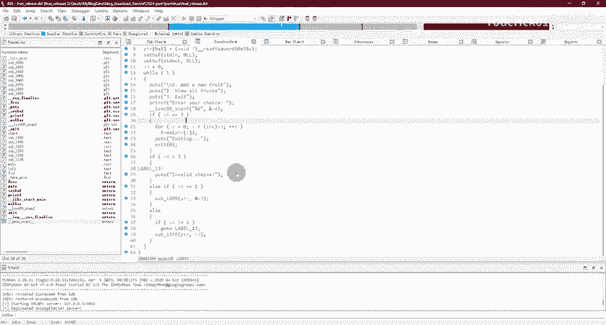

我的。乌班图是无法直接访问我的windows的端口的，要配置一些规则，所以我直接使用了。SSH的端口转发，这是一个远程的端口转发。就是把把远程的1001端口转发到本地的3662端口。

也就是我刚刚监听的端口。好，然后我们刚刚已经启动了，这个时候我们先。启动这个程序。我们发现在没有。和这个挨打联动之前，我们是缺失很多符号的，连魅影的符号都找不到。那么我们需要和。挨打进行联动。好，首先。

启动程序。然后呢，我们执行一个命令，之前我已经输过了。因为我直接把这个3662端口转发到了本地的1001端口，所以我这边指定的两个参数，分别是。本地的这个还回地址以及这个1001端口。好。

然后我们点击一个。回车之后发现就成功的连接到了这个decomp。这个时候呢，我们再进入一下SI就发现哎，他这边多了一个窗口，并且这个窗口会实时的显示挨打的反。汇编的这个界面。好。

那么我们知道我们现在是在执行这个内函数，那么我们可以P来打印一下内函数发现。他也把面函数的地址给我们了，那我们可以直接在这个面函数这边下断点，然后继续好，那我们就直接进入到了这个面函数里面。

那我们看这个界面和艾da的界面。

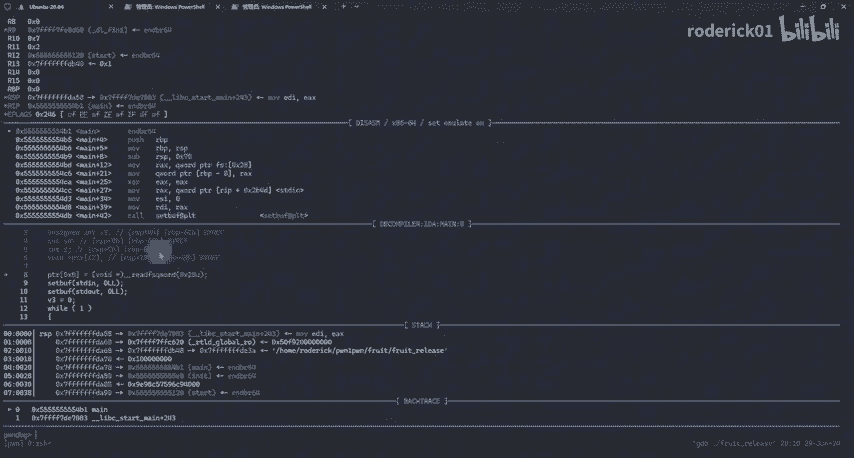

是一模一样的。也就是说艾达里面的所有的变量，我们都可以在我们都可以在GDB里面去使用和去访问。

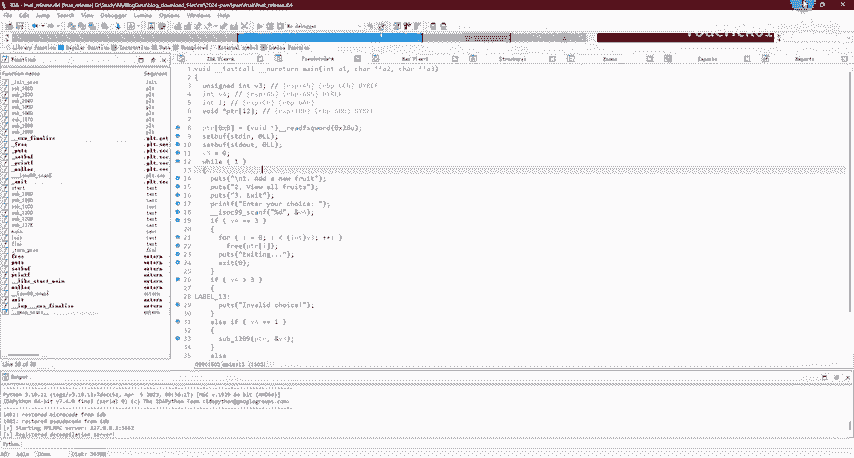

我们执行一些代码之后，发现我们可以实时的看到我们的代码执行到了哪个地方。

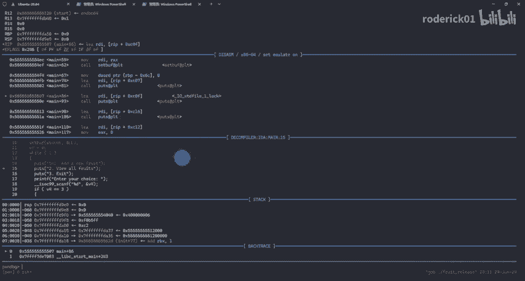

所以这就是这个插件的主要的用处。最后介绍一个调试技巧，叫做反向调试。也就是说，我们调试程序的时候可以反悔，可以让程序倒着走。反向调试的命令主要是record。使用record命令后。

在运行程序会记录每一步的调试状态，所以我们就能反向调试。当程序出现bug之后可以回退。事实上，这个命令提供了更加细力度的快照功能和前面介绍的checkpoint类似。

接下来我会展示一段视频也是如何使用record反向调试程序，让程序倒着走。接下来我们来看一下。

GDB的 record meaning。它可以让程序反向运行。提供更细腻度的快照功能。首先我们启动程序。然后我们执行一个record。他就已经开始记录你的每一个指令。你的程序的这个每一步的执行状态。

然后呢，我们去执行一些步骤。一直执行到卡这个地方。接下来我们可以反向执行，也就是。Reverse。Stteep I。可以看到。程序在回退。我们又回到了最开始执行的那个地方。然后我们可以停止记录。

并把这个记录保存到日志里面。这就是record的作用。通常可以把这个功能和checkpoint结合起来使用。接下来在第五章中，我会介绍胖 debug和胖GDB这两个插件的使用。

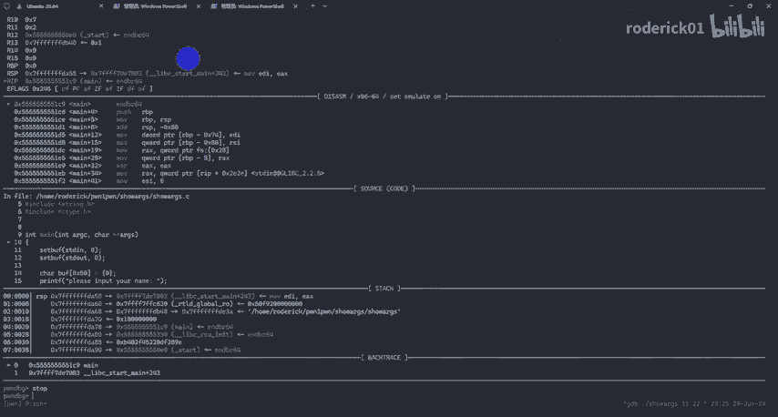

事实上，这两个插件的安装流程，我已经在第一章中进行了详细的介绍。在这一章我会介绍一部分的胖tybug命令，特别是一些很好用的命令。在这里在重新简要介绍一下这两个插件。

胖tybug是一款普遍使用的GDB插件，用于调试胖体而胖GDB是胖tybug命令的补充和增强，其中提供了很多与堆IO file相关的调试命令。首先我们来看胖tybug。

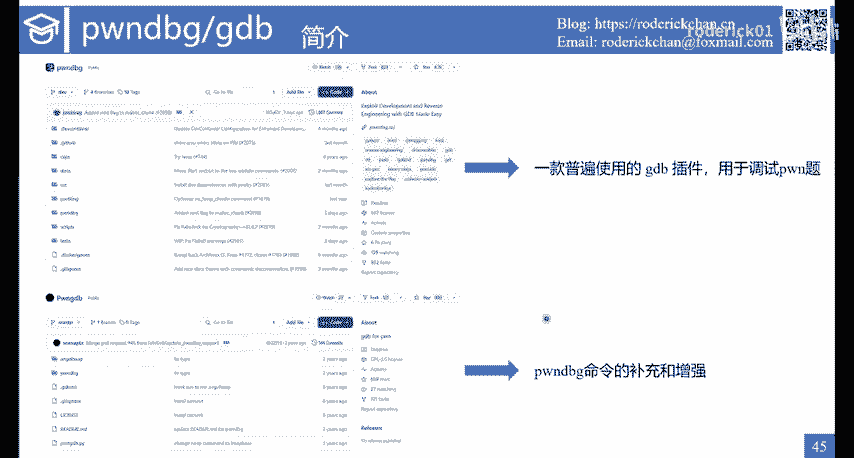

上面的partb点RE是其官方文档的说明地址。在官方文档中。介绍了ptybug的安装运行命令源码等。从界面中可以看到，现在胖tybug对命令做了细致的分类。

分为了start integrationlinux stack等等。胖tybug提供了丰富的调试命令，特别是提供了很多适用于堆的命令。这对于调试堆内存大有裨益。关于学习胖 debug。

我的建议是把这份文档中的每一个命令都学习一遍，学习的步骤是这样的。第一，查看命令的描述。第二，点击文档的详情，查看命令如何使用。第三，根据命令的描述，把命令能实现的功能都敲一遍，实践一下。

基本上这套流程下来之后，大多数命令都能记下来。而针对一些有用的命令可以反复的练习。由于bug提供了非常多的命令，在这里我无法把所有的命令都讲一遍，我会从每个类别中选取一个代表性的命令。

讲解其详细的使用方法，带大家简单的过一遍。第一个是ent命令。这个命令用于启动程序。这个命令和前面介绍的star命令类似。但是这个命令会停留在当前程序的star函数处。

而不是LD点SO的star函数处ent后面可以接需要传递的程序参数，图中是一个示例，我传入了112233这三个字符。从图中可以看到，我们确实断在了当前程序的start函数处。

因为程序的地址是零叉55开头，而不是零叉7F开头。第二个命令是ROP这个命令会使用RPdget工具寻找dget最主要的用法是使用P接一个正则表达式筛选我们所需要的dget同时我们可以传入。

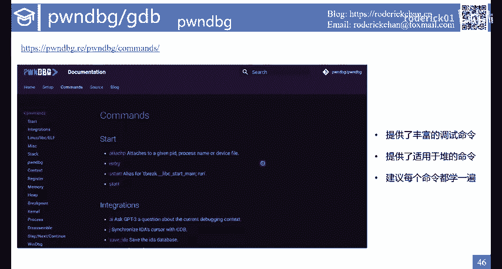

RP gat所需要的命令行参数，查找需要的gadget或者字符串。第三个介绍的命令是got命令，它用于查看程序和加载的动态链接库的got表条目got杠R显示只读的got表。

got杠A显示所有的got表条目，从截图中可以看到，got杠A不仅会打印当前程序的got表，也会打印LD点SOlip C点SO的go表。这个命令对于高版本的lip c got hijack技术。

也就是lip c got截持技术有一定的帮助。接下来介绍的这个命令叫sig return。从名字可以看出来，这个命令用于辅助SLP的调试。关于SLP的细节在之后的课程中我会进行详细的介绍。

这个命令就是用于判断利用sign return系统调用伪造的sign frame是否正确，以及查看对应的寄存器的设置是否正确。比如要执行系统调用的话。

就可以使用这个命令查看IXRDIRSIIP等计存器的设置是否满足系统调用条件。如果要继续IOP，还要看RSP的设置是否正确。这个命令接收一个地址参数，就是从这个地址开始伪造signal free。

除了GDB有辅助命令外，后面要介绍的pntts也提供了一个类，专门用于伪造signal free，非常的方便。在这里的截图中。我使用的是。RSP寄存器的地址。

假设从这个地址开始来伪造signal frame，把它作为signal frame的起始地址。Stack命令是比较常用的一个p debug命令，这个命令会打印站的详细信息，后面有两个参数。

第一个参数是打印的条目的个数，8个字节为一个条目。第二个参数是从偏移多少的地址开始打印。这个命令比较简单。下面是contex watch命令。

这个命令主要是帮忙在界面中添加一个窗口来监视自定义的表达式或者变量的值。这样的话，在每次执行命令的时候，我们都能看到需要监视的表达式或者变量的值，方便我们的调试。比如我想一直监视RAX加RBX的值。

如图所示，就可以进入context watch，然后RAXBX就可以在截图中看到多了一个expression窗口，在这个窗口里面会实时的显示这两个寄存器的和的值。如果需要取消这个窗口的话。

可以使用context on watch命令。接下来介绍的这个命令可以用于地址泄露，也就是P to P命令。

这个命令后面的参数都是m names这个name就是使用VM map查看进程的内存映射信息的时候显示的名字。比如说在这里的示例中。

我使用了P to p stack就会显示在当前站上指向libc区域的指针。同样的也可以反过来查看libc的地址空间上哪里有写站的地址，这个命令用于地址泄露。也就是说我们如果能够控制tack区域的读取。

就能泄露tack上面存储的libc地址，这个命令非常的使用，强烈推荐给大家，特别是和STD out泄露地址的技术结合起来，可以快速获取所需区域的地址。下一个命令是MP命令这里的MP命令是和堆有关的命令。

堆相关的命令，我建议大家都看一遍，学一遍。我这里只是。用这个为例，这个命令就是打印MP下划线结构体的信息。这个结构体会控制堆分配的一些行为。比如D cash bin相关的配置等等。

修改这个结构体的配置项，也是一种利用的手段。上面介绍了一些胖 bug的命令。这里是胖GDB的截图和命令。总的来看，胖GDB提供了一些进阶的调试命令。但是由于胖GDB很久没有更新。

有一些命令 debug已经提供了，所以大家可以按需安装。从这张截图中可以看到胖GD所提供的所有命令。比如是我比较喜欢使用的命令。还有FP用于查看伪造的IO file结构体，在调试堆的时候。

我建议开启这个插件关于前面所介绍的插件的命令。我的建议是最好是自己敲一遍敲完之后，你就对这个命令的具体作用会有更深的体会。有句话说的好，只上得来终结前觉知此事要公行。不管是看文档还是听我讲课。

都是理论课，除了理论之外，还需要大量的实践加深对理论的理解。接下来是第六章，在第六章中，我会介绍一些学习GDB的资源。首先是100个GDB小技巧，这些小技巧其实是把GDB中常用的关键的操作抽取出来。

写成了一份文档。在这个文档里面提供了我前面讲解的大部分内容，这份文档并不长，整体读完一遍，也花不了太多的时间。我在这里给出了文档的地址和截图，需要的师傅们自行搜索即可。

如果你需要完整的掌握GDB的原理和命令，那么我推荐官方所撰写的debugging withGDB这本书。如果我没有记错的话，这份GDB文档有900多页。可以说是非常的全面。下载地址和在线查阅地址。

我也已经放在这里了。大家可以访问对应的地址下载文档或者在线查阅文档。总的来说，学习GDP和学习其他命令行工具是一样的，需要多积累命令，多练习命令，掌握常用的几十个命令即可。对于一些复杂的命令。

需要的时候再去查阅相关的文档或者咨询chatGPT。总结起来，一句话。无他为首熟耳，熟能生巧，学习GDB的资源。我目前只介绍这两种，因为命令行工具的学习都大差不差，需要入门的话，搜索一些博客。

需要深入了解的话就去啃官方文档。剩下的工作就是反复的练习。

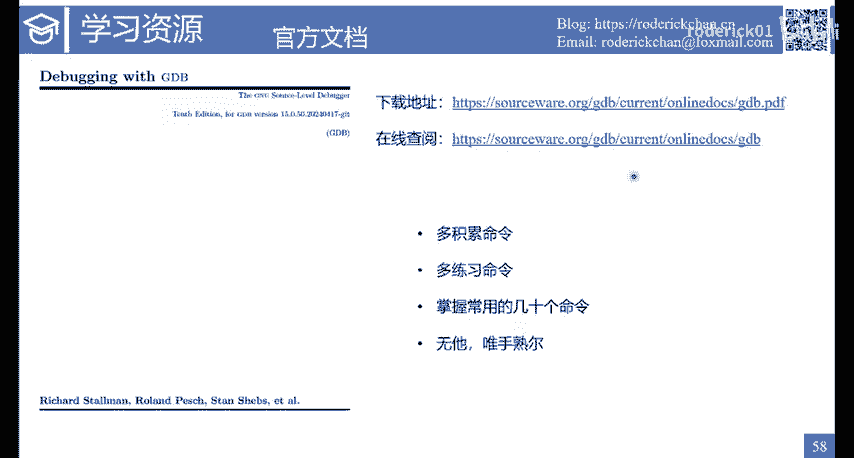

好了，本节课到这里就结束了。这节课我们学了GDB这个强大的调试工具，熟练使用GDB对于学习胖能起到事半功倍的效果。下节课我将介绍另一个很有用的工具Tm最后祝大家学习顺利，变得更强。我们下节课再见。

