# 81-红日靶场（一）--20-ATT&CK红队评估（1）使用find删除文件小技巧 - P1 - 小飞侠Geek - BV18mpgecE7F

那大家可以看到，对于这种。格是的压缩文件，我怎么把它解压呀？那你看从他的名字上，我们可以看到这个文件应该是一个比较敏感的文件，是不是啊？😡，哎，我们昨天有没有讲过这个压缩工具啊？哪个工具啊？嗯。

这个工具是吧，有这个工具吧，啊，默认是有这个工具的，对不对啊，那我试着关解压一下啊。😡，R。备份。被分别IR对吧？那我我们在这里呃，大家看我在解压的时候注意我们应该还要加一个选项，加一个选项。嗯。

要加一个可以加一个X。对吧可以加一个X。稍等。嗯，我看他的用法哈命令。呃，开关文档文件。然后我们在这里解压文件需要一个完整的路径。然后这TT示测试V是详细信息。呃，不需要文档的路径EE。呃。

然后他有一些开关。啊，我们看看这个开关。应该没问题。好，再试试。X1。我试试。嗯，X2。呃，看一下他的用法。不加杠哦，不加杠是吧？哦，我们试试哦，对。他是一个命令是吧，对他这个命令不是一个开关。对。

好的，然后我们选。A呃，选选A问我们。哦，好像已经解压好了是吧？我们想全部计换好了。IOS哦，大家可以看到，现在就就解压好了。但这种解压大家可以看到不是太好啊，大家有没有注意到？😡。

他他默认是把它写到当前目录，是不是我们用E这个选项大家有没有注意到？😡，对吧这样解压不不是太好on ra。也包括我们刚才我们原先的文件是不是也。😡，对吧哦，这时候我应该怎么办呢？

大家来看这时候我其实遇到了一个小麻烦，对吧？他默认是不是把这个文件都解压到当前目录了，大家看到了没有？嗯，I。经点RL，这是我们的文件，对吧？这是我们的文件对吧？啊，这是我们的两个文件啊。

那我我就这样做一下哈。呃，我们可以把我看看时间啊。时间的话大家可以看到大家注意有没有注意到他这些文件都是2连。13年的对吧？嗯，再看看我们的文件呢。对吧再看看我们的文件呢，那就是。呃。

备份2这个这个文件呢相对比较时间比较早，而其他的都是2013年的对吧？那我们是不是就可以根据时间来进行查找呀？😡，对吧时间进行查找，可以根据时间进行查找理解。对吧我们根据时间你那这个时间是多少？

是200。那这个时间怎么是2019？啊，这个时间是2019，这个呢是当当前的时间，大家有没有看到？呃，我看一下哈。那我现在我想把原先的文件我都给他。2013年的文件我都给他删除嗯。

这时候我们是不是就可以根据时间来进行查找啊嗯，我想一下啊。嗯，我们应该怎么去做？Find咨 find。犯案的我去找找的话有一个时间时间选项。嗯，我们来看看犯案者的帮助。慢犯案的。办者的帮助在这里。

他有一个。嗯，M time。嗯，我看一下啊。M time这个时间。对吧啊，M time啊，大家可以看到就可以按照时间。那么我们来看啊，这里面有一个。这。加这里呢这个应该是天，这个时间有点太早了哈。

M time就是按照时间修改时间来进行查找。这里呢大家可以看到这里面有有没有注意到。一个是加N加N就是多少天以前的。然后呢，杠N呢就是多少天。呃，以内的。然后呢，这个呢是精确的指定时间。

对吧精确的指定时间，这里要要注意一下哈嗯。这个选项。我们 find一个。在查找的时候，这个M time。按修改时间查找。按修改时间查找。那么在这里呢，他有一个这三个选项啊，一个是加加N。一个呢是简N。

一个呢是N。啊，这个time是应该是天天。嗯，多少天以前？这个呢是多少天以内？以内。然后呢，这个是多少天？精确的多少天？大家来看。

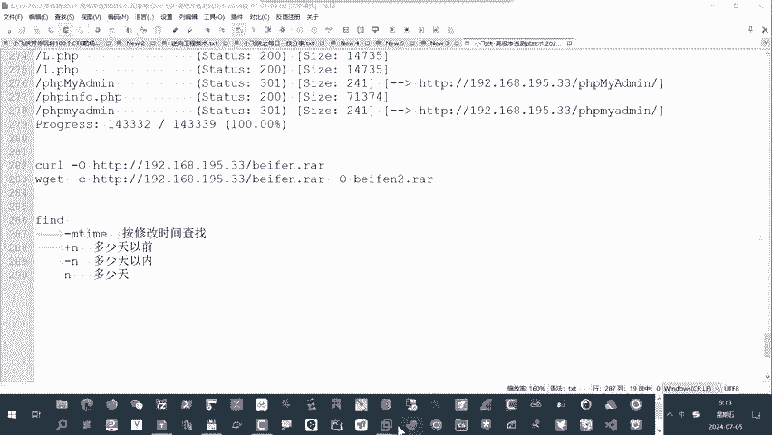

嗯，现在呢我们去找，比如说我去找。7。呃，M time杠7这是什么意思？因为这个单位是天。这里面找什么7天以内的文件是吧，7天以内的文件。哎，大家看这是7天以内的问题。但是我们在找的时候啊。

大家可以看到你会发现。如果我只找。你看啊。在找的时候啊，大家会发现这个是不是我们的字典文件。😡，对吧嗯，那我们在找的时候，其实呃它应该是什么呢？我只想看一级目录，大家看只想看一级目录有没有注意到。

但是它它是不是深入到了。😡，底层递归进行查找了。对不对啊？那我这时候我我同样的，我们是可以改一下的，慢一下。Find。我们来看那他应该是有一个选项嗯，第一嗯，我看一下这个选项叫深度。

我看有没有这题DEPTS。好，对，在这啊大家看有一个这个选项。mark这个选项我再找一找这个选项啊。😡，对，大家看这有一个深度，最大的深度级别，大家看到了吗？😡，啊哦，那我们。来测试一下。这行。

再加上这个。呃，级别我去找一级。这样这样是不是就比较好了，大家看到了吗？只在一级，也就是相当于只在哪里找呢？崔大，我们平常要看一，就这样去找，这就这就是一级，对吧？😡，这样呢我们去找就找一级。

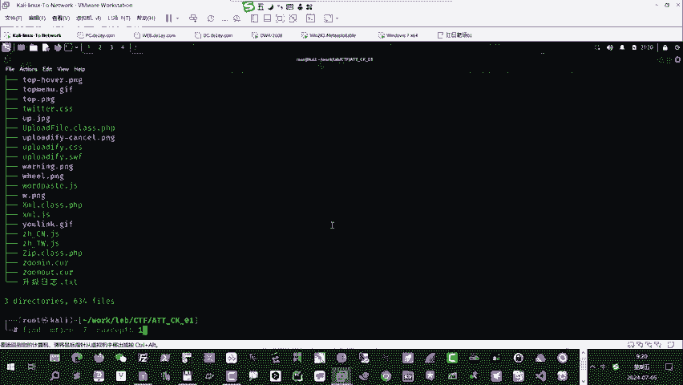

明白，就是层次至少到一级目录，懂了吗？如果不加这个选项，大家来看，你会发现我找到的效果就是这样的，理解。😡，是吧啊，所以在这里大家理解，哎，这时候我们来看这个选项啊，大家顺试。办的哦。

那这个选项呢大家来看是查找目录的层级。按照目录的最大深度。为一级。危纪。那大家可以看到我们在这里啊呃之所以我们又又讲到了find，这是因为我之前我做了一个操作呃，我解压的时候。呃。

大家可以看到我解压的时候用到了。

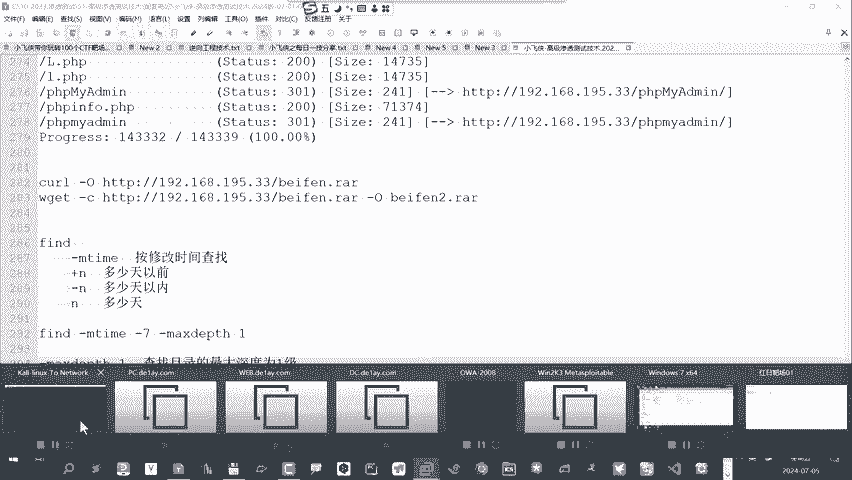

就是我们的。on rare这个选项杠E这个命令。22。大你看刚一这个命令啊，其实我们在用的时候是不不准确的。😡，你看在解压的时候，他没有没有把我们压缩包的这个路径给它放进去。😡，明白了吗？

你可以看到我们把这个压缩包我帮它拿过来哈，我我通过。laable c t f。

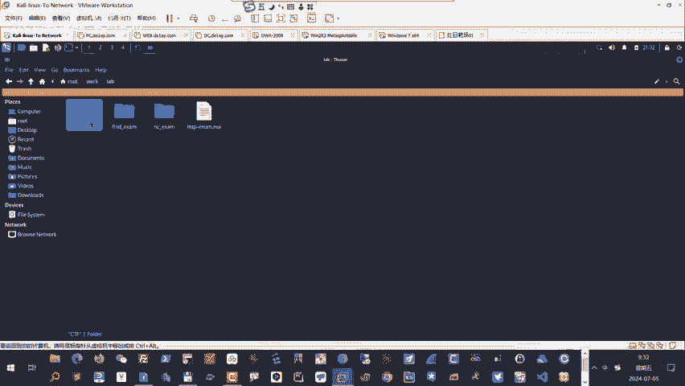

你看我我是不是都放到这里了？😡，对吧大家看到。呃，我们应该是有一个。有一个文件。嗯，我这样。再打开一个。我把CP一下。Work level。CT f。哦，我们是不是有一个备份啊？对吧备份点RIR。

我把它拷贝到我的家目录，我从加目录把它打开，这样比较简单一点啊，看一下。

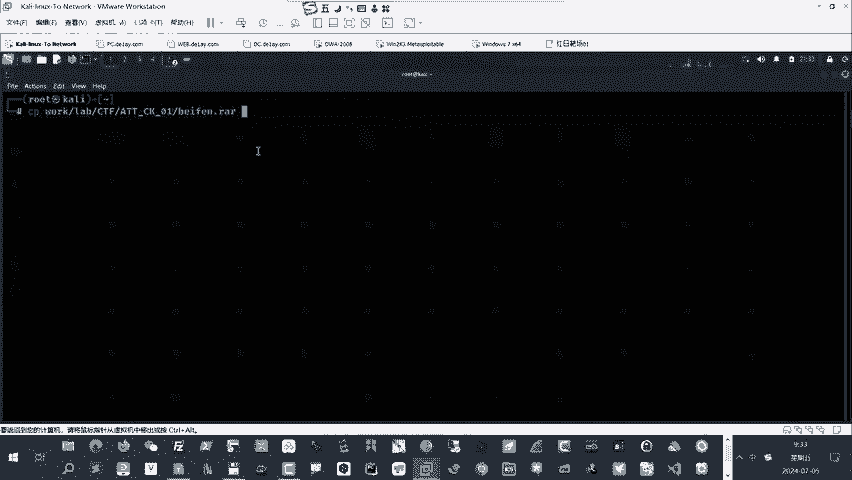

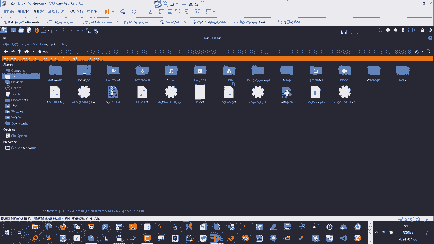

备份在这是吧。我把拷贝到我当前的主机中，嗯，大家来看。因为我在解压的时候，大家看这个杠液呀，它它不需，也就是说。😡，我只接是到这里面，你看啊没有加上这个文件的完整路径，大家看到没有？😡，对吧直接把他都。

😡，都夹到当前目录了，有没有注意到？呃，这样其实是不好的，是不是啊？我们所以在解压的时候应该是呃怎么做比较好呢？大家可以看到。

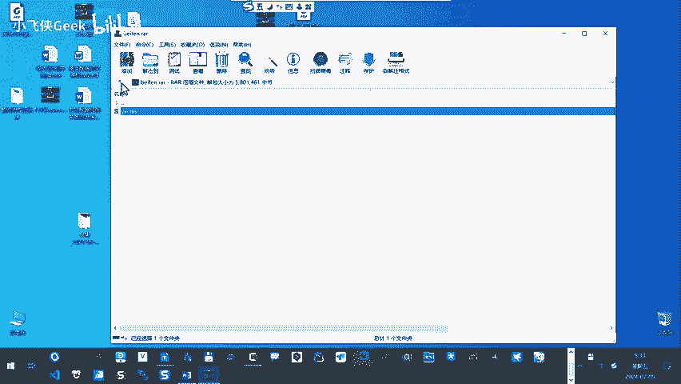

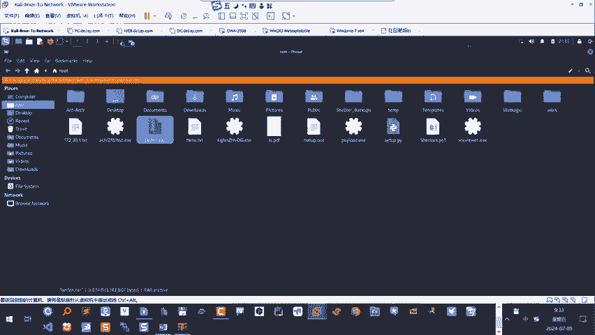

就是待会我们带来试样，应该我觉得应该要加上这个。X要使用它完整的路径，明白？完整路径，待会我们再看看效果。呃，那现在所以就是因为我解压使错使错了命令，大家可以看到它这里造成了我当前是不是这种问题啊？😡。

啊，所以我要把我要我要解决的是要把我刚才错误解压的文件给他什么？😡，删除对吧？删掉，但我要一个个删肯定很麻烦，是不是啊？所以我怎么办呢？我先把这些加厚的文件，我先给它找到，是不是啊先找到。那找到的话呢。

大家可以看到我就可以我我们根据刚才查找这些文件，我们发现都是时间比较早的文件，是不是啊？😡，对吧时间比较早的文件，所以我可以按照文件去什么呢？查找。那我去找什么呢？当然如果我去找。

我也可以去找7天以前的，大家看那就是加期。😡，加77天以前的对不对？几点以前的理解。对吧那我也可以去找，那我也可以这个这个减期呢，就是7天。😡，以内的对吧？7天以内的有没有注意到？嗯。

那如果我再找7天以内的周肉加上这样一个层级，大家看到了吗？😡，嗯，对吧那这时候大概我要找到7天以前的这些文件。我找到之后就可以干嘛呢？给他删除是不是啊？那我们可以EXECL杠L。

我们去查看这些文件的属性。

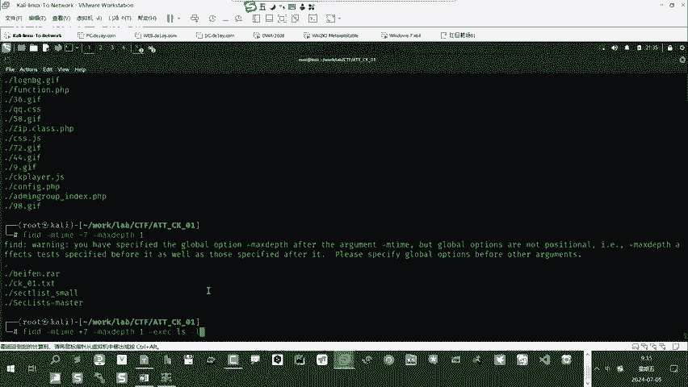

大家可以看到这些是不是就是我们要找到的这些文件？😡，对吧L杠L那我这时候可以把这个命令换一下，换成。RMRF直接把删了。对吧R杠L。这时候大家可以看到是不是有把那文件都。都删除了，理解。对吧。懂了吗？

当然我们那个备份，我们有一个呃，大家可以看到用W gate下载的时候，它它因为这个备份啊，大家可以看到这个文件啊。这个文件我们在这里应该看到它是2019年的，你看到了吗？😡，嗯。

他保留了保留了原有文件的时间属性。看到了没有？所以我们刚才那个备份二也删除了，那就是我们用到的Wbe这个指令。就是。ctrorl加RW gate嗯，大家看我们。加一个指定。这时候如果我们这样去做的话。

大家看备份二其实是保留了原有文件的属时间属性，看到了吗？啊，所以我们刚才如果要删7天以前的这个备份二，其实也删除了。那刚才我用到的这个命令，大家来看是这个。这个意思是不是就是把7天以前的文件对吧？

当然我们这里设计了一个查找的层级，对吧？找到之后给他执行删除命令。对吧这样还是比较好的对吧？按时间来查找。好。啊，这是我们遇到的一个小问题啊，刚好我们抓紧找到了发案的事。全部。你们可以做一下这个实验。

这个实验你们怎么做呀？哎，你们怎么做就实验大家哈你们直接就要按照我刚才那样做。😡，就是我再来演示，你们先记下啊，再演示一遍。那注销不了了。那你再重新下载一份嘛？😡，对吧能下载一次吗？是吧。来来看一下啊。

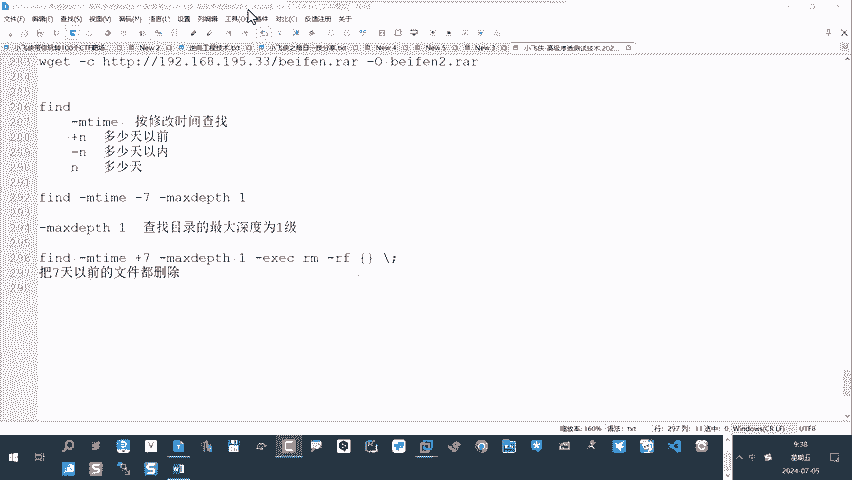

啊，我我再来演示一下啊再来演示一下，刚才我们用了一个错误的。😡，解押命令就是on rare是吧，on rare杠杠什么杠E是不是eE备份，对吧？你看。😡，你们也可以这样做一下是吧，onre是不是啊？

当然如果你把这个也删了，你就重新下载一份嘛，对不对？这样呢是不是大家可以看到，然后选A。😡，对吧是吧全部解压加是不是？啊，那我这时我们由于这个文件解压后，我们看一看它的属性都是2013年之前的。

所以我们这时候就可以大约摸鼓摸一个时间。对吧我把7天以前，因为我们这个靶金肯定是没有7天以前打的对吧？对不对？那我把它找到之后，我把它删除。好，OK。对吧懂了吗？

那么on rare on rare这个命令啊，我们在解压的时候，我们再看一下我们应该用哪个命令呢？on rare。呃，这时候我们应该我觉得应该用X是不是比较好啊，对吧？X啊，我们用X试一试。

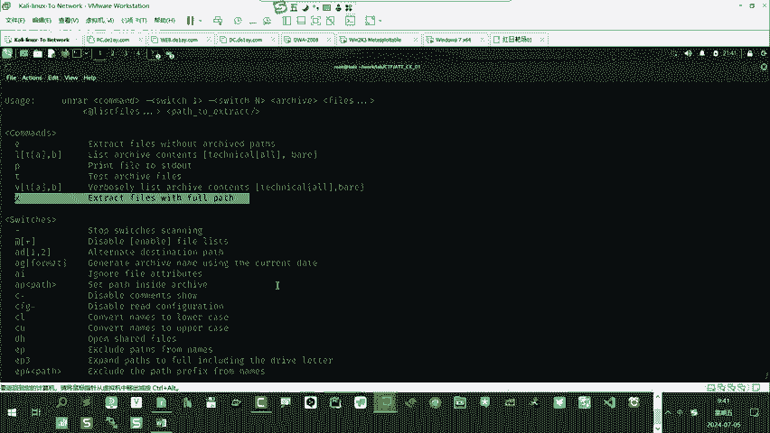

On ra X。备份啊，大家看X是这样的是吧，你看解压之后，它是不是哎。😡，是不是相当于我们在这里。我直接把这个目录拿过来是吧？😡，压轴是这样的，大家看到了吗？

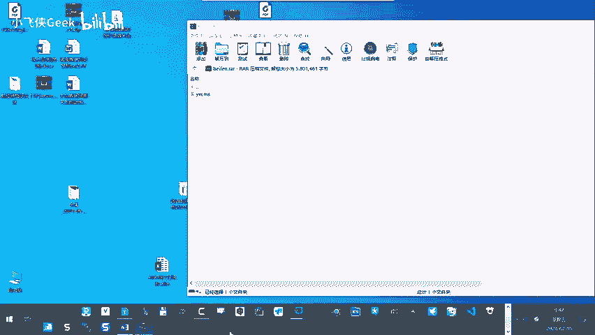

onra呃，所以我们在检查的时候，大家看应该用杠X呃，用X这个命令是比较好的。

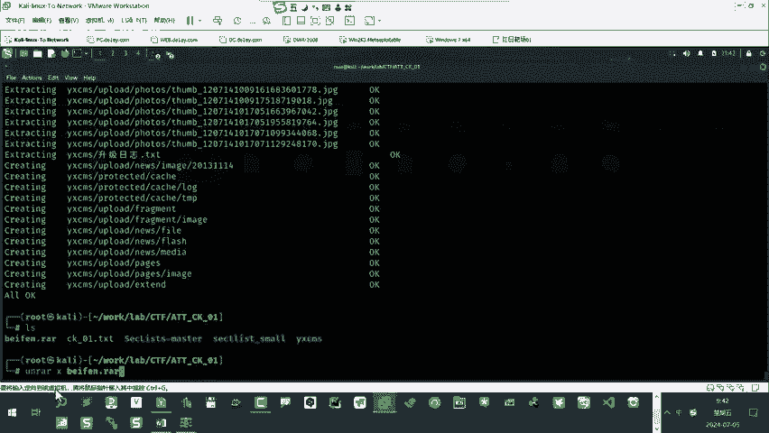

我解压之后哎，主要我用的是这个命令on。好，所以我们把下载的文件解压。嗯，这里我们多讲了一个小的知识点。是吧。😡，大家来看。那解压之后啊，有没有注意到我们解后的目录是一个什么目录？

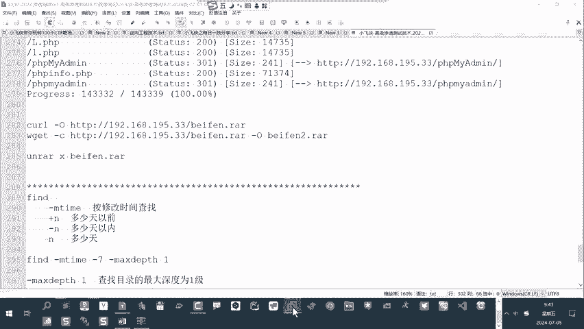

EXCMS。啊，对，YXCMS。这里有一个有一个知识点，CMS大家先去。搜一下这个概念，什么是CMS。

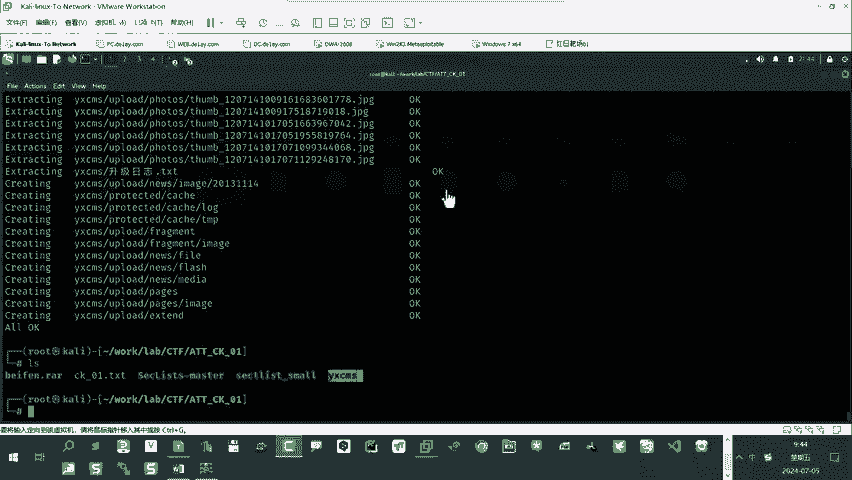