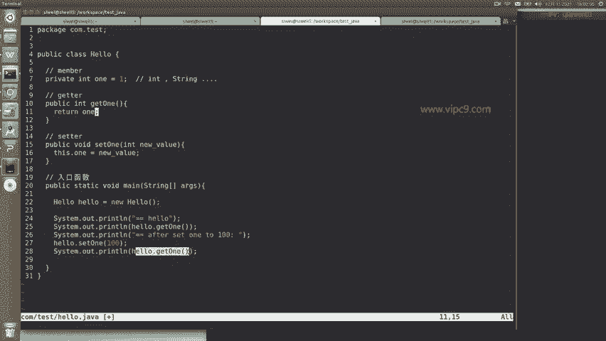
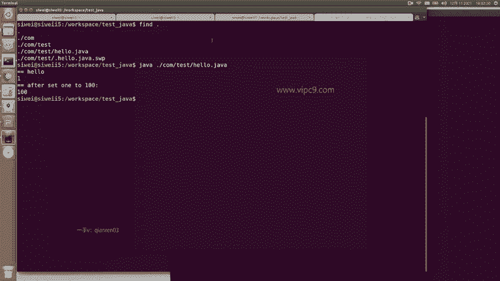
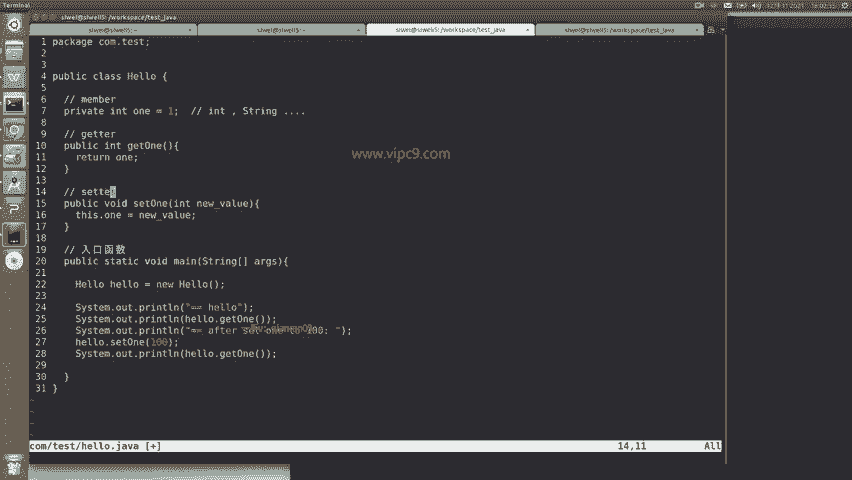

# Android逆向-基础篇 - P10：章节3-3-java语法-class-method-member - 1e0y_s - BV15jhbeCEQk

下面我们看一下红框中的内容。红框当中呢。one啊它是一个成员变量，这个成员变量是属于hello的啊，这个class可以看到class从这个大括号开始到31行的这个大括号为止。

这里面都是属于hello这个class的。在这里面，hello class第七行声明了一个成员变量。这个成员它为什么是一个变量呢？因为它是可以通过等号来赋值的。这个变量的类型是int啊。

int呢就是integer的缩写是一个基本类型。那么在java里面，类型就分成int、 string啊等等。Yin。啊，这个sstr。等等等等，这些都是基本类型啊。

然后呢下面这两个就是getter和setter，也就是说这是两个方法，方法呢都是以这个小括号和大括号作为结尾的。那么。中间的小括号里面的内容就是方法的参数。那么可以看到get one啊。

也就是说获得这个one这个变量，这里是不需要任何参数的。所以说直接是空着空着就好了。那么set one啊，这是一个seter方法，或者说这是一个设置成员变量的方法。

那么就需要一个参数是一个new value新的值，在这里它的类型是int啊，所以说这个int的类型是跟这里声明的。Wen。啊，是一样的类型。

所以说才能够有1六行之类this点 one等于new value。那么this点 one啊就指向了这个成员变量onethis是一个关键字，就表示当前hello的这个实力。所以说这个是get和ser方法。

那么下面这个入口函数，刚才已经讲了，它是一个特殊的函数啊，我们通过java函数这个命令来运行的时候，就会首先从入口函数来运行。所以说呢在入口函数里面，我们二2行首先先声明了hello的这个实例啊。

记住啊，new哈喽就会产生一个实例。然后呢在这里啊先打印出一个hello，然后呢打印出ge one。这样的话应该是这个ge one，也就是一啊，然后呢再把这个。万设置成100，再打印一下。

我们看一下结果。

那么在这里我们。java然后运行这个。复制粘贴。可以看到一开始是一之后就变成了100。

那么这个就是一个最简单的class啊member和这个方法。下面呢我们来看一下呃if和循环语句。

