# Android逆向-基础篇 - P11：章节3-4-java语法-循环和条件判断 - 1e0y_s - BV15jhbeCEQk

这个例子包含了循环，也包含了条件判断。我们先看循环。在这个文件的第八行到第十行，这里是一个for循环。可以看到它括号里面包含了三个部分。第一部分是intI等于0，在这里声明了一个临时变量，I等于0。

第二部分啊，I小于5意思就是每次循环的时候啊，都要做这个I小于5这样的条件判断。如果判断为处的话，才执行里面的语句。等执行完后面的语句之后呢，再执行这个I加加。I加加的话呢，也就是让当前这个整数加一。

前面的这个I等于0只执行一次啊。好的，那么我们运行它看一下。

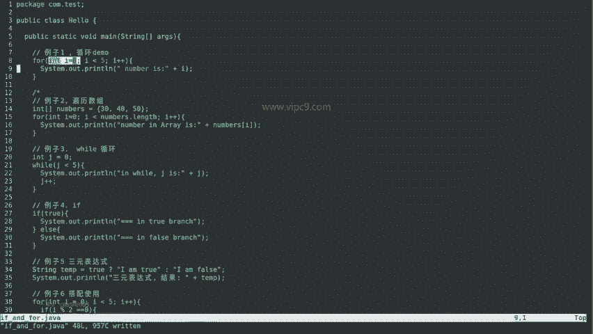

可以看到，在这里从0到4都给它打印出来了。

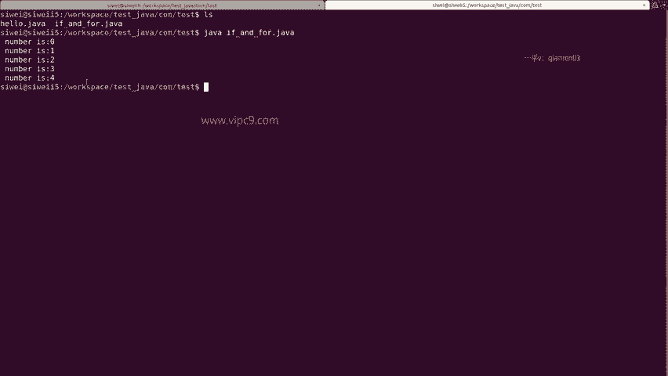

我们看第二个例子。第二个例子。第十五行这里我声明了一个数组。这个数组有三个元素，3040和50。然后使用for循环，把这个数组的元素给它便利的显示出来。这里numbers。

然后中括号I就表示取数组的第几个元素。所以说这个就是一个循环显示数组的一个例子。

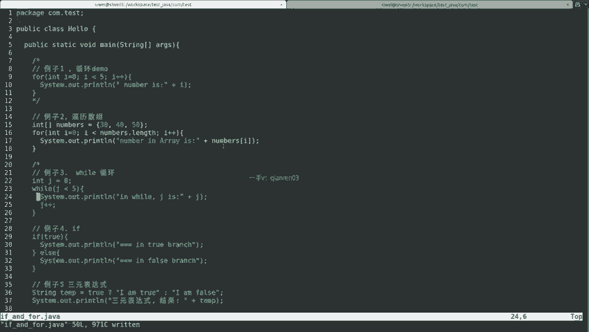

看一下结果。

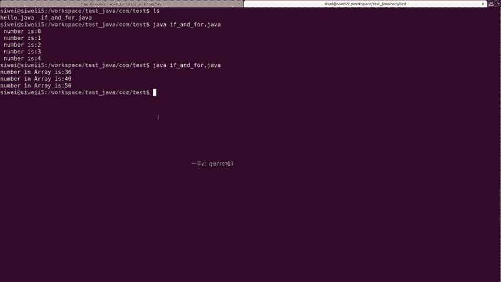

嗯。出来了。下面我们看一下well循环。那么well循环跟for循环是等价的。在这里21行先声明一个临时变量。22行这里。把well括号后面的内容每次都进行判断啊，如果成立的话，就执行代码块里面的内容。

执行完之后再来判断，然后再执行。是这么一个过程。我们运行一下看看。在这里先声明了一个临时变量啊，勾等于0，然后只要勾小于5的话就输出。

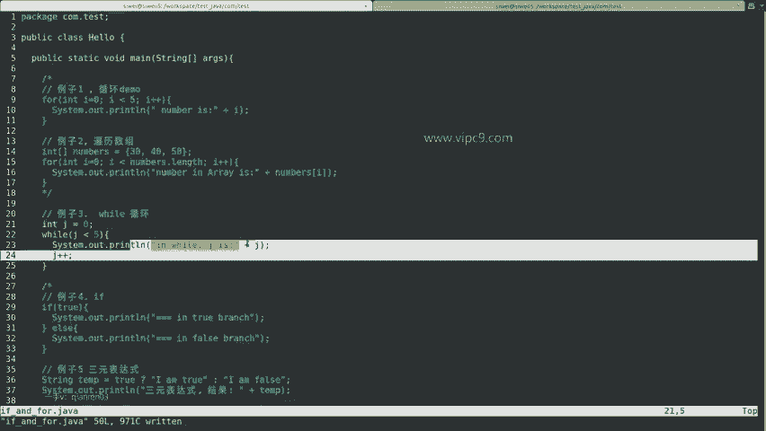

我们执行一下。嗯，可以看到。

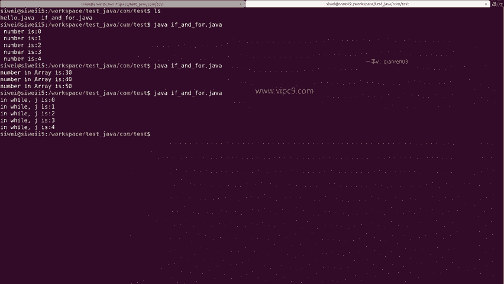

这里就出来了。well循环它跟F循环是等价的。啊，for循环后面是有三部分。可以看到分号第一部分I等于0，就等价于这个勾等0。然后I小于5分号，就等于well括号里面的内容。

最后I加加其实就是这个勾加加，然后for循环体里面的内容就是well的这个内容。所以说他们两个是等价的。下面我们看一下条件判断。条件判断非常简单。😊，看一下代码的27行。啊，到32号。先是一个if。

然后括号里面是一个条件。那么这个条件我直接给它写成了t。下面这里啊就是一个alse。我们也可以给它增加一些分支，比如说Iif。等等等等，这个可以随便嵌讨啊。那么满足哪个条件就会运行。对应分支下的代码。

比如说在这里。满足te这个条件的时候，就会显示啊in true branch在处这个分支上，否则就会在foalse这个分支。

我们运行他看一下。

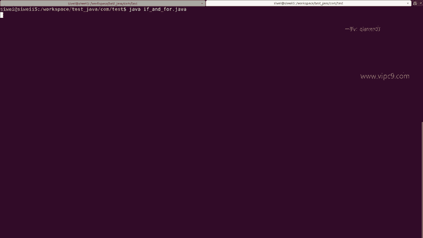

可以看到in true branch。那么这个就不细说了啊，非常简单。下面看一下。三元表达式。三元表达式。先是一个条件判断，然后加一个问号。如果前面这个条件判断是处的话，就返回这个。

否则就返回冒号后面这个。

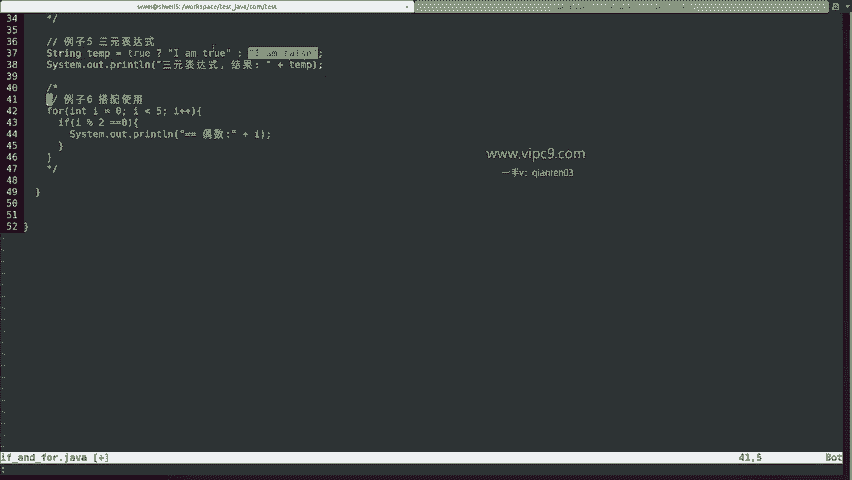

所以说在这里先声明了一个变量，然后给它打印一下，我们看看。啊，可以看到。保存啊，我们再来。嗯，可以看到这里显示3元表达式。

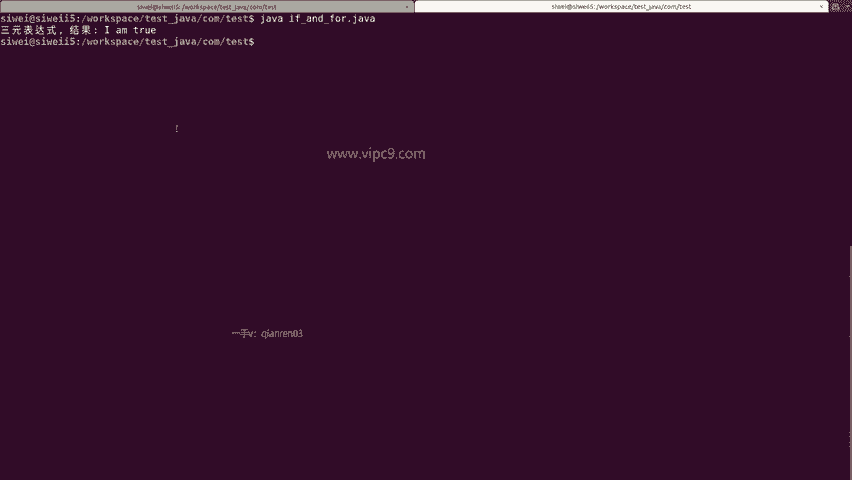

IM true。就是这个。最后我们看一下。他们搭配使用。这里是一个for循环啊，从零开始。只要是小于5的数啊。然后呢，对他做一个判断。如果是偶数的话，就显示出来。所以说这个就是for和if。

他们是可以互相嵌套的。我们看一下。

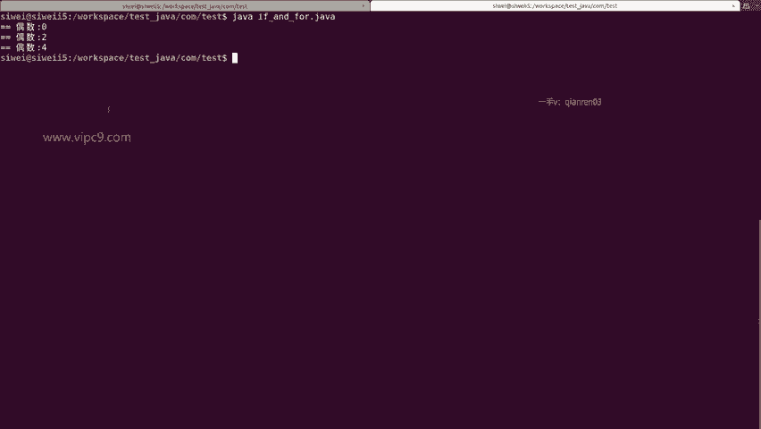

嗯，024。这样就出来了。所以说这个就是。java的循环和条件判断。

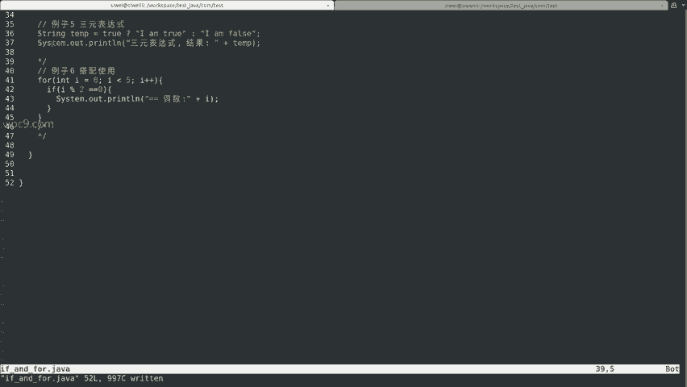