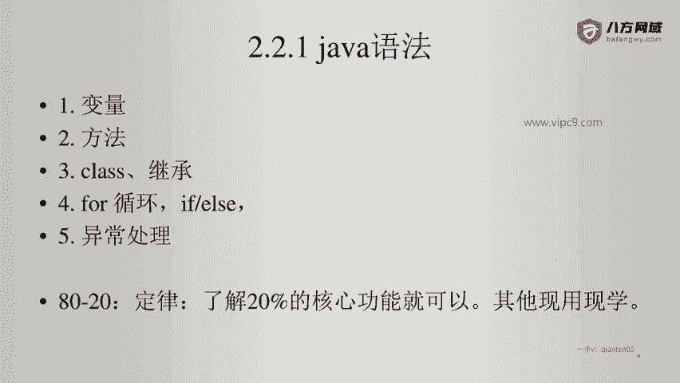
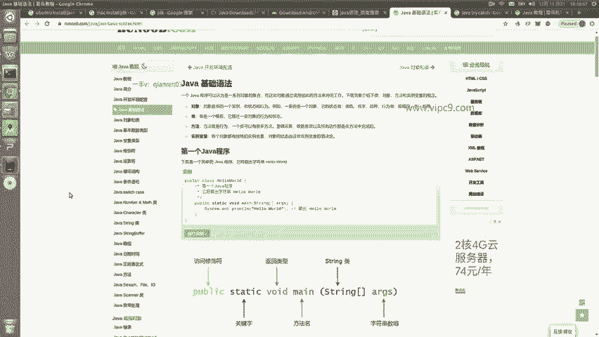
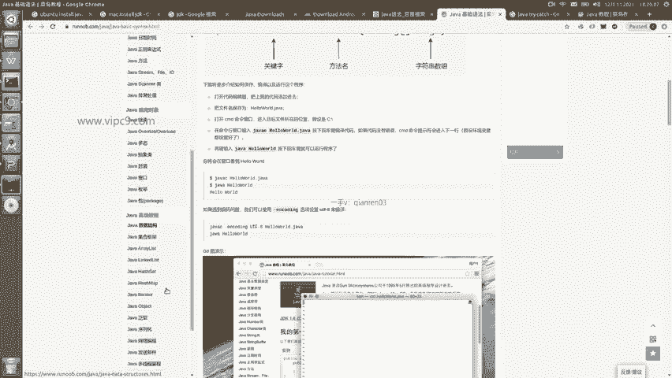
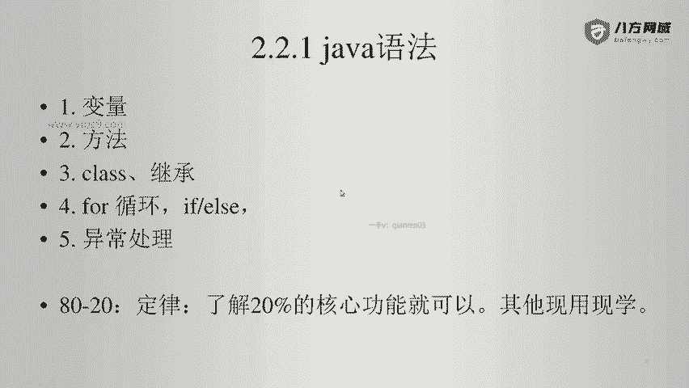

# Android逆向-基础篇 - P13：章节3-6-java语法总结 - 1e0y_s - BV15jhbeCEQk

那么这次的java语法急速入门就到这里了。基本上嗯学习之后呢，大家是能够读懂已有的java代码，并且能够在已有的java代码基础上做一点点修改。其实这个对于我们逆向工程就够了啊。然后很多的语法细节。

我并没有讲啊，因为java语法可以说是世界上教程最多的内容了啊，大家随便百度一下就可以看到有这么多这么多啊，随便找一个菜鸟教程，我们点击进来看一下，就有这么多内容啊。但是大家在学的时候呢，一定要注意。

用到哪块。

就学那块啊，不需要这个长篇累读的都给它学下来。因为很多知识呢，它其实在我们逆向的地方用不到。另外，比如说java的这个appellate啊基础，这个是十几年以前就已经没有人用了啊。

所以说我们都是不需要学的。那么在这里面，如果大家要学的话，可以看中这这么几个点啊。基础语法对象和类数据类型啊，这些都可以看。啊，像这个switch case啊等等，其实用的都很少了。下面这里比如说。

文件啊。异常处理。继承多肽。这些其实是可以看的啊，至于其他的都是用处不大。

好的，那么。java语法就先讲到这里。

