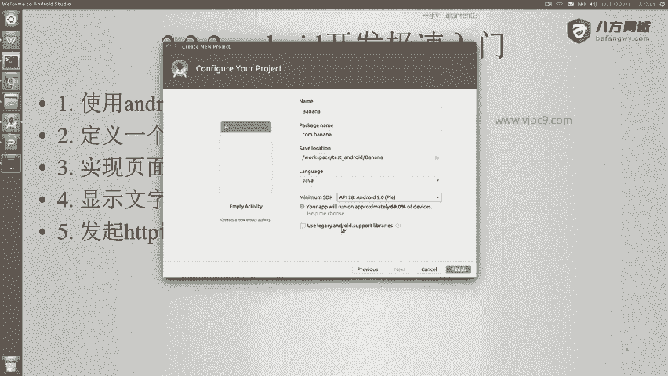
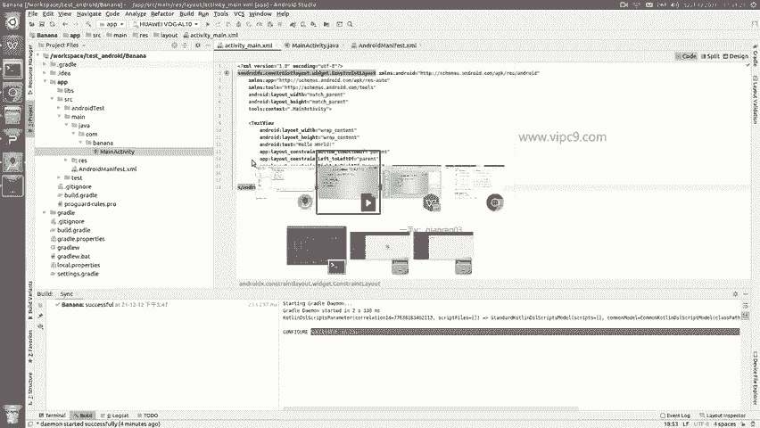
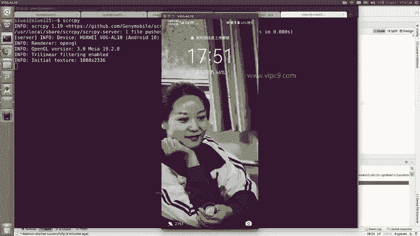
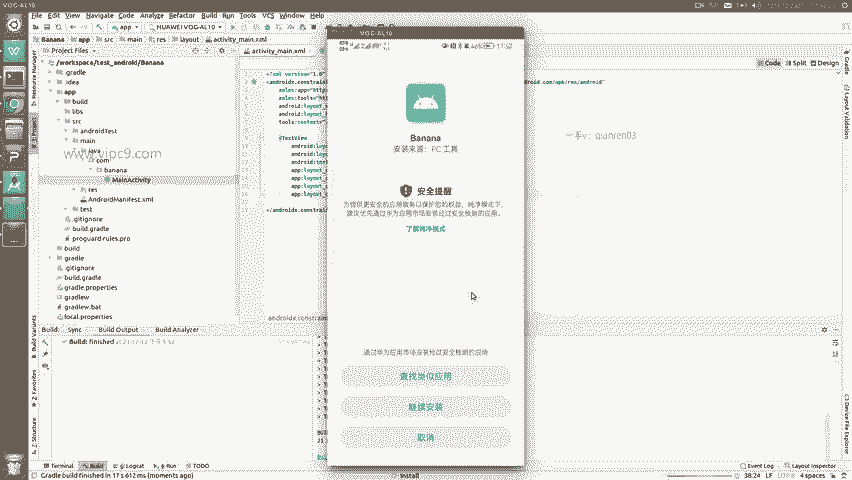
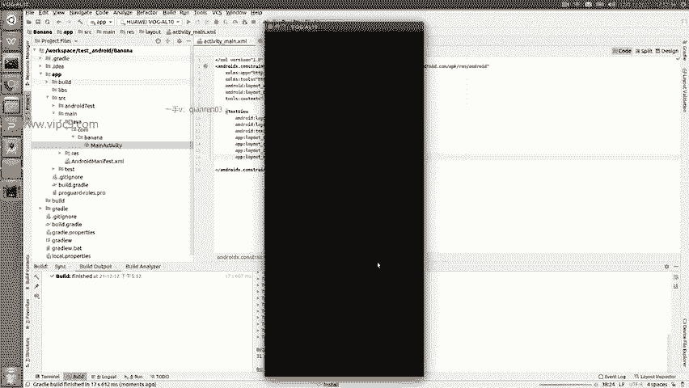
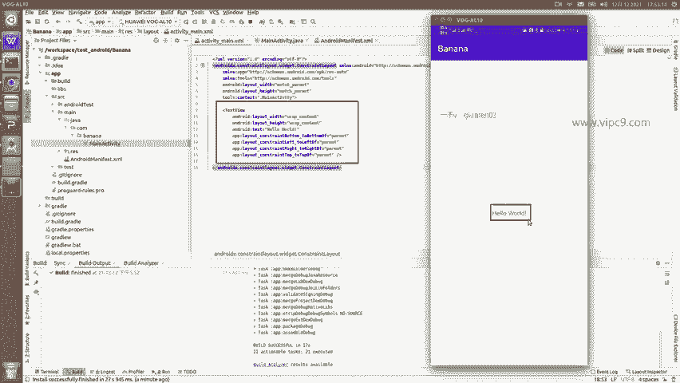

# Android逆向-基础篇 - P14：章节3-7-创建项目并运行 - 1e0y_s - BV15jhbeCEQk

下面我们来学习安卓开发的极速入门。在这里我不会对细节进行过分的深入阐述啊，因为我们的目的是做逆向。那么做逆向的话，只要了解最基本的开发就可以了啊。那么在这里我们会分成这样的几个步骤。首先。😊。

可以使用androidstudio创建并运行项目。第二，我们可以定义一个页面。然后呢，我们再实现第二个页面，并且实现页面的跳转。然后我们再显示文字和图片。第五，可以发起HTTP请求。好的。

那么我们来看一下。打开安卓安roidtio。然后我们选择start a new安roid studio project。创建一个新的项目。在这里的话呢。😊，比如说我们。

只要一个空白的activity吧啊，不要no activity。在这里大家要了解啊，上面这里要选择phone and tablet啊，也就是说第一个就是手机和平板。😊，第二个呢是穿戴，是穿戴设备。

TV啊以及后面的其他的东东。那么在这里我们选择第一个就可以了啊，下面这些布局啊，如果有兴趣的同学的话呢，以后可以再看。Get next。这里起名字，比如说就叫做。First。

enjoy或者啊起个水果的名字吧，比如说大香蕉。package包名啊，那么package这里的话呢，我们给它简短一些啊，不要搞得很长，我们就叫come点 banana就好了。这里比如说。嗯。

保存在哪个路径？好吧，就叫做banana。语言的话可以选择coling或者java。我们在这里选java。这里minum SDDK啊，我们选择28就可以了。API28。

也就是安卓9大约能支持70%的设备。

然后我们finish。这一步的重要性就在于这些内容文件啊。安卓studio都能够帮我们来生成。同时呢大家注意到下面这里。不又点没了啊。嗯，看到没有？Grale。正在。进行相关的工作。

比如说他说正在build model啊，这个时候就是自动化工具正在做。那么在这里底部。可以看到啊。相关的内容。比如说我们点击打开它可以看到这个是命令行。这个呢就是刚才刚才的构建。G启动之后。

用了2秒钟左右啊，就已经准备就绪了。log cat等等，这些我们现在暂时用不上。然后我们准备好手机。我现在把手机已经插进去了，在这里可以看到啊，有个running device啊，这个就是我的实体机。

下面这里是一个可用的机器，虚拟机啊，然后生成的文件，这里我们可以看到。呃，有好几种视图，现在我们看到的这个安卓视图，只是把最常见的文件和文件夹给列出来了啊。实际上如果我们想看一下它里面真实的文件档啊。

真实文件的话，我们可以看这个。Project source files。这个是相关的文件，我们也可以点击这个project files啊，那么这个其实是我最喜欢的。因为在这里啊。

看到的文件的顺序跟我们真实存在的。文件顺序是一样的啊，这个在回头的时候我们再细说。那么这里我们可以看到在对应的目录下已经生成了一个文件夹，叫APPAPP里面有一个叫SRC的文件夹，这个非常重要啊。

SRC文件夹里面有一个main的文件夹。😊，然后在这里面有一个java的文件夹，这几个同学们要给它记好啊，所有的安卓项目它的。文件夹的布局都是一样的。然后在java文件夹里面就是我们的java文件啊。

看到这个main activity了吗？双击打开，可以看到这个main activity继承了APPcomp activity啊，这个类我就不细说了。

我们暂且认为安卓里面所有的页面都是activity啊，哎每个activity都要继承这个副类。😊，然后在这里啊。😊，有一个叫做uncreate这个方法。这个方法呢也是一个特殊的方法。

每次当页面打开的时候都会运行这个方法。第十一行super的uncre啊，这句话不能删，我们就认为它是一个嗯。固定的写法一定要有第十二行set content view在这里啊表示。

这个activity文件会渲染对应的视图文件。我们打开这个视图文件，我是按crl，加上鼠标左键打开的。那么在这里我们可以看到。这个区域啊就是我们的视图区域。实际上呢大家可以不用害怕啊。

在这里看到的是一个可视化的过程。那么我们。可以看到它的源代码在这里。看到了吗？我点击右上角的codes和design。啊，这里就是源代码拆分和设计。

在这里点击源代码就能够看到这个页面视图层其实没有什么内容，只有这一个text view。然后呢，看一下这个text6，它这里。只有一个文字叫做hello world啊，这里大家可能看不清啊。

给它放大一下。能看到吗？Hello world。所以说我们接下来把这个代码给它运行一下。

这个是我的测试机啊。然后我们在安卓stio这里。runAPP看到了吗？build run直接是快捷键shift加F10。点击。这个时候可以看到左下角这里啊一直在不断的动动动啊。

那么这里的话就是gradle在执行它的自动构建任务。这里我先不细说。那么自动构建任务可以看到啊，它在不断的编译运行，打包build finish啊，这里他说build完了。现在这里正在inst。

有没有看到？这个时候打开我的手机啊，我们点击继续安装。他告诉我们说这个怎么怎么怎么样，点继续安装。

好的，我输入了密码刚才出现的黑屏。嗯，那么现在大家就可以看到。😊，这个第一段文字已经显示出来了，也就是说整个页面。这个。是一个。Activity。activity运行之后会渲染对应的叉ML文件。

而这个叉ML文件。有效的内容只有这么一段，就是text view啊。对应了这里。所以说这个非常简单。好。

