# Android逆向-基础篇 - P15：章节3-8-页面之间跳转 - 1e0y_s - BV15jhbeCEQk

下面我们把这个页面做一个修改。现在这个页面是只显示how the world，对不对？那么。我们对它做一点点修改，比如说增加一个按钮，并且把这个文字改一下。那么我们先一步一步来啊。

把刚才要增加的按钮先给它注释掉，然后把这个hello word我们给它改一个名字，就叫做。比如说。你好啊。😔，比如说安卓逆向高手。然后保存controrl S。然后我们点击shift加F10。这样行。

正在安装，点击继续安装。安卓的特点就是。

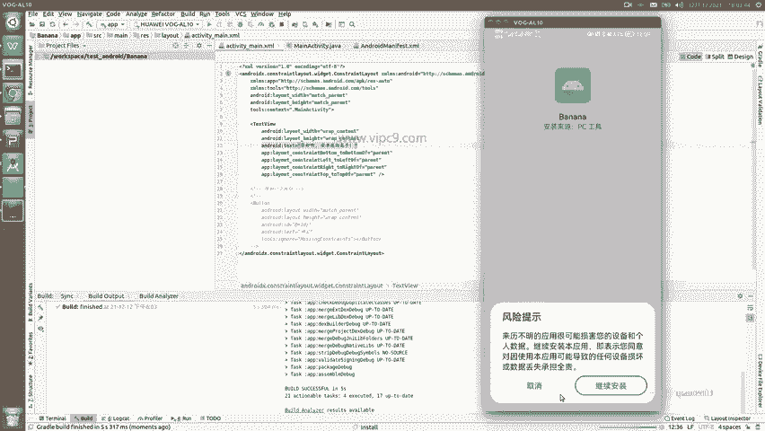

每次。修改代码之后。安卓几乎都要重启啊，这里修改代码指的是包括java文件和叉ML文件。

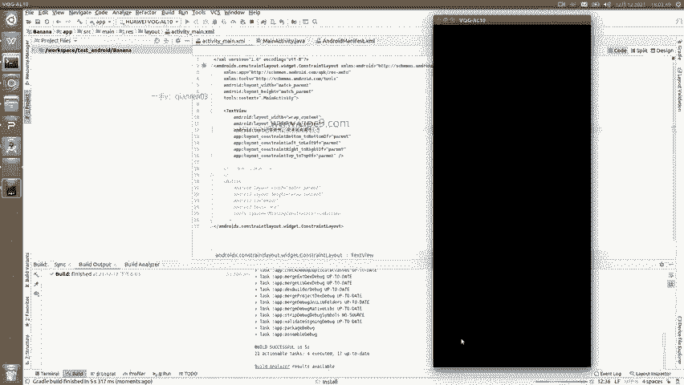

那么现在我们已经看到了我们的修改已经生效了。那么下面我们要做的事儿就是。

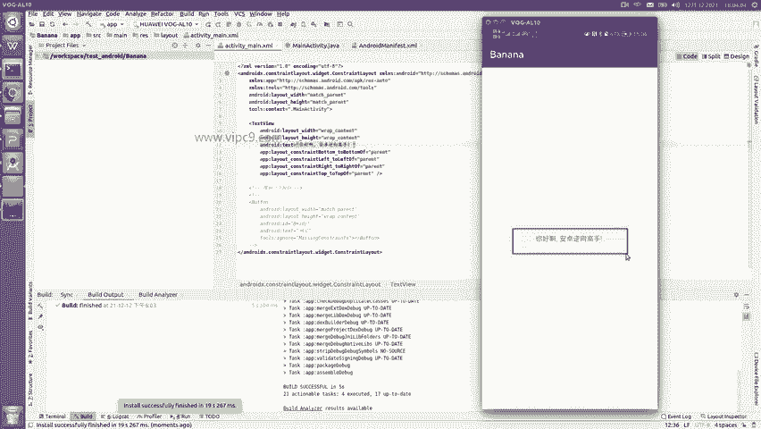

再定义第二个页面，并且实现页面的跳转。

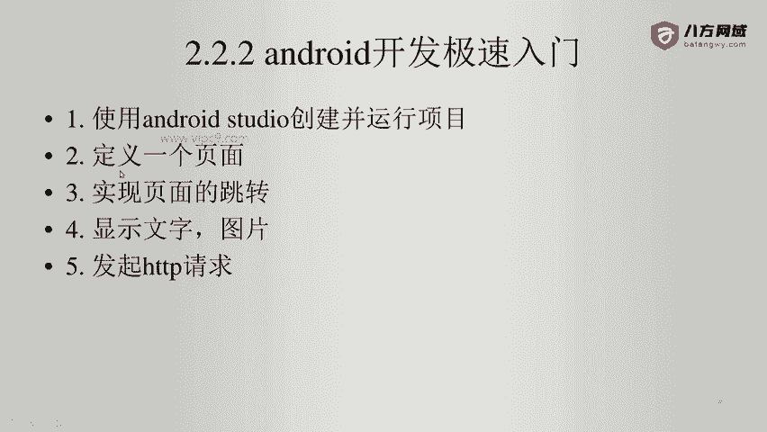

说一下它的原理啊。😊，我们刚才创建了这个项目之后，现在可以看到有一个叫做main activity的文件，还有它对应的这个视图文件叫activity啊。

R点 layoutout点activity main。这个activity内其实啊大家知道。可以看到对应了activity main点叉ML这个文件的位置就在上面可以看到吗？当我把鼠标放上来的时候。

就可以看到放在APPSIRC main目录下的RES文件有个layout。所以说我们打开。SIRC may。RES文件lay out看到这里了吗？这个文件就是我们这个文件的内容。

所以说打开它就来到了这里。然后。这里会有一个问题，就是说我们的这个APP为什么打开之后要显示这个activity页面？也就是说这是一个入口文件，入口文件看这个andjoroid manifest文件啊。

在SRC目录下的ma文件夹这里。那么在这里的话，大家只要看一个。函数或者说看一段代码就可以在这里。可以看到啊，首先这里是所有的activity都要定义在app application这个节点里面。

然后这个application前面这些几乎都可以忽略啊，包括你的安卓APP的图标是什么？你的APP的名字是什么啊，你的包名是什么等等等等。这些我们就先不细说了啊。

那么在这里可以看到点 main activity。😊，这个意思就是入口文件，就是它为什么呢？因为在这里可以看到这个lancher嘛，lancher就是启动的意思。😊，这里是固定的写法。

写死的这个lanncher要写在intent filter里面。那么。activity和XML我们都说好了。下面我们为这个页面增加一个按钮。那么这个按钮样子是长这样。

这个代码是我从其他项目复制粘贴过来的。那么大家在进行安卓开发的时候。也基本上都是有太多的复制粘贴，因为这些东西我们背起来是没有意义的。那么在这里啊发现这个我们把鼠标移上来之后。

他说发现missing value，对不对？我们基本上都是给它增加一个内容。比如说就叫做my button。啊，这里的话为什么ID前面是一个加号？😊，这里我先不细说啊，大家有兴趣的同学自己去看一下文档。

总之这样写的话是没有问题的。然后先保存。保存之后。我们再运行啊，运行记得这个。它的快捷键shift加F10。那么为了给大伙演示，我先让他这样跑一下。

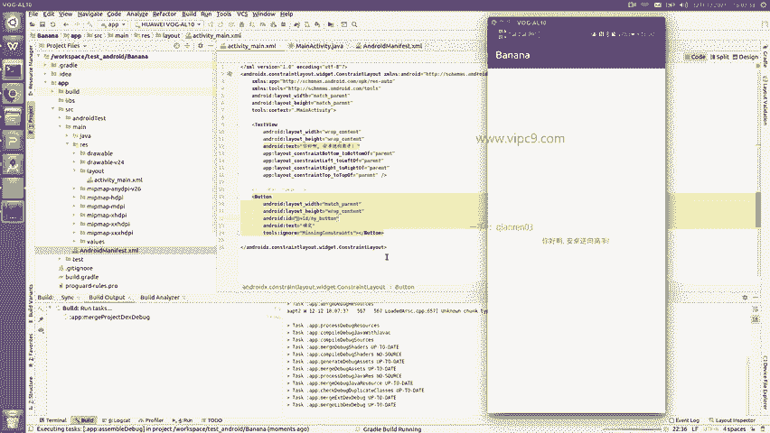

正在安装啊，可以看到这里是banana啊。点继续安装。

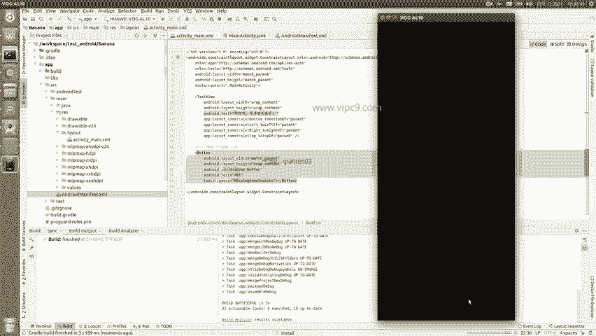

嗯，可以看到，现在我们能看到这个文字，也能看到这个按钮。那么我们先不纠结按钮为什么跑在上面啊，正常来说，按钮应该是在这个文字的下面的。这里会涉及到我们的安卓四大布局，什么表格布局啊，顺序布局啊等等等等。

那么在我们的迅速入门里面也不说我们就认为安卓在进行解析的时候啊，它会有一套自己的逻辑，从上往下解析。只不过从我们现在默认的这个叫constraint layout的时候啊。

就并没有把文字给它从上到下这样安排，我们可以给它改成线性布局linear layout啊，但那个我先不说。那么我们下一步要做的就是点击这个按钮之后，可以跳到第二个页面。我们看一下怎么做。很简单啊。

那么第一步。创建一个activity。现在activity在这里，对不对？😊，我们比如说给他copy。test一下，然后就叫做从main activity叫做。Second page。

activity好吧，不叫连配置都不要不要有啊，就叫second activity。然后在这里呢已经改了名字啊，class名字已经改了。入口的uncreate，这是一个钩子方法啊。

就是说每一个方法在这里，每一个activity在创建的时候都会被执行。然后这个activity是渲染了哪个页面呢？我们就不要叫activity main了，我们就叫做activity second。

对不对？保存，然后再回到刚才的这个目录复制粘贴一下。刚才按了ctrol C和cttrol V啊，那么在这里给它做一个重命名。在这里的话呢，就。好的。修改一下文字。我是第二个。

activityctivity。页面。然后在这里。就叫second button。好了，比如说back。To may。Activity。这里写着。回到。第一个。页没。保存。同时啊大家记住啊。

创建完activity再创建完对应的叉ML文件，要把这个activity。放在。application这个节点里面啊，写法的话跟上面是一模一样的。Fzhi。粘贴。然后呢。把相关的内容我们改一改。

name这里。sed回车。保存。看一下shift加F10。运行一下。安装。继续安装。点击按钮嗯，这个时候我们展示的还是第一个页面。那么现在我把代码加上去之后，它没有报错，说明我加的代码是没有问题的。

也就是说第二个页面已经存在了。只不过现在我们下一步要做的就是实现按钮的点击。回到这里。改一下。点击我跳转到。第二个页面。保存。在这里给它从my button，比如说。Go to second。

Activity。同时我们要回到对应的这里来做一个事件的监听。好的，找到我之前的代码。做一个复制粘贴。这里可以看到啊，红色的字儿就表示。呃，出问题了。看第一个，他说找不到这个symbol。

就找不到这个类怎么办呢？摁LT加enter。😊，摁一下。啊，在这里就import class，对不对？我们就选择第一个。好的，第二个红字，他这里又说了。😊，找不到log in submit，对不对？

为什么？因为我们这个名字变了，我们这里应该叫做这个go to go to second activity。即是我们。按钮的ID啊，看到没有？R点ID点什么什么对应了这里的ID这个。

下面这里他说这个编辑I这个是找不到的，对不对？找不到的话不要紧啊，我们先给它注释掉，等一会儿我们再可以往里面加一点点内容。注射掉之后，我们只要求让这个页面跳转就好了。那我们找一下这个页面是如何跳转的。

就这就这样的话啊。创建一个int啊LT加回车。Intent。this啊this就表示当前的这个activity。跳跳转到哪儿呢？这里。就是我们跳转的目的地，比如说叫second activity。

我们保存，然后这里override这里他说。method does not override from its什么什么，我们看一下为什么。在顶部还需要啊implement这个内容。所以说粘贴。好的啊。

大家记住啊，现在我们要实现一个按钮的话，就是首先要按钮，要有这个事件。第二，当前的activity要实现这个嗯。Listener。然后。跳转的话非常简单啊，只要创建一个intent这个实例。

start activity就可以了。好的，我们保存shift加F10。快速部署。然后找到这个页面啊。

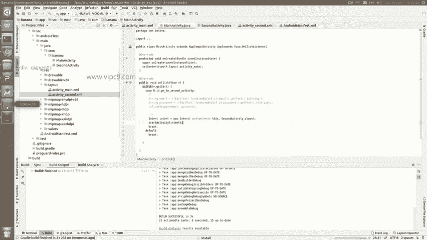

继续安装。

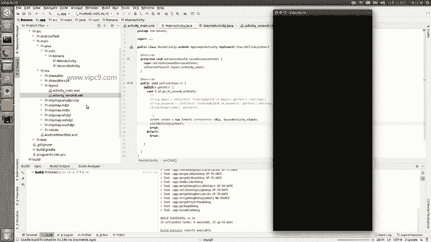

好的，这个页面出来了。点击。好的，他并没有跳转。我们看一下原因。好的，然后我们再加上。这一行代码。在这里面find view by IDD啊，根据这个ID找到对应的视图组件，然后设置了这个。

Un click listener。大家就认为在这行代码里面只需要修改这个ID就可以了。这个ID对应的就是这这个按钮。然后我们再回到。我们刚才的。APP给它重启一下。

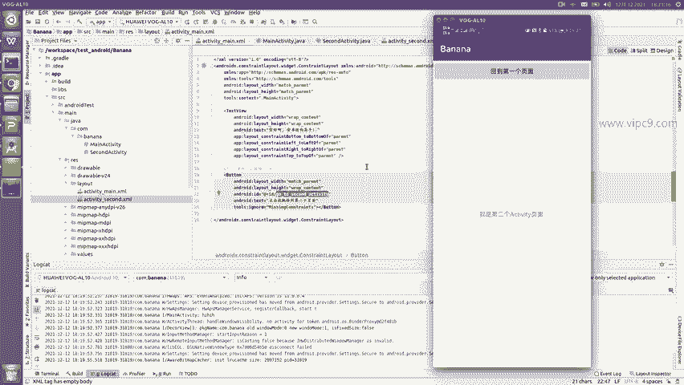

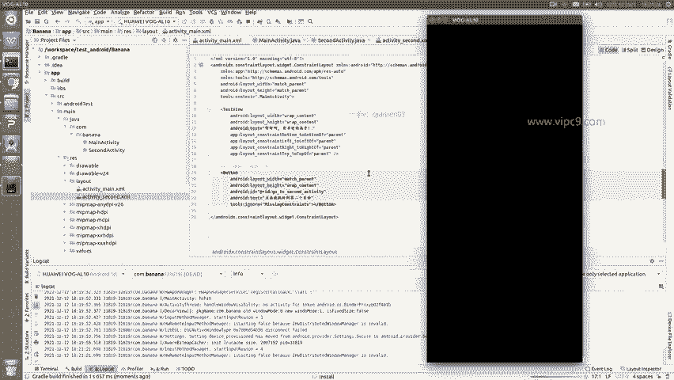

点击。嗯，跳到了第二个页面，对不对？这个时候我们再想让它跳回来啊，就更加简单了。😊，为第二个页面增加一个按钮。嗯，回到第一个页面。好的，已经有了。那么我们就不要叫get了，back了就叫做go to啊。

这边是go to second activity，那这边就叫go to main activity啊，这样的话在名称上他们也是。对应的。然后呢，我们再给它加上对应的。Niong。刚才的啊。重新做一遍。

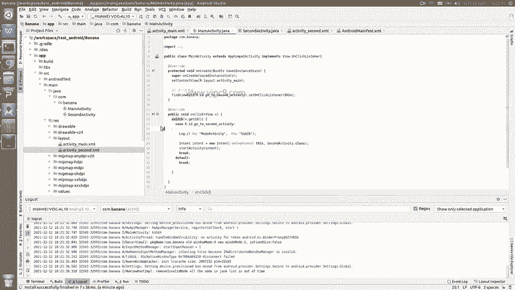

找到这里。然后。给它扩展。或者说实现。

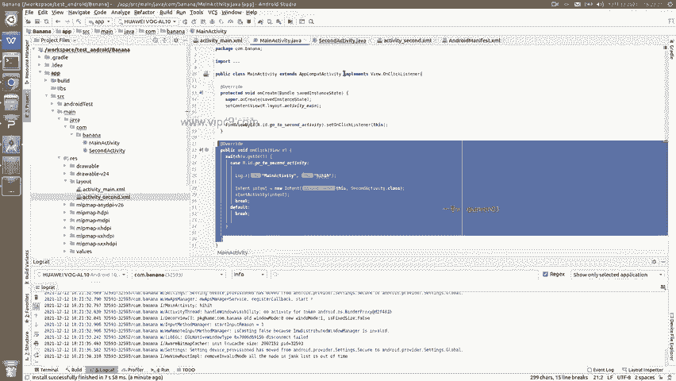

这个lister。最后。再把这个事件给注册一下。这边儿啊。应该叫做go to main activity。所以说我们在这里go to make go to make。同时我们在这里可以啊创建一个。

创建一个log。这里写上。Maactivity。在这边我们也可以给它加上。Log。我们再对一下second activity增加了这些这些内容。好的，我们试一下。shift加F10。重启一下。

点击biil这里啊正在构建。继续安装。

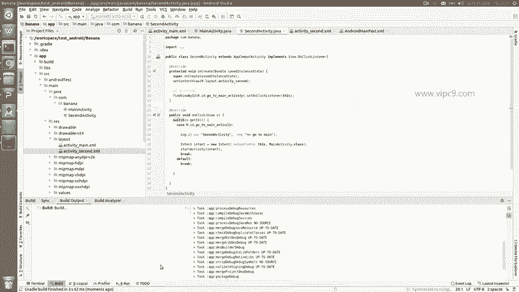

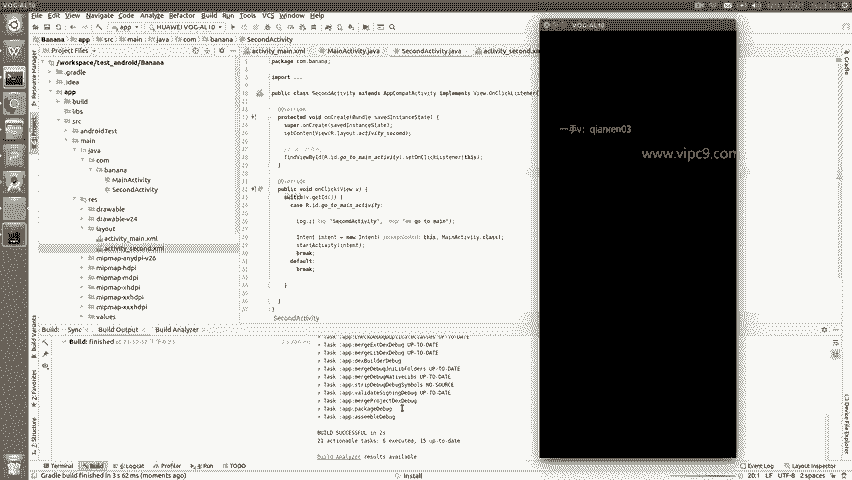

点击跳到第二个页面，再回到第一个页面。看到没有？我们现在就实现了页面不同的页面之间的来回跳转。

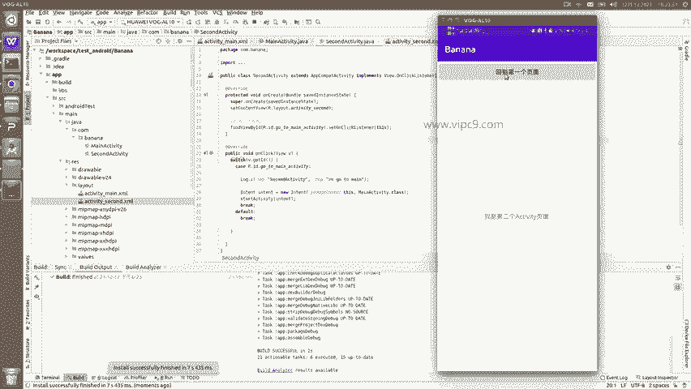