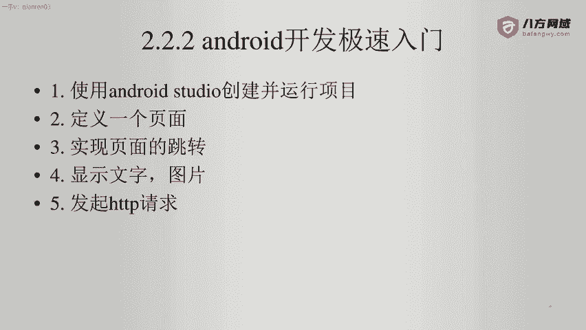
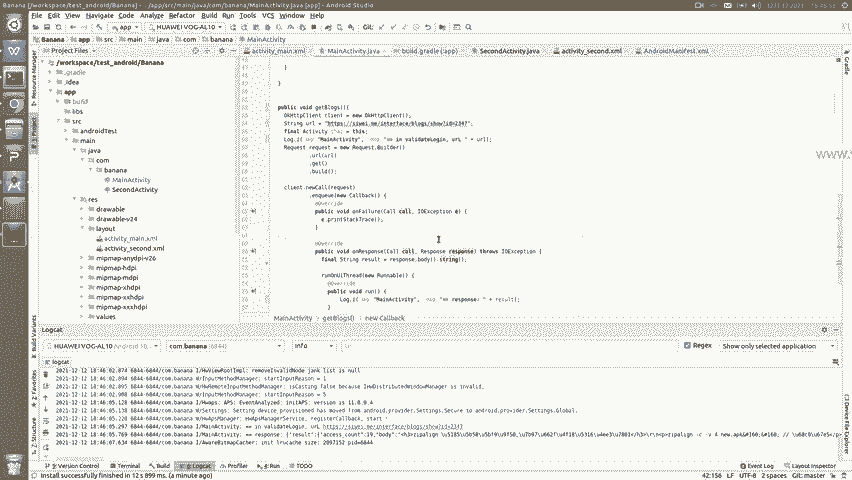
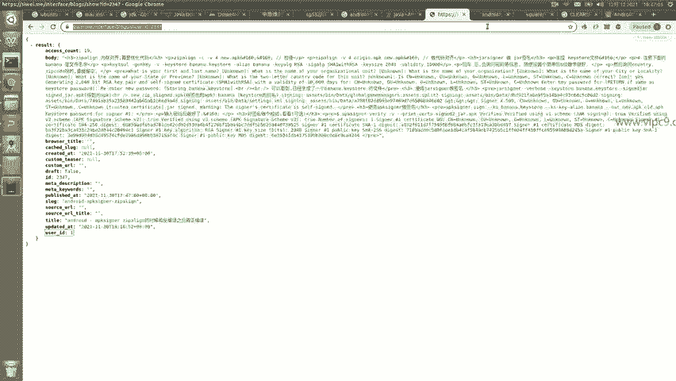
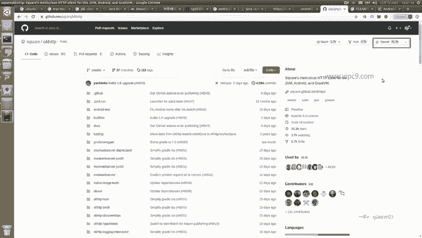
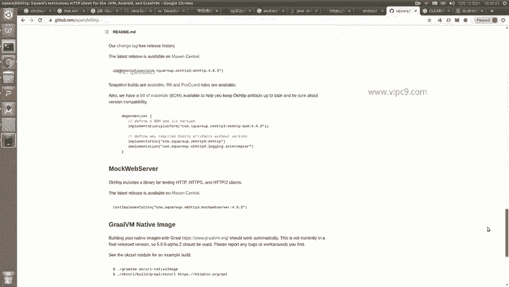
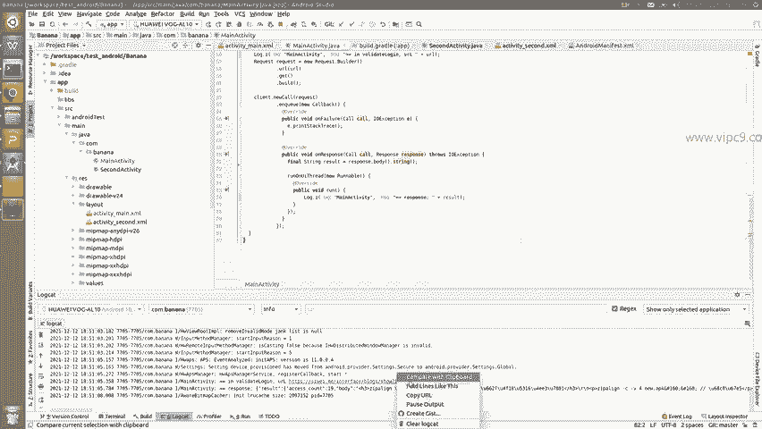
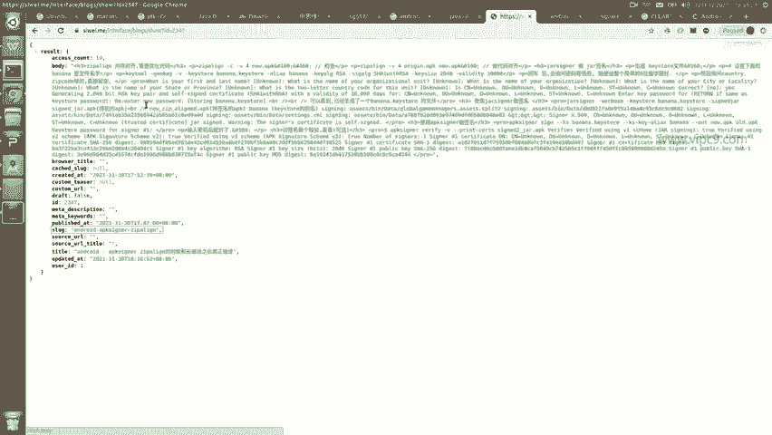
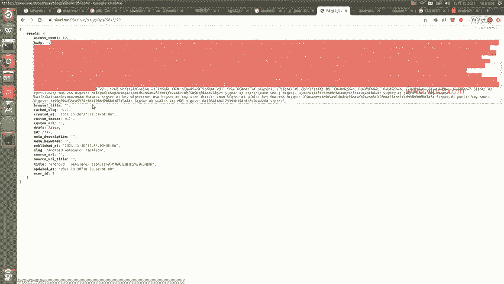
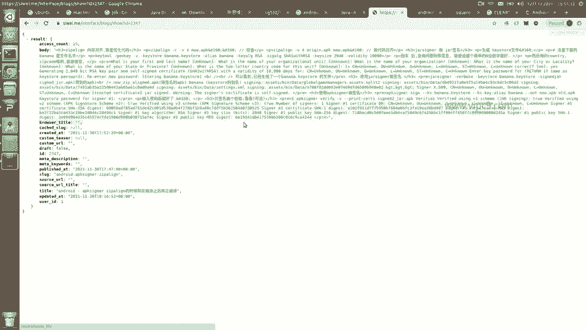
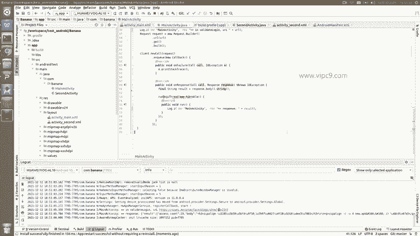

# Android逆向-基础篇 - P16：章节3-9-发起http请求 - 1e0y_s - BV15jhbeCEQk

下面我们看一下如何发起HTTP请求。

那么在这里呢，我们需要一个第三方的库。

叫做OKHTTP。大家可以看到网址是这个啊，这个是目前安卓世界最好用的发起HTTP的组件。那么它现在已经有4万多人在关注它。

在这里大家就可以看到他们的详细用法，这个我先不细说，那么直接就看它的使用。

我们先打开。build点 griddle，那么这个呢是在APP文件夹下。然后增加33行。implementationcom点什么square等等等等。可以看到。

这个就是为当前的安卓项目增加了OKHTTP3。然后增加完之后，我们右上角这里会有一个think什么什么的按钮啊，这个到时候大家让它自动点击一下，点击之后呢，就会自动帮我们来下载这个项目了。😊，然后。

我们在按照的man这个文件里面，先增加上面这一行user permission，这个就表示为我们的APP申请访问internet的权限。然后我们回到首页这里啊，把上面这个。按钮给它改一下。

把上面这个按钮给它改一下啊。好吧，我们先。嗯。给它这么先放着吧，放着的话呢，它会被第二个按钮所覆盖啊，然后新增加了这个按钮，这个按钮的ID就叫做get blocks啊。

比如说内容就是点击我查询远程的一个接口。然后同时我们回到对应的activity。增加一个。按钮刚才的ID是叫get blockss。

然后叫做set on click listener this啊为这个按钮增加监定事件。然后我们。在这里unclick啊，对全局的click事件做一个判定。如果是get blocks的话。

就调用这个get blocks方法。那么在这里的话啊。就是方法体。双外体我们可以看一下。第五十三行。声明了一个实例叫OKHTTP client。然后54行这里。就是一个远程的网址啊。然后下面。57行。

声明了一个request。request呢这里我们认为它的写法是固定的，包括new URLRL是什么？是上面的get，这里就指的是get方法，而不是post的方法啊。

因为我们都知道HTTP请求分成get和post啊，有的时候可能会分成put或者deelete。那么最常见的就是get和post。😊，build这个函反啊这个方法或者函数。

bud这个方法或者函数是不用改的啊，就是这样写的。然后cd点 new call在这里创建了一个inQ方法。然后on failure是怎么样，我们打印它就好了。

on response这个就表示如果能够正常返回内容的话，我们就干嘛干嘛。在这里的话，我们只是把内容。😊，打印到log里面。那么我们下面运行一下。点击。嗯，可以看到点击完之后，先是打印了这个log。

然后又打印了远程的response。这就已经出来了。我们看一下远程的response在浏览器里面是长什么样子。

就长这个样子啊，这个呢是我的个人博客的一个接口，可以看到它分成bodyy啊等等等。下面很多个属性。然后上面这里就是转换后的jason啊，很多都是中文，刚好对应了下面的这个。

这里。